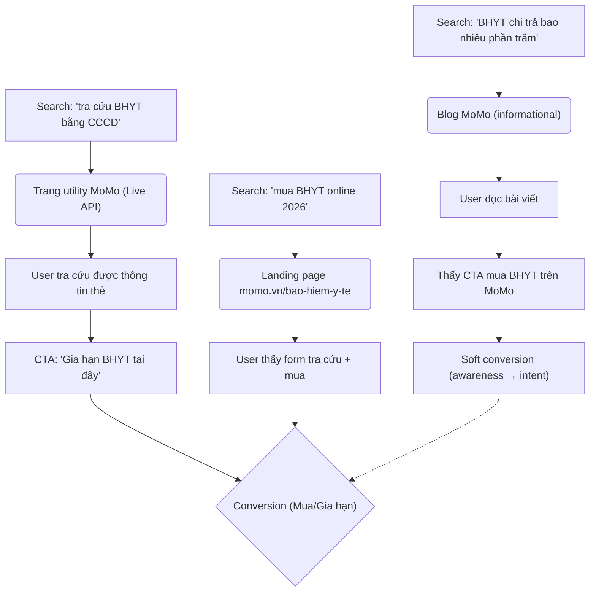
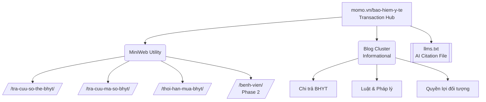

# BRD: Bảo Hiểm Y Tế - Inbound SEO Plan 2026

> - **Project:** BHYT Inbound SEO - MiniWeb Expansion + Blog Production
> - **Main URL:** https://www.momo.vn/bao-hiem-y-te
> - **Division:** Financial Services (InsureTech)
> - **Use Case:** Bảo Hiểm Y Tế
> - **Product:** Bảo Hiểm Y Tế Tự Nguyện
> - **SEO/GEO Project ID:** `bao-hiem-y-te`
> - **Owner:** Out-App Traffic & Inbound Marketing
> - **Governance:** Văn Hiến (SEO & GEO Lead)
> - **BUILD (Web Platform):** Anh Bảo (PM)
> - **EXECUTE (Inbound):** Mai - Inbound Team (BMC) x Vendor Midas
> - **OBSERVE (Tracking):** Thuận (Umami) · Bảo (GA4)
> - **Version:** 1.1 · Tháng 5/2026
> - **Status:** On Track

---

## 1. Executive Summary

**Situation:** BHYT là vertical có tổng search market lớn nhất trong các vertical MoMo đang khai thác, với tổng search volume toàn category đạt trung bình ~525K searches/tháng (2024-2025), đặc biệt tăng tốc mạnh trong 2025 lên đỉnh ~612K searches (tháng 5/2025). MoMo đang cung cấp dịch vụ mua và gia hạn BHYT tự nguyện online tại `momo.vn/bao-hiem-y-te`, với đối tác thu hộ là bảo hiểm PVI (được BHXH Việt Nam ủy quyền). Trang hiện tại có công cụ tra cứu, đóng phí 3-6-12 tháng và blog hỗ trợ.

**Complication:** Hiệu suất organic hiện tại còn rất thấp so với tiềm năng thị trường. Theo lịch sử data từ KPI sheet: web traffic từ Aug 2025 chỉ ở mức ~10K views/tháng (trong đó có ~12,452 views do click ads bị trừ ra). Tính toán dự báo hiện tại (no-intervention trajectory) chỉ ước đạt ~72K views tổng cả năm 2026 - con số không tương xứng với thị trường 525K+ searches/tháng. Nguyên nhân cốt lõi: MiniWeb thiếu các trang phủ intent cao (tra cứu số thẻ bằng CCCD ~18,100/tháng, tra cứu mã số ~12,100/tháng, tra cứu thời hạn ~25,000/tháng) và blog content chưa đủ volume để bao phủ market pool.

**Resolution:** Dự án 2026 triển khai 2 workstream song song: (1) MiniWeb Expansion - build trang utility mới phủ intent tra cứu cao nhất, và (2) Blog Production Scale-Up - từ trạng thái hiện tại (~14 bài) lên 60-150 bài/năm để phủ 20-40% market pool. Base case target: 110,236 views toàn năm 2026 (tăng ~52% vs trajectory hiện tại); Best case: 452,294 views.

---

## 2. Bối Cảnh Hiện Tại

### 2.1 Hiện trạng trang `momo.vn/bao-hiem-y-te`

| Yếu tố | Hiện trạng |
|--------|------------|
| **Chức năng trang** | Tra cứu BHYT + Mua/gia hạn BHYT tự nguyện online |
| **Đối tác** | Bảo hiểm PVI (được BHXH VN ủy quyền thu) |
| **Thời hạn mua** | 3 tháng / 6 tháng / 12 tháng |
| **Điểm mạnh UX** | 93% khách nhận thẻ trong 4 ngày (nhanh gấp 2 thông thường); xử lý hồ sơ online 5 phút |
| **Traffic Aug 2025** | ~10,477 views (incl. ads traffic) |
| **Blog hiện có** | 14 bài published (tra cứu xoay quanh BHYT chi trả thủ thuật cụ thể) |
| **Trang utility bị thiếu** | Tra cứu bằng CCCD, tra cứu mã số, tra cứu thời hạn |

### 2.2 Market Size & Search Demand

| Cluster | Keyword đại diện | Avg. Monthly Volume |
|---------|-----------------|---------------------|
| **Tra cứu BHYT (core)** | tra cứu bảo hiểm y tế | ~90,500 |
| **Bảo hiểm y tế (brand)** | bảo hiểm y tế | ~110,000 |
| **Tra cứu bằng CCCD** | tra cứu BHYT bằng CCCD | ~33,100 |
| **Tra cứu thời hạn** | tra cứu thời hạn BHYT | ~22,200 |
| **Tra cứu số thẻ bằng CMND** | tra số thẻ BHYT bằng CMND | ~18,100 |
| **Mua BHYT online** | mua bảo hiểm y tế online | ~12,100 |
| **Tra cứu mã số** | tra cứu mã số BHYT | ~12,100 |
| **Gia hạn online** | gia hạn BHYT online | ~5,400 |
| **Giá BHYT** | giá bảo hiểm y tế | ~5,400 |
| **Clusters nhỏ hơn (50+ keywords)** | chi trả, trái tuyến, học sinh, hộ gia đình... | ~50,000+ tổng |

**Tổng thị trường (2025 avg.):** ~525,260 searches/tháng  
**Trend:** Tăng trưởng mạnh từ 2022 (avg ~168K/tháng) → 2025 (avg ~525K/tháng), tăng ~3.1x trong 3 năm. Đặc biệt các keyword mới xuất hiện sau 2024 liên quan CCCD và Luật BHYT mới (Nghị định 188, Thông tư 20, Luật 2025) đang tăng tốc.

**Seasonality:** Đỉnh tháng 8-9 (năm học mới, học sinh sinh viên), đỉnh tháng 12 (gia hạn cuối năm), spike tháng 7/2025 liên quan thông tuyến.

### 2.3 Competitive Landscape

Các đối thủ cạnh tranh chính trong SERP: baohiemxahoi.gov.vn, vneid.gov.vn, vssid (app), 123doc, các site tin tức/giải thích BHYT. MoMo có lợi thế unique là điểm đến transaction trực tiếp (mua được ngay) nhưng yếu ở content informational - là nơi user bắt đầu hành trình.

---

## 3. Định Hướng Dự Án

**Dự án này phục vụ điều gì?**  
Tăng organic traffic từ search engine vào `momo.vn/bao-hiem-y-te` và blog BHYT, từ đó drive Web-to-App conversion (user mua/gia hạn BHYT trên MoMo). Mục tiêu trung hạn: MoMo trở thành điểm đến số 1 khi người Việt search bất kỳ thông tin gì về BHYT - từ tra cứu, tìm hiểu chính sách đến mua/gia hạn.

**Ai được phục vụ?**
- Người lao động tự do, freelancer chưa có BHYT hoặc cần gia hạn định kỳ (3-6 tháng)
- Người con mua BHYT cho cha/mẹ ở quê qua MoMo
- Học sinh/sinh viên cần tra cứu BHYT
- Người muốn tra cứu thông tin thẻ BHYT (số thẻ, mã số, thời hạn) bằng CCCD/CMND

**Dự án này KHÔNG phải là gì?**
- KHÔNG build BHYT bắt buộc (đây là sản phẩm của BHXH, không phải MoMo)
- KHÔNG xây dựng tính năng mobile app (do Mobile team đảm nhiệm)
- KHÔNG cover BHYT thương mại (Bảo Việt, PVI Bảo hiểm sức khỏe tư nhân)
- KHÔNG thay thế BRD của Vay Nhanh hay các vertical khác - BHYT là standalone use case

---

## 4. Phạm Vi & Deliverables

### Phase 1 - Preparation (Feb-Apr 2026): MiniWeb Expansion - Priority

| Deliverable | Mô tả | Priority |
|-------------|-------|----------|
| **Trang tra cứu số thẻ BHYT bằng CCCD** | Utility page, volume ~18,100/tháng | P1 |
| **Trang tra cứu mã số BHYT** | Utility page, volume ~12,100/tháng | P1 |
| **Trang thời hạn mua BHYT** | Phủ intent 1-3-6-12 tháng, volume ~25,000/tháng | P1 |

**Lưu ý:** Ba trang trên được đánh dấu "Điều kiện bắt buộc" trong Action Plan - không có sẽ không đạt KPI traffic.

### Phase 2 (Apr-Jun 2026): Blog Scale-Up (Base Case)

| Deliverable | Mô tả | Priority |
|-------------|-------|----------|
| **60 bài blog/năm** (5 bài/tháng) | Cover ~20% market pool | P1 |
| **Backlink plan** (~10 keywords high-conv) | Ngân sách 300tr/năm | P2 |

### Phase 3-4 (Jul-Dec 2026): Full Scale (Best Case nếu resource cho phép)

| Deliverable | Mô tả | Priority |
|-------------|-------|----------|
| **120-150 bài blog/năm** (10-15 bài/tháng) | Cover ~40% market pool | P2 |
| **Top list bệnh viện** (~500 bệnh viện tuyến tỉnh) | MiniWeb Phase 2 | P3 |
| **Backlink plan mở rộng** (~20 keywords) | Ngân sách 500tr/năm | P3 |
| **SEM Support integration** | Backlink vào thời điểm có SEM campaign | P3 |

---

## 5. JTBD Analysis (Keyword-Driven)

### 5.1 Keyword Clusters & Intent Map

| JTBD | Cluster Keywords | Volume đại diện | Intent |
|------|-----------------|-----------------|--------|
| **J1: Tra cứu thông tin thẻ** | tra cứu BHYT, tra cứu bằng CCCD, tra mã số, tra thời hạn | ~170,000+/tháng | Know → Go |
| **J2: Hiểu chi phí / giá BHYT** | giá BHYT, BHYT bao nhiêu tiền, mức đóng, 1 người bao nhiêu | ~25,000/tháng | Know → Buy |
| **J3: Mua / Gia hạn online** | mua BHYT online, gia hạn BHYT online, đóng BHYT online | ~25,000/tháng | Buy |
| **J4: Hiểu quyền lợi & chính sách** | BHYT chi trả như thế nào, trái tuyến, 5 năm liên tục, % chi trả | ~15,000/tháng | Know |
| **J5: Tìm kiếm cho nhóm đặc thù** | BHYT học sinh, BHYT hộ gia đình, BHYT cho cha mẹ, BHYT trẻ em | ~15,000/tháng | Know → Buy |
| **J6: Tra cứu pháp lý & luật mới** | Luật BHYT 2025, Nghị định 188, thông tuyến trung ương | ~10,000/tháng | Know |

### 5.2 JTBD Priority Matrix

**P1 (High volume + High conversion potential):** J3 Mua/Gia hạn Online và J1 Tra cứu thông tin thẻ. Đây là lõi của MiniWeb Expansion - user đang trong hành trình sử dụng BHYT, MoMo intercept và convert sang giao dịch gia hạn.

**P2 (High volume + Awareness):** J2 Chi phí và J4 Quyền lợi. Blog content phủ rộng, nuture user về sau.

**P3 (Segment-specific):** J5 nhóm đặc thù, J6 pháp lý. Quan trọng cho E-E-A-T và authority nhưng conversion thấp hơn.

### 5.3 User Journey Mapping

---

## 6. Success Metrics

### 6.1 North Star: Organic Sessions (Traffic Growth)

| Metric | Baseline (Aug 2025) | Current Trajectory (no-action) | Base Case Target (EOY 2026) | Best Case Target (EOY 2026) |
|--------|--------------------|---------------------------------|-----------------------------|------------------------------|
| **Monthly Web Views (organic)** | ~10,477 | ~7,977/tháng (Dec 2026 est.) | ~16,064/tháng (Dec 2026) | ~[cần tính Best Case monthly] |
| **Total Views 2026** | - | ~72,602 | **110,236** | **452,294** |
| **Leads (CVR ~3%)** | ~214/tháng | ~2,204 tổng | ~3,119 tổng | ~[cần verify Best Case] |

**Rationale target:** Base Case (110K views) = tăng 52% vs no-action trajectory (72K) thông qua MiniWeb Expansion + 60 bài blog/năm. Best Case (452K views) = nếu scale lên 120-150 bài/năm + backlink mạnh.

### 6.2 Secondary Metrics

| Metric | Baseline | Target | Timeline | Source |
|--------|----------|--------|----------|--------|
| **Ranking position - P1 keywords** (tra cứu BHYT, BHYT online) | [cần đo từ SEO tool] | Top 5 | Q3 2026 | Ahrefs/Semrush |
| **Keyword coverage (Top 10)** | [cần đo] | +50 keywords mới Top 10 | EOY 2026 | GSC |
| **Blog articles published** | 14 bài | 60 bài (Base) / 150 bài (Best) | EOY 2026 | CMS |
| **MiniWeb utility pages live** | 0 | 3 trang | Q2 2026 (Phase 1) | Web Platform |
| **W2A %CR** | [cần đo từ Appsflyer] | [cần đặt target sau khi có baseline] | EOY 2026 | Appsflyer |

---

## 7. Chiến Lược Nội Dung & E-E-A-T (YMYL Strategy)

> [!IMPORTANT]
> **YMYL & E-E-A-T Compliance:** Bảo Hiểm Y Tế thuộc nhóm YMYL (Your Money or Your Life). Google cực kỳ khắt khe về tính chính xác và thẩm quyền. Toàn bộ nội dung bắt buộc phải có thông tin kiểm duyệt (Author/Reviewer Profile từ PVI hoặc chuyên gia luật) và trích dẫn trực tiếp nguồn chính phủ.

### 7.1 Content Architecture & AEO

*   **AEO (AI Engine Optimization):** Triển khai file `llms.txt` tại `momo.vn/bao-hiem-y-te/llms.txt` chứa dữ liệu sạch về luật và mức đóng. Mục tiêu: Chiếm lĩnh vị trí trích dẫn số 1 (Source of Truth) trên Perplexity, ChatGPT và Google AI Overviews.
*   **Blog Cluster (`/bao-hiem-y-te/blog/`):** Phải có Box Tác Giả là chuyên gia. Nội dung cấm đưa ra lời khuyên pháp lý sai lệch, luôn hướng user tra cứu thông tin trên tính năng của MoMo.

### 7.2 Blog Content Priority Matrix (E-E-A-T Compliant)

| Priority | Topic Cluster | Keywords | Estimated Volume | YMYL & Compliance Rule |
|----------|--------------|----------|-----------------|-------------------------|
| P1 | Chi trả BHYT theo thủ thuật/xét nghiệm | chụp CT/MRI/nội soi có BHYT | ~10,000+/tháng | Trích dẫn danh mục chi trả của Bộ Y Tế. |
| P1 | Tra cứu hướng dẫn | cách tra cứu BHYT, BHYT bằng CCCD | ~8,000+/tháng | Dùng screenshot UI/UX thực tế từ App/Web MoMo. |
| P1 | Mua BHYT cho nhóm đặc thù | cha mẹ, người nghỉ việc, bà bầu, trẻ em | ~15,000+/tháng | Trích dẫn định nghĩa nhóm đối tượng theo Luật BHYT. |
| P2 | Quyền lợi & chính sách | BHYT chi trả %, 5 năm liên tục, trái tuyến | ~15,000+/tháng | Cần Legal Team hoặc PVI review trước khi publish. |
| P2 | Luật & pháp lý | Luật BHYT 2025, Nghị định 188, thông tuyến | ~10,000+/tháng | Bắt buộc Link-out tới trang chinhphu.vn hoặc thuvienphapluat. |
| P3 | Giá & chi phí | BHYT bao nhiêu tiền, bảng giá 2025-2026 | ~15,000+/tháng | So sánh rõ ràng mức phí giữa HSSV và Hộ gia đình. |

---

## 8. Dependencies & Constraints

| Dependency | Owner | Mô tả | Blocker? | Status |
|------------|-------|-------|----------|--------|
| **MiniWeb 3 trang utility** | Inbound + Web Platform (Bảo) + BU/PO | Build trang tra cứu CCCD, mã số, thời hạn - cần API từ BHXH VN hoặc PVI | **YES** | Đã có API, tiến hành build UI |
| **API tra cứu BHYT** | PO Cell / BU | API để trang utility hoạt động thực tế | **NO** | **Live** |
| **Blog Production capacity** | Inbound (Mai) x Vendor Midas | 5-15 bài/tháng outsource toàn bộ cho Vendor | NO | **Live (Vendor Midas)** |
| **Blog Plan 2026 từ Mai** | Inbound (Mai) | Keyword plan cho blog được reference trong action sheet | YES | "Nhờ c Mai cho blog plan 2026" - chưa nhận |
| **Backlink vendor** | Inbound x Procurement | Vendor outreach, budget approval 300-500tr | NO | **Live (Vendor Midas)** |
| **GA4 + GSC tracking** | Web Platform (Bảo) | Tracking organic traffic phân tách ads vs organic | YES | [cần verify - hiện có note "trừ 12,452 do click ads" cho thấy tracking chưa sạch] |
| **Appsflyer W2A tracking** | Web Platform (Bảo) | Track conversion từ web sang app cho BHYT flow | YES | [cần đo baseline] |
| **SEM campaign calendar** | Media team | Backlink sẽ deploy cùng thời điểm SEM | NO | Tùy Media plan |

**Constraints:**
- Trang phải comply với quy định bảo mật thông tin BHXH (user input CCCD/CMND phải xử lý đúng luật)
- Content BHYT thuộc YMYL - cần review chính sách, không được thông tin sai về quyền lợi pháp lý
- Đối tác duy nhất hiện tại là PVI - mọi claim về dịch vụ phải align với scope PVI được ủy quyền

---

## 9. Risk Assessment

| # | Rủi ro | Loại | Khả năng | Impact | Mitigation |
|---|--------|------|----------|--------|------------|
| R1 | Duy trì năng lực sản xuất 5 bài blog/tháng | Execution | Thấp | Cao | Outsource toàn bộ content cho Vendor Midas |
| R2 | MiniWeb utility không có API → 3 trang quan trọng không launch được | Technical/Product | Trung bình | Rất cao | Confirm API availability với PO ngay từ Phase 1; nếu không có API, làm trang hướng dẫn tĩnh trước |
| R3 | Tracking organic vs paid chưa sạch → KPI không đo được chính xác | Data | Cao | Cao | Yêu cầu Web Platform phân tách GA4 source/medium trước khi launch |
| R4 | Competitor (gov site, news site) outrank do domain authority cao hơn | Market | Cao | Trung bình | Focus keyword long-tail trước, tích lũy content volume; backlink plan hỗ trợ core keywords |
| R5 | Search intent shift sau khi Luật BHYT mới hiệu lực (1/7/2025 - thông tuyến) | Market | Đã xảy ra | Trung bình | Cần refresh keyword research định kỳ; ưu tiên content về thông tuyến và chính sách mới |
| R6 | Content BHYT sai thông tin pháp lý → vi phạm YMYL, Google penalty | Technical/Legal | Thấp | Rất cao | Bắt buộc review pháp lý cho mọi content về quyền lợi, mức đóng, chi trả |

---

## 10. Next Steps

| # | Deliverable | Owner | Description | Target Date |
|---|-------------|-------|-------------|-------------|
| 1 | **Tích hợp API tra cứu BHYT** | Inbound x PO Cell | Triển khai API vào trang utility thực tế | **Completed** |
| 2 | **Blog Plan 2026 từ Mai** | Inbound (Mai) | Nhận keyword plan và content calendar cho 60 bài đầu tiên | T5/2026 |
| 3 | **Tracking audit GA4 + Appsflyer** | Web Platform (Bảo) | Phân tách organic vs paid traffic, setup W2A baseline | T5/2026 |
| 4 | **PRD MiniWeb 3 trang utility** | Inbound x Web Platform | Spec chi tiết cho tra cứu CCCD, mã số, thời hạn | T6/2026 |
| 5 | **Keyword ranking baseline** | Out-App Traffic (Klaus) | Đo current ranking P1 keyword set làm baseline KPI | T5/2026 |
| 6 | **Triển khai chiến dịch Backlink** | Inbound x Procurement | Phối hợp Vendor Midas chạy backlink Phase 2 | **Completed** |
| 7 | **Content brief template** | Inbound x Out-App Traffic | Template chuẩn cho blog BHYT (YMYL rules, intent-match, MoMo CTA rules) | T6/2026 |
| 8 | **QA & schema validation** | Web Platform | Schema FAQPage/HowTo cho MiniWeb pages sau launch | T7/2026 |

---

## Appendix A: Keyword Pool Summary

**Tổng market pool (toàn bộ BHYT category):** ~525,260 searches/tháng (avg 2025)

**Top 15 keywords theo volume (avg monthly):**

| Keyword | Avg. Volume |
|---------|-------------|
| bảo hiểm y tế | 110,000 |
| tra cứu bảo hiểm y tế | 90,500 |
| tra cứu bảo hiểm y tế bằng cccd | 33,100 |
| tra cứu thời hạn bảo hiểm y tế | 22,200 |
| tra số thẻ bảo hiểm y tế bằng cmnd | 18,100 |
| tra bảo hiểm y tế | 14,800 |
| mua bảo hiểm y tế online | 12,100 |
| tra cứu mã số bảo hiểm y tế | 12,100 |
| kiểm tra bảo hiểm y tế | 9,900 |
| mua bảo hiểm y tế ở đâu | 8,100 |
| mua bảo hiểm y tế | 6,600 |
| mã thẻ bảo hiểm y tế | 6,600 |
| gia hạn bảo hiểm y tế online | 5,400 |
| giá bảo hiểm y tế | 5,400 |
| tra mã bảo hiểm y tế | 5,400 |

**Addressable market (MoMo-relevant, loại gov-only):** [cần verify - ước tính 60-70% total, ~315-370K/tháng]

---

## Appendix B: Data & Items Cần Verify

- [ ] Baseline W2A %CR từ Appsflyer cho BHYT flow
- [ ] Current organic ranking P1 keywords từ SEO tool
- [x] API tra cứu BHYT từ PVI/BHXH - đã hoàn thành trên momo.vn/bao-hiem-y-te
- [ ] Blog plan 2026 chi tiết từ team Inbound (Mai)
- [ ] Best Case monthly breakdown (traffic model sheet)
- [ ] Addressable market (loại keyword không phù hợp MoMo)
- [x] Ngân sách backlink - đã chốt và duyệt cho Vendor Midas

---

*BRD này được tạo dựa trên: XLSX Inbound Plan 2026 (Action Plan, KPI, Trendline, Blog sheets) + page audit `momo.vn/bao-hiem-y-te` tháng 5/2026. Các số liệu có source từ XLSX; các items chưa có data được đánh dấu [cần verify].*

---

### 🔗 Reference & Alignment
*   **Strategic Vision:** [[01_STRATEGIC_PLAN/seo-geo-direction|SEO & GEO Direction]] & [[01_STRATEGIC_PLAN/web-momo-okrs-2026|Web OKRs 2026]]
*   **Content Playbook:** [[01_STRATEGIC_PLAN/momo-content-plan-strategy|Content Strategy Plan (Utility Layer)]]
*   **Technical Platform:** [[04_MOSPARK_PLATFORM/mospark_master|MoSpark Master]] & [[04_MOSPARK_PLATFORM/mospark_genai_content|GenAI Content Engine]]
*   **Execution Tracking:** [[04_MOSPARK_PLATFORM/mospark_seo_geo_playbook|SEO/GEO Playbook]]

---

## Change Log
- **Tháng 5/2026 (v1.1):**
  - Kỹ thuật: Cập nhật trạng thái API Tra cứu BHYT thành **Live**.
  - Vận hành: Chốt **Vendor Midas** phụ trách mảng Blog Production và Backlink Phase 2, giải quyết rủi ro thiếu nguồn lực Inbound.
  - Chiến lược nội dung: Bổ sung tiêu chuẩn **E-E-A-T (YMYL)**, chiến thuật AEO (`llms.txt`), và cập nhật sơ đồ cấu trúc Hub & Spoke.
