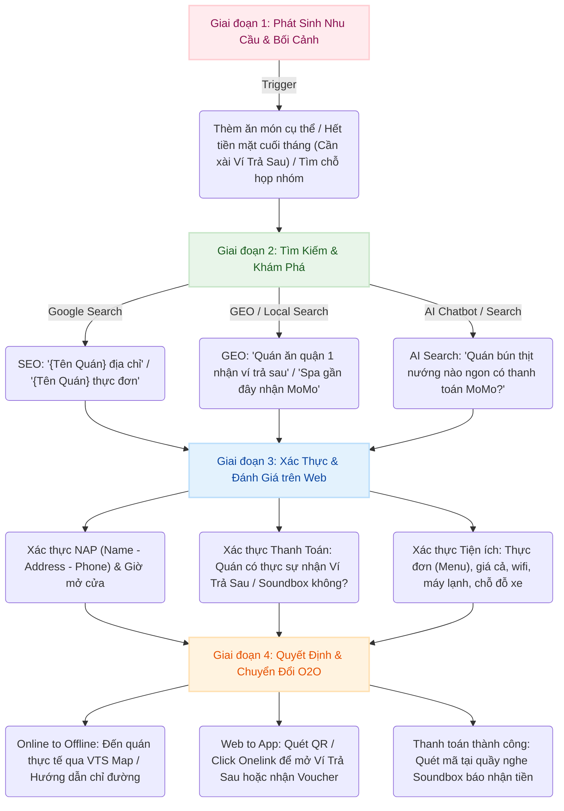
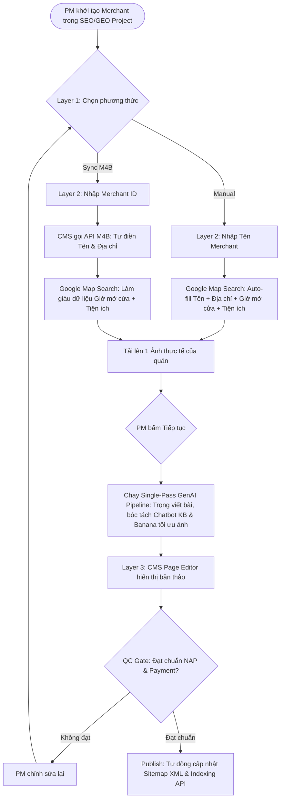
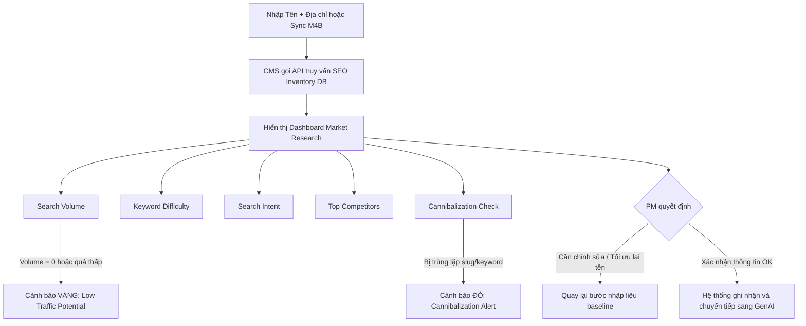

# BRD: Merchant Detail Page

> - **Project:** Merchant Detail Page (SME Digital Presence + O2O Ecosystem)
> - **Main URL:** momo.vn/merchant
> - **Division:** GPD (Growth Platform Division)
> - **Use Case:** Merchant Pages
> - **Owner:** GPD - Web Platform
> - **Governance:** SEO & GEO Lead
> - **PIC Build:** Nhật (Build Lead) - Hoài Anh (MoSpark Architecture)
> - **Version:** 2.6 - 2026-05-29
> - **Status:** Pilot Phase - 39 Merchants Live (Phase I Pilot)

---

**Vấn đề (Problem):**
*   **Rò rỉ Search Traffic:** Sự thiếu hụt nền tảng hiển thị đối tác (Merchant Detail Page) trên Web dẫn đến việc rò rỉ lượng truy cập có ý định giao dịch cao (High Purchase Intent) sang các trang danh bạ của bên thứ ba.
*   **Đứt gãy luồng O2O:** SME offline hoàn toàn vô hình trước Google Search & AI Engines, làm mất đi điểm chạm tự nhiên để MoMo kích hoạt các sản phẩm trong hệ sinh thái (Ví Trả Sau, Soundbox, Hoàn tiền).

**Chỉ số KPI chịu trách nhiệm (KPI Owned):**
*   Tăng trưởng lượt kích hoạt Ví Trả Sau (VTS Activations) & Tương tác O2O (O2O Engagement) từ `momo.vn/merchant` (đo lường và ghi nhận qua Appsflyer + Umami).

**Giá trị cốt lõi cho SME (SME Value Prop):**
*   Sở hữu diện diện số (Digital Assets) hoàn toàn miễn phí trên Web (momo.vn) và các câu trả lời của AI Agent (AI Search Responses) mà không tốn chi phí marketing.

---

## 1. Executive Summary

### Situation

Hai vấn đề song song trong một kiến trúc.

**Phía Consumer:** User search "{Merchant} có nhận Ví Trả Sau không" là nhóm có purchase intent cao nhất có thể capture trên Web - họ đã chọn merchant, đã chọn phương thức thanh toán, chỉ cần một xác nhận. MoMo không có trang nào serve được intent này ở cấp độ merchant cụ thể. 85K organic traffic/quý đang chảy vào 2 legacy systems không có conversion goal: `/thanh-toan-momo-{merchant}` (18K, content outdated 5-7 năm) và `/page/{id}` (67K, thin content không cập nhật).

**Phía SME:** Merchant nhỏ - quán bún thịt nướng, tiệm cà phê, hàng chả giò - không có website, không có ngân sách digital marketing. Họ hoàn toàn vô hình trên Google Search và AI engine khi user tìm kiếm. MoMo có hạ tầng web và merchant data để tạo Digital Presence cho họ miễn phí, đổi lại merchant có động lực adopt ecosystem O2O (Soundbox + VTS + Hoàn tiền).

### Complication

Consumer traffic với intent cao nhất đang thoát ra tay bên thứ 3 - không có conversion. SME không thể tự build Digital Presence. 2 legacy systems không chỉ không convert - chúng là gánh nặng: crawl budget waste, thin content kéo giảm site quality toàn domain, keyword cannibalization với kiến trúc mới.

ZaloPay đã build `/doi-tac/{merchant}` cho F&B chains nhưng chưa khai thác BNPL và SME angle - đây là cửa sổ cơ hội MoMo đi trước.

### Resolution

`momo.vn/merchant/{slug}` là một **SME Digital Presence product**, không phải trang thông tin. Product có hai jobs song song:

**Job 1 - SME:** Mỗi merchant dù nhỏ đến đâu đều có một trang truyền thông đầy đủ trên momo.vn: UI tốt, hiển thị SERP, xuất hiện trong AI responses. Miễn phí. MoMo tạo và maintain - merchant không cần tự build hay bảo trì.

**Job 2 - Consumer:** User xác nhận ngay merchant có nhận MoMo/VTS không và kích hoạt O2O trong 3 bước - không cần đọc dài.

4 template variants phục vụ đa dạng merchant từ brand chain đến SME cơ bản. QR code tại điểm bán kết nối offline với Digital Presence. Schema markup đảm bảo xuất hiện trong AI Overview và LLM - GEO moat dài hạn. Song song 301 redirect 2 legacy systems để consolidate authority vào 1 architecture sạch.

**Value exchange:** MoMo tạo Digital Presence miễn phí cho SME → SME adopt Soundbox/VTS → Consumer có O2O trải nghiệm tốt → Transaction volume tăng.

---

## 🚀 PHASE I: FOUNDATION & MEGA CAMPAIGN PILOT

## 2. Bối Cảnh Thị Trường

### 2.1 Hiện Trạng Legacy Systems

| System | URL Pattern | Organic Traffic | Vấn đề chính |
|---|---|---|---|
| Merchant Landing Pages | /thanh-toan-momo-{merchant} | 18K/quý | Content outdated 5-7 năm, không có O2O angle, không có schema |
| Thổ Địa Ăn Uống | /page/{id} | 67K/quý | Thin content quy mô lớn, thông tin sai (quán đóng cửa), crawl budget waste |

### 2.2 Vấn Đề Chất Lượng Web Từ Legacy

- Google đánh giá chất lượng ở site-level (Helpful Content System). Tỷ lệ lớn thin/outdated content kéo giảm ranking toàn bộ momo.vn.
- Crawl budget bị phân tán vào hàng nghìn trang giá trị thấp - trang mới `/merchant` bị crawl chậm hơn.
- Keyword cannibalization: 3 URLs (legacy + /merchant mới) cạnh tranh cùng merchant query.

### 2.3 Phân Tích Cạnh Tranh

| Competitor | Hiện trạng | Khoảng trống MoMo có thể tận dụng |
|---|---|---|
| ZaloPay | Build merchant directory F&B chains. Chưa có SME angle, chưa có BNPL, chưa có FAQ/HowTo schema | MoMo đi trước: SME + O2O stack + AI citation |
| Klarna (quốc tế) | merchant.klarna.com với "Pay in 4" per merchant | BNPL-first merchant directory model |
| Google Business Profile | Free local listing nhưng không integrated với payment/O2O | MoMo lợi thế: O2O loop hoàn chỉnh (Soundbox + VTS + Cashback) |

### 2.4 SME Digital Gap - Core Insight

SME nhỏ chiếm phần lớn merchant base của MoMo nhưng:
- Không có website
- Không có ngân sách digital marketing
- Hoàn toàn vô hình trên Google Search và AI engine
- Không có điểm tiếp xúc digital với khách hàng ngoài mạng xã hội cá nhân

MoMo có đủ điều kiện giải quyết gap này: domain authority momo.vn, merchant data, platform MoSpark, và O2O product stack để làm value prop thuyết phục với SME.

---

## 3. Định Hướng Dự Án

### 3.1 Dự Án Này Phục Vụ Điều Gì?

**Dual-sided product - 3 điểm kết nối:**

**Cho SME:** Mỗi `momo.vn/merchant/{slug}` là Digital Presence page hoàn toàn miễn phí, không cần tự build hay bảo trì. Tại đây, MoMo đóng vai trò là hệ sinh thái toàn diện cung cấp các giải pháp thiết thực cho SME bao gồm:
- **Giải pháp thanh toán số & Soundbox:** Tối ưu hóa việc nhận tiền qua mã QR và thanh toán Ví Trả Sau (VTS) an toàn. Đặc biệt, thiết bị **Soundbox** phát âm thanh xác nhận giao dịch thành công tại quầy ngay lập tức, giúp chủ quán/thu ngân kiểm tra tiền về rảnh tay, chống gian lận và nâng cao tốc độ phục vụ.
- **Kê khai thuế:** Cung cấp công cụ hỗ trợ đơn giản hóa việc kê khai thuế đối với hộ kinh doanh và doanh nghiệp nhỏ.
- **Hỗ trợ vay vốn & Giải pháp Tài chính:**
  - **Ví Trả Sau (VTS):** Kích cầu tiêu dùng thông qua mô hình mua trước trả sau (BNPL), giúp SME gia tăng giá trị đơn hàng trung bình (AOV) và tiếp cận tệp khách hàng trẻ.
  - **Vay Nhanh (Fast Loan):** Giúp SME tiếp cận các nguồn vốn kinh doanh tín chấp ưu đãi linh hoạt trực tiếp từ đối tác tài chính liên kết trên MoMo để kịp thời bổ sung vốn lưu động dựa trên lịch sử giao dịch.
  - **Bảo Hiểm (Insurance):** Giảm thiểu rủi ro vận hành (bảo hiểm tài sản, cháy nổ cửa hàng, hoặc bảo hiểm sức khỏe cho chủ quán/nhân viên).
- **Tiếp cận đa kênh:** Giúp SME tăng độ phủ thương hiệu và xuất hiện nổi bật trên Google Search, AI Agent responses (ChatGPT, Perplexity...) cũng như tiếp cận trực tiếp tệp khách hàng in-app khổng lồ của MoMo.

**Cho Consumer:** Xác nhận merchant nhận MoMo/VTS và kích hoạt O2O ngay từ trang. Product job: xác nhận + activate trong 3 bước.

**Cho MoMo - O2O Ecosystem Connector:** Merchant Microsite là điểm kết nối tam giác End User / MoMo / Merchant thông qua các giải pháp tài chính và O2O:
- **VTS (Ví Trả Sau):** Kích hoạt dòng tiền BNPL của người dùng chi trả cho Merchant.
- **Soundbox:** Đóng vòng lặp thanh toán ngoại tuyến (Offline-to-Online) và tăng tính gắn kết của đối tác.
- **Vay Nhanh & Bảo Hiểm:** Mở rộng danh mục sản phẩm tài chính và hỗ trợ an toàn vận hành cho mạng lưới SME.
- **Hoàn tiền (Cashback):** Kích thích chi tiêu thông qua các chiến dịch hoàn tiền liên kết.
- **Xu (Reward):** Tích lũy điểm thưởng khi thanh toán - thiết lập vòng lặp khách hàng trung thành dài hạn. Chi tiết TBD Q3+.

**Phased Rollout Strategy:**
- **Phase I (Foundation & Mega Campaign Pilot):**
  - Đồng bộ API & Dữ liệu Nền tảng từ M4B (Tên, Vị trí, Logo, Danh mục, Phương thức thanh toán).
  - Launch 39 pilot merchants tối ưu hoàn hảo (chuẩn SEO, EEAT, schema markup).
  - Phục vụ Mega Campaign "Trả Sau Hoàn Sâu".
  - Hoàn thiện cấu trúc trang đối tác chuẩn chỉnh (Zone thông tin, Logo, NAP, Phương thức thanh toán).
- **Phase II (Scale, Automation & Listing Platform):**
  - Luồng tạo Merchant tự động cho PM (Auto-fill data từ M4B).
  - Nâng cấp Deep Data cho Merchant Detail (Hệ thống Review, Hình ảnh, Tiện ích).
  - Ra mắt Merchant Hub ("Tìm Điểm Hoàn Tiền") với Bản đồ & Bộ lọc.
  - Xây dựng hệ thống Listing Page (pSEO) tự động sinh hàng chục nghìn trang theo khu vực.
- **Long Term - Ví Trả Sau & Soundbox:** Merchant Page trở thành điểm kết nối thường trực giữa 2 sản phẩm cốt lõi và mạng lưới SME:
  - **Ví Trả Sau (VTS):** Merchant Page là bãi đáp xác nhận "quán này nhận VTS" -> kích hoạt user mở/dùng VTS tại điểm bán. Online -> Offline.
  - **Soundbox:** QR tại Soundbox/điểm bán -> dẫn user về Merchant Page -> khám phá thêm ưu đãi & kích hoạt O2O product. Offline -> Online.

### 3.2 Dự Án Này KHÔNG Phải

- Không xây lại Thổ Địa Ăn Uống (hệ thống review local)
- Không phải CMS cho merchant tự quản lý
- Không phải store locator (merchant-level, không phải branch-level)
- Không phải trang marketing/campaign - đây là evergreen content + platform
- Không phải Google Business Profile replica - MoMo value-add là O2O stack, không phải local listing đơn thuần

---

## 4. JTBD Analysis & Hành Trình Trải Nghiệm (Deep-Dive & Multi-sided)

Hệ thống Merchant Page không đơn thuần là một trang thông tin địa chỉ tĩnh, mà là **điểm chạm số (Digital Touchpoint)** chiến lược kết nối nhu cầu tìm kiếm tự nhiên ngoài App (Out-App Discovery) với các hành động chuyển đổi O2O trong App (In-App Conversion) phục vụ nhu cầu của nhiều nhóm đối tượng (Multi-sided Platform) trong hệ sinh thái O2O của MoMo.

---

### 4.1 Hành Trình Tìm Kiếm Merchant của Người Dùng (Consumer Search Journey)

Hành trình tìm kiếm và khám phá của người dùng từ lúc phát sinh nhu cầu đến khi hoàn tất thanh toán O2O tại điểm bán trải qua 4 giai đoạn chính, được mô tả chi tiết như sau:

1. **Giai đoạn 1: Phát sinh nhu cầu (Trigger):**
   * **Bối cảnh:** Người dùng nảy sinh nhu cầu ăn uống, làm đẹp, giải trí hoặc mua sắm đột xuất, hoặc chuẩn bị lên kế hoạch tụ họp nhóm bạn.
   * **Động lực đặc biệt:** Cuối tháng cạn tiền mặt/hết số dư tài khoản nhưng vẫn có nhu cầu chi tiêu thiết yếu hoặc giao lưu xã hội. Nhu cầu cốt lõi lúc này là tìm những quán ăn/dịch vụ chấp nhận thanh toán **Ví Trả Sau MoMo (VTS/BNPL)** để "tiêu trước trả sau", hoặc tìm các quán có hoàn tiền/tích điểm MoMo để tối ưu hóa ngân sách.
2. **Giai đoạn 2: Tìm kiếm & Khám phá (Search & Discovery):**
   * **Hành vi:** Thay vì mở MoMo App (vốn được tối ưu hóa cho giao dịch và tiện ích, không phải cho việc tìm kiếm, so sánh và duyệt thông tin địa điểm tự nhiên), người dùng mở trình duyệt web trên di động (Safari, Chrome) hoặc các ứng dụng tìm kiếm ngoài app.
   * **Kênh tìm kiếm:** Google Search (nhập từ khóa như `[Tên Merchant] thực đơn`, `[Tên Merchant] địa chỉ`), Google Maps (tìm địa điểm gần đây), hoặc thông qua các công cụ AI Search thịnh hành (Gemini, ChatGPT, Perplexity) để đặt các câu hỏi tự nhiên như: *"Quán cafe nào yên tĩnh ở Quận 1 chấp nhận thanh toán Ví Trả Sau MoMo?"*.
3. **Giai đoạn 3: Xác thực & Đánh giá (Verification & Evaluation):**
   * Người dùng truy cập vào trang **Merchant Web Page (`momo.vn/merchant/{slug}`)** để xác thực các thông tin quan trọng trước khi đến quán:
     * **Xác thực NAP & Vị trí:** Kiểm tra địa chỉ chính xác, giờ mở/đóng cửa và số điện thoại liên hệ để tránh việc đến nơi nhưng quán đóng cửa hoặc thông tin bị sai lệch.
     * **Xác thực Thanh Toán (MoMo/VTS/Soundbox):** Trực tiếp kiểm tra huy hiệu xác thực phương thức thanh toán của MoMo trên trang. Điều này giúp loại bỏ hoàn toàn rủi ro bối rối, ngại ngùng khi thanh toán tại quầy bị từ chối hoặc quán không chấp nhận Ví Trả Sau.
     * **Xác thực Tiện ích & Thực đơn:** Xem Menu/Bảng giá chính thức của quán để ước tính chi phí, xem các tiện ích kèm theo (wifi, máy lạnh, chỗ đỗ xe hơi/xe máy, không gian).
4. **Giai đoạn 4: Quyết định & Chuyển đổi O2O (Decision & Action):**
   * Người dùng quyết định di chuyển đến địa điểm thực tế (Online-to-Offline).
   * Trên trang web Merchant, người dùng thực hiện các hành động chuyển đổi nhanh (Web-to-App): quét QR hoặc nhấp vào Onelink/Deeplink để kích hoạt nhanh Ví Trả Sau, thu thập voucher ưu đãi độc quyền của quán vào ví MoMo.
   * Hoàn tất mua sắm/ăn uống và thực hiện quét mã QR tại quầy thanh toán (ví dụ: quét Soundbox nhận phản hồi âm thanh trong 3 giây), khép kín hành trình O2O mượt mà.

---

### 4.2 Vai Trò Điểm Chạm của Web trong Hành Trình (Web's Strategic Touchpoint Role)

Trang web Merchant đóng vai trò then chốt giải quyết các khoảng trống và điểm nghẽn lớn của ứng dụng di động đóng (App-only ecosystem):

1. **Phễu Đón Traffic Tự Nhiên Ngoài App (Out-App Discovery Funnel):**
   * **Bối cảnh:** MoMo App là một "Vườn kín" (Walled Garden) — dữ liệu bên trong app không thể được crawl và index bởi các công cụ tìm kiếm bên ngoài (Google Search, AI Overview, Perplexity). Khi người dùng tìm kiếm tự nhiên trên trình duyệt, các tính năng in-app hoàn toàn vô hình.
   * **Vai trò Web:** Web đóng vai trò là "cửa ngõ" phễu đầu vào, index hàng chục nghìn trang Merchant chi tiết lên Google Search và các AI Crawler. Web giúp thu hút lượng người dùng khổng lồ đang có "Search Intent" cực kỳ cao ở ngoài app, chuyển hướng họ thành khách hàng giao dịch của MoMo.
2. **Điểm Xác Thực Niềm Tin Nhờ Authority của MoMo:**
   * Tên miền `momo.vn` sở hữu Authority (DR/DA) rất lớn. Khi một Merchant có trang con trên `momo.vn`, họ được thừa hưởng uy tín thương hiệu của MoMo.
   * Đây là trang "Single Source of Truth" xác nhận thông tin thanh toán chính thức (quán có thực sự nhận Ví Trả Sau, MoMo hay Soundbox không), giúp người dùng tin tưởng 100% so với các thông tin tự đăng tải trên mạng xã hội của quán.
3. **Cầu Nối Kéo Người Dùng Về App (Web-to-App Bridge):**
   * Web không hướng tới việc xử lý giao dịch thanh toán trực tiếp do các hạn chế về bảo mật và phần cứng trên trình duyệt.
   * Thay vào đó, Web đóng vai trò **kích thích intent** và **điều hướng mượt mà (Seamless Routing)**: Cung cấp đầy đủ thông tin để thuyết phục người dùng, sau đó cung cấp các CTA rõ ràng (Onelink, dynamic QR code) đưa người dùng vào đúng luồng thanh toán hoặc kích hoạt Ví Trả Sau trong MoMo App.
4. **Hỗ trợ O2O khép kín (Soundbox & QR Loop):**
   * QR Code dán tại quầy hoặc trên Soundbox có thể dẫn liên kết ngược lại trang Web Merchant để người dùng xem menu, đánh giá hoặc săn deal tại chỗ mà không yêu cầu họ phải cài đặt/mở app trước, tạo ra trải nghiệm chạm nhẹ nhàng (zero-friction).

---

### 4.3 Deep-Dive JTBD: Nhóm Chủ Quán (Shop Owner / SME)

Chủ quán nhỏ là nhóm đối tượng có nguồn lực digital marketing hạn chế, dễ tổn thương trước làn sóng cạnh tranh số hóa.

| Tiêu chí | Chi tiết phân tích JTBD |
|---|---|
| **Bối cảnh & Tình huống (Situation)** | - Sở hữu quán ăn/cửa hàng dịch vụ vừa và nhỏ (SME), kinh doanh phụ thuộc vào khách vãng lai offline. - Không có website riêng, không có ngân sách và chuyên môn làm SEO/Ads. - Cảm thấy bị lãng quên hoặc lép vế trước các chuỗi lớn có hệ thống marketing bài bản. - Đã lắp đặt MoMo/Soundbox/Ví Trả Sau nhưng khách hàng xung quanh không biết để đến chi tiêu. |
| **Functional Job (Công việc chức năng)** | - Thiết lập sự diện diện trực tuyến chuẩn SEO (NAP, Menu, Hình ảnh) hoàn toàn miễn phí mà không cần biết lập trình. - Đánh dấu rõ ràng quán mình là đối tác chính thức của MoMo, chấp nhận Ví Trả Sau (VTS) để thu hút tệp người dùng trẻ tuổi thích chi tiêu trước. - Hiển thị menu và không gian quán lên Google Search/AI Search để tiếp cận khách hàng đang tìm kiếm món ăn tại khu vực lân cận. |
| **Emotional Job (Personal - Cảm xúc cá nhân)** | - Cảm thấy tự tin, tự hào vì quán của mình có một trang giới thiệu chuyên nghiệp trên trang web lớn của MoMo. - Loại bỏ cảm giác lo âu, bế tắc khi thấy đối thủ cạnh tranh chạy quảng cáo rầm rộ. - Yên tâm rằng thông tin liên hệ và hình ảnh của quán được hiển thị chính xác, sạch sẽ trên môi trường internet. |
| **Social Job (Mối quan hệ xã hội)** | - Khẳng định uy tín thương hiệu đối với khách hàng, đối tác và nhà cung cấp. - Được cộng đồng địa phương công nhận là quán ăn hiện đại, bắt nhịp công nghệ thanh toán mới (quét QR Soundbox, trả sau). - Tăng sức cạnh tranh và vị thế thương hiệu trong khu vực kinh doanh địa lý. |
| **Pain Points (Nỗi đau hiện tại)** | - Tự làm website thì quá đắt đỏ và không có người vận hành, bỏ hoang phế. - Đăng ký trên các nền tảng giao đồ ăn bị chiết khấu quá cao (20-25%). - Khách vào quán hỏi thanh toán Ví Trả Sau nhưng nhân viên lúng túng không biết, dẫn đến mất khách và trải nghiệm xấu. - Khách hàng không tìm thấy quán khi search Google do thiếu tối ưu local SEO. |
| **Gains (Lợi ích mong muốn)** | - Tăng lượng khách hàng mới đến quán nhờ Google Search tự nhiên (Organic Traffic). - Tăng doanh thu trung bình trên mỗi hóa đơn (AOV) nhờ tệp khách hàng xài Ví Trả Sau thường chi tiêu phóng khoáng hơn. - Tiết kiệm 100% chi phí xây dựng và duy trì hạ tầng web marketing. - Sở hữu trang giới thiệu số chuẩn hóa làm "Sales Kit" để gửi cho khách đặt bàn/đặt tiệc. |

---

### 4.4 Deep-Dive JTBD: Nhóm Người Dùng Cuối (Consumer / End User)

Người dùng cuối mong muốn một hành trình mượt mà, thông tin trung thực và tối ưu hóa tối đa lợi ích tài chính.

| Tiêu chí | Chi tiết phân tích JTBD |
|---|---|
| **Bối cảnh & Tình huống (Situation)** | - Đang lên kế hoạch tụ họp bạn bè, gia đình đi ăn uống/làm đẹp nhưng chưa biết chọn quán nào phù hợp. - Gần cuối tháng, lương chưa về, tài khoản ngân hàng cạn kiệt nhưng vẫn phải đi gặp đối tác/bạn bè. - Đang tìm kiếm các quán ăn có ưu đãi hoàn tiền hoặc tích điểm để tiết kiệm chi phí. - Đang đứng ngoài đường hoặc ngồi cafe tìm kiếm nhanh thông tin địa điểm tiếp theo trên điện thoại. |
| **Functional Job (Công việc chức năng)** | - Tìm kiếm địa điểm ăn uống/dịch vụ gần đây đáp ứng các tiêu chuẩn thực tế (không gian máy lạnh, chỗ đỗ xe hơi, thực đơn và bảng giá rõ ràng). - Xác thực chắc chắn quán có nhận thanh toán bằng MoMo/Ví Trả Sau (BNPL) để chuẩn bị phương án thanh toán trước khi đến. - So sánh ưu đãi/hoàn tiền giữa các quán cùng phân khúc để đưa ra lựa chọn tối ưu chi phí nhất. |
| **Emotional Job (Personal - Cảm xúc cá nhân)** | - Cảm thấy an tâm và chủ động về mặt tài chính (biết rõ mình có thể dùng Ví Trả Sau để thanh toán). - Tránh cảm giác hoang mang, bối rối hoặc ngượng ngùng tại quầy thanh toán khi bị báo "quán em không nhận ví trả sau" hay "MoMo ở đây đang lỗi". - Thoải mái tận hưởng bữa ăn mà không bị ám ảnh bởi áp lực tài chính ngắn hạn. |
| **Social Job (Mối quan hệ xã hội)** | - Thể hiện là người chi tiêu thông minh, sành điệu, biết cách săn deal và tận dụng các công nghệ tài chính hiện đại (quét Soundbox, thanh toán trả sau). - Tự tin dẫn dắt nhóm bạn đến quán ăn chất lượng mà không sợ bị "quê" vì quán lụp xụp hay dịch vụ thanh toán kém. - Chia sẻ địa điểm ăn uống uy tín, có xác thực rõ ràng cho bạn bè, người thân. |
| **Pain Points (Nỗi đau hiện tại)** | - Thông tin về quán trên mạng (địa chỉ, menu, giá cả) bị cũ, sai lệch, dẫn đến việc đến nơi quán đã đóng cửa hoặc giá tăng gấp đôi. - Quảng cáo ghi có nhận MoMo nhưng đến nơi nhân viên bảo chỉ nhận tiền mặt hoặc chuyển khoản ngân hàng cá nhân. - Tìm kiếm thông tin quán trên các app đóng kín rất chậm, tốn pin, khó chia sẻ link ra ngoài trình duyệt hoặc chat group (Zalo/Messenger). |
| **Gains (Lợi ích mong muốn)** | - Có một trang thông tin xác thực "Single Source of Truth" trực tiếp từ MoMo về tình trạng thanh toán của quán. - Mở và kích hoạt Ví Trả Sau MoMo mượt mà trong 1 phút ngay trên trang web để có tiền thanh toán. - Ăn uống tiết kiệm hơn nhờ tích lũy xu và nhận hoàn tiền trực tiếp. - Trải nghiệm tìm kiếm nhanh chóng, giao diện Web mobile mượt mà, dễ dàng chia sẻ địa điểm cho bạn bè qua 1 click. |

---

### 4.5 Cho Đội ngũ Phát triển Đối tác (MoMo Sales / BD): Công cụ chốt deal (Sales Kit) tại thực địa
*   **Khi:** Tôi (BD/Sales) đi thị trường tiếp cận các chủ quán truyền thống để thuyết phục họ lắp đặt Soundbox hoặc chấp nhận thanh toán MoMo,
*   **Tôi muốn:** Trình chiếu trực tiếp trên điện thoại một trang đối tác mẫu chuyên nghiệp, trực quan hiển thị đầy đủ các tiện ích truyền thông số hóa miễn phí mà quán ăn của họ sẽ nhận được khi tham gia mạng lưới,
*   **Để tôi có thể:** Tăng tỷ lệ chốt hợp đồng (conversion rate), giải thích rõ ràng và thuyết phục giá trị gia tăng của việc lắp đặt Soundbox, và rút ngắn tối đa thời gian đàm phán thương lượng với đối tác.

---

### 4.6 Cho Đội ngũ Tăng trưởng (MoMo BU Growth & Campaign): Landing Page chiến dịch liên kết thương hiệu lớn (Key Accounts)
*   **Khi:** Tôi (PM Growth) cần triển khai chiến dịch co-branded liên kết với thương hiệu lớn (e.g. Giảm 10% tại Phê La) và cần hướng dòng traffic từ các kênh nội bộ (In-App notification/banner) hoặc bên ngoài (Ads/SEO),
*   **Tôi muốn:** Có một trang đối tác chuẩn hóa (Phê La Merchant Page) làm Landing Page chiến dịch chứa thông tin thể lệ ưu đãi, các chi nhánh áp dụng và CTA Onelink/Deeplink mượt mà,
*   **Để tôi có thể:** Tối ưu hóa tỷ lệ chuyển đổi của chiến dịch marketing, đảm bảo trải nghiệm khách hàng không bị đứt gãy, và hứng toàn bộ lượng organic search traffic tìm kiếm ưu đãi liên quan đến thương hiệu đối tác trên Google.

---

---

## 5. Kiến Trúc Web

### 5.1 URL Architecture

| Cấp | URL Pattern | Số lượng | Vai trò |
|---|---|---|---|
| Hub | `momo.vn/merchant` | 1 | Discovery + Navigation |
| Merchant Detail | `momo.vn/merchant/{ten-merchant}-{id}` | 39 (pilot) → Hàng nghìn đối tác (scale) | Decision + O2O Conversion (cho cả SME và Chain) |
| Sub-pages (Phase II) | `momo.vn/merchant/{slug}/{sub-page}` | **[TẠM GÁC LẠI / SHELVED]** | Tạm hoãn; tất cả các thông tin Menu/Chi nhánh/Ưu đãi gom về trang chính. |

**Slug pattern:** `{ten-merchant}-{id}` - tên merchant kebab-case không dấu, không tỉnh thành, kết thúc bằng ID backend tự assign. Ví dụ thực tế: `momo.vn/merchant/bun-thit-nuong-chi-tuyen-44`.

**Nguyên tắc cấu trúc trang chi tiết Merchant (Áp dụng tạm thời - Gác lại việc tạo Sub-pages):**
*   **Tạm gác lại toàn bộ việc chia tách sub-pages:** Nhằm tập trung nguồn lực vận hành và tối ưu hóa SEO trong giai đoạn hiện tại, MoMo tạm hoãn việc phát triển các URL sub-pages riêng biệt (`/menu`, `/chi-nhanh`, `/uu-dai`) cho tất cả các nhóm đối tác (bao gồm cả SME đơn chi nhánh và các Chuỗi thương hiệu lớn).
*   **Giải pháp thay thế (Tích hợp Inline toàn bộ):**
    - **Giao diện thống nhất:** Toàn bộ thông tin thực đơn (Menu), danh sách chi nhánh (đối với Chuỗi), khoảng giá cả, các ưu đãi/hoàn tiền và tiện ích điểm bán sẽ được hiển thị **inline** trực tiếp trên một trang chính duy nhất `/merchant/{slug}`.
    - **UX Tabs/Scroll:** Sử dụng các tab chuyển đổi giao diện phía Client-side (không thay đổi URL) hoặc cấu trúc phân khu dạng scroll-spy để người dùng dễ dàng chuyển đổi qua lại giữa Menu, Chi nhánh và Ưu đãi.
    - **Cơ chế Redirection bắt buộc:** Bộ định tuyến (Router) của hệ thống sẽ tự động thực hiện **301 Permanent Redirect** về trang chính `/merchant/{slug}` đối với bất kỳ lượt truy cập hoặc request nào đến các sub-path ảo (e.g. `/merchant/{slug}/menu`, `/merchant/{slug}/chi-nhanh`, `/merchant/{slug}/uu-dai`) để tránh lỗi 404 và tập trung điểm SEO (link juice).

### 5.2 Template System

Hệ thống sử dụng một template chuẩn duy nhất cho mọi đối tác để đảm bảo tính đồng bộ thương hiệu và tối ưu hóa thời gian triển khai.

### 5.3 Merchant Detail Page Structure

Mỗi trang `momo.vn/merchant/{slug}` là một trang đối tác độc lập, bao gồm các phần chính sau:

| # | Thành phần | Loại | Chi tiết |
|---|---|---|---|
| 1 | Banner/Logo đối tác | Platform Data | Ảnh thương hiệu chính thức của đối tác (lấy từ dữ liệu đối tác MoMo/M4B). |
| 2 | NAP (Merchant Data) | Platform Data - Structured | Tên đối tác, danh mục ngành nghề, số điện thoại liên hệ, địa chỉ chính thức và giờ hoạt động. |
| 3 | Payment Methods | Platform Module | Hiển thị rõ các phương thức thanh toán chấp nhận (Ví MoMo, Ví Trả Sau). |
| 4 | O2O Promotion Stack | Platform Module | Khung hiển thị thông tin chương trình khuyến mãi/Ví Trả Sau (Ví dụ: Trả Sau Hoàn Sâu). |
| 5 | Merchant Description | Content | Bài viết giới thiệu ngắn gọn về đối tác. |
| 6 | HowTo & FAQ | Content | Hướng dẫn các bước thanh toán và các câu hỏi thường gặp. |

**Nguyên tắc nội dung:**
- Thông tin hành chính (địa chỉ, điện thoại, giờ hoạt động) được lấy từ dữ liệu gốc đã đồng bộ, không tự sinh hoặc nhập thủ công trong bài viết để tránh sai lệch dữ liệu.
- Mọi thông tin chương trình ưu đãi được quản lý và inject tự động từ một nguồn duy nhất đã qua phê duyệt pháp lý.
- **Function VTS Module (Fixed - YMYL):** Là một chức năng hiển thị tĩnh nằm trong O2O Promotion Stack (Thành phần #4), tự động hiển thị thông tin đặc tả pháp lý của Ví Trả Sau (Lãi suất 0% trong hạn, Hạn mức 1-20 triệu, Phí duy trì 30k-33k/tháng chỉ thu khi có giao dịch, Đối tác TPBank/Shinhan). Nội dung này được inject tự động từ template hệ thống, biên tập viên không chỉnh sửa thủ công để đảm bảo tuân thủ pháp lý tài chính.

### 5.3b Bảng Áp Xạ JTBD ➔ Thành Phần Giao Diện & Dữ Liệu (JTBD to UI/UX Mapping)

Để giải quyết triệt để từng "Job" và xoa dịu các "Nỗi đau" (Pain Points) đã định nghĩa ở Mục 4, cấu trúc Merchant Detail Page được thiết kế tương thích với các thành phần dữ liệu và tính năng cụ thể dưới đây:

| Nhóm Đối Tượng | Động Lực / Nỗi Đau (JTBD) | Thành Phần Dữ Liệu / Tính Năng Trên Web | Cơ Chế Giải Quyết Job |
| :--- | :--- | :--- | :--- |
| **Consumer (Người dùng)** | **Xác thực thanh toán:** Lo ngại quán không nhận MoMo hoặc Ví Trả Sau (VTS), sợ bối rối khi bị từ chối tại quầy. | **Payment Methods Badge (#3):** Huy hiệu "Đã Xác Thực bởi MoMo" + Danh sách phương thức: `Ví MoMo`, `Ví Trả Sau (BNPL)`, `Soundbox QR`. | Cung cấp nguồn kiểm chứng chính thống duy nhất (Single Source of Truth), tạo tâm lý an tâm tuyệt đối trước khi đi. |
| **Consumer (Người dùng)** | **Tối ưu chi tiêu:** Muốn săn deal, tích điểm, tìm kiếm các ưu đãi hoàn tiền để tiết kiệm chi phí. | **O2O Promotion Stack (#4):** Banner ưu đãi tự động inject (e.g. *"Hoàn tiền 10% qua Ví Trả Sau"*), kèm nút CTA Onelink dẫn thẳng vào ví. | Giúp người dùng nhìn thấy và lưu coupon/ưu đãi vào ví ngay lập tức, tiết kiệm công sức tìm kiếm. |
| **Consumer (Người dùng)** | **Đưa ra quyết định ăn uống:** Tìm kiếm thông tin thực tế (thực đơn, giá cả, wifi, phòng lạnh, chỗ đỗ xe). | **Inline Menu & Dynamic Amenities Block:** - Menu số cập nhật kèm giá tối thiểu-tối đa. - Bộ Amenities badge: `Phòng lạnh`, `Chỗ đỗ xe hơi`, `Wifi miễn phí`. | Hỗ trợ so sánh nhanh và quyết định chọn quán dựa trên thông tin thực tế, tránh các bất tiện sau khi đến nơi. |
| **Consumer (Người dùng)** | **Tìm đường & Di chuyển:** Muốn đến quán một cách nhanh và chính xác nhất. | **Structured NAP & Map Widget (#2):** Địa chỉ dạng text chuẩn SEO, nút `Chỉ Đường` tích hợp Google Maps, bản đồ mini. | Người dùng mở bản đồ chỉ đường trong 1 click mà không cần gõ lại địa chỉ, tối ưu hóa hành trình O2O. |
| **Consumer (Người dùng)** | **Thiếu nguồn tài chính tức thời:** Cuối tháng cạn tiền nhưng bắt buộc phải chi tiêu/tụ họp. | **VTS Product Spec Module (#4 - Fixed):** Bảng đặc tả Ví Trả Sau hiển thị tĩnh (Lãi suất 0%, hạn mức 1-20 triệu) + Nút CTA `Kích Hoạt Ví Trả Sau trong 1 phút`. | Cung cấp giải pháp tài chính BNPL ngay lập tức tại điểm chạm, hướng dẫn chi tiết cách mở và sử dụng ví. |
| **Chủ Quán (SME)** | **Thiếu hiện diện số / SEO yếu:** Không có website riêng, không xuất hiện khi khách search trên Google Search/Maps. | **Search-Optimized Brand Detail Template:** Layout chuẩn SEO (tên miền `momo.vn` authority cao) + LocalBusiness Schema tự động. | Giúp quán xuất hiện ở vị trí cao trên Google Search và AI Overview hoàn toàn miễn phí, tiếp cận tệp khách hàng tự nhiên. |
| **Chủ Quán (SME)** | **Quảng bá thanh toán MoMo:** Đã lắp MoMo/Soundbox nhưng khách hàng xung quanh không biết để ghé quán. | **Official Co-branded Badging:** Huy hiệu "Đối tác chính thức của MoMo" hiển thị nổi bật trên đầu trang. | Tăng uy tín thương hiệu cho quán nhỏ nhờ sự bảo chứng của MoMo, kích thích khách hàng quét mã. |
| **Chủ Quán (SME)** | **Chia sẻ thông tin marketing:** Cần gửi thông tin quán/thực đơn cho khách hàng qua mạng xã hội. | **Quick Share Utility:** Nút chia sẻ nhanh lên Zalo/Facebook + QR Code dẫn đến trang web đối tác. | Cung cấp công cụ truyền thông miễn phí cho chủ quán làm "Sales Kit" số hóa để chăm sóc khách hàng. |

### 5.4 O2O Solution Stack

| Sản phẩm | Vai trò trên Merchant Page | Điều kiện hiển thị | CTA |
|---|---|---|---|
| VTS (Ví Trả Sau) | Mua trước trả sau tại merchant + **Tìm điểm thanh toán VTS** (Geo-location widget) | Merchant có trong VTS merchant list (Đã verify từ M4B & PO). Widget "Tìm điểm thanh toán VTS" **LIVE** tại `momo.vn/merchant` từ 10/6/2026. | "Kích hoạt Ví Trả Sau" → Onelink; "Tìm điểm VTS gần bạn" → Geo filter |
| Hoàn tiền (Cashback) | Ưu đãi cashback khi thanh toán MoMo | Merchant đang chạy cashback campaign (Release theo Mega) | "Xem ưu đãi hoàn tiền" → App |
| Soundbox | Giải pháp thu tiền QR cho SME | **[TẠM HOÃN / SHELVED]** | Hiện tại chưa triển khai gì về Soundbox trên Web. |
| Xu (Reward) | Tích điểm thưởng khi thanh toán tại merchant | TBD - Product vision Q3+ | TBD |

### 5.5 Schema & GEO Requirements (Dynamic per Industry Category)

Để tối ưu hóa hiển thị trên Google Search, AI Search (Gemini) và giải quyết chính xác bài toán đa dạng danh mục của đối tác MoMo (Siêu thị, Mua sắm, Du lịch, Giáo dục, Làm đẹp, Y tế/Sức khỏe, F&B), hệ thống MoSpark CMS sẽ tự động cấu hình **Schema.org Type**, **trường dữ liệu crawl/hiển thị**, và **định hướng hành văn GenAI** theo nhóm ngành tương ứng:

| Nhóm Danh Mục | Schema.org Type Bắt Buộc | Trường Dữ Liệu & Tiện Ích Dynamic | Chỉ Thị Hành Văn GenAI Content (Gemini) |
| :--- | :--- | :--- | :--- |
| **Siêu Thị / Tiện Lợi** (Supermarket, Coopmart, Winmart...) | `Supermarket` hoặc `ConvenienceStore` | Giờ mở/đóng cửa, Chỗ đỗ xe máy/ô tô, Dịch vụ giao hàng, Xe đẩy mua sắm, Lối đi xe lăn. | **Tone:** Tiện lợi, đầy đủ, giá tốt. **Focus:** Cung cấp thông tin mua sắm nhanh, danh mục hàng hóa thiết yếu và các ưu đãi thanh toán. |
| **Mua Sắm / Bán Lẻ** (Shopping, Fashion, Electronics...) | `Store` hoặc chuyên biệt (e.g., `ClothingStore`) | Giờ hoạt động, Hotline CSKH, Hỗ trợ đổi trả, Có phòng thử đồ, Bãi đỗ xe. | **Tone:** Trẻ trung, hiện đại, hợp thời. **Focus:** Giới thiệu bộ sưu tập, thương hiệu và các chương trình khuyến mãi/Ví Trả Sau áp dụng tại quầy. |
| **Du Lịch / Khách Sạn** (Hotel, Homestay, Resort...) | `LodgingBusiness` hoặc `Hotel` | Wifi miễn phí, Có hồ bơi, Giờ Check-in/Check-out, Dịch vụ phòng, Bãi xe ô tô. | **Tone:** Trải nghiệm, thư giãn, sang trọng. **Focus:** Mô tả tiện nghi phòng ốc, vị trí địa lý, không gian nghỉ dưỡng và cách đặt dịch vụ bằng Ví Trả Sau. |
| **Giáo Dục / Khóa Học** (School, English Center...) | `EducationalOrganization` hoặc `School` | Khóa học nổi bật, Chứng chỉ đào tạo, Cơ sở vật chất (phòng lab, thư viện), Hotline tư vấn. | **Tone:** Chuyên nghiệp, uy tín, đáng tin cậy. **Focus:** Đội ngũ giáo viên, chất lượng đào tạo, lộ trình học tập và chính sách đóng học phí qua Ví Trả Sau. |
| **Làm Đẹp / Spa** (Beauty Salon, Spa, Hair...) | `BeautySalon` hoặc `DaySpa` | Bảng giá dịch vụ (Menu), Đặt lịch trước (Appointment), Phòng riêng tư, Chỗ đậu xe hơi. | **Tone:** Thư thái, chăm sóc sức khỏe, thanh lịch. **Focus:** Cảm nhận không gian thư giãn, công nghệ làm đẹp áp dụng, tay nghề kỹ thuật viên và khuyến khích đặt lịch. |
| **Y Tế / Sức Khỏe** (Pharmacy, Clinic, Hospital...) | `Pharmacy` hoặc `MedicalClinic` (YMYL) | Giấy chứng nhận (GPP/Giấy phép), Hotline khẩn cấp, Đội ngũ chuyên môn, Giờ làm việc. | **Tone:** Nghiêm túc, chuẩn y khoa, an toàn tuyệt đối. **Focus:** Đảm bảo tính chính xác thông tin (E-E-A-T), nguồn gốc thuốc/dịch vụ khám chữa bệnh, bảo mật thông tin. |
| **Ẩm Thực / F&B** (Restaurant, Cafe, Bakery...) | `Restaurant` hoặc `Cafe` | Thực đơn (Digital Menu), Món ký danh (Signature), Phòng lạnh, Chỗ đỗ xe máy. | **Tone:** Hấp dẫn, khơi gợi vị giác, ấm cúng. **Focus:** Mô tả hương vị món ăn nổi bật, phong cách thiết kế quán và bối cảnh phù hợp (hẹn hò, nhóm bạn). |
| **Các SME Khác** | `LocalBusiness` | NAP, Giờ mở cửa, Số điện thoại. | **Tone:** Thân thiện, gần gũi. **Focus:** Giới thiệu ngắn gọn cửa hàng. |

*Lưu ý cấu trúc Json-LD Schema:*
- Tất cả các trang chi tiết Merchant bắt buộc phải tự động sinh ra block mã JSON-LD Schema tương ứng ở header trang dựa trên bảng ánh xạ trên.
- Hub `/merchant` sử dụng: `ItemList - FAQPage - Organization - BreadcrumbList` cho trang điều hướng chung.
- Đồng thời lồng ghép thêm các schema bổ trợ cố định tại trang chi tiết bao gồm: `FAQPage` (bộ FAQs tự sinh), `HowTo` (hướng dẫn quét mã MoMo), `Offer` (khuyến mãi đang chạy), và `BreadcrumbList`.

### 5.6 Search Intent Mapping

| Keyword Pattern | Intent | Landing Page | CTA |
|---|---|---|---|
| "{Merchant} có nhận MoMo không" | Navigation/BoFu | /merchant/{slug} | Thanh toán ngay |
| "{Category} nhận MoMo" | MoFu | /merchant | Xem đối tác |
| "Ưu đãi MoMo {danh mục}" | Commercial | /merchant | Xem ưu đãi |
| "Ví Trả Sau {Merchant}" | BoFu | /merchant/{slug}#vi-tra-sau | Kích hoạt VTS |
| "{Merchant} review" | Informational | /merchant/{slug} | Review block (nếu có) |

---

## 6. Comm Activities

3 channel song song - không phụ thuộc nhau, cộng hưởng nhau.

### 6.1 SEO - Organic Search

- **Cơ chế:** LocalBusiness + FAQPage + HowTo schema + Long Content + Internal Linking
- **Target keyword:** "{Merchant} có nhận MoMo không", "{Merchant} VTS"
- **Gate bắt buộc:** Foundation Checklist pass trước publish. CWV gate (LCP < 2.5s, INP < 200ms, CLS < 0.1).
- **Expected:** Top 5 cho 80% branded merchant queries trong 90 ngày post-launch.

### 6.2 QR Code Tại Điểm Bán (O2O Offline-to-Digital)

- **Cơ chế:** QR code dán tại quầy/Soundbox → link về `/merchant/{slug}`
- **UTM structure:** `?utm_source=qr&utm_medium=offline&utm_campaign=soundbox&utm_content={merchant_id}`
- **Mục tiêu:** Khách tại điểm bán scan QR → vào trang merchant → thấy O2O offers → kích hoạt
- **Attribution:** Umami track on-site event + Appsflyer track app open sau QR scan
- **Rollout priority:** Soundbox merchants trước - QR đã có trên máy, chỉ cần update link về /merchant/{slug}

### 6.3 LLM / AI Agent Search (GEO)

- **Cơ chế:** Structured data + Entity signal + FAQ content cho Google AI Overview, ChatGPT, Perplexity
- **Target queries:** "Quán [tên] có nhận MoMo không?", "[Merchant] review", "Cách thanh toán MoMo tại [merchant]"
- **Gate bắt buộc:** FAQPage + HowTo schema required. LocalBusiness schema với đầy đủ NAP + openingHours.
- **Measurement:** Manual check AI responses + GSC AI Referral tracking

---

## 7. Content Production Scale

Lộ trình phát triển nội dung và mở rộng quy mô trang đối tác được thực hiện theo các giai đoạn rõ ràng:

### 7.1 Giai đoạn Pilot (Phase I)
- **Đối tượng:** 39 merchant SME thuộc chiến dịch truyền thông OOH "Trả Sau Hoàn Sâu" (chi tiết danh sách và trạng thái tại Launch Matrix - Section 10.1).
- **Mục tiêu:** Kiểm thử chất lượng hiển thị (NAP, Schema), tính pháp lý của dữ liệu và đo lường baseline hiệu quả traffic ban đầu.

### 7.2 Giai đoạn Mở rộng (Phase II)
- **Nhóm Chuỗi Thương Hiệu lớn (Top Brand Chains):** Triển khai trang chi tiết cho các chuỗi đối tác lớn (như Highlands, Katinat, Circle K, Pharmacity, Co.opmart...) nhằm thu hút lượng truy cập tự nhiên từ các tìm kiếm thương hiệu lớn có volume cao.
- **Nhóm SME:** PM và Cell Team chủ động onboard diện rộng các đối tác SME hoạt động trên hệ thống (đặc biệt là các merchant sử dụng Soundbox và chấp nhận Ví Trả Sau) thông qua công cụ CMS tự động hóa.
- **Quy mô pSEO:** Tự động sinh hàng chục nghìn trang Listing Page khu vực theo địa bàn hành chính (Tỉnh/Thành phố, Quận/Huyện) để tối ưu hóa SEO địa phương (Local Search Intent).

### 7.3 Kiến trúc Làm giàu dữ liệu (Data Enrichment Pipeline) cho Phase II
Để tự động hóa việc thu thập "Deep Data" trên quy mô lớn mà không lệ thuộc vào nhập liệu thủ công, hệ thống sử dụng kiến trúc Hybrid phân vai rõ ràng giữa AI Grounding và Data Scraping:

1. **Gemini API (Tầng Cơ Bản - Base Data):** Sử dụng tính năng Grounding with Google Search để truy xuất nhanh dữ liệu nền tảng với chi phí API cực rẻ. Đảm nhận việc cào: Tên địa điểm, Địa chỉ, Giờ hoạt động, Tiện ích cơ bản, và Điểm đánh giá trung bình.
2. **Apify / Ampily (Tầng Dữ Liệu Sâu - Deep Data):** Sử dụng Crawler chuyên dụng (Apify Google Maps Scraper) để cào các dữ liệu cấu trúc mà AI khó tổng hợp chính xác. Đảm nhận việc cào: **Review Post** (nguyên bản text đánh giá của khách hàng) và **Popular Times** (bóc tách dữ liệu biểu đồ giờ đông khách).

Sự phân vai này giúp MoSpark vừa đạt được khối lượng dữ liệu khổng lồ cho pSEO (nhờ Gemini), vừa sở hữu dữ liệu chuyên sâu (nhờ Apify) để phục vụ cho các Key Accounts hoặc Merchant chiến lược mà vẫn tối ưu hóa bài toán chi phí (Cost-Optimization).

### 7.4 Kiến trúc Xử lý Dữ liệu An toàn (Legal & SEO Compliance)
Tuyệt đối không hiển thị trực tiếp dữ liệu thô (Raw Data) cào từ Google Maps lên giao diện web để tránh rủi ro bản quyền và thuật toán Helpful Content. Thay vào đó, áp dụng cơ chế "Rửa dữ liệu" (Data Sanitization) như sau:

#### 1. Chiến lược xử lý Review (Chống Duplicate Content)
Thay vì bê nguyên xi các bài review từ Google (dễ bị dính án phạt Duplicate Content), hệ thống sẽ biến dữ liệu cào thành "Nguyên liệu học" cho AI:
- **Bước 1 (Backend):** Apify cào các bài review thô từ Google Maps. Dữ liệu này chỉ lưu tạm trong Database, KHÔNG render ra Frontend.
- **Bước 2 (AI Synthesis):** Đẩy bài review qua Gemini API với Prompt: *"Phân tích sentiment, trích xuất điểm mạnh, điểm yếu và viết 1 đoạn tóm tắt mang tính tư vấn cho khách hàng."*
- **Bước 3 (Hiển thị):** Frontend chỉ hiển thị đoạn văn bản tóm tắt do Gemini sinh ra thông qua module **"AI Summary / Tóm tắt từ Cộng đồng"**.
👉 **Kết quả:** Vừa cung cấp insight sâu sắc, vừa tạo ra nội dung Unique 100%, giúp SEO tăng trưởng mạnh mẽ và miễn nhiễm với án phạt của Google. *(Lưu ý: Loại bỏ hoàn toàn module "Đọc chi tiết Review" trên giao diện cũ nếu có).*

#### 2. Chiến lược xử lý Hình ảnh (Chống Vi phạm Bản quyền)
Google quét bản quyền hình ảnh rất gắt gao. Phân tầng nguồn cấp hình ảnh theo mức độ ưu tiên:
- **Ưu tiên 1 (Nguồn Chính chủ - M4B):** Bắt buộc sử dụng Logo và Banner chính thức do Merchant tự upload qua cổng MoMo For Business (M4B). Dữ liệu này MoMo hoàn toàn sở hữu bản quyền sử dụng.
- **Ưu tiên 2 (Nguồn Khai thác Hợp lệ - Places API):** Đối với các Merchant lớn thiếu hình, sử dụng API chính thức của Google (Places Photo API) để nhúng ảnh thay vì cào lậu bằng Tool. (Chấp nhận tốn chi phí API nhưng an toàn pháp lý tuyệt đối).
- **Ưu tiên 3 (AI Generated Placeholders):** Với các quán SME quá nhỏ, không có ảnh M4B cũng không có ảnh Google, sử dụng GenAI (hoặc kho thư viện ảnh nội bộ MoBase) để chèn ảnh Vector nghệ thuật mô phỏng ngành hàng (VD: Quán Cafe sẽ có ảnh vector ly cafe phong cách hiện đại). Cách này giúp giao diện Web luôn đồng bộ và không bao giờ lo bản quyền.

---

## 8. Success Metrics

Dự án đo lường sự thành công dựa trên 3 chỉ số cốt lõi sau:

| Success Metric | Target / Kỳ vọng | Nguồn đo lường |
|---|---|---|
| **Số merchant chuẩn chỉnh được xuất bản** | - **Phase I (Pilot):** 39/39 SME merchants hoàn thành 100% checklist chất lượng (NAP, O2O Stack, Schema). - **Phase II (Scale):** Toàn bộ đối tác SME và chuỗi thương hiệu được onboard tự động đạt chuẩn chất lượng, không lỗi thin content. | MoSpark CMS / QC Gate |
| **Traffic (Organic Traffic)** | Đạt tối thiểu 85.000 sessions/quý (không giảm net so với legacy systems) và tăng trưởng tịnh tiến theo số lượng merchant onboard mới. | Google Search Console & Umami |
| **SoV (Share of Voice) từng tên merchant** | Đạt top 3-5 thứ hạng đầu (hoặc chiếm >80% hiển thị) cho các từ khóa tìm kiếm thương hiệu đối tác như `"[Tên Merchant] có nhận MoMo không"`, `"[Tên Merchant] Ví Trả Sau"`. | Google Search Console & Rank Tracker |

---

## 9. Dependencies & Constraints

| Dependency | Mô tả | Trạng thái / Ghi chú | PIC |
|---|---|---|---|
| VTS merchant list (updated) | List merchants chấp nhận VTS - quyết định hiển thị VTS badge | **DONE** (Đã được verify từ M4B và PO VTS) | PO VTS verify |
| VTS Terms Data | Lãi suất, hạn mức, phí - YMYL, sai data = legal risk | **DONE** (Đã được verify từ PO VTS) | PO VTS verify |
| Soundbox merchant list | Merchants dùng Soundbox để ưu tiên onboard pilot | **N/A** (Gác lại, chưa triển khai Soundbox trên Web) | BD/Soundbox team |
| Cashback campaign data | Merchants đang chạy hoàn tiền để inject Promotion Module | **RELEASE BOUND** (Theo chiến dịch Mega) | Campaign team |
| PAGE_ID → Merchant mapping | Export từ Thổ Địa DB cho legacy audit + redirect | Có | Hiến request |
| MoSpark platform readiness | LP Builder sẵn sàng với template chuẩn + KV slot | Có | Hoài Anh |
| Merchant Structured Data Schema | Form nhập liệu có cấu trúc: name, address, hours, phone, payment_methods. Single source of truth cho tất cả display components. | Có - phải có trước build content | Hoài Anh (schema design) + Nhật (form UI) |
| Deep Link specs per merchant | Onelink URLs cho O2O CTAs | Có | DA team |
| Umami tracking setup | Track page view, O2O CTA click, QR scan. Phải có trước launch | Có | Thuận |

**Constraints:**
- Content production trên MoSpark - không custom development
- VTS badge chỉ gắn sau khi verify với PO team - không dựa trên blog data
- Soundbox CTA: Tạm hoãn, không triển khai trên Web ở giai đoạn này.
- Schema markup inject qua MoSpark template - không hardcode
- Inbound không làm việc trực tiếp với Web Platform - mọi technical request qua SEO & GEO Lead

---

## 10. Action Plan - Phase 1: Pilot 39 Merchants

> **Scope:** Toàn bộ 39 SME Soundbox merchants trong chiến dịch Mega 2026. Top Brand Chains sẽ được xử lý riêng sau khi pilot SME hoàn tất.
> **Nguyên tắc slug:** `{ten-merchant}-{id}` - tên merchant kebab-case không dấu, kết thúc bằng ID backend tự assign.
> **Redirect rule:** 308 Permanent (không dùng 301 - giữ method). 3 merchants có legacy /page/ URL vẫn cần set redirect dù page mới đã live.
> **Status cập nhật:** 2026-05-29 - Toàn bộ 39 trang đã live.

### 10.1 Launch Matrix - Toàn bộ 39 SME Merchants (Live)

| # | Merchant | Tỉnh/TP | URL cũ | URL thực tế | Redirect Status |
|---|---|---|---|---|---|
| 1 | Bún thịt nướng Chị Tuyền | HCM | `/page/9819516` | `/merchant/bun-thit-nuong-chi-tuyen-44` | **308 DONE** |
| 2 | Cơm tấm Ống Khói Diệu | An Giang | Không có | `/merchant/com-tam-ong-khoi-dieu-45` | Clean |
| 3 | Hủ tiếu Mỹ Tho Thanh Xuân | HCM | Không có | `/merchant/hu-tieu-my-tho-thanh-xuan-69` | Clean |
| 4 | Bánh ướt Cây Me | Cần Thơ | Không có | `/merchant/banh-uot-cay-me-can-tho-48` | Clean |
| 5 | A Tỷ mì xào giòn - Bột chiên | Đồng Nai | Không có | `/merchant/a-ty-mi-xao-gion-bot-chien-64` | Clean |
| 6 | Hủ tiếu Nam Vang Ông Hai Bầu | Đồng Nai | Không có | `/merchant/hu-tieu-nam-vang-ong-hai-bau-75` | Clean |
| 7 | Quán Cơm Chú Lùn | Cần Thơ | Không có | `/merchant/quan-com-chu-lun-47` | Clean |
| 8 | Hương Giang Bakery | Bắc Ninh | Không có | `/merchant/huong-giang-bakery-bac-ninh-63` | Clean |
| 9 | Hủ tiếu Nam Vang 69 | HCM | Không có | `/merchant/hu-tieu-nam-vang-69-50` | Clean |
| 10 | Chả giò Phượng | Đồng Nai | Không có | `/merchant/cha-gio-phuong-dong-nai-56` | Clean |
| 11 | Hải sản Ngô Thơ | Hải Phòng | Không có | `/merchant/hai-san-ngo-tho-55` | Clean |
| 12 | Chả rươi Hằng Béo | Hà Nội | `/page/9843228` | `/merchant/cha-ruoi-hang-beo-51` | **308 DONE** |
| 13 | Bánh mì Hữu Liêm | Cần Thơ | Không có | `/merchant/banh-mi-huu-liem-can-tho-49` | Clean |
| 14 | Tiệm mỳ Chú Cao | HCM | Không có | `/merchant/tiem-my-chu-cao-46` | Clean |
| 15 | Bún cá Tư Lùn | An Giang | Không có | `/merchant/bun-ca-tu-lun-54` | Clean |
| 16 | Trà đá Mạnh Nháy | Bắc Ninh | Không có | `/merchant/tra-da-manh-nhay-bac-ninh-53` | Clean |
| 17 | Xôi Trường | Bắc Ninh | Không có | `/merchant/xoi-truong-bac-ninh-52` | Clean |
| 18 | Bánh mì Cây Khánh Nạp | Hải Phòng | Không có | `/merchant/banh-mi-cay-khanh-nap-70` | Clean |
| 19 | Bún chả Cô Hường | Hải Phòng | Không có | `/merchant/bun-cha-co-huong-58` | Clean |
| 20 | Lẩu Mắm ruốc 8 Còn | Bình Dương | `/page/9949928` | `/merchant/lau-mam-ruoc-8-con-80` | **308 DONE** |
| 21 | Bò lá lốt Chị Hằng | Bình Dương | Không có | `/merchant/bo-la-lot-chi-hang-68` | Clean |
| 22 | Bún thịt nướng Cô Bế | Bình Dương | Không có | `/merchant/bun-thit-nuong-co-be-71` | Clean |
| 23 | Miến lươn chân cầm | Hà Nội | Không có | `/merchant/mien-luon-chan-cam-72` | Clean |
| 24 | Mỳ Cường Thư | Thanh Hóa | Không có | `/merchant/mi-cuong-thu-thanh-hoa-65` | Clean |
| 25 | Tiệm chè Hữu Hoa | Cần Thơ | Không có | `/merchant/tiem-che-huu-hoa-can-tho-66` | Clean |
| 26 | Miến gà Cô Nhân | - | Không có | `/merchant/mien-ga-co-nhan-59` | Clean |
| 27 | Cơm tấm Đi Đức | - | Không có | `/merchant/com-tam-di-duc-57` | Clean |
| 28 | Quán Cô Hai Thượng | - | Không có | `/merchant/quan-co-hai-thuong-62` | Clean |
| 29 | Cháo bò Ô Lien | Đà Nẵng | Không có | `/merchant/chao-bo-o-lien-da-nang-73` | Clean |
| 30 | Bún chả cá Hòn | - | Không có | `/merchant/bun-cha-ca-hon-74` | Clean |
| 31 | Bún mắm Đi Liên | Đà Nẵng | Không có | `/merchant/bun-mam-di-lien-da-nang-76` | Clean |
| 32 | Cháo sườn Cô La | Hà Nội | Không có | `/merchant/chao-suon-co-la-ha-noi-77` | Clean |
| 33 | Giò chả Bà Bình | - | Không có | `/merchant/gio-cha-ba-binh-78` | Clean |
| 34 | Nộm bò khô Long Vị Dũng | - | Không có | `/merchant/nom-bo-kho-long-vi-dung-79` | Clean |
| 35 | Hàng chè Bà Thơm | - | Không có | `/merchant/hang-che-ba-thom-60` | Clean |
| 36 | Cafe bột lồng ly | - | Không có | `/merchant/cafe-bot-long-ly-81` | Clean |
| 37 | Quán lươn Xuân Leo | - | Không có | `/merchant/quan-luon-xuan-leo-61` | Clean |
| 38 | Nem chua Phượng Chi Lê | - | Không có | `/merchant/nem-chua-phuong-chi-le-67` | Clean |

**3 legacy /page/ URLs đã được hoàn tất 308 redirect (DONE - tuần 1 tháng 6):**
- `/page/9819516` → `/merchant/bun-thit-nuong-chi-tuyen-44`
- `/page/9843228` → `/merchant/cha-ruoi-hang-beo-51`
- `/page/9949928` → `/merchant/lau-mam-ruoc-8-con-80`

### 10.2 Lưu Ý Kỹ Thuật

- **Page Status Lifecycle:** Án dụng mô hình trạng thái vòng đời trang MoSpark để quản lý CRUD cho các merchant (Draft, Review, Live, Deleted). Xem chi tiết quy định kỹ thuật phía máy chủ và SEO tại [Mục 10.4 Quy Chuẩn Quản Trị Trạng Thái & CRUD Merchant](#104-quy-chuẩn-quản-trị-trạng-thái--crud-merchant-seo--crawling). Các trang tạm ẩn (Inactive) phải giữ Live kèm banner thông báo đóng cửa tạm thời (200 OK) để bảo toàn rankings thay vì trả về 404.
- **GSC Coverage:** 39 pages đã live nhưng indexing chưa verify. Check GSC Coverage Report tuần 2 T6.
- **Redirect timing:** Đã hoàn tất cấu hình và kích hoạt thành công redirect 308 cho 3 URLs legacy về trang mới.
- **Canonical:** Page `/merchant/{slug}` phải có self-referencing canonical. Kiểm tra trước khi đóng ticket.
- **Sitemap:** Verify 39 URLs mới đã được add vào sitemap. 3 /page/ URLs cần xóa khỏi sitemap cùng lúc set redirect.
- **Sitemap:** Thêm `/merchant/{slug}` vào sitemap ngay khi live. Xóa URL cũ khỏi sitemap cùng lúc set redirect.

### 10.3 Kế Hoạch Tuần & Phân Công Nhiệm Vụ (Weekly Action Plan)

Cập nhật phân công chi tiết cho các thành viên dự án (Tuần 2 tháng 6 - từ 08/06 đến 14/06) để đẩy nhanh tiến độ tối ưu và chuẩn bị scale-up:

| PIC | Nhiệm vụ chính (Action Items) | Trạng thái | Ghi chú |
|---|---|---|---|
| **Nhật** | - Bổ sung thêm UI template phục vụ các danh mục (Categories template). - Làm lại tính năng/nút chia sẻ (Share button). - Thiết lập phần quản lý trạng thái và CRUD (Create-Read-Update-Delete) của các merchant bám sát các tiêu chuẩn SEO kỹ thuật và HTTP response codes định nghĩa tại [Mục 10.4 Quy Chuẩn Quản Trị Trạng Thái & CRUD Merchant](#104-quy-chuẩn-quản-trị-trạng-thái--crud-merchant-seo--crawling). | `[/] In Progress` | Nhật phụ trách chính phần Front-end & CMS UI. |
| **Thuận** | - Widget "Tìm điểm thanh toán VTS" đã go live tại `momo.vn/merchant`. - Distance calculation hoàn thành. | `[x] Done - 10/6` | Tính năng live, Thuận tiếp tục monitoring Geo-location & Tracking. |
| **Trọng** | - Nghiên cứu giải pháp phân phối nội dung (Content Distribution Flow) từ kết quả Research Keyword (Content Plan) của team SEO. - Thiết lập cơ chế đẩy bài tự động đến các kênh phân phối: Blog, Landing Page, và trang đối tác (Merchant Pages). | `[/] In Progress` | Trọng phụ trách phần Data Distribution & CMS backend integrations. |

### 10.4 Quy Chuẩn Quản Trị Trạng Thái & CRUD Merchant (SEO & Crawling)

Để tối ưu hóa trải nghiệm quản trị (CMS UI) và phân quyền triển khai, vòng đời trạng thái của trang đối tác (Merchant Detail Page) được rút gọn về **đúng 4 trạng thái chính**: **Draft** -> **Review** -> **Live** -> **Deleted**.

#### A. Ma Trận Cấu Hình SEO & Server Response

| Trạng thái (CMS Status) | HTTP Code | Robots Meta Directive | Sitemap XML | Canonical URL | Indexing API Ping | Mô tả trải nghiệm người dùng & SEO |
| :--- | :--- | :--- | :--- | :--- | :--- | :--- |
| **1. Draft** (Bản nháp) | `404 Not Found` hoặc `403 Forbidden` | `noindex, nofollow` | Loại bỏ (Exclude) | Không có | Không gửi | **Creator:** Chỉnh sửa nội dung thô. **Public user:** Hiển thị lỗi 404. |
| **2. Review** (UAT / Demo) | `404 Not Found` hoặc `403 Forbidden` | `noindex, nofollow` | Loại bỏ (Exclude) | Không có | Không gửi | **Internal:** Xem trước giao diện qua link UAT/Demo bảo mật. **Public user:** Lỗi 404. |
| **3. Live** (Hoạt động) | `200 OK` | `index, follow` | Khai báo (Include) | Self-referencing (Trỏ về chính nó) | Gửi Indexing API (Google & IndexNow) | **Public user:** Trang hoạt động đầy đủ. *Có tùy chọn "Tạm ngưng hoạt động" (200 OK + Banner).* |
| **4. Deleted** (Xóa/Gỡ bỏ) | `404 Not Found` hoặc `410 Gone` | `noindex, nofollow` | Loại bỏ (Exclude) | Không có | Gửi API yêu cầu xóa index (Remove URL) | **Public user:** Lỗi 404/410. *Nếu có cấu hình Redirect, trả về 301/308 sang URL mới.* |

#### B. Cơ Chế Xử Lý SEO & Nghiệp Vụ Tối Giản

1. **Xử lý Tạm ngưng hoạt động (Inactive) trong trạng thái Live:**
   * **Cách thực hiện:** Không đổi status của trang về nháp hay xóa để tránh bẫy rác 404 (mất index Google). Merchant vẫn giữ nguyên trạng thái **Live** (để giữ `200 OK` và Sitemap XML), nhưng Editor bật toggle **`[x] Tạm ngưng hoạt động (Pause Campaign)`** trên CMS.
   * **Hiển thị UX:** Trang hiển thị banner cảnh báo: *"Cửa hàng này hiện đang tạm ngưng hoạt động hoặc dừng liên kết thanh toán. Khám phá các cửa hàng tương tự bên dưới!"*, khóa toàn bộ nút CTA Ví Trả Sau, và kích hoạt widget gợi ý 3-5 quán lân cận.
2. **Xử lý Gộp trang (Archived/Merged) và Xóa (Deleted):**
   * **Cách thực hiện:** Khi chuyển trang sang trạng thái **Deleted**, CMS cung cấp thêm trường tùy chọn: **`Redirect URL (301/308)`**.
   * **Nếu có điền Redirect URL:** Máy chủ tự động cấu hình **HTTP 301/308 Redirect** trỏ về URL mới để bảo toàn Link Juice.
   * **Nếu không có Redirect URL:** Máy chủ trả về **HTTP 410 Gone** (hoặc 404) và hệ thống tự động loại bỏ URL khỏi sitemap XML, đồng thời trigger Indexing API để Google nhanh chóng gỡ index.
3. **API Auto-sync (M4B):**
   * Khi tài khoản đối tác trên M4B bị tạm khóa, hệ thống tự động kích hoạt toggle `Tạm ngưng hoạt động` của trang đang **Live**. Chỉ khi đối tác đóng cửa vĩnh viễn mới chuyển status sang **Deleted**.

#### C. Phân Quyền Vai Trò Chuyển Đổi Trạng Thái (Transition RBAC Gates)

| Từ Trạng thái | Sang Trạng thái | Editor / PM (Field PM) | QC Lead / Admin | Tech Lead |
| :--- | :--- | :---: | :---: | :---: |
| **Draft** | **Review** | ✔ (Cho phép) | ✔ (Cho phép) | ✔ (Cho phép) |
| **Review** | **Live** | ❌ (Bị khóa) | ✔ (Cho phép) | ✔ (Cho phép) |
| **Review** | **Draft** (Reject) | ✔ (Cho phép) | ✔ (Cho phép) | ✔ (Cho phép) |
| **Live** | **Deleted** | ❌ (Bị khóa) | ✔ (Cho phép) | ✔ (Cho phép) |
| **Live** | **Review** (Sửa lớn) | ✔ (Cho phép) | ✔ (Cho phép) | ✔ (Cho phép) |

---

## 10.5 Checklist Đóng Phase I & Kickoff Phase II - T6/2026

> Cập nhật: 2026-06-10 | Owner: Hiến | Sprint: Tuần 2-3 T6

### A. Dev In-Progress (Deadline: 14/6)

- [ ] **Nhật** - Bổ sung UI template theo danh mục (Categories template)
- [ ] **Nhật** - Làm lại Share button
- [ ] **Nhật** - Thiết lập CRUD/Page Status Lifecycle 4 trạng thái theo spec mục 10.4 (Draft / Review / Live / Deleted)
- [x] **Thuận** - Widget "Tìm điểm thanh toán VTS" đã go live tại `momo.vn/merchant` *(10/6)*
- [x] **Thuận** - Distance calculation đã hoàn thành (tính năng live) *(10/6)*
- [ ] **Trọng** - Thiết lập Content Distribution Flow từ keyword research ra Blog / LP / Merchant Pages

### B. SEO/Technical Gate - Hiến sign-off (Deadline: 14/6)

- [x] **GSC Coverage Report** - 39 trang OOH đã index và có top ranking *(10/6)*
- [x] **Canonical** - Self-referencing canonical đúng trên tất cả `/merchant/{slug}` *(10/6)*
- [x] **Sitemap** - Auto-generated, 39 URL mới đã có *(10/6)*
- [x] **Sitemap** - 3 URL `/page/` (9819516, 9843228, 9949928) đã xóa khỏi sitemap *(10/6)*

### C. Data Integrity

- [ ] **Launch Matrix** - Xác nhận merchant thứ 39 (bảng mục 10.1 hiện chỉ có 38 dòng): đã live hay chưa? Điền vào bảng hoặc ghi chú lý do
- [ ] **Doc cleanup** - Xóa dòng sitemap bị duplicate trong mục 10.2

### D. Phase II Kickoff (Bắt đầu sau 20/6 nếu Phase I đóng đúng hạn)

- [ ] **Spec review** - Confirm scope Phase II với Nhật + Hoài Anh: luồng tạo merchant tự động 3-Layer (mục 11-11.5)
- [ ] **Dependency check** - Google Places API: xác nhận license và quota cho Review Integration
- [ ] **Merchant Hub** - Thuận kickoff Geo-location widget cho `/merchant` (map + filter VTS/Cashback)

---

## 🌌 PHASE II: SCALE, AUTOMATION & LISTING PLATFORM

### 11. Luồng Tạo Merchant Tự Động Cho PM (3-Layer Workflow)

Nhằm tối giản hóa thao tác, tăng tính tự động và đảm bảo kiểm soát chất lượng chặt chẽ, MoSpark CMS áp dụng quy trình khởi tạo trang đối tác (Creation Workflows) tinh gọn được chia làm đúng **3 Layer** chính:

#### 11.1 Layer 1: Chọn Phương Thức Khởi Tạo (Select Method)
Khi PM nhấn nút khởi tạo Merchant từ bên trong một **SEO/GEO Project** cụ thể, giao diện hiển thị 2 phương thức lựa chọn:
1. **Phương thức 1 - Nhập tay (Manual):** Dành cho trường hợp onboard merchant mới chưa có trên hệ thống hoặc PM muốn tự kiểm soát dữ liệu thô.
2. **Phương thức 2 - Đồng bộ từ M4B (Sync M4B):** Dành cho đối tác đã có tài khoản trên hệ thống MoMo App.

#### 11.2 Layer 2: Nhập thông tin khởi tạo & Sync (Form Input & Sync)
Tại bước này, hệ thống yêu cầu thu thập đủ **4 thông tin cốt lõi** (Tên, Danh mục, Địa chỉ, Ảnh) để làm nguyên liệu cho GenAI kích hoạt đúng Prompt tương ứng với ngành hàng. Để tối ưu hóa tự động hóa và tránh sai lệch dữ liệu, hệ thống tích hợp công cụ **Google Map Search (Gemini-powered với Search Grounding)** để tự động crawl dữ liệu thực địa của quán. Quy trình thu thập cụ thể theo phương thức đã chọn ở Layer 1:

* **Nếu PM chọn phương thức Manual (Nhập tay):**
  * PM nhập **Tên Merchant**. Hệ thống lập tức kích hoạt **Google Map Search** để tìm kiếm trên Google Maps/Google Business Profile.
  * Nếu tìm thấy địa điểm trùng khớp: Hệ thống tự động crawl và **auto-fill** các trường thông tin: *Tên đối tác chuẩn hóa, Địa chỉ chính xác, Giờ mở/đóng cửa*, và danh sách *Tiện ích* (Amenities - e.g. wifi, máy lạnh, bãi xe). PM chỉ cần xác nhận và chỉnh sửa nếu cần.
  * Nếu không tìm thấy: PM tự nhập tay Tên, Danh mục (Category), Địa chỉ, Giờ mở/đóng cửa và tích chọn các Tiện ích tương ứng.
  * PM tải lên **1 Ảnh** thực tế của quán.

* **Nếu PM chọn phương thức Sync M4B (Đồng bộ M4B):**
  * PM nhập **Merchant ID** của đối tác. CMS gọi API M4B để tự động điền **Tên Merchant**, **Danh mục (Category)** và **Địa chỉ**.
  * Đồng thời, hệ thống tự động kích hoạt **Google Map Search (Gemini-powered)** dựa trên Tên & Địa chỉ từ M4B để tìm kiếm listing tương ứng trên Google Maps, thực hiện crawl và tự động **làm giàu dữ liệu (Data Enrichment)** cho các trường thông tin còn thiếu trên M4B bao gồm: *Giờ mở/đóng cửa* và *Tiện ích*.
  * PM tải lên **1 Ảnh** thực tế của quán.

* *Lưu ý: Nút Tiếp Tục (Kích hoạt GenAI) sẽ bị khóa cho đến khi thu thập đủ cả 4 thông tin bắt buộc (Tên + Danh mục + Địa chỉ + Ảnh).*

**Quy trình Kích hoạt GenAI đồng thời (Single-Pass Execution & Chatbot KB Extraction):**
Khi PM nhấn xác nhận tiếp tục tại Layer 2, hệ thống tự động chạy **đồng thời trong 1 lượt duy nhất (Single-Pass)**:
- **GenAI Content (Trọng phụ trách):** Sử dụng model Gemini dựa trên thông tin thô thu được để thực hiện 2 tác vụ:
  1. Viết bài mô tả giới thiệu chi tiết chuẩn SEO (Unique content) & tự động sinh bộ câu hỏi thường gặp (FAQs).
  2. Bóc tách và map thông tin vào các trường tĩnh (Structured Custom Fields) trong CMS Editor như: *Địa chỉ, Mức giá, Khung giờ mở cửa, Tiện ích, Chính sách thanh toán*. Các trường này đóng vai trò là **Knowledge Base (KB)** cấu trúc hóa để Chatbot của Duy có thể đọc và truy vấn trực tiếp nhằm trả lời người dùng chính xác, tiết kiệm token LLM và tránh hallucination.
- **GenAI Image (Gemini Banana):** Xử lý hình ảnh vừa tải lên (làm nét, retouch và resize về chuẩn Banner 1050x450 px & Social Share 1200x630 px).

#### 11.3 Layer 3: Kiểm duyệt và Xác nhận thông tin (Verify)
Giao diện CMS Page Editor hiển thị kết quả sau khi chạy xong Single-Pass Pipeline:
* PM xem trước, chỉnh sửa trực tiếp nội dung văn bản (Intro, FAQ) và ảnh đã được tối ưu trong thư viện (MoMo Gallery).
* CMS tự động kiểm duyệt kiểm tra kỹ thuật (QC Gate: NAP, Payment Methods).
* PM xác nhận thông tin OK và nhấn Publish để xuất bản trang, hệ thống tự động cập nhật Sitemap XML và ping chỉ mục (Indexing API).

---

#### 11.4 Cơ chế kiểm duyệt và Onboard tự động (Workflow Spec)
1. **Slug conflict check:** Hệ thống tự động kiểm tra tính duy nhất của slug URL. Nếu bị trùng, hệ thống tự động thêm ID backend làm hậu tố (Ví dụ: `bun-thit-nuong-chi-tuyen-44`) để tránh lỗi trùng lặp URL.
2. **QC Gate Validation:** CMS tự động rà soát các trường NAP và Payment Methods. Nếu thiếu thông tin bắt buộc, nút Publish sẽ bị khóa và hiển thị cảnh báo lỗi chi tiết.
3. **Publish & Indexing:** Khi PM xác nhận Publish thành công, hệ thống MoSpark sẽ tự động cập nhật URL mới vào file XML sitemap và gửi ping index lên Google.
4. **SEO Inventory & Market Research Preview (Trước khi tạo):** Nhằm hỗ trợ PM đưa ra quyết định tối ưu hóa cấu trúc nội dung và định hướng từ khóa trước khi kích hoạt tạo trang và sinh nội dung GenAI, CMS sẽ tự động hiển thị báo cáo:
   - **Search Volume (Lượng tìm kiếm):** Hiển thị lượt tìm kiếm trung bình tháng của tên merchant hoặc các từ khóa thương hiệu + địa điểm liên quan.
   - **Keyword Difficulty (KD):** Chỉ số độ khó từ khóa (0-100) để đánh giá mức độ cạnh tranh trên công cụ tìm kiếm.
   - **Search Intent (Ý định tìm kiếm):** Xác định loại Intent chính (Local Search, Transactional, Informational).
   - **Top Ranking Competitors:** Danh sách top 5 đối thủ cạnh tranh đang xếp hạng cao nhất cho cụm từ khóa liên quan trên Google SERP.
   - **Keyword Cannibalization Alert:** Cảnh báo nếu từ khóa/tên merchant bị trùng lặp mục tiêu (cannibalization) với các trang merchant hoặc listing page đã xuất bản trước đó trên domain momo.vn.

#### 11.5 Chi tiết Màn hình Preview SEO Inventory & Market Research (Sub-workflow)

Để Nhật và đội ngũ kỹ thuật dễ dàng hình dung giao diện và các điều kiện logic tại màn hình Preview trước khi tạo trang, dưới đây là sơ đồ luồng xử lý chi tiết:

**Các quy tắc hiển thị giao diện (UI Logic):**
- **Cảnh báo Đỏ (Red Warning):** Bắt buộc hiển thị nổi bật nếu tên merchant tạo ra một slug trùng khớp hoàn toàn với một URL đang hoạt động hoặc trùng lặp keyword mục tiêu chính của một trang khác. Gợi ý PM sửa tên hoặc thêm hậu tố.
- **Cảnh báo Vàng (Yellow Alert):** Hiển thị dạng chú thích (tooltip/note) nếu lượng tìm kiếm (Search Volume) của merchant bằng 0, giúp PM cân nhắc mức độ ưu tiên làm nội dung.
- **Nút Action:** PM có thể chọn `Hủy & Sửa đổi` (quay lại bước nhập liệu) hoặc `Kích hoạt Tạo trang` (bắt đầu chạy GenAI).

### 12. Nâng Cấp Deep Data Cho Merchant Detail
Nâng cao giá trị thông tin và độ uy tín (E-E-A-T) của trang chi tiết bằng cách làm giàu nguồn dữ liệu:
- **Tích hợp Media & Cơ chế GenAI Design (Gemini Banana):**
  * **Đồng bộ & Tải lên tại Form Input:** Tải lên chỉ cần 1 ảnh thực tế tại Form khởi tạo ban đầu (Manual hoặc Sync M4B).
  * **GenAI Design Pipeline (Gemini Banana) & Content Single-Pass:** Khi PM hoàn tất tải ảnh và bấm xác nhận, hệ thống gọi pipeline GenAI Design (sử dụng Gemini Banana) để tự động làm nét, chỉnh sáng và retouch ảnh cùng lúc với luồng sinh văn bản GenAI Content (chạy trong 1 lượt duy nhất). Hệ thống tự động tối ưu hóa và xuất ra các kích thước chuẩn để đẩy vào Gallery bao gồm: ảnh **Banner** (1050x450 px) và hình **Social Share** (1200x630 px).
  * **Định hướng tương lai:** Mở rộng khả năng tự động xử lý và retouch cho bất kỳ hình ảnh nào được tải lên trực tiếp thông qua trình soạn thảo CMS Page Editor.
- **Tích hợp đánh giá & AI Summary (Review Integration):** Hiển thị điểm rating trung bình (1-5 sao) và số lượng đánh giá tổng hợp. Tuyệt đối KHÔNG hiển thị chi tiết nguyên văn bài đánh giá thô cào từ Google Maps. Thay vào đó, áp dụng cơ chế:
  * Hiển thị điểm số gốc từ giao dịch thực tế trên MoMo và Google Places API.
  * Hiển thị block **"Tóm tắt từ Cộng đồng (AI Summary)"**: Sử dụng Gemini để phân tích hàng trăm bài review thô và sinh ra 1 đoạn tóm tắt duy nhất về điểm mạnh/yếu của quán (Unique Content 100%).
- **Trường thông tin tiện ích (Merchant Amenities):** Thêm bộ thuộc tính tiện ích điểm bán dưới dạng check-box hiển thị trực quan: Có chỗ đậu xe hơi, Có máy lạnh, Có Wi-Fi miễn phí, Có khu vực hút thuốc riêng, Có khu vui chơi trẻ em.

### 13. Merchant Hub - "Tìm Điểm Hoàn Tiền"
Xây dựng trang chủ `momo.vn/merchant` đóng vai trò là danh bạ đối tác (Merchant Directory) tập trung, đặc biệt hữu ích để giữ chân lượng traffic khổng lồ sau các chiến dịch Mega:
- **Bản đồ tương tác (Interactive Map Widget):**
  * Tích hợp Google Maps hoặc bản đồ nội bộ MoMo hiển thị danh sách merchant đối tác.
  * Tự động xác định vị trí của người dùng bằng định vị GPS trên trình duyệt (khi được cấp quyền) và hiển thị các quán có ưu đãi trong bán kính 1km-5km.
- **Thanh tìm kiếm thông minh (Smart Search Bar):**
  * Tích hợp tính năng autocomplete (tự động gợi ý từ khóa) khi user nhập tên merchant, danh mục hoặc món ăn cụ thể.
- **Bộ lọc động (Dynamic Filters):**
  * Hỗ trợ lọc theo vị trí địa lý (Tỉnh/Thành phố, Quận/Huyện).
  * Lọc nhanh theo loại ưu đãi: "Có nhận Ví Trả Sau", "Đang có Hoàn tiền/Cashback".

### 14. Listing Page (pSEO) & Anti-Thin Content Rules
Mở rộng quy mô hiển thị tự động (Programmatic SEO) với hàng chục nghìn trang danh mục khu vực để đón đầu từ khóa tìm kiếm địa phương (local intent):
- **Cấu trúc URL & internal linking:**
  * Sinh tự động các trang listing theo cấu trúc hành chính: `momo.vn/merchant/danh-sach/{tinh-thanh}` và `momo.vn/merchant/danh-sach/{tinh-thanh}/{quan-huyen}` (Ví dụ: `momo.vn/merchant/danh-sach/hcm/quan-1`).
  * Tự động xây dựng liên kết nội bộ chéo (Internal Linking Mesh) thông qua cấu trúc breadcrumbs tiêu chuẩn: `Trang chủ -> Tìm đối tác -> TP.HCM -> Quận 1`.
- **Quy tắc chống nội dung rác (Anti-Thin Content Rules):**
  * Để ngăn ngừa Google phạt thuật toán do trang danh mục rác/ít nội dung, mỗi trang Listing Page phải có ít nhất 5 merchant đang hoạt động.
  * Mỗi trang listing tự động inject thêm 2 thành phần dynamic content:
    1. **FAQ Block:** Hỏi đáp tự động (Ví dụ: "Quận 1 có bao nhiêu quán nhận Ví Trả Sau?", "Cách thanh toán MoMo tại Quận 1").
    2. **Dynamic Top List:** Top 5 merchant được yêu thích nhất trong quận dựa trên điểm rating thực tế.
  * Nếu một quận/huyện có dưới 5 merchant hoạt động, hệ thống sẽ tự động set thẻ meta `noindex, nofollow` và ẩn khỏi sitemap để bảo vệ website crawl budget.

### 15. Engagement Signals & Social Proof (Phase II)

Tăng engagement và time-on-site thông qua các tín hiệu xã hội gắn trực tiếp lên merchant card (Listing) và Merchant Detail Page. Các tính năng này không yêu cầu login, hoạt động client-side, phù hợp để ship trong Phase II - trước khi triển khai gamification nặng hơn ở Phase III.

**JTBD Mapping:**

| Function | User JTBD | Platform JTBD | Mismatch? | Verdict |
|---|---|---|---|---|
| Badge "Lọt Top Merchant" | Cần heuristic nhanh để phân biệt quán đáng ghé trong danh sách dài | Tăng CTR listing, phân biệt merchant tốt với merchant mờ nhạt | "Top giao dịch" khác "phù hợp với tôi" - badge tiêu chí hiện tại phục vụ merchant và platform nhiều hơn user | Giữ nhưng redesign tiêu chí - nên map sang rating/review thay vì transaction volume |
| Counter "XX khách tin dùng" | Cần social proof để giảm rủi ro quyết định khi chưa biết merchant | Tăng trust signal trên listing, giảm bounce | Không - user đang trong evaluate mode, counter đúng job | Giữ - JTBD rõ nhất trong 4, tương tự review count trên Google Maps |
| "Quán đang hot" Pulse | Không rõ - user có thể đang lên kế hoạch, có dietary constraint, hoặc không ở gần đó | Inject urgency vào session, kích hành động ngay | Lớn - "hot lúc này" không map vào job cụ thể nào của user | Drop hoặc redesign - hiện phục vụ platform, không phải user |
| Recommendation Rail | Cần tiếp tục khám phá khi merchant vừa xem không phù hợp, không muốn back và search lại | Giảm bounce, tăng pages-per-session | Không - user trong navigate mode, rail đúng job | Giữ - phụ thuộc chất lượng recommendation |

- **15.1 Huy hiệu "Lọt Top Merchant":**
  * **Cơ chế:** Hệ thống tự động gắn dynamic badge dựa trên khối lượng giao dịch MoMo thực tế (internal data). Badge hiển thị trên Merchant Card ở Listing và đầu Merchant Detail Page.
  * **Tier badge gợi ý:**
    * "Top 10 Quận [X] tháng này" - top lượt thanh toán trong quận
    * "Merchant nổi bật MoMo" - curator pick
    * "Mới & Đang Hot" - merchant mới, lượt giao dịch tăng đột biến trong 30 ngày
  * **SEO value:** Badge inject dynamic text snippet vào từng trang listing, giúp tránh thin content kể cả khi merchant data ít.
  * **Implementation note:** Data source từ transaction log nội bộ, refresh mỗi 24h. Không expose số liệu raw.

- **15.2 Social Proof Counter "Được XX khách MoMo tin dùng":**
  * **Cơ chế:** Hiển thị tổng lượt giao dịch MoMo (anonymized, làm tròn hàng trăm) ngay dưới tên merchant. Tương tự trust signal "XX đánh giá" trên Google Maps nhưng dùng dữ liệu thanh toán độc quyền của MoMo.
  * **Format gợi ý:** `"1.200+ lượt thanh toán MoMo"` hoặc `"Được 2.500 khách MoMo tin dùng"`
  * **FOMO trigger:** Merchant có counter cao tạo social validation tự nhiên - user có xu hướng tin tưởng và click nhiều hơn. Đặc biệt hiệu quả trên mobile (70%+ traffic từ mobile search local intent).
  * **Variant realtime (nếu data cho phép):** `"Đang có 12 khách thanh toán tại đây"` - urgency theo thời gian thực.
  * **Privacy note:** Chỉ hiển thị số aggregate - không expose thông tin cá nhân. Cần legal review trước launch.

- **15.3 "Quán đang hot" Activity Pulse:**
  * **Cơ chế:** Tag tự động gắn khi merchant có lượt giao dịch tăng >50% trong 24h so với baseline 7 ngày trước.
  * **Mục đích:** Tạo urgency và FOMO ngắn hạn, đặc biệt hữu ích trong khung giờ cao điểm (trưa 11h-13h, tối 17h-20h).
  * **Implementation note:** Logic tính phía backend, frontend chỉ render text tag - không cần animation nặng, không ảnh hưởng LCP.

- **15.4 "Người dùng cũng ghé thăm" Recommendation Rail:**
  * **Cơ chế:** Cuối mỗi Merchant Detail Page, hiển thị horizontal scroll rail "Quán gần đây bạn có thể thích" - 4-6 merchant card gợi ý theo: (1) cùng danh mục, (2) cùng quận, (3) collaborative filtering từ MoMo behavior data.
  * **SEO/Engagement value:** Tăng internal linking giữa các merchant page, giảm bounce rate, tăng pages-per-session. Tương tự "Related products" trên e-commerce.
  * **Fallback:** Nếu không đủ data CF, mặc định gợi ý theo cùng danh mục + cùng quận.

---

### 16. Gamification & Dopamine Discovery Loops (Phase III)
Nhằm kéo dài thời gian lưu trữ trên trang (Session Duration), giảm tỷ lệ thoát (Bounce Rate) và tối ưu hóa việc chuyển đổi người dùng ẩn danh trên Web, MoSpark sẽ tích hợp các cơ chế giữ chân bằng dopamine (Gamification & Interactive Discovery Loops) vào trang **Merchant Hub** (`momo.vn/merchant`) và các Landing Page chiến lược:

- **16.1 Tiện ích "Swipe to Match" (Vuốt tìm ưu đãi - Tinder-style):**
  * **Cơ chế hoạt động:** Trải nghiệm vuốt (swipe) thẻ tương tự Tinder. Người dùng được xem một tập hợp các thẻ (merchant card) chứa hình ảnh bắt mắt của quán, món ăn signature kèm theo ưu đãi độc quyền (Cashback, mã giảm giá, trả sau 0%).
  * **Hành vi tương tác:**
    * **Vuốt Phải (hoặc click Tim/Lưu):** Lưu ưu đãi vào "Túi quà của tôi" (My Bag) lưu ở Local Storage của trình duyệt. Hệ thống tự động kích hoạt Onelink/Appsflyer để đồng bộ ưu đãi này vào App MoMo khi người dùng mở App.
    * **Vuốt Trái (hoặc click Bỏ qua):** Chuyển sang thẻ của đối tác tiếp theo.
    * **Vuốt Lên (hoặc click Xem chi tiết):** Điều hướng người dùng trực tiếp vào trang Merchant Detail Page `/merchant/{slug}`.
  * **Dopamine Hook:** Cảm giác ngẫu nhiên (variable rewards) khi mỗi lần vuốt xuất hiện một quán mới cùng ưu đãi bất ngờ, kết hợp cử chỉ vuốt mượt mà tạo sự thích thú.

- **16.2 Tiện ích "Doom Scroll Feed" (Bản tin cuộn vô tận - TikTok-style):**
  * **Cơ chế hoạt động:** Một bản tin video ngắn hoặc thẻ hình ảnh cuộn dọc vô hạn (Tiktok-style infinite feed) chứa nội dung đánh giá nhanh (micro-reviews), hình ảnh món ăn thực tế và khuyến mãi tương ứng của các merchant lân cận (dựa trên GPS).
  * **Hành vi tương tác:**
    * Người dùng chỉ cần cuộn dọc (scroll) để xem các quán tiếp theo mà không cần click mở trang mới.
    * Nhấp đúp (Double-tap) để "Thả tim" và lưu quán/ưu đãi.
    * Nút CTA nổi (Sticky CTA button) luôn hiển thị ở góc màn hình: "Lấy ưu đãi ngay" hoặc "Dùng Ví Trả Sau tại quán này" để dẫn trực tiếp vào App.
  * **Dopamine Hook:** Cuộn vô hạn tạo ra vòng lặp dopamine lôi kéo sự tò mò của người dùng, mang lại trải nghiệm khám phá ẩm thực/dịch vụ giải trí trực quan, sinh động.

- **16.3 Tiện ích "Social Activity Feed" (Bảng tin hoạt động xã hội - Facebook-style):**
  * **Cơ chế hoạt động:** Một bảng tin trực quan hiển thị hoạt động giao dịch thực tế (hoàn toàn ẩn danh) đang diễn ra tại 500k điểm bán đối tác MoMo để tạo hiệu ứng đám đông (Social Proof).
  * **Hành vi tương tác:**
    * Hiển thị dòng trạng thái cập nhật thời gian thực (VD: *"Anh T. vừa quét mã Soundbox hoàn tiền 20k tại Bún thịt nướng Chị Tuyền"*, *"Highlands Coffee Quận 1 đang có 142 khách hàng thanh toán qua MoMo"*).
    * Hiển thị bảng xếp hạng các quán ăn hot đang có lượng giao dịch tăng đột biến.
    * Hỏi đáp nhanh (Community recommendations): User đăng câu hỏi và nhận câu trả lời gợi ý 3 quán đối tác MoMo tốt nhất xung quanh dựa trên review và vị trí GPS.
  * **Dopamine Hook:** Hiệu ứng đám đông (Social Proof) và tâm lý sợ bỏ lỡ (FOMO) kích thích user bấm xem các quán thịnh hành và lấy ưu đãi tương tự.
