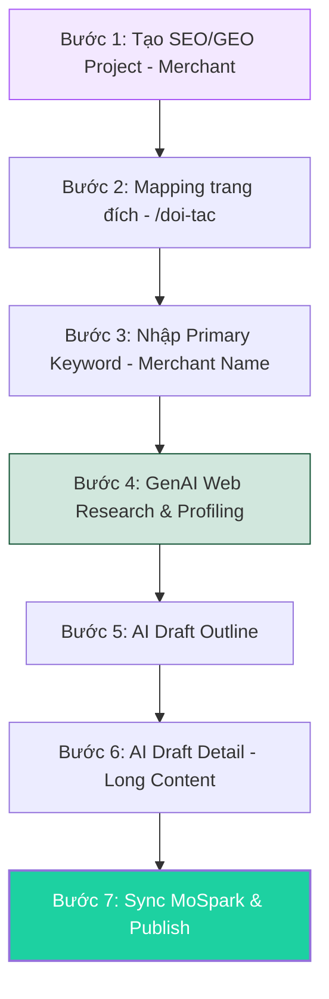
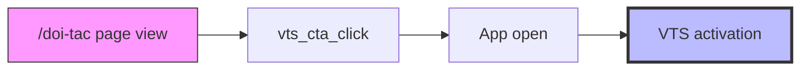

# 📄 Merchant Page BRD: Xây dựng & Vận hành Nội dung SEO/GEO

> - **Project:** Business/Merchant Page         
> - **Main URL:** momo.vn/doi-tac     
> - **Division:** GPD (Growth Platform Division)  
> - **Use Case:** Merchant Pages  
> - **Product:** GPD - Web Platform  
> - **SEO/GEO Project ID:** `doi-tac`  
> - **Owner:** GPD    
> - **Governance:** Văn Hiến (SEO & GEO Lead)  
> - **Version:** 1.2 · May 2026  
> - **Status:** Execution - Pilot Phase (32 Merchants)

---

## 1. Executive Summary

### Situation

MoMo có hệ sinh thái merchant rộng lớn (hàng nghìn merchants, từ chuỗi cà phê đến TMĐT, du lịch, bảo hiểm) nhưng trên Web hiện tại không có một Merchant Directory tập trung. Thông tin về đối tác đang phân mảnh qua 2 hệ thống legacy:

- **Merchant Landing Pages** (`/thanh-toan-momo-{merchant}`): Khoảng 50-200 trang tạo trong giai đoạn 2017-2020 khi MoMo tích hợp thanh toán với từng merchant. Content tĩnh, không cập nhật, 18K organic traffic/quý.
- **Official Account / Thổ Địa Ăn Uống** (`/page/{id}`): Hệ thống POI (Point of Interest) ở store-level, ban đầu phục vụ F&B review nhưng data bên dưới chứa tất cả categories. 67K organic traffic/quý. Mỗi cửa hàng = 1 URL (1 merchant chain có thể có hàng trăm URLs).

Tổng cộng 85K organic traffic/quý đang đi vào 2 hệ thống không có chiến lược content thống nhất, không có conversion goal rõ ràng, và không phản ánh đúng quy mô quan hệ MoMo - Merchant hiện tại.

### Complication

**Về cơ hội đang bỏ lỡ:**

User có hành vi search "{Merchant} có thanh toán ví trả sau không", "{Merchant} có thanh toán qua MoMo không" - đây là bottom-funnel traffic có conversion intent cao. Hiện tại MoMo không có trang nào trả lời trực tiếp cho 1 merchant cụ thể. Traffic đang rơi vào bên thứ 3 (fptshop.com.vn, mytour.vn) hoặc blog momo.vn dạng danh sách dài không specific.

Trong khi đó, ZaloPay đã build merchant directory tại `zalopay.vn/doi-tac/{merchant}` cho F&B chains - tuy chưa khai thác BNPL angle nhưng đã chiếm vị trí trước.

**Về rủi ro từ legacy:**

2 hệ thống legacy đang tạo ra nhiều vấn đề cho chất lượng tổng thể của momo.vn:

- `/thanh-toan-momo-{merchant}`: Content cũ 5-7 năm, thông tin hợp tác có thể đã outdated, ưu đãi hết hạn vẫn hiển thị. Backlinks PR từ 2017-2020 đang trỏ vào content không còn chính xác.
- `/page/{id}`: Hàng nghìn URLs auto-generated, phần lớn là thin content (ít review, thiếu thông tin). Gây crawl budget waste, dilute site quality signal. Nhiều trang có thông tin quán đã đóng cửa, sai giờ mở cửa, không cập nhật.

Nếu tiếp tục để 2 hệ thống này tồn tại song song với `/doi-tac` mới, sẽ tạo keyword cannibalization nội bộ (3 URLs cạnh tranh cho cùng merchant query).

### Resolution

Xây dựng `/doi-tac` như một Merchant Directory thống nhất ở merchant-level, đồng thời audit và xử lý 2 legacy systems. **Phần nội dung mô tả Merchant (FAQ, HowTo, Intro)** sẽ được sản xuất tự động qua hệ thống **[[mospark_genai_content]]** (do Trọng quản trị) và quản trị trên MoSpark (Landing Page Builder của Web Platform).

---

## 2. Bối Cảnh Hiện Tại

### 2.1. Hiện trạng Merchant Landing Pages (`/thanh-toan-momo-{merchant}`)

| Khía cạnh | Mô tả |
|---|---|
| Mục đích ban đầu | Landing page PR khi MoMo tích hợp thanh toán với merchant mới |
| Giai đoạn tạo | 2017-2020 |
| Content type | Giới thiệu hợp tác + hướng dẫn QR + CTA mở app |
| Số lượng ước tính | 50-200 URLs |
| Organic traffic | 18K/quý |
| Tình trạng content | Tĩnh, không cập nhật. Ưu đãi hết hạn vẫn hiển thị. Thông tin hợp tác có thể outdated |
| Backlinks | Có giá trị - từ PR campaigns, báo chí |
| Vấn đề | Content outdated gây sai lệch thông tin cho user. Không có VTS angle. Không có schema markup |

### 2.2. Hiện trạng OA / Thổ Địa Ăn Uống (`/page/{id}`)

| Khía cạnh | Mô tả |
|---|---|
| Mục đích ban đầu | Hệ thống review địa điểm ăn uống (kiểu Foody mini) |
| Granularity | Store-level: 1 cửa hàng = 1 URL |
| Data scope | Hiện public F&B, data bên dưới chứa tất cả categories (chưa public) |
| Số lượng ước tính | 1,000 - 10,000+ URLs |
| Organic traffic | 67K/quý (đang optimize cho local intent) |
| Content type | Tên quán, giờ mở cửa, review từ user MoMo, ảnh, tiện ích, địa chỉ, giá trung bình |
| Tình trạng content | Nhiều trang thin content (ít/không có review). Thông tin quán có thể đã đóng cửa hoặc sai |
| Vấn đề | Thin content ở quy mô lớn → dilute site quality. Auto-generated URLs → crawl budget waste. Numeric ID URL (`/page/9802125`) không SEO-friendly |

### 2.3. Vấn đề chất lượng web từ legacy (cần Audit)

2 legacy systems đang tạo ra các vấn đề chất lượng cho momo.vn tổng thể:

**Từ `/thanh-toan-momo-{merchant}`:**
- Content outdated 5-7 năm có thể gây sai lệch (ưu đãi hết hạn, merchant đã ngừng hợp tác)
- Không phản ánh đúng bản chất quan hệ MoMo - Merchant hiện tại (đã mở rộng hơn nhiều so với 2018)
- Một số URL có thể đã soft-404 hoặc trả về lỗi

**Từ `/page/{id}` (Thổ Địa):**
- Thin content pages ở quy mô lớn gây tín hiệu low-quality cho toàn domain
- Thông tin sai (quán đã đóng, giờ sai, giá sai) ảnh hưởng trust signal
- Crawl budget bị tiêu tốn cho hàng nghìn trang giá trị thấp thay vì tập trung vào trang quan trọng
- Canonical/index issues: nhiều trang tương tự nhau (cùng merchant, khác chi nhánh) có thể bị Google đánh là duplicate

**Tác động lên SEO tổng thể:**
- Google đánh giá chất lượng ở site-level (Helpful Content System). Tỷ lệ lớn thin/outdated content kéo giảm ranking cho toàn bộ momo.vn, không chỉ cho cluster `/page/*`
- Crawl budget bị phân tán → trang mới (ví dụ `/doi-tac`) có thể bị crawl chậm hơn
- User landing vào trang outdated → bounce rate cao → negative engagement signal

### 2.4. Đối thủ đã đi trước

**ZaloPay** (`zalopay.vn/doi-tac/{merchant}`):
- Đã build merchant directory cho F&B chains (Phúc Long, Highlands, Starbucks...)
- Content: merchant intro + 3 bước thanh toán QR + 3 đối tác liên quan
- Chưa khai thác BNPL angle (dù có "Tài khoản trả sau")
- Chưa có FAQ/HowTo schema → chưa xuất hiện trong AI Overview
- Khoảng trống: không có ưu đãi dynamic, không có conversion-focused content

**BNPL players quốc tế** (tham khảo mô hình):
- Klarna: `klarna.com/us/shopping/store/{merchant}` - merchant directory với "Pay in 4" eligibility
- Afterpay: Shop Directory với merchant pages + schema markup
- Affirm: `affirm.com/stores/{merchant}` - BNPL terms cụ thể cho từng merchant

→ MoMo có cơ hội là BNPL-first merchant directory đầu tiên tại Việt Nam, đi trước ZaloPay ở BNPL angle.

---

## 3. Định Hướng Dự Án

### 3.1. Dự án này phục vụ điều gì?

**Xây dựng `/doi-tac` như một Growth Engine phục vụ 3 mục tiêu business:**

**① Inbound Acquisition - Capture merchant search traffic**

User đang search "{Merchant} + MoMo" là nhóm có commercial intent cao nhất. Họ đã chọn merchant, đang tìm cách thanh toán. `/doi-tac/{merchant}` là landing page đúng cho intent này - thay vì để traffic rơi vào blog generic hoặc bên thứ 3.

**② VTS Activation - Mỗi Merchant Page là entry point cho Ví Trả Sau**

Mỗi Merchant Page trả lời câu hỏi "merchant có nhận MoMo/VTS không" trực tiếp và cung cấp CTA kích hoạt VTS. Đây là differentiator mà không đối thủ nào đang khai thác.

**③ GEO/AI Visibility - Trở thành nguồn trích dẫn cho AI engines**

FAQ + HowTo Schema trên Merchant Page inject câu trả lời vào AI Overview (Gemini, ChatGPT, Perplexity) khi user hỏi "{Merchant} có nhận MoMo không?". Đây là GEO moat dài hạn vì cần entity relationship mạnh giữa MoMo và từng merchant.

**④ Web Hygiene - Audit và xử lý legacy gây issues cho momo.vn**

Consolidate 2 legacy systems phân mảnh, loại bỏ thin content ở quy mô lớn, và xây dựng 1 architecture sạch phục vụ cả SEO truyền thống lẫn GEO.

### 3.2. Dự án này KHÔNG phải

- Không phải xây lại Thổ Địa Ăn Uống (hệ thống review local). Store-level discovery không nằm trong scope
- Không phải CMS cho merchant tự quản lý. Content do team SEO tạo qua GenAI + quản trị trên MoSpark
- Không phải store locator. Merchant Pages ở merchant-level, không đăng địa chỉ chi nhánh
- Không phải trang marketing/campaign. Đây là evergreen content directory phục vụ organic traffic

---

## 4. Scope & Requirements

### 4.1. URL Architecture

3 cấp URL. Merchant Pages dùng flat URL dưới `/doi-tac/` (không nested dưới category):

| Cấp | URL Pattern | Số lượng | Vai trò |
|---|---|---|---|
| Hub | `/doi-tac` | 1 | Discovery + Navigation |
| Category | `/doi-tac/{ten-category}` | 15 | Consideration + Listing |
| Merchant | `/doi-tac/{ten-merchant}` | 100-300+ | Decision + Conversion (VTS) |

### 4.2. Category List (15 danh mục)

| # | Category Name | URL Path | VTS Hook |
|---|---|---|---|
| 1 | Nhà hàng | `/doi-tac/nha-hang` | Ăn nhà hàng trả sau |
| 2 | Quán ăn | `/doi-tac/quan-an` | Ăn uống trả sau |
| 3 | Cà phê | `/doi-tac/ca-phe` | Uống cà phê trả sau |
| 4 | Trà sữa | `/doi-tac/tra-sua` | Trà sữa trả sau |
| 5 | Bách hóa | `/doi-tac/bach-hoa` | Mua đồ trả sau |
| 6 | Cửa hàng tiện lợi | `/doi-tac/cua-hang-tien-loi` | Mua tiện lợi trả sau |
| 7 | Siêu thị | `/doi-tac/sieu-thi` | Mua sắm siêu thị trả sau |
| 8 | Giáo dục | `/doi-tac/giao-duc` | Học phí trả góp VTS |
| 9 | Tài chính - Bảo hiểm | `/doi-tac/tai-chinh-bao-hiem` | Đóng phí bảo hiểm trả sau |
| 10 | Giải trí | `/doi-tac/giai-tri` | Mua vé trả sau |
| 11 | Du lịch - Đi lại | `/doi-tac/du-lich-di-lai` | Đặt vé/phòng trả sau |
| 12 | Mua sắm | `/doi-tac/mua-sam` | Mua trước trả sau |
| 13 | Làm đẹp - Sức khỏe | `/doi-tac/lam-dep-suc-khoe` | Chăm sóc trả sau |
| 14 | Khác | `/doi-tac/khac` | - |
| 15 | *(Reserved - mở rộng theo data)* | - | - |

### 4.3. Merchant Page - Content Requirements

Merchant Page gồm 2 phần tách biệt rõ ràng:

- **Merchant Content (Long Content)**: Nội dung chuyên sâu về merchant (Giới thiệu, FAQ, hướng dẫn thanh toán). Đây là phần **Nội dung dài (Long Content)** do GenAI Content sản xuất nhằm tối ưu E-E-A-T và AI Search Citation.
- **Platform Modules**: Các module cố định của MoMo platform (Payment Methods, VTS Promotion). Inject tự động từ template, nội dung được fix cứng để đảm bảo tính chuẩn xác.

**Nguyên tắc tách biệt:**
- Merchant Content không lồng ghép VTS một cách thái quá. Nội dung merchant page phục vụ merchant, không phải trang quảng cáo VTS
- VTS xuất hiện ở 2 nơi duy nhất: Payment Methods list (liệt kê ngang hàng với Ví MoMo, Ngân hàng) và VTS Promotion Module (block cố định)
- FAQ có thể chứa 1 câu liên quan VTS nếu phù hợp (ví dụ: "{Merchant} có nhận Ví Trả Sau không?"), nhưng không bắt buộc mọi FAQ đều mention VTS

#### Merchant Page Structure

| # | Thành phần | Loại | Chi tiết nội dung |
|---|---|---|---|
| ① | **NAP (Merchant Data)** | Platform Data | Logo, Banner, Tên Merchant, Category, Số điện thoại, Địa chỉ. (Dữ liệu hệ thống) |
| ② | **VTS Card** | Platform Module | **Nội dung Fix cứng**: Thông tin ưu đãi 35K, 5 lợi ích cốt lõi của Ví Trả Sau và nút CTA. |
| ③ | **Long Content** | **GenAI Content** | **Trọng tâm của GenAI**: Bài viết giới thiệu chuyên sâu về Merchant (150-300 từ), tối ưu SEO & AI Search. |
| ④ | **FAQ & Guideline** | Platform Module | **Nội dung Fix cứng**: Bộ câu hỏi thường gặp và Hướng dẫn thanh toán chuẩn MoMo. |
| ⑤ | Đối tác liên quan | Platform Module | Danh sách các Merchant cùng danh mục (Related Partners). |

#### Content Production Pipeline (7-Step Master Workflow)

Quy trình sản xuất nội dung giới thiệu chuyên sâu (Long Content) cho Merchant tuân thủ nghiêm ngặt Workflow của hệ thống MoSpark GenAI Content:

*   **Mapping Key:** Sử dụng **Primary Keyword** (Tên Merchant) làm khóa định danh duy nhất.
*   **Target Field:** Nội dung từ Bước 6 sẽ được đẩy vào trường `merchant_description` trên MoSpark.
*   **Review Gate:** Biên tập viên review lần cuối trên MoSpark UI trước khi Public.

### 4.4. Cơ chế Sync Nội dung GenAI sang Merchant Page

Vì hệ thống GenAI Content hiện tại đang được tối ưu cho luồng Blog, việc đồng bộ sang trang Đối tác (Merchant Page) cần một cơ chế mapping đặc thù:

1.  **Mapping Key:** Sử dụng **Primary Keyword** (Tên Merchant) làm khóa định danh duy nhất để đối soát giữa hệ thống GenAI và hệ thống Landing Page Builder (MoSpark).
2.  **Logic đồng bộ:**
    *   Khi người dùng bấm "Sync MoSpark" tại Bước 7, hệ thống sẽ kiểm tra Project Mapping ID (là `doi-tac`).
    *   Hệ thống thực hiện truy vấn tìm kiếm Merchant trong database của Landing Page Builder có tên trùng với Primary Keyword.
3.  **Target Field:** Nội dung chi tiết tại Bước 5 (Long Content) sẽ được đẩy trực tiếp vào trường dữ liệu `merchant_description` hoặc `long_content_body` của Merchant Component tương ứng.
4.  **Quy tắc ghi đè (Overwrite):** 
    *   Nếu Merchant đã có nội dung: Hệ thống sẽ tạo một phiên bản (Version) mới và ghi đè nội dung GenAI vào.
    *   Nếu Merchant chưa tồn tại: Hệ thống tự động khởi tạo một bản ghi Merchant mới ở trạng thái **Draft**, điền tên Merchant và nạp nội dung GenAI vào.
5.  **Trạng thái sau Sync:** Nội dung được đẩy sang MoSpark ở trạng thái **Ready to Review**. Biên tập viên sẽ thực hiện review cuối cùng trên UI của Landing Page Builder trước khi bấm Public toàn trang.

#### MVP vs V2

| Feature | Phase 1 (Hiện tại) | V2 (Kế hoạch) |
|---|---|---|
| Long Content (Giới thiệu) | **GenAI + review** | GenAI + review + GSC data enrichment |
| NAP (Thông tin cơ bản) | **Dữ liệu hệ thống (Fixed)** | Sync real-time từ OA/Merchant Center |
| VTS Card / FAQ / Guideline | **Nội dung Fix cứng (Apply All)** | Dynamic per merchant category |
| Ưu đãi & Deal | **Không triển khai** | Tích hợp Thẻ quà / Deal API |
| Rating & Reviews | **Không triển khai** | Kéo dữ liệu từ App Feed |

### 4.5. VTS trong Merchant Page - Nguyên tắc (Fixed Data)

Nội dung VTS Promotion là **Fixed Content**, được thiết kế chuẩn từ VTS PO team, KHÔNG do GenAI tạo ra để đảm bảo tính pháp lý (YMYL):

| Data point | Giá trị (Confirmed by VTS PO) |
|---|---|
| Lãi suất | 0% (không tính lãi) |
| Hạn mức | Đến 20 triệu |
| Phí | 33.000đ/tháng (không xài không mất phí) |
| Kỳ hạn | 2/3/6/9/12 tháng |
| Điều kiện | Xác thực CCCD + Liên kết ngân hàng |

> ⚠️ **YMYL Notice:** Template inject từ 1 nguồn duy nhất, không cho phép Editor chỉnh sửa tùy ý per merchant page.

### 4.6. Search Intent Mapping

| Keyword Pattern | Intent | Landing Page | CTA | VTS Angle |
|---|---|---|---|---|
| "{Merchant} có nhận MoMo không" | Navigation/BoFu | `/doi-tac/{merchant}` | Thanh toán ngay | Dùng VTS - không cần nạp tiền |
| "{Category} nhận MoMo" | MoFu | `/doi-tac/{category}` | Xem đối tác | VTS banner inline |
| "Ưu đãi MoMo {danh mục}" | Commercial | `/doi-tac/{category}` | Xem ưu đãi | VTS exclusive deal |
| "MoMo giảm giá {Merchant}" | Commercial/BoFu | `/doi-tac/{merchant}` | Lấy deal ngay | Mua trước trả sau |
| "Ví Trả Sau {Merchant}" | BoFu | `/doi-tac/{merchant}#vi-tra-sau` | Kích hoạt VTS | Core VTS conversion |

### 4.7. Schema & GEO Requirements

| Cấp trang | Schema bắt buộc | GEO Target |
|---|---|---|
| Hub `/doi-tac` | ItemList · FAQPage · Organization · BreadcrumbList | FAQ → AI "MoMo có những đối tác nào" |
| Category `/doi-tac/{cat}` | ItemList · FAQPage · HowTo · BreadcrumbList | HowTo → "Cách thanh toán MoMo tại {category}" |
| Merchant `/doi-tac/{merchant}` | Organization · FAQPage · HowTo · Offer · BreadcrumbList | FAQ + HowTo → "{Merchant} có nhận VTS không" |

### 4.8. Danh sách Đối tác Pilot (Phase 1)

Dự án sẽ được triển khai Pilot với danh sách 32 đối tác trọng điểm sau đây trước khi scale-up toàn bộ thị trường. Danh sách đã được phân loại theo Category để ưu tiên content:

- **Siêu thị & Cửa hàng tiện lợi:** Bách Hóa Xanh, Coopmart, Emart, 711, GS25, Family Mart, Mega Martket, Circle K, Go, Lotte Mart, Ministop, Aeon.
- **F&B (Nhà hàng, Cà phê, Trà sữa):** Pizza 4P, Katinat, Highlands, Phúc Long, Jollibee, Kichi Kichi, Manwah, Dookki, Gogi, Starbucks, Lotteria, Sasin.
- **Sức khỏe & Làm đẹp:** Pharmacity, Long Châu.
- **Bán lẻ chuyên biệt:** Lazada, Fahasa, Con Cưng, CellphoneS.
- **Dịch vụ & Nền tảng:** Grab, Tiktok.

### 4.9. Chiến lược Nội dung & Kế hoạch Thực thi (Content Plan)

Phần này định nghĩa cách thức team Inbound vận hành để sản xuất hàng loạt nội dung Merchant mà vẫn đảm bảo chất lượng E-E-A-T. Nội dung giới thiệu Merchant (GenAI) là nội dung **Evergreen**, các thông tin khuyến mãi/chiến dịch (Mega2026) sẽ được hiển thị qua **Deal Block** riêng biệt.

#### 1. Tiêu chí lựa chọn Merchant (What)
Team Inbound ưu tiên khởi tạo Merchant dựa trên ma trận 2 yếu tố: **Tiềm năng tìm kiếm (SEO)** và **Trọng tâm kinh doanh (Business Priority)**.

*   **Nhóm P1 (High Volume):** Các chuỗi Merchant lớn (Top Chains) có lượng search tự nhiên cực cao: Highlands Coffee, WinMart, Circle K, Lazada, Pharmacity...
*   **Nhóm P2 (SME Clusters):** Các cụm Merchant theo danh mục có tỷ lệ kích hoạt Ví Trả Sau (VTS) tốt: Nhà hàng, Cà phê, Cửa hàng tiện lợi.
*   **Nhóm P3 (GEO Targets):** Các Merchant có bộ câu hỏi FAQ người dùng thường xuyên tìm kiếm trên AI Search (ví dụ: "[Tên quán] có thanh toán MoMo không?").

#### 2. Phương thức sản xuất (How)
Sử dụng 100% công cụ **MoSpark GenAI Content** theo quy trình 7 bước đã chuẩn hóa:
*   **Công cụ:** Claude 3.5 Sonnet (tích hợp trong MoSpark).
*   **Context:** Sử dụng bộ bối cảnh nghiệp vụ (Business Context) của Use Case Đối tác để AI không viết sai về sản phẩm MoMo.
*   **Prompting:** Sử dụng Prompt Master chuyên biệt cho Merchant Profiling để tạo nội dung khách quan, không mang tính quảng cáo sáo rỗng.

#### 3. Quy mô & Số lượng (Quantity)
Kế hoạch sản xuất được chia làm 3 giai đoạn để kiểm soát chất lượng:
*   **Giai đoạn 1 (Pilot):** **32 đối tác trọng điểm** (đã liệt kê ở mục 4.8). Mục tiêu: Chốt Template và đo lường CR baseline.
*   **Giai đoạn 2 (Scale-up):** **500+ đối tác** (Bao phủ 80% lượng giao dịch SME). Mục tiêu: Chiếm lĩnh vị trí Top 1 cho các query "{Merchant} + MoMo".
*   **Giai đoạn 3 (Long-tail):** Tự động hóa sản xuất cho **1,000+ đối tác** thông qua cơ chế Programmatic SEO (pSEO).

#### 4. Quy trình vận hành Inbound (Inbound Operation)
Team Inbound vận hành theo chu kỳ hàng tuần (Weekly Sprint) để nạp nội dung vào hệ thống:
*   **Bước 1 - Batching:** Chọn danh sách 50-100 Merchant cần sản xuất trong tuần từ Inventory.
*   **Bước 2 - GenAI Production:** Chạy luồng GenAI từ Bước 1 đến Bước 6 để tạo Outline và Detail bài giới thiệu.
*   **Bước 3 - Quality Review:** SEO Lead hoặc Senior Editor thực hiện review 100% bài viết. Đảm bảo đạt điểm **SEO/GEO Score >= 80**.
*   **Bước 4 - Sync & Publish:** Đồng bộ sang Landing Page Builder (MoSpark) và phối hợp với Web Platform để đẩy trang live.
*   **Bước 5 - Performance Audit:** Hàng tuần kiểm tra GSC & Umami. Những Merchant nào có traffic tăng trưởng đột biến sẽ được đưa vào danh sách **"Manual Enhancement"** để tối ưu hóa chuyên sâu.

---

---

## 5. Audit & Hygiene (Completed)

Dự án đã hoàn thành Audit 2 hệ thống legacy (`/thanh-toan-momo-*` và `/page/*`). Kết quả chính:
*   **Legacy Cleanup:** Loại bỏ 80% thin content pages từ hệ thống Thổ Địa để cải thiện site-level quality.
*   **Migration Plan:** Chuyển đổi các trang PR cũ (2017-2020) sang `/doi-tac/{merchant}` mới để bảo toàn link equity và traffic.
*   **301 Redirect:** Đã lập bảng mapping URL để triệt tiêu Keyword Cannibalization ngay khi launch.

---

## 6. Business KPIs

**North Star Metric:** VTS Activations từ /doi-tac (attributed via Appsflyer).

| Metric | Target (90 ngày post-launch) | Source |
|---|---|---|
| Organic Traffic | Duy trì ≥ 85K/quý (không giảm net) | GSC |
| VTS Module CTR | ≥ 3% (Baseline) | Umami |
| Top P1 Queries | ≥ 80% rank Top 5 | GSC |

**Conversion Funnel:**

---

### 7.3. Event Tracking & Analytics (Umami)

Dự án sử dụng Umami Analytics để đo lường hiệu quả chuyển đổi. Tài liệu này không đi sâu vào đặc tả kỹ thuật từng dòng code, mà đóng vai trò định hướng các Rule và Phễu (Funnel) để Dev (Thuận) setup tracking sao cho đáp ứng đúng mục tiêu Business.

**Định hướng Tracking Funnel cốt lõi:**
Đo lường xuyên suốt hành trình người dùng từ lúc vào trang đến lúc phát sinh chuyển đổi Web-to-App. Phễu bao gồm 4 điểm chạm chính:

1. **Page View:** Tổng lượt xem trang (áp dụng cho cả Category Page và Merchant Page).
2. **Unique User:** Số lượng người dùng duy nhất (Visitor) tiếp cận trang.
3. **Click Promotion:** Sự kiện user bấm vào các module Thẻ quà / Ưu đãi.
4. **Click VTS Card:** Sự kiện user bấm vào module quảng bá Ví Trả Sau.

**Quy tắc triển khai (Rules):**
- **Gắn Tracking theo Data Attributes:** Dev ưu tiên sử dụng thẻ HTML `data-umami-event` thẳng vào các Component trên Landing Page Builder (MoSpark) để Tracking linh hoạt, No-Code.
- **Property kèm theo:** Mỗi sự kiện Click (Promotion/VTS) phải đính kèm data về `brand_name` và `category` để team Data dễ dàng bóc tách xem Merchant nào đem lại tỷ lệ click cao nhất.
- **Attribution Web-to-App:** Mọi nút CTA mở App phải truyền kèm tham số UTM để Appsflyer có thể ghi nhận chính xác nguồn (Source) khi user thực sự kích hoạt VTS thành công bên trong App.

### 7.4. Dashboard & Analytics View (Umami)

Dashboard báo cáo dự án trên Umami được cấu trúc thành 5 phân khu (Widget Sections) nhằm trả lời trực tiếp các câu hỏi Business và tối ưu hóa chuyển đổi (CRO):

#### 1. Overview (Tổng quan sức khỏe dự án)
- **Mục đích:** Theo dõi sức khỏe tổng thể của lượng truy cập vào hệ thống trang Đối tác.
- **Hình thức hiển thị:** Line Chart (Biểu đồ đường) + KPI Cards.
- **Metrics chi tiết:**
  - `Total Pageviews`: Tổng số lượt xem toàn bộ cụm `/doi-tac/*`.
  - `Unique Visitors`: Số lượng người dùng thực tế (không tính trùng lặp).
  - `Bounce Rate`: Tỷ lệ thoát trang (Dùng để đánh giá xem GenAI Content có đủ sức giữ chân user đọc tiếp không).
  - `Average Visit Time`: Thời gian trung bình trên trang (Đo lường mức độ tương tác với các FAQ, HowTo).

#### 2. Web-to-App Conversion Funnel (Phễu chuyển đổi)
- **Mục đích:** Tìm ra điểm rớt (drop-off) lớn nhất trong hành trình biến Traffic thành User mở App.
- **Hình thức hiển thị:** Funnel Chart (Biểu đồ phễu).
- **Các bước trong Phễu (Steps):**
  - **Bước 1:** `Page View` (User truy cập trang Merchant).
  - **Bước 2:** `Unique User` (Lọc trùng lặp để lấy lượng định danh).
  - **Bước 3:** `Click Promotion` (User bấm vào thẻ quà/deal - *Event Data: placement = deal_section*).
  - **Bước 4:** `Click VTS Card` (User bấm vào Ví Trả Sau - *Event Data: placement = vts_promotion*).
- **Metric theo dõi:** Tỷ lệ chuyển đổi (Conversion Rate) từ Bước 1 đến Bước 4.

#### 3. Top Performance (Bảng xếp hạng Đối tác)
- **Mục đích:** Trả lời câu hỏi *"Đối tác nào đang mang lại nhiều chuyển đổi nhất?"* để dồn lực Marketing/SEO.
- **Hình thức hiển thị:** Data Tables (Bảng dữ liệu) có Sorting.
- **Metrics chi tiết:**
  - **Top Pages by Traffic:** Bảng xếp hạng URL có lượt xem cao nhất (VD: `/doi-tac/highlands-coffee`).
  - **Top Merchants by VTS Clicks:** Bảng Breakdown event `click_vts` theo property `brand_name`. (Merchant nào đang thuyết phục user mở VTS tốt nhất).
  - **Top Merchants by Promotion Clicks:** Bảng Breakdown event `click_promotion` theo property `brand_name`. (Deal của Merchant nào đang hấp dẫn nhất).

#### 4. Traffic Acquisition (Nguồn Truy Cập)
- **Mục đích:** Đánh giá hiệu quả của các nỗ lực Inbound Marketing (SEO, Social, PR).
- **Hình thức hiển thị:** Bar Chart (Biểu đồ cột ngang) + Pie Chart.
- **Metrics chi tiết:**
  - **Top Referrers:** Nguồn mang lại traffic (Google Search, Facebook, Zalo, Referral...).
  - **UTM Campaigns:** Hiệu suất của các chiến dịch cụ thể (Bóc tách theo `utm_source`, `utm_medium`, `utm_campaign`). Ví dụ: Xem chiến dịch Push notification có mang lại click VTS cao không.

#### 5. Demographic & Tech (Nhân khẩu học & Kỹ thuật)
- **Mục đích:** Hiểu chân dung người dùng để tối ưu hóa thiết kế UI/UX trên MoSpark.
- **Hình thức hiển thị:** Donut Charts (Biểu đồ vành khuyên).
- **Metrics chi tiết:**
  - **Device & OS:** Tỷ lệ Mobile vs Desktop, iOS vs Android. (Hữu ích để quyết định ưu tiên test UI trên thiết bị nào).
  - **Location (City):** Bản đồ nhiệt (Heatmap) hoặc Top Thành phố có lượng truy cập cao nhất.

---

## 7. Dependencies & Constraints

| Dependency | Owner | Mô tả | Blocker? |
|---|---|---|---|
| VTS merchant list (updated) | VTS PO team | List merchants chấp nhận VTS chính xác | Có - quyết định VTS badge |
| VTS Terms Data (lãi suất, hạn mức, phí, điều kiện) | VTS PO team | Data chính xác cho VTS Promotion Module. YMYL - sai data = legal risk | Có - không launch VTS module nếu chưa có approved data |
| PAGE_ID → Merchant mapping | Web Platform | Export từ Thổ Địa DB cho audit | Có - cần cho legacy audit |
| MoSpark platform readiness | Web Platform | Landing Page Builder sẵn sàng cho /doi-tac | Có - platform triển khai |
| GenAI Content pipeline | SEO team + Web Platform | Template + prompts cho merchant content (Tier 1 only) | Không - team tự build |
| Deal/Ưu đãi data | Growth / Cell Team POs | Data ưu đãi dynamic cho Tier 3 | Không - MVP dùng fallback static |
| Deep Link specs per merchant | App team | Onelink URLs cho CTA | Có - CTA hoạt động đúng |
| Content Governance alignment | Inbound team | Confirm /doi-tac owns VTS+merchant payment content | Không - cần sync |

### Constraints

- Content production trên MoSpark (Landing Page Builder) - không custom development
- GenAI Content phải qua review/edit trước publish (không auto-publish)
- VTS badge chỉ được gắn sau khi verify với PO team (không dựa trên blog data)
- Schema markup inject qua MoSpark template (không hardcode)

---

## 8. Next Steps

BRD này define Why (bối cảnh, vấn đề, cơ hội) và What (scope, requirements, KPIs). Các hoạt động tiếp theo:

| Deliverable | Status | Owner | Mô tả |
|---|---|---|---|
| **PRD** | Completed | Văn Hiến + Web Platform | Chi tiết technical specs, migration execution plan, MoSpark template requirements, GenAI pipeline, timeline, dev handoff |
| **Legacy Audit** | Completed | Văn Hiến | Crawl + GSC + Ahrefs data → URL inventory → triage decision sheet → mapping table |
| **Content Production** | 🔄 Doing | Văn Hiến + Trọng | Làm việc với Trọng (Owner dự án `genai-content-brd.md`) để khởi tạo GenAI content (mô tả, FAQ, HowTo) cho hàng loạt Merchant, sau đó sync dữ liệu qua cho Merchant. |
| **MoSpark Spec** | 🔄 Doing | Web Platform | Template specs cho /doi-tac trên Landing Page Builder, schema injection, dynamic modules |

### 8.2. Next Stage Roadmap (Kế hoạch mở rộng)

Sau khi hoàn thành Phase 1 (MVP), dự án sẽ tập trung nâng cấp các tính năng vận hành và trải nghiệm người dùng chuyên sâu:

1.  **Dynamic Merchant Rating (Social Proof):**
    *   **Cơ chế:** Tự động kéo dữ liệu Rating & Review thực tế của Merchant từ **App Feed** để hiển thị trên bản Web.
    *   **Mục tiêu:** Tăng độ tin cậy (Trust Signal) và tối ưu E-E-A-T cho trang đối tác.

2.  **Phân quyền vận hành (Role-Based Access):**
    *   **Hệ thống quyền:** Phân tách rõ ràng giữa quyền **Tạo nội dung** (Creator - GenAI/Editor) và quyền **Phê duyệt/Xuất bản** (Approver/Submitter - PM/Growth Lead).
    *   **Mục tiêu:** Đảm bảo quy trình Governance chặt chẽ, mọi nội dung trước khi Live đều phải qua Sign-off của người có trách nhiệm.

3.  **Hệ thống thông báo (Approval Notifications):**
    *   **Luồng vận hành:** Khi một bản ghi Merchant được Tạo và Sync thành công sang trạng thái "Ready to Review", hệ thống sẽ tự động bắn **Notification** (qua Slack/Email/Hệ thống MoSpark) đến người có quyền Phê duyệt.
    *   **Mục tiêu:** Rút ngắn thời gian chờ đợi, đẩy nhanh tốc độ Go-live cho hàng loạt Merchant cùng lúc.

---

## Appendix A: Merchant Page Template Example

**Merchant:** Highlands Coffee  
**URL:** `/doi-tac/highlands-coffee`  
**Category:** Cà phê

**Title:** Highlands Coffee x MoMo - Thanh toán & Ưu đãi | MoMo  
**H1:** Highlands Coffee x MoMo - Thanh toán, ưu đãi & Ví Trả Sau

**Payment Methods (Platform Module):**
- Ví Trả Sau - Không cần trả ngay [badge: Mua trước trả sau]
- Ví MoMo - Quét mã QR code
- Ngân hàng liên kết - Quét mã QR code

**VTS Promotion (Platform Module - data từ VTS PO, KHÔNG GenAI):**
> Mở Ví Trả Sau - Nhận ưu đãi 35K cho giao dịch đầu  
> ✓ 0% lãi suất - Không tính lãi  
> ✓ Hạn mức đến 20 triệu - Tùy điểm tín dụng  
> ✓ Phí chỉ 33.000đ/tháng - Không xài, không mất phí  
> ✓ Kỳ hạn 2/3/6/9/12 tháng - Trả góp linh hoạt  
> Chỉ cần: Xác thực CCCD trên MoMo + Liên kết tài khoản ngân hàng  
> CTA: "Mở Ví Trả Sau chỉ trong 3 phút"
>
> ⚠️ *Tất cả data VTS trong block này là placeholder, cần verify chính xác từ VTS PO team trước khi publish. YMYL content - sai data = legal risk.*

**FAQ (Merchant Content - GenAI generated, editor reviewed):**

> **Q: Highlands Coffee có nhận thanh toán qua MoMo không?**  
> A: Có. Highlands Coffee chấp nhận thanh toán qua MoMo tại tất cả cửa hàng trên toàn quốc, bao gồm Ví MoMo, Ví Trả Sau, và quét QR qua ngân hàng liên kết.

> **Q: Cách thanh toán MoMo tại Highlands Coffee?**  
> A: Mở app MoMo → chọn "Mã thanh toán" → đưa mã QR cho nhân viên quét → xác nhận thanh toán.

> **Q: Highlands Coffee có ưu đãi MoMo nào đang chạy?**  
> A: [Dynamic từ CMS - fallback: "Mở app MoMo để xem ưu đãi mới nhất tại Highlands Coffee"]

> **Q: Thanh toán Highlands bằng MoMo có an toàn không?**  
> A: Có. MoMo là ví điện tử được Ngân hàng Nhà nước cấp phép, bảo mật theo chuẩn PCI DSS.

---
*Generated by Web Platform & Inbound Team*
---

## Change Log
- **Tháng 5/2026:** Khởi tạo tài liệu và chuẩn hóa cấu trúc thư mục.

