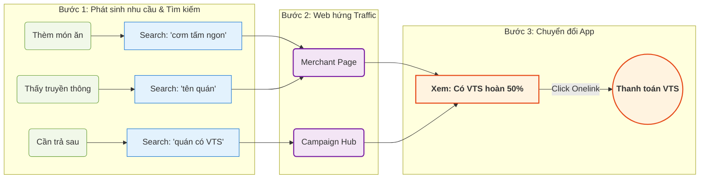

# SPA: Mega 2026 - "Trả Sau Hoàn Sâu" (VTS x SME)

> - **Project:** Use Case Ví Trả Sau x SME — Trả Sau Hoàn Sâu
> - **Channel:** Điểm chạm số (Web/SEO)
> - **Division:** FS (Financial Services) & SME
> - **Version:** 2.3 · C-Level Pitch
> - **Status:** Active

---

> **Problem:** Hàng nghìn user search tên quán ăn mỗi tháng để xác nhận có dùng VTS được không - không có trang MoMo nào trả lời, dù billboard MoMo đang treo ngay tại quán đó.
> **KPI Owned:** VTS Activations tại SME từ web channel → attributed via Appsflyer
> **Conversion Flow:** OOH trigger → Search "[tên quán]" → Merchant Page MoMo → VTS CTA → Open App → Thanh toán VTS → Hoàn 50%

## **Context Campaign**

|                 |                                                                    |
| --------------- | ------------------------------------------------------------------ |
| Tên campaign    | Trả Sau Hoàn Sâu                                                   |
| Tagline         | "Cứ trả sau là hoàn 50%"                                           |
| Cơ chế          | Hoàn 50%, tối đa 10K/giao dịch - 100K/tháng                        |
| Business Target | 700K users thanh toán VTS tại SME                                  |
| OOH hiện trạng  | 37 billboards - 11 tỉnh thành - 37+ merchants                      |

> **[Executive Summary] Vai trò của Web/SEO trong Campaign:**
> Bao phủ toàn bộ Hệ thống SME Merchant có trang bị Soundbox trên nền tảng số. Đóng vai trò là "phễu hứng" các nhu cầu tìm kiếm (Search Demand) phát sinh từ các kênh truyền thông (bao gồm OOH). Thay vì để user rơi rớt, Web sẽ số hóa các cửa hàng SME Soundbox này, biến mỗi lượt tìm kiếm quán ăn thành một cơ hội mở app MoMo và thanh toán Ví Trả Sau (VTS) để hưởng ưu đãi Hoàn 50%.
> **Mục tiêu:** Chuyển hóa thị trường **44.800+** lượt tìm kiếm mỗi tháng thành W2A Conversion (≥12.5%).

## **Stage S: reSearch & Strategy - Opportunity Map**

Mega là chiến dịch tích hợp Scheme khuyến mãi nhằm kích thích người dùng trải nghiệm F&B và nhận Hoàn tiền khi thanh toán bằng Ví Trả Sau tại các Merchant có trang bị loa Soundbox. 
Trong đó, việc truyền thông Out-App (OOH/Media) đóng vai trò trigger mạnh mẽ, thúc đẩy hành vi tìm kiếm (Search) của người dùng. Dữ liệu tìm kiếm (SEO Data) thu thập được tại Stage S sẽ đóng vai trò làm "kim chỉ nam" và căn cứ cốt lõi để Merchant BU ra quyết định tiếp cận, xây dựng, triển khai và tối ưu các trang thông tin đối tác trên Web.

### **Key Insight #1: Keyword "Hoàn tiền" không có organic demand cho campaign**

Keyword research xác nhận: không tồn tại search behavior cho "hoàn tiền khi thanh toán tại quán ăn". Các generic keyword liên quan nhất đến Mega:

| Keyword | Volume/tháng | Intent |
| :--- | :---: | :--- |
| hoàn tiền | 1.000 | Informational - tra nghĩa, hỏi chung |
| hoàn tiền momo | 210 | MoMo generic, không gắn VTS/SME |
| hoàn tiền mua sắm momo | 140 | Shopping cashback, không phải F&B |
| hoàn tiền trên momo | 40 | Generic MoMo query |

Tổng generic volume liên quan: ~1.400/tháng. Không có keyword nào match intent "dùng VTS thanh toán tại quán ăn, được hoàn 50%".

**Kết luận:** "Hoàn tiền tại quán ăn" là behavior chưa tồn tại trong search. Campaign phải tạo awareness mới. SEO angle phải bám vào demand đã có sẵn: **Tên quán + Nhu cầu ẩm thực**.

### **Key Insight #2: Truyền thông kích hoạt Search - Hệ thống SME Soundbox là Demand thực**

Truyền thông OOH đang chạy tại 11 tỉnh để quảng bá chương trình hoàn 50% khi thanh toán bằng Ví Trả Sau tại các quán có Soundbox. Khi user tiếp xúc với truyền thông, hành vi search cụ thể được kích hoạt. JTBD analysis cho 5 nhóm search behavior đổ về các SME Soundbox này:

**Job 0: "Tôi muốn ăn [món này]"** (Browse → Discover)
- Trigger: Thèm món, tìm quán - chưa biết tên quán cụ thể
- Search query: "[món ăn] ngon", "[món ăn] + [địa phương]"
- Web solve: Merchant page rank cho generic food keyword, user discover quán + VTS cùng lúc.

**Job 1: "Tìm quán này để đi ăn"** (Discovery → Visit)
- Trigger: Thấy billboard, tò mò về quán lạ hoặc muốn xác nhận quán quen
- Search query: [tên quán] - navigational intent
- Web solve: Merchant page đầy đủ thông tin (địa chỉ, giờ, menu) + VTS CTA.

**Job 2: "Ví Trả Sau dùng ở quán này như thế nào?"** (Education → Activation)
- Trigger: Đã biết quán, thấy "Nay đã có Ví Trả Sau" nhưng không hiểu cơ chế
- Search query: [tên quán] + ví trả sau
- Web solve: Benefit explainer ngay trên merchant page + FAQ.

**Job 3: "Quán nào gần tôi có Ví Trả Sau?"** (Selection → Decision)
- Trigger: Đã hiểu VTS, đang chọn quán để đi
- Search query: quán chấp nhận ví trả sau, ăn uống trả sau momo
- Web solve: Campaign hub với filter tỉnh thành / map view.

**Job 4: "Quán quen của tôi có nhận VTS không?"** (Verification)
- Trigger: Hay đi quán này, muốn confirm
- Search query: [tên quán] 
- Web solve: Merchant page xuất hiện khi search, confirm ngay trên SERP.

---

**Phân loại Search Query → Page Type Routing (Nguồn: JTBD Research):**

Mapping từ search pattern thực tế đến page type cần build - làm cơ sở cho Site Architecture Stage P.

| # | Search Pattern | Ví dụ query | Intent | Target Page Type |
| :--- | :--- | :--- | :--- | :--- |
| J0 | {momo} + {hoàn tiền / ví trả sau} | "momo hoàn tiền ví trả sau", "ví trả sau momo là gì" | Brand - VTS Education | VTS Landing Page - đã có (/vi-tra-sau) |
| J1 | {momo} + {hoàn 50%} + {ở đâu / tỉnh thành} | "momo hoàn 50% ở đâu hcm", "quán có momo hoàn tiền hà nội" | Discovery - Location | Campaign Hub / Location Listing Page - cần build |
| J2-3 | {tên merchant} + {hoàn tiền / momo} | "Bún thịt nướng Chị Tuyền momo", "Cơm tấm Ống Khói Diệu hoàn tiền" | High intent - Verification | Merchant Page Detail - Pilot |
| J4 | {tên merchant} + {loại hình / địa điểm} | "Bún thịt nướng Chị Tuyền", "hủ tiếu Thanh Xuân cần thơ" | Navigational / Food | Merchant Page Detail - Pilot |

*Note: J2 và J3 trong research có search pattern trùng nhau ({tên merchant} + {momo/hoàn tiền}) - merge thành 1 routing rule. Sự khác biệt chỉ là wording query, không phải intent. Cùng route về Merchant Page Detail. J0 anchor về VTS Landing Page đã có - không cần build mới, chỉ cần đảm bảo page hiện tại rank được cho brand query này.*

---

**Keyword data xác nhận demand của các jobs trên (SME Soundbox Mapped):**

| SME Merchant (Có Soundbox) | Volume/tháng | Tỉnh | Trending |
| :--- | :---: | :---: | :---: |
| Bún thịt nướng Chị Tuyền | 8.100 | HCM | - |
| Cơm tấm Ống Khói Diệu | 4.400 | An Giang | - |
| Hủ tiếu Mỹ Tho Thanh Xuân | 1.300 | HCM | - |
| Bánh ướt Cây Me | 480 | Cần Thơ | - |
| Bột chiên A Tỷ | 480 | Đồng Nai | - |
| Hủ tiếu Nam Vang Ông Hai Bầu | 390 | Đồng Nai | Trending |
| Quán Cơm Chú Lùn | 320 | Cần Thơ | Trending |
| Hương Giang Bakery | 320 | Bắc Ninh | - |
| Hủ tiếu Nam Vang 69 | 110 | HCM | - |
| Chả giò Phượng | 90 | Đồng Nai | - |
| Hải sản Ngô Thơ | 70 | Hải Phòng | Trending |
| Chả rươi Hằng Béo | 30 | Hà Nội | - |
| Bánh mì Hữu Liêm | 20 | Cần Thơ | Trending |
| Tiệm mì Chú Cao | 10 | HCM | - |
| Bún cá Tư Lùn | 0 | An Giang | - |
| Trà đá Mạnh Nháy | 0 | Bắc Ninh | - |
| Xôi Trường | 0 | Bắc Ninh | - |
| Bánh mì Khánh Nạp | 0 | Hải Phòng | - |
| Cô Hương Bún Chả | 0 | Hải Phòng | - |
| Bò nhúng Mắm ruốc 8 Còn | 0 | Bình Dương | - |
| Bò lá lốt mỡ chài chị Hằng | 0 | Bình Dương | - |
| Bún thịt nướng cô Bế | 0 | Bình Dương | - |
| Miến lươn chân cầm | 0 | Hà Nội | - |
| Mỳ Cường Thư | 0 | Thanh Hóa | - |
| **Tổng SME Soundbox cluster** | **16.120** | **11 tỉnh** | |

Dù truyền thông đang chạy nhưng khi user search tên các quán này, không có trang MoMo nào xuất hiện. 5 jobs đều chưa được fulfill trên web.

**Tổng hợp demand Addressable cho chiến dịch:**

| Cluster | Volume/tháng | Vai trò |
| :--- | :---: | :--- |
| Generic food - Soundbox mapped (Job 0) | 28.580 | Top-of-funnel, discover quán mới |
| SME Soundbox branded (Job 1-4) | 16.220 | Mid-funnel, tìm quán cụ thể |
| **Tổng addressable cho campaign** | **~44.800** | **Hứng trọn luồng tìm kiếm trực tiếp** |

**CƠ HỘI MỞ RỘNG CHIẾN LƯỢC (EXPANSION OPPORTUNITY)**
Thị trường tìm kiếm ẩm thực (Generic Food) còn **~66.300/tháng** chưa có SME Soundbox tương ứng. 
Đặc biệt, lượng tìm kiếm các **Top F&B Brands nổi tiếng nhưng chưa có Soundbox/MoMo lên tới 474.810 lượt/tháng**. 
Đây là "Mỏ vàng" cực lớn để Sales/Acquisition mang số liệu này đi thuyết phục các chuỗi F&B lắp đặt Soundbox MoMo, với cam kết đẩy traffic từ luồng organic khổng lồ này về cho họ.

### **Key Insight #3: VTS Cluster - Nền tảng (Anchor) đã có sẵn**

| Cluster | Volume/tháng | SoV MoMo |
| :--- | :---: | :---: |
| Ví trả sau / Trả sau MoMo | 135.000 | 54% - Market Leader |

Nền tảng đã có. Web task trong campaign không phải build brand VTS từ đầu, mà là tạo cầu nối giữa merchant search demand với VTS payment flow.

### **4D Framework**

**Demand - Nhu cầu có thực, đang bị bỏ ngỏ**
Ba nguồn demand có thể capture ngay:
- Generic food (Job 0): 28.580/tháng - Phễu rộng, cạnh tranh thấp ở ngách "VTS".
- SME Soundbox (Job 1-4): 16.220/tháng - High intent, truyền thông đang push.
- VTS cluster: 135.000/tháng - MoMo đang dẫn đầu.

**Deficit - Vấn đề gốc được xác nhận từ business**
Ba nhóm VTS user có cùng gap:
- 54% đã đăng ký VTS, active tại SME, nhưng chưa bao giờ dùng VTS tại SME.
- 57% đã dùng VTS tại SME nhưng churn.
- 58% đã rời chương trình.
Nguyên nhân chung: **Không biết quán nào chấp nhận Ví Trả Sau + Không hiểu cơ chế hoàn tiền.**

**Dominance - MoMo có lợi thế sẵn**
- SoV 54% VTS cluster: Đã là Market Leader.
- Asset truyền thông "Merchant Story" có thể tái sử dụng nguyên trên web, không tốn thêm chi phí sản xuất content.

**Drain - Chi phí cơ hội nếu bỏ qua**
- Hàng chục billboards đang chạy mà không có digital amplification = Ngân sách Offline bị rò rỉ (leak) khi user search nhưng không ra kết quả.

### **User Search Journey (Từ Web đến App)**

Bản đồ hành trình này minh họa cách Web đóng vai trò "chốt chặn" để hứng 3 luồng nhu cầu khác nhau và chuyển đổi thành giao dịch Ví Trả Sau trên App.

**Giải thích các phễu chuyển đổi (Funnel Stages):**
- **Bước 1 (Nhận thức):** User phát sinh nhu cầu tự nhiên (thèm ăn, bị trigger bởi các kênh truyền thông) và chủ động lên Google tìm kiếm.
- **Bước 2 (Tiếp cận):** Thay vì rơi vào trang của bên thứ 3 (Foody, Google Maps) hoặc đứt gãy trải nghiệm, user vào thẳng trang thông tin đối tác của MoMo.
- **Bước 3 (Chuyển đổi):** Web làm nhiệm vụ "giáo dục" cực nhanh về ưu đãi Hoàn 50% và đưa thẳng user vào luồng quét mã QR thanh toán trên App chỉ với 1 chạm (Deeplink).

## **Stage P: Pilot & Plan - Triển khai & Đo lường**

Trong giai đoạn Pilot, chiến dịch sẽ ưu tiên triển khai và số hóa danh sách các Merchant đang được truyền thông (Comm) mạnh mẽ nhất (như hệ thống OOH, Media). Mục đích là đón đầu và tận dụng tối đa lượng demand có sẵn từ Out-App để thử nghiệm, tối ưu phễu chuyển đổi (W2A) trên Web, đồng thời thu thập thêm dữ liệu (nếu cần) làm tiền đề cho giai đoạn nhân rộng.

### **Mô hình Tăng trưởng (Growth Hypothesis)**
Việc số hóa toàn bộ hệ thống SME có trang bị Soundbox sẽ hứng trực tiếp lượng người dùng có ý định mua sắm (purchase intent) qua công cụ tìm kiếm. Với tỷ lệ chuyển đổi Web-to-App (W2A) mục tiêu đạt ≥12.5%, dự án sẽ mang lại nguồn giao dịch Ví Trả Sau hoàn toàn mới mà không cần thêm chi phí Media.

### **Kế hoạch Triển khai (Pilot Phase)**
Triển khai đồng loạt **Merchant Mini-site** (`momo.vn/merchant/{ten-merchant}-{dia-diem}-{id}`) cho **toàn bộ 24 đối tác SME Soundbox hiện tại**. Mỗi trang là một mini-site độc lập cho từng cửa hàng - không phải directory entry. Mục tiêu là hứng trọn vẹn hơn 16.000 traffic organic mỗi tháng ngay lập tức để đo lường và tối ưu tỷ lệ chuyển đổi (W2A) bằng Mini Web MVP trên MoSpark.
- Trải nghiệm Khách hàng (CX): Kể câu chuyện thương hiệu của SME trên nền tảng số, cung cấp thông tin quán ăn thực tế.
- Chuyển đổi: Đưa "Call-to-Action" Mở App MoMo, xác nhận thanh toán Ví Trả Sau và hưởng ưu đãi Hoàn 50% chỉ với 1 chạm.

> **PLG Resilience:** Merchant pages được thiết kế để hoạt động độc lập với campaign. Khi OOH tắt, organic search tiếp tục đưa traffic về - trang vẫn serve nhu cầu tìm quán, thông tin VTS vẫn có, CTA vẫn active. Đây là tài sản dài hạn, không phải landing page campaign.

## **Stage A: Action & Amplifier - Mở rộng & Phủ sóng**

Từ bệ phóng Pilot, giai đoạn Action/Amplifier sẽ tiếp tục thúc đẩy mở rộng số hóa cho các SME Merchant nói riêng và toàn bộ mạng lưới Merchant nói chung có trang bị loa Soundbox. 

- **Mở rộng dựa trên Dữ liệu (Data-driven Expansion):** Tiếp tục lấy Search Data làm căn cứ để số hóa hàng loạt cho mạng lưới Soundbox. SME BU sẽ trực tiếp vận hành (maintenance), tự chủ việc cập nhật Content và Design cho các Merchant này.
- **Tăng trưởng Traffic (Expansion):** Mở rộng mức độ phủ sóng SEO ra tệp tìm kiếm ẩm thực chung (Generic Food) để hứng thêm >66.000 lượt tìm kiếm/tháng.
- **B2B Pitching (Sales Enablement):** Sử dụng Case Study về lượng W2A thực tế (từ Pilot) làm "Vũ khí" để team Sales mang đi đàm phán, thuyết phục các chuỗi Top F&B Brands (có >474.000 lượt tìm kiếm/tháng) đồng ý lắp đặt Soundbox MoMo.

### **Chỉ số Tác động Kinh doanh (Business Impact KPIs)**

| Phễu chuyển đổi | Chỉ số mục tiêu (Target) | Ý nghĩa kinh doanh |
| :--- | :---: | :--- |
| **Tiếp cận (Reach)** | 44.800+ sessions/tháng (Pilot target) | Tổng lượng user tiếp cận thông tin quán ăn từ luồng tìm kiếm tự nhiên |
| **Chuyển đổi (W2A)** | ≥ 12.5% | Tỷ lệ user click nút thanh toán và mở thành công App MoMo |
| **Giao dịch (Transactions)** | Establish baseline 30 ngày Pilot - set target Phase A | VTS transactions via Appsflyer (số thực từ luồng Digital) |

### **Yêu cầu Nguồn lực (Resource Matrix)**

| Hạng mục | Đơn vị phụ trách |
| :--- | :--- |
| Phân bổ ngân sách SEM mồi (Giai đoạn đầu) | Media / Growth |
| Triển khai Nền tảng & Trải nghiệm số | Web Platform |
| Cung cấp dữ liệu & Vận hành (Maintenance) nội dung Merchant | SME / Merchant BU |
| Thông điệp & Cảm hứng sáng tạo OOH | Campaign Team |
| Thiết lập hệ thống Đo lường (Tracking & Attribution) | Data / Analytics |

***

*Nguồn dữ liệu: Keyword research, OOH Report Batch 1-2, BMC Internal Kick-off.*
