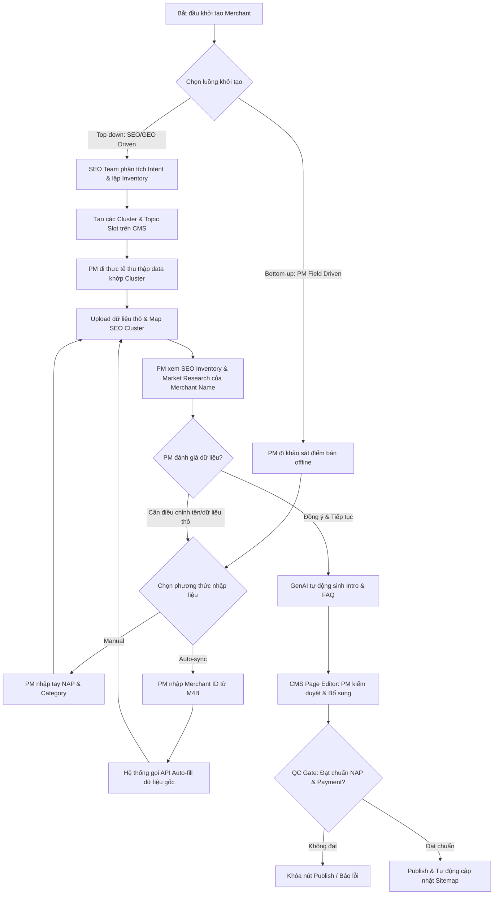
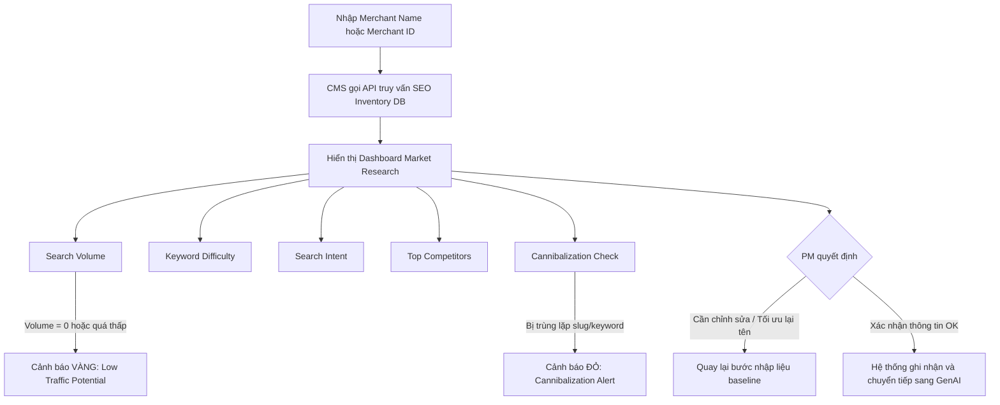

# BRD: Merchant Detail Page - SME Digital Presence Platform

> - **Project:** Merchant Detail Page (SME Digital Presence + O2O Ecosystem)
> - **Main URL:** momo.vn/merchant
> - **Division:** GPD (Growth Platform Division)
> - **Use Case:** Merchant Pages
> - **Owner:** GPD - Web Platform
> - **Governance:** SEO & GEO Lead
> - **PIC Build:** Nhật (Build Lead) - Hoài Anh (MoSpark Architecture)
> - **Version:** 2.6 - 2026-05-29
> - **Status:** Pilot Phase - 39 Merchants Live (Phase I Pilot)

---

**Vấn đề (Problem):**
*   **Rò rỉ Search Traffic:** Sự thiếu hụt nền tảng hiển thị đối tác (Merchant Detail Page) trên Web dẫn đến việc rò rỉ lượng truy cập có ý định giao dịch cao (High Purchase Intent) sang các trang danh bạ của bên thứ ba.
*   **Đứt gãy luồng O2O:** SME offline hoàn toàn vô hình trước Google Search & AI Engines, làm mất đi điểm chạm tự nhiên để MoMo kích hoạt các sản phẩm trong hệ sinh thái (Ví Trả Sau, Soundbox, Hoàn tiền).

**Chỉ số KPI chịu trách nhiệm (KPI Owned):**
*   Tăng trưởng lượt kích hoạt Ví Trả Sau (VTS Activations) & Tương tác O2O (O2O Engagement) từ `momo.vn/merchant` (đo lường và ghi nhận qua Appsflyer + Umami).

**Giá trị cốt lõi cho SME (SME Value Prop):**
*   Sở hữu diện diện số (Digital Assets) hoàn toàn miễn phí trên Web (momo.vn) và các câu trả lời của AI Agent (AI Search Responses) mà không tốn chi phí marketing.

---

## 1. Executive Summary

### Situation

Hai vấn đề song song trong một kiến trúc.

**Phía Consumer:** User search "{Merchant} có nhận Ví Trả Sau không" là nhóm có purchase intent cao nhất có thể capture trên Web - họ đã chọn merchant, đã chọn phương thức thanh toán, chỉ cần một xác nhận. MoMo không có trang nào serve được intent này ở cấp độ merchant cụ thể. 85K organic traffic/quý đang chảy vào 2 legacy systems không có conversion goal: `/thanh-toan-momo-{merchant}` (18K, content outdated 5-7 năm) và `/page/{id}` (67K, thin content không cập nhật).

**Phía SME:** Merchant nhỏ - quán bún thịt nướng, tiệm cà phê, hàng chả giò - không có website, không có ngân sách digital marketing. Họ hoàn toàn vô hình trên Google Search và AI engine khi user tìm kiếm. MoMo có hạ tầng web và merchant data để tạo Digital Presence cho họ miễn phí, đổi lại merchant có động lực adopt ecosystem O2O (Soundbox + VTS + Hoàn tiền).

### Complication

Consumer traffic với intent cao nhất đang thoát ra tay bên thứ 3 - không có conversion. SME không thể tự build Digital Presence. 2 legacy systems không chỉ không convert - chúng là gánh nặng: crawl budget waste, thin content kéo giảm site quality toàn domain, keyword cannibalization với kiến trúc mới.

ZaloPay đã build `/doi-tac/{merchant}` cho F&B chains nhưng chưa khai thác BNPL và SME angle - đây là cửa sổ cơ hội MoMo đi trước.

### Resolution

`momo.vn/merchant/{slug}` là một **SME Digital Presence product**, không phải trang thông tin. Product có hai jobs song song:

**Job 1 - SME:** Mỗi merchant dù nhỏ đến đâu đều có một trang truyền thông đầy đủ trên momo.vn: UI tốt, hiển thị SERP, xuất hiện trong AI responses. Miễn phí. MoMo tạo và maintain - merchant không cần tự build hay bảo trì.

**Job 2 - Consumer:** User xác nhận ngay merchant có nhận MoMo/VTS không và kích hoạt O2O trong 3 bước - không cần đọc dài.

4 template variants phục vụ đa dạng merchant từ brand chain đến SME cơ bản. QR code tại điểm bán kết nối offline với Digital Presence. Schema markup đảm bảo xuất hiện trong AI Overview và LLM - GEO moat dài hạn. Song song 301 redirect 2 legacy systems để consolidate authority vào 1 architecture sạch.

**Value exchange:** MoMo tạo Digital Presence miễn phí cho SME → SME adopt Soundbox/VTS → Consumer có O2O trải nghiệm tốt → Transaction volume tăng.

---

## 🚀 PHASE I: FOUNDATION & MEGA CAMPAIGN PILOT

## 2. Bối Cảnh Thị Trường

### 2.1 Hiện Trạng Legacy Systems

| System | URL Pattern | Organic Traffic | Vấn đề chính |
|---|---|---|---|
| Merchant Landing Pages | /thanh-toan-momo-{merchant} | 18K/quý | Content outdated 5-7 năm, không có O2O angle, không có schema |
| Thổ Địa Ăn Uống | /page/{id} | 67K/quý | Thin content quy mô lớn, thông tin sai (quán đóng cửa), crawl budget waste |

### 2.2 Vấn Đề Chất Lượng Web Từ Legacy

- Google đánh giá chất lượng ở site-level (Helpful Content System). Tỷ lệ lớn thin/outdated content kéo giảm ranking toàn bộ momo.vn.
- Crawl budget bị phân tán vào hàng nghìn trang giá trị thấp - trang mới `/merchant` bị crawl chậm hơn.
- Keyword cannibalization: 3 URLs (legacy + /merchant mới) cạnh tranh cùng merchant query.

### 2.3 Phân Tích Cạnh Tranh

| Competitor | Hiện trạng | Khoảng trống MoMo có thể tận dụng |
|---|---|---|
| ZaloPay | Build merchant directory F&B chains. Chưa có SME angle, chưa có BNPL, chưa có FAQ/HowTo schema | MoMo đi trước: SME + O2O stack + AI citation |
| Klarna (quốc tế) | merchant.klarna.com với "Pay in 4" per merchant | BNPL-first merchant directory model |
| Google Business Profile | Free local listing nhưng không integrated với payment/O2O | MoMo lợi thế: O2O loop hoàn chỉnh (Soundbox + VTS + Cashback) |

### 2.4 SME Digital Gap - Core Insight

SME nhỏ chiếm phần lớn merchant base của MoMo nhưng:
- Không có website
- Không có ngân sách digital marketing
- Hoàn toàn vô hình trên Google Search và AI engine
- Không có điểm tiếp xúc digital với khách hàng ngoài mạng xã hội cá nhân

MoMo có đủ điều kiện giải quyết gap này: domain authority momo.vn, merchant data, platform MoSpark, và O2O product stack để làm value prop thuyết phục với SME.

---

## 3. Định Hướng Dự Án

### 3.1 Dự Án Này Phục Vụ Điều Gì?

**Dual-sided product - 3 điểm kết nối:**

**Cho SME:** Mỗi `momo.vn/merchant/{slug}` là Digital Presence page hoàn toàn miễn phí. SME không cần tự build, không cần bảo trì. Được xuất hiện trên Google Search và AI Agent responses khi user tìm kiếm tên merchant hoặc danh mục.

**Cho Consumer:** Xác nhận merchant nhận MoMo/VTS và kích hoạt O2O ngay từ trang. Product job: xác nhận + activate trong 3 bước.

**Cho MoMo - O2O Ecosystem Connector:** Merchant Microsite là điểm kết nối tam giác End User / MoMo / Merchant thông qua 4 sản phẩm O2O:
- **VTS (Ví Trả Sau):** Consumer kích hoạt BNPL ngay khi biết merchant hỗ trợ
- **Soundbox:** SME thu tiền QR → QR link về Microsite → đóng vòng lặp Offline → Online
- **Hoàn tiền (Cashback):** Consumer thấy cashback offer → incentive thanh toán MoMo tại merchant
- **Xu (Reward):** Tích điểm khi thanh toán - long term loyalty loop. Chi tiết TBD Q3+.

**Phased Rollout Strategy:**
- **Phase I (Foundation & Mega Campaign Pilot):**
  - Đồng bộ API & Dữ liệu Nền tảng từ M4B (Tên, Vị trí, Logo, Danh mục, Phương thức thanh toán).
  - Launch 39 pilot merchants tối ưu hoàn hảo (chuẩn SEO, EEAT, schema markup).
  - Phục vụ Mega Campaign "Trả Sau Hoàn Sâu".
  - Hoàn thiện cấu trúc trang đối tác chuẩn chỉnh (Zone thông tin, Logo, NAP, Phương thức thanh toán).
- **Phase II (Scale, Automation & Listing Platform):**
  - Luồng tạo Merchant tự động cho PM (Auto-fill data từ M4B).
  - Nâng cấp Deep Data cho Merchant Detail (Hệ thống Review, Hình ảnh, Tiện ích).
  - Ra mắt Merchant Hub ("Tìm Điểm Hoàn Tiền") với Bản đồ & Bộ lọc.
  - Xây dựng hệ thống Listing Page (pSEO) tự động sinh hàng chục nghìn trang theo khu vực.
- **Long Term - Ví Trả Sau & Soundbox:** Merchant Page trở thành điểm kết nối thường trực giữa 2 sản phẩm cốt lõi và mạng lưới SME:
  - **Ví Trả Sau (VTS):** Merchant Page là bãi đáp xác nhận "quán này nhận VTS" -> kích hoạt user mở/dùng VTS tại điểm bán. Online -> Offline.
  - **Soundbox:** QR tại Soundbox/điểm bán -> dẫn user về Merchant Page -> khám phá thêm ưu đãi & kích hoạt O2O product. Offline -> Online.

### 3.2 Dự Án Này KHÔNG Phải

- Không xây lại Thổ Địa Ăn Uống (hệ thống review local)
- Không phải CMS cho merchant tự quản lý
- Không phải store locator (merchant-level, không phải branch-level)
- Không phải trang marketing/campaign - đây là evergreen content + platform
- Không phải Google Business Profile replica - MoMo value-add là O2O stack, không phải local listing đơn thuần

---

## 4. JTBD Analysis (Phân tích Nhu cầu Multi-sided & Niche)

Hệ thống Merchant Page không đơn thuần là một trang thông tin địa chỉ mà được thiết kế để phục vụ nhu cầu của nhiều nhóm đối tượng (Multi-sided Platform) trong hệ sinh thái O2O của MoMo, tuân thủ cấu trúc tiêu chuẩn **Khi [tình huống] ➔ Tôi muốn [hành động] ➔ Để [giá trị nhận về]**:

### 4.1 Cho Chủ quán (SME): Sở hữu "Điểm chạm Số" chính chủ - Giải tỏa lo âu Marketing & Tăng trưởng doanh thu
*   **Khi:** Quán ăn của tôi (SME yếu thế) hoàn toàn không có sự diện diện trực tuyến, không có ngân sách hoặc nhân lực làm digital marketing, đồng thời lo sợ bị lãng quên trước đối thủ cạnh tranh có công nghệ tốt hơn,
*   **Tôi muốn:** Sở hữu một trang thông tin đối tác chuẩn hóa thương hiệu trên domain uy tín `momo.vn` hiển thị NAP xác thực, menu thực tế, và xác minh các phương thức thanh toán (MoMo, Ví Trả Sau, Soundbox) mà không tốn chi phí lập trình hay vận hành,
*   **Để tôi có thể:** Giải tỏa hoàn toàn nỗi lo âu về marketing kỹ thuật số, tự hào giới thiệu quán ăn của mình đến cộng đồng, tạo niềm tin cho khách hàng và tiếp cận tệp người dùng khổng lồ để trực tiếp tăng trưởng doanh thu.

---

### 4.2 Cho Người dùng (Consumer): Ra quyết định lựa chọn Quán & Cách thức chi trả
*   **Khi:** Tôi và nhóm bạn đang chuẩn bị tụ họp đi ăn uống hoặc giải trí và muốn tối ưu hóa chi phí cũng như phương thức thanh toán thuận tiện nhất,
*   **Tôi muốn:** Tra cứu nhanh thực đơn (Menu) cập nhật, khoảng giá cả, các ưu đãi/hoàn tiền đang hoạt động, các tiện ích thực tế tại quán (máy lạnh, wifi, chỗ đỗ xe hơi/xe máy), cũng như xác thực quán có hỗ trợ quét mã Soundbox/Ví Trả Sau (BNPL) trước khi đến,
*   **Để tôi có thể:** Ra quyết định lựa chọn địa điểm phù hợp nhất với khẩu vị và ngân sách, tránh các tình huống bất tiện khi đến nơi (không có máy lạnh, không đỗ được xe, giá quá đắt) và loại bỏ hoàn toàn sự cố bối rối/ngại ngùng vì bị từ chối thanh toán BNPL tại quầy.

---

### 4.3 Cho Đội ngũ Phát triển Đối tác (MoMo Sales / BD): Công cụ chốt deal (Sales Kit) tại thực địa
*   **Khi:** Tôi (BD/Sales) đi thị trường tiếp cận các chủ quán truyền thống để thuyết phục họ lắp đặt Soundbox hoặc chấp nhận thanh toán MoMo,
*   **Tôi muốn:** Trình chiếu trực tiếp trên điện thoại một trang đối tác mẫu chuyên nghiệp, trực quan hiển thị đầy đủ các tiện ích truyền thông số hóa miễn phí mà quán ăn của họ sẽ nhận được khi tham gia mạng lưới,
*   **Để tôi có thể:** Tăng tỷ lệ chốt hợp đồng (conversion rate), giải thích rõ ràng và thuyết phục giá trị gia tăng của việc lắp đặt Soundbox, và rút ngắn tối đa thời gian đàm phán thương lượng với đối tác.

---

### 4.4 Cho Đội ngũ Tăng trưởng (MoMo BU Growth & Campaign): Landing Page chiến dịch liên kết thương hiệu lớn (Key Accounts)
*   **Khi:** Tôi (PM Growth) cần triển khai chiến dịch co-branded liên kết với thương hiệu lớn (e.g. Giảm 10% tại Phê La) và cần hướng dòng traffic từ các kênh nội bộ (In-App notification/banner) hoặc bên ngoài (Ads/SEO),
*   **Tôi muốn:** Có một trang đối tác chuẩn hóa (Phê La Merchant Page) làm Landing Page chiến dịch chứa thông tin thể lệ ưu đãi, các chi nhánh áp dụng và CTA Onelink/Deeplink mượt mà,
*   **Để tôi có thể:** Tối ưu hóa tỷ lệ chuyển đổi của chiến dịch marketing, đảm bảo trải nghiệm khách hàng không bị đứt gãy, và hứng toàn bộ lượng organic search traffic tìm kiếm ưu đãi liên quan đến thương hiệu đối tác trên Google.

---

## 5. Kiến Trúc Web

### 5.1 URL Architecture

| Cấp | URL Pattern | Số lượng | Vai trò |
|---|---|---|---|
| Hub | `momo.vn/merchant` | 1 | Discovery + Navigation |
| Merchant Detail | `momo.vn/merchant/{ten-merchant}-{id}` | 39 (pilot) → Hàng nghìn đối tác (scale) | Decision + O2O Conversion (cho cả SME và Chain) |
| Sub-pages (Phase II) | `momo.vn/merchant/{slug}/{sub-page}` | **[TẠM GÁC LẠI / SHELVED]** | Tạm hoãn; tất cả các thông tin Menu/Chi nhánh/Ưu đãi gom về trang chính. |

**Slug pattern:** `{ten-merchant}-{id}` - tên merchant kebab-case không dấu, không tỉnh thành, kết thúc bằng ID backend tự assign. Ví dụ thực tế: `momo.vn/merchant/bun-thit-nuong-chi-tuyen-44`.

**Nguyên tắc cấu trúc trang chi tiết Merchant (Áp dụng tạm thời - Gác lại việc tạo Sub-pages):**
*   **Tạm gác lại toàn bộ việc chia tách sub-pages:** Nhằm tập trung nguồn lực vận hành và tối ưu hóa SEO trong giai đoạn hiện tại, MoMo tạm hoãn việc phát triển các URL sub-pages riêng biệt (`/menu`, `/chi-nhanh`, `/uu-dai`) cho tất cả các nhóm đối tác (bao gồm cả SME đơn chi nhánh và các Chuỗi thương hiệu lớn).
*   **Giải pháp thay thế (Tích hợp Inline toàn bộ):**
    - **Giao diện thống nhất:** Toàn bộ thông tin thực đơn (Menu), danh sách chi nhánh (đối với Chuỗi), khoảng giá cả, các ưu đãi/hoàn tiền và tiện ích điểm bán sẽ được hiển thị **inline** trực tiếp trên một trang chính duy nhất `/merchant/{slug}`.
    - **UX Tabs/Scroll:** Sử dụng các tab chuyển đổi giao diện phía Client-side (không thay đổi URL) hoặc cấu trúc phân khu dạng scroll-spy để người dùng dễ dàng chuyển đổi qua lại giữa Menu, Chi nhánh và Ưu đãi.
    - **Cơ chế Redirection bắt buộc:** Bộ định tuyến (Router) của hệ thống sẽ tự động thực hiện **301 Permanent Redirect** về trang chính `/merchant/{slug}` đối với bất kỳ lượt truy cập hoặc request nào đến các sub-path ảo (e.g. `/merchant/{slug}/menu`, `/merchant/{slug}/chi-nhanh`, `/merchant/{slug}/uu-dai`) để tránh lỗi 404 và tập trung điểm SEO (link juice).

### 5.2 Template System

Hệ thống sử dụng một template chuẩn duy nhất cho mọi đối tác để đảm bảo tính đồng bộ thương hiệu và tối ưu hóa thời gian triển khai.

### 5.3 Merchant Detail Page Structure

Mỗi trang `momo.vn/merchant/{slug}` là một trang đối tác độc lập, bao gồm các phần chính sau:

| # | Thành phần | Loại | Chi tiết |
|---|---|---|---|
| 1 | Banner/Logo đối tác | Platform Data | Ảnh thương hiệu chính thức của đối tác (lấy từ dữ liệu đối tác MoMo/M4B). |
| 2 | NAP (Merchant Data) | Platform Data - Structured | Tên đối tác, danh mục ngành nghề, số điện thoại liên hệ, địa chỉ chính thức và giờ hoạt động. |
| 3 | Payment Methods | Platform Module | Hiển thị rõ các phương thức thanh toán chấp nhận (Ví MoMo, Ví Trả Sau). |
| 4 | O2O Promotion Stack | Platform Module | Khung hiển thị thông tin chương trình khuyến mãi/Ví Trả Sau (Ví dụ: Trả Sau Hoàn Sâu). |
| 5 | Merchant Description | Content | Bài viết giới thiệu ngắn gọn về đối tác. |
| 6 | HowTo & FAQ | Content | Hướng dẫn các bước thanh toán và các câu hỏi thường gặp. |

**Nguyên tắc nội dung:**
- Thông tin hành chính (địa chỉ, điện thoại, giờ hoạt động) được lấy từ dữ liệu gốc đã đồng bộ, không tự sinh hoặc nhập thủ công trong bài viết để tránh sai lệch dữ liệu.
- Mọi thông tin chương trình ưu đãi được quản lý và inject tự động từ một nguồn duy nhất đã qua phê duyệt pháp lý.
- **Function VTS Module (Fixed - YMYL):** Là một chức năng hiển thị tĩnh nằm trong O2O Promotion Stack (Thành phần #4), tự động hiển thị thông tin đặc tả pháp lý của Ví Trả Sau (Lãi suất 0% trong hạn, Hạn mức 1-20 triệu, Phí duy trì 30k-33k/tháng chỉ thu khi có giao dịch, Đối tác TPBank/Shinhan). Nội dung này được inject tự động từ template hệ thống, biên tập viên không chỉnh sửa thủ công để đảm bảo tuân thủ pháp lý tài chính.

### 5.4 O2O Solution Stack

| Sản phẩm | Vai trò trên Merchant Page | Điều kiện hiển thị | CTA |
|---|---|---|---|
| VTS (Ví Trả Sau) | Mua trước trả sau tại merchant | Merchant có trong VTS merchant list (Đã verify từ M4B & PO) | "Kích hoạt Ví Trả Sau" → Onelink |
| Hoàn tiền (Cashback) | Ưu đãi cashback khi thanh toán MoMo | Merchant đang chạy cashback campaign (Release theo Mega) | "Xem ưu đãi hoàn tiền" → App |
| Soundbox | Giải pháp thu tiền QR cho SME | **[TẠM HOÃN / SHELVED]** | Hiện tại chưa triển khai gì về Soundbox trên Web. |
| Xu (Reward) | Tích điểm thưởng khi thanh toán tại merchant | TBD - Product vision Q3+ | TBD |

### 5.5 Schema & GEO Requirements

| Cấp trang | Schema bắt buộc | GEO Target |
|---|---|---|
| Hub `/merchant` | ItemList - FAQPage - Organization - BreadcrumbList | "MoMo có những đối tác nào" |
| Merchant `/merchant/{slug}` | LocalBusiness - FAQPage - HowTo - Offer - BreadcrumbList | "{Merchant} có nhận VTS không" |
| Sub-pages (Phase II) | **[TẠM GÁC LẠI / SHELVED]** | - |

### 5.6 Search Intent Mapping

| Keyword Pattern | Intent | Landing Page | CTA |
|---|---|---|---|
| "{Merchant} có nhận MoMo không" | Navigation/BoFu | /merchant/{slug} | Thanh toán ngay |
| "{Category} nhận MoMo" | MoFu | /merchant | Xem đối tác |
| "Ưu đãi MoMo {danh mục}" | Commercial | /merchant | Xem ưu đãi |
| "Ví Trả Sau {Merchant}" | BoFu | /merchant/{slug}#vi-tra-sau | Kích hoạt VTS |
| "{Merchant} review" | Informational | /merchant/{slug} | Review block (nếu có) |

---

## 6. Comm Activities

3 channel song song - không phụ thuộc nhau, cộng hưởng nhau.

### 6.1 SEO - Organic Search

- **Cơ chế:** LocalBusiness + FAQPage + HowTo schema + Long Content + Internal Linking
- **Target keyword:** "{Merchant} có nhận MoMo không", "{Merchant} VTS"
- **Gate bắt buộc:** Foundation Checklist pass trước publish. CWV gate (LCP < 2.5s, INP < 200ms, CLS < 0.1).
- **Expected:** Top 5 cho 80% branded merchant queries trong 90 ngày post-launch.

### 6.2 QR Code Tại Điểm Bán (O2O Offline-to-Digital)

- **Cơ chế:** QR code dán tại quầy/Soundbox → link về `/merchant/{slug}`
- **UTM structure:** `?utm_source=qr&utm_medium=offline&utm_campaign=soundbox&utm_content={merchant_id}`
- **Mục tiêu:** Khách tại điểm bán scan QR → vào trang merchant → thấy O2O offers → kích hoạt
- **Attribution:** Umami track on-site event + Appsflyer track app open sau QR scan
- **Rollout priority:** Soundbox merchants trước - QR đã có trên máy, chỉ cần update link về /merchant/{slug}

### 6.3 LLM / AI Agent Search (GEO)

- **Cơ chế:** Structured data + Entity signal + FAQ content cho Google AI Overview, ChatGPT, Perplexity
- **Target queries:** "Quán [tên] có nhận MoMo không?", "[Merchant] review", "Cách thanh toán MoMo tại [merchant]"
- **Gate bắt buộc:** FAQPage + HowTo schema required. LocalBusiness schema với đầy đủ NAP + openingHours.
- **Measurement:** Manual check AI responses + GSC AI Referral tracking

---

## 7. Content Production Scale

Lộ trình phát triển nội dung và mở rộng quy mô trang đối tác được thực hiện theo các giai đoạn rõ ràng:

### 7.1 Giai đoạn Pilot (Phase I)
- **Đối tượng:** 39 merchant SME thuộc chiến dịch truyền thông OOH "Trả Sau Hoàn Sâu" (chi tiết danh sách và trạng thái tại Launch Matrix - Section 10.1).
- **Mục tiêu:** Kiểm thử chất lượng hiển thị (NAP, Schema), tính pháp lý của dữ liệu và đo lường baseline hiệu quả traffic ban đầu.

### 7.2 Giai đoạn Mở rộng (Phase II)
- **Nhóm Chuỗi Thương Hiệu lớn (Top Brand Chains):** Triển khai trang chi tiết cho các chuỗi đối tác lớn (như Highlands, Katinat, Circle K, Pharmacity, Co.opmart...) nhằm thu hút lượng truy cập tự nhiên từ các tìm kiếm thương hiệu lớn có volume cao.
- **Nhóm SME:** PM và Cell Team chủ động onboard diện rộng các đối tác SME hoạt động trên hệ thống (đặc biệt là các merchant sử dụng Soundbox và chấp nhận Ví Trả Sau) thông qua công cụ CMS tự động hóa.
- **Quy mô pSEO:** Tự động sinh hàng chục nghìn trang Listing Page khu vực theo địa bàn hành chính (Tỉnh/Thành phố, Quận/Huyện) để tối ưu hóa SEO địa phương (Local Search Intent).

---

## 8. Success Metrics

Dự án đo lường sự thành công dựa trên 3 chỉ số cốt lõi sau:

| Success Metric | Target / Kỳ vọng | Nguồn đo lường |
|---|---|---|
| **Số merchant chuẩn chỉnh được xuất bản** | - **Phase I (Pilot):** 39/39 SME merchants hoàn thành 100% checklist chất lượng (NAP, O2O Stack, Schema). - **Phase II (Scale):** Toàn bộ đối tác SME và chuỗi thương hiệu được onboard tự động đạt chuẩn chất lượng, không lỗi thin content. | MoSpark CMS / QC Gate |
| **Traffic (Organic Traffic)** | Đạt tối thiểu 85.000 sessions/quý (không giảm net so với legacy systems) và tăng trưởng tịnh tiến theo số lượng merchant onboard mới. | Google Search Console & Umami |
| **SoV (Share of Voice) từng tên merchant** | Đạt top 3-5 thứ hạng đầu (hoặc chiếm >80% hiển thị) cho các từ khóa tìm kiếm thương hiệu đối tác như `"[Tên Merchant] có nhận MoMo không"`, `"[Tên Merchant] Ví Trả Sau"`. | Google Search Console & Rank Tracker |

---

## 9. Dependencies & Constraints

| Dependency | Mô tả | Trạng thái / Ghi chú | PIC |
|---|---|---|---|
| VTS merchant list (updated) | List merchants chấp nhận VTS - quyết định hiển thị VTS badge | **DONE** (Đã được verify từ M4B và PO VTS) | PO VTS verify |
| VTS Terms Data | Lãi suất, hạn mức, phí - YMYL, sai data = legal risk | **DONE** (Đã được verify từ PO VTS) | PO VTS verify |
| Soundbox merchant list | Merchants dùng Soundbox để ưu tiên onboard pilot | **N/A** (Gác lại, chưa triển khai Soundbox trên Web) | BD/Soundbox team |
| Cashback campaign data | Merchants đang chạy hoàn tiền để inject Promotion Module | **RELEASE BOUND** (Theo chiến dịch Mega) | Campaign team |
| PAGE_ID → Merchant mapping | Export từ Thổ Địa DB cho legacy audit + redirect | Có | Hiến request |
| MoSpark platform readiness | LP Builder sẵn sàng với template chuẩn + KV slot | Có | Hoài Anh |
| Merchant Structured Data Schema | Form nhập liệu có cấu trúc: name, address, hours, phone, payment_methods. Single source of truth cho tất cả display components. | Có - phải có trước build content | Hoài Anh (schema design) + Nhật (form UI) |
| Deep Link specs per merchant | Onelink URLs cho O2O CTAs | Có | DA team |
| Umami tracking setup | Track page view, O2O CTA click, QR scan. Phải có trước launch | Có | Thuận |

**Constraints:**
- Content production trên MoSpark - không custom development
- VTS badge chỉ gắn sau khi verify với PO team - không dựa trên blog data
- Soundbox CTA: Tạm hoãn, không triển khai trên Web ở giai đoạn này.
- Schema markup inject qua MoSpark template - không hardcode
- Inbound không làm việc trực tiếp với Web Platform - mọi technical request qua SEO & GEO Lead

---

## 10. Action Plan - Phase 1: Pilot 39 Merchants

> **Scope:** Toàn bộ 39 SME Soundbox merchants trong chiến dịch Mega 2026. Top Brand Chains sẽ được xử lý riêng sau khi pilot SME hoàn tất.
> **Nguyên tắc slug:** `{ten-merchant}-{id}` - tên merchant kebab-case không dấu, kết thúc bằng ID backend tự assign.
> **Redirect rule:** 308 Permanent (không dùng 301 - giữ method). 3 merchants có legacy /page/ URL vẫn cần set redirect dù page mới đã live.
> **Status cập nhật:** 2026-05-29 - Toàn bộ 39 trang đã live.

### 10.1 Launch Matrix - Toàn bộ 39 SME Merchants (Live)

| # | Merchant | Tỉnh/TP | URL cũ | URL thực tế | Redirect Status |
|---|---|---|---|---|---|
| 1 | Bún thịt nướng Chị Tuyền | HCM | `/page/9819516` | `/merchant/bun-thit-nuong-chi-tuyen-44` | **308 DONE** |
| 2 | Cơm tấm Ống Khói Diệu | An Giang | Không có | `/merchant/com-tam-ong-khoi-dieu-45` | Clean |
| 3 | Hủ tiếu Mỹ Tho Thanh Xuân | HCM | Không có | `/merchant/hu-tieu-my-tho-thanh-xuan-69` | Clean |
| 4 | Bánh ướt Cây Me | Cần Thơ | Không có | `/merchant/banh-uot-cay-me-can-tho-48` | Clean |
| 5 | A Tỷ mì xào giòn - Bột chiên | Đồng Nai | Không có | `/merchant/a-ty-mi-xao-gion-bot-chien-64` | Clean |
| 6 | Hủ tiếu Nam Vang Ông Hai Bầu | Đồng Nai | Không có | `/merchant/hu-tieu-nam-vang-ong-hai-bau-75` | Clean |
| 7 | Quán Cơm Chú Lùn | Cần Thơ | Không có | `/merchant/quan-com-chu-lun-47` | Clean |
| 8 | Hương Giang Bakery | Bắc Ninh | Không có | `/merchant/huong-giang-bakery-bac-ninh-63` | Clean |
| 9 | Hủ tiếu Nam Vang 69 | HCM | Không có | `/merchant/hu-tieu-nam-vang-69-50` | Clean |
| 10 | Chả giò Phượng | Đồng Nai | Không có | `/merchant/cha-gio-phuong-dong-nai-56` | Clean |
| 11 | Hải sản Ngô Thơ | Hải Phòng | Không có | `/merchant/hai-san-ngo-tho-55` | Clean |
| 12 | Chả rươi Hằng Béo | Hà Nội | `/page/9843228` | `/merchant/cha-ruoi-hang-beo-51` | **308 DONE** |
| 13 | Bánh mì Hữu Liêm | Cần Thơ | Không có | `/merchant/banh-mi-huu-liem-can-tho-49` | Clean |
| 14 | Tiệm mỳ Chú Cao | HCM | Không có | `/merchant/tiem-my-chu-cao-46` | Clean |
| 15 | Bún cá Tư Lùn | An Giang | Không có | `/merchant/bun-ca-tu-lun-54` | Clean |
| 16 | Trà đá Mạnh Nháy | Bắc Ninh | Không có | `/merchant/tra-da-manh-nhay-bac-ninh-53` | Clean |
| 17 | Xôi Trường | Bắc Ninh | Không có | `/merchant/xoi-truong-bac-ninh-52` | Clean |
| 18 | Bánh mì Cây Khánh Nạp | Hải Phòng | Không có | `/merchant/banh-mi-cay-khanh-nap-70` | Clean |
| 19 | Bún chả Cô Hường | Hải Phòng | Không có | `/merchant/bun-cha-co-huong-58` | Clean |
| 20 | Lẩu Mắm ruốc 8 Còn | Bình Dương | `/page/9949928` | `/merchant/lau-mam-ruoc-8-con-80` | **308 DONE** |
| 21 | Bò lá lốt Chị Hằng | Bình Dương | Không có | `/merchant/bo-la-lot-chi-hang-68` | Clean |
| 22 | Bún thịt nướng Cô Bế | Bình Dương | Không có | `/merchant/bun-thit-nuong-co-be-71` | Clean |
| 23 | Miến lươn chân cầm | Hà Nội | Không có | `/merchant/mien-luon-chan-cam-72` | Clean |
| 24 | Mỳ Cường Thư | Thanh Hóa | Không có | `/merchant/mi-cuong-thu-thanh-hoa-65` | Clean |
| 25 | Tiệm chè Hữu Hoa | Cần Thơ | Không có | `/merchant/tiem-che-huu-hoa-can-tho-66` | Clean |
| 26 | Miến gà Cô Nhân | - | Không có | `/merchant/mien-ga-co-nhan-59` | Clean |
| 27 | Cơm tấm Đi Đức | - | Không có | `/merchant/com-tam-di-duc-57` | Clean |
| 28 | Quán Cô Hai Thượng | - | Không có | `/merchant/quan-co-hai-thuong-62` | Clean |
| 29 | Cháo bò Ô Lien | Đà Nẵng | Không có | `/merchant/chao-bo-o-lien-da-nang-73` | Clean |
| 30 | Bún chả cá Hòn | - | Không có | `/merchant/bun-cha-ca-hon-74` | Clean |
| 31 | Bún mắm Đi Liên | Đà Nẵng | Không có | `/merchant/bun-mam-di-lien-da-nang-76` | Clean |
| 32 | Cháo sườn Cô La | Hà Nội | Không có | `/merchant/chao-suon-co-la-ha-noi-77` | Clean |
| 33 | Giò chả Bà Bình | - | Không có | `/merchant/gio-cha-ba-binh-78` | Clean |
| 34 | Nộm bò khô Long Vị Dũng | - | Không có | `/merchant/nom-bo-kho-long-vi-dung-79` | Clean |
| 35 | Hàng chè Bà Thơm | - | Không có | `/merchant/hang-che-ba-thom-60` | Clean |
| 36 | Cafe bột lồng ly | - | Không có | `/merchant/cafe-bot-long-ly-81` | Clean |
| 37 | Quán lươn Xuân Leo | - | Không có | `/merchant/quan-luon-xuan-leo-61` | Clean |
| 38 | Nem chua Phượng Chi Lê | - | Không có | `/merchant/nem-chua-phuong-chi-le-67` | Clean |

**3 legacy /page/ URLs đã được hoàn tất 308 redirect (DONE - tuần 1 tháng 6):**
- `/page/9819516` → `/merchant/bun-thit-nuong-chi-tuyen-44`
- `/page/9843228` → `/merchant/cha-ruoi-hang-beo-51`
- `/page/9949928` → `/merchant/lau-mam-ruoc-8-con-80`

### 10.2 Lưu Ý Kỹ Thuật

- **GSC Coverage:** 39 pages đã live nhưng indexing chưa verify. Check GSC Coverage Report tuần 2 T6.
- **Redirect timing:** Đã hoàn tất cấu hình và kích hoạt thành công redirect 308 cho 3 URLs legacy về trang mới.
- **Canonical:** Page `/merchant/{slug}` phải có self-referencing canonical. Kiểm tra trước khi đóng ticket.
- **Sitemap:** Verify 39 URLs mới đã được add vào sitemap. 3 /page/ URLs cần xóa khỏi sitemap cùng lúc set redirect.
- **Sitemap:** Thêm `/merchant/{slug}` vào sitemap ngay khi live. Xóa URL cũ khỏi sitemap cùng lúc set redirect.

---

## 🌌 PHASE II: SCALE, AUTOMATION & LISTING PLATFORM

### 11. Luồng Tạo Merchant Tự Động Cho PM

Nhằm giảm thiểu tác vụ kỹ thuật thủ công và tối ưu hóa vận hành, MoSpark CMS sẽ thiết lập quy trình khởi tạo trang đối tác (Creation Workflows) theo hai hướng tiếp cận chính:

#### 11.1 Chi tiết hai luồng khởi tạo

**Luồng 1: Khởi tạo định hướng SEO/GEO (Top-down)**
Luồng này do đội ngũ SEO/Data định hướng dựa trên nhu cầu tìm kiếm thực tế của thị trường:
1. **Phân tích Intent:** Team SEO phân tích Customer Journey và Search Intent để xác định các cơ hội traffic.
2. **Tạo Topic Slot:** Tạo sẵn các cụm từ khóa (Topic Cluster) trên CMS (Ví dụ: "Top quán Bún chả ngon Hà Nội").
3. **Thu thập dữ liệu:** PM/Sales đi thị trường dựa trên danh sách slot này để thu thập thông tin và ảnh thực tế khớp với cụm chủ đề đã lên kế hoạch.
4. **Xem SEO Inventory (Market Research) & Xác nhận:** Trước khi kích hoạt quá trình tạo trang, PM xem trước thông tin SEO Inventory (Market Research) liên quan đến Merchant Name đó được hệ thống kết xuất để xác thực định hướng từ khóa và đối thủ cạnh tranh.

**Luồng 2: Khởi tạo định hướng điểm bán (Bottom-up)**
Luồng do PM và Sales đi thực tế tại các điểm bán (offline) chủ động onboard đối tác:
1. PM khảo sát trực tiếp điểm bán, chụp hình menu, không gian quán và ghi nhận tọa độ GPS.
2. PM truy cập MoSpark CMS và chọn phương thức nhập liệu:
   - **Nhập liệu thủ công (Manual):** PM tự điền các thông tin NAP (Name, Address, Phone) và chọn danh mục.
   - **Đồng bộ tự động (Auto-sync M4B):** PM chỉ cần nhập `Merchant ID`. Hệ thống tự động gọi API đồng bộ để điền đầy đủ các trường thông tin hành chính đã có trên hệ thống MoMo App.
3. **Xem SEO Inventory (Market Research):** Trước khi tạo trang, hệ thống hiển thị dữ liệu Market Research của Merchant Name đó (Search Volume, KD, Search Intent, Competitors) từ SEO Inventory Database để PM phê duyệt và căn chỉnh định hướng từ khóa trước khi sinh bài.
4. **Tạo nội dung tự động:** Sau khi xác nhận dữ liệu baseline và SEO Inventory, hệ thống kích hoạt GenAI để tạo bài giới thiệu và FAQ. PM thực hiện review lần cuối trước khi bấm Publish.

#### 11.2 Cơ chế kiểm duyệt và Onboard tự động (Workflow Spec)
1. **Slug conflict check:** Hệ thống tự động kiểm tra tính duy nhất của slug URL. Nếu bị trùng, hệ thống tự động thêm ID backend làm hậu tố (Ví dụ: `bun-thit-nuong-chi-tuyen-44`) để tránh lỗi trùng lặp URL.
2. **QC Gate Validation:** CMS tự động rà soát các trường NAP và Payment Methods. Nếu thiếu thông tin bắt buộc, nút Publish sẽ bị khóa và hiển thị cảnh báo lỗi chi tiết.
3. **Publish & Indexing:** Khi PM xác nhận Publish thành công, hệ thống MoSpark sẽ tự động cập nhật URL mới vào file XML sitemap và gửi ping index lên Google.
4. **SEO Inventory & Market Research Preview (Trước khi tạo):** Nhằm hỗ trợ PM đưa ra quyết định tối ưu hóa cấu trúc nội dung và định hướng từ khóa trước khi kích hoạt tạo trang và sinh nội dung GenAI, CMS sẽ tự động truy vấn và hiển thị báo cáo nghiên cứu thị trường (Market Research) của Merchant Name đó:
   - **Search Volume (Lượng tìm kiếm):** Hiển thị lượt tìm kiếm trung bình tháng của tên merchant hoặc các từ khóa thương hiệu + địa điểm liên quan.
   - **Keyword Difficulty (KD):** Chỉ số độ khó từ khóa (0-100) để đánh giá mức độ cạnh tranh trên công cụ tìm kiếm.
   - **Search Intent (Ý định tìm kiếm):** Xác định loại Intent chính (Local Search, Transactional, Informational).
   - **Top Ranking Competitors:** Danh sách top 5 đối thủ cạnh tranh đang xếp hạng cao nhất cho cụm từ khóa liên quan trên Google SERP.
   - **Keyword Cannibalization Alert:** Cảnh báo nếu từ khóa/tên merchant bị trùng lặp mục tiêu (cannibalization) với các trang merchant hoặc listing page đã xuất bản trước đó trên domain momo.vn.

#### 11.3 Chi tiết Màn hình Preview SEO Inventory & Market Research (Sub-workflow)

Để Nhật và đội ngũ kỹ thuật dễ dàng hình dung giao diện và các điều kiện logic tại màn hình Preview trước khi tạo trang, dưới đây là sơ đồ luồng xử lý chi tiết:

**Các quy tắc hiển thị giao diện (UI Logic):**
- **Cảnh báo Đỏ (Red Warning):** Bắt buộc hiển thị nổi bật nếu tên merchant tạo ra một slug trùng khớp hoàn toàn với một URL đang hoạt động hoặc trùng lặp keyword mục tiêu chính của một trang khác. Gợi ý PM sửa tên hoặc thêm hậu tố.
- **Cảnh báo Vàng (Yellow Alert):** Hiển thị dạng chú thích (tooltip/note) nếu lượng tìm kiếm (Search Volume) của merchant bằng 0, giúp PM cân nhắc mức độ ưu tiên làm nội dung.
- **Nút Action:** PM có thể chọn `Hủy & Sửa đổi` (quay lại bước nhập liệu) hoặc `Kích hoạt Tạo trang` (bắt đầu chạy GenAI).

### 12. Nâng Cấp Deep Data Cho Merchant Detail
Nâng cao giá trị thông tin và độ uy tín (E-E-A-T) của trang chi tiết bằng cách làm giàu nguồn dữ liệu:
- **Tích hợp Media & Cơ chế GenAI Design (Gemini Banana):**
  * **Đồng bộ & Tải lên:** Đồng bộ hoặc cho phép PM tải lên tối thiểu 3 ảnh chất lượng thực tế về không gian quán, menu thực đơn và món ăn tiêu biểu.
  * **GenAI Design Pipeline (Gemini Banana):** Khi PM tải lên một ảnh bất kỳ của quán với kích thước bất kỳ, hệ thống gọi pipeline GenAI Design (sử dụng Gemini Banana) để tự động áp dụng prompt làm nét, chỉnh sáng và retouch ảnh. Hệ thống tự động tối ưu hóa và xuất ra các kích thước chuẩn để đẩy vào Gallery bao gồm: ảnh **Banner** (1050x450 px) và hình **Social Share** (1200x630 px).
  * **Định hướng tương lai:** Mở rộng khả năng tự động xử lý và retouch cho bất kỳ hình ảnh nào được tải lên trực tiếp thông qua trình soạn thảo CMS Page Editor.
- **Tích hợp đánh giá (Review Integration):** Hiển thị điểm rating trung bình (1-5 sao) và số lượng đánh giá tổng hợp từ các nguồn:
  * Giao dịch thực tế trên MoMo (phản hồi sau khi user thực hiện thanh toán thành công).
  * Google Places API (kéo điểm đánh giá trung bình từ Google Maps qua cơ chế matching địa chỉ & GPS).
- **Trường thông tin tiện ích (Merchant Amenities):** Thêm bộ thuộc tính tiện ích điểm bán dưới dạng check-box hiển thị trực quan: Có chỗ đậu xe hơi, Có máy lạnh, Có Wi-Fi miễn phí, Có khu vực hút thuốc riêng, Có khu vui chơi trẻ em.

### 13. Merchant Hub - "Tìm Điểm Hoàn Tiền"
Xây dựng trang chủ `momo.vn/merchant` đóng vai trò là danh bạ đối tác (Merchant Directory) tập trung, đặc biệt hữu ích để giữ chân lượng traffic khổng lồ sau các chiến dịch Mega:
- **Bản đồ tương tác (Interactive Map Widget):**
  * Tích hợp Google Maps hoặc bản đồ nội bộ MoMo hiển thị danh sách merchant đối tác.
  * Tự động xác định vị trí của người dùng bằng định vị GPS trên trình duyệt (khi được cấp quyền) và hiển thị các quán có ưu đãi trong bán kính 1km-5km.
- **Thanh tìm kiếm thông minh (Smart Search Bar):**
  * Tích hợp tính năng autocomplete (tự động gợi ý từ khóa) khi user nhập tên merchant, danh mục hoặc món ăn cụ thể.
- **Bộ lọc động (Dynamic Filters):**
  * Hỗ trợ lọc theo vị trí địa lý (Tỉnh/Thành phố, Quận/Huyện).
  * Lọc nhanh theo loại ưu đãi: "Có nhận Ví Trả Sau", "Đang có Hoàn tiền/Cashback".

### 14. Listing Page (pSEO) & Anti-Thin Content Rules
Mở rộng quy mô hiển thị tự động (Programmatic SEO) với hàng chục nghìn trang danh mục khu vực để đón đầu từ khóa tìm kiếm địa phương (local intent):
- **Cấu trúc URL & internal linking:**
  * Sinh tự động các trang listing theo cấu trúc hành chính: `momo.vn/merchant/danh-sach/{tinh-thanh}` và `momo.vn/merchant/danh-sach/{tinh-thanh}/{quan-huyen}` (Ví dụ: `momo.vn/merchant/danh-sach/hcm/quan-1`).
  * Tự động xây dựng liên kết nội bộ chéo (Internal Linking Mesh) thông qua cấu trúc breadcrumbs tiêu chuẩn: `Trang chủ -> Tìm đối tác -> TP.HCM -> Quận 1`.
- **Quy tắc chống nội dung rác (Anti-Thin Content Rules):**
  * Để ngăn ngừa Google phạt thuật toán do trang danh mục rác/ít nội dung, mỗi trang Listing Page phải có ít nhất 5 merchant đang hoạt động.
  * Mỗi trang listing tự động inject thêm 2 thành phần dynamic content:
    1. **FAQ Block:** Hỏi đáp tự động (Ví dụ: "Quận 1 có bao nhiêu quán nhận Ví Trả Sau?", "Cách thanh toán MoMo tại Quận 1").
    2. **Dynamic Top List:** Top 5 merchant được yêu thích nhất trong quận dựa trên điểm rating thực tế.
  * Nếu một quận/huyện có dưới 5 merchant hoạt động, hệ thống sẽ tự động set thẻ meta `noindex, nofollow` và ẩn khỏi sitemap để bảo vệ website crawl budget.

### 15. Gamification & Dopamine Discovery Loops (Phase III)
Nhằm kéo dài thời gian lưu trữ trên trang (Session Duration), giảm tỷ lệ thoát (Bounce Rate) và tối ưu hóa việc chuyển đổi người dùng ẩn danh trên Web, MoSpark sẽ tích hợp các cơ chế giữ chân bằng dopamine (Gamification & Interactive Discovery Loops) vào trang **Merchant Hub** (`momo.vn/merchant`) và các Landing Page chiến lược:

- **15.1 Tiện ích "Swipe to Match" (Vuốt tìm ưu đãi - Tinder-style):**
  * **Cơ chế hoạt động:** Trải nghiệm vuốt (swipe) thẻ tương tự Tinder. Người dùng được xem một tập hợp các thẻ (merchant card) chứa hình ảnh bắt mắt của quán, món ăn signature kèm theo ưu đãi độc quyền (Cashback, mã giảm giá, trả sau 0%).
  * **Hành vi tương tác:**
    * **Vuốt Phải (hoặc click Tim/Lưu):** Lưu ưu đãi vào "Túi quà của tôi" (My Bag) lưu ở Local Storage của trình duyệt. Hệ thống tự động kích hoạt Onelink/Appsflyer để đồng bộ ưu đãi này vào App MoMo khi người dùng mở App.
    * **Vuốt Trái (hoặc click Bỏ qua):** Chuyển sang thẻ của đối tác tiếp theo.
    * **Vuốt Lên (hoặc click Xem chi tiết):** Điều hướng người dùng trực tiếp vào trang Merchant Detail Page `/merchant/{slug}`.
  * **Dopamine Hook:** Cảm giác ngẫu nhiên (variable rewards) khi mỗi lần vuốt xuất hiện một quán mới cùng ưu đãi bất ngờ, kết hợp cử chỉ vuốt mượt mà tạo sự thích thú.

- **15.2 Tiện ích "Doom Scroll Feed" (Bản tin cuộn vô tận - TikTok-style):**
  * **Cơ chế hoạt động:** Một bản tin video ngắn hoặc thẻ hình ảnh cuộn dọc vô hạn (Tiktok-style infinite feed) chứa nội dung đánh giá nhanh (micro-reviews), hình ảnh món ăn thực tế và khuyến mãi tương ứng của các merchant lân cận (dựa trên GPS).
  * **Hành vi tương tác:**
    * Người dùng chỉ cần cuộn dọc (scroll) để xem các quán tiếp theo mà không cần click mở trang mới.
    * Nhấp đúp (Double-tap) để "Thả tim" và lưu quán/ưu đãi.
    * Nút CTA nổi (Sticky CTA button) luôn hiển thị ở góc màn hình: "Lấy ưu đãi ngay" hoặc "Dùng Ví Trả Sau tại quán này" để dẫn trực tiếp vào App.
  * **Dopamine Hook:** Cuộn vô hạn tạo ra vòng lặp dopamine lôi kéo sự tò mò của người dùng, mang lại trải nghiệm khám phá ẩm thực/dịch vụ giải trí trực quan, sinh động.

- **15.3 Tiện ích "Social Activity Feed" (Bảng tin hoạt động xã hội - Facebook-style):**
  * **Cơ chế hoạt động:** Một bảng tin trực quan hiển thị hoạt động giao dịch thực tế (hoàn toàn ẩn danh) đang diễn ra tại 500k điểm bán đối tác MoMo để tạo hiệu ứng đám đông (Social Proof).
  * **Hành vi tương tác:**
    * Hiển thị dòng trạng thái cập nhật thời gian thực (VD: *"Anh T. vừa quét mã Soundbox hoàn tiền 20k tại Bún thịt nướng Chị Tuyền"*, *"Highlands Coffee Quận 1 đang có 142 khách hàng thanh toán qua MoMo"*).
    * Hiển thị bảng xếp hạng các quán ăn hot đang có lượng giao dịch tăng đột biến.
    * Hỏi đáp nhanh (Community recommendations): User đăng câu hỏi và nhận câu trả lời gợi ý 3 quán đối tác MoMo tốt nhất xung quanh dựa trên review và vị trí GPS.
  * **Dopamine Hook:** Hiệu ứng đám đông (Social Proof) và tâm lý sợ bỏ lỡ (FOMO) kích thích user bấm xem các quán thịnh hành và lấy ưu đãi tương tự.
