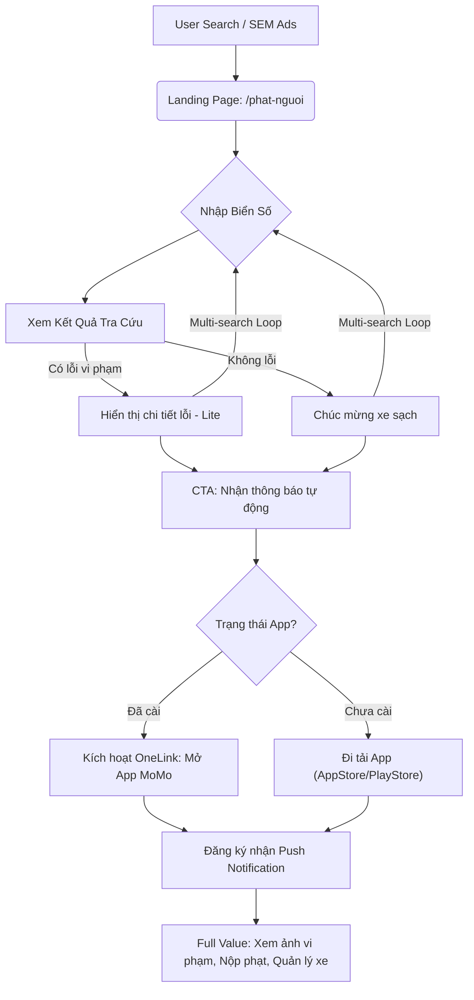

# 📄 Phat Nguoi Brd
Tra Cứu Phạt Nguội - Web Growth (SEO/GEO Project)

> - **Project:** Tra Cứu Phạt Nguội Web Growth
> - **Main URL:** momo.vn/phat-nguoi
> - **Division:** PS (Payment Services)
> - **Use Case:** Phạt Nguội
> - **Product:** PS - Phạt Nguội
> - **SEO/GEO Project ID:** `phat-nguoi`
> - **Owner:** GPD - Out-App Traffic
> - **Governance:** Văn Hiến (SEO & GEO Lead)
> - **BUILD (Web Platform):** Anh Bảo (PM) · Hùng (FE) · Hoài Anh (API)
> - **EXECUTE (Inbound):** Mai - Inbound Team (BMC)
> - **OBSERVE (Tracking):** DA - Hải/Hoàng (GA4) · Thuận (Umami) · Hiến (standard)
> - **Version:** 3.0 · Tháng 5/2026
> - **Status:** Final Master Manual - Ready for Execution
>
> ---

---

## Executive Summary

MoMo đang sở hữu partnership độc quyền với TTDK (Trung tâm Đăng Kiểm Việt Nam) cho tính năng Tra Cứu Phạt Nguội. Mặc dù tính năng App đã live, nhưng **Web channel đang để trống**, dẫn đến việc mất ~3.56M lượt tìm kiếm/tháng vào tay các đối thủ (phatnguoi.com, csgt.vn).

Dự án này xây dựng Web channel từ zero theo mô hình **Wise Model (Programmatic SEO)**:
- **Short-term:** Web Tool tra cứu trả kết quả thực → Web-to-App conversion để acquire New User.
- **Mid-term:** Interactive Camera Map → Chiếm lĩnh keyword cluster "camera phạt nguội".
- **Long-term:** pSEO địa phương 63 tỉnh thành → Xây dựng Topical Authority và GEO Citation.

## Project Status Update - Tháng 05/2026

| Hạng mục | Trạng thái | Chi tiết |
| :--- | :--- | :--- |
| **SEM Campaign** | **LIVE** | Ngân sách **200tr/tháng 5** để chiếm lĩnh Top 1 Paid Search. |
| **Tracking** | **Umami Live** | Đã triển khai Umami Tracking để đo lường real-time traffic. |
| **Content** | **GenAI Ready** | Toàn bộ Blog content được sản xuất qua hệ thống MoSpark GenAI. |

---

## 1. Business Context & Market Analysis

### 1.1 Product Identity & Revenue Model
*   **Product Name:** Tra cứu Phạt Nguội MoMo (momo.vn/phat-nguoi)
*   **Acquisition Funnel (Primary):** Attract New Users and increase MAU via Web-to-App conversion.
*   **Revenue Stream:** 
    *   Commission from fine payments via National Public Service Portal.
    *   Cross-sell: Motorbike & Auto Insurance to the searcher base.
*   **Value Proposition:** Official data (TTDK/CSGT), Real-time Auto-push notifications, Seamless payment in-app.

### 1.2 Market Demand & Opportunities
Nghị định 168/2024/NĐ-CP increased fines by 3-5x, creating a massive "evergreen" demand.

| Metric | Value | Source |
| :--- | :--- | :--- |
| Total monthly search volume | ~3.56M | Keyword dataset |
| Total vehicles (Cars + Motorbikes) | 84M+ | TTDK deck |
| MoMo users with verified cars | 700K+ | Internal data |

### 1.3 Competitive Gap (Displacement Strategy)
MoMo leverages **Trust Moat** and **Official Data** against 3rd party sites:

| Competitor | Brand Search | Weakness | MoMo Solution |
| :--- | :--- | :--- | :--- |
| **phatnguoi.com** | ~148K/mo | 3rd party, data privacy risks | Official TTDK integration |
| **csgt.vn (Official)** | ~13K/mo | Poor UX, frequent crashes | MoSpark optimized UX |
| **VNeTraffic** | ~14K/mo | Hard to use | Seamless Web-to-App flow |

### 1.4 Strategic Advantages
*   **Trust Moat:** Super App brand eliminates fear of data leakage/scams common on "gray" sites.
*   **Ecosystem Advantage:** Search -> Notify -> Pay -> Insure all within one app.
*   **Trust Signals:** Official TTDK/CSGT logos, PCI DSS Level 1 security.

---

## 2. User Personas & JTBD

1.  **Worried Owner (89% vol):** Needs to know if they have fines immediately—no app, no login.
2.  **Proactive Driver:** Needs real-time push notifications for new violations (Silver/Gold subscription).
3.  **Used Car Buyer:** Checks "clean" status before transaction/title transfer.
4.  **Trust-Seeker:** Looks for "Non-scam/Official" search tools (GEO Target).
5.  **Persona 2: Service Drivers (Grab, Be, Taxi):** High violation frequency, needs periodic checks to manage costs.

### 2.1 Promotion & Rewards
*   **Safe Driver Reward:** 20% discount voucher for insurance if result is "No violation".
*   **Fine Payment Voucher:** Cashback/Service fee reduction for first-time payment in MoMo.

---

## 3. Lộ trình Phân kỳ (Project Phasing Strategy)

### Phase 1: Foundation & Mini Web (Trọng tâm 60 ngày đầu)
*   **Build Mini Web:** Triển khai trang Hub chính và 3 sub-pages trọng điểm: `/o-to`, `/xe-may`, `/xe-may-dien`.
*   **Content Pilot:** Xuất bản bộ 20 bài blog Pillar (Hướng dẫn tra cứu, Nghị định 168, Cẩm nang pháp lý).
*   **Tech Foundation:** Thiết lập toàn bộ hạ tầng SEO: [Sitemap](https://www.momo.vn/phat-nguoi/sitemap.xml), Schema (FAQ, WebApp), [llms.txt](https://www.momo.vn/phat-nguoi/llms.txt), `robots.txt`.
*   **API Integration:** Kết nối dữ liệu thực từ TTDK vào Widget tra cứu.

### Phase 2: Regional Scale & pSEO (Bùng nổ quy mô)
*   **Regional pSEO:** Tự động hóa hàng ngàn trang landing page theo địa phương (`/phat-nguoi/ha-noi`, `/phat-nguoi/tphcm`,...).
*   **Blog Scaling:** Triển khai sản xuất nội dung quy mô lớn theo các cụm từ khóa ngách (Long-tail keywords).
*   **Authority Building:** Triển khai chiến dịch Backlink và PR dữ liệu (Data Moat).

### Phase 3: Growth Loops & Camera AI (Tối ưu & Tăng trưởng)
*   **Growth Hacks:** Kích hoạt các vòng lặp tăng trưởng (Viral Share Loop, Safe Driver Reward).
*   **Camera AI pSEO:** Xây dựng hệ thống trang tra cứu vị trí Camera phạt nguội theo khu vực (`/camera-phat-nguoi/cau-nhat-tan`,...).
*   **Product-Led Growth:** Triển khai Dispute Assistant và tích hợp sâu vào hệ sinh thái MoMo.

---

## 4. Product Scope & Flow (Web-to-App)

**Triết lý:** Web deliver đủ value (kết quả tra cứu) để build Trust, sau đó dùng giá trị **"Thông báo tự động real-time"** làm "mồi câu" chính để dẫn user sang App.

*   **Web (Lite):** Nhập biển số → Xem kết quả (Có/Không vi phạm) → CTA: "Đăng ký nhận thông báo real-time qua MoMo".
*   **App (Full):** Xem ảnh chụp vi phạm, nộp phạt online, nhận push notify, quản lý subscription Silver/Gold.

---

## 5. Technical Execution Activities

### 5.1 UI/UX Build (MoSpark Platform)
*   **Input:** Wireframe, SEO Brief & Design System (MoBase V2).
*   **Output:** Landing page `/phat-nguoi` live với giao diện Mobile-first.
*   **Outcome:** Tăng tỷ lệ Web-to-App CVR (Target >15%) và tối ưu trải nghiệm người dùng (CWV).

### 5.2 API Integration (TTDK Real-time)
*   **Input:** API Specs & Data Feed chính thống từ đối tác TTDK.
*   **Output:** Widget tra cứu hoạt động thực (Nhập biển số > Trả kết quả vi phạm).
*   **Outcome:** Xây dựng Trust (Dữ liệu chính thống) và tạo giá trị sử dụng tức thì, làm "mồi câu" dẫn user vào App.

### 5.3 Schema & Metadata Injection (GEO/AEO)
*   **Input:** JSON-LD Templates (WebApplication, FAQPage).
*   **Output:** Dữ liệu cấu trúc được Google Rich Results xác nhận hợp lệ.
*   **Outcome:** Chiếm lĩnh Rich Snippets và được trích dẫn (Citation) bởi các AI Search Engines (Perplexity, Gemini).

### 5.4 AI Visibility Optimization (`llms.txt`)
*   **Vị trí lưu trữ:** [https://www.momo.vn/phat-nguoi/llms.txt](https://www.momo.vn/phat-nguoi/llms.txt) (Modular Context cho riêng Use Case).
*   **Chiến thuật:** Cung cấp bối cảnh chuyên sâu (Step-by-step, Nghị định 168, API logic) để AI Engines (Perplexity, Gemini, ChatGPT) trích dẫn chính xác thay vì lấy dữ liệu từ các đối thủ không chính thống.
*   **Triển khai & Kiểm tra:**
    1.  **Upload:** Copy vào thư mục `/public/phat-nguoi/` trong source code để file live tại root của thư mục use case.
    2.  **Verify:** Kiểm tra URL trực tiếp và đảm bảo `Content-Type: text/plain`.
    3.  **AEO Test:** Yêu cầu AI đọc URL này và tóm tắt để xác nhận độ hiểu của Bot.
*   **Outcome:** Chiếm lĩnh vị trí "Source of Truth" trong các câu trả lời của AI về Phạt Nguội tại Việt Nam.

### 5.5 Tracking & Data Pipeline
*   **Input:** Tracking Blueprint (Onelink, af_sub params) & Umami Script.
*   **Output:** Dashboard đo lường chuyển đổi W2A và báo cáo real-time từ Umami.
*   **Outcome:** Đo lường chính xác ROI (đặc biệt là chiến dịch SEM 200tr) và hiệu quả conversion.

---

## 6. Phase 3: Growth Hacks & Advanced Tactics (The Growth Engine)

> **Triết lý:** Phạt Nguội không chỉ là một trang tra cứu, nó là một "Growth Loop" kết nối nhu cầu người dùng với hệ sinh thái tài chính của MoMo.

### 6.1 Viral & Social Mechanics
1.  **Viral Share Loop (Result Screen):** Nút "Chia sẻ kết quả xe sạch ✓" kèm link pre-filled biển số. Người nhận click vào sẽ thấy ngay kết quả của bạn mình và nảy sinh nhu cầu tự tra xe cá nhân.
2.  **UGC Community Warning:** Khi user thấy mình bị phạt tại một điểm camera nhất định, nút "Cảnh báo bạn bè lái xe qua khu vực này" sẽ kích hoạt việc chia sẻ link lên các group Zalo/Facebook tài xế.
3.  **Traffic Law Quiz:** Các mini-quiz về Nghị định 168 trên Web. User share chứng nhận "Thông thái luật giao thông" để nhận voucher Bảo hiểm.
4.  **Seasonal Spike (Đăng kiểm):** Banner/Content trigger trước mùa đăng kiểm: *"Xe sắp đến hạn đăng kiểm? Kiểm tra phạt nguội ngay để tránh bị chặn đăng kiểm"*.

### 6.2 Product-Led Growth (PLG) & Ecosystem
5.  **Safe Driver Reward (Cross-sale):** Nếu kết quả là "Không vi phạm" → Hiển thị: *"Bạn là tài xế gương mẫu! Nhận voucher giảm 20% Bảo hiểm xe máy/ô tô"*. (Chuyển đổi từ check-up sang transaction).
6.  **Dispute Assistant (Lite):** Bộ câu hỏi trắc nghiệm (Decision Tree) giúp user biết mình có nên khiếu nại lỗi phạt nguội đó không. Dẫn vào App để nhận hỗ trợ pháp lý sâu hơn.
7.  **Zalo OA Push Integration:** Cho phép user "Đăng ký nhận kết quả qua Zalo" nếu chưa muốn tải App. Đây là bước đệm (Retargeting) để convert sang App sau này.

### 6.3 Advanced SEO, AI Visibility (GEO) & Authority
8.  **Data Moat Report (Earned Media):** Xuất bản báo cáo "Top 10 tuyến đường nhiều lỗi nhất" hàng tháng. MoMo là bên duy nhất có data TTDK để làm báo cáo này, giúp lấy backlink tự nhiên từ các báo lớn.
9.  **Frustrated User Intent:** Target các keywords đánh vào người dùng đang gặp lỗi ở web đối thủ (ví dụ: "tại sao phạtnguoi.com không load", "csgt tra cứu lỗi").
10. **Route-based pSEO:** Tự động hóa hàng ngàn trang cho các tuyến đường huyết mạch (ví dụ: `/phat-nguoi/quoc-lo-1a`, `/phat-nguoi/cao-toc-long-thanh`).
11. **Fine Code pSEO:** Tạo landing page cho từng mã lỗi vi phạm (ví dụ: `/loi-vi-pham/vuot-den-do`). Người dùng thường search mã lỗi ghi trên biên bản để kiểm tra mức phạt.
12. **AI Answer Box Hijacking:** Tối ưu FAQ format 40-word để "chiếm đóng" vị trí Citation số 1 trên Perplexity, Gemini và ChatGPT.

---

## 7. Phase 1: GenAI Content Plan (Pilot 20 bài)

*Tất cả bài viết được sản xuất tự động bằng GenAI Prompts đã tối ưu theo brand voice MoMo.*

- **Tuần 1 (E-E-A-T):** Mức phạt Nghị định 168 cho ô tô/xe máy; Hướng dẫn tra cứu toàn quốc; Cách nộp phạt online.
- **Tuần 2 (Local GEO):** Top lỗi tại HN/HCM; Mức phí chậm nộp; Giải mã các loại camera AI.

---

## 8. Operational Routine (Duy trì P0)

- **Daily (Hiến):** Audit Indexing, Monitor API TTDK latency (< 3s).
- **Weekly (Thứ 4):** Audit CWV (LCP < 2.5s), Review GenAI Prompts.
- **Monthly:** Cập nhật SoV (Share of Voice), Audit AI Citation trên Perplexity/ChatGPT.

## 9. SEM Key Learnings & SEO/GEO Recommendations (Audit 05/2026)

### 9.1 Key Learnings từ SEM Campaign
*   **High-Intent Market:** CTR trung bình 7% (vượt benchmark) xác nhận nhu cầu tra cứu là cực lớn và "evergreen".
*   **The Utility Multiplier (CVR 155% - 178%):** Người dùng không chỉ tra 1 lần mà trung bình 1.5 - 2 lần/visit. Đây là tín hiệu cực tốt để xây dựng "Topical Authority".
*   **"Xe Máy" là mỏ vàng:** Nhóm từ khóa xe máy có CPA rẻ nhất (< 1,000đ) và CTR cao nhất (đến 18%). Đây là phân khúc đối thủ đang bỏ ngỏ.
*   **Efficiency Gap:** Exact Match có hiệu quả CPA tốt hơn Phrase Match ~50%. Cần siết chặt đối sánh từ khóa để tránh lãng phí ngân sách vào các từ khóa ngắn (ví dụ: "tra phạt").

### 9.2 Đề xuất cho SEO & GEO Strategy
*   **Content SEO:** 
    *   Ưu tiên sản xuất chuỗi bài viết tập trung sâu vào "Phạt nguội xe máy" để chiếm lĩnh phân khúc hiệu quả nhất.
    *   Tối ưu các bài viết dạng "Cách tra cứu..." (Question Intent) vì nhóm này đang có CTR SEM rất cao (15-25%).
*   **GEO & AEO Optimization:**
    *   **Local Landing Pages:** Triển khai sớm Phase 2 (pSEO địa phương) vì dữ liệu SEM cho thấy người dùng search theo cụm từ "toàn quốc" và "tỉnh thành" rất nhiều.
    *   **AI Answer Box Hijacking:** Sử dụng các câu trả lời ngắn, trực diện cho các mã lỗi vi phạm (Fine Code pSEO) để chiếm Citation trên Gemini/Perplexity, dựa trên các từ khóa SEM có chuyển đổi cao.
*   **UX/UI Growth:**
    *   Tích hợp tính năng "Lưu danh sách xe" ngay trên Web để tận dụng hành vi tra cứu nhiều lần (Multi-search behavior).
    *   Đặt CTA "Nhận thông báo qua MoMo" nổi bật tại trang kết quả tra cứu xe máy để tối ưu W2A CVR.

---

## 10. Compliance & Legal Framework
*   **Legal Basis:** Nghị định 168/2024/NĐ-CP & Thông tư 73/2024/TT-BCA.
*   **Disclaimer:** Web results are for reference only (No Captcha Lite version). Full evidence and official records available only in-app.
*   **Blacklist:** Do not mention unofficial sites (phatnguoi.com) except for security comparisons. Strictly avoid terms like "delete violations" or "legal bypass".

---

---

### 🔗 Reference & Alignment
*   **Strategic Vision:** [[01_STRATEGIC_PLAN/seo-geo-direction|SEO & GEO Direction]] & [[01_STRATEGIC_PLAN/web-momo-okrs-2026|Web OKRs 2026]]
*   **Content Playbook:** [[01_STRATEGIC_PLAN/momo-content-plan-strategy|Content Strategy Plan (Utility Layer)]]
*   **Technical Platform:** [[04_MOSPARK_PLATFORM/mospark_master|MoSpark Master]] & [[04_MOSPARK_PLATFORM/mospark_genai_content|GenAI Content Engine]]
*   **Execution Tracking:** [[04_MOSPARK_PLATFORM/mospark_seo_geo_playbook|SEO/GEO Playbook]]

---
*Out-App Traffic · GPD - MoMo momo.vn*  
*Document version: **v3.1 - Updated with SEM Insights 05/2026***
---

## Change Log
- **Tháng 5/2026:** Khởi tạo tài liệu và chuẩn hóa cấu trúc thư mục.

