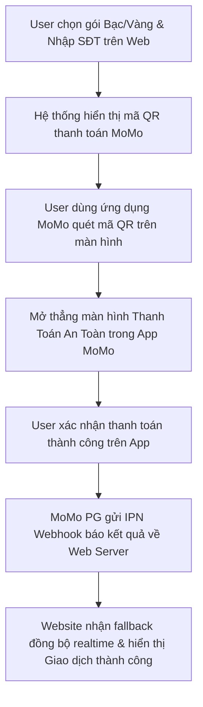

# BRD: Tra Cứu Phạt Nguội
 
> - **Project:** Tra Cứu Phạt Nguội Web Growth
> - **Main URL:** momo.vn/phat-nguoi
> - **Division:** PS (Payment Services)
> - **Use Case:** Phạt Nguội
> - **Owner:** Web Platform
> - **Governance:** Web Product Lead (Hiến)
> - **Version:** 3.8 - 2026-06-26
> - **Status:** Phase 1 LIVE - Pilot & Scale (Phase 2 Subscription & pSEO Route scales in progress)

---

## 1. Executive Summary

### Situation

MoMo sở hữu partnership độc quyền với TTDK (Trung tâm Đăng Kiểm Việt Nam) cho tính năng Tra Cứu Phạt Nguội. Tính năng App đã live. Web channel đã rollout Phase 1 (Mini Web `/phat-nguoi` + API real-time CSGT/TTDK) và đang trong giai đoạn Pilot & Scale. Tổng search demand thị trường đạt ~3.56M lượt tìm kiếm/tháng - được khuếch đại mạnh bởi Nghị định 168/2024/NĐ-CP tăng mức phạt 3-5x từ 1/1/2025.

### Complication

MoMo đang cạnh tranh với 2 nhóm đối thủ: (1) Các site bên thứ ba không chính thống (phatnguoi.com - ~148K branded search/tháng) đang chiếm traffic organic; (2) Site chính thống của nhà nước (csgt.vn) có UX kém và hay crash. Nếu không xây dựng web presence sớm, MoMo chỉ phục vụ được nhóm user đã có app, bỏ sót ~30.000 lượt tra cứu/quý từ nhóm Non-MoMo Users.

### Resolution

Xây dựng Web channel từ zero theo mô hình Programmatic SEO:
- **Short-term (Phase 1 - LIVE):** Mini Web Tool tra cứu trả kết quả thực - Web-to-App conversion để acquire New User.
- **Mid-term (Phase 2):** Regional pSEO - 63 tỉnh thành + Interactive Camera Map.
- **Long-term (Phase 3):** Growth Loops + Camera AI pSEO + Dispute Assistant - xây dựng Topical Authority và GEO Citation.

**Định vị chiến lược:** Phạt Nguội = Governance & Acquisition (kéo user vào hệ sinh thái MoMo), không phải dòng doanh thu Web trực tiếp. Case study mẫu cho Product-Led Growth trên Web Platform.

---

## 2. Bối Cảnh Thị Trường

### 2.1 Market Demand

| Metric | Giá trị |
|---|---|
| Total monthly search volume | ~3.56M lượt/tháng |
| Total vehicles (Ô tô + Xe máy) | 84M+ phương tiện |
| MoMo users with verified cars | 700K+ |

Nghị định 168/2024/NĐ-CP tăng mức phạt 3-5x từ 1/1/2025 tạo nhu cầu tìm kiếm "evergreen" mạnh - spike đầu năm và duy trì cao quanh năm.

### 2.2 Competitive Gap - Chiến Lược Displacement

| Competitor | Brand Search | Điểm yếu | MoMo Solution |
|---|---|---|---|
| phatnguoi.com | ~148K/tháng | Site bên thứ 3, rủi ro data privacy, không official | Official TTDK integration + MoMo brand trust |
| csgt.vn (Official) | ~13K/tháng | UX kém, hay crash, khó dùng | MoSpark optimized UX |
| VNeTraffic | ~14K/tháng | Khó sử dụng, không có ecosystem | Seamless Web-to-App flow |

### 2.3 Strategic Advantages

- **Trust Moat:** Super App brand loại bỏ lo ngại rò rỉ data thường gặp ở các site gray market.
- **Ecosystem Advantage:** Search - Notify - Pay - Insure toàn bộ trong 1 app.
- **Official Data:** Logo TTDK/CSGT chính thống - trust signal mạnh nhất trong category này.

### 2.4 Phân Tích SEM - Validation Market Demand

| Metric | Kết quả | Hàm ý chiến lược |
|---|---|---|
| CTR trung bình SEM | ~7% | High-intent market được xác nhận |
| CVR utility (multi-search) | 155-178% | User tra nhiều lần/visit - cần tính năng "Lưu danh sách xe" |
| Cluster xe máy CTR | Đến 18%, CPA thấp nhất | Phân khúc đối thủ đang bỏ ngỏ - ưu tiên pSEO |
| Exact Match vs Phrase | Exact hiệu quả hơn ~50% CPA | Long-tail intent rõ ràng |

---

## 3. Định Hướng Dự Án

### 3.1 Product Identity & KPI Model

- **Primary success metric (Web):** MEU (Monthly Engagement Users) - user có tương tác Utility (tra cứu biển số, multi-search loop).
- **Secondary metrics:** MAU (in-app), % New to Services, W2A Conversion Rate.
- **Acquisition Funnel:** Web Utility (MEU) - W2A - In-App activation (MAU, ecosystem cross-sell).
- **Revenue Stream:** Commission từ nộp phạt qua Cổng Dịch Vụ Công Quốc Gia. Cross-sell bảo hiểm xe máy/ô tô. Subscription TTDK (Silver/Gold).

### 3.2 Web-to-App Flow

**Triết lý:** Web deliver đủ value (kết quả tra cứu) để build Trust, sau đó dùng "Thông báo tự động real-time" làm mồi câu dẫn user sang App.

**Web (Lite):** Nhập biển số -> Xem kết quả (Có/Không vi phạm) -> CTA "Đăng ký nhận thông báo real-time qua MoMo"

**App (Full):** Xem ảnh chụp vi phạm - nộp phạt online - nhận push notify - quản lý subscription Silver/Gold.

### 3.3 Dự Án Này KHÔNG Phải

- Không phải trang thay thế cho app feature
- Không đề cập các site không chính thống (phatnguoi.com) ngoại trừ so sánh về bảo mật
- Không dùng ngôn ngữ "xóa vi phạm" hoặc "bỏ phạt" (vi phạm pháp luật)
- Không cạnh tranh trực tiếp csgt.vn về tính năng - cạnh tranh về UX và ecosystem

### 3.4 Khung Hợp Tác Đầu Tư & Chia Sẻ Doanh Thu Liên BU (Cross-BU Co-investment & Attribution Framework)

Nhằm giải quyết bài toán ROI thấp của dự án Phạt Nguội khi đứng độc lập (do chi phí chạy SEM lớn và tỷ lệ nộp phạt thu phí hoa hồng trực tiếp thấp), MoMo áp dụng mô hình **Co-investment (Đồng đầu tư)**. Dự án Phạt Nguội đóng vai trò là **Phễu Hút Traffic Đại Chúng (Mass Traffic Acquisition Funnel)**, sau đó phân phối lưu lượng người dùng sở hữu phương tiện giao thông (tệp khách hàng có giá trị cao) cho các BUs khác để tối ưu hóa doanh thu chéo:

1.  **BU Bảo Hiểm (Insurance - Ô tô & Xe máy):**
    *   *Hình thức hợp tác:* Tích hợp widget kiểm tra thời hạn và mua nhanh Bảo hiểm trách nhiệm dân sự (TNDS) bắt buộc hoặc Bảo hiểm thân vỏ tự nguyện trực tiếp tại trang kết quả tra cứu (Slot 4 / Slot 5).
    *   *Cơ chế phân bổ ngân sách:* BU Bảo Hiểm tài trợ **35% - 40% chi phí SEM và vận hành** của Phạt Nguội dựa trên tỷ lệ lead chuyển đổi thành công mua bảo hiểm qua web/app.
2.  **BU Tài Chính (Ví Trả Sau & Vay Nhanh):**
    *   *Hình thức hợp tác:* Khi phát hiện lỗi phạt nguội có số tiền lớn (từ 1.000.000đ trở lên) hoặc người dùng có lịch sử điểm tín dụng tốt, hệ thống tự động hiển thị gợi ý mở **Ví Trả Sau (VTS)** hoặc đăng ký **Vay Nhanh** giải ngân trong 5 phút để thanh toán nộp phạt ngay lập tức.
    *   *Cơ chế phân bổ ngân sách:* BU Tài Chính đồng tài trợ **30% chi phí chạy Ads** dựa trên số lượng tài khoản ví/khoản vay mới được kích hoạt từ trang Phạt Nguội.
3.  **Mô hình Phân bổ Doanh thu & ROI (Attribution Model):**
    *   Doanh thu từ các gói Subscription cảnh báo (Silver/Gold) phát sinh trên Web sẽ được ưu tiên hoàn bù chi phí marketing (SEM) của dự án trước khi phân bổ lợi nhuận cho BU PS.
    *   Mọi lead chuyển đổi chéo thành công sang mua bảo hiểm/vay tiêu dùng sẽ được ghi nhận attribution 100% về cho phễu Phạt Nguội trên Web để tính toán ROI thực tế toàn diện (Total Portfolio ROI) thay vì chỉ đo lường ROI đơn lẻ của BU Phạt Nguội.

---

## 4. JTBD Analysis

### Stage 1 - Nhận Biết Vi Phạm: "Tìm kênh tra cứu uy tín"

**Keywords:** tra cứu phạt nguội (673K), phạt nguội (301K), kiểm tra phạt nguội (165K), check phạt nguội (110K)

| Dimension | Nội dung |
|---|---|
| Functional | Tìm được kênh tra cứu chính xác, không sợ lừa đảo hay lộ thông tin |
| Emotional | Lo lắng về việc xe có bị phạt không, muốn biết ngay |
| Social | Không muốn bị CSGT "chặn" vì không biết xe đang bị phạt |
| Trigger | Chuẩn bị đăng kiểm - Thấy người khác bị phạt - Không nhớ xe đã qua camera hay chưa |

**Giải pháp:** Landing Page `/phat-nguoi` - Blog "Tra cứu phạt nguội ở đâu nhanh nhất 2025".

---

### Stage 2 - Tra Cứu & Xác Nhận: "Tra theo loại xe và địa phương"

**Keywords:** tra cứu phạt nguội ô tô (49.5K), kiểm tra phạt nguội xe máy (22.2K), camera phạt nguội (8.1K), tra cứu theo tỉnh thành

| Dimension | Nội dung |
|---|---|
| Functional | Tra đúng theo loại xe (ô tô/xe máy), theo tỉnh đang ở, xem chi tiết lỗi, thời gian, địa điểm |
| Emotional | Muốn biết chính xác - không muốn tra sai xe hoặc sai tỉnh |
| Trigger | Chuẩn bị chuyến đi xa - Đang ở tỉnh khác - Có nhiều xe cần quản lý |

**Giải pháp:** `/phat-nguoi/o-to` - `/phat-nguoi/xe-may` - `/phat-nguoi/[tinh-thanh]` (pSEO 63 tỉnh) - `/phat-nguoi/camera-giao-thong`.

---

### Stage 3 - Nộp Phạt & Đăng Kiểm: "Nộp phạt online nhanh gọn"

**Keywords:** nộp phạt giao thông online (2.9K), nộp phạt nguội online (1.9K), cách nộp phạt nguội

| Dimension | Nội dung |
|---|---|
| Functional | Nộp phạt không cần đến tận nơi, online 24/7 |
| Emotional | Tiết kiệm thời gian, tránh phải xếp hàng ở Kho Bạc hoặc CSGT |
| Trigger | Cần đăng kiểm nhưng đang có vi phạm chưa nộp |

**Giải pháp:** `/phat-nguoi/blog/nop-phat-nguoi` (CTA nộp phạt trực tiếp) - Blog "Cách nộp phạt nguội online 2025".

---

### Stage 4 - Kiến Thức & Phòng Tránh: "Hiểu luật để không tái phạm"

**Keywords:** nghị định 168 (33.1K), lỗi vượt đèn đỏ (8.1K), camera giao thông (12.1K)

| Dimension | Nội dung |
|---|---|
| Functional | Hiểu mức phạt theo từng lỗi, biết camera đặt ở đâu để tránh |
| Emotional | Không muốn bị phạt bất ngờ - chủ động tuân thủ luật |
| Trigger | Đã từng bị phạt - Vừa xem tin về Nghị định 168 - Chuẩn bị thi bằng lái |

**Giải pháp:** Blog hub `/phat-nguoi/blog` - Bài "Nghị định 168: Bảng mức phạt mới nhất".

---

## 5. Kiến Trúc Web

### 5.1 Sitemap Hub & Spoke

```
momo.vn/phat-nguoi [Hub]
│
├── TRANG PHƯƠNG TIỆN
│   ├── /phat-nguoi/o-to              (LIVE)
│   ├── /phat-nguoi/xe-may            (LIVE)
│   └── /phat-nguoi/xe-may-dien       (LIVE)
│
├── TRANG ĐỊA PHƯƠNG (Phase 2 - pSEO 63 tỉnh)
│   ├── /phat-nguoi/ha-noi
│   ├── /phat-nguoi/tp-hcm
│   └── /phat-nguoi/[tinh-thanh]...
│
├── TRANG CAMERA (Phase 2-3)
│   ├── /phat-nguoi/camera-giao-thong
│   └── /phat-nguoi/camera-[khu-vuc] (pSEO)
│
├── TRANG DỊCH VỤ
│   └── /phat-nguoi/blog/nop-phat-nguoi
│
└── BLOG CLUSTER
    ├── /phat-nguoi/blog              (Hub kiến thức)
    ├── Cụm Nghị định 168
    ├── Cụm Hướng dẫn tra cứu
    ├── Cụm Nộp phạt online
    └── Cụm Camera giao thông
```

**AEO/GEO:** llms.txt live tại `momo.vn/phat-nguoi/llms.txt` - cung cấp context chuyên sâu cho AI engines (Perplexity, Gemini, ChatGPT) để cite MoMo là nguồn chính thống.

**Schema bắt buộc:** WebApplication - FAQPage - HowTo - BreadcrumbList.

### 5.2 Phase Roadmap

| Phase | On-page / Product | Off-page / Comm | Trạng thái |
|---|---|---|---|
| Phase 1 - Foundation | Mini Web + API TTDK real-time + 3 subpage + Blog Batch 1 (20 bài) + SEM | - | LIVE |
| Phase 2 - Regional Scale | Blog Batch 2 (20-30 bài ngách) + pSEO 63 tỉnh + Camera Map | Social BMC Batch 1 + Backlink Tier 1-2 (Vendor) | Planned T6/2026 |
| Phase 3 - Growth Loops | Viral mechanics + Camera AI pSEO + Dispute Assistant + Fine Code pSEO | Social ongoing + Backlink Tier 3 scale | Backlog |

### 5.3 Growth & PLG Tactics (Phase 3)

**Viral Mechanics:**
- Viral Share Loop: Nút "Chia sẻ kết quả xe sạch" kèm link pre-filled biển số - tạo organic traffic từ bạn bè share.
- UGC Warning: User thấy bị phạt tại camera A - nút "Cảnh báo bạn bè lái xe qua khu vực này".
- Seasonal Spike Trigger: Banner "Xe sắp đến hạn đăng kiểm? Kiểm tra phạt nguội trước".

**Product-Led Growth:**
- Safe Driver Reward: Kết quả "Không vi phạm" - Hiển thị voucher giảm 20% Bảo hiểm xe máy/ô tô (cross-sell).
- Dispute Assistant Lite: Decision tree giúp user biết có nên khiếu nại lỗi không - dẫn vào App.
- Data Moat Report: Xuất bản "Top 10 tuyến đường nhiều vi phạm nhất" hàng tháng (MoMo là bên duy nhất có TTDK data cho báo cáo này - earned media + backlink tự nhiên).

**Advanced pSEO:**
- Route-based pSEO: `/phat-nguoi/quoc-lo-1a`, `/phat-nguoi/cao-toc-long-thanh`...
- Fine Code pSEO: `/loi-vi-pham/vuot-den-do` per mã lỗi vi phạm.
### 5.4 Luồng Mua Hàng & Thanh Toán trên Web (Web Subscription & MoMo Payment Checkout Flow)

> **Cập nhật:** Tính năng mua gói Subscription giám sát phạt nguội tự động sẽ được ưu tiên phát triển và launch trực tiếp trên Web vào **Tháng 7/2026** (thuộc Phase 2) để giải quyết bài toán tạo doanh thu trực tiếp và cải thiện ROI dự án. PO đã bàn giao BA Doc và User Flow hoàn chỉnh.

Nhằm tối ưu hóa doanh thu trực tiếp từ Web channel (Revenue Stream) và nâng cao trải nghiệm tự động hóa cho người dùng, MoSpark xây dựng luồng mua gói dịch vụ Giám sát Phạt nguội tự động (TTDK Subscription) và thanh toán trực tiếp bằng cổng MoMo Payment Gateway trên Web.

#### 1. Cơ cấu Gói dịch vụ (Subscription Packages)

Người dùng có thể lựa chọn đăng ký theo chu kỳ **Tháng** hoặc **Năm** (giao diện mặc định khuyên dùng gói Năm với ưu đãi sâu). Chi tiết tính năng và giá của các gói:

- **Gói Bạc (Silver):**
  * Giá gói Tháng: **10.000đ/tháng** (Giá gốc 20.000đ/tháng - Giảm 50%).
  * Giá gói Năm: **29.000đ/năm** (Giá gốc 199.000đ/năm - Giảm 85%).
  * Quyền lợi đi kèm:
    - Nhận thông báo tự động ngay khi phát sinh lỗi phạt nguội mới.
    - Tự động nhắc nhở nộp phạt nguội trước thời hạn.
    - Tra cứu lịch sử vi phạm và cập nhật trạng thái xử lý.
    - Tự động nhắc nhở khi đến hạn đăng kiểm xe.
- **Gói Vàng (Gold):**
  * Giá gói Tháng: **19.000đ/tháng** (Giá gốc 29.000đ/tháng - Giảm 34%).
  * Giá gói Năm: **39.000đ/năm** (Giá gốc 299.000đ/năm - Giảm 87%).
  * Quyền lợi đi kèm:
    - Đầy đủ tất cả các tính năng của gói Bạc.
    - Nhận thêm ưu đãi đặc quyền giảm giá đến **40% các loại bảo hiểm ô tô** (Lưu ý: Không áp dụng quyền lợi bảo hiểm này trong thời gian dùng thử 7 ngày).

*Chính sách dùng thử & mua ngay:* Hỗ trợ nút **[Dùng thử miễn phí 7 ngày]** hoặc **[Bỏ qua gói dùng thử và mua ngay]** để thúc đẩy tỷ lệ chuyển đổi trực tiếp trên Web.

#### 2. Trải nghiệm Luồng Mua Hàng (User Journey)



#### 3. Đặc tả chi tiết các bước trong Checkout Flow
- **Bước 1: Chọn gói & Điền thông tin (Checkout Form):**
  * Người dùng chọn gói dịch vụ (Bạc/Vàng), chu kỳ (Tháng/Năm) và điền số điện thoại liên kết nhận thông báo.
- **Bước 2: Hiển thị mã QR thanh toán:**
  * Hệ thống Web gọi API của MoMo PG để tạo mã giao dịch và hiển thị mã QR thanh toán an toàn trực tiếp trên giao diện Web.
- **Bước 3: Quét mã QR trên App MoMo:**
  * Người dùng mở ứng dụng MoMo trên điện thoại di động và thực hiện quét mã QR hiển thị trên Web.
- **Bước 4: Hoàn tất thanh toán an toàn & Phản hồi Website (Done):**
  * Sau khi quét mã, ứng dụng MoMo sẽ tự động nhận diện và đưa người dùng trực tiếp tới màn hình Thanh Toán An Toàn (Secure Payment Screen) bên trong App.
  * Người dùng thực hiện xác thực bảo mật (FaceID/PIN) và bấm xác nhận để hoàn tất giao dịch.
  * **Đồng bộ trạng thái trên Website (Real-time Fallback):** Hệ thống Web Backend nhận tín hiệu từ MoMo PG qua Webhook (IPN), đồng thời giao diện Website tự động nhận được fallback cập nhật trạng thái (thông qua cơ chế Websocket hoặc Polling) để trả ra kết quả giao dịch thành công ngay lập tức trên màn hình của người dùng.


#### 5. Vị trí hiển thị Component Mua Hàng (Placement Strategy)

Để tối ưu hóa tỷ lệ chuyển đổi (CVR), cấu phần mua gói đăng ký (Subscription Widget) sẽ được hiển thị linh hoạt tại các vị trí chiến lược sau trên Website:

1. **Trực tiếp dưới kết quả tra cứu (Primary Location - Contextual Trigger):** Đây là điểm chạm có chuyển đổi cao nhất vì người dùng đang ở đỉnh điểm của sự quan tâm (high-intent).
   - **Trường hợp xe KHÔNG vi phạm (Xe sạch):** Hiển thị ngay dưới banner thông báo *"Chúc mừng, phương tiện của bạn không có lỗi vi phạm"*.
     * *Thông điệp (Message):* "Chủ động bảo vệ phương tiện - Đăng ký gói giám sát tự động để nhận cảnh báo ngay lập tức nếu phát sinh phạt nguội mới."
     * *CTA:* [Đăng ký gói Năm - Chỉ 29k] hoặc [Dùng thử miễn phí 7 ngày].
   - **Trường hợp xe CÓ vi phạm:** Hiển thị bên dưới danh sách các lỗi vi phạm hiện tại.
     * *Thông điệp (Message):* "Nhận thông báo nhắc nhở nộp phạt trước hạn để tránh bị từ chối đăng kiểm và tự động theo dõi các lỗi phát sinh mới."
     * *CTA:* [Đăng ký nhận cảnh báo - Chỉ 29k/năm].

2. **Section Bảng giá (Pricing Section) tại Trang chủ `/phat-nguoi`:**
   - Đặt ở phần giữa hoặc cuối trang chủ (dưới widget tra cứu và phần hướng dẫn sử dụng, trên phần FAQ).
   - Thiết kế dưới dạng một bảng so sánh tính năng (Bạc vs Vàng) và chu kỳ (Tháng/Năm) để phục vụ nhóm người dùng vãng lai hoặc quay lại mua sau khi cân nhắc.

3. **Nút CTA nổi bật trên Header / Navigation Bar:**
   - Thiết kế nút CTA nhỏ màu hồng MoMo nổi bật: `[Đăng ký nhận cảnh báo]` hoặc `[Gói dịch vụ]` trên thanh menu đầu trang.
   - Khi click sẽ tự động scroll-down hoặc dẫn về Section Bảng giá ở Trang chủ.

4. **Kích hoạt qua Banner trong các bài viết thuộc Blog Cluster:**
   - Chèn các banner/widget mua gói dịch vụ ở giữa hoặc cuối các bài viết hướng dẫn đăng kiểm, nghị định mức phạt mới, danh sách các camera phạt nguội để hứng lượng traffic tự nhiên từ SEO/GEO.

### 5.5 Định Hướng & Cấu Trúc Sản Phẩm pSEO Theo Location (Tháng 6/2026)

Để khai thác tối đa lượng tìm kiếm tự nhiên khổng lồ theo ngữ cảnh địa phương (ước tính đạt 150K - 200K traffic/tháng), MoSpark triển khai sản phẩm Programmatic SEO (pSEO) theo 63 Tỉnh/Thành phố.

#### 1. Nguyên tắc chống lỗi "Thin Content" của Google
Để tránh việc Google đánh giá thấp và không index (hoặc de-index) hàng loạt trang do nội dung bị trùng lặp cao, hệ thống MoSpark GenAI Content Engine bắt buộc phải tạo ra nội dung **độc nhất (Unique)** cho từng địa phương dựa trên việc nạp dữ liệu (Grounding Data) thực tế:
- **Dữ liệu động bắt buộc:** Thống kê các lỗi vi phạm nhiều nhất tại địa phương, danh sách cơ quan chức năng tiếp nhận xử phạt (phần camera và bản đồ giao thông sẽ được cập nhật sau ở các phase tiếp theo).
- **Tập trung vào E-E-A-T & GEO:** Trả lời trực tiếp các câu hỏi có tính thực tế cao cho lái xe tại địa bàn tỉnh đó.

#### 2. Cấu trúc URL và Phân cấp Trang
- **URL Pattern:** `/phat-nguoi/{tinh-thanh}`
  * Ví dụ: `/phat-nguoi/tp-hcm`, `/phat-nguoi/ha-noi`, `/phat-nguoi/da-nang`, `/phat-nguoi/nghe-an`.
  * Không dùng tiếng Việt có dấu, khoảng cách thay bằng dấu gạch ngang (`-`), tỉnh/thành viết thường toàn bộ.

#### 3. Các thành phần chính trên Trang Địa Phương (Page Layout Spec)
Mỗi trang địa phương `/phat-nguoi/{tinh-thanh}` được thiết kế tinh gọn theo cấu trúc 3 phần chuẩn hóa giúp tối ưu hóa SEO và tăng trải nghiệm người dùng:

1. **Hero Section + Component (Widget Tra Cứu):**
   * Tiêu đề **H1** là sự kết hợp giữa: `"Phạt Nguội + [Tỉnh/Thành]"` và từ khóa `"Tra cứu"` (Ví dụ: `"Tra Cứu Phạt Nguội [Tỉnh/Thành]"` hoặc `"Phạt Nguội [Tỉnh/Thành] - Tra Cứu Trực Tuyến"`).
   * Component: Widget nhập biển số xe để người dùng thực hiện tra cứu trực tiếp tại địa phương. Hệ thống tự động xác định khu vực/tỉnh thành dựa trên URL slug để pre-fill thông tin phù hợp.
2. **List Location (Danh sách địa phương liên kết):**
   * Liệt kê các thẻ Hyperlink/Anchor trỏ đến các tỉnh thành, quận/huyện hoặc các địa điểm lân cận khác.
   * *Vai trò:* Tăng trải nghiệm điều hướng cho người dùng và tạo mạng lưới liên kết nội bộ (Internal Linking) chặt chẽ giúp Googlebot dễ dàng cào dữ liệu và lập chỉ mục (index) nhanh chóng toàn bộ hệ thống trang vệ tinh.
3. **Long Content for SEO (Nội dung chuyên sâu):**
   * Đoạn văn bản dài từ 300 - 500 từ được sản xuất tự động qua GenAI Content Engine, cung cấp thông tin hữu ích về luật giao thông, các lỗi phạt nguội phổ biến nhất tại địa phương, địa chỉ cơ quan CSGT tiếp nhận xử lý và FAQ.
   * Tích hợp Schema `FAQPage` để tăng tính hữu ích (Helpful Content) và tối ưu hóa hiển thị trên AI Search/Google Search.


#### 4. Kế hoạch triển khai & Lộ trình Rollout (Tháng 6/2026)
- **Tuần 1 (01/06 - 07/06): Thiết lập Data Baseline & Layout Design [HOÀN THÀNH]**
  * Hoàn tất thu thập dữ liệu hành chính các phòng CSGT, địa chỉ xử phạt và kho bạc của 63 tỉnh/thành (tạm thời chưa tích hợp dữ liệu camera giao thông).
  * Thống nhất Layout UI/UX cho trang Tỉnh thành (PM duyệt mẫu thiết kế theo cấu trúc 3 phần chính trước khi scale).
- **Tuần 2 (08/06 - 14/06): Cấu hình GenAI Content Engine & Prompt Integration [HOÀN THÀNH]**
  * Cấu hình prompt master cho 63 trang location trong module MoSpark GenAI.
  * Sử dụng Claude 3.Haiku/3.5 Sonnet để chạy thử nghiệm sinh nội dung unique cho 5 tỉnh thành mẫu (Hà Nội, TP.HCM, Đà Nẵng, Bình Dương, Đồng Nai), đối soát chất lượng thông tin.
- **Tuần 3 (15/06 - 21/06): Pilot Giai đoạn 1 (Top 10 Tỉnh thành có Volume lớn nhất) [ĐẠT YÊU CẦU]**
  * Launch pilot 10 địa phương trọng điểm: Hà Nội, TP.HCM, Đà Nẵng, Bình Dương, Đồng Nai, Cần Thơ, Hải Phòng, Long An, Bắc Ninh, Nghệ An.
  * Theo dõi chỉ số index trên Google Search Console (GSC) và tốc độ tải trang (Core Web Vitals).
- **Tuần 4 (22/06 - 30/06): Xuất bản Toàn diện theo yêu cầu anh Bảo [TRIỂN KHAI GẤP]**
  * Đẩy nhanh tiến độ hoàn tất xuất bản toàn bộ 100% bài viết Blog vệ tinh (Cluster) và phủ sóng 63 tỉnh/thành (pSEO Location) trên cả nước ngay trong tháng 6/2026.
  * Chạy tự động sản xuất hàng loạt (Bulk Generation) và tự động publish thông qua MoSpark CMS cho 53 tỉnh thành còn lại.
  * Kích hoạt Dashboard đo lường SoV (Share of Voice) trên AI search cho các keyword địa phương này.

#### 5. Nguyên tắc xử lý sáp nhập địa giới hành chính (Location Consolidation)

Việc sáp nhập hoặc thay đổi địa giới hành chính (Ví dụ: sáp nhập tỉnh, đổi tên quận/huyện) ảnh hưởng trực tiếp đến dữ liệu và SEO. MoSpark áp dụng các nguyên tắc xử lý sau để bảo toàn traffic và thứ hạng tìm kiếm:

- **Nguyên tắc "Intent-First" (Ưu tiên theo Intent):** Bản chất các trang địa phương được tạo ra là để "hứng" lượng tìm kiếm thực tế của người dùng. Do đó, miễn là số liệu Keyword Research ghi nhận người dùng vẫn còn hành vi tìm kiếm địa danh cũ (ví dụ: "Hà Tây"), trang địa phương cũ sẽ được **giữ nguyên hoạt động (keep active as is)** để tối ưu SEO cho từ khóa đó, không vội vàng xóa bỏ hay cấu hình redirect.
- **Tối ưu hóa Alias Page:**
  * Giữ nguyên giao diện và nội dung tối ưu theo từ khóa cũ của địa phương.
  * Hiển thị thông báo nhỏ, tinh gọn ở đầu trang để đảm bảo tính minh bạch: *"Dữ liệu phạt nguội của khu vực [Tỉnh A] được tự động cập nhật theo địa giới quản lý mới của [Tỉnh B]."*
  * Giữ canonical độc lập cho trang địa danh cũ để tránh mất index trên công cụ tìm kiếm của Google/AI.
- **Đồng bộ Dữ liệu Backend:**
  * Dữ liệu danh sách lỗi và địa chỉ CSGT xử phạt của tỉnh cũ sẽ được tự động gộp chung vào cơ sở dữ liệu của đơn vị hành chính mới (dữ liệu vị trí camera sẽ được cập nhật sau khi tính năng camera map hoạt động).
  * Widget tra cứu của trang tỉnh cũ sẽ tự động query dữ liệu theo mã tỉnh mới để đảm bảo tính chính xác 100%.

---

## 6. Success Metrics

### 6.1 KPI Framework

| Metric | Lane | Target | Source |
|---|---|---|---|
| MEU Utility (lookup completed, multi-search) | Utility - Web | Đo baseline Pilot T6/2026, set target sau | Umami + GA4 |
| MAU / % New to Services | Payment - App | Align với BU target | Appsflyer + DA |
| Organic sessions /phat-nguoi cluster | Tier B | Scale Phase 2 | GSC + GA4 |
| W2A Conversion Rate | Tier B | 15% EOY (aspirational) | GA4 + Appsflyer |
| AI Overview citations (target queries) | GEO | 5+ queries được cite | Manual audit |

**Lưu ý baseline:** MEU Utility được xác định sau Pilot review T6/2026. Không lock KPI target trước khi có baseline clean từ Web Analytics.

### 6.2 North Star Metric

**MEU (Monthly Engagement User)** = user thực hiện lookup biển số hoặc multi-search trên Web, dẫn đến W2A và In-App activation.

**Funnel:**
```
Search -> /phat-nguoi -> Nhập biển số -> Kết quả tra cứu -> CTA "Nhận thông báo real-time"
-> App open (Onelink) -> Đăng ký push notification -> MAU activation
```

---

## 7. Dependencies & Constraints

| Dependency | Mô tả | Blocker? |
|---|---|---|
| API TTDK Real-time | Widget tra cứu hoạt động thực (nhập biển số - trả kết quả vi phạm). SLA uptime > 99% | Có - core product value |
| Partnership exclusivity TTDK | Điều kiện pháp lý duy trì lợi thế competitive | Có - strategic |
| GA4 + Appsflyer W2A tracking | Track conversion từ web sang app. Phân tách organic vs SEM traffic | Có - đo KPI |
| Legal Disclaimer trên Web | Web results là tham khảo (Lite mode). Evidence chính thức chỉ trong app | Có - YMYL |
| pSEO Infrastructure | Build hàng ngàn trang địa phương + camera cần platform support | Có cho Phase 2 |

**Constraints:**
- Web Lite Mode: Không hiển thị ảnh chụp vi phạm, không cho phép nộp phạt trực tiếp - phải dẫn vào app. Đây là constraint pháp lý, không phải kỹ thuật.
- Content compliance: Không dùng ngôn ngữ "xóa vi phạm", "bỏ phạt", không refer site không chính thống.
- Privacy: Không lưu trữ biển số sau query - phải tuân thủ quy định bảo mật TTDK.
- Subscription Web: Nếu triển khai checkout Subscription trên Web cần xác nhận scope rõ ràng với BU - KPI có thể conflict với positioning acquisition.
- **Yêu cầu bắt buộc sở hữu App MoMo:** Khách hàng mua gói Subscription trên Web bắt buộc phải sở hữu/tải ứng dụng MoMo và liên kết đúng Số điện thoại đăng ký thì mới nhận được thông báo biến động lỗi phạt nguội qua App Push. Đây là điều kiện vận hành kỹ thuật bắt buộc để kích hoạt tính năng gửi Alert tự động.

---

## 8. Risk Assessment

| # | Rủi ro | Khả năng | Impact | Mitigation |
|---|---|---|---|---|
| R1 | API TTDK latency cao hoặc downtime - widget không trả kết quả - user không tin | Trung bình | Rất cao | SLA cứng với TTDK. Fallback message rõ ràng thay vì trang trắng |
| R2 | phatnguoi.com cải thiện UX hoặc claim official status - mất competitive edge | Trung bình | Cao | Liên tục nhấn mạnh Official TTDK logo và trust signals. Speed-to-market Phase 2 |
| R3 | AI Overview erode organic traffic trước khi MoMo được cite | Cao | Cao | AEO priority: llms.txt + FAQPage Schema + structured data ngay Phase 1 |
| R4 | Subscription Web conflict với positioning acquisition - user bị friction | Trung bình | Trung bình | Validate tại Pilot review T6/2026. Set success criteria rõ ràng trước launch Subs Web |
| R5 | pSEO 63 tỉnh bị Google nhận diện là thin content | Trung bình | Cao | Mỗi trang tỉnh cần unique content: stats vi phạm, camera nhiều nhất, mức phạt phổ biến tại tỉnh đó |
| R6 | SEM budget không đủ ROI để justify tiếp tục | Thấp (CTR 7% đã tốt) | Trung bình | Review CPA weekly. Shift budget sang Exact Match cho cluster hiệu quả nhất (xe máy) |

---

## 9. SEO/GEO Content Engine - GenAI Production Plan

> **Nguồn:** Tích hợp từ SEO Inventory v4.7 (`mospark_seo_inventory.md`) - Entry Point system cho dự án Phạt Nguội trên MoSpark. Mọi quyết định content phải gắn với Market Volume thực và SoV mục tiêu, không sản xuất "mù mờ".

### 9.1 Phân Loại Trong SEO Inventory

**Nhóm:** Mass Traffic / Dịch vụ công (Inventory Priority Group 4)

**Chiến lược nhóm:** Kéo lượng User khổng lồ về hệ sinh thái MoMo - KPI là MEU và W2A acquisition, không phải revenue trực tiếp.

**Độ khó triển khai (ICE Rubric):** 5/5 - hệ thống phức tạp, tích hợp API TTDK, compliance pháp lý nghiêm ngặt, Dev > 3 sprint.

| Metric | Giá trị | Source | Chu kỳ cập nhật |
|---|---|---|---|
| Total Search Volume | ~3.56M lượt/tháng | Ahrefs/KP | Quarterly |
| SoV MoMo hiện tại | TBD - đo baseline T6/2026 | GA4/BigQuery | Monthly |
| SoV target Year 1 | 10%+ (~356K sessions/tháng) | Hiến (định nghĩa sau Pilot) | |
| SoV target Long-term | 15%+ (~534K sessions/tháng) | Hiến | |
| Priority Score (SEO-ICE) | Cao - Mass Traffic Category | Inventory v4.7 | Quarterly |

---

### 9.2 Keyword Cluster Priority Map

Mỗi cluster chỉ được gán một Canonical URL - áp dụng Cannibalization Gate của SEO Inventory. Không tạo content trùng cluster đã có URL sở hữu.

| # | Cluster | Volume/tháng | Intent Stage | Loại Content | Priority | Canonical URL |
|---|---|---|---|---|---|---|
| 1 | Công cụ tra cứu (Hub) | ~1.05M+ | Stage 1 | Landing page (pSEO/Mini Web) | P0 | /phat-nguoi |
| 2 | Tra cứu theo xe | ~70K+ | Stage 2 | Landing page (pSEO/Mini Web) | P1 | /phat-nguoi/o-to, /phat-nguoi/xe-may, /phat-nguoi/xe-may-dien |
| 3 | Nghị định 168 & mức phạt | ~40K+ | Stage 4 | Blog | P1 | /phat-nguoi/blog/nghi-dinh-168-* |
| 4 | Camera giao thông | ~20K+ | Stage 2 | Landing page (pSEO/Mini Web) | P1 | /phat-nguoi/camera-giao-thong |
| 5 | Lỗi vi phạm cụ thể | ~20K+ | Stage 4 | Blog | P2 | /phat-nguoi/blog/loi-* |
| 6 | Tra cứu theo tỉnh thành | ~15K+ aggregate | Stage 2 | Landing page (pSEO/Mini Web) | P2 | /phat-nguoi/[tinh-thanh] |
| 7 | Nộp phạt online | ~10K+ | Stage 3 | Blog | P3 | /phat-nguoi/blog/nop-phat-nguoi |

**Nguyên tắc phân bổ:** P0 = Production ngay. P1 = Batch 1-2 (Phase 1-2). P2 = Scale Phase 2. P3 = Phase 3 trở đi.

---

### 9.3 GenAI Content Production Plan

**Luồng chuẩn:** Keyword Cluster Map → Business Context Sync → Outline AI (Claude) → Manual Edit → Blog Detail AI → Editorial Review (Hiến) → Publish.

#### Batch 1 - Pilot (Phase 1 - Đã hoàn thành)

- **Số lượng:** 20 bài blog
- **Cluster focus:** Cluster 1-2 (Hub + Xe) + Cluster 3 (Nghị định 168 anchor)
- **Keywords tiêu biểu:** "Tra cứu phạt nguội", "Kiểm tra phạt nguội xe máy", "Mức phạt theo Nghị định 168"
- **Status:** Published

#### Batch 2 - Scale (Phase 2 - Kế hoạch T6/2026)

- **Số lượng mục tiêu:** 20-30 bài ngách
- **Cluster focus:**
  - Cluster 3: Camera giao thông (camera đặt ở đâu, cách hoạt động, vùng phủ)
  - Cluster 4: Lỗi vi phạm cụ thể (vượt đèn đỏ, không mũ bảo hiểm, đi ngược chiều...)
  - Cluster 5: Tỉnh thành - ưu tiên 10 tỉnh volume cao nhất: HCM, HN, Đà Nẵng, Bình Dương, Đồng Nai, Cần Thơ, Hải Phòng, Long An, Bắc Ninh, Nghệ An
- **Format bắt buộc:** Blog + Internal Link về /phat-nguoi (Hub) + Schema FAQPage + HowTo
- **PIC:** Hoài Anh (Technical/Cell Team) - Hiến (Product Flow & GenAI Content for pSEO Long Content)
- **Timeline:** T6/2026 sau Pilot review

#### Long-term Scale (Phase 2-3 - pSEO)

- **63 tỉnh thành** `/phat-nguoi/[tinh-thanh]`: Mỗi trang cần unique data (camera nhiều nhất tỉnh, lỗi phổ biến, mức phạt cụ thể) - không thin content. Không deploy placeholder rỗng.
- **Fine Code pSEO** `/phat-nguoi/blog/loi-[ma-loi]`: Per mã lỗi vi phạm cụ thể - target long-tail từ Cluster 4.
- **Route pSEO** (Phase 2 - Triển khai T7/2026): `/phat-nguoi/tuyen-duong/quoc-lo-1a`, `/phat-nguoi/tuyen-duong/cao-toc-long-thanh`...
  * **Tích hợp Dữ liệu Crawled Camera & Tuyến đường:** Hệ thống tự động tích hợp dữ liệu cào (crawl data) từ các nguồn chính thống và dữ liệu đóng góp cộng đồng về các tuyến đường có lắp camera phạt nguội.
  * **Trường dữ liệu bắt buộc trên mỗi trang Route:**
    1. Vị trí chính xác các camera phạt nguội (tọa độ, lý trình km).
    2. Các lỗi phạt nguội phổ biến nhất trên tuyến (Ví dụ: chạy quá tốc độ, đi sai làn đường).
    3. Tốc độ giới hạn cho phép của từng đoạn đường trên tuyến.
    4. Biểu đồ thống kê số ca vi phạm trong 30 ngày gần nhất (anonymized stats).
  * **Mục tiêu pSEO:** Đón đầu lượng search cực lớn về các từ khóa `"phạt nguội quốc lộ 1a"`, `"camera phạt nguội cao tốc Long Thành"`, giúp trang có nội dung dồi dào, unique 100%, vượt qua bộ lọc chống thin content của Google.

---

### 9.4 Content Quality Gate (Bắt buộc trước publish)

Theo Foundation Checklist chuẩn SEO Inventory. Mọi bài blog Phạt Nguội phải pass đủ 6 cổng - không publish nếu thiếu.

| Gate | Yêu cầu | PIC |
|---|---|---|
| Information Gain | Có data/góc nhìn không scrape được từ LLM (TTDK data, mức phạt theo Nghị định 168 thực tế, stats camera tỉnh) | Hiến review |
| Keyword Ownership | Keyword cluster không trùng với URL đã index (Cannibalization check trên MoSpark CMS) | Hoài Anh check CMS |
| Schema Markup | FAQPage + HowTo required. BreadcrumbList. WebApplication (Hub). | Hoài Anh build |
| Legal Compliance | Không dùng "xóa vi phạm", "bỏ phạt", "bypass pháp lý". Có Legal Disclaimer tham chiếu Lite mode. | Hiến review |
| Internal Link | Mọi bài Blog cắm link về /phat-nguoi (Hub) và subpage phù hợp (/o-to hoặc /xe-may) | Hoài Anh/Mai |
| CWV Gate | LCP < 2.5s, INP < 200ms, CLS < 0.1 - Pass trước publish | Hoài Anh QA |

**Quy tắc cứng:** GenAI Content không được auto-publish. Bắt buộc qua editorial review và Hiến sign-off trước khi live. AI draft là input cho editor - không phải output cuối.

---

### 9.5 SoV Tracking Plan

**Công thức:** SoV % = GA4 Organic Sessions /phat-nguoi cluster (tháng) / Total Search Volume 3.56M × 100

**Chu kỳ:** Monthly tracking (traffic GA4) + Quarterly SoV audit đầy đủ.

| Milestone | Target SoV | Target Sessions/tháng | Timeline |
|---|---|---|---|
| Baseline lần đầu | TBD | TBD | T6/2026 - sau Pilot review |
| Phase 2 launch | 5%+ | ~178K | T9/2026 |
| Year-end target | 10%+ | ~356K | T12/2026 |
| Long-term aspirational | 15%+ | ~534K | 2027 |

**Alert trigger:** SoV không tăng sau 2 tháng liên tiếp post-publish batch → kích hoạt On-page audit (AI Enhance) + tăng Offpage effort.

**Owner:** Thuận (Monthly tracking) - Hiến (Quarterly audit + định nghĩa target revision).

---

## 10. Comm Activities - Off-Page Growth

3 channel amplification song song - On-page (Section 9) là nền, Off-page (Section này) là nhân số.

### 10.1 Social Outreach - Internal BMC

**Mục tiêu:** Khuếch đại reach của content Phạt Nguội qua MoMo's owned social channels - tạo awareness tool, drive organic traffic, và xây dựng entity signal cho GEO.

**Way of Working:**
- **Hiến brief - BMC execute.** SEO & GEO Lead cung cấp content brief + keyword angle. BMC team (Brand Marketing Communications) thực thi trên các kênh owned của MoMo.
- Không BMC tự chọn angle - phải align với keyword cluster và JTBD map của từng batch content.

**Content Types ưu tiên:**

| Format | Angle | Cluster gắn với |
|---|---|---|
| Infographic | "Mức phạt mới Nghị định 168 - bảng so sánh trước/sau" | Cluster 3 - Nghị định 168 |
| Short video/Reel | "3 bước tra cứu phạt nguội nhanh nhất 2025" | Cluster 1 - Hub |
| Awareness post | "Camera phạt nguội đặt ở đâu tại [tỉnh]?" | Cluster 4 - Camera |
| Seasonal content | "Xe sắp hết hạn đăng kiểm? Kiểm tra phạt nguội trước khi đến TTDK" | JTBD Stage 3 |

**Trigger cung cấp brief cho BMC:**
- Mỗi lần publish batch content mới → Hiến brief BMC trong vòng 3 ngày
- Khi có spike search (ví dụ: mùa đăng kiểm, sự kiện pháp lý mới) → Brief nhanh 24h

**KPI Social Outreach:**
- Click-through từ social về `/phat-nguoi` cluster (GA4 - source/medium social)
- Share rate trên các post Phạt Nguội
- Brand mention tăng liên quan đến "tra cứu phạt nguội MoMo" (entity signal)

---

### 10.2 Backlink & Off-site - Vendor

**Mục tiêu:** Xây dựng backlink profile cho domain momo.vn và cụm trang `/phat-nguoi` từ các nguồn có authority cao trong ngành giao thông, pháp luật, và automotive.

**Chiến lược:** MoMo sở hữu TTDK partnership độc quyền - đây là USP mạnh nhất để pitching editorial backlink từ báo chí. Vendor cần khai thác góc này, không chỉ build link thông thường.

**Target Link Sources (ưu tiên):**

| Tier | Nguồn | Cách tiếp cận | Giá trị |
|---|---|---|---|
| Tier 1 | Báo lớn (VnExpress, Tuổi Trẻ, VTV) | Press release về TTDK partnership + tính năng mới | Authority cao nhất, DoFollow value |
| Tier 1 | Báo chuyên ngành (Giao thông Vận tải, Pháp luật) | Editorial article dẫn nguồn MoMo là kênh chính thống | Topical relevance |
| Tier 2 | Automotive sites (OtoHui, Bonbanh, XeSang) | Sponsored content + review tính năng | Traffic audience relevant |
| Tier 2 | Forum & community (Otofun, Xe360) | Editorial mention, không mua link forum spam | Natural signal |
| Tier 3 | Blog/Affiliate SEO trong ngành giao thông | Guest post + resource link | Volume |

**Vendor Criteria (khi đi deal):**

- Không spam link (không PBN, không farm link). MoMo brand = YMYL - Google penalty risk cao nếu dùng black/grey hat.
- Vendor phải cung cấp danh sách sites trước khi deal - Hiến approve whitelist.
- Reporting: Domain Authority, Traffic Estimate, DoFollow/NoFollow ratio per link.
- Hình thức: Link placement báo chí, guest post editorial, resource page.

**Budget & Timeline:**
- **Ngân sách dự kiến:** ~75 triệu / 2 tháng. (Tuy nhiên đang cần review lại vì thời gian 2 tháng là quá ít cho việc chạy Offpage backlink, cần dãn ra để thấy hiệu quả).
- **SEM:** Tiếp tục duy trì chạy SEM để cover luồng high-intent demand ngắn hạn.
- **Social Outreach:** Đẩy mạnh thực thi vào **Q3/2026**.
- T6/2026: Tìm và evaluate 2-3 vendors. Hiến approve whitelist sites.
- T7/2026: Kick-off campaign backlink Batch 1 (Tier 1 báo lớn - leverage TTDK announcement).
- T8-T9/2026: Scale Tier 2-3 theo tốc độ Phase 2 content.

**PIC:** Hiến govern + approve. Inbound (Mai) coordinate với vendor sau khi Hiến set standard.

**Nguyên tắc bất di bất dịch:**
- Mọi link Tier 1 phải có Hiến approve trước khi publish - không delegate cho vendor tự quyết.
- Không build link vào trang thin content hoặc trang chưa pass Content Quality Gate.
- Anchor text diversity: Không dùng exact match keyword quá 20% tổng anchor text. Mix brand + partial match + URL anchor.

---

## Appendix A: Content Cluster - Priority Reference

| Topic Cluster | Stage | Keywords đại diện | Volume |
|---|---|---|---|
| Công cụ tra cứu | Stage 1 | tra cứu phạt nguội, kiểm tra phạt nguội | ~1M+/tháng |
| Tra cứu theo xe | Stage 2 | phạt nguội ô tô, kiểm tra phạt nguội xe máy | ~70K+/tháng |
| Camera giao thông | Stage 2 | camera phạt nguội, camera giao thông | ~20K+/tháng |
| Tra cứu theo tỉnh | Stage 2 | phạt nguội HN/HCM/Đà Nẵng... | ~15K+/tháng aggregate |
| Nộp phạt online | Stage 3 | nộp phạt giao thông online | ~10K+/tháng |
| Nghị định 168 | Stage 4 | nghị định 168, mức phạt mới | ~40K+/tháng |
| Lỗi vi phạm cụ thể | Stage 4 | vượt đèn đỏ, không có bằng lái | ~20K+/tháng |

---

## Appendix B: Compliance & Legal Framework

- **Legal Basis:** Nghị định 168/2024/NĐ-CP & Thông tư 73/2024/TT-BCA.
- **Disclaimer bắt buộc:** Kết quả Web là tham khảo (Lite mode). Hồ sơ chính thức và ảnh vi phạm chỉ có trong App.
- **Prohibited content:** Không đề cập site không chính thống ngoại trừ so sánh bảo mật. Tuyệt đối tránh các cụm từ "xóa vi phạm", "bỏ phạt", "bypass pháp lý".

---

## Change Log

| Ngày | Phiên bản | Thay đổi |
|---|---|---|
| 2026-06-26 | v3.8 | Tích hợp điều chỉnh họp BU Phạt Nguội: (1) Khóa lịch launch Subscription Web trong tháng 7/2026; (2) Thiết lập Khung đồng đầu tư Cross-BU Co-investment (Sec 3.4) để giải quyết bài toán ROI; (3) Nâng cấp đặc tả Route pSEO tích hợp dữ liệu cào camera/tuyến đường để đón đầu traffic. |
| 2026-06-11 | v3.7 | Cập nhật thông tin budget Offpage (~75tr/2tháng - chờ review) và timeline Social Outreach (Q3), duy trì SEM. Bổ sung note PO chuẩn bị cung cấp BA Doc/Flow cho luồng Subscription Web (Sec 5.4). |
| 2026-05-29 | v3.6 | Thêm Section 10 - Comm Activities Off-Page: Social Outreach (Internal BMC) + Backlink & Off-site (Vendor). Cập nhật Phase Roadmap bổ sung cột Off-page/Comm per phase. |
| 2026-05-25 | v3.5 | Thêm Section 9 - SEO/GEO Content Engine GenAI Production Plan. Tích hợp SEO Inventory v4.7 framework: phân loại Mass Traffic/DVC, Keyword Cluster Priority Map (7 clusters/P0-P3), GenAI Production Plan 3 phases (Batch 1 done/Batch 2 T6/Pháp 2 pSEO), Content Quality Gate 6 cổng, SoV Tracking Plan với milestones T6-T12/2026. |
| 2026-05 (đầu tháng) | v3.0 | Final Master - Ready for Execution |
| 2026-05 (giữa tháng) | v3.1 | Bổ sung SEM Key Learnings |
| 2026-05-21 | v3.2 | Cập nhật trạng thái Phase 1 LIVE |
| 2026-05-21 | v3.3 | llms.txt LIVE; chuyển sang Inline Lookup Widget |
| 2026-05-22 | v3.4 | MEU Tier A commit; Subscription Web short-term |
