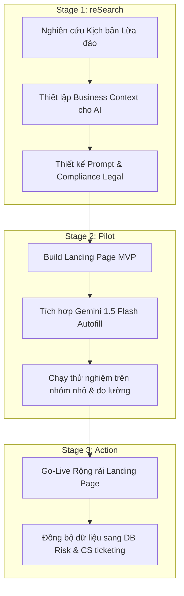

# BRD: Báo Cáo Lừa Đảo (Trust - Report Scam)

> - **Project:** Use Case Báo Cáo Lừa Đảo (Trust) - Web Growth & Inbound Web Platform
> - **Main URL:** momo.vn/report-scam
> - **Division:** Risk & Security (GPD Web Platform)
> - **Version:** 1.1 · Tháng 6/2026
> - **Status:** Active (Scope: Landing Page & GenAI Autofill - S-P-A Framework)

---

> **Problem:** Mỗi tháng có hàng ngàn người dùng ngoài hệ sinh thái MoMo (Non-MoMo Users) bị lừa đảo trực tuyến tìm kiếm nơi tố giác kẻ lừa đảo hoặc cảnh báo cộng đồng. Tuy nhiên, họ gặp rào cản lớn khi phải tải app, đăng ký, đăng nhập tài khoản MoMo mới có thể gửi báo cáo trên Miniapp. Điều này làm lãng phí nguồn dữ liệu cảnh báo khổng lồ từ cộng đồng và làm tăng chi phí xử lý thủ công của CS (2.000–3.000 tickets/tháng).
> **KPI Owned:** Số lượng báo cáo lừa đảo ẩn danh được tiếp nhận và xác minh thành công trên Web (làm phong phú cơ sở dữ liệu cảnh báo cộng đồng và AI Scoring).
> **Conversion Flow:** Người dùng truy cập Landing Page `/report-scam` → Nhập mô tả kịch bản lừa đảo bằng ngôn ngữ tự nhiên → AI (Gemini) tự động bóc tách thực thể và điền form (Autofill) → Người dùng xác nhận và gửi báo cáo → Submit thành công (Không yêu cầu đăng nhập/OTP, bảo đảm ẩn danh).

---

## 1. Executive Summary

### 1.1 Elegant Problem Framing
*   **Vấn đề cốt lõi:** Nạn nhân lừa đảo trực tuyến thường có tâm lý e ngại trình báo do thủ tục phức tạp, sợ bị lộ danh tính và cảm thấy bất lực vì không biết báo cáo ở đâu. Việc bắt buộc tải app MoMo và thực hiện KYC chỉ để gửi báo cáo là rào cản quá lớn đối với Non-MoMo users.
*   **Giải pháp (The "What"):** Xây dựng Website tiếp nhận báo cáo lừa đảo không cần đăng nhập trên Web. Áp dụng công nghệ GenAI (Gemini) tự động nhận diện và điền form từ kịch bản văn bản tự do của người dùng để rút ngắn quy trình xuống còn dưới 2 phút, đảm bảo tính ẩn danh và tuân thủ pháp lý.

### 1.2 Situation
*   Mỗi tháng, hệ thống CS của MoMo tiếp nhận thủ công khoảng 2.000–3.000 ticket liên quan đến phản ánh lừa đảo.
*   Người dùng khi bị lừa đảo (hoặc suýt bị lừa đảo) cần một công cụ Web phản hồi nhanh chóng, ẩn danh và dễ dàng tiếp cận mà không có rào cản đăng nhập.

### 1.3 Complication
*   Hành vi lừa đảo tài chính qua mạng ngày càng tinh vi và thay đổi kịch bản liên tục.
*   Việc thu thập dữ liệu thủ công qua form điền truyền thống có tỷ lệ bỏ dở (drop rate) rất cao do người dùng phải nhớ và tự tay nhập quá nhiều thông tin chi tiết (SĐT lừa đảo, STK, Tên ngân hàng, Số tiền, Phương thức).

### 1.4 Resolution (S-P-A Framework Implementation)
*   **reSearch (Giai đoạn 1):** Nghiên cứu hành vi người dùng, các kịch bản lừa đảo phổ biến và thiết lập bộ quy chuẩn bóc tách thông tin. Nghiên cứu giải pháp tuân thủ pháp lý (Nghị định 13/2023/NĐ-CP) và thiết kế hệ thống prompt cho Gemini 1.5 Flash.
*   **Pilot (Giai đoạn 2):** Xây dựng Landing Page MVP `/report-scam` không yêu cầu đăng nhập/OTP. Tích hợp module GenAI Autofill bóc tách text tự do sang biểu mẫu xác nhận. Chạy thử nghiệm trên nhóm nhỏ người dùng để đánh giá tính chính xác của AI và tỷ lệ hoàn thành (Completion Rate).
*   **Action (Giai đoạn 3):** Triển khai rộng rãi Landing Page, tự động hóa luồng đẩy dữ liệu báo cáo sang hệ thống AI Scoring của Risk Team để phân tích hành vi và đồng bộ dữ liệu xử lý vé của CS.

---

## 2. Bối Cảnh Hiện Tại

### 2.1 Hiện trạng Web Assets

| Asset | URL | Trạng thái | Ghi chú |
|---|---|---|---|
| Hub page | /report-scam | Chưa build | Landing page tiếp nhận báo cáo lừa đảo không cần đăng nhập |
| AEO/GEO Document | /report-scam/llms.txt | Chưa build | Chuẩn hóa thông tin cảnh báo an toàn cho AI Search Engines |

### 2.2 Phạm vi dự án (Scope & Out-of-Scope)
*   **In-Scope:**
    *   Xây dựng Landing Page Web tĩnh `/report-scam` phản hồi nhanh, tối ưu hóa giao diện di động.
    *   Tích hợp ô nhập kịch bản tự do (ngôn ngữ tự nhiên) tại màn hình đầu tiên.
    *   Tích hợp GenAI (Gemini 1.5 Flash API) bóc tách các trường: Số điện thoại kẻ lừa đảo, Số tài khoản ngân hàng kẻ lừa đảo, Tên ngân hàng thụ hưởng, Số tiền bị lừa, và Phương thức lừa đảo (Kịch bản).
    *   Tự động điền (Autofill) kết quả bóc tách vào form bước tiếp theo để người dùng kiểm tra và xác nhận.
    *   Cho phép gửi thông tin ẩn danh hoàn toàn (các trường liên hệ cá nhân như Email/SĐT người báo cáo là tùy chọn và đi kèm checkbox đồng thuận tuân thủ Nghị định 13).
*   **Out-of-Scope (Future Phases / Kế hoạch mở rộng dài hạn):**
    *   SEO Planning diện rộng và hệ thống trang tra cứu động pSEO (`/report-scam/tra-cuu/*`).
    *   Kết nối API đồng bộ dữ liệu thời gian thực với các cơ quan chức năng hoặc bên thứ ba (như A05).
    *   Các tính năng tương tác cộng đồng, bình luận hoặc đánh giá độ uy tín tài khoản trên Web.

---

## 3. Quy Trình S-P-A (reSearch ➔ Pilot ➔ Action)

### 3.1 Giai đoạn 1: reSearch (Khảo sát & Thiết kế)
*   **Mục tiêu:** Thu thập dữ liệu các kịch bản lừa đảo thực tế để cấu hình AI và thiết kế giao diện tối giản nhất.
*   **Nhiệm vụ chi tiết:**
    1.  **Phân tích kịch bản:** Thu thập 100 kịch bản lừa đảo mẫu từ dữ liệu CS (như giả mạo biên lai chuyển khoản, giả danh shipper, tuyển cộng tác viên, v.v.) để làm tập dữ liệu grounding cho AI.
    2.  **Thiết lập Prompt bóc tách:** Thiết lập Master Prompt hướng dẫn Gemini 1.5 Flash bóc tách thông tin một cách chuẩn xác, xử lý các trường hợp văn bản nhập không đầy đủ hoặc dùng từ lóng.
    3.  **Đánh giá pháp lý (Compliance):** Làm việc với Legal để phê duyệt điều khoản bảo mật dữ liệu. Landing page không yêu cầu đăng nhập nhưng cần có checkbox tuyên bố miễn trừ trách nhiệm và đồng thuận thu thập thông tin tự nguyện (nếu người dùng nhập SĐT/Email liên hệ).

### 3.2 Giai đoạn 2: Pilot (Thử nghiệm MVP)
*   **Mục tiêu:** Kiểm thử thực tế trải nghiệm không đăng nhập và tính ổn định của tính năng AI Autofill trên Landing Page.
*   **Nhiệm vụ chi tiết:**
    1.  **Phát triển Landing Page MVP:** Giao diện tối giản với 2 bước:
        *   *Bước 1:* Nhập nội dung mô tả kịch bản (Textarea tự do).
        *   *Bước 2:* Xác nhận thông tin đã bóc tách (Form điền sẵn thông tin SĐT, STK, Số tiền, Ngân hàng). Tất cả các trường này đều có thể sửa đổi và không bắt buộc nhập để tránh lỗi nhận diện sai của AI gây đứt gãy trải nghiệm.
    2.  **Tích hợp GenAI:** Kết nối frontend với API Gemini 1.5 Flash qua backend API Gateway của Web Platform.
    3.  **Chạy thử nghiệm (Internal & Friends-Family):** Cho chạy thử nghiệm với nhóm 100 người dùng mẫu, yêu cầu họ nhập kịch bản lừa đảo thực tế để đo lường độ chính xác của AI. Mục tiêu đạt tỷ lệ bóc tách đúng >= 85%.

### 3.3 Giai đoạn 3: Action (Vận hành Rộng rãi)
*   **Mục tiêu:** Triển khai chính thức Landing Page `/report-scam` rộng rãi, bắt đầu thu thập dữ liệu báo cáo ẩn danh từ cộng đồng.
*   **Nhiệm vụ chi tiết:**
    1.  **Go-live Landing Page:** Cấu hình CDN và tối ưu hóa hiệu năng Landing Page đảm bảo thời gian tải trang dưới 1.5 giây.
    2.  **Tích hợp phễu dữ liệu:** Tự động đẩy thông tin báo cáo đã qua xác nhận của người dùng về cơ sở dữ liệu cảnh báo của Risk Team để làm giàu dữ liệu cho AI Scoring (chặn giao dịch đáng ngờ trên App MoMo).
    3.  **Giảm tải CS:** Tự động phân loại nội dung báo cáo và tạo ticket tự động trên hệ thống CS, giúp CS Agent không phải nhập thủ công dữ liệu từ người dùng.

---

## 4. JTBD (Jobs-to-be-Done) Analysis

### Job #TRUST-01 - Tố cáo Nhanh chóng & Ẩn danh (Scam Victim)
*   > "Tôi muốn gửi báo cáo tố cáo kẻ lừa đảo một cách nhanh chóng ngay trên trình duyệt mà không cần phải thực hiện các bước tải app hay đăng nhập rườm rà, để tôi có thể cảnh báo cộng đồng và giúp ngăn chặn hành vi lừa đảo mà vẫn bảo vệ được danh tính của mình."

| Dimension | Nội dung |
|---|---|
| **Functional** | - Nhập kịch bản tự do bằng ngôn ngữ tự nhiên. - AI tự động điền form, kiểm tra lại thông tin và bấm gửi trong vòng dưới 2 phút. - Không cần OTP/đăng nhập/KYC. |
| **Emotional** | - Cảm thấy an tâm vì thông tin cá nhân được bảo vệ ẩn danh. - Giảm bớt sự thất vọng và bất lực sau khi bị lừa đảo nhờ có kênh tố cáo chính thống. |
| **Social** | - Đóng góp dữ liệu để bảo vệ cộng đồng tránh khỏi các nạn nhân tiếp theo. |
| **Trigger** | - Người dùng vừa trải qua hoặc phát hiện một vụ lừa đảo tài chính liên quan đến tài khoản MoMo hoặc các ngân hàng đối tác. |

---

## 5. Success Metrics

Do dự án tập trung vào Landing Page báo cáo không đăng nhập áp dụng S-P-A Framework và chưa triển khai SEO planning hay pSEO mở rộng, các chỉ số thành công sẽ tập trung vào hiệu năng vận hành và chất lượng trải nghiệm:

### 5.1 Product & Experience Metrics
*   **Landing Page Completion Rate:** Đạt >= 65% (Tỷ lệ người dùng bắt đầu nhập kịch bản lừa đảo hoàn thành toàn bộ quy trình gửi báo cáo).
*   **AI Autofill Accuracy Rate:** Đạt >= 85% (Tỷ lệ thông tin bóc tách tự động bởi Gemini 1.5 Flash khớp đúng với nội dung kịch bản thực tế).
*   **Average Submission Time:** Dưới 90 giây (Thời gian trung bình từ lúc truy cập trang đến khi gửi báo cáo thành công).
*   **Error Rate (API/Frontend):** Dưới 1% (Tỷ lệ lỗi khi gửi thông tin hoặc gọi API bóc tách dữ liệu).

### 5.2 Business & Operational Metrics
*   **CS Ticket Deflection Rate:** Giảm 15% lượng ticket báo cáo lừa đảo gửi thủ công qua tổng đài CS nhờ luồng tự phục vụ (Self-service) trên Web.
*   **Risk Database Ingestion:** Tăng trưởng số lượng số điện thoại/số tài khoản lừa đảo mới được cập nhật vào AI Scoring DB hàng tháng.

---

## 6. Dependencies & Constraints

| Dependency | Bộ phận | Vai trò | Trạng thái |
|---|---|---|---|
| **Risk & Security Team** | Risk | Phê duyệt logic xử lý dữ liệu báo cáo ẩn danh và tích hợp vào hệ thống AI Scoring. | Pending |
| **Legal & Compliance** | Legal | Đảm bảo quy trình báo cáo ẩn danh tuân thủ Nghị định 13/2023/NĐ-CP về bảo vệ dữ liệu cá nhân. | Pending |
| **GenAI Infrastructure** | Tech/Platform | Hỗ trợ API Gateway và hạn mức gọi API Gemini 1.5 Flash cho Landing Page. | Active |

---

## Change Log
- **Tháng 6/2026 (v1.0):** Khởi tạo dự thảo tài liệu BRD.
- **22/06/2026 (v1.1):** Điều chỉnh thu hẹp scope dự án (Chỉ tập trung xây dựng Landing Page gửi báo cáo ẩn danh, chưa triển khai SEO planning/tra cứu pSEO) và cấu trúc lại toàn bộ tài liệu theo quy trình **S-P-A Framework (reSearch - Pilot - Action)**.
