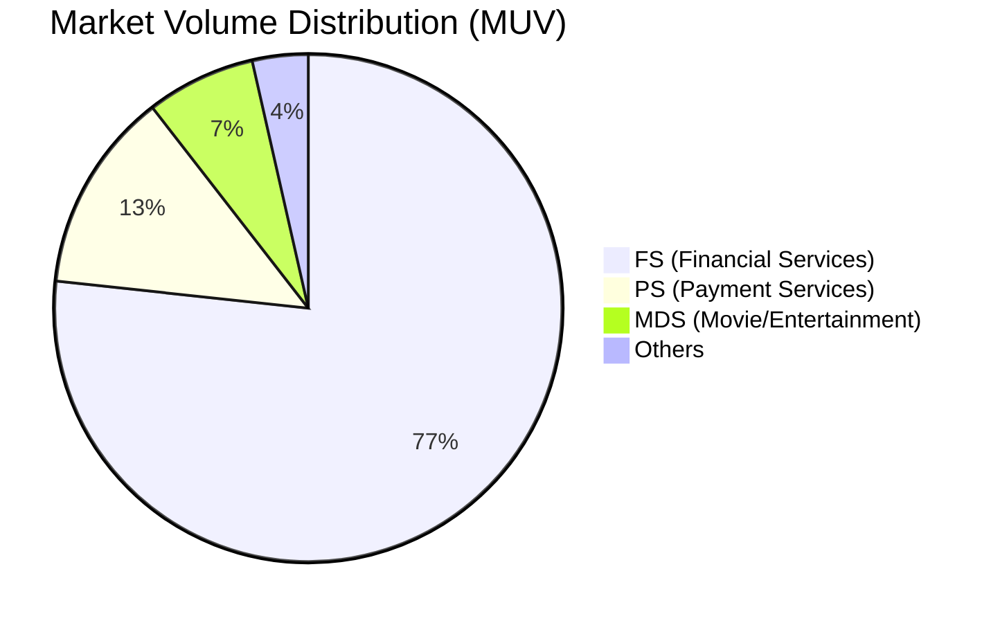
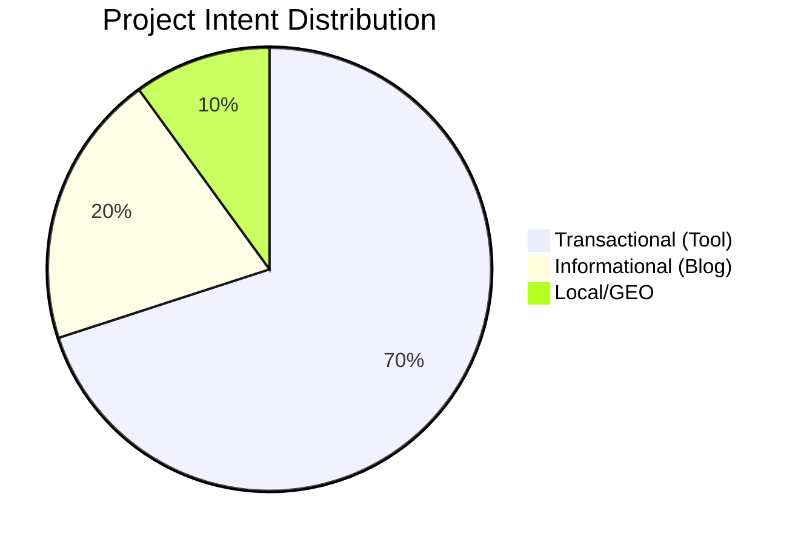

# 📅 MASTER REPORT: GROWTH PLATFORM & SEO/GEO
> **Report Month:** {{month/year}} | **Date:** {{date}}
> **Owner:** Văn Hiến (SEO & GEO Lead) | **Stakeholder:** Anh Công (VP)

---

## 1. Executive Summary (Tóm tắt chiến lược)
*Mô tả ngắn gọn về trọng tâm của tháng (ví dụ: Chuyển dịch sang GenAI, Tối ưu hóa Crawl Budget, hay Mở rộng thị trường mới).*

---

## 2. Key Highlights & Project Status

### 🛠 Technical Audit & Platform Health
- **Crawl Efficiency:** Xử lý [Số lượng] URLs chất lượng thấp/không traffic.
- **AI Crawler Policy:** Trạng thái triển khai `llms.txt` và `robots.txt` cho các Use Case.
- **Status:** [On Progress/Done] các hạng mục dọn dẹp kỹ thuật.

### 🗺 SEO Inventory & Market Mapping
- **Inventory Update:** Hoàn thành đo lường cho [Số lượng] thị trường mới.
- **Market Sizing:** Xác định các vùng trắng (White Space) có Volume lớn nhưng MoMo chưa có SoV.
- **Priority:** Danh sách các Use Case ưu tiên cho tháng tiếp theo.

### 🚀 GenAI Content Engine (Pilot: {{Use Case}})
- **Engine Status:** Cập nhật Prompt, Business Context và quy trình phối hợp BU.
- **Production:** Số lượng bài viết đã sản xuất, tỷ lệ Indexing và Ranking ban đầu.
- **GEO/AEO:** Tỷ lệ trích dẫn từ AI Search (Gemini, Perplexity).

---

## 3. Priorities for the Next 30 Days

### Technical & Infrastructure
- [ ] Hoàn thành xử lý Zero-traffic cho Use Case {{Name}}.
- [ ] Cập nhật Schema Markup (FAQ, HowTo, Product) cho {{Name}}.

### Content & Growth
- [ ] Sản xuất [Số lượng] bài viết GenAI cho cụm {{Cluster}}.
- [ ] Triển khai kế hoạch Redirect/Migration cho {{Project}}.

---

## 4. Market Insights & Metrics

### 📊 Market Distribution (Total Volume)

### 🎯 Intent Breakdown (Pilot Project)

---

## 5. Key Insights & Recommendations
1. **[Insight 1]:** Phân tích về sự thay đổi của thị trường hoặc đối thủ.
2. **[Insight 2]:** Đề xuất giải pháp tối ưu hóa chuyển đổi Web-to-App.
3. **[Insight 3]:** Các rào cản cần Stakeholder hỗ trợ (Pháp lý, Dev resource).

---
*Generated by Growth Platform | Confidential*
