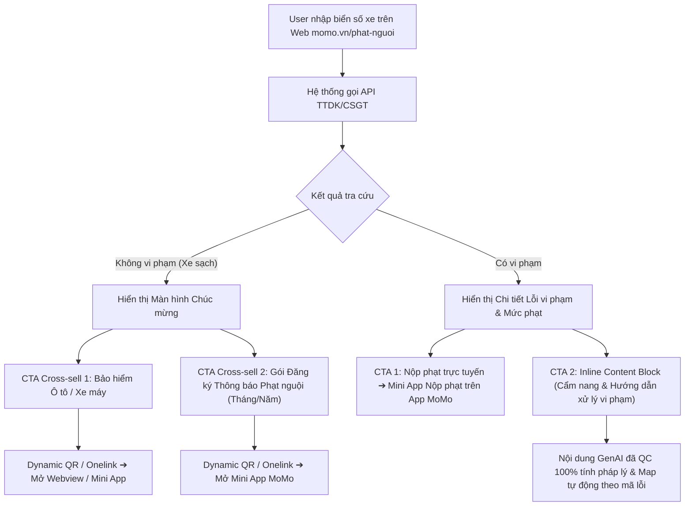
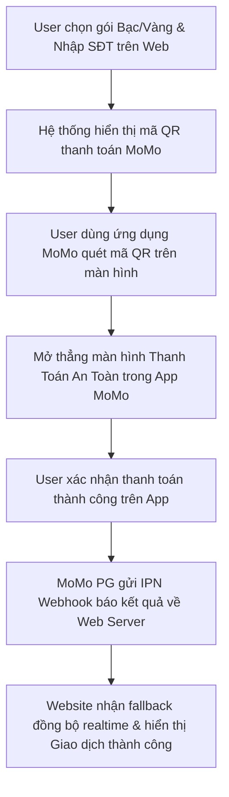

# BRD: Tra Cứu Phạt Nguội

> - **Project:** Tra Cứu Phạt Nguội Web Growth
> - **Main URL:** momo.vn/phat-nguoi
> - **Division:** PS (Payment Services)
> - **Use Case:** Phạt Nguội
> - **Owner:** Web Platform
> - **Governance:** Web Product Lead
> - **Version:** 5.0 - 2026-08-19
> - **Status:** Aligned 19/08/2026 - Tái cấu trúc luồng kết quả tra cứu (Single Page Inline Section), phân 2 nhánh trả kết quả (Có vi phạm: Nộp phạt In-App + Content Block cẩm nang; Không vi phạm: Cross-sell Bảo hiểm & Gói đăng ký thông báo Phạt nguội tự động), áp dụng GenAI Content QC & mapping tự động.

---

## 1. Executive Summary

### Situation

MoMo sở hữu partnership độc quyền với TTDK (Trung tâm Đăng Kiểm Việt Nam) cho tính năng Tra Cứu Phạt Nguội. Tính năng App đã live. Web channel đã rollout Phase 1 (Mini Web `/phat-nguoi` + API real-time CSGT/TTDK) và đang trong giai đoạn Pilot & Scale. Tổng search demand thị trường đạt ~3.56M lượt tìm kiếm/tháng - được khuếch đại mạnh bởi Nghị định 168/2024/NĐ-CP tăng mức phạt 3-5x từ 1/1/2025.

### Complication

MoMo đang cạnh tranh với 2 nhóm đối thủ: (1) Các site bên thứ ba không chính thống (phatnguoi.com - ~148K branded search/tháng) đang chiếm traffic organic; (2) Site chính thống của nhà nước (csgt.vn) có UX kém và hay crash. Nếu không xây dựng web presence sớm, MoMo chỉ phục vụ được nhóm user đã có app, bỏ sót ~30.000 lượt tra cứu/quý từ nhóm Non-MoMo Users.

### Resolution

Xây dựng Web channel từ zero theo mô hình Programmatic SEO:
- **Phase 1 (Foundation & Core Utilities - LIVE/Pilot):** Mini Web Tool tra cứu thực (ô-tô/xe-máy/xe-điện) + Bản đồ Camera giao thông (Interactive Camera Map) + Gói Subscription & Thanh toán Web PG + Route-based pSEO + Chiến dịch Off-page.
- **Phase 2 (Regional Scale):** Scale Up trang Location (pSEO 63 tỉnh thành) và tiếp tục sản xuất Blog (Batch 2).
- **Phase 3 (Growth Loops):** Growth Loops + Camera AI pSEO + Dispute Assistant + Fine Code pSEO.

**Định vị chiến lược:** Phạt Nguội = Governance & Acquisition (kéo user vào hệ sinh thái MoMo), không phải dòng doanh thu Web trực tiếp. Case study mẫu cho Product-Led Growth trên Web Platform.

---

## 2. Bối Cảnh Thị Trường

### 2.1 Market Demand

<table style="width:100%; border-collapse:collapse; border:1.5px solid #64748b; margin:1em 0; font-size:0.9em;">
  <thead>
    <tr style="background-color:#f1f5f9;">
      <th style="border:1.5px solid #64748b; padding:8px 12px; text-align:left; font-weight:700;">Metric</th>
      <th style="border:1.5px solid #64748b; padding:8px 12px; text-align:left; font-weight:700;">Giá trị</th>
    </tr>
  </thead>
  <tbody>
    <tr>
      <td style="border:1px solid #94a3b8; padding:8px 12px; text-align:left;">Total monthly search volume</td>
      <td style="border:1px solid #94a3b8; padding:8px 12px; text-align:left;">~3.56M lượt/tháng</td>
    </tr>
    <tr style="background-color:#f8fafc;">
      <td style="border:1px solid #94a3b8; padding:8px 12px; text-align:left;">Total vehicles (Ô tô + Xe máy)</td>
      <td style="border:1px solid #94a3b8; padding:8px 12px; text-align:left;">84M+ phương tiện</td>
    </tr>
    <tr>
      <td style="border:1px solid #94a3b8; padding:8px 12px; text-align:left;">MoMo users with verified cars</td>
      <td style="border:1px solid #94a3b8; padding:8px 12px; text-align:left;">700K+</td>
    </tr>
  </tbody>
</table>

Nghị định 168/2024/NĐ-CP tăng mức phạt 3-5x từ 1/1/2025 tạo nhu cầu tìm kiếm "evergreen" mạnh - spike đầu năm và duy trì cao quanh năm.

### 2.2 Competitive Gap - Chiến Lược Displacement

<table style="width:100%; border-collapse:collapse; border:1.5px solid #64748b; margin:1em 0; font-size:0.9em;">
  <thead>
    <tr style="background-color:#f1f5f9;">
      <th style="border:1.5px solid #64748b; padding:8px 12px; text-align:left; font-weight:700;">Competitor</th>
      <th style="border:1.5px solid #64748b; padding:8px 12px; text-align:left; font-weight:700;">Brand Search</th>
      <th style="border:1.5px solid #64748b; padding:8px 12px; text-align:left; font-weight:700;">Điểm yếu</th>
      <th style="border:1.5px solid #64748b; padding:8px 12px; text-align:left; font-weight:700;">MoMo Solution</th>
    </tr>
  </thead>
  <tbody>
    <tr>
      <td style="border:1px solid #94a3b8; padding:8px 12px; text-align:left;">phatnguoi.com</td>
      <td style="border:1px solid #94a3b8; padding:8px 12px; text-align:left;">~148K/tháng</td>
      <td style="border:1px solid #94a3b8; padding:8px 12px; text-align:left;">Site bên thứ 3, rủi ro data privacy, không official</td>
      <td style="border:1px solid #94a3b8; padding:8px 12px; text-align:left;">Official TTDK integration + MoMo brand trust</td>
    </tr>
    <tr style="background-color:#f8fafc;">
      <td style="border:1px solid #94a3b8; padding:8px 12px; text-align:left;">csgt.vn (Official)</td>
      <td style="border:1px solid #94a3b8; padding:8px 12px; text-align:left;">~13K/tháng</td>
      <td style="border:1px solid #94a3b8; padding:8px 12px; text-align:left;">UX kém, hay crash, khó dùng</td>
      <td style="border:1px solid #94a3b8; padding:8px 12px; text-align:left;">MoSpark optimized UX</td>
    </tr>
    <tr>
      <td style="border:1px solid #94a3b8; padding:8px 12px; text-align:left;">VNeTraffic</td>
      <td style="border:1px solid #94a3b8; padding:8px 12px; text-align:left;">~14K/tháng</td>
      <td style="border:1px solid #94a3b8; padding:8px 12px; text-align:left;">Khó sử dụng, không có ecosystem</td>
      <td style="border:1px solid #94a3b8; padding:8px 12px; text-align:left;">Seamless Web-to-App flow</td>
    </tr>
  </tbody>
</table>

### 2.3 Strategic Advantages

- **Trust Moat:** Super App brand loại bỏ lo ngại rò rỉ data thường gặp ở các site gray market.
- **Ecosystem Advantage:** Search - Notify - Pay - Insure toàn bộ trong 1 app.
- **Official Data:** Logo TTDK/CSGT chính thống - trust signal mạnh nhất trong category này.

### 2.4 Phân Tích SEM - Validation Market Demand

<table style="width:100%; border-collapse:collapse; border:1.5px solid #64748b; margin:1em 0; font-size:0.9em;">
  <thead>
    <tr style="background-color:#f1f5f9;">
      <th style="border:1.5px solid #64748b; padding:8px 12px; text-align:left; font-weight:700;">Metric</th>
      <th style="border:1.5px solid #64748b; padding:8px 12px; text-align:left; font-weight:700;">Kết quả</th>
      <th style="border:1.5px solid #64748b; padding:8px 12px; text-align:left; font-weight:700;">Hàm ý chiến lược</th>
    </tr>
  </thead>
  <tbody>
    <tr>
      <td style="border:1px solid #94a3b8; padding:8px 12px; text-align:left;">CTR trung bình SEM</td>
      <td style="border:1px solid #94a3b8; padding:8px 12px; text-align:left;">~7%</td>
      <td style="border:1px solid #94a3b8; padding:8px 12px; text-align:left;">High-intent market được xác nhận</td>
    </tr>
    <tr style="background-color:#f8fafc;">
      <td style="border:1px solid #94a3b8; padding:8px 12px; text-align:left;">CVR utility (multi-search)</td>
      <td style="border:1px solid #94a3b8; padding:8px 12px; text-align:left;">155-178%</td>
      <td style="border:1px solid #94a3b8; padding:8px 12px; text-align:left;">User tra nhiều lần/visit - cần tính năng "Lưu danh sách xe"</td>
    </tr>
    <tr>
      <td style="border:1px solid #94a3b8; padding:8px 12px; text-align:left;">Cluster xe máy CTR</td>
      <td style="border:1px solid #94a3b8; padding:8px 12px; text-align:left;">Đến 18%, CPA thấp nhất</td>
      <td style="border:1px solid #94a3b8; padding:8px 12px; text-align:left;">Phân khúc đối thủ đang bỏ ngỏ - ưu tiên pSEO</td>
    </tr>
    <tr style="background-color:#f8fafc;">
      <td style="border:1px solid #94a3b8; padding:8px 12px; text-align:left;">Exact Match vs Phrase</td>
      <td style="border:1px solid #94a3b8; padding:8px 12px; text-align:left;">Exact hiệu quả hơn ~50% CPA</td>
      <td style="border:1px solid #94a3b8; padding:8px 12px; text-align:left;">Long-tail intent rõ ràng</td>
    </tr>
  </tbody>
</table>

### 2.5 Empirical Dataset Analysis (431,506 Vehicles)

Dữ liệu phân tích thực tế từ mẫu **455.462 lượt tra cứu phạt nguội** (**431.506 xe duy nhất**) khẳng định các cơ hội chiến lược sau:
1. **Ô tô chiếm 68.55% lượt tra cứu (312.233 xe ô tô):** Phạt Nguội chính là "Cửa ngõ vàng" hứng tệp chủ xe ô tô có thu nhập cao và ARPU lớn trên Open Web.
2. **72.40% Lỗi phạt nguội đang TỒN ĐỌNG CHƯA NỘP (52.999 lỗi chưa nộp / 73.207 lỗi):** Tiềm năng doanh thu trực tiếp lớn cho tính năng **Nộp phạt Dịch vụ công** và **Trả góp tiền phạt 0% qua Ví Trả Sau MoMo**.
3. **90.39% Xe SẠCH không vi phạm (387.836 xe):** Điểm chạm tâm lý hoàn hảo để tặng Voucher Bảo hiểm TNDS/Thân vỏ & Bật tính năng Auto-scan quét phạt nguội tự động định kỳ để lưu Vehicle Profile.
4. **67.04% Lỗi vi phạm thuộc nhóm CHẠY QUÁ TỐC ĐỘ (49.080 lỗi):** Cơ sở để bán kèm gói **Vietmap Live 30k/tháng** (cảnh báo tốc độ realtime) và **Gói Cứu hộ đường bộ 24/7**.

---

## 3. Định Hướng Dự Án

### 3.1 Product Identity & KPI Model

- **Primary success metric (Web):** Đạt **Top 3 thứ hạng tìm kiếm (Google Ranking)** cho các từ khóa chính (ví dụ: *"tra cứu phạt nguội"*, *"phạt nguội"*...).
- **Secondary metrics:** MEU (Monthly Engagement Users - user có tương tác Utility như tra cứu biển số, multi-search loop), MAU (in-app), % New to Services, W2A Conversion Rate.
- **Acquisition Funnel:** Web Utility (MEU) - W2A - In-App activation (MAU, ecosystem cross-sell).
- **Revenue Stream:** Commission từ nộp phạt qua Cổng Dịch Vụ Công Quốc Gia. Cross-sell bảo hiểm xe máy/ô tô. Subscription TTDK (Silver/Gold).

### 3.2 Web-to-App Flow & Luồng Tiện ích Hướng dẫn Lỗi (Web-to-App & Contextual Violation Guide Flow)

**Triết lý:** Web deliver đủ value (kết quả tra cứu + cẩm nang xử lý lỗi) để build Trust, sau đó điều hướng người dùng sang App bằng các nút CTA hành động rõ ràng (Nộp phạt trực tuyến, Đăng ký thông báo tự động, Mua bảo hiểm xe).

**Quy trình Vận hành Trải nghiệm người dùng (UX) và Dữ liệu (Cập nhật 19/08/2026):**
1. **Thu thập dữ liệu tra cứu:** Người dùng nhập biển số xe trên Widget tra cứu Single Page của Web `momo.vn/phat-nguoi`.
2. **Trả kết quả 2 nhánh (Single Page Inline Section - Không dùng Popup):**
   - **Nhánh KHÔNG VI PHẠM (Xe sạch):** Trả màn hình chúc mừng ➔ Hiển thị 2 khối CTA Cross-sell: (1) Mua bảo hiểm Ô tô / Xe máy; (2) Đăng ký gói nhận thông báo Phạt nguội tự động (gói Tháng / gói Năm).
   - **Nhánh CÓ VI PHẠM (Có lỗi):** Trả chi tiết lỗi vi phạm, địa điểm, mã quyết định và tiền phạt ước tính ➔ Hiển thị nút **CTA 1 (Nộp phạt trực tuyến)** dẫn mở Mini App Nộp phạt trên App MoMo và **CTA 2 (Inline Content Block)** đính kèm bài viết cẩm nang hướng dẫn thủ tục đóng phạt, Nghị định pháp luật và sử dụng VNeID/GPLX điện tử.
3. **Cơ chế GenAI Content QC & Auto-mapping:** Content Team kiểm duyệt (Fact-check) 100% tính chính xác pháp lý các bài viết GenAI và gắn mã map lỗi vi phạm để Web Dev lập trình tự động nhúng bài cẩm nang tương ứng dưới màn hình kết quả tra cứu.



**Web (Lite):** Nhập biển số ➔ Trả kết quả Single Page Inline Block ➔ CTA Nộp phạt / Mua gói thông báo / Đọc cẩm nang QC.

**App (Full):** Xem ảnh chụp vi phạm ➔ Nộp phạt online ➔ Nhận push notification ➔ Quản lý Thẻ Xe Số & Subscription.

### 3.3 Dự Án Này KHÔNG Phải

- Không phải trang thay thế cho app feature
- Không đề cập các site không chính thống (phatnguoi.com) ngoại trừ so sánh về bảo mật
- Không dùng ngôn ngữ "xóa vi phạm" hoặc "bỏ phạt" (vi phạm pháp luật)
- Không cạnh tranh trực tiếp csgt.vn về tính năng - cạnh tranh về UX và ecosystem

### 3.4 Khung Hợp Tác Đầu Tư & Chia Sẻ Doanh Thu Liên BU (Cross-BU Co-investment & Attribution Framework)

Nhằm giải quyết bài toán ROI thấp của dự án Phạt Nguội khi đứng độc lập (do chi phí chạy SEM lớn và tỷ lệ nộp phạt thu phí hoa hồng trực tiếp thấp), MoMo áp dụng mô hình **Co-investment (Đồng đầu tư)**. Dự án Phạt Nguội đóng vai trò là **Phễu Hút Traffic Đại Chúng (Mass Traffic Acquisition Funnel)**, sau đó phân phối lưu lượng người dùng sở hữu phương tiện giao thông (tệp khách hàng có giá trị cao) cho các BUs khác để tối ưu hóa doanh thu chéo:

1.  **BU Bảo Hiểm (Insurance - Ô tô & Xe máy):**
    *   *Hình thức hợp tác:* Tích hợp widget kiểm tra thời hạn và mua nhanh Bảo hiểm trách nhiệm dân sự (TNDS) bắt buộc hoặc Bảo hiểm thân vỏ tự nguyện trực tiếp tại trang kết quả tra cứu (Slot 4 / Slot 5).
    *   *Campaign Bundle:* Triển khai chương trình Cross-Sell ưu đãi đóng gói (Bundle) - "Mua bảo hiểm ô tô tặng 1 năm dịch vụ tra cứu phạt nguội tự động" để kích cầu doanh thu chéo giữa 2 BU.
    *   *Cơ chế phân bổ ngân sách:* BU Bảo Hiểm tài trợ **35% - 40% chi phí SEM và vận hành** của Phạt Nguội dựa trên tỷ lệ lead chuyển đổi thành công mua bảo hiểm qua web/app.
2.  **BU Tài Chính (Ví Trả Sau & Vay Nhanh):**
    *   *Hình thức hợp tác:* Khi phát hiện lỗi phạt nguội có số tiền lớn (từ 1.000.000đ trở lên) hoặc người dùng có lịch sử điểm tín dụng tốt, hệ thống tự động hiển thị gợi ý mở **Ví Trả Sau (VTS)** hoặc đăng ký **Vay Nhanh** giải ngân trong 5 phút để thanh toán nộp phạt ngay lập tức.
    *   *Cơ chế phân bổ ngân sách:* BU Tài Chính đồng tài trợ **30% chi phí chạy Ads** dựa trên số lượng tài khoản ví/khoản vay mới được kích hoạt từ trang Phạt Nguội.
3.  **Mô hình Phân bổ Doanh thu & ROI (Attribution Model):**
    *   Doanh thu từ các gói Subscription cảnh báo (Silver/Gold) phát sinh trên Web sẽ được ưu tiên hoàn bù chi phí marketing (SEM) của dự án trước khi phân bổ lợi nhuận cho BU PS.
    *   Mọi lead chuyển đổi chéo thành công sang mua bảo hiểm/vay tiêu dùng sẽ được ghi nhận attribution 100% về cho phễu Phạt Nguội trên Web để tính toán ROI thực tế toàn diện (Total Portfolio ROI) thay vì chỉ đo lường ROI đơn lẻ của BU Phạt Nguội.

---

## 4. JTBD Analysis

### Stage 1 - Nhận Biết Vi Phạm: "Tìm kênh tra cứu uy tín"

**Keywords:** tra cứu phạt nguội (673K), phạt nguội (301K), kiểm tra phạt nguội (165K), check phạt nguội (110K)

<table style="width:100%; border-collapse:collapse; border:1.5px solid #64748b; margin:1em 0; font-size:0.9em;">
  <thead>
    <tr style="background-color:#f1f5f9;">
      <th style="border:1.5px solid #64748b; padding:8px 12px; text-align:left; font-weight:700;">Dimension</th>
      <th style="border:1.5px solid #64748b; padding:8px 12px; text-align:left; font-weight:700;">Nội dung</th>
    </tr>
  </thead>
  <tbody>
    <tr>
      <td style="border:1px solid #94a3b8; padding:8px 12px; text-align:left;">Functional</td>
      <td style="border:1px solid #94a3b8; padding:8px 12px; text-align:left;">Tìm được kênh tra cứu chính xác, không sợ lừa đảo hay lộ thông tin</td>
    </tr>
    <tr style="background-color:#f8fafc;">
      <td style="border:1px solid #94a3b8; padding:8px 12px; text-align:left;">Emotional</td>
      <td style="border:1px solid #94a3b8; padding:8px 12px; text-align:left;">Lo lắng về việc xe có bị phạt không, muốn biết ngay</td>
    </tr>
    <tr>
      <td style="border:1px solid #94a3b8; padding:8px 12px; text-align:left;">Social</td>
      <td style="border:1px solid #94a3b8; padding:8px 12px; text-align:left;">Không muốn bị CSGT "chặn" vì không biết xe đang bị phạt</td>
    </tr>
    <tr style="background-color:#f8fafc;">
      <td style="border:1px solid #94a3b8; padding:8px 12px; text-align:left;">Trigger</td>
      <td style="border:1px solid #94a3b8; padding:8px 12px; text-align:left;">Chuẩn bị đăng kiểm - Thấy người khác bị phạt - Không nhớ xe đã qua camera hay chưa</td>
    </tr>
  </tbody>
</table>

**Giải pháp:** Landing Page `/phat-nguoi` - Blog "Tra cứu phạt nguội ở đâu nhanh nhất 2025".

---

### Stage 2 - Tra Cứu & Xác Nhận: "Tra theo loại xe và địa phương"

**Keywords:** tra cứu phạt nguội ô tô (49.5K), kiểm tra phạt nguội xe máy (22.2K), camera phạt nguội (8.1K), tra cứu theo tỉnh thành

<table style="width:100%; border-collapse:collapse; border:1.5px solid #64748b; margin:1em 0; font-size:0.9em;">
  <thead>
    <tr style="background-color:#f1f5f9;">
      <th style="border:1.5px solid #64748b; padding:8px 12px; text-align:left; font-weight:700;">Dimension</th>
      <th style="border:1.5px solid #64748b; padding:8px 12px; text-align:left; font-weight:700;">Nội dung</th>
    </tr>
  </thead>
  <tbody>
    <tr>
      <td style="border:1px solid #94a3b8; padding:8px 12px; text-align:left;">Functional</td>
      <td style="border:1px solid #94a3b8; padding:8px 12px; text-align:left;">Tra đúng theo loại xe (ô tô/xe máy), theo tỉnh đang ở, xem chi tiết lỗi, thời gian, địa điểm</td>
    </tr>
    <tr style="background-color:#f8fafc;">
      <td style="border:1px solid #94a3b8; padding:8px 12px; text-align:left;">Emotional</td>
      <td style="border:1px solid #94a3b8; padding:8px 12px; text-align:left;">Muốn biết chính xác - không muốn tra sai xe hoặc sai tỉnh</td>
    </tr>
    <tr>
      <td style="border:1px solid #94a3b8; padding:8px 12px; text-align:left;">Trigger</td>
      <td style="border:1px solid #94a3b8; padding:8px 12px; text-align:left;">Chuẩn bị chuyến đi xa - Đang ở tỉnh khác - Có nhiều xe cần quản lý</td>
    </tr>
  </tbody>
</table>

**Giải pháp:** `/phat-nguoi/o-to` - `/phat-nguoi/xe-may` - `/phat-nguoi/[tinh-thanh]` (pSEO 63 tỉnh) - `/phat-nguoi/camera-giao-thong`.

---

### Stage 3 - Nộp Phạt & Đăng Kiểm: "Nộp phạt online nhanh gọn"

**Keywords:** nộp phạt giao thông online (2.9K), nộp phạt nguội online (1.9K), cách nộp phạt nguội

<table style="width:100%; border-collapse:collapse; border:1.5px solid #64748b; margin:1em 0; font-size:0.9em;">
  <thead>
    <tr style="background-color:#f1f5f9;">
      <th style="border:1.5px solid #64748b; padding:8px 12px; text-align:left; font-weight:700;">Dimension</th>
      <th style="border:1.5px solid #64748b; padding:8px 12px; text-align:left; font-weight:700;">Nội dung</th>
    </tr>
  </thead>
  <tbody>
    <tr>
      <td style="border:1px solid #94a3b8; padding:8px 12px; text-align:left;">Functional</td>
      <td style="border:1px solid #94a3b8; padding:8px 12px; text-align:left;">Nộp phạt không cần đến tận nơi, online 24/7</td>
    </tr>
    <tr style="background-color:#f8fafc;">
      <td style="border:1px solid #94a3b8; padding:8px 12px; text-align:left;">Emotional</td>
      <td style="border:1px solid #94a3b8; padding:8px 12px; text-align:left;">Tiết kiệm thời gian, tránh phải xếp hàng ở Kho Bạc hoặc CSGT</td>
    </tr>
    <tr>
      <td style="border:1px solid #94a3b8; padding:8px 12px; text-align:left;">Trigger</td>
      <td style="border:1px solid #94a3b8; padding:8px 12px; text-align:left;">Cần đăng kiểm nhưng đang có vi phạm chưa nộp</td>
    </tr>
  </tbody>
</table>

**Giải pháp:** `/phat-nguoi/blog/nop-phat-nguoi` (CTA nộp phạt trực tiếp) - Blog "Cách nộp phạt nguội online 2025".

---

### Stage 4 - Kiến Thức & Phòng Tránh: "Hiểu luật để không tái phạm"

**Keywords:** nghị định 168 (33.1K), lỗi vượt đèn đỏ (8.1K), camera giao thông (12.1K)

<table style="width:100%; border-collapse:collapse; border:1.5px solid #64748b; margin:1em 0; font-size:0.9em;">
  <thead>
    <tr style="background-color:#f1f5f9;">
      <th style="border:1.5px solid #64748b; padding:8px 12px; text-align:left; font-weight:700;">Dimension</th>
      <th style="border:1.5px solid #64748b; padding:8px 12px; text-align:left; font-weight:700;">Nội dung</th>
    </tr>
  </thead>
  <tbody>
    <tr>
      <td style="border:1px solid #94a3b8; padding:8px 12px; text-align:left;">Functional</td>
      <td style="border:1px solid #94a3b8; padding:8px 12px; text-align:left;">Hiểu mức phạt theo từng lỗi, biết camera đặt ở đâu để tránh</td>
    </tr>
    <tr style="background-color:#f8fafc;">
      <td style="border:1px solid #94a3b8; padding:8px 12px; text-align:left;">Emotional</td>
      <td style="border:1px solid #94a3b8; padding:8px 12px; text-align:left;">Không muốn bị phạt bất ngờ - chủ động tuân thủ luật</td>
    </tr>
    <tr>
      <td style="border:1px solid #94a3b8; padding:8px 12px; text-align:left;">Trigger</td>
      <td style="border:1px solid #94a3b8; padding:8px 12px; text-align:left;">Đã từng bị phạt - Vừa xem tin về Nghị định 168 - Chuẩn bị thi bằng lái</td>
    </tr>
  </tbody>
</table>

**Giải pháp:** Blog hub `/phat-nguoi/blog` - Bài "Nghị định 168: Bảng mức phạt mới nhất".

---

## 5. Kiến Trúc Web

### 5.1 Sitemap Hub & Spoke

```
momo.vn/phat-nguoi [Hub]
│
├── TRANG PHƯƠNG TIỆN
│   ├── /phat-nguoi/o-to              (LIVE)
│   ├── /phat-nguoi/xe-may            (LIVE)
│   └── /phat-nguoi/xe-may-dien       (LIVE)
│
├── TRANG ĐỊA PHƯƠNG (Phase 2 - Scale Up Location pSEO)
│   ├── /phat-nguoi/ha-noi
│   ├── /phat-nguoi/tp-hcm
│   └── /phat-nguoi/[tinh-thanh]...
│
├── TRANG CAMERA (Phase 1 - Interactive Camera Map)
│   ├── /phat-nguoi/camera-giao-thong
│   └── /phat-nguoi/camera-[khu-vuc] (pSEO)
│
├── TRANG DỊCH VỤ
│   └── /phat-nguoi/blog/nop-phat-nguoi
│
└── BLOG CLUSTER
    ├── /phat-nguoi/blog              (Hub kiến thức)
    ├── Cụm Nghị định 168
    ├── Cụm Hướng dẫn tra cứu
    ├── Cụm Nộp phạt online
    └── Cụm Camera giao thông
```

**AEO/GEO:** llms.txt live tại `momo.vn/phat-nguoi/llms.txt` - cung cấp context chuyên sâu cho AI engines (Perplexity, Gemini, ChatGPT) để cite MoMo là nguồn chính thống.

**Schema bắt buộc:** WebApplication - FAQPage - HowTo - BreadcrumbList.

### 5.2 Phase Roadmap

<table style="width:100%; border-collapse:collapse; border:1.5px solid #64748b; margin:1em 0; font-size:0.9em;">
  <thead>
    <tr style="background-color:#f1f5f9;">
      <th style="border:1.5px solid #64748b; padding:8px 12px; text-align:left; font-weight:700;">Phase</th>
      <th style="border:1.5px solid #64748b; padding:8px 12px; text-align:left; font-weight:700;">On-page / Product</th>
      <th style="border:1.5px solid #64748b; padding:8px 12px; text-align:left; font-weight:700;">Off-page / Comm</th>
      <th style="border:1.5px solid #64748b; padding:8px 12px; text-align:left; font-weight:700;">Trạng thái</th>
    </tr>
  </thead>
  <tbody>
    <tr>
      <td style="border:1px solid #94a3b8; padding:8px 12px; text-align:left;">Phase 1 - Foundation & Core</td>
      <td style="border:1px solid #94a3b8; padding:8px 12px; text-align:left;">Mini Web Tool + API TTDK real-time + 3 subpage + Blog Batch 1 (20 bài) + SEM + Gói Subscription & Web PG Checkout + Interactive Camera Map + Route-based pSEO</td>
      <td style="border:1px solid #94a3b8; padding:8px 12px; text-align:left;">Social BMC Batch 1 + Backlink Tier 1-2 (Vendor) + Chiến dịch Off-page</td>
      <td style="border:1px solid #94a3b8; padding:8px 12px; text-align:left;">LIVE / Pilot</td>
    </tr>
    <tr style="background-color:#f8fafc;">
      <td style="border:1px solid #94a3b8; padding:8px 12px; text-align:left;">Phase 2 - Regional Scale</td>
      <td style="border:1px solid #94a3b8; padding:8px 12px; text-align:left;">Scale Up trang Location (pSEO 63 tỉnh thành) + Tiếp tục sản xuất Blog (Batch 2: 20-30 bài ngách)</td>
      <td style="border:1px solid #94a3b8; padding:8px 12px; text-align:left;">-</td>
      <td style="border:1px solid #94a3b8; padding:8px 12px; text-align:left;">Planned T6/2026</td>
    </tr>
    <tr>
      <td style="border:1px solid #94a3b8; padding:8px 12px; text-align:left;">Phase 3 - Growth Loops</td>
      <td style="border:1px solid #94a3b8; padding:8px 12px; text-align:left;">Viral mechanics + Camera AI pSEO + Dispute Assistant + Fine Code pSEO</td>
      <td style="border:1px solid #94a3b8; padding:8px 12px; text-align:left;">Social ongoing + Backlink Tier 3 scale</td>
      <td style="border:1px solid #94a3b8; padding:8px 12px; text-align:left;">Backlog</td>
    </tr>
  </tbody>
</table>

### 5.3 Growth & PLG Tactics (Phase 3)

**Viral Mechanics:**
- Viral Share Loop: Nút "Chia sẻ kết quả xe sạch" kèm link pre-filled biển số - tạo organic traffic từ bạn bè share.
- UGC Warning: User thấy bị phạt tại camera A - nút "Cảnh báo bạn bè lái xe qua khu vực này".
- Seasonal Spike Trigger: Banner "Xe sắp đến hạn đăng kiểm? Kiểm tra phạt nguội trước".

**Product-Led Growth:**
- Safe Driver Reward: Kết quả "Không vi phạm" - Hiển thị voucher giảm 20% Bảo hiểm xe máy/ô tô (cross-sell).
- Dispute Assistant Lite: Decision tree giúp user biết có nên khiếu nại lỗi không - dẫn vào App.
- Data Moat Report: Xuất bản "Top 10 tuyến đường nhiều vi phạm nhất" hàng tháng (MoMo là bên duy nhất có TTDK data cho báo cáo này - earned media + backlink tự nhiên).

**Advanced pSEO:**
- Route-based pSEO: `/phat-nguoi/quoc-lo-1a`, `/phat-nguoi/cao-toc-long-thanh`...
- Fine Code pSEO: `/loi-vi-pham/vuot-den-do` per mã lỗi vi phạm.
### 5.4 Luồng Mua Hàng & Thanh Toán trên Web (Web Subscription & MoMo Payment Checkout Flow)

> **Cập nhật:** Tính năng mua gói Subscription giám sát phạt nguội tự động sẽ được ưu tiên phát triển và launch trực tiếp trên Web trong **Phase 1** để giải quyết bài toán tạo doanh thu trực tiếp và cải thiện ROI dự án. Tuy nhiên, tính năng này hiện tại đang tạm thời điều chỉnh mục tiêu (aim lại) để chốt thêm yêu cầu do phía PO Cell Team chưa gửi đầy đủ thông tin chi tiết và đặc tả kỹ thuật.

Nhằm tối ưu hóa doanh thu trực tiếp từ Web channel (Revenue Stream) và nâng cao trải nghiệm tự động hóa cho người dùng, MoSpark xây dựng luồng mua gói dịch vụ Giám sát Phạt nguội tự động (TTDK Subscription) và thanh toán trực tiếp bằng cổng MoMo Payment Gateway trên Web.

#### 1. Cơ cấu Gói dịch vụ (Subscription Packages)

Người dùng có thể lựa chọn đăng ký theo chu kỳ **Tháng** hoặc **Năm** (giao diện mặc định khuyên dùng gói Năm với ưu đãi sâu). Chi tiết tính năng và giá của các gói:

- **Gói Bạc (Silver):**
  * Giá gói Tháng: **10.000đ/tháng** (Giá gốc 20.000đ/tháng - Giảm 50%).
  * Giá gói Năm: **29.000đ/năm** (Giá gốc 199.000đ/năm - Giảm 85%).
  * Quyền lợi đi kèm:
    - Nhận thông báo tự động ngay khi phát sinh lỗi phạt nguội mới.
    - Tự động nhắc nhở nộp phạt nguội trước thời hạn.
    - Tra cứu lịch sử vi phạm và cập nhật trạng thái xử lý.
    - Tự động nhắc nhở khi đến hạn đăng kiểm xe.
- **Gói Vàng (Gold):**
  * Giá gói Tháng: **19.000đ/tháng** (Giá gốc 29.000đ/tháng - Giảm 34%).
  * Giá gói Năm: **39.000đ/năm** (Giá gốc 299.000đ/năm - Giảm 87%).
  * Quyền lợi đi kèm:
    - Đầy đủ tất cả các tính năng của gói Bạc.
    - Nhận thêm ưu đãi đặc quyền giảm giá đến **40% các loại bảo hiểm ô tô** (Lưu ý: Không áp dụng quyền lợi bảo hiểm này trong thời gian dùng thử 7 ngày).

*Chính sách dùng thử & mua ngay:* Hỗ trợ nút **[Dùng thử miễn phí 7 ngày]** hoặc **[Bỏ qua gói dùng thử và mua ngay]** để thúc đẩy tỷ lệ chuyển đổi trực tiếp trên Web.

#### 2. Trải nghiệm Luồng Mua Hàng (User Journey)



#### 3. Đặc tả chi tiết các bước trong Checkout Flow
- **Bước 1: Chọn gói & Điền thông tin (Checkout Form):**
  * Người dùng chọn gói dịch vụ (Bạc/Vàng), chu kỳ (Tháng/Năm) và điền số điện thoại liên kết nhận thông báo.
- **Bước 2: Hiển thị mã QR thanh toán:**
  * Hệ thống Web gọi API của MoMo PG để tạo mã giao dịch và hiển thị mã QR thanh toán an toàn trực tiếp trên giao diện Web.
- **Bước 3: Quét mã QR trên App MoMo:**
  * Người dùng mở ứng dụng MoMo trên điện thoại di động và thực hiện quét mã QR hiển thị trên Web.
- **Bước 4: Hoàn tất thanh toán an toàn & Phản hồi Website (Done):**
  * Sau khi quét mã, ứng dụng MoMo sẽ tự động nhận diện và đưa người dùng trực tiếp tới màn hình Thanh Toán An Toàn (Secure Payment Screen) bên trong App.
  * Người dùng thực hiện xác thực bảo mật (FaceID/PIN) và bấm xác nhận để hoàn tất giao dịch.
  * **Đồng bộ trạng thái trên Website (Real-time Fallback):** Hệ thống Web Backend nhận tín hiệu từ MoMo PG qua Webhook (IPN), đồng thời giao diện Website tự động nhận được fallback cập nhật trạng thái (thông qua cơ chế Websocket hoặc Polling) để trả ra kết quả giao dịch thành công ngay lập tức trên màn hình của người dùng.

#### 5. Vị trí hiển thị Component Mua Hàng (Placement Strategy)

Để tối ưu hóa tỷ lệ chuyển đổi (CVR), cấu phần mua gói đăng ký (Subscription Widget) sẽ được hiển thị linh hoạt tại các vị trí chiến lược sau trên Website:

1. **Trực tiếp dưới kết quả tra cứu (Primary Location - Contextual Trigger):** Đây là điểm chạm có chuyển đổi cao nhất vì người dùng đang ở đỉnh điểm của sự quan tâm (high-intent).
   - **Trường hợp xe KHÔNG vi phạm (Xe sạch):** Hiển thị ngay dưới banner thông báo *"Chúc mừng, phương tiện của bạn không có lỗi vi phạm"*.
     * *Thông điệp (Message):* "Chủ động bảo vệ phương tiện - Đăng ký gói giám sát tự động để nhận cảnh báo ngay lập tức nếu phát sinh phạt nguội mới."
     * *CTA:* [Đăng ký gói Năm - Chỉ 29k] hoặc [Dùng thử miễn phí 7 ngày].
   - **Trường hợp xe CÓ vi phạm:** Hiển thị bên dưới danh sách các lỗi vi phạm hiện tại.
     * *Thông điệp (Message):* "Nhận thông báo nhắc nhở nộp phạt trước hạn để tránh bị từ chối đăng kiểm và tự động theo dõi các lỗi phát sinh mới."
     * *CTA:* [Đăng ký nhận cảnh báo - Chỉ 29k/năm].

2. **Section Bảng giá (Pricing Section) tại Trang chủ `/phat-nguoi`:**
   - Đặt ở phần giữa hoặc cuối trang chủ (dưới widget tra cứu và phần hướng dẫn sử dụng, trên phần FAQ).
   - Thiết kế dưới dạng một bảng so sánh tính năng (Bạc vs Vàng) và chu kỳ (Tháng/Năm) để phục vụ nhóm người dùng vãng lai hoặc quay lại mua sau khi cân nhắc.

3. **Nút CTA nổi bật trên Header / Navigation Bar:**
   - Thiết kế nút CTA nhỏ màu hồng MoMo nổi bật: `[Đăng ký nhận cảnh báo]` hoặc `[Gói dịch vụ]` trên thanh menu đầu trang.
   - Khi click sẽ tự động scroll-down hoặc dẫn về Section Bảng giá ở Trang chủ.

4. **Kích hoạt qua Banner trong các bài viết thuộc Blog Cluster:**
   - Chèn các banner/widget mua gói dịch vụ ở giữa hoặc cuối các bài viết hướng dẫn đăng kiểm, nghị định mức phạt mới, danh sách các camera phạt nguội để hứng lượng traffic tự nhiên từ SEO/GEO.

### 5.5 Định Hướng & Cấu Trúc Trang Khu Vực Có Chủ Đích (Intentional Location Strategy)

Để đảm bảo tính chính xác 100% của dữ liệu và kiểm soát chất lượng hiển thị, dự án chuyển dịch từ mô hình pSEO hàng loạt sang **Khởi tạo trang khu vực có chủ đích**. Chỉ xuất bản các trang thuộc danh sách whitelist được duyệt và đã qua khâu xác thực dữ liệu thủ công.

#### 1. Cấu Trúc URL & Phân Loại Thực Thể Địa Lý
Hệ thống MoSpark định nghĩa 3 nhóm trang khu vực có chủ đích chính:
*   **Vùng địa lý lớn (Region):** `/phat-nguoi/khu-vuc/{ten-vung}`
    *   *Ví dụ:* `/phat-nguoi/khu-vuc/mien-tay`, `/phat-nguoi/khu-vuc/tay-nguyen`
*   **Tuyến đường huyết mạch (Route):** `/phat-nguoi/tuyen-duong/{ten-tuyen-duong}`
    *   *Ví dụ:* `/phat-nguoi/tuyen-duong/quoc-lo-1a`, `/phat-nguoi/tuyen-duong/cao-toc-long-thanh`
*   **Điểm nóng / Giao lộ / Địa danh (Hotspot & Landmark):** `/phat-nguoi/dia-diem/{ten-dia-diem}`
    *   *Ví dụ:* `/phat-nguoi/dia-diem/nga-tu-hang-xanh`, `/phat-nguoi/dia-diem/ham-thu-thiem`

#### 2. Quy Trình 5 Bước Vận Hành & Kiểm Soát Dữ Liệu (Curated Pipeline)
Mỗi trang khu vực mới được khởi tạo và publish thông qua quy trình kiểm soát nghiêm ngặt sau:
1.  **Lọc & Lập Whitelist (Web Product Lead):** Lựa chọn địa danh dựa trên số lượng tìm kiếm lớn (volume > 1,000/tháng) và mức độ thiết thực với tài xế.
2.  **Xác Thực Dữ Liệu Thực Tế (Cell Team):** Xác minh thủ công danh sách camera phạt nguội (tọa độ GPS), địa chỉ kho bạc nhà nước tiếp nhận nộp phạt, và cơ quan CSGT địa phương chịu trách nhiệm xử lý.
3.  **GenAI Draft Content (MoSpark CMS):** Sử dụng các mô hình Claude 3.5 Sonnet trong module GenAI để sinh bài viết chi tiết dựa trên dữ liệu đã xác thực, cung cấp thông tin hữu ích về luật và quy định xử phạt (Nghị định 168).
4.  **Tích hợp Widget & Bản đồ (Product/Tech Cell):** Nhúng bản đồ tọa độ camera phạt nguội thực tế và bảng đối chiếu mức tiền phạt nhanh cho các lỗi vi phạm phổ biến tại khu vực đó.
5.  **Editorial Gate (Văn Hiến sign-off):** PM kiểm tra và phê duyệt chất lượng nội dung cùng độ chính xác của dữ liệu trước khi bấm nút Publish trực tuyến.

#### 3. Quản Trị Link Equity & Tránh Chồng Chéo Từ Khóa (Silo Control)
*   **Breadcrumb Phân Cấp:** Thiết lập breadcrumb có logic cha-con rõ ràng để Googlebot/AI hiểu sơ đồ tri thức (Ví dụ: `Trang chủ -> TP.HCM -> Quận Bình Thạnh -> Ngã tư Hàng Xanh`).
*   **Schema `containedInPlace`:** Nhúng Schema JSON-LD mô tả thực thể địa lý con nằm trong thực thể địa lý mẹ để phục vụ tối ưu hóa AI Search (AEO).
*   **Thẻ Canonical tự tham chiếu:** Giữ thẻ canonical tự trỏ về chính nó cho các trang địa danh cụ thể để duy trì chỉ mục độc lập trên các công cụ tìm kiếm, tránh bị gộp chỉ mục về trang tỉnh/thành mẹ.

#### 4. Kế Hoạch Triển Khai & Danh Sách Ưu Tiên (Phase 1)
Thay vì tạo hàng loạt 63 tỉnh thành ngay lập tức, dự án sẽ cuốn chiếu theo đợt chất lượng:
*   **Đợt 1 (Tháng 7/2026):** Tập trung vào 10 địa điểm/tuyến đường có lượng tìm kiếm cao nhất và dữ liệu đã sẵn sàng:
    *   *Region:* Miền Tây, Tây Nguyên
    *   *Route:* Cao tốc TP.HCM - Long Thành - Dầu Giây, Cao tốc Pháp Vân - Cầu Giẽ, Quốc lộ 1A
    *   *Hotspot:* Ngã tư Hàng Xanh, Hầm Thủ Thiêm, Ngã tư Sở, Cầu Rồng, Ngã sáu Cộng Hòa.
*   **Đợt 2 (Tháng 8/2026):** Mở rộng sang 15 điểm nóng tiếp theo thuộc Hà Nội, TP.HCM và Đà Nẵng sau khi hoàn tất đối soát dữ liệu.

#### 5. Nguyên Tắc Sáp Nhập & Điều Chỉnh Địa Giới Hành Chính
*   **Nguyên tắc "Intent-First" (Ưu tiên theo Intent):** Giữ nguyên hoạt động của trang địa danh cũ nếu người dùng vẫn duy trì thói quen tìm kiếm địa danh đó (Ví dụ: "Hà Tây"), không thực hiện xóa trang hay redirect vội vã.
*   **Tối ưu hóa Alias Page:** Gộp dữ liệu backend của tỉnh cũ vào đơn vị quản lý mới, hiển thị ghi chú nhỏ trên giao diện: *"Dữ liệu phạt nguội khu vực [Tỉnh A] được tự động cập nhật theo đơn vị hành chính mới [Tỉnh B]"*.

---

## 6. Success Metrics

### 6.1 KPI Framework

<table style="width:100%; border-collapse:collapse; border:1.5px solid #64748b; margin:1em 0; font-size:0.9em;">
  <thead>
    <tr style="background-color:#f1f5f9;">
      <th style="border:1.5px solid #64748b; padding:8px 12px; text-align:left; font-weight:700;">Metric</th>
      <th style="border:1.5px solid #64748b; padding:8px 12px; text-align:left; font-weight:700;">Target</th>
      <th style="border:1.5px solid #64748b; padding:8px 12px; text-align:left; font-weight:700;">Source</th>
    </tr>
  </thead>
  <tbody>
    <tr>
      <td style="border:1px solid #94a3b8; padding:8px 12px; text-align:left;"><strong>Top 3 Google Ranking</strong> (Primary KPI)</td>
      <td style="border:1px solid #94a3b8; padding:8px 12px; text-align:left;">Đạt Top 3 thứ hạng tìm kiếm cho các từ khóa chính (<em>"tra cứu phạt nguội"</em>, <em>"phạt nguội"</em>...)</td>
      <td style="border:1px solid #94a3b8; padding:8px 12px; text-align:left;">Google Search Console / Ahrefs</td>
    </tr>
    <tr style="background-color:#f8fafc;">
      <td style="border:1px solid #94a3b8; padding:8px 12px; text-align:left;"><strong>MEU Utility</strong> (Secondary)</td>
      <td style="border:1px solid #94a3b8; padding:8px 12px; text-align:left;">Đo lường người dùng tương tác công cụ tra cứu thực tế trên Web</td>
      <td style="border:1px solid #94a3b8; padding:8px 12px; text-align:left;">Umami + GA4</td>
    </tr>
    <tr>
      <td style="border:1px solid #94a3b8; padding:8px 12px; text-align:left;"><strong>W2A Conversion Rate</strong> (Secondary)</td>
      <td style="border:1px solid #94a3b8; padding:8px 12px; text-align:left;">Đạt 15% (Tỷ lệ chuyển đổi Web-to-App)</td>
      <td style="border:1px solid #94a3b8; padding:8px 12px; text-align:left;">GA4 + Appsflyer</td>
    </tr>
  </tbody>
</table>

### 6.2 Conversion Funnel

```
Search -> Landing page /phat-nguoi -> Nhập biển số -> Trả kết quả + Contextual Blog -> CTA -> Tải/Mở App (W2A)
```

---

## 7. Dependencies & Constraints

<table style="width:100%; border-collapse:collapse; border:1.5px solid #64748b; margin:1em 0; font-size:0.9em;">
  <thead>
    <tr style="background-color:#f1f5f9;">
      <th style="border:1.5px solid #64748b; padding:8px 12px; text-align:left; font-weight:700;">Dependency</th>
      <th style="border:1.5px solid #64748b; padding:8px 12px; text-align:left; font-weight:700;">Mô tả</th>
      <th style="border:1.5px solid #64748b; padding:8px 12px; text-align:left; font-weight:700;">Blocker?</th>
    </tr>
  </thead>
  <tbody>
    <tr>
      <td style="border:1px solid #94a3b8; padding:8px 12px; text-align:left;">API TTDK Real-time</td>
      <td style="border:1px solid #94a3b8; padding:8px 12px; text-align:left;">Widget tra cứu hoạt động thực (nhập biển số - trả kết quả vi phạm). SLA uptime > 99%</td>
      <td style="border:1px solid #94a3b8; padding:8px 12px; text-align:left;">Có - core product value</td>
    </tr>
    <tr style="background-color:#f8fafc;">
      <td style="border:1px solid #94a3b8; padding:8px 12px; text-align:left;">Partnership exclusivity TTDK</td>
      <td style="border:1px solid #94a3b8; padding:8px 12px; text-align:left;">Điều kiện pháp lý duy trì lợi thế competitive</td>
      <td style="border:1px solid #94a3b8; padding:8px 12px; text-align:left;">Có - strategic</td>
    </tr>
    <tr>
      <td style="border:1px solid #94a3b8; padding:8px 12px; text-align:left;">GA4 + Appsflyer W2A tracking</td>
      <td style="border:1px solid #94a3b8; padding:8px 12px; text-align:left;">Track conversion từ web sang app. Phân tách organic vs SEM traffic</td>
      <td style="border:1px solid #94a3b8; padding:8px 12px; text-align:left;">Có - đo KPI</td>
    </tr>
    <tr style="background-color:#f8fafc;">
      <td style="border:1px solid #94a3b8; padding:8px 12px; text-align:left;">Legal Disclaimer trên Web</td>
      <td style="border:1px solid #94a3b8; padding:8px 12px; text-align:left;">Web results là tham khảo (Lite mode). Evidence chính thức chỉ trong app</td>
      <td style="border:1px solid #94a3b8; padding:8px 12px; text-align:left;">Có - YMYL</td>
    </tr>
    <tr>
      <td style="border:1px solid #94a3b8; padding:8px 12px; text-align:left;">pSEO Infrastructure</td>
      <td style="border:1px solid #94a3b8; padding:8px 12px; text-align:left;">Build hàng ngàn trang địa phương + camera cần platform support</td>
      <td style="border:1px solid #94a3b8; padding:8px 12px; text-align:left;">Có cho Phase 2</td>
    </tr>
  </tbody>
</table>

**Constraints:**
- Web Lite Mode: Không hiển thị ảnh chụp vi phạm, không cho phép nộp phạt trực tiếp - phải dẫn vào app. Đây là constraint pháp lý, không phải kỹ thuật.
- Content compliance: Không dùng ngôn ngữ "xóa vi phạm", "bỏ phạt", không refer site không chính thống.
- Privacy: Không lưu trữ biển số sau query - phải tuân thủ quy định bảo mật TTDK.
- Subscription Web: Nếu triển khai checkout Subscription trên Web cần xác nhận scope rõ ràng với BU - KPI có thể conflict với positioning acquisition.
- **Yêu cầu bắt buộc sở hữu App MoMo:** Khách hàng mua gói Subscription trên Web bắt buộc phải sở hữu/tải ứng dụng MoMo và liên kết đúng Số điện thoại đăng ký thì mới nhận được thông báo biến động lỗi phạt nguội qua App Push. Đây là điều kiện vận hành kỹ thuật bắt buộc để kích hoạt tính năng gửi Alert tự động.

---

## 8. Risk Assessment

<table style="width:100%; border-collapse:collapse; border:1.5px solid #64748b; margin:1em 0; font-size:0.9em;">
  <thead>
    <tr style="background-color:#f1f5f9;">
      <th style="border:1.5px solid #64748b; padding:8px 12px; text-align:left; font-weight:700;">#</th>
      <th style="border:1.5px solid #64748b; padding:8px 12px; text-align:left; font-weight:700;">Rủi ro</th>
      <th style="border:1.5px solid #64748b; padding:8px 12px; text-align:left; font-weight:700;">Khả năng</th>
      <th style="border:1.5px solid #64748b; padding:8px 12px; text-align:left; font-weight:700;">Impact</th>
      <th style="border:1.5px solid #64748b; padding:8px 12px; text-align:left; font-weight:700;">Mitigation</th>
    </tr>
  </thead>
  <tbody>
    <tr>
      <td style="border:1px solid #94a3b8; padding:8px 12px; text-align:left;">R1</td>
      <td style="border:1px solid #94a3b8; padding:8px 12px; text-align:left;">API TTDK latency cao hoặc downtime - widget không trả kết quả - user không tin</td>
      <td style="border:1px solid #94a3b8; padding:8px 12px; text-align:left;">Trung bình</td>
      <td style="border:1px solid #94a3b8; padding:8px 12px; text-align:left;">Rất cao</td>
      <td style="border:1px solid #94a3b8; padding:8px 12px; text-align:left;">SLA cứng với TTDK. Fallback message rõ ràng thay vì trang trắng</td>
    </tr>
    <tr style="background-color:#f8fafc;">
      <td style="border:1px solid #94a3b8; padding:8px 12px; text-align:left;">R2</td>
      <td style="border:1px solid #94a3b8; padding:8px 12px; text-align:left;">phatnguoi.com cải thiện UX hoặc claim official status - mất competitive edge</td>
      <td style="border:1px solid #94a3b8; padding:8px 12px; text-align:left;">Trung bình</td>
      <td style="border:1px solid #94a3b8; padding:8px 12px; text-align:left;">Cao</td>
      <td style="border:1px solid #94a3b8; padding:8px 12px; text-align:left;">Liên tục nhấn mạnh Official TTDK logo và trust signals. Speed-to-market Phase 2</td>
    </tr>
    <tr>
      <td style="border:1px solid #94a3b8; padding:8px 12px; text-align:left;">R3</td>
      <td style="border:1px solid #94a3b8; padding:8px 12px; text-align:left;">AI Overview erode organic traffic trước khi MoMo được cite</td>
      <td style="border:1px solid #94a3b8; padding:8px 12px; text-align:left;">Cao</td>
      <td style="border:1px solid #94a3b8; padding:8px 12px; text-align:left;">Cao</td>
      <td style="border:1px solid #94a3b8; padding:8px 12px; text-align:left;">AEO priority: llms.txt + FAQPage Schema + structured data ngay Phase 1</td>
    </tr>
    <tr style="background-color:#f8fafc;">
      <td style="border:1px solid #94a3b8; padding:8px 12px; text-align:left;">R4</td>
      <td style="border:1px solid #94a3b8; padding:8px 12px; text-align:left;">Subscription Web conflict với positioning acquisition - user bị friction</td>
      <td style="border:1px solid #94a3b8; padding:8px 12px; text-align:left;">Trung bình</td>
      <td style="border:1px solid #94a3b8; padding:8px 12px; text-align:left;">Trung bình</td>
      <td style="border:1px solid #94a3b8; padding:8px 12px; text-align:left;">Validate tại Pilot review T6/2026. Set success criteria rõ ràng trước launch Subs Web</td>
    </tr>
    <tr>
      <td style="border:1px solid #94a3b8; padding:8px 12px; text-align:left;">R5</td>
      <td style="border:1px solid #94a3b8; padding:8px 12px; text-align:left;">pSEO 63 tỉnh bị Google nhận diện là thin content</td>
      <td style="border:1px solid #94a3b8; padding:8px 12px; text-align:left;">Trung bình</td>
      <td style="border:1px solid #94a3b8; padding:8px 12px; text-align:left;">Cao</td>
      <td style="border:1px solid #94a3b8; padding:8px 12px; text-align:left;">Mỗi trang tỉnh cần unique content: stats vi phạm, camera nhiều nhất, mức phạt phổ biến tại tỉnh đó</td>
    </tr>
    <tr style="background-color:#f8fafc;">
      <td style="border:1px solid #94a3b8; padding:8px 12px; text-align:left;">R6</td>
      <td style="border:1px solid #94a3b8; padding:8px 12px; text-align:left;">SEM budget không đủ ROI để justify tiếp tục</td>
      <td style="border:1px solid #94a3b8; padding:8px 12px; text-align:left;">Thấp (CTR 7% đã tốt)</td>
      <td style="border:1px solid #94a3b8; padding:8px 12px; text-align:left;">Trung bình</td>
      <td style="border:1px solid #94a3b8; padding:8px 12px; text-align:left;">Review CPA weekly. Shift budget sang Exact Match cho cluster hiệu quả nhất (xe máy)</td>
    </tr>
  </tbody>
</table>

---

## 9. SEO/GEO Content Engine - GenAI Production Plan

> **Nguồn:** Tích hợp từ SEO Inventory v4.7 (`mospark_seo_inventory.md`) - Entry Point system cho dự án Phạt Nguội trên MoSpark. Mọi quyết định content phải gắn với Market Volume thực và SoV mục tiêu, không sản xuất "mù mờ".

### 9.1 Phân Loại Trong SEO Inventory

**Nhóm:** Mass Traffic / Dịch vụ công (Inventory Priority Group 4)

**Chiến lược nhóm:** Kéo lượng User khổng lồ về hệ sinh thái MoMo - KPI là MEU và W2A acquisition, không phải revenue trực tiếp.

**Độ khó triển khai (ICE Rubric):** 5/5 - hệ thống phức tạp, tích hợp API TTDK, compliance pháp lý nghiêm ngặt, Dev > 3 sprint.

<table style="width:100%; border-collapse:collapse; border:1.5px solid #64748b; margin:1em 0; font-size:0.9em;">
  <thead>
    <tr style="background-color:#f1f5f9;">
      <th style="border:1.5px solid #64748b; padding:8px 12px; text-align:left; font-weight:700;">Metric</th>
      <th style="border:1.5px solid #64748b; padding:8px 12px; text-align:left; font-weight:700;">Giá trị</th>
      <th style="border:1.5px solid #64748b; padding:8px 12px; text-align:left; font-weight:700;">Source</th>
      <th style="border:1.5px solid #64748b; padding:8px 12px; text-align:left; font-weight:700;">Chu kỳ cập nhật</th>
    </tr>
  </thead>
  <tbody>
    <tr>
      <td style="border:1px solid #94a3b8; padding:8px 12px; text-align:left;">Total Search Volume</td>
      <td style="border:1px solid #94a3b8; padding:8px 12px; text-align:left;">~3.56M lượt/tháng</td>
      <td style="border:1px solid #94a3b8; padding:8px 12px; text-align:left;">Ahrefs/KP</td>
      <td style="border:1px solid #94a3b8; padding:8px 12px; text-align:left;">Quarterly</td>
    </tr>
    <tr style="background-color:#f8fafc;">
      <td style="border:1px solid #94a3b8; padding:8px 12px; text-align:left;">SoV MoMo hiện tại</td>
      <td style="border:1px solid #94a3b8; padding:8px 12px; text-align:left;">TBD - đo baseline T6/2026</td>
      <td style="border:1px solid #94a3b8; padding:8px 12px; text-align:left;">GA4/BigQuery</td>
      <td style="border:1px solid #94a3b8; padding:8px 12px; text-align:left;">Monthly</td>
    </tr>
    <tr>
      <td style="border:1px solid #94a3b8; padding:8px 12px; text-align:left;">SoV target Year 1</td>
      <td style="border:1px solid #94a3b8; padding:8px 12px; text-align:left;">10%+ (~356K sessions/tháng)</td>
      <td style="border:1px solid #94a3b8; padding:8px 12px; text-align:left;">Hiến (định nghĩa sau Pilot)</td>
      <td style="border:1px solid #94a3b8; padding:8px 12px; text-align:left;"></td>
    </tr>
    <tr style="background-color:#f8fafc;">
      <td style="border:1px solid #94a3b8; padding:8px 12px; text-align:left;">SoV target Long-term</td>
      <td style="border:1px solid #94a3b8; padding:8px 12px; text-align:left;">15%+ (~534K sessions/tháng)</td>
      <td style="border:1px solid #94a3b8; padding:8px 12px; text-align:left;">Hiến</td>
      <td style="border:1px solid #94a3b8; padding:8px 12px; text-align:left;"></td>
    </tr>
    <tr>
      <td style="border:1px solid #94a3b8; padding:8px 12px; text-align:left;">Priority Score (SEO-ICE)</td>
      <td style="border:1px solid #94a3b8; padding:8px 12px; text-align:left;">Cao - Mass Traffic Category</td>
      <td style="border:1px solid #94a3b8; padding:8px 12px; text-align:left;">Inventory v4.7</td>
      <td style="border:1px solid #94a3b8; padding:8px 12px; text-align:left;">Quarterly</td>
    </tr>
  </tbody>
</table>

---

### 9.2 Keyword Cluster Priority Map

Mỗi cluster chỉ được gán một Canonical URL - áp dụng Cannibalization Gate của SEO Inventory. Không tạo content trùng cluster đã có URL sở hữu.

<table style="width:100%; border-collapse:collapse; border:1.5px solid #64748b; margin:1em 0; font-size:0.9em;">
  <thead>
    <tr style="background-color:#f1f5f9;">
      <th style="border:1.5px solid #64748b; padding:8px 12px; text-align:left; font-weight:700;">#</th>
      <th style="border:1.5px solid #64748b; padding:8px 12px; text-align:left; font-weight:700;">Cluster</th>
      <th style="border:1.5px solid #64748b; padding:8px 12px; text-align:left; font-weight:700;">Volume/tháng</th>
      <th style="border:1.5px solid #64748b; padding:8px 12px; text-align:left; font-weight:700;">Intent Stage</th>
      <th style="border:1.5px solid #64748b; padding:8px 12px; text-align:left; font-weight:700;">Loại Content</th>
      <th style="border:1.5px solid #64748b; padding:8px 12px; text-align:left; font-weight:700;">Priority</th>
      <th style="border:1.5px solid #64748b; padding:8px 12px; text-align:left; font-weight:700;">Canonical URL</th>
    </tr>
  </thead>
  <tbody>
    <tr>
      <td style="border:1px solid #94a3b8; padding:8px 12px; text-align:left;">1</td>
      <td style="border:1px solid #94a3b8; padding:8px 12px; text-align:left;">Công cụ tra cứu (Hub)</td>
      <td style="border:1px solid #94a3b8; padding:8px 12px; text-align:left;">~1.05M+</td>
      <td style="border:1px solid #94a3b8; padding:8px 12px; text-align:left;">Stage 1</td>
      <td style="border:1px solid #94a3b8; padding:8px 12px; text-align:left;">Landing page (pSEO/Mini Web)</td>
      <td style="border:1px solid #94a3b8; padding:8px 12px; text-align:left;">P0</td>
      <td style="border:1px solid #94a3b8; padding:8px 12px; text-align:left;">/phat-nguoi</td>
    </tr>
    <tr style="background-color:#f8fafc;">
      <td style="border:1px solid #94a3b8; padding:8px 12px; text-align:left;">2</td>
      <td style="border:1px solid #94a3b8; padding:8px 12px; text-align:left;">Tra cứu theo xe</td>
      <td style="border:1px solid #94a3b8; padding:8px 12px; text-align:left;">~70K+</td>
      <td style="border:1px solid #94a3b8; padding:8px 12px; text-align:left;">Stage 2</td>
      <td style="border:1px solid #94a3b8; padding:8px 12px; text-align:left;">Landing page (pSEO/Mini Web)</td>
      <td style="border:1px solid #94a3b8; padding:8px 12px; text-align:left;">P1</td>
      <td style="border:1px solid #94a3b8; padding:8px 12px; text-align:left;">/phat-nguoi/o-to, /phat-nguoi/xe-may, /phat-nguoi/xe-may-dien</td>
    </tr>
    <tr>
      <td style="border:1px solid #94a3b8; padding:8px 12px; text-align:left;">3</td>
      <td style="border:1px solid #94a3b8; padding:8px 12px; text-align:left;">Nghị định 168 & mức phạt</td>
      <td style="border:1px solid #94a3b8; padding:8px 12px; text-align:left;">~40K+</td>
      <td style="border:1px solid #94a3b8; padding:8px 12px; text-align:left;">Stage 4</td>
      <td style="border:1px solid #94a3b8; padding:8px 12px; text-align:left;">Blog</td>
      <td style="border:1px solid #94a3b8; padding:8px 12px; text-align:left;">P1</td>
      <td style="border:1px solid #94a3b8; padding:8px 12px; text-align:left;">/phat-nguoi/blog/nghi-dinh-168-*</td>
    </tr>
    <tr style="background-color:#f8fafc;">
      <td style="border:1px solid #94a3b8; padding:8px 12px; text-align:left;">4</td>
      <td style="border:1px solid #94a3b8; padding:8px 12px; text-align:left;">Camera giao thông</td>
      <td style="border:1px solid #94a3b8; padding:8px 12px; text-align:left;">~20K+</td>
      <td style="border:1px solid #94a3b8; padding:8px 12px; text-align:left;">Stage 2</td>
      <td style="border:1px solid #94a3b8; padding:8px 12px; text-align:left;">Landing page (pSEO/Mini Web)</td>
      <td style="border:1px solid #94a3b8; padding:8px 12px; text-align:left;">P1</td>
      <td style="border:1px solid #94a3b8; padding:8px 12px; text-align:left;">/phat-nguoi/camera-giao-thong</td>
    </tr>
    <tr>
      <td style="border:1px solid #94a3b8; padding:8px 12px; text-align:left;">5</td>
      <td style="border:1px solid #94a3b8; padding:8px 12px; text-align:left;">Lỗi vi phạm cụ thể</td>
      <td style="border:1px solid #94a3b8; padding:8px 12px; text-align:left;">~20K+</td>
      <td style="border:1px solid #94a3b8; padding:8px 12px; text-align:left;">Stage 4</td>
      <td style="border:1px solid #94a3b8; padding:8px 12px; text-align:left;">Blog</td>
      <td style="border:1px solid #94a3b8; padding:8px 12px; text-align:left;">P2</td>
      <td style="border:1px solid #94a3b8; padding:8px 12px; text-align:left;">/phat-nguoi/blog/loi-*</td>
    </tr>
    <tr style="background-color:#f8fafc;">
      <td style="border:1px solid #94a3b8; padding:8px 12px; text-align:left;">6</td>
      <td style="border:1px solid #94a3b8; padding:8px 12px; text-align:left;">Tra cứu theo tỉnh thành</td>
      <td style="border:1px solid #94a3b8; padding:8px 12px; text-align:left;">~15K+ aggregate</td>
      <td style="border:1px solid #94a3b8; padding:8px 12px; text-align:left;">Stage 2</td>
      <td style="border:1px solid #94a3b8; padding:8px 12px; text-align:left;">Landing page (pSEO/Mini Web)</td>
      <td style="border:1px solid #94a3b8; padding:8px 12px; text-align:left;">P2</td>
      <td style="border:1px solid #94a3b8; padding:8px 12px; text-align:left;">/phat-nguoi/[tinh-thanh]</td>
    </tr>
    <tr>
      <td style="border:1px solid #94a3b8; padding:8px 12px; text-align:left;">7</td>
      <td style="border:1px solid #94a3b8; padding:8px 12px; text-align:left;">Nộp phạt online</td>
      <td style="border:1px solid #94a3b8; padding:8px 12px; text-align:left;">~10K+</td>
      <td style="border:1px solid #94a3b8; padding:8px 12px; text-align:left;">Stage 3</td>
      <td style="border:1px solid #94a3b8; padding:8px 12px; text-align:left;">Blog</td>
      <td style="border:1px solid #94a3b8; padding:8px 12px; text-align:left;">P3</td>
      <td style="border:1px solid #94a3b8; padding:8px 12px; text-align:left;">/phat-nguoi/blog/nop-phat-nguoi</td>
    </tr>
  </tbody>
</table>

**Nguyên tắc phân bổ:** P0 = Production ngay. P1 = Batch 1-2 (Phase 1-2). P2 = Scale Phase 2. P3 = Phase 3 trở đi.

---

### 9.3 GenAI Content Production Plan

**Luồng chuẩn:** Keyword Cluster Map -> Business Context Sync -> Outline AI (Claude) -> Cell Team review/edit -> Blog Detail AI -> Editorial Review (Hiến) -> Publish.

#### Batch 1 - Pilot (Phase 1 - Đã hoàn thành)

- **Số lượng:** 20 bài blog
- **Cluster focus:** Cluster 1-2 (Hub + Xe) + Cluster 3 (Nghị định 168 anchor)
- **Keywords tiêu biểu:** "Tra cứu phạt nguội", "Kiểm tra phạt nguội xe máy", "Mức phạt theo Nghị định 168"
- **Status:** Published

#### Batch 2 - Scale (Phase 2 - Kế hoạch T6/2026)

- **Số lượng mục tiêu:** 20-30 bài ngách
- **Cluster focus:**
  - Cluster 3: Camera giao thông (camera đặt ở đâu, cách hoạt động, vùng phủ)
  - Cluster 4: Lỗi vi phạm cụ thể (vượt đèn đỏ, không mũ bảo hiểm, đi ngược chiều...)
  - Cluster 5: Tỉnh thành - ưu tiên 10 tỉnh volume cao nhất: HCM, HN, Đà Nẵng, Bình Dương, Đồng Nai, Cần Thơ, Hải Phòng, Long An, Bắc Ninh, Nghệ An
- **Format bắt buộc:** Blog + Internal Link về /phat-nguoi (Hub) + Schema FAQPage + HowTo
- **PIC:** Hoài Anh (Technical/Cell Team) - Hiến (Product Flow & GenAI Content for pSEO Long Content)
- **Timeline:** T6/2026 sau Pilot review

#### Long-term Scale (pSEO)

- **63 tỉnh thành (Phase 2)** `/phat-nguoi/[tinh-thanh]`: Mỗi trang cần unique data (camera nhiều nhất tỉnh, lỗi phổ biến, mức phạt cụ thể) - không thin content. Không deploy placeholder rỗng.
- **Fine Code pSEO (Phase 3)** `/phat-nguoi/blog/loi-[ma-loi]`: Per mã lỗi vi phạm cụ thể - target long-tail từ Cluster 4.
- **Route pSEO (Phase 1)**: `/phat-nguoi/tuyen-duong/quoc-lo-1a`, `/phat-nguoi/tuyen-duong/cao-toc-long-thanh`...
  * **Tích hợp Dữ liệu Crawled Camera & Tuyến đường:** Hệ thống tự động tích hợp dữ liệu cào (crawl data) từ các nguồn chính thống và dữ liệu đóng góp cộng đồng về các tuyến đường có lắp camera phạt nguội.
  * **Trường dữ liệu bắt buộc trên mỗi trang Route:**
    1. Vị trí chính xác các camera phạt nguội (tọa độ, lý trình km).
    2. Các lỗi phạt nguội phổ biến nhất trên tuyến (Ví dụ: chạy quá tốc độ, đi sai làn đường).
    3. Tốc độ giới hạn cho phép của từng đoạn đường trên tuyến.
    4. Biểu đồ thống kê số ca vi phạm trong 30 ngày gần nhất (anonymized stats).
  * **Mục tiêu pSEO:** Đón đầu lượng search cực lớn về các từ khóa `"phạt nguội quốc lộ 1a"`, `"camera phạt nguội cao tốc Long Thành"`, giúp trang có nội dung dồi dào, unique 100%, vượt qua bộ lọc chống thin content của Google.
  * **Cải tiến luồng CMS thuộc PLG Project (Tháng 7/2026):** Để tối ưu hóa trải nghiệm hiển thị chuyên sâu (Long Content) của Location Page vốn khác biệt với Blog thông thường, hệ thống CMS được nâng cấp tính năng cho phép người dùng lựa chọn định dạng trang (Choose Page Type: Blog Type vs Location/Landing Page Type) ngay sau khi GenAI tạo xong nội dung.

---

### 9.4 Content Quality Gate (Bắt buộc trước publish)

Theo Foundation Checklist chuẩn SEO Inventory. Mọi bài blog Phạt Nguội phải pass đủ 6 cổng - không publish nếu thiếu.

<table style="width:100%; border-collapse:collapse; border:1.5px solid #64748b; margin:1em 0; font-size:0.9em;">
  <thead>
    <tr style="background-color:#f1f5f9;">
      <th style="border:1.5px solid #64748b; padding:8px 12px; text-align:left; font-weight:700;">Gate</th>
      <th style="border:1.5px solid #64748b; padding:8px 12px; text-align:left; font-weight:700;">Yêu cầu</th>
      <th style="border:1.5px solid #64748b; padding:8px 12px; text-align:left; font-weight:700;">PIC</th>
    </tr>
  </thead>
  <tbody>
    <tr>
      <td style="border:1px solid #94a3b8; padding:8px 12px; text-align:left;">Information Gain</td>
      <td style="border:1px solid #94a3b8; padding:8px 12px; text-align:left;">Có data/góc nhìn không scrape được từ LLM (TTDK data, mức phạt theo Nghị định 168 thực tế, stats camera tỉnh)</td>
      <td style="border:1px solid #94a3b8; padding:8px 12px; text-align:left;">Hiến review</td>
    </tr>
    <tr style="background-color:#f8fafc;">
      <td style="border:1px solid #94a3b8; padding:8px 12px; text-align:left;">Keyword Ownership</td>
      <td style="border:1px solid #94a3b8; padding:8px 12px; text-align:left;">Keyword cluster không trùng với URL đã index (Cannibalization check trên MoSpark CMS)</td>
      <td style="border:1px solid #94a3b8; padding:8px 12px; text-align:left;">Hoài Anh check CMS</td>
    </tr>
    <tr>
      <td style="border:1px solid #94a3b8; padding:8px 12px; text-align:left;">Schema Markup</td>
      <td style="border:1px solid #94a3b8; padding:8px 12px; text-align:left;">FAQPage + HowTo required. BreadcrumbList. WebApplication (Hub).</td>
      <td style="border:1px solid #94a3b8; padding:8px 12px; text-align:left;">Hoài Anh build</td>
    </tr>
    <tr style="background-color:#f8fafc;">
      <td style="border:1px solid #94a3b8; padding:8px 12px; text-align:left;">Legal Compliance</td>
      <td style="border:1px solid #94a3b8; padding:8px 12px; text-align:left;">Không dùng "xóa vi phạm", "bỏ phạt", "bypass pháp lý". Có Legal Disclaimer tham chiếu Lite mode.</td>
      <td style="border:1px solid #94a3b8; padding:8px 12px; text-align:left;">Hiến review</td>
    </tr>
    <tr>
      <td style="border:1px solid #94a3b8; padding:8px 12px; text-align:left;">Internal Link</td>
      <td style="border:1px solid #94a3b8; padding:8px 12px; text-align:left;">Mọi bài Blog cắm link về /phat-nguoi (Hub) và subpage phù hợp (/o-to hoặc /xe-may)</td>
      <td style="border:1px solid #94a3b8; padding:8px 12px; text-align:left;">Hoài Anh/Mai</td>
    </tr>
    <tr style="background-color:#f8fafc;">
      <td style="border:1px solid #94a3b8; padding:8px 12px; text-align:left;">CWV Gate</td>
      <td style="border:1px solid #94a3b8; padding:8px 12px; text-align:left;">LCP < 2.5s, INP < 200ms, CLS < 0.1 - Pass trước publish</td>
      <td style="border:1px solid #94a3b8; padding:8px 12px; text-align:left;">Hoài Anh QA</td>
    </tr>
  </tbody>
</table>

**Quy tắc cứng:** GenAI Content không được auto-publish. Bắt buộc qua editorial review và Hiến sign-off trước khi live. AI draft là input cho editor - không phải output cuối.

---

### 9.5 SoV Tracking Plan

**Công thức:** SoV % = GA4 Organic Sessions /phat-nguoi cluster (tháng) / Total Search Volume 3.56M × 100

**Chu kỳ:** Monthly tracking (traffic GA4) + Quarterly SoV audit đầy đủ.

<table style="width:100%; border-collapse:collapse; border:1.5px solid #64748b; margin:1em 0; font-size:0.9em;">
  <thead>
    <tr style="background-color:#f1f5f9;">
      <th style="border:1.5px solid #64748b; padding:8px 12px; text-align:left; font-weight:700;">Milestone</th>
      <th style="border:1.5px solid #64748b; padding:8px 12px; text-align:left; font-weight:700;">Target SoV</th>
      <th style="border:1.5px solid #64748b; padding:8px 12px; text-align:left; font-weight:700;">Target Sessions/tháng</th>
      <th style="border:1.5px solid #64748b; padding:8px 12px; text-align:left; font-weight:700;">Timeline</th>
    </tr>
  </thead>
  <tbody>
    <tr>
      <td style="border:1px solid #94a3b8; padding:8px 12px; text-align:left;">Baseline lần đầu</td>
      <td style="border:1px solid #94a3b8; padding:8px 12px; text-align:left;">TBD</td>
      <td style="border:1px solid #94a3b8; padding:8px 12px; text-align:left;">TBD</td>
      <td style="border:1px solid #94a3b8; padding:8px 12px; text-align:left;">T6/2026 - sau Pilot review</td>
    </tr>
    <tr style="background-color:#f8fafc;">
      <td style="border:1px solid #94a3b8; padding:8px 12px; text-align:left;">Phase 2 launch</td>
      <td style="border:1px solid #94a3b8; padding:8px 12px; text-align:left;">5%+</td>
      <td style="border:1px solid #94a3b8; padding:8px 12px; text-align:left;">~178K</td>
      <td style="border:1px solid #94a3b8; padding:8px 12px; text-align:left;">T9/2026</td>
    </tr>
    <tr>
      <td style="border:1px solid #94a3b8; padding:8px 12px; text-align:left;">Year-end target</td>
      <td style="border:1px solid #94a3b8; padding:8px 12px; text-align:left;">10%+</td>
      <td style="border:1px solid #94a3b8; padding:8px 12px; text-align:left;">~356K</td>
      <td style="border:1px solid #94a3b8; padding:8px 12px; text-align:left;">T12/2026</td>
    </tr>
    <tr style="background-color:#f8fafc;">
      <td style="border:1px solid #94a3b8; padding:8px 12px; text-align:left;">Long-term aspirational</td>
      <td style="border:1px solid #94a3b8; padding:8px 12px; text-align:left;">15%+</td>
      <td style="border:1px solid #94a3b8; padding:8px 12px; text-align:left;">~534K</td>
      <td style="border:1px solid #94a3b8; padding:8px 12px; text-align:left;">2027</td>
    </tr>
  </tbody>
</table>

**Alert trigger:** SoV không tăng sau 2 tháng liên tiếp post-publish batch → kích hoạt On-page audit (AI Enhance) + tăng Offpage effort.

**Owner:** Thuận (Monthly tracking) - Hiến (Quarterly audit + định nghĩa target revision).

---

## 10. Comm Activities - Off-Page Growth

3 channel amplification song song - On-page (Section 9) là nền, Off-page (Section này) là nhân số.

### 10.1 Social Outreach - Internal BMC

**Mục tiêu:** Khuếch đại reach của content Phạt Nguội qua MoMo's owned social channels - tạo awareness tool, drive organic traffic, và xây dựng entity signal cho GEO.

**Way of Working:**
- **Hiến brief - BMC execute.** Web Product Lead cung cấp content brief + keyword angle. BMC team (Brand Marketing Communications) thực thi trên các kênh owned của MoMo.
- Không BMC tự chọn angle - phải align với keyword cluster và JTBD map của từng batch content.

**Content Types ưu tiên:**

<table style="width:100%; border-collapse:collapse; border:1.5px solid #64748b; margin:1em 0; font-size:0.9em;">
  <thead>
    <tr style="background-color:#f1f5f9;">
      <th style="border:1.5px solid #64748b; padding:8px 12px; text-align:left; font-weight:700;">Format</th>
      <th style="border:1.5px solid #64748b; padding:8px 12px; text-align:left; font-weight:700;">Angle</th>
      <th style="border:1.5px solid #64748b; padding:8px 12px; text-align:left; font-weight:700;">Cluster gắn với</th>
    </tr>
  </thead>
  <tbody>
    <tr>
      <td style="border:1px solid #94a3b8; padding:8px 12px; text-align:left;">Infographic</td>
      <td style="border:1px solid #94a3b8; padding:8px 12px; text-align:left;">"Mức phạt mới Nghị định 168 - bảng so sánh trước/sau"</td>
      <td style="border:1px solid #94a3b8; padding:8px 12px; text-align:left;">Cluster 3 - Nghị định 168</td>
    </tr>
    <tr style="background-color:#f8fafc;">
      <td style="border:1px solid #94a3b8; padding:8px 12px; text-align:left;">Short video/Reel</td>
      <td style="border:1px solid #94a3b8; padding:8px 12px; text-align:left;">"3 bước tra cứu phạt nguội nhanh nhất 2025"</td>
      <td style="border:1px solid #94a3b8; padding:8px 12px; text-align:left;">Cluster 1 - Hub</td>
    </tr>
    <tr>
      <td style="border:1px solid #94a3b8; padding:8px 12px; text-align:left;">Awareness post</td>
      <td style="border:1px solid #94a3b8; padding:8px 12px; text-align:left;">"Camera phạt nguội đặt ở đâu tại [tỉnh]?"</td>
      <td style="border:1px solid #94a3b8; padding:8px 12px; text-align:left;">Cluster 4 - Camera</td>
    </tr>
    <tr style="background-color:#f8fafc;">
      <td style="border:1px solid #94a3b8; padding:8px 12px; text-align:left;">Seasonal content</td>
      <td style="border:1px solid #94a3b8; padding:8px 12px; text-align:left;">"Xe sắp hết hạn đăng kiểm? Kiểm tra phạt nguội trước khi đến TTDK"</td>
      <td style="border:1px solid #94a3b8; padding:8px 12px; text-align:left;">JTBD Stage 3</td>
    </tr>
  </tbody>
</table>

**Trigger cung cấp brief cho BMC:**
- Mỗi lần publish batch content mới → Hiến brief BMC trong vòng 3 ngày
- Khi có spike search (ví dụ: mùa đăng kiểm, sự kiện pháp lý mới) → Brief nhanh 24h

**KPI Social Outreach:**
- Click-through từ social về `/phat-nguoi` cluster (GA4 - source/medium social)
- Share rate trên các post Phạt Nguội
- Brand mention tăng liên quan đến "tra cứu phạt nguội MoMo" (entity signal)

---

### 10.2 Backlink & Off-site - Vendor

**Mục tiêu:** Xây dựng backlink profile cho domain momo.vn và cụm trang `/phat-nguoi` từ các nguồn có authority cao trong ngành giao thông, pháp luật, và automotive.

**Chiến lược:** MoMo sở hữu TTDK partnership độc quyền - đây là USP mạnh nhất để pitching editorial backlink từ báo chí. Vendor cần khai thác góc này, không chỉ build link thông thường.

**Target Link Sources (ưu tiên):**

<table style="width:100%; border-collapse:collapse; border:1.5px solid #64748b; margin:1em 0; font-size:0.9em;">
  <thead>
    <tr style="background-color:#f1f5f9;">
      <th style="border:1.5px solid #64748b; padding:8px 12px; text-align:left; font-weight:700;">Tier</th>
      <th style="border:1.5px solid #64748b; padding:8px 12px; text-align:left; font-weight:700;">Nguồn</th>
      <th style="border:1.5px solid #64748b; padding:8px 12px; text-align:left; font-weight:700;">Cách tiếp cận</th>
      <th style="border:1.5px solid #64748b; padding:8px 12px; text-align:left; font-weight:700;">Giá trị</th>
    </tr>
  </thead>
  <tbody>
    <tr>
      <td style="border:1px solid #94a3b8; padding:8px 12px; text-align:left;">Tier 1</td>
      <td style="border:1px solid #94a3b8; padding:8px 12px; text-align:left;">Báo lớn (VnExpress, Tuổi Trẻ, VTV)</td>
      <td style="border:1px solid #94a3b8; padding:8px 12px; text-align:left;">Press release về TTDK partnership + tính năng mới</td>
      <td style="border:1px solid #94a3b8; padding:8px 12px; text-align:left;">Authority cao nhất, DoFollow value</td>
    </tr>
    <tr style="background-color:#f8fafc;">
      <td style="border:1px solid #94a3b8; padding:8px 12px; text-align:left;">Tier 1</td>
      <td style="border:1px solid #94a3b8; padding:8px 12px; text-align:left;">Báo chuyên ngành (Giao thông Vận tải, Pháp luật)</td>
      <td style="border:1px solid #94a3b8; padding:8px 12px; text-align:left;">Editorial article dẫn nguồn MoMo là kênh chính thống</td>
      <td style="border:1px solid #94a3b8; padding:8px 12px; text-align:left;">Topical relevance</td>
    </tr>
    <tr>
      <td style="border:1px solid #94a3b8; padding:8px 12px; text-align:left;">Tier 2</td>
      <td style="border:1px solid #94a3b8; padding:8px 12px; text-align:left;">Automotive sites (OtoHui, Bonbanh, XeSang)</td>
      <td style="border:1px solid #94a3b8; padding:8px 12px; text-align:left;">Sponsored content + review tính năng</td>
      <td style="border:1px solid #94a3b8; padding:8px 12px; text-align:left;">Traffic audience relevant</td>
    </tr>
    <tr style="background-color:#f8fafc;">
      <td style="border:1px solid #94a3b8; padding:8px 12px; text-align:left;">Tier 2</td>
      <td style="border:1px solid #94a3b8; padding:8px 12px; text-align:left;">Forum & community (Otofun, Xe360)</td>
      <td style="border:1px solid #94a3b8; padding:8px 12px; text-align:left;">Editorial mention, không mua link forum spam</td>
      <td style="border:1px solid #94a3b8; padding:8px 12px; text-align:left;">Natural signal</td>
    </tr>
    <tr>
      <td style="border:1px solid #94a3b8; padding:8px 12px; text-align:left;">Tier 3</td>
      <td style="border:1px solid #94a3b8; padding:8px 12px; text-align:left;">Blog/Affiliate SEO trong ngành giao thông</td>
      <td style="border:1px solid #94a3b8; padding:8px 12px; text-align:left;">Guest post + resource link</td>
      <td style="border:1px solid #94a3b8; padding:8px 12px; text-align:left;">Volume</td>
    </tr>
  </tbody>
</table>

**Vendor Criteria (khi đi deal):**

- Không spam link (không PBN, không farm link). MoMo brand = YMYL - Google penalty risk cao nếu dùng black/grey hat.
- Vendor phải cung cấp danh sách sites trước khi deal - Hiến approve whitelist.
- Reporting: Domain Authority, Traffic Estimate, DoFollow/NoFollow ratio per link.
- Hình thức: Link placement báo chí, guest post editorial, resource page.

**Budget & Timeline:**
- **Ngân sách chiến dịch Off-page:** Triển khai cùng SEO Mentor ngân sách **75 triệu đồng** nhằm tối ưu hóa liên kết (Backlink Plan) và xây dựng Domain Authority vững chắc. Thời gian chạy sẽ được kéo dãn ra để thấy rõ hiệu quả thay vì chỉ tập trung trong 2 tháng như dự kiến cũ.
- **Trao đổi liên kết (Exchange Link):** Thiết lập quan hệ đối tác trao đổi backlink chính thống với các cổng thông tin của Trung tâm đăng kiểm (TTDK) để tăng độ uy tín (Authoritativeness) cho cụm `/phat-nguoi`.
- **SEM:** Tiếp tục duy trì chạy SEM để cover luồng high-intent demand ngắn hạn.
- **Social Outreach:** Đẩy mạnh thực thi vào **Q3/2026**.
- T6/2026: Tìm và evaluate 2-3 vendors. Hiến approve whitelist sites.
- T7/2026: Kick-off campaign backlink Batch 1 (Tier 1 báo lớn - leverage TTDK announcement & exchange link).
- T8-T9/2026: Scale Tier 2-3 theo tốc độ Phase 2 content.

**PIC:** Hiến govern + approve. Media Team (Mai) coordinate với vendor sau khi Hiến set standard.

**Nguyên tắc bất di bất dịch:**
- Mọi link Tier 1 phải có Hiến approve trước khi publish - không delegate cho vendor tự quyết.
- Không build link vào trang thin content hoặc trang chưa pass Content Quality Gate.
- Anchor text diversity: Không dùng exact match keyword quá 20% tổng anchor text. Mix brand + partial match + URL anchor.

---

## Appendix A: Content Cluster - Priority Reference

<table style="width:100%; border-collapse:collapse; border:1.5px solid #64748b; margin:1em 0; font-size:0.9em;">
  <thead>
    <tr style="background-color:#f1f5f9;">
      <th style="border:1.5px solid #64748b; padding:8px 12px; text-align:left; font-weight:700;">Topic Cluster</th>
      <th style="border:1.5px solid #64748b; padding:8px 12px; text-align:left; font-weight:700;">Stage</th>
      <th style="border:1.5px solid #64748b; padding:8px 12px; text-align:left; font-weight:700;">Keywords đại diện</th>
      <th style="border:1.5px solid #64748b; padding:8px 12px; text-align:left; font-weight:700;">Volume</th>
    </tr>
  </thead>
  <tbody>
    <tr>
      <td style="border:1px solid #94a3b8; padding:8px 12px; text-align:left;">Công cụ tra cứu</td>
      <td style="border:1px solid #94a3b8; padding:8px 12px; text-align:left;">Stage 1</td>
      <td style="border:1px solid #94a3b8; padding:8px 12px; text-align:left;">tra cứu phạt nguội, kiểm tra phạt nguội</td>
      <td style="border:1px solid #94a3b8; padding:8px 12px; text-align:left;">~1M+/tháng</td>
    </tr>
    <tr style="background-color:#f8fafc;">
      <td style="border:1px solid #94a3b8; padding:8px 12px; text-align:left;">Tra cứu theo xe</td>
      <td style="border:1px solid #94a3b8; padding:8px 12px; text-align:left;">Stage 2</td>
      <td style="border:1px solid #94a3b8; padding:8px 12px; text-align:left;">phạt nguội ô tô, kiểm tra phạt nguội xe máy</td>
      <td style="border:1px solid #94a3b8; padding:8px 12px; text-align:left;">~70K+/tháng</td>
    </tr>
    <tr>
      <td style="border:1px solid #94a3b8; padding:8px 12px; text-align:left;">Camera giao thông</td>
      <td style="border:1px solid #94a3b8; padding:8px 12px; text-align:left;">Stage 2</td>
      <td style="border:1px solid #94a3b8; padding:8px 12px; text-align:left;">camera phạt nguội, camera giao thông</td>
      <td style="border:1px solid #94a3b8; padding:8px 12px; text-align:left;">~20K+/tháng</td>
    </tr>
    <tr style="background-color:#f8fafc;">
      <td style="border:1px solid #94a3b8; padding:8px 12px; text-align:left;">Tra cứu theo tỉnh</td>
      <td style="border:1px solid #94a3b8; padding:8px 12px; text-align:left;">Stage 2</td>
      <td style="border:1px solid #94a3b8; padding:8px 12px; text-align:left;">phạt nguội HN/HCM/Đà Nẵng...</td>
      <td style="border:1px solid #94a3b8; padding:8px 12px; text-align:left;">~15K+/tháng aggregate</td>
    </tr>
    <tr>
      <td style="border:1px solid #94a3b8; padding:8px 12px; text-align:left;">Nộp phạt online</td>
      <td style="border:1px solid #94a3b8; padding:8px 12px; text-align:left;">Stage 3</td>
      <td style="border:1px solid #94a3b8; padding:8px 12px; text-align:left;">nộp phạt giao thông online</td>
      <td style="border:1px solid #94a3b8; padding:8px 12px; text-align:left;">~10K+/tháng</td>
    </tr>
    <tr style="background-color:#f8fafc;">
      <td style="border:1px solid #94a3b8; padding:8px 12px; text-align:left;">Nghị định 168</td>
      <td style="border:1px solid #94a3b8; padding:8px 12px; text-align:left;">Stage 4</td>
      <td style="border:1px solid #94a3b8; padding:8px 12px; text-align:left;">nghị định 168, mức phạt mới</td>
      <td style="border:1px solid #94a3b8; padding:8px 12px; text-align:left;">~40K+/tháng</td>
    </tr>
    <tr>
      <td style="border:1px solid #94a3b8; padding:8px 12px; text-align:left;">Lỗi vi phạm cụ thể</td>
      <td style="border:1px solid #94a3b8; padding:8px 12px; text-align:left;">Stage 4</td>
      <td style="border:1px solid #94a3b8; padding:8px 12px; text-align:left;">vượt đèn đỏ, không có bằng lái</td>
      <td style="border:1px solid #94a3b8; padding:8px 12px; text-align:left;">~20K+/tháng</td>
    </tr>
  </tbody>
</table>

---

## Appendix B: Compliance & Legal Framework

- **Legal Basis:** Nghị định 168/2024/NĐ-CP & Thông tư 73/2024/TT-BCA.
- **Disclaimer bắt buộc:** Kết quả Web là tham khảo (Lite mode). Hồ sơ chính thức và ảnh vi phạm chỉ có trong App.
- **Prohibited content:** Không đề cập site không chính thống ngoại trừ so sánh bảo mật. Tuyệt đối tránh các cụm từ "xóa vi phạm", "bỏ phạt", "bypass pháp lý".

---

## Change Log

<table style="width:100%; border-collapse:collapse; border:1.5px solid #64748b; margin:1em 0; font-size:0.9em;">
  <thead>
    <tr style="background-color:#f1f5f9;">
      <th style="border:1.5px solid #64748b; padding:8px 12px; text-align:left; font-weight:700;">Ngày</th>
      <th style="border:1.5px solid #64748b; padding:8px 12px; text-align:left; font-weight:700;">Phiên bản</th>
      <th style="border:1.5px solid #64748b; padding:8px 12px; text-align:left; font-weight:700;">Thay đổi</th>
    </tr>
  </thead>
  <tbody>
    <tr>
      <td style="border:1px solid #94a3b8; padding:8px 12px; text-align:left;">2026-08-19</td>
      <td style="border:1px solid #94a3b8; padding:8px 12px; text-align:left;">v5.0</td>
      <td style="border:1px solid #94a3b8; padding:8px 12px; text-align:left;">Cập nhật chiến lược & luồng trải nghiệm theo biên bản họp 19/08/2026: (1) Tái cấu trúc màn hình kết quả tra cứu Phạt Nguội từ popup sang Single Page Inline Section; (2) Phân rã 2 nhánh kết quả: Có vi phạm (CTA Nộp phạt In-App + Inline Content Block giải thích lỗi theo Nghị định), Không vi phạm (Cross-sell Bảo hiểm Ô tô/Xe máy & Gói đăng ký thông báo Phạt nguội tự động Tháng/Năm); (3) Cập nhật ngân sách SEM Q3/2026 ở mức 70 triệu VNĐ, dồn lực tối ưu W2A Login CTR & Transactions trên organic/paid traffic hiện có; (4) Chuẩn hóa quy trình sản xuất cẩm nang GenAI, bắt buộc QC 100% tính pháp lý và gắn bảng mã map lỗi vi phạm để nhúng bài viết tự động.</td>
    </tr>
    <tr style="background-color:#f8fafc;">
      <td style="border:1px solid #94a3b8; padding:8px 12px; text-align:left;">2026-07-07</td>
      <td style="border:1px solid #94a3b8; padding:8px 12px; text-align:left;">v4.0</td>
      <td style="border:1px solid #94a3b8; padding:8px 12px; text-align:left;">Tái cấu trúc lộ trình và KPI theo yêu cầu của Hiến: (1) Đóng gói các tính năng Subscription Web, Camera Map, Route pSEO, và hoạt động Off-page về Phase 1; (2) Phase 2 chỉ tập trung vào Scale Up trang Location và sản xuất Blog ngách; (3) Thiết lập KPI chính là Top 3 thứ hạng tìm kiếm từ khóa chính; (4) Tối giản bảng Success Metrics; (5) Bổ sung sơ đồ Mermaid mô tả luồng xử lý vi phạm.</td>
    </tr>
    <tr style="background-color:#f8fafc;">
      <td style="border:1px solid #94a3b8; padding:8px 12px; text-align:left;">2026-07-07</td>
      <td style="border:1px solid #94a3b8; padding:8px 12px; text-align:left;">v3.9</td>
      <td style="border:1px solid #94a3b8; padding:8px 12px; text-align:left;">Cập nhật định hướng dự án Phạt Nguội: (1) Triển khai gói bundle Cross-Sell mua bảo hiểm ô tô tặng 1 năm phạt nguội; (2) Triển khai Off-page 75 triệu cùng SEO Mentor và trao đổi backlink TTDK; (3) Tích hợp luồng outline review và cải tiến Page Type CMS; (4) Tạm aim lại luồng Subscription do thiếu thông tin từ Cell Team; (5) Cập nhật cấu trúc trang địa phương (Location Page Layout Spec) tích hợp tự động tuyến đường vi phạm; (6) Đặc tả luồng liên kết chéo động (Contextual Guide Flow) từ Widget kết quả sang Blog lỗi tương ứng.</td>
    </tr>
    <tr>
      <td style="border:1px solid #94a3b8; padding:8px 12px; text-align:left;">2026-06-26</td>
      <td style="border:1px solid #94a3b8; padding:8px 12px; text-align:left;">v3.8</td>
      <td style="border:1px solid #94a3b8; padding:8px 12px; text-align:left;">Tích hợp điều chỉnh họp BU Phạt Nguội: (1) Khóa lịch launch Subscription Web trong tháng 7/2026; (2) Thiết lập Khung đồng đầu tư Cross-BU Co-investment (Sec 3.4) để giải quyết bài toán ROI; (3) Nâng cấp đặc tả Route pSEO tích hợp dữ liệu cào camera/tuyến đường để đón đầu traffic.</td>
    </tr>
    <tr style="background-color:#f8fafc;">
      <td style="border:1px solid #94a3b8; padding:8px 12px; text-align:left;">2026-06-11</td>
      <td style="border:1px solid #94a3b8; padding:8px 12px; text-align:left;">v3.7</td>
      <td style="border:1px solid #94a3b8; padding:8px 12px; text-align:left;">Cập nhật thông tin budget Offpage (~75tr/2tháng - chờ review) và timeline Social Outreach (Q3), duy trì SEM. Bổ sung note PO chuẩn bị cung cấp BA Doc/Flow cho luồng Subscription Web (Sec 5.4).</td>
    </tr>
    <tr>
      <td style="border:1px solid #94a3b8; padding:8px 12px; text-align:left;">2026-05-29</td>
      <td style="border:1px solid #94a3b8; padding:8px 12px; text-align:left;">v3.6</td>
      <td style="border:1px solid #94a3b8; padding:8px 12px; text-align:left;">Thêm Section 10 - Comm Activities Off-Page: Social Outreach (Internal BMC) + Backlink & Off-site (Vendor). Cập nhật Phase Roadmap bổ sung cột Off-page/Comm per phase.</td>
    </tr>
    <tr style="background-color:#f8fafc;">
      <td style="border:1px solid #94a3b8; padding:8px 12px; text-align:left;">2026-05-25</td>
      <td style="border:1px solid #94a3b8; padding:8px 12px; text-align:left;">v3.5</td>
      <td style="border:1px solid #94a3b8; padding:8px 12px; text-align:left;">Thêm Section 9 - SEO/GEO Content Engine GenAI Production Plan. Tích hợp SEO Inventory v4.7 framework: phân loại Mass Traffic/DVC, Keyword Cluster Priority Map (7 clusters/P0-P3), GenAI Production Plan 3 phases (Batch 1 done/Batch 2 T6/Pháp 2 pSEO), Content Quality Gate 6 cổng, SoV Tracking Plan với milestones T6-T12/2026.</td>
    </tr>
    <tr>
      <td style="border:1px solid #94a3b8; padding:8px 12px; text-align:left;">2026-05 (đầu tháng)</td>
      <td style="border:1px solid #94a3b8; padding:8px 12px; text-align:left;">v3.0</td>
      <td style="border:1px solid #94a3b8; padding:8px 12px; text-align:left;">Final Master - Ready for Execution</td>
    </tr>
    <tr style="background-color:#f8fafc;">
      <td style="border:1px solid #94a3b8; padding:8px 12px; text-align:left;">2026-05 (giữa tháng)</td>
      <td style="border:1px solid #94a3b8; padding:8px 12px; text-align:left;">v3.1</td>
      <td style="border:1px solid #94a3b8; padding:8px 12px; text-align:left;">Bổ sung SEM Key Learnings</td>
    </tr>
    <tr>
      <td style="border:1px solid #94a3b8; padding:8px 12px; text-align:left;">2026-05-21</td>
      <td style="border:1px solid #94a3b8; padding:8px 12px; text-align:left;">v3.2</td>
      <td style="border:1px solid #94a3b8; padding:8px 12px; text-align:left;">Cập nhật trạng thái Phase 1 LIVE</td>
    </tr>
    <tr style="background-color:#f8fafc;">
      <td style="border:1px solid #94a3b8; padding:8px 12px; text-align:left;">2026-05-21</td>
      <td style="border:1px solid #94a3b8; padding:8px 12px; text-align:left;">v3.3</td>
      <td style="border:1px solid #94a3b8; padding:8px 12px; text-align:left;">llms.txt LIVE; chuyển sang Inline Lookup Widget</td>
    </tr>
    <tr>
      <td style="border:1px solid #94a3b8; padding:8px 12px; text-align:left;">2026-05-22</td>
      <td style="border:1px solid #94a3b8; padding:8px 12px; text-align:left;">v3.4</td>
      <td style="border:1px solid #94a3b8; padding:8px 12px; text-align:left;">MEU Tier A commit; Subscription Web short-term</td>
    </tr>
  </tbody>
</table>
