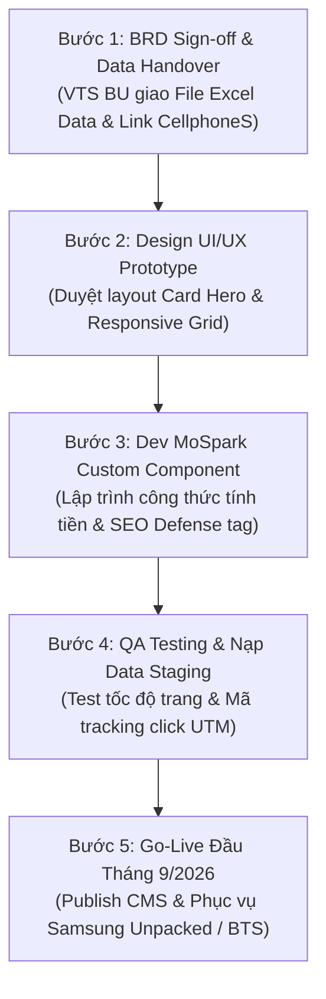

# BRD: Ví Trả Sau (BNPL)

> - **Project:** Use Case Ví Trả Sau - Web Growth & Media SEO/GEO
> - **Main URL:** momo.vn/vi-tra-sau
> - **Division:** FS (Financial Services) - PayLater
> - **Version:** 2.0 · Tháng 7/2026
> - **Status:** Active (Updated Media Team Plan)

---

> **Problem:** Hàng triệu người search "trả góp", "nợ xấu mua được không", "mua trước trả sau" mỗi tháng - nhưng không có trang VTS nào xuất hiện khi họ tìm. 485K SV/tháng adjacent intent đang chảy về Home Credit và ZaloPay trong khi VTS là giải pháp phù hợp nhất: không check CIC, duyệt 3 phút, hạn mức đến 20 triệu.
> **KPI Owned:** Activated VTS Users from Web (user lần đầu kích hoạt VTS có nguồn gốc từ organic momo.vn, trong 7 ngày kể từ lần đầu visit)
> **Conversion Flow:** Search "trả góp CMND" / "nạp game hết tiền" / "nợ xấu mua được không" → /vi-tra-sau/{slug} → Hiểu VTS + CTA → App MoMo → VTS Activation → Transaction

---

## 1. Executive Summary

### 1.1 Elegant Problem Framing
- **Vấn đề cốt lõi:** Người dùng có nhu cầu mua sắm/trả góp khẩn cấp nhưng bị ngân hàng từ chối vì nợ xấu hoặc thủ tục rườm rà. Họ search Google tìm giải pháp nhưng VTS (dù duyệt 3 phút, không check CIC) lại hoàn toàn "vô hình" trên Search.
- **Giải pháp (The "What"):** Biến Web thành kênh "Cứu cánh tài chính 1 chạm". Cung cấp công cụ giả lập trả góp trực quan và chặn đầu (intercept) mọi từ khóa ngách để dắt user tải App kích hoạt VTS ngay lập tức.

### 1.2 Situation
Người search "mua điện thoại trả góp chỉ cần CMND", "nợ xấu có mua được không", "nạp game hết tiền" - đây là nhóm đã có intent mua, cần credit, đang bị loại trừ bởi hệ thống ngân hàng truyền thống. VTS là đúng sản phẩm cho họ. Nhưng khi họ search, trang `/vi-tra-sau` không xuất hiện. Hub page có 1,56M impressions/tháng nhưng CTR CTA chỉ 7,25%.
*   **Thách thức từ Town Hall Q2/2026 (23/06/2026):** Ban lãnh đạo ghi nhận nhiều phòng ban kinh doanh (BU) chưa đạt mục tiêu về MAU và tỷ lệ người dùng Ví Trả Sau theo KPI đã đề ra. Do đó, Web Growth thông qua tối ưu hóa SEO và W2A conversion đóng vai trò cực kỳ quan trọng làm phễu kéo tệp khách hàng ngoài app nhằm giải quyết bài toán tăng trưởng MAU và kích hoạt Ví Trả Sau.

### 1.3 Complication
Core market "Trả Sau" chỉ có 135K SV/tháng và VTS đã chiếm 54% SOV - growth room trong core market hạn chế. Adjacent market (Trả Góp: 200K SV; Tín Dụng: 700K SV) tổng ~900K SV/tháng là pool intent lớn nhưng SOV VTS tại đó chỉ 10-40%.

### 1.4 Resolution
Build sub-pages use-case và **PLG Interactive Tool** để intercept adjacent intent; revamp hub `/vi-tra-sau` để tăng W2A CVR từ 7% lên 20%; scale blog 20-30 bài targeting Trả Góp + Tín Dụng clusters; tối ưu GEO/AEO `llms.txt` để maintain TOM. Product drives activation - user tìm thấy đúng lúc cần, hiểu trong 30 giây, kích hoạt ngay.

---

## 2. Bối Cảnh Hiện Tại

### 2.1 Hiện trạng Web Assets

<table style="width:100%; border-collapse:collapse; border:1.5px solid #64748b; margin:1em 0; font-size:0.9em;">
  <thead>
    <tr style="background-color:#f1f5f9;">
      <th style="border:1.5px solid #64748b; padding:8px 12px; text-align:left; font-weight:700;">Asset</th>
      <th style="border:1.5px solid #64748b; padding:8px 12px; text-align:left; font-weight:700;">URL</th>
      <th style="border:1.5px solid #64748b; padding:8px 12px; text-align:left; font-weight:700;">Trạng thái</th>
      <th style="border:1.5px solid #64748b; padding:8px 12px; text-align:left; font-weight:700;">Ghi chú</th>
    </tr>
  </thead>
  <tbody>
    <tr>
      <td style="border:1px solid #94a3b8; padding:8px 12px; text-align:left;">Hub page</td>
      <td style="border:1px solid #94a3b8; padding:8px 12px; text-align:left;">/vi-tra-sau</td>
      <td style="border:1px solid #94a3b8; padding:8px 12px; text-align:left;">Live, cần revamp</td>
      <td style="border:1px solid #94a3b8; padding:8px 12px; text-align:left;">CTR CTA ~7,25%, scroll depth yếu trên mobile</td>
    </tr>
    <tr style="background-color:#f8fafc;">
      <td style="border:1px solid #94a3b8; padding:8px 12px; text-align:left;">Blog VTS</td>
      <td style="border:1px solid #94a3b8; padding:8px 12px; text-align:left;">/blog/vi-tra-sau-*</td>
      <td style="border:1px solid #94a3b8; padding:8px 12px; text-align:left;">Live, có traffic cao</td>
      <td style="border:1px solid #94a3b8; padding:8px 12px; text-align:left;">Top page: 128K clicks. Cần update + GEO layer</td>
    </tr>
    <tr>
      <td style="border:1px solid #94a3b8; padding:8px 12px; text-align:left;">FAQ / Hỏi đáp</td>
      <td style="border:1px solid #94a3b8; padding:8px 12px; text-align:left;">/hoi-dap/dieu-kien-dieu-khoan-su-dung-vi-tra-sau</td>
      <td style="border:1px solid #94a3b8; padding:8px 12px; text-align:left;">Live</td>
      <td style="border:1px solid #94a3b8; padding:8px 12px; text-align:left;">16K clicks, avg pos 4.78</td>
    </tr>
    <tr style="background-color:#f8fafc;">
      <td style="border:1px solid #94a3b8; padding:8px 12px; text-align:left;">Sub-pages use-case</td>
      <td style="border:1px solid #94a3b8; padding:8px 12px; text-align:left;">/vi-tra-sau/nap-game, /tra-gop, /mua-sam, ...</td>
      <td style="border:1px solid #94a3b8; padding:8px 12px; text-align:left;">Chưa build</td>
      <td style="border:1px solid #94a3b8; padding:8px 12px; text-align:left;">P1 deliverable H1 2026</td>
    </tr>
    <tr>
      <td style="border:1px solid #94a3b8; padding:8px 12px; text-align:left;">Merchant pages</td>
      <td style="border:1px solid #94a3b8; padding:8px 12px; text-align:left;">/doi-tac/{brand}</td>
      <td style="border:1px solid #94a3b8; padding:8px 12px; text-align:left;">Đang triển khai</td>
      <td style="border:1px solid #94a3b8; padding:8px 12px; text-align:left;">Cross-sell VTS</td>
    </tr>
    <tr style="background-color:#f8fafc;">
      <td style="border:1px solid #94a3b8; padding:8px 12px; text-align:left;">Microsite Trả Góp</td>
      <td style="border:1px solid #94a3b8; padding:8px 12px; text-align:left;">TBD</td>
      <td style="border:1px solid #94a3b8; padding:8px 12px; text-align:left;">Chưa build</td>
      <td style="border:1px solid #94a3b8; padding:8px 12px; text-align:left;">Simulator + CIC cross-sell</td>
    </tr>
  </tbody>
</table>

### 2.2 Baseline Performance (GSC Historical)

<table style="width:100%; border-collapse:collapse; border:1.5px solid #64748b; margin:1em 0; font-size:0.9em;">
  <thead>
    <tr style="background-color:#f1f5f9;">
      <th style="border:1.5px solid #64748b; padding:8px 12px; text-align:left; font-weight:700;">Trang</th>
      <th style="border:1.5px solid #64748b; padding:8px 12px; text-align:left; font-weight:700;">Clicks</th>
      <th style="border:1.5px solid #64748b; padding:8px 12px; text-align:left; font-weight:700;">Impressions</th>
      <th style="border:1.5px solid #64748b; padding:8px 12px; text-align:left; font-weight:700;">CTR</th>
      <th style="border:1.5px solid #64748b; padding:8px 12px; text-align:left; font-weight:700;">Avg Pos</th>
    </tr>
  </thead>
  <tbody>
    <tr>
      <td style="border:1px solid #94a3b8; padding:8px 12px; text-align:left;">/vi-tra-sau (hub)</td>
      <td style="border:1px solid #94a3b8; padding:8px 12px; text-align:left;">108.879</td>
      <td style="border:1px solid #94a3b8; padding:8px 12px; text-align:left;">1.564.515</td>
      <td style="border:1px solid #94a3b8; padding:8px 12px; text-align:left;">6,96%</td>
      <td style="border:1px solid #94a3b8; padding:8px 12px; text-align:left;">7,85</td>
    </tr>
    <tr style="background-color:#f8fafc;">
      <td style="border:1px solid #94a3b8; padding:8px 12px; text-align:left;">/blog/vi-tra-sau-momo-thanh-toan-duoc-nhung-dich-vu-gi</td>
      <td style="border:1px solid #94a3b8; padding:8px 12px; text-align:left;">128.467</td>
      <td style="border:1px solid #94a3b8; padding:8px 12px; text-align:left;">736.479</td>
      <td style="border:1px solid #94a3b8; padding:8px 12px; text-align:left;">17,44%</td>
      <td style="border:1px solid #94a3b8; padding:8px 12px; text-align:left;">9,35</td>
    </tr>
    <tr>
      <td style="border:1px solid #94a3b8; padding:8px 12px; text-align:left;">/blog/cham-thanh-toan-vi-tra-sau</td>
      <td style="border:1px solid #94a3b8; padding:8px 12px; text-align:left;">57.724</td>
      <td style="border:1px solid #94a3b8; padding:8px 12px; text-align:left;">379.561</td>
      <td style="border:1px solid #94a3b8; padding:8px 12px; text-align:left;">15,21%</td>
      <td style="border:1px solid #94a3b8; padding:8px 12px; text-align:left;">4,41</td>
    </tr>
    <tr style="background-color:#f8fafc;">
      <td style="border:1px solid #94a3b8; padding:8px 12px; text-align:left;">/blog/rut-tien-tu-vi-tra-sau-momo</td>
      <td style="border:1px solid #94a3b8; padding:8px 12px; text-align:left;">57.420</td>
      <td style="border:1px solid #94a3b8; padding:8px 12px; text-align:left;">485.753</td>
      <td style="border:1px solid #94a3b8; padding:8px 12px; text-align:left;">11,82%</td>
      <td style="border:1px solid #94a3b8; padding:8px 12px; text-align:left;">3,46</td>
    </tr>
    <tr>
      <td style="border:1px solid #94a3b8; padding:8px 12px; text-align:left;">/uu-dai-vi-tra-sau</td>
      <td style="border:1px solid #94a3b8; padding:8px 12px; text-align:left;">943</td>
      <td style="border:1px solid #94a3b8; padding:8px 12px; text-align:left;">439.290</td>
      <td style="border:1px solid #94a3b8; padding:8px 12px; text-align:left;">0,21%</td>
      <td style="border:1px solid #94a3b8; padding:8px 12px; text-align:left;">6,06</td>
    </tr>
  </tbody>
</table>

**Nhận xét:** Hub page có impressions rất cao (1,56M) nhưng CTR thấp (6,96%) và avg position 7,85 - dư địa lớn để cải thiện content relevance + title/description. Trang /uu-dai-vi-tra-sau có 439K impressions nhưng CTR cực thấp (0,21%) - cần xem lại intent alignment.

### 2.3 Market Size & SOV Baseline

<table style="width:100%; border-collapse:collapse; border:1.5px solid #64748b; margin:1em 0; font-size:0.9em;">
  <thead>
    <tr style="background-color:#f1f5f9;">
      <th style="border:1.5px solid #64748b; padding:8px 12px; text-align:left; font-weight:700;">Thị trường</th>
      <th style="border:1.5px solid #64748b; padding:8px 12px; text-align:left; font-weight:700;">TAM (SV/tháng)</th>
      <th style="border:1.5px solid #64748b; padding:8px 12px; text-align:left; font-weight:700;">Target Market</th>
      <th style="border:1.5px solid #64748b; padding:8px 12px; text-align:left; font-weight:700;">SOV Hiện tại</th>
      <th style="border:1.5px solid #64748b; padding:8px 12px; text-align:left; font-weight:700;">SOV Mục tiêu</th>
    </tr>
  </thead>
  <tbody>
    <tr>
      <td style="border:1px solid #94a3b8; padding:8px 12px; text-align:left;">Trả Sau</td>
      <td style="border:1px solid #94a3b8; padding:8px 12px; text-align:left;">180.000</td>
      <td style="border:1px solid #94a3b8; padding:8px 12px; text-align:left;">131.580 (73% TAM)</td>
      <td style="border:1px solid #94a3b8; padding:8px 12px; text-align:left;">~54%</td>
      <td style="border:1px solid #94a3b8; padding:8px 12px; text-align:left;">Maintain 70%</td>
    </tr>
    <tr style="background-color:#f8fafc;">
      <td style="border:1px solid #94a3b8; padding:8px 12px; text-align:left;">Trả Góp</td>
      <td style="border:1px solid #94a3b8; padding:8px 12px; text-align:left;">200.000</td>
      <td style="border:1px solid #94a3b8; padding:8px 12px; text-align:left;">81.150 (40% TAM)</td>
      <td style="border:1px solid #94a3b8; padding:8px 12px; text-align:left;">~10%</td>
      <td style="border:1px solid #94a3b8; padding:8px 12px; text-align:left;">40%</td>
    </tr>
    <tr>
      <td style="border:1px solid #94a3b8; padding:8px 12px; text-align:left;">Tín Dụng</td>
      <td style="border:1px solid #94a3b8; padding:8px 12px; text-align:left;">700.000</td>
      <td style="border:1px solid #94a3b8; padding:8px 12px; text-align:left;">630.000 (90% TAM)</td>
      <td style="border:1px solid #94a3b8; padding:8px 12px; text-align:left;">~40%</td>
      <td style="border:1px solid #94a3b8; padding:8px 12px; text-align:left;">60%</td>
    </tr>
  </tbody>
</table>

*SOV Trả Sau ~54% = brand SoV đã verify (MoMo chiếm 54% brand search cluster). Nguồn: Keyword Research T5/2026.*

### 2.4 Web-to-App Conversion Baseline

<table style="width:100%; border-collapse:collapse; border:1.5px solid #64748b; margin:1em 0; font-size:0.9em;">
  <thead>
    <tr style="background-color:#f1f5f9;">
      <th style="border:1.5px solid #64748b; padding:8px 12px; text-align:left; font-weight:700;">Funnel step</th>
      <th style="border:1.5px solid #64748b; padding:8px 12px; text-align:left; font-weight:700;">Metric</th>
      <th style="border:1.5px solid #64748b; padding:8px 12px; text-align:left; font-weight:700;">Baseline</th>
    </tr>
  </thead>
  <tbody>
    <tr>
      <td style="border:1px solid #94a3b8; padding:8px 12px; text-align:left;">CTR tới CTA (hub page)</td>
      <td style="border:1px solid #94a3b8; padding:8px 12px; text-align:left;">% sessions click CTA</td>
      <td style="border:1px solid #94a3b8; padding:8px 12px; text-align:left;">~7,25%</td>
    </tr>
    <tr style="background-color:#f8fafc;">
      <td style="border:1px solid #94a3b8; padding:8px 12px; text-align:left;">Tỷ lệ scroll đến CTA block (mobile)</td>
      <td style="border:1px solid #94a3b8; padding:8px 12px; text-align:left;">% user reach CTA block</td>
      <td style="border:1px solid #94a3b8; padding:8px 12px; text-align:left;">~75-80% reach block, chưa click</td>
    </tr>
    <tr>
      <td style="border:1px solid #94a3b8; padding:8px 12px; text-align:left;">W2A CVR (end-to-end)</td>
      <td style="border:1px solid #94a3b8; padding:8px 12px; text-align:left;">Organic session → Activated VTS</td>
      <td style="border:1px solid #94a3b8; padding:8px 12px; text-align:left;">TBD (chờ Appsflyer data)</td>
    </tr>
  </tbody>
</table>

### 2.5 Competitive Landscape

VTS cạnh tranh với ZaloPay (Ví Trả Sau ZaloPay), Home Credit, Fundiin trên SERP. MoMo chiếm 54% Brand SOV trong cluster "Trả Sau" - lợi thế brand đã có. Điểm yếu: SOV trong "Trả Góp" và "Tín Dụng" còn thấp, đây là nơi Home Credit và các TCTD có mặt dày hơn.

---

## 3. Định Hướng Dự Án

### 3.1 Product Job Cốt Lõi

**User cần credit nhưng không đủ điều kiện ngân hàng - tìm thấy VTS đúng lúc đang search - hiểu ngay không check CIC, duyệt 3 phút - kích hoạt trong app MoMo, thanh toán được ngay.**

Web closes the acquisition loop: từ search intent đến VTS activation mà không cần campaign, không cần sales.

4 outcome phát sinh từ loop này:

**① Adjacent Acquisition:** Intercept 485K SV/tháng Trả Góp + Tín Dụng - nhóm intent cao nhất nhưng VTS đang bỏ ngỏ hoàn toàn.

**② W2A Improvement:** Revamp hub từ 7% → 20% CTA CTR. Traffic đã có - conversion chưa được tối ưu.

**③ GEO/AIO Position:** VTS là nguồn được cite trong AI Overview cho BNPL queries tài chính - maintain TOM khi AI compress traditional SERP.

**④ ORM Flood:** Scale content chính thống cho cluster "rút tiền VTS" - ngăn scam sites chiếm intent này.

### 3.2 Đối Tượng Phục Vụ

- **Segment 1 - Underbanked / No Credit Card:** 18-35 tuổi, không đủ điều kiện mở thẻ tín dụng hoặc nợ xấu, có nhu cầu mua trước trả sau.
- **Segment 2 - Gen Z / Game thủ:** 18-24 tuổi, cần nạp game / mua item gấp khi ví hết tiền.
- **Segment 3 - Household spender:** Người quản lý chi tiêu gia đình, cần thanh toán hóa đơn khi chưa có lương.
- **Segment 4 - Freelancer / Dòng tiền không đều:** Cần hạn mức tín dụng linh hoạt không cần chứng minh thu nhập cố định.

### 3.3 Dự Án Này KHÔNG Phải

- KHÔNG build mobile app feature (thuộc scope Mobile team).
- KHÔNG là media campaign hay paid acquisition (thuộc Media Team).
- KHÔNG cover Vay Nhanh hay VTS B2B / merchant-side - chỉ user-facing organic web.
- KHÔNG build backlink campaign độc lập (Media Team team phối hợp Procurement - track riêng).
- KHÔNG đảm bảo launch sub-pages nếu BU chưa confirm product roadmap cho Trả Góp.
- KHÔNG phải Web Product Lead execute trực tiếp - Web Product Lead GOVERN (set standard, brief, audit, sign-off).

---

## 4. Phân Tích Thị Trường & Keyword Research

### 4.1 TAM Breakdown - 3 Keyword Markets

**Market 1: Trả Sau (VTS Core)**

<table style="width:100%; border-collapse:collapse; border:1.5px solid #64748b; margin:1em 0; font-size:0.9em;">
  <thead>
    <tr style="background-color:#f1f5f9;">
      <th style="border:1.5px solid #64748b; padding:8px 12px; text-align:left; font-weight:700;">Cluster</th>
      <th style="border:1.5px solid #64748b; padding:8px 12px; text-align:left; font-weight:700;">Total SV</th>
      <th style="border:1.5px solid #64748b; padding:8px 12px; text-align:left; font-weight:700;">Ghi chú</th>
    </tr>
  </thead>
  <tbody>
    <tr>
      <td style="border:1px solid #94a3b8; padding:8px 12px; text-align:left;">Ví Trả Sau (branded)</td>
      <td style="border:1px solid #94a3b8; padding:8px 12px; text-align:left;">12.100</td>
      <td style="border:1px solid #94a3b8; padding:8px 12px; text-align:left;">Core brand cluster</td>
    </tr>
    <tr style="background-color:#f8fafc;">
      <td style="border:1px solid #94a3b8; padding:8px 12px; text-align:left;">Kích hoạt / Kiểm tra VTS</td>
      <td style="border:1px solid #94a3b8; padding:8px 12px; text-align:left;">810</td>
      <td style="border:1px solid #94a3b8; padding:8px 12px; text-align:left;">High-intent BOFU</td>
    </tr>
    <tr>
      <td style="border:1px solid #94a3b8; padding:8px 12px; text-align:left;">Rút tiền VTS (negative search)</td>
      <td style="border:1px solid #94a3b8; padding:8px 12px; text-align:left;">6.600</td>
      <td style="border:1px solid #94a3b8; padding:8px 12px; text-align:left;">ORM priority</td>
    </tr>
    <tr style="background-color:#f8fafc;">
      <td style="border:1px solid #94a3b8; padding:8px 12px; text-align:left;">Trả trước trả sau là gì</td>
      <td style="border:1px solid #94a3b8; padding:8px 12px; text-align:left;">450</td>
      <td style="border:1px solid #94a3b8; padding:8px 12px; text-align:left;">Education TOFU</td>
    </tr>
    <tr>
      <td style="border:1px solid #94a3b8; padding:8px 12px; text-align:left;"><strong>Total addressable</strong></td>
      <td style="border:1px solid #94a3b8; padding:8px 12px; text-align:left;"><strong>~135.290</strong></td>
      <td style="border:1px solid #94a3b8; padding:8px 12px; text-align:left;"></td>
    </tr>
  </tbody>
</table>

**Market 2: Trả Góp (Adjacent - intercept)**

<table style="width:100%; border-collapse:collapse; border:1.5px solid #64748b; margin:1em 0; font-size:0.9em;">
  <thead>
    <tr style="background-color:#f1f5f9;">
      <th style="border:1.5px solid #64748b; padding:8px 12px; text-align:left; font-weight:700;">Cluster</th>
      <th style="border:1.5px solid #64748b; padding:8px 12px; text-align:left; font-weight:700;">Total SV</th>
      <th style="border:1.5px solid #64748b; padding:8px 12px; text-align:left; font-weight:700;">Intent</th>
      <th style="border:1.5px solid #64748b; padding:8px 12px; text-align:left; font-weight:700;">Ghi chú</th>
    </tr>
  </thead>
  <tbody>
    <tr>
      <td style="border:1px solid #94a3b8; padding:8px 12px; text-align:left;">Nợ xấu có mua trả góp được không</td>
      <td style="border:1px solid #94a3b8; padding:8px 12px; text-align:left;">2.680</td>
      <td style="border:1px solid #94a3b8; padding:8px 12px; text-align:left;">MOFU</td>
      <td style="border:1px solid #94a3b8; padding:8px 12px; text-align:left;">VTS = giải pháp không check CIC</td>
    </tr>
    <tr style="background-color:#f8fafc;">
      <td style="border:1px solid #94a3b8; padding:8px 12px; text-align:left;">Mua điện thoại trả góp chỉ cần CMND</td>
      <td style="border:1px solid #94a3b8; padding:8px 12px; text-align:left;">1.380</td>
      <td style="border:1px solid #94a3b8; padding:8px 12px; text-align:left;">BOFU</td>
      <td style="border:1px solid #94a3b8; padding:8px 12px; text-align:left;">VTS thay thế</td>
    </tr>
    <tr>
      <td style="border:1px solid #94a3b8; padding:8px 12px; text-align:left;">Phí chuyển đổi trả góp</td>
      <td style="border:1px solid #94a3b8; padding:8px 12px; text-align:left;">3.590</td>
      <td style="border:1px solid #94a3b8; padding:8px 12px; text-align:left;">MOFU</td>
      <td style="border:1px solid #94a3b8; padding:8px 12px; text-align:left;">So sánh phí VTS vs thẻ</td>
    </tr>
    <tr style="background-color:#f8fafc;">
      <td style="border:1px solid #94a3b8; padding:8px 12px; text-align:left;">Mua điện thoại trả góp online trả trước 0 đồng</td>
      <td style="border:1px solid #94a3b8; padding:8px 12px; text-align:left;">720</td>
      <td style="border:1px solid #94a3b8; padding:8px 12px; text-align:left;">BOFU</td>
      <td style="border:1px solid #94a3b8; padding:8px 12px; text-align:left;"></td>
    </tr>
    <tr>
      <td style="border:1px solid #94a3b8; padding:8px 12px; text-align:left;">Trả góp VF3/VF5 (xe điện)</td>
      <td style="border:1px solid #94a3b8; padding:8px 12px; text-align:left;">2.300+</td>
      <td style="border:1px solid #94a3b8; padding:8px 12px; text-align:left;">BOFU</td>
      <td style="border:1px solid #94a3b8; padding:8px 12px; text-align:left;"></td>
    </tr>
    <tr style="background-color:#f8fafc;">
      <td style="border:1px solid #94a3b8; padding:8px 12px; text-align:left;"><strong>Total addressable</strong></td>
      <td style="border:1px solid #94a3b8; padding:8px 12px; text-align:left;"><strong>~198.560</strong></td>
      <td style="border:1px solid #94a3b8; padding:8px 12px; text-align:left;"></td>
      <td style="border:1px solid #94a3b8; padding:8px 12px; text-align:left;"></td>
    </tr>
  </tbody>
</table>

**Market 3: Tín Dụng (Pain-point intercept)**

<table style="width:100%; border-collapse:collapse; border:1.5px solid #64748b; margin:1em 0; font-size:0.9em;">
  <thead>
    <tr style="background-color:#f1f5f9;">
      <th style="border:1.5px solid #64748b; padding:8px 12px; text-align:left; font-weight:700;">Cluster</th>
      <th style="border:1.5px solid #64748b; padding:8px 12px; text-align:left; font-weight:700;">Total SV</th>
      <th style="border:1.5px solid #64748b; padding:8px 12px; text-align:left; font-weight:700;">Intent</th>
      <th style="border:1.5px solid #64748b; padding:8px 12px; text-align:left; font-weight:700;">Ghi chú</th>
    </tr>
  </thead>
  <tbody>
    <tr>
      <td style="border:1px solid #94a3b8; padding:8px 12px; text-align:left;">Dịch vụ rút tiền thẻ tín dụng</td>
      <td style="border:1px solid #94a3b8; padding:8px 12px; text-align:left;">3.600</td>
      <td style="border:1px solid #94a3b8; padding:8px 12px; text-align:left;">Commercial</td>
      <td style="border:1px solid #94a3b8; padding:8px 12px; text-align:left;">Pain-point → VTS</td>
    </tr>
    <tr style="background-color:#f8fafc;">
      <td style="border:1px solid #94a3b8; padding:8px 12px; text-align:left;">Rút tiền thẻ tín dụng VPBank</td>
      <td style="border:1px solid #94a3b8; padding:8px 12px; text-align:left;">1.600</td>
      <td style="border:1px solid #94a3b8; padding:8px 12px; text-align:left;">Commercial</td>
      <td style="border:1px solid #94a3b8; padding:8px 12px; text-align:left;"></td>
    </tr>
    <tr>
      <td style="border:1px solid #94a3b8; padding:8px 12px; text-align:left;">Phí thường niên thẻ tín dụng</td>
      <td style="border:1px solid #94a3b8; padding:8px 12px; text-align:left;">590</td>
      <td style="border:1px solid #94a3b8; padding:8px 12px; text-align:left;">Info/Compare</td>
      <td style="border:1px solid #94a3b8; padding:8px 12px; text-align:left;"></td>
    </tr>
    <tr style="background-color:#f8fafc;">
      <td style="border:1px solid #94a3b8; padding:8px 12px; text-align:left;">Thẻ ATM là thẻ tín dụng hay ghi nợ</td>
      <td style="border:1px solid #94a3b8; padding:8px 12px; text-align:left;">320</td>
      <td style="border:1px solid #94a3b8; padding:8px 12px; text-align:left;">Info/TOFU</td>
      <td style="border:1px solid #94a3b8; padding:8px 12px; text-align:left;"></td>
    </tr>
    <tr>
      <td style="border:1px solid #94a3b8; padding:8px 12px; text-align:left;"><strong>Total addressable</strong></td>
      <td style="border:1px solid #94a3b8; padding:8px 12px; text-align:left;"><strong>~681.760</strong></td>
      <td style="border:1px solid #94a3b8; padding:8px 12px; text-align:left;"></td>
      <td style="border:1px solid #94a3b8; padding:8px 12px; text-align:left;"></td>
    </tr>
  </tbody>
</table>

### 4.2 Opportunity Map - Keyword Cluster → URL

<table style="width:100%; border-collapse:collapse; border:1.5px solid #64748b; margin:1em 0; font-size:0.9em;">
  <thead>
    <tr style="background-color:#f1f5f9;">
      <th style="border:1.5px solid #64748b; padding:8px 12px; text-align:left; font-weight:700;">Cluster</th>
      <th style="border:1.5px solid #64748b; padding:8px 12px; text-align:left; font-weight:700;">SV/tháng</th>
      <th style="border:1.5px solid #64748b; padding:8px 12px; text-align:left; font-weight:700;">Intent</th>
      <th style="border:1.5px solid #64748b; padding:8px 12px; text-align:left; font-weight:700;">Target URL</th>
      <th style="border:1.5px solid #64748b; padding:8px 12px; text-align:left; font-weight:700;">Content angle</th>
    </tr>
  </thead>
  <tbody>
    <tr>
      <td style="border:1px solid #94a3b8; padding:8px 12px; text-align:left;">Kích hoạt / kiểm tra VTS</td>
      <td style="border:1px solid #94a3b8; padding:8px 12px; text-align:left;">810</td>
      <td style="border:1px solid #94a3b8; padding:8px 12px; text-align:left;">Nav/BOFU</td>
      <td style="border:1px solid #94a3b8; padding:8px 12px; text-align:left;">/vi-tra-sau</td>
      <td style="border:1px solid #94a3b8; padding:8px 12px; text-align:left;">Hướng dẫn kích hoạt từng bước</td>
    </tr>
    <tr style="background-color:#f8fafc;">
      <td style="border:1px solid #94a3b8; padding:8px 12px; text-align:left;">Điện thoại trả góp chỉ cần CMND</td>
      <td style="border:1px solid #94a3b8; padding:8px 12px; text-align:left;">1.380</td>
      <td style="border:1px solid #94a3b8; padding:8px 12px; text-align:left;">Trans/BOFU</td>
      <td style="border:1px solid #94a3b8; padding:8px 12px; text-align:left;">/vi-tra-sau/mua-dien-thoai</td>
      <td style="border:1px solid #94a3b8; padding:8px 12px; text-align:left;">VTS = giải pháp, không cần thẻ ngân hàng</td>
    </tr>
    <tr>
      <td style="border:1px solid #94a3b8; padding:8px 12px; text-align:left;">Nợ xấu có mua trả góp được không</td>
      <td style="border:1px solid #94a3b8; padding:8px 12px; text-align:left;">2.680</td>
      <td style="border:1px solid #94a3b8; padding:8px 12px; text-align:left;">Info/MOFU</td>
      <td style="border:1px solid #94a3b8; padding:8px 12px; text-align:left;">/vi-tra-sau/mua-dien-thoai</td>
      <td style="border:1px solid #94a3b8; padding:8px 12px; text-align:left;">VTS không check CIC - giải pháp khi nợ xấu</td>
    </tr>
    <tr style="background-color:#f8fafc;">
      <td style="border:1px solid #94a3b8; padding:8px 12px; text-align:left;">Phí chuyển đổi trả góp</td>
      <td style="border:1px solid #94a3b8; padding:8px 12px; text-align:left;">3.590</td>
      <td style="border:1px solid #94a3b8; padding:8px 12px; text-align:left;">Info/MOFU</td>
      <td style="border:1px solid #94a3b8; padding:8px 12px; text-align:left;">/vi-tra-sau (hub) + Blog</td>
      <td style="border:1px solid #94a3b8; padding:8px 12px; text-align:left;">So sánh phí 3% VTS vs phí chuyển đổi thẻ</td>
    </tr>
    <tr>
      <td style="border:1px solid #94a3b8; padding:8px 12px; text-align:left;">Trả góp qua thẻ tín dụng</td>
      <td style="border:1px solid #94a3b8; padding:8px 12px; text-align:left;">4.860</td>
      <td style="border:1px solid #94a3b8; padding:8px 12px; text-align:left;">Compare/MOFU</td>
      <td style="border:1px solid #94a3b8; padding:8px 12px; text-align:left;">/vi-tra-sau (hub) + Blog</td>
      <td style="border:1px solid #94a3b8; padding:8px 12px; text-align:left;">VTS vs trả góp thẻ: không cần thủ tục</td>
    </tr>
    <tr style="background-color:#f8fafc;">
      <td style="border:1px solid #94a3b8; padding:8px 12px; text-align:left;">Phí thường niên / phí rút thẻ</td>
      <td style="border:1px solid #94a3b8; padding:8px 12px; text-align:left;">7.760</td>
      <td style="border:1px solid #94a3b8; padding:8px 12px; text-align:left;">Info/TOFU</td>
      <td style="border:1px solid #94a3b8; padding:8px 12px; text-align:left;">Blog MOFU</td>
      <td style="border:1px solid #94a3b8; padding:8px 12px; text-align:left;">Pain point thẻ → giới thiệu VTS</td>
    </tr>
    <tr>
      <td style="border:1px solid #94a3b8; padding:8px 12px; text-align:left;">Rút tiền VTS (ORM cluster)</td>
      <td style="border:1px solid #94a3b8; padding:8px 12px; text-align:left;">6.600</td>
      <td style="border:1px solid #94a3b8; padding:8px 12px; text-align:left;">Nav/Transact</td>
      <td style="border:1px solid #94a3b8; padding:8px 12px; text-align:left;">Blog ORM</td>
      <td style="border:1px solid #94a3b8; padding:8px 12px; text-align:left;">Cảnh báo, educate, driven traffic đúng</td>
    </tr>
    <tr style="background-color:#f8fafc;">
      <td style="border:1px solid #94a3b8; padding:8px 12px; text-align:left;">Mua thẻ game trả sau</td>
      <td style="border:1px solid #94a3b8; padding:8px 12px; text-align:left;">TBD</td>
      <td style="border:1px solid #94a3b8; padding:8px 12px; text-align:left;">Trans/BOFU</td>
      <td style="border:1px solid #94a3b8; padding:8px 12px; text-align:left;">/vi-tra-sau/mua-the-game</td>
      <td style="border:1px solid #94a3b8; padding:8px 12px; text-align:left;">"Hết tiền? Nạp ngay, trả sau"</td>
    </tr>
    <tr>
      <td style="border:1px solid #94a3b8; padding:8px 12px; text-align:left;">Thanh toán hóa đơn điện nước trả sau</td>
      <td style="border:1px solid #94a3b8; padding:8px 12px; text-align:left;">TBD</td>
      <td style="border:1px solid #94a3b8; padding:8px 12px; text-align:left;">Trans/BOFU</td>
      <td style="border:1px solid #94a3b8; padding:8px 12px; text-align:left;">/vi-tra-sau/thanh-toan-hoa-don</td>
      <td style="border:1px solid #94a3b8; padding:8px 12px; text-align:left;">"Chưa có lương, trả sau được"</td>
    </tr>
    <tr style="background-color:#f8fafc;">
      <td style="border:1px solid #94a3b8; padding:8px 12px; text-align:left;">Mua vé máy bay trả sau</td>
      <td style="border:1px solid #94a3b8; padding:8px 12px; text-align:left;">TBD</td>
      <td style="border:1px solid #94a3b8; padding:8px 12px; text-align:left;">Trans/BOFU</td>
      <td style="border:1px solid #94a3b8; padding:8px 12px; text-align:left;">/vi-tra-sau/mua-ve-may-bay</td>
      <td style="border:1px solid #94a3b8; padding:8px 12px; text-align:left;">"Đặt vé ngay, trả sau"</td>
    </tr>
  </tbody>
</table>

---

## 5. JTBD Analysis

### Job #VTS-01 - Urgency Payment

*Search cluster:* "nạp game ví trả sau", "thanh toán điện trả sau momo" - ~1.500-3.000 SV/tháng (cluster gián tiếp)

> "Tôi cần thanh toán ngay bây giờ nhưng ví hết tiền, và tôi không muốn phải xin tiền ai hay bị gián đoạn việc đang làm."

<table style="width:100%; border-collapse:collapse; border:1.5px solid #64748b; margin:1em 0; font-size:0.9em;">
  <thead>
    <tr style="background-color:#f1f5f9;">
      <th style="border:1.5px solid #64748b; padding:8px 12px; text-align:left; font-weight:700;">Dimension</th>
      <th style="border:1.5px solid #64748b; padding:8px 12px; text-align:left; font-weight:700;">Nội dung</th>
    </tr>
  </thead>
  <tbody>
    <tr>
      <td style="border:1px solid #94a3b8; padding:8px 12px; text-align:left;">Functional</td>
      <td style="border:1px solid #94a3b8; padding:8px 12px; text-align:left;">Hoàn thành giao dịch (nạp game/điện/mua đồ) trong dưới 3 phút, không bị block</td>
    </tr>
    <tr style="background-color:#f8fafc;">
      <td style="border:1px solid #94a3b8; padding:8px 12px; text-align:left;">Emotional</td>
      <td style="border:1px solid #94a3b8; padding:8px 12px; text-align:left;">Không stress, không xấu hổ, tự giải quyết được vấn đề của mình</td>
    </tr>
    <tr>
      <td style="border:1px solid #94a3b8; padding:8px 12px; text-align:left;">Social</td>
      <td style="border:1px solid #94a3b8; padding:8px 12px; text-align:left;">Không ai biết mình hết tiền - giữ được hình ảnh tự chủ tài chính với bạn bè, team</td>
    </tr>
    <tr style="background-color:#f8fafc;">
      <td style="border:1px solid #94a3b8; padding:8px 12px; text-align:left;">Trigger</td>
      <td style="border:1px solid #94a3b8; padding:8px 12px; text-align:left;">Đang chơi game hết tiền - Hóa đơn điện đến hạn - Flash sale sắp hết giờ</td>
    </tr>
    <tr>
      <td style="border:1px solid #94a3b8; padding:8px 12px; text-align:left;">Search → App</td>
      <td style="border:1px solid #94a3b8; padding:8px 12px; text-align:left;">"nạp game hết tiền", "mua thẻ game ví trả sau", "thanh toán điện nước trả sau", "mua thẻ cào điện thoại" → /vi-tra-sau/mua-the-game / /vi-tra-sau/thanh-toan-hoa-don / /vi-tra-sau/nap-data / /vi-tra-sau/mua-the-cao-dien-thoai → CTA "Nạp ngay, trả sau" → App MoMo → VTS activation → Transaction hoàn thành</td>
    </tr>
  </tbody>
</table>

**Giải pháp:** /vi-tra-sau/mua-the-game (Garena, Zing, Valorant, Steam Wallet) - /vi-tra-sau/nap-data - /vi-tra-sau/thanh-toan-hoa-don - /vi-tra-sau/mua-the-cao-dien-thoai - CTA "Nạp ngay, trả sau" - Deeplink VTS activation.

---

### Job #VTS-02 - Access Credit

*Search cluster:* "nợ xấu có mua trả góp được không" (390 SV), "mua điện thoại trả góp chỉ cần CMND" (1.000 SV) - ~2.680+ SV/tháng

> "Tôi muốn có hạn mức tín dụng để mua đồ hoặc trả góp, nhưng tôi không đủ điều kiện mở thẻ tín dụng ngân hàng (nợ xấu / không có thu nhập cố định)."

<table style="width:100%; border-collapse:collapse; border:1.5px solid #64748b; margin:1em 0; font-size:0.9em;">
  <thead>
    <tr style="background-color:#f1f5f9;">
      <th style="border:1.5px solid #64748b; padding:8px 12px; text-align:left; font-weight:700;">Dimension</th>
      <th style="border:1.5px solid #64748b; padding:8px 12px; text-align:left; font-weight:700;">Nội dung</th>
    </tr>
  </thead>
  <tbody>
    <tr>
      <td style="border:1px solid #94a3b8; padding:8px 12px; text-align:left;">Functional</td>
      <td style="border:1px solid #94a3b8; padding:8px 12px; text-align:left;">Có hạn mức tín dụng mà không cần CIC, không cần chứng minh thu nhập</td>
    </tr>
    <tr style="background-color:#f8fafc;">
      <td style="border:1px solid #94a3b8; padding:8px 12px; text-align:left;">Emotional</td>
      <td style="border:1px solid #94a3b8; padding:8px 12px; text-align:left;">Cảm thấy được "công nhận" tài chính, không bị loại trừ khỏi hệ thống</td>
    </tr>
    <tr>
      <td style="border:1px solid #94a3b8; padding:8px 12px; text-align:left;">Social</td>
      <td style="border:1px solid #94a3b8; padding:8px 12px; text-align:left;">Trông như người có thẻ tín dụng - "mua trước trả sau" là modern, không phải yếu kém</td>
    </tr>
    <tr style="background-color:#f8fafc;">
      <td style="border:1px solid #94a3b8; padding:8px 12px; text-align:left;">Trigger</td>
      <td style="border:1px solid #94a3b8; padding:8px 12px; text-align:left;">Bị từ chối mở thẻ ngân hàng - Cần mua điện thoại nhưng nợ xấu</td>
    </tr>
    <tr>
      <td style="border:1px solid #94a3b8; padding:8px 12px; text-align:left;">Search → App</td>
      <td style="border:1px solid #94a3b8; padding:8px 12px; text-align:left;">"nợ xấu có mua trả góp được không", "mua điện thoại trả góp chỉ cần CMND", "mua hàng online không cần thẻ tín dụng" → /vi-tra-sau/mua-dien-thoai → Copy "Không check CIC, duyệt 3 phút" → App MoMo → VTS activation</td>
    </tr>
  </tbody>
</table>

**Giải pháp:** /vi-tra-sau/mua-dien-thoai (anchor use-case cho Underbanked) - /vi-tra-sau/thanh-toan-sieu-thi - Blog MOFU "nợ xấu + VTS" - Copy: "Không check CIC, duyệt trong 3 phút".

---

### Job #VTS-03 - Compare & Decide

*Search cluster:* "phí chuyển đổi trả góp" (3.590 SV), "trả góp qua thẻ tín dụng là gì" (4.860 SV) - ~9.000+ SV/tháng

> "Tôi đang cân nhắc giữa trả góp qua thẻ tín dụng và một giải pháp khác - tôi cần biết thực sự cái nào rẻ hơn và ít thủ tục hơn."

<table style="width:100%; border-collapse:collapse; border:1.5px solid #64748b; margin:1em 0; font-size:0.9em;">
  <thead>
    <tr style="background-color:#f1f5f9;">
      <th style="border:1.5px solid #64748b; padding:8px 12px; text-align:left; font-weight:700;">Dimension</th>
      <th style="border:1.5px solid #64748b; padding:8px 12px; text-align:left; font-weight:700;">Nội dung</th>
    </tr>
  </thead>
  <tbody>
    <tr>
      <td style="border:1px solid #94a3b8; padding:8px 12px; text-align:left;">Functional</td>
      <td style="border:1px solid #94a3b8; padding:8px 12px; text-align:left;">So sánh được phí/lãi/điều kiện giữa các giải pháp, ra quyết định nhanh</td>
    </tr>
    <tr style="background-color:#f8fafc;">
      <td style="border:1px solid #94a3b8; padding:8px 12px; text-align:left;">Emotional</td>
      <td style="border:1px solid #94a3b8; padding:8px 12px; text-align:left;">An tâm rằng mình đang chọn lựa thông minh, không bị lừa bởi "0% lãi suất" ẩn phí</td>
    </tr>
    <tr>
      <td style="border:1px solid #94a3b8; padding:8px 12px; text-align:left;">Social</td>
      <td style="border:1px solid #94a3b8; padding:8px 12px; text-align:left;">Là người tiêu dùng thông minh, biết quản lý tài chính - kể lại cho bạn bè "dùng VTS không mất phí thường niên"</td>
    </tr>
    <tr style="background-color:#f8fafc;">
      <td style="border:1px solid #94a3b8; padding:8px 12px; text-align:left;">Trigger</td>
      <td style="border:1px solid #94a3b8; padding:8px 12px; text-align:left;">Thấy quảng cáo "trả góp 0% lãi" nhưng nghi ngờ - Đang so sánh trước khi mua đồ lớn</td>
    </tr>
    <tr>
      <td style="border:1px solid #94a3b8; padding:8px 12px; text-align:left;">Search → App</td>
      <td style="border:1px solid #94a3b8; padding:8px 12px; text-align:left;">"phí chuyển đổi trả góp", "trả góp thẻ tín dụng phí bao nhiêu", "phí thường niên thẻ tín dụng" → /vi-tra-sau (hub - comparison section) / Blog so sánh → So sánh VTS vs thẻ + CTA → App MoMo → VTS activation</td>
    </tr>
  </tbody>
</table>

**Giải pháp:** /vi-tra-sau hub (comparison section) - /vi-tra-sau/mua-dien-thoai (highest ticket use-case) - Blog: "VTS vs thẻ tín dụng: so sánh thực tế".

---

### Job #VTS-04 - Negative Search / ORM

*Search cluster:* "rút ví trả sau MoMo" (6.600 SV), top blog "rút tiền từ ví trả sau MoMo" đạt 57.420 clicks

> "Tôi nghe nói có thể rút tiền mặt từ Ví Trả Sau, hoặc thấy quảng cáo đó - tôi muốn kiểm tra xem có thật không."

<table style="width:100%; border-collapse:collapse; border:1.5px solid #64748b; margin:1em 0; font-size:0.9em;">
  <thead>
    <tr style="background-color:#f1f5f9;">
      <th style="border:1.5px solid #64748b; padding:8px 12px; text-align:left; font-weight:700;">Dimension</th>
      <th style="border:1.5px solid #64748b; padding:8px 12px; text-align:left; font-weight:700;">Nội dung</th>
    </tr>
  </thead>
  <tbody>
    <tr>
      <td style="border:1px solid #94a3b8; padding:8px 12px; text-align:left;">Functional</td>
      <td style="border:1px solid #94a3b8; padding:8px 12px; text-align:left;">Tìm hiểu xem rút tiền VTS có được không, tránh bị lừa đảo</td>
    </tr>
    <tr style="background-color:#f8fafc;">
      <td style="border:1px solid #94a3b8; padding:8px 12px; text-align:left;">Emotional</td>
      <td style="border:1px solid #94a3b8; padding:8px 12px; text-align:left;">Lo ngại, không chắc - cần được reassure bởi nguồn chính thống của MoMo</td>
    </tr>
    <tr>
      <td style="border:1px solid #94a3b8; padding:8px 12px; text-align:left;">Social</td>
      <td style="border:1px solid #94a3b8; padding:8px 12px; text-align:left;">Bạn bè hỏi hoặc thấy người khác chia sẻ link "dịch vụ rút VTS" - muốn biết thật hay lừa trước khi forward</td>
    </tr>
    <tr style="background-color:#f8fafc;">
      <td style="border:1px solid #94a3b8; padding:8px 12px; text-align:left;">Trigger</td>
      <td style="border:1px solid #94a3b8; padding:8px 12px; text-align:left;">Thấy quảng cáo "dịch vụ rút tiền VTS" trên mạng - Bạn bè gửi link hỏi</td>
    </tr>
    <tr>
      <td style="border:1px solid #94a3b8; padding:8px 12px; text-align:left;">Search → App</td>
      <td style="border:1px solid #94a3b8; padding:8px 12px; text-align:left;">"rút tiền ví trả sau momo có được không", "dịch vụ rút ví trả sau" → Blog ORM "Sự thật + cảnh báo lừa đảo" → FAQ schema → Reassure + giới thiệu các use-case hợp lệ của VTS → App MoMo</td>
    </tr>
  </tbody>
</table>

**Giải pháp:** Blog ORM: "Rút tiền từ VTS có được không? - Sự thật + cảnh báo lừa đảo" - FAQ schema - AIO citation.

---

## 6. Kiến Trúc & Scope Build

### 6.1 URL Architecture VTS

<table style="width:100%; border-collapse:collapse; border:1.5px solid #64748b; margin:1em 0; font-size:0.9em;">
  <thead>
    <tr style="background-color:#f1f5f9;">
      <th style="border:1.5px solid #64748b; padding:8px 12px; text-align:left; font-weight:700;">URL</th>
      <th style="border:1.5px solid #64748b; padding:8px 12px; text-align:left; font-weight:700;">Content Type</th>
      <th style="border:1.5px solid #64748b; padding:8px 12px; text-align:left; font-weight:700;">Mục tiêu</th>
    </tr>
  </thead>
  <tbody>
    <tr>
      <td style="border:1px solid #94a3b8; padding:8px 12px; text-align:left;">/vi-tra-sau</td>
      <td style="border:1px solid #94a3b8; padding:8px 12px; text-align:left;">Hub - Pillar page</td>
      <td style="border:1px solid #94a3b8; padding:8px 12px; text-align:left;">Brand anchor, intercept tất cả jobs, comparison section</td>
    </tr>
    <tr style="background-color:#f8fafc;">
      <td style="border:1px solid #94a3b8; padding:8px 12px; text-align:left;">/vi-tra-sau/mua-dien-thoai</td>
      <td style="border:1px solid #94a3b8; padding:8px 12px; text-align:left;">Sub-page use-case</td>
      <td style="border:1px solid #94a3b8; padding:8px 12px; text-align:left;">Job #1, #2 - Anchor cho Underbanked + Compare</td>
    </tr>
    <tr>
      <td style="border:1px solid #94a3b8; padding:8px 12px; text-align:left;">/vi-tra-sau/mua-the-cao-dien-thoai</td>
      <td style="border:1px solid #94a3b8; padding:8px 12px; text-align:left;">Sub-page use-case</td>
      <td style="border:1px solid #94a3b8; padding:8px 12px; text-align:left;">Job #1 - Nạp thẻ cào khẩn cấp</td>
    </tr>
    <tr style="background-color:#f8fafc;">
      <td style="border:1px solid #94a3b8; padding:8px 12px; text-align:left;">/vi-tra-sau/nap-data/{nha-mang}</td>
      <td style="border:1px solid #94a3b8; padding:8px 12px; text-align:left;">Sub-page use-case (per nhà mạng)</td>
      <td style="border:1px solid #94a3b8; padding:8px 12px; text-align:left;">Job #1 - Nạp data, hết gói giữa tháng</td>
    </tr>
    <tr>
      <td style="border:1px solid #94a3b8; padding:8px 12px; text-align:left;">/vi-tra-sau/mua-the-game</td>
      <td style="border:1px solid #94a3b8; padding:8px 12px; text-align:left;">Sub-page use-case</td>
      <td style="border:1px solid #94a3b8; padding:8px 12px; text-align:left;">Job #1 - Garena, Zing, Valorant, Steam Wallet</td>
    </tr>
    <tr style="background-color:#f8fafc;">
      <td style="border:1px solid #94a3b8; padding:8px 12px; text-align:left;">/vi-tra-sau/thanh-toan-xang-dau</td>
      <td style="border:1px solid #94a3b8; padding:8px 12px; text-align:left;">Sub-page use-case</td>
      <td style="border:1px solid #94a3b8; padding:8px 12px; text-align:left;">Job #1 - Đổ xăng, thiếu tiền mặt</td>
    </tr>
    <tr>
      <td style="border:1px solid #94a3b8; padding:8px 12px; text-align:left;">/vi-tra-sau/thanh-toan-nha-hang</td>
      <td style="border:1px solid #94a3b8; padding:8px 12px; text-align:left;">Sub-page + Merchant list</td>
      <td style="border:1px solid #94a3b8; padding:8px 12px; text-align:left;">Job #1 - Ăn nhà hàng, thanh toán sau</td>
    </tr>
    <tr style="background-color:#f8fafc;">
      <td style="border:1px solid #94a3b8; padding:8px 12px; text-align:left;">/vi-tra-sau/dat-do-an</td>
      <td style="border:1px solid #94a3b8; padding:8px 12px; text-align:left;">Sub-page use-case</td>
      <td style="border:1px solid #94a3b8; padding:8px 12px; text-align:left;">Job #1 - GrabFood, ShopeeFood, Baemin</td>
    </tr>
    <tr>
      <td style="border:1px solid #94a3b8; padding:8px 12px; text-align:left;">/vi-tra-sau/thanh-toan-sieu-thi</td>
      <td style="border:1px solid #94a3b8; padding:8px 12px; text-align:left;">Sub-page + Merchant list</td>
      <td style="border:1px solid #94a3b8; padding:8px 12px; text-align:left;">Job #2 - WinMart, CoopMart, BigC</td>
    </tr>
    <tr style="background-color:#f8fafc;">
      <td style="border:1px solid #94a3b8; padding:8px 12px; text-align:left;">/vi-tra-sau/mua-ve-may-bay</td>
      <td style="border:1px solid #94a3b8; padding:8px 12px; text-align:left;">Sub-page use-case</td>
      <td style="border:1px solid #94a3b8; padding:8px 12px; text-align:left;">Job #2 - Du lịch, công tác chưa đủ tiền</td>
    </tr>
    <tr>
      <td style="border:1px solid #94a3b8; padding:8px 12px; text-align:left;">/vi-tra-sau/thanh-toan-hoa-don</td>
      <td style="border:1px solid #94a3b8; padding:8px 12px; text-align:left;">Sub-page use-case</td>
      <td style="border:1px solid #94a3b8; padding:8px 12px; text-align:left;">Job #1 - Điện, Nước, Internet chưa có lương</td>
    </tr>
    <tr style="background-color:#f8fafc;">
      <td style="border:1px solid #94a3b8; padding:8px 12px; text-align:left;">/blog/ (cluster VTS)</td>
      <td style="border:1px solid #94a3b8; padding:8px 12px; text-align:left;">Blog TOFU/MOFU</td>
      <td style="border:1px solid #94a3b8; padding:8px 12px; text-align:left;">Job #2, #3, #4 - Intercept adjacent intent</td>
    </tr>
    <tr>
      <td style="border:1px solid #94a3b8; padding:8px 12px; text-align:left;">/hoi-dap/ (VTS)</td>
      <td style="border:1px solid #94a3b8; padding:8px 12px; text-align:left;">FAQ schema</td>
      <td style="border:1px solid #94a3b8; padding:8px 12px; text-align:left;">AIO citation + rich snippets</td>
    </tr>
    <tr style="background-color:#f8fafc;">
      <td style="border:1px solid #94a3b8; padding:8px 12px; text-align:left;">/vi-tra-sau/llms.txt</td>
      <td style="border:1px solid #94a3b8; padding:8px 12px; text-align:left;">AEO/GEO Standard</td>
      <td style="border:1px solid #94a3b8; padding:8px 12px; text-align:left;">Chuẩn hóa AI Indexing (Bắt buộc theo chuẩn VP GPD)</td>
    </tr>
  </tbody>
</table>

### 6.2 Scope Build - Core Deliverables

<table style="width:100%; border-collapse:collapse; border:1.5px solid #64748b; margin:1em 0; font-size:0.9em;">
  <thead>
    <tr style="background-color:#f1f5f9;">
      <th style="border:1.5px solid #64748b; padding:8px 12px; text-align:left; font-weight:700;">Deliverable</th>
      <th style="border:1.5px solid #64748b; padding:8px 12px; text-align:left; font-weight:700;">Mô tả</th>
      <th style="border:1.5px solid #64748b; padding:8px 12px; text-align:left; font-weight:700;">Mục tiêu</th>
    </tr>
  </thead>
  <tbody>
    <tr>
      <td style="border:1px solid #94a3b8; padding:8px 12px; text-align:left;">Revamp /vi-tra-sau hub</td>
      <td style="border:1px solid #94a3b8; padding:8px 12px; text-align:left;">UI mới: highlight use-cases rõ (10 categories); Social proof (số user, đối tác brands); Comparison section VTS vs thẻ; Sticky CTA bar trên mobile; FAQPage schema</td>
      <td style="border:1px solid #94a3b8; padding:8px 12px; text-align:left;">CTR CTA tăng từ 7% → 20%</td>
    </tr>
    <tr style="background-color:#f8fafc;">
      <td style="border:1px solid #94a3b8; padding:8px 12px; text-align:left;"><strong>PLG Interactive Tool</strong></td>
      <td style="border:1px solid #94a3b8; padding:8px 12px; text-align:left;"><strong>VTS Installment Simulator (Trình giả lập trả góp):</strong> User nhập số tiền cần vay → Kéo slider chọn kỳ hạn (1-12 tháng) → Tool tự động tính chính xác số tiền trả mỗi tháng (hiển thị phí ẩn nếu có minh bạch 100%).</td>
      <td style="border:1px solid #94a3b8; padding:8px 12px; text-align:left;">Tạo "Aha Moment", thuyết phục W2A ngay lập tức (CEO & VP GPD standard)</td>
    </tr>
    <tr>
      <td style="border:1px solid #94a3b8; padding:8px 12px; text-align:left;">Sub-pages × 10</td>
      <td style="border:1px solid #94a3b8; padding:8px 12px; text-align:left;">Build 10 use-case pages theo nhóm sản phẩm: <strong>Thẻ & Data</strong> (mua-the-game, mua-the-cao-dien-thoai, nap-data) - <strong>Ẩm thực</strong> (thanh-toan-nha-hang + merchant list, dat-do-an) - <strong>Mua sắm</strong> (mua-dien-thoai, thanh-toan-sieu-thi + merchant list) - <strong>Di chuyển</strong> (mua-ve-may-bay, thanh-toan-xang-dau) - <strong>Hóa đơn</strong> (thanh-toan-hoa-don). Mỗi trang có deeplink VTS activation</td>
      <td style="border:1px solid #94a3b8; padding:8px 12px; text-align:left;">Intercept adjacent intent theo use-case cụ thể</td>
    </tr>
    <tr style="background-color:#f8fafc;">
      <td style="border:1px solid #94a3b8; padding:8px 12px; text-align:left;">OneLink deeplink per use-case</td>
      <td style="border:1px solid #94a3b8; padding:8px 12px; text-align:left;">Deep link từ mỗi sub-page → app → đúng merchant/service flow</td>
      <td style="border:1px solid #94a3b8; padding:8px 12px; text-align:left;">Track W2A attribution per use-case</td>
    </tr>
    <tr>
      <td style="border:1px solid #94a3b8; padding:8px 12px; text-align:left;">FAQPage schema</td>
      <td style="border:1px solid #94a3b8; padding:8px 12px; text-align:left;">Toàn bộ trang /hoi-dap/ VTS + hub page</td>
      <td style="border:1px solid #94a3b8; padding:8px 12px; text-align:left;">Rich snippets + AIO citation</td>
    </tr>
    <tr style="background-color:#f8fafc;">
      <td style="border:1px solid #94a3b8; padding:8px 12px; text-align:left;">Blog ORM refresh</td>
      <td style="border:1px solid #94a3b8; padding:8px 12px; text-align:left;">Update blog "rút tiền VTS" - cảnh báo lừa đảo rõ, hero heading negative signal</td>
      <td style="border:1px solid #94a3b8; padding:8px 12px; text-align:left;">SERP flood + AIO</td>
    </tr>
    <tr>
      <td style="border:1px solid #94a3b8; padding:8px 12px; text-align:left;">Blog scale 20-30 bài</td>
      <td style="border:1px solid #94a3b8; padding:8px 12px; text-align:left;">Cluster Tín Dụng pain points + Trả Góp adjacent + Use-case guides per sub-page</td>
      <td style="border:1px solid #94a3b8; padding:8px 12px; text-align:left;">Intercept Market 2 & 3</td>
    </tr>
  </tbody>
</table>

**Technical gate bắt buộc:** Tất cả trang VTS phải đạt LCP ≤ 2,5s trên mobile; CTA above fold trên 375px viewport. MoSpark SEO/GEO Scoring Gate >80 điểm - hard block nếu fail.

### 6.3 Content Governance

<table style="width:100%; border-collapse:collapse; border:1.5px solid #64748b; margin:1em 0; font-size:0.9em;">
  <thead>
    <tr style="background-color:#f1f5f9;">
      <th style="border:1.5px solid #64748b; padding:8px 12px; text-align:left; font-weight:700;">Content type</th>
      <th style="border:1.5px solid #64748b; padding:8px 12px; text-align:left; font-weight:700;">Intent</th>
      <th style="border:1.5px solid #64748b; padding:8px 12px; text-align:left; font-weight:700;">Owner</th>
      <th style="border:1.5px solid #64748b; padding:8px 12px; text-align:left; font-weight:700;">Gate</th>
    </tr>
  </thead>
  <tbody>
    <tr>
      <td style="border:1px solid #94a3b8; padding:8px 12px; text-align:left;">Blog VTS (How-to, Tips, Giải thích)</td>
      <td style="border:1px solid #94a3b8; padding:8px 12px; text-align:left;">Informational</td>
      <td style="border:1px solid #94a3b8; padding:8px 12px; text-align:left;">Media Team team execute</td>
      <td style="border:1px solid #94a3b8; padding:8px 12px; text-align:left;">Web Product Lead sign-off pre-publish</td>
    </tr>
    <tr style="background-color:#f8fafc;">
      <td style="border:1px solid #94a3b8; padding:8px 12px; text-align:left;">Sub-pages LP (/nap-game, /tra-gop...)</td>
      <td style="border:1px solid #94a3b8; padding:8px 12px; text-align:left;">Transactional / Navigational</td>
      <td style="border:1px solid #94a3b8; padding:8px 12px; text-align:left;">Web Product Lead own, Web Platform build</td>
      <td style="border:1px solid #94a3b8; padding:8px 12px; text-align:left;">Web Product Lead sign-off</td>
    </tr>
    <tr>
      <td style="border:1px solid #94a3b8; padding:8px 12px; text-align:left;">FAQ / Hỏi đáp</td>
      <td style="border:1px solid #94a3b8; padding:8px 12px; text-align:left;">Mixed</td>
      <td style="border:1px solid #94a3b8; padding:8px 12px; text-align:left;">Web Product Lead brief, Web Platform update</td>
      <td style="border:1px solid #94a3b8; padding:8px 12px; text-align:left;">Web Product Lead sign-off</td>
    </tr>
    <tr style="background-color:#f8fafc;">
      <td style="border:1px solid #94a3b8; padding:8px 12px; text-align:left;">Merchant Pages</td>
      <td style="border:1px solid #94a3b8; padding:8px 12px; text-align:left;">Navigational + Commercial</td>
      <td style="border:1px solid #94a3b8; padding:8px 12px; text-align:left;">Web Product Lead brief, Media Team + BU produce</td>
      <td style="border:1px solid #94a3b8; padding:8px 12px; text-align:left;">Web Product Lead audit final</td>
    </tr>
  </tbody>
</table>

**Rule cứng: Media Team KHÔNG làm việc trực tiếp với Web Platform. Mọi technical request đi qua Web Product Lead trước khi vào Web Platform.**

---

## 7. Success Metrics

### 7.1 North Star Metric

**Activated VTS Users from Web** - Số user lần đầu kích hoạt Ví Trả Sau trong app MoMo, có nguồn gốc từ organic web (momo.vn/vi-tra-sau và sub-pages), trong vòng 7 ngày kể từ lần đầu visit.

Baseline: TBD | Target: 500 activated users/tháng vào tháng 6/2026

### 7.2 Organic Traffic (GSC)

<table style="width:100%; border-collapse:collapse; border:1.5px solid #64748b; margin:1em 0; font-size:0.9em;">
  <thead>
    <tr style="background-color:#f1f5f9;">
      <th style="border:1.5px solid #64748b; padding:8px 12px; text-align:left; font-weight:700;">Metric</th>
      <th style="border:1.5px solid #64748b; padding:8px 12px; text-align:left; font-weight:700;">Baseline</th>
      <th style="border:1.5px solid #64748b; padding:8px 12px; text-align:left; font-weight:700;">Target</th>
      <th style="border:1.5px solid #64748b; padding:8px 12px; text-align:left; font-weight:700;">Timeframe</th>
      <th style="border:1.5px solid #64748b; padding:8px 12px; text-align:left; font-weight:700;">Tracking</th>
    </tr>
  </thead>
  <tbody>
    <tr>
      <td style="border:1px solid #94a3b8; padding:8px 12px; text-align:left;">Organic sessions - VTS cluster</td>
      <td style="border:1px solid #94a3b8; padding:8px 12px; text-align:left;">~25K sessions/tháng</td>
      <td style="border:1px solid #94a3b8; padding:8px 12px; text-align:left;">75K sessions/tháng (+200%)</td>
      <td style="border:1px solid #94a3b8; padding:8px 12px; text-align:left;">Oct 2026 (90 ngày post-launch)</td>
      <td style="border:1px solid #94a3b8; padding:8px 12px; text-align:left;">GSC + GA4</td>
    </tr>
    <tr style="background-color:#f8fafc;">
      <td style="border:1px solid #94a3b8; padding:8px 12px; text-align:left;">Avg position - VTS branded kw</td>
      <td style="border:1px solid #94a3b8; padding:8px 12px; text-align:left;">7,85 (hub page)</td>
      <td style="border:1px solid #94a3b8; padding:8px 12px; text-align:left;">≤ 5</td>
      <td style="border:1px solid #94a3b8; padding:8px 12px; text-align:left;">Oct 2026</td>
      <td style="border:1px solid #94a3b8; padding:8px 12px; text-align:left;">GSC</td>
    </tr>
    <tr>
      <td style="border:1px solid #94a3b8; padding:8px 12px; text-align:left;">SOV - Thị trường Trả Sau</td>
      <td style="border:1px solid #94a3b8; padding:8px 12px; text-align:left;">~54% SOV</td>
      <td style="border:1px solid #94a3b8; padding:8px 12px; text-align:left;">75% SOV</td>
      <td style="border:1px solid #94a3b8; padding:8px 12px; text-align:left;">Dec 2026</td>
      <td style="border:1px solid #94a3b8; padding:8px 12px; text-align:left;">SEO tool</td>
    </tr>
    <tr style="background-color:#f8fafc;">
      <td style="border:1px solid #94a3b8; padding:8px 12px; text-align:left;">SOV - Thị trường Trả Góp</td>
      <td style="border:1px solid #94a3b8; padding:8px 12px; text-align:left;">~10% SOV</td>
      <td style="border:1px solid #94a3b8; padding:8px 12px; text-align:left;">40% SOV</td>
      <td style="border:1px solid #94a3b8; padding:8px 12px; text-align:left;">Dec 2026</td>
      <td style="border:1px solid #94a3b8; padding:8px 12px; text-align:left;">SEO tool</td>
    </tr>
    <tr>
      <td style="border:1px solid #94a3b8; padding:8px 12px; text-align:left;">SOV - Thị trường Tín Dụng</td>
      <td style="border:1px solid #94a3b8; padding:8px 12px; text-align:left;">~40% SOV</td>
      <td style="border:1px solid #94a3b8; padding:8px 12px; text-align:left;">60% SOV</td>
      <td style="border:1px solid #94a3b8; padding:8px 12px; text-align:left;">Dec 2026</td>
      <td style="border:1px solid #94a3b8; padding:8px 12px; text-align:left;">SEO tool</td>
    </tr>
  </tbody>
</table>

**Target logic:** SEO channel cần deliver 25.188 sessions/tháng để contribute 403 MAU/tháng (W2A 8% tham khảo, in-app CR 20% tham khảo - cần verify bằng Appsflyer trước khi dùng làm commitment). SOV target: Trả Sau 75%, Trả Góp 40%, Tín Dụng 60%. SOV Trả Góp 40% là aspirational - cần milestone check Aug 2026 để assess lại nếu Media Team execution bị chậm.

### 7.3 Web-to-App Conversion

<table style="width:100%; border-collapse:collapse; border:1.5px solid #64748b; margin:1em 0; font-size:0.9em;">
  <thead>
    <tr style="background-color:#f1f5f9;">
      <th style="border:1.5px solid #64748b; padding:8px 12px; text-align:left; font-weight:700;">Metric</th>
      <th style="border:1.5px solid #64748b; padding:8px 12px; text-align:left; font-weight:700;">Baseline</th>
      <th style="border:1.5px solid #64748b; padding:8px 12px; text-align:left; font-weight:700;">Target</th>
      <th style="border:1.5px solid #64748b; padding:8px 12px; text-align:left; font-weight:700;">Timeframe</th>
      <th style="border:1.5px solid #64748b; padding:8px 12px; text-align:left; font-weight:700;">Tracking</th>
    </tr>
  </thead>
  <tbody>
    <tr>
      <td style="border:1px solid #94a3b8; padding:8px 12px; text-align:left;">CTR tới CTA (/vi-tra-sau hub)</td>
      <td style="border:1px solid #94a3b8; padding:8px 12px; text-align:left;">~7,25%</td>
      <td style="border:1px solid #94a3b8; padding:8px 12px; text-align:left;">≥ 15% (threshold) → ≥ 20% (stretch)</td>
      <td style="border:1px solid #94a3b8; padding:8px 12px; text-align:left;">Oct 2026 (90 ngày post-revamp)</td>
      <td style="border:1px solid #94a3b8; padding:8px 12px; text-align:left;">GA4: cta_click event</td>
    </tr>
    <tr style="background-color:#f8fafc;">
      <td style="border:1px solid #94a3b8; padding:8px 12px; text-align:left;">Onelink click → Install %</td>
      <td style="border:1px solid #94a3b8; padding:8px 12px; text-align:left;">TBD</td>
      <td style="border:1px solid #94a3b8; padding:8px 12px; text-align:left;">≥ 30%</td>
      <td style="border:1px solid #94a3b8; padding:8px 12px; text-align:left;">Oct 2026</td>
      <td style="border:1px solid #94a3b8; padding:8px 12px; text-align:left;">Appsflyer</td>
    </tr>
    <tr>
      <td style="border:1px solid #94a3b8; padding:8px 12px; text-align:left;">W2A end-to-end CVR</td>
      <td style="border:1px solid #94a3b8; padding:8px 12px; text-align:left;"><strong>Chưa có baseline</strong> - establish Q2/2026</td>
      <td style="border:1px solid #94a3b8; padding:8px 12px; text-align:left;">Set target sau khi có baseline (Q3 review)</td>
      <td style="border:1px solid #94a3b8; padding:8px 12px; text-align:left;">Dec 2026</td>
      <td style="border:1px solid #94a3b8; padding:8px 12px; text-align:left;">GA4 + Appsflyer</td>
    </tr>
    <tr style="background-color:#f8fafc;">
      <td style="border:1px solid #94a3b8; padding:8px 12px; text-align:left;">Scroll depth mobile (hub)</td>
      <td style="border:1px solid #94a3b8; padding:8px 12px; text-align:left;">~75-80% reach block, không click</td>
      <td style="border:1px solid #94a3b8; padding:8px 12px; text-align:left;">≥ 85% reach + click</td>
      <td style="border:1px solid #94a3b8; padding:8px 12px; text-align:left;">Oct 2026 (post-revamp)</td>
      <td style="border:1px solid #94a3b8; padding:8px 12px; text-align:left;">Heatmap tool</td>
    </tr>
  </tbody>
</table>

### 7.4 Mandatory Tracking & AB Test Hypothesis (MoSpark Standard)
- **Hypothesis (Giả thuyết test):** Nếu đặt "VTS Installment Simulator" (Máy tính trả góp) ở màn hình đầu tiên (First Fold) thay cho banner quảng cáo tĩnh, tỷ lệ CTR tới CTA W2A sẽ tăng ít nhất 50% vì user trực tiếp thấy được quyền lợi tài chính của mình (Utility-first).
- **Tracking Event Schema:** Gắn sự kiện trên GA4 & Appsflyer cho mọi tương tác: `vts_slider_drag` (Kéo slider chọn tiền), `vts_term_select` (Chọn kỳ hạn), `vts_cta_click` (Click nút Trả góp ngay).

### 7.4 Ranking & GEO

<table style="width:100%; border-collapse:collapse; border:1.5px solid #64748b; margin:1em 0; font-size:0.9em;">
  <thead>
    <tr style="background-color:#f1f5f9;">
      <th style="border:1.5px solid #64748b; padding:8px 12px; text-align:left; font-weight:700;">Metric</th>
      <th style="border:1.5px solid #64748b; padding:8px 12px; text-align:left; font-weight:700;">Baseline</th>
      <th style="border:1.5px solid #64748b; padding:8px 12px; text-align:left; font-weight:700;">Target</th>
      <th style="border:1.5px solid #64748b; padding:8px 12px; text-align:left; font-weight:700;">Timeframe</th>
      <th style="border:1.5px solid #64748b; padding:8px 12px; text-align:left; font-weight:700;">Tracking</th>
    </tr>
  </thead>
  <tbody>
    <tr>
      <td style="border:1px solid #94a3b8; padding:8px 12px; text-align:left;">Keywords top 10 - Trả Sau cluster</td>
      <td style="border:1px solid #94a3b8; padding:8px 12px; text-align:left;">TBD</td>
      <td style="border:1px solid #94a3b8; padding:8px 12px; text-align:left;">≥ 70% of 550 target kw</td>
      <td style="border:1px solid #94a3b8; padding:8px 12px; text-align:left;">Dec 2026</td>
      <td style="border:1px solid #94a3b8; padding:8px 12px; text-align:left;">SEO tool</td>
    </tr>
    <tr style="background-color:#f8fafc;">
      <td style="border:1px solid #94a3b8; padding:8px 12px; text-align:left;">Keywords top 10 - Trả Góp cluster</td>
      <td style="border:1px solid #94a3b8; padding:8px 12px; text-align:left;">TBD</td>
      <td style="border:1px solid #94a3b8; padding:8px 12px; text-align:left;">≥ 50% of 269 target kw</td>
      <td style="border:1px solid #94a3b8; padding:8px 12px; text-align:left;">Dec 2026</td>
      <td style="border:1px solid #94a3b8; padding:8px 12px; text-align:left;">SEO tool</td>
    </tr>
    <tr>
      <td style="border:1px solid #94a3b8; padding:8px 12px; text-align:left;">AIO citation - VTS</td>
      <td style="border:1px solid #94a3b8; padding:8px 12px; text-align:left;">TBD</td>
      <td style="border:1px solid #94a3b8; padding:8px 12px; text-align:left;">≥ 10 queries</td>
      <td style="border:1px solid #94a3b8; padding:8px 12px; text-align:left;">Jun 2026</td>
      <td style="border:1px solid #94a3b8; padding:8px 12px; text-align:left;">GSC AIO filter + manual audit</td>
    </tr>
  </tbody>
</table>

---

## 8. Dependencies & Constraints

### 8.1 Go-to-Market: SPA Framework (Service Productization)
- **reSearch / Strategy:** Đã hoàn tất phân tích Keyword cluster (Trả sau, Trả góp, Tín dụng) với tổng volume ~900K SV/tháng.
- **Pilot / Plan (T6/2026):** Revamp Hub `/vi-tra-sau` + Build VTS Installment Simulator + 10 Sub-pages.
- **Action / Amplify (Q3/2026):** Web Product Lead cùng VP GPD pitch BU VTS để commit ngân sách scale 20-30 bài blog đánh chiếm SOV Tín Dụng & Trả Góp.

### 8.2 Operational Constraints

<table style="width:100%; border-collapse:collapse; border:1.5px solid #64748b; margin:1em 0; font-size:0.9em;">
  <thead>
    <tr style="background-color:#f1f5f9;">
      <th style="border:1.5px solid #64748b; padding:8px 12px; text-align:left; font-weight:700;">Dependency</th>
      <th style="border:1.5px solid #64748b; padding:8px 12px; text-align:left; font-weight:700;">Mô tả</th>
      <th style="border:1.5px solid #64748b; padding:8px 12px; text-align:left; font-weight:700;">Blocker?</th>
      <th style="border:1.5px solid #64748b; padding:8px 12px; text-align:left; font-weight:700;">Status</th>
    </tr>
  </thead>
  <tbody>
    <tr>
      <td style="border:1px solid #94a3b8; padding:8px 12px; text-align:left;">BU VTS - Product roadmap Trả Góp</td>
      <td style="border:1px solid #94a3b8; padding:8px 12px; text-align:left;">Confirm sản phẩm Trả Góp có expand không → điều kiện để build /tra-gop đúng insight</td>
      <td style="border:1px solid #94a3b8; padding:8px 12px; text-align:left;">Yes</td>
      <td style="border:1px solid #94a3b8; padding:8px 12px; text-align:left;">Cần confirm</td>
    </tr>
    <tr style="background-color:#f8fafc;">
      <td style="border:1px solid #94a3b8; padding:8px 12px; text-align:left;">BU VTS - Formula Simulator Trả Góp</td>
      <td style="border:1px solid #94a3b8; padding:8px 12px; text-align:left;">Cung cấp công thức tính phí/kỳ hạn chính xác cho Simulator</td>
      <td style="border:1px solid #94a3b8; padding:8px 12px; text-align:left;">Yes</td>
      <td style="border:1px solid #94a3b8; padding:8px 12px; text-align:left;">Pending</td>
    </tr>
    <tr>
      <td style="border:1px solid #94a3b8; padding:8px 12px; text-align:left;">Web Platform - Build hub + sub-pages</td>
      <td style="border:1px solid #94a3b8; padding:8px 12px; text-align:left;">Revamp /vi-tra-sau + 4 sub-pages + Simulator. Media Team KHÔNG contact trực tiếp Web Platform</td>
      <td style="border:1px solid #94a3b8; padding:8px 12px; text-align:left;">Yes</td>
      <td style="border:1px solid #94a3b8; padding:8px 12px; text-align:left;">Pending align</td>
    </tr>
    <tr style="background-color:#f8fafc;">
      <td style="border:1px solid #94a3b8; padding:8px 12px; text-align:left;">Web Platform - Merchant Pages VTS</td>
      <td style="border:1px solid #94a3b8; padding:8px 12px; text-align:left;">Build Admin Panel + Merchant page template với VTS cross-sell widget</td>
      <td style="border:1px solid #94a3b8; padding:8px 12px; text-align:left;">No</td>
      <td style="border:1px solid #94a3b8; padding:8px 12px; text-align:left;">Active</td>
    </tr>
    <tr>
      <td style="border:1px solid #94a3b8; padding:8px 12px; text-align:left;">DA Team - GA4 events + Appsflyer</td>
      <td style="border:1px solid #94a3b8; padding:8px 12px; text-align:left;">Setup GA4 event tracking (cta_click, scroll, onelink); map Appsflyer VTS activation</td>
      <td style="border:1px solid #94a3b8; padding:8px 12px; text-align:left;">Yes</td>
      <td style="border:1px solid #94a3b8; padding:8px 12px; text-align:left;">Cần setup trước launch</td>
    </tr>
    <tr style="background-color:#f8fafc;">
      <td style="border:1px solid #94a3b8; padding:8px 12px; text-align:left;">Media Team team - Blog 20-30 bài</td>
      <td style="border:1px solid #94a3b8; padding:8px 12px; text-align:left;">Viết theo keyword brief từ Web Product Lead, qua BU/Legal duyệt, Web Product Lead audit trước publish</td>
      <td style="border:1px solid #94a3b8; padding:8px 12px; text-align:left;">No</td>
      <td style="border:1px solid #94a3b8; padding:8px 12px; text-align:left;">Phụ thuộc capacity + Legal SLA</td>
    </tr>
    <tr>
      <td style="border:1px solid #94a3b8; padding:8px 12px; text-align:left;">BU/Legal - Duyệt content YMYL</td>
      <td style="border:1px solid #94a3b8; padding:8px 12px; text-align:left;">Duyệt nội dung tài chính/YMYL trước publish. Cần SLA rõ (5-7 ngày/bài)</td>
      <td style="border:1px solid #94a3b8; padding:8px 12px; text-align:left;">Yes</td>
      <td style="border:1px solid #94a3b8; padding:8px 12px; text-align:left;">Chưa có SLA</td>
    </tr>
    <tr style="background-color:#f8fafc;">
      <td style="border:1px solid #94a3b8; padding:8px 12px; text-align:left;">MKT Team - Campaign message</td>
      <td style="border:1px solid #94a3b8; padding:8px 12px; text-align:left;">Cung cấp thông điệp campaign VTS 2026 (value prop, CTA copy) để align với blog + LP</td>
      <td style="border:1px solid #94a3b8; padding:8px 12px; text-align:left;">No</td>
      <td style="border:1px solid #94a3b8; padding:8px 12px; text-align:left;">Cần input trước khi brief content</td>
    </tr>
    <tr>
      <td style="border:1px solid #94a3b8; padding:8px 12px; text-align:left;">MoSpark SEO/GEO Scoring Gate</td>
      <td style="border:1px solid #94a3b8; padding:8px 12px; text-align:left;">Pre-publish gate phải active trên MoSpark. BRD v1.1 done - chờ implementation</td>
      <td style="border:1px solid #94a3b8; padding:8px 12px; text-align:left;">No</td>
      <td style="border:1px solid #94a3b8; padding:8px 12px; text-align:left;">Pending Dev</td>
    </tr>
    <tr style="background-color:#f8fafc;">
      <td style="border:1px solid #94a3b8; padding:8px 12px; text-align:left;">Backlink campaign</td>
      <td style="border:1px solid #94a3b8; padding:8px 12px; text-align:left;">Booking 100-150 backlinks (partner + paid); Web Product Lead set standard, Media Team / Agency execute</td>
      <td style="border:1px solid #94a3b8; padding:8px 12px; text-align:left;">No</td>
      <td style="border:1px solid #94a3b8; padding:8px 12px; text-align:left;">Pitching Q2 2026</td>
    </tr>
  </tbody>
</table>

**Constraints:**
- Mọi content tài chính phải qua Legal review trước publish (YMYL compliance).
- Media Team không làm việc trực tiếp với Web Platform - mọi request kỹ thuật phải qua Web Product Lead.
- Agency chạy qua Media Team review trước khi Web Product Lead audit final.
- URL structure giữ nguyên momo.vn - không thay đổi domain/subdomain.

---

## Appendix A: KPI Model - SEO Channel Contribution

<table style="width:100%; border-collapse:collapse; border:1.5px solid #64748b; margin:1em 0; font-size:0.9em;">
  <thead>
    <tr style="background-color:#f1f5f9;">
      <th style="border:1.5px solid #64748b; padding:8px 12px; text-align:left; font-weight:700;">Channel</th>
      <th style="border:1.5px solid #64748b; padding:8px 12px; text-align:left; font-weight:700;">Target Traffic/tháng</th>
      <th style="border:1.5px solid #64748b; padding:8px 12px; text-align:left; font-weight:700;">W2A CR</th>
      <th style="border:1.5px solid #64748b; padding:8px 12px; text-align:left; font-weight:700;">Traffic to App</th>
      <th style="border:1.5px solid #64748b; padding:8px 12px; text-align:left; font-weight:700;">In-App CR</th>
      <th style="border:1.5px solid #64748b; padding:8px 12px; text-align:left; font-weight:700;">MAU contribution</th>
    </tr>
  </thead>
  <tbody>
    <tr>
      <td style="border:1px solid #94a3b8; padding:8px 12px; text-align:left;">SEO</td>
      <td style="border:1px solid #94a3b8; padding:8px 12px; text-align:left;">25.188 sessions</td>
      <td style="border:1px solid #94a3b8; padding:8px 12px; text-align:left;">8%</td>
      <td style="border:1px solid #94a3b8; padding:8px 12px; text-align:left;">2.015</td>
      <td style="border:1px solid #94a3b8; padding:8px 12px; text-align:left;">20%</td>
      <td style="border:1px solid #94a3b8; padding:8px 12px; text-align:left;">403 MAU</td>
    </tr>
    <tr style="background-color:#f8fafc;">
      <td style="border:1px solid #94a3b8; padding:8px 12px; text-align:left;">SEM</td>
      <td style="border:1px solid #94a3b8; padding:8px 12px; text-align:left;">4.000 sessions</td>
      <td style="border:1px solid #94a3b8; padding:8px 12px; text-align:left;">8%</td>
      <td style="border:1px solid #94a3b8; padding:8px 12px; text-align:left;">320</td>
      <td style="border:1px solid #94a3b8; padding:8px 12px; text-align:left;">20%</td>
      <td style="border:1px solid #94a3b8; padding:8px 12px; text-align:left;">64 MAU</td>
    </tr>
    <tr>
      <td style="border:1px solid #94a3b8; padding:8px 12px; text-align:left;"><strong>Total</strong></td>
      <td style="border:1px solid #94a3b8; padding:8px 12px; text-align:left;"><strong>29.188</strong></td>
      <td style="border:1px solid #94a3b8; padding:8px 12px; text-align:left;"></td>
      <td style="border:1px solid #94a3b8; padding:8px 12px; text-align:left;"><strong>2.335</strong></td>
      <td style="border:1px solid #94a3b8; padding:8px 12px; text-align:left;"></td>
      <td style="border:1px solid #94a3b8; padding:8px 12px; text-align:left;"><strong>467 MAU</strong></td>
    </tr>
  </tbody>
</table>

SEO channel cần đóng góp ~87% total search traffic. Model này dùng W2A CR 8% và in-app CR 20% làm **reference benchmark** - không phải verified baseline. Appsflyer attribution chưa được setup (xem Dependencies), vì vậy 403 MAU/tháng là con số định hướng cho sizing, không phải commitment. Target MAU sẽ được recalibrate sau khi có baseline thực từ Appsflyer (dự kiến Q3/2026).

---

## 9. CHIẾN DỊCH ĐẶC QUYỀN HẠN MỨC ĐẶC BIỆT SAMSUNG (EXTRA LIMIT CAMPAIGN 2026)

### 9.1 Bối Cảnh Chiến Dịch & Ngân Sách Co-Marketing
* **Mô hình hợp tác:** Chiến dịch đồng thương hiệu quy mô lớn giữa **MoMo x Samsung x CellphoneS (CPS)**.
* **Ngân sách Co-Marketing:** Tổng ngân sách ước tính từ **2.000.000.000đ đến 3.000.000.000đ** (MoMo đồng tài trợ 50% paid media & in-app, Samsung tài trợ 50% tài sản kênh & POSM tại cửa hàng).
* **Vùng quản trị chiến lược (4 Zones Framework):** Thuộc **Transformation Zone** (Chuyển dịch quy mô & giá trị giao dịch của Ví Trả Sau cho sản phẩm thiết bị giá trị cao).
* **Mục tiêu chỉ số Q3/2026 (KPI Targets):**
  * **Web Metric:** Tỷ lệ nhấp CTA (Traffic > Click CTA Xem thêm / Mua hàng) đạt **CTR >= 20%**.
  * **Business Metric:** Tổng số lượng giao dịch hoàn tất (Conversion Trans) đạt **2.000 lượt chuyển đổi (2.000 CR)** qua phễu Web-to-App & QR Code tại cửa hàng.

### 9.2 Cấu Trúc Phân Khúc Khách Hàng Whitelist (1.52M Users Active Sizing)
Hệ thống cấp hạn mức ghi nhận tổng tệp **1.522.821 Users Active** được phê duyệt sẵn Hạn Mức Đặc Biệt (Extra Limit 50M), phân rã chi tiết thành 4 nhóm mục tiêu:

<table style="width:100%; border-collapse:collapse; border:1.5px solid #64748b; margin:1em 0; font-size:0.9em;">
  <thead>
    <tr style="background-color:#f1f5f9;">
      <th style="border:1.5px solid #64748b; padding:8px 12px; text-align:left; font-weight:700;">Nhóm Whitelist Segment</th>
      <th style="border:1.5px solid #64748b; padding:8px 12px; text-align:left; font-weight:700;">Quy Mô (Active Users)</th>
      <th style="border:1.5px solid #64748b; padding:8px 12px; text-align:left; font-weight:700;">Đặc Điểm & Nhu Cầu Người Dùng</th>
      <th style="border:1.5px solid #64748b; padding:8px 12px; text-align:left; font-weight:700;">Mục Tiêu & Thông Điệp Truyền Thông (Angle)</th>
    </tr>
  </thead>
  <tbody>
    <tr>
      <td style="border:1px solid #94a3b8; padding:8px 12px; text-align:left;">S1. Non-VTS Whitelist (Chưa có VTS)</td>
      <td style="border:1px solid #94a3b8; padding:8px 12px; text-align:left;">1.491.152 (Chiếm 97.9%)</td>
      <td style="border:1px solid #94a3b8; padding:8px 12px; text-align:left;">Đã được duyệt cấp hạn mức 50M nhưng chưa kích hoạt tài khoản Ví Trả Sau</td>
      <td style="border:1px solid #94a3b8; padding:8px 12px; text-align:left;">Thúc đẩy mở tài khoản Ví Trả Sau siêu tốc bằng CCCD trong 3 phút để mua máy tại CellphoneS</td>
    </tr>
    <tr style="background-color:#f8fafc;">
      <td style="border:1px solid #94a3b8; padding:8px 12px; text-align:left;">S2. Current VTS Whitelist (Đã có VTS)</td>
      <td style="border:1px solid #94a3b8; padding:8px 12px; text-align:left;">31.669</td>
      <td style="border:1px solid #94a3b8; padding:8px 12px; text-align:left;">Đang dùng Ví Trả Sau, yêu thích các dòng điện thoại Samsung mới</td>
      <td style="border:1px solid #94a3b8; padding:8px 12px; text-align:left;">Kích hoạt hạn mức 50M có sẵn trong ví để mua máy với gói trả góp 12 tháng + hoàn tiền 1 triệu</td>
    </tr>
    <tr>
      <td style="border:1px solid #94a3b8; padding:8px 12px; text-align:left;">S3. Back-to-School / Gen Z (18-26t)</td>
      <td style="border:1px solid #94a3b8; padding:8px 12px; text-align:left;">629.681</td>
      <td style="border:1px solid #94a3b8; padding:8px 12px; text-align:left;">Học sinh, sinh viên chuẩn bị vào năm học mới, ngân sách trả một lần hạn hẹp</td>
      <td style="border:1px solid #94a3b8; padding:8px 12px; text-align:left;">Đẩy mạnh dòng Galaxy A: Trả trước 0đ, không cần chờ đủ tiền, chia nhỏ khoản thanh toán 12 tháng</td>
    </tr>
    <tr style="background-color:#f8fafc;">
      <td style="border:1px solid #94a3b8; padding:8px 12px; text-align:left;">S4. Phone Switcher (iPhone 14↓ & Android)</td>
      <td style="border:1px solid #94a3b8; padding:8px 12px; text-align:left;">690.564 (274K IP14↓ + 416K Android)</td>
      <td style="border:1px solid #94a3b8; padding:8px 12px; text-align:left;">Đang dùng thiết bị di động đời cũ, muốn lên đời dòng máy flagship gập cao cấp Z Fold/Z Flip/S26</td>
      <td style="border:1px solid #94a3b8; padding:8px 12px; text-align:left;">Gỡ rào cản tài chính bằng combo: <strong>Thu cũ đổi mới (Trade-in) + Hạn mức Ví Trả Sau lo phần thiếu</strong></td>
    </tr>
  </tbody>
</table>

### 9.3 Khung Thông Điệp Truyền Thông (Communication Strategy)
* **Key Message chính (Primary):** *"Ví Trả Sau MoMo — Hạn mức 50M sẵn trong ví, đủ rinh Galaxy A, trả trước 0đ"*.
* **Secondary Message:** *"Lên đời Samsung với VTS, trả trước 0đ, lãi từ 1%/tháng, chỉ cần CCCD"* (Umbrella Tagline: *"Để tâm để bạn an tâm"*).
* **Tone & Manner:** Tự tin, hiện đại, gần gũi, tạo cảm giác "chắc ăn". Tôn vinh tinh thần đổi mới sáng tạo dòng điện thoại gập (Foldable Innovation), tránh văn phong tài chính khô cứng.
* **4 Trụ cột giá trị (Value Propositions):**
  * **VP1 - Headroom (Hạn mức 50M):** Phủ trọn dòng Galaxy A và hỗ trợ chi trả các dòng máy cao cấp Z Fold/Flip.
  * **VP2 - Pre-approved (Duyệt sẵn):** Sẵn trong ví, không chứng minh thu nhập, mở nhanh 3 phút bằng CCCD.
  * **VP3 - Competitive Rate (Lãi suất 1%/tháng):** Mức lãi suất ưu đãi trả góp tốt nhất tại hệ thống CellphoneS.
  * **VP4 - Flexible Payment (Thanh toán linh hoạt):** Trả trước 0đ (Flip & Galaxy A) + Kỳ hạn 12 tháng chia nhỏ chi phí + Combo Trade-in.

### 9.4 Cấu Trúc Kỹ Thuật Giao Diện Mới trên MoSpark CMS (New Layout & Card Schema)
Miniweb được nâng cấp từ Template cũ lên Custom Layout hoàn chỉnh trên **MoSpark CMS** với 3 điểm kỹ thuật cốt lõi:

1. **Hệ thống 2 Nút Hành Động (Multi-CTA Architecture):**
   * **CTA 1 (Primary - Mua Trả Góp):** Nút chính dẫn vào App MoMo qua OneLink (`momo://app?action=credit_paylater&product_code=...`) để người dùng mở hạn mức/thanh toán.
   * **CTA 2 (Secondary - Xem Tại CellphoneS):** Nút phụ dẫn thẳng ra Website đối tác CellphoneS PDP (`cellphones.com.vn/...`).
   * **Quy tắc bảo vệ chỉ số SEO (SEO Defense Rule):** Thẻ liên kết out-app bắt buộc chứa thuộc tính `rel="sponsored nofollow noopener"` để tránh tụt điểm chất lượng (Quality Score) của domain `momo.vn`.
2. **Tự động hóa tính toán chi phí trả góp (`monthly_amount`):**
   * CMS Backend tự động tính số tiền trả hàng tháng theo công thức:
     $$\text{monthly\_amount} = \left\lceil \frac{\text{ref\_price} + (\text{ref\_price} \times \text{conversion\_fee})}{\text{term\_months}} \right\rceil$$
3. **Cắt giảm danh sách sản phẩm rác (Catalog Optimization):**
   * Không hiển thị hơn 20 sản phẩm tràn lan làm nặng trang (Page Load Speed). Tập trung hiển thị **3 - 4 sản phẩm Hero chính** (Samsung Z Fold, Z Flip, Galaxy S, Galaxy A), các sản phẩm khác ẩn dưới dạng tab/xem thêm.

<table style="width:100%; border-collapse:collapse; border:1.5px solid #64748b; margin:1em 0; font-size:0.9em;">
  <thead>
    <tr style="background-color:#f1f5f9;">
      <th style="border:1.5px solid #64748b; padding:8px 12px; text-align:left; font-weight:700;">Tên Trường (Field)</th>
      <th style="border:1.5px solid #64748b; padding:8px 12px; text-align:left; font-weight:700;">Kiểu Dữ Liệu</th>
      <th style="border:1.5px solid #64748b; padding:8px 12px; text-align:left; font-weight:700;">Bắt Buộc</th>
      <th style="border:1.5px solid #64748b; padding:8px 12px; text-align:left; font-weight:700;">Mô Tả Hiển Thị UI</th>
    </tr>
  </thead>
  <tbody>
    <tr>
      <td style="border:1px solid #94a3b8; padding:8px 12px; text-align:left;">`product_name`</td>
      <td style="border:1px solid #94a3b8; padding:8px 12px; text-align:left;">String</td>
      <td style="border:1px solid #94a3b8; padding:8px 12px; text-align:left;">Có</td>
      <td style="border:1px solid #94a3b8; padding:8px 12px; text-align:left;">Tên hiển thị (VD: Samsung Galaxy A57 5G)</td>
    </tr>
    <tr style="background-color:#f8fafc;">
      <td style="border:1px solid #94a3b8; padding:8px 12px; text-align:left;">`variant`</td>
      <td style="border:1px solid #94a3b8; padding:8px 12px; text-align:left;">String</td>
      <td style="border:1px solid #94a3b8; padding:8px 12px; text-align:left;">Có</td>
      <td style="border:1px solid #94a3b8; padding:8px 12px; text-align:left;">Cấu hình RAM/ROM (VD: 8GB | 128GB)</td>
    </tr>
    <tr>
      <td style="border:1px solid #94a3b8; padding:8px 12px; text-align:left;">`image_url`</td>
      <td style="border:1px solid #94a3b8; padding:8px 12px; text-align:left;">String (URL)</td>
      <td style="border:1px solid #94a3b8; padding:8px 12px; text-align:left;">Có</td>
      <td style="border:1px solid #94a3b8; padding:8px 12px; text-align:left;">Hình ảnh đại diện sản phẩm</td>
    </tr>
    <tr style="background-color:#f8fafc;">
      <td style="border:1px solid #94a3b8; padding:8px 12px; text-align:left;">`list_price`</td>
      <td style="border:1px solid #94a3b8; padding:8px 12px; text-align:left;">Number</td>
      <td style="border:1px solid #94a3b8; padding:8px 12px; text-align:left;">Có</td>
      <td style="border:1px solid #94a3b8; padding:8px 12px; text-align:left;">Giá niêm yết (gạch ngang)</td>
    </tr>
    <tr>
      <td style="border:1px solid #94a3b8; padding:8px 12px; text-align:left;">`ref_price`</td>
      <td style="border:1px solid #94a3b8; padding:8px 12px; text-align:left;">Number</td>
      <td style="border:1px solid #94a3b8; padding:8px 12px; text-align:left;">Có</td>
      <td style="border:1px solid #94a3b8; padding:8px 12px; text-align:left;">Giá tham khảo (Highlight nổi bật)</td>
    </tr>
    <tr style="background-color:#f8fafc;">
      <td style="border:1px solid #94a3b8; padding:8px 12px; text-align:left;">`terms[].monthly_amount`</td>
      <td style="border:1px solid #94a3b8; padding:8px 12px; text-align:left;">Number</td>
      <td style="border:1px solid #94a3b8; padding:8px 12px; text-align:left;">Có</td>
      <td style="border:1px solid #94a3b8; padding:8px 12px; text-align:left;">Số tiền phải trả từng kỳ (mỗi tháng)</td>
    </tr>
    <tr>
      <td style="border:1px solid #94a3b8; padding:8px 12px; text-align:left;">`cta_partner_link`</td>
      <td style="border:1px solid #94a3b8; padding:8px 12px; text-align:left;">String (URL)</td>
      <td style="border:1px solid #94a3b8; padding:8px 12px; text-align:left;">Có</td>
      <td style="border:1px solid #94a3b8; padding:8px 12px; text-align:left;">Link CellphoneS PDP đính kèm `rel="sponsored nofollow"`</td>
    </tr>
  </tbody>
</table>

### 9.5 Luồng Triển Khai & Cột Mốc Thời Gian Go-Live (Workflow & Milestones)

<table style="width:100%; border-collapse:collapse; border:1.5px solid #64748b; margin:1em 0; font-size:0.9em;">
  <thead>
    <tr style="background-color:#f1f5f9;">
      <th style="border:1.5px solid #64748b; padding:8px 12px; text-align:left; font-weight:700;">Giai Đoạn</th>
      <th style="border:1.5px solid #64748b; padding:8px 12px; text-align:left; font-weight:700;">Thời Gian</th>
      <th style="border:1.5px solid #64748b; padding:8px 12px; text-align:left; font-weight:700;">Mục Tiêu Cột Mốc Triển Khai</th>
      <th style="border:1.5px solid #64748b; padding:8px 12px; text-align:left; font-weight:700;">Đội Ngũ Phụ Trách (PIC)</th>
    </tr>
  </thead>
  <tbody>
    <tr>
      <td style="border:1px solid #94a3b8; padding:8px 12px; text-align:left;">Giai đoạn 1</td>
      <td style="border:1px solid #94a3b8; padding:8px 12px; text-align:left;">13/08 - 15/08/2026</td>
      <td style="border:1px solid #94a3b8; padding:8px 12px; text-align:left;">Chốt tài liệu BRD/PRD chính thức và bàn giao File Data Excel chốt danh mục 3-4 dòng máy Hero Samsung</td>
      <td style="border:1px solid #94a3b8; padding:8px 12px; text-align:left;">VTS BU Cell Team</td>
    </tr>
    <tr style="background-color:#f8fafc;">
      <td style="border:1px solid #94a3b8; padding:8px 12px; text-align:left;">Giai đoạn 2</td>
      <td style="border:1px solid #94a3b8; padding:8px 12px; text-align:left;">16/08 - 20/08/2026</td>
      <td style="border:1px solid #94a3b8; padding:8px 12px; text-align:left;">Duyệt thiết kế UI Prototype trên Figma cho Card sản phẩm chứa 2 CTA và thanh Sticky Bottom Bar di động</td>
      <td style="border:1px solid #94a3b8; padding:8px 12px; text-align:left;">Web UX/UI Design Team</td>
    </tr>
    <tr>
      <td style="border:1px solid #94a3b8; padding:8px 12px; text-align:left;">Giai đoạn 3</td>
      <td style="border:1px solid #94a3b8; padding:8px 12px; text-align:left;">21/08 - 28/08/2026</td>
      <td style="border:1px solid #94a3b8; padding:8px 12px; text-align:left;">Lập trình Custom Component trên MoSpark CMS, cấu hình logic tự động tính phí trả góp và đính kèm thẻ SEO Defense</td>
      <td style="border:1px solid #94a3b8; padding:8px 12px; text-align:left;">Web Platform Dev Team</td>
    </tr>
    <tr style="background-color:#f8fafc;">
      <td style="border:1px solid #94a3b8; padding:8px 12px; text-align:left;">Giai đoạn 4</td>
      <td style="border:1px solid #94a3b8; padding:8px 12px; text-align:left;">29/08 - 31/08/2026</td>
      <td style="border:1px solid #94a3b8; padding:8px 12px; text-align:left;">Kiểm thử tốc độ trang (PageSpeed), nạp data thật trên Staging và đối soát mã tracking UTM giữa Web và App</td>
      <td style="border:1px solid #94a3b8; padding:8px 12px; text-align:left;">Web QA & Operations Team</td>
    </tr>
    <tr>
      <td style="border:1px solid #94a3b8; padding:8px 12px; text-align:left;">Giai đoạn 5</td>
      <td style="border:1px solid #94a3b8; padding:8px 12px; text-align:left;"><strong>01/09 - 07/09/2026</strong></td>
      <td style="border:1px solid #94a3b8; padding:8px 12px; text-align:left;"><strong>Go-Live chính thức giao diện mới trên Production</strong>, mở phễu đón 1.52M Whitelist Users và chiến dịch Unpacked / Back-to-School</td>
      <td style="border:1px solid #94a3b8; padding:8px 12px; text-align:left;">Web Platform Lead & VTS BU</td>
    </tr>
  </tbody>
</table>

---

## 10. KẾ HOẠCH INBOUND SEO & CẢI TIẾN TRẢI NGHIỆM 2026 (INBOUND PLAN 2026 MATRIX)

Tài liệu **[VTS - Pay Later] Inbound Plan 2026** xác lập chi tiết lộ trình tăng trưởng lưu lượng tìm kiếm tự nhiên, mở rộng thị phần Share of Voice (SOV) và nâng cao hiệu suất chuyển đổi cho toàn bộ Use Case Ví Trả Sau:

### 10.1 Chiến Lược Mở Rộng Thị Trường & Mục Tiêu Top-Of-Mind (TOM & Market SOV)
* **North Star Metric:** Đạt mốc **Top-of-Mind (TOM) 50% vào Tháng 6/2026**.
* **Lộ trình tăng trưởng SOV theo 3 nhóm thị trường cốt lõi:**

<table style="width:100%; border-collapse:collapse; border:1.5px solid #64748b; margin:1em 0; font-size:0.9em;">
  <thead>
    <tr style="background-color:#f1f5f9;">
      <th style="border:1.5px solid #64748b; padding:8px 12px; text-align:left; font-weight:700;">Nhóm Thị Trường</th>
      <th style="border:1.5px solid #64748b; padding:8px 12px; text-align:left; font-weight:700;">Quy Mô Thị Trường (Target Market)</th>
      <th style="border:1.5px solid #64748b; padding:8px 12px; text-align:left; font-weight:700;">SOV Baseline</th>
      <th style="border:1.5px solid #64748b; padding:8px 12px; text-align:left; font-weight:700;">Mục Tiêu SOV 2026</th>
      <th style="border:1.5px solid #64748b; padding:8px 12px; text-align:left; font-weight:700;">Số Lượng Keyword Phụ Trách</th>
    </tr>
  </thead>
  <tbody>
    <tr>
      <td style="border:1px solid #94a3b8; padding:8px 12px; text-align:left;">Thị trường Trả Sau (BNPL Core)</td>
      <td style="border:1px solid #94a3b8; padding:8px 12px; text-align:left;">131.580 (73% TAM)</td>
      <td style="border:1px solid #94a3b8; padding:8px 12px; text-align:left;">60%</td>
      <td style="border:1px solid #94a3b8; padding:8px 12px; text-align:left;"><strong>75% SOV</strong> (đạt ~98.685 Impressions)</td>
      <td style="border:1px solid #94a3b8; padding:8px 12px; text-align:left;">~550 Potential Keywords</td>
    </tr>
    <tr style="background-color:#f8fafc;">
      <td style="border:1px solid #94a3b8; padding:8px 12px; text-align:left;">Thị trường Trả Góp (Adjacent Market)</td>
      <td style="border:1px solid #94a3b8; padding:8px 12px; text-align:left;">81.150 (40% TAM)</td>
      <td style="border:1px solid #94a3b8; padding:8px 12px; text-align:left;">10%</td>
      <td style="border:1px solid #94a3b8; padding:8px 12px; text-align:left;"><strong>70% SOV</strong> (đạt ~56.805 Impressions)</td>
      <td style="border:1px solid #94a3b8; padding:8px 12px; text-align:left;">~269 Potential Keywords</td>
    </tr>
    <tr>
      <td style="border:1px solid #94a3b8; padding:8px 12px; text-align:left;">Thị trường Tín Dụng (Pain-point Intercept)</td>
      <td style="border:1px solid #94a3b8; padding:8px 12px; text-align:left;">630.000 (90% TAM)</td>
      <td style="border:1px solid #94a3b8; padding:8px 12px; text-align:left;">40%</td>
      <td style="border:1px solid #94a3b8; padding:8px 12px; text-align:left;"><strong>60% SOV</strong> (đạt ~378.000 Impressions)</td>
      <td style="border:1px solid #94a3b8; padding:8px 12px; text-align:left;">~3.600 Potential Keywords</td>
    </tr>
  </tbody>
</table>

### 10.2 Tối Ưu Tỷ Lệ Chuyển Đổi Hub Landing Page (Revamp CVR 7% ➔ 20%)
* **Thực trạng CVR Baseline:** Tỷ lệ nhấp CTA hiện tại chỉ đạt **7,25%** (20-25% user di động cuộn đến khối "Hiểu thêm về VTS", trên desktop cuộn đến khối "Social Proof 2 triệu người dùng").
* **Mục tiêu Sub-KPI Revamp:** **Tăng Conversion Rate (CR) từ 7% lên 20% trong năm 2026**.
* **Chiến lược hành động:**
  * Đánh giá đối thủ BNPL trong nước và quốc tế (ZaloPay, HomeCredit, Fundiin, ZestMoney, Klarna, PayPal...).
  * Tái thiết kế UI/UX tập trung làm nổi bật Benefit, Use Cases chính của MoMo và danh sách các thương hiệu hỗ trợ thanh toán Ví Trả Sau.
  * Tích hợp khối **Social Proof** (Con số người dùng thực tế & Thương hiệu đối tác) để củng cố độ tin cậy (Trust Anchor).

### 10.3 Phát Triển Kênh Vệ Tinh Kỹ Thuật & Công Cụ Tương Tác (Ecological Web Assets)
* **Microsite Trả Góp & CIC (Build Microsite theo nhu cầu User):**
  * **Trả Góp Simulator Widget:** Xây dựng công cụ giả lập tra cứu phí trả góp và số tiền góp mỗi kỳ theo số dư từ **2.000.000đ đến 20.000.000đ**. Tận dụng cross-sell "Trả Góp Apple" và các cụm Landing Page theo từ khóa tìm kiếm.
  * **CIC Intercept:** Tận dụng hành vi tra cứu điểm tín dụng CIC để điều hướng (driven-traffic) sang Ví Trả Sau (duyệt 3 phút, không check CIC).
* **Hệ Thống Merchant Pages (Thương Hiệu Chấp Nhận Thanh Toán VTS):**
  * Xây dựng kho Landing Page thương hiệu chấp nhận thanh toán VTS (`/doi-tac/{brand}`), mở rộng độ phủ SEO.
  * Đóng gói Admin Panel trên MoSpark CMS cho Web Ops & Creative Content Team chủ động vận hành.
* **Truyền Thông Chống Tin Tiêu Cực (Anti-Negative Search Flood / ORM Strategy):**
  * Xây dựng cụm bài viết & video chính thống đánh bật các nội dung xấu về "Rút tiền Ví Trả Sau".
  * Đính kèm cảnh báo trực tiếp trên tiêu đề bài viết: *"Cảnh báo giả mạo"* hoặc *"Không được rút tiền"* để định hướng lưu lượng truy cập an toàn.
* **Chiến Dịch Offpage Backlink & Phủ Sóng SEM Support:**
  * Booking PR báo chí, xây dựng Entity, Textlink báo uy tín để tăng Authority tên miền `momo.vn`.
  * Chạy phủ đầu SEM cho các từ khóa SEO chưa đạt Top 3 để giữ vững TOM thị trường.

### 10.4 Quy Trình Sản Xuất Nội Dung Blog (Content Production & Legal Gate)
* **Quy trình phối hợp 4 bước:** Inbound gửi Keywords + Content Outline ➔ Creative Content & Design sản xuất ➔ BU & Legal kiểm duyệt nội dung YMYL (SLA 5-7 ngày) ➔ Inbound On-page & Publish.
* **Quy mô bài viết:** Sản xuất thêm **20 - 30 bài blog chất lượng cao** (định hướng 50-100 bài dài hạn) phủ kín các phễu Trả Sau, Trả Góp và Tín Dụng.
* **Tối ưu hóa AI Overview (AIO / GEO Audit):** Rà soát, audit bài viết cũ hiệu năng kém để duy trì thứ hạng TOM trên các công cụ tìm kiếm AI (Search Generative Experience / AIO).

---

## Change Log

- **Tháng 8/2026 (v2.2):** Cập nhật chi tiết tài liệu [VTS - Pay Later] Inbound Plan 2026 vào Section 10: Xác lập chỉ tiêu Top-of-Mind (TOM 50% tháng 6/2026), Lộ trình tăng trưởng SOV 3 nhóm thị trường Trả Sau (75%), Trả Góp (70%), Tín Dụng (60%), Chiến lược Revamp Hub Page nâng CTR từ 7% ➔ 20%, Phát triển Microsite Trả Góp Simulator (2M - 20M), Hệ thống Merchant Pages, Chiến dịch chống tin tiêu cực rút tiền VTS (ORM Flood) và Phụ lục quy trình sản xuất Content Blog 20-30 bài qua Legal Gate.
- **Tháng 8/2026 (v2.1):** Bổ sung Section 9 chi tiết về Chiến dịch Đồng thương hiệu Ví Trả Sau Hạn Mức Đặc Biệt Samsung (Extra Limit 50M) hợp tác cùng Samsung và CellphoneS: Cấu trúc 1.52M Whitelist users (S1-S4), Khung thông điệp truyền thông 4 VPs, Giải pháp kỹ thuật Multi-CTA đính kèm thẻ `rel="sponsored nofollow"`, Tự động hóa tính toán chi phí trả góp (`monthly_amount`), chuẩn hóa Data Schema 1 Card sản phẩm và Lộ trình Go-live Đầu tháng 9/2026.
- **Tháng 7/2026 (v2.0):** Cập nhật định hướng chiến dịch và các chỉ số SEO H1/H2 2026: Media Team chính thức phụ trách chính (incharge chính); cam kết mục tiêu TOM 50% (tháng 6/2026); đặt mục tiêu tăng trưởng SOV cho 3 nhóm Trả Sau (75% SOV), Trả Góp (70% SOV) và Tín Dụng (60% SOV); triển khai revamp Miniweb VTS (target CR 7% ➔ 20%), công cụ Installment Simulator (2M - 20M), Merchant Pages và chiến dịch đẩy lùi tin tiêu cực rút tiền Ví Trả Sau.
- **Tháng 5/2026 (v1.6):** Recalibrate Success Metrics: đổi timeframe Jun 2026 → Oct 2026 cho traffic và CTA targets; thêm threshold/stretch cho CTR; W2A CVR không commit target khi chưa có baseline; SOV Tín Dụng thống nhất 60% (sửa inconsistency Section 2.3 vs 7.2); ghi rõ W2A 8% trong Appendix A là reference benchmark.
- **Tháng 5/2026 (v1.5):** Cập nhật URL Architecture theo 10 sub-pages thực tế được build (thay thế scope 4 sub-pages cũ). Update Opportunity Map, JTBD Giải pháp references, Scope Build table.
- **Tháng 5/2026 (v1.4):** Apply CEO BRD Standard: Thêm Problem Statement block, rewrite Situation theo user-centric, thêm Product Job Cốt Lõi (Section 3.1), thêm Search → App vào tất cả 4 JTBD, thêm Social vào VTS-04. Xóa Section 9 Risk Assessment. Xóa Section 6.2 Content Matrix. Xóa Appendix B Dữ Liệu Cần Verify. Chuẩn hóa section headers và dấu gạch ngang.
- **Tháng 5/2026 (v1.3):** Chuẩn hóa tài liệu - loại bỏ liên kết nội bộ, thông tin vận hành, tên nhân sự; chuẩn bị cho Head of BU / C-Level review.
- **Tháng 5/2026 (v1.2):** Bổ sung market data, JTBD, competitive landscape, dependencies.
- **Tháng 5/2026 (v1.0):** Khởi tạo tài liệu và chuẩn hóa cấu trúc thư mục.

