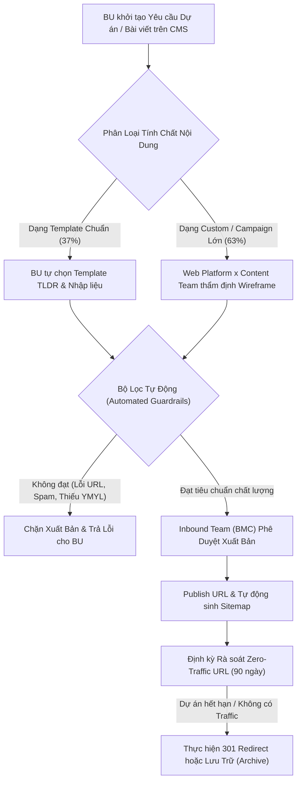

# BÁO CÁO RÀ SOÁT HIỆN TRẠNG 420 DỰ ÁN CMS VÀ ĐỀ XUẤT TÁI CẤU TRÚC DANH MỤC WEB PLATFORM

> **Đơn vị thực hiện:** Web Platform Team (Growth Platform Division)  
> **Thời gian rà soát:** Tháng 08/2026  
> **Phạm vi kiểm toán:** Toàn bộ 420 dự án trên hệ thống CMS Quản lý Danh mục (`momovn-dev.mservice.io/cms/management/project`)  
> **Mục tiêu:** Rà soát tính toàn vẹn dữ liệu, loại bỏ điểm nghẽn phân mảnh, chuẩn hóa cây phân cấp danh mục (Taxonomy) theo Khung 4 Zone và Mô hình Web Destination Hubs.

---

## I. TỔNG QUAN ĐIỀU HÀNH & KẾT QUẢ ĐỊNH LƯỢNG (EXECUTIVE SUMMARY & METRICS)

### 1. Bối Cảnh Rà Soát & Tính Cấp Thiết
Trong quá trình vận hành tăng trưởng website `momo.vn` hướng tới mục tiêu 4.000.000 - 6.000.000 lượt xem trang (Pageviews/tháng) và tối ưu hóa tỷ lệ chuyển đổi Web-to-App, hệ thống Quản lý Dự án CMS (CMS Project Management) đóng vai trò là xương sống định danh, phân quyền biên tập và ánh xạ cấu trúc URL cho toàn bộ nội dung xuất bản.

Tuy nhiên, do việc mở rộng nhanh theo cơ chế tự phục vụ thiếu bộ lọc tự động trong giai đoạn trước, cơ sở dữ liệu CMS hiện tại đã tích lũy 420 dự án với nhiều bất cập nghiêm trọng:
- Phân mảnh danh mục, tạo nhiều gốc dự án độc lập không theo phân cấp chuẩn.
- Tồn tại các dự án mồ côi (Orphaned nodes) tham chiếu đến danh mục cha không tồn tại.
- Tích lũy hơn 30 dự án chiến dịch cũ (2021-2025) gây rác cơ sở dữ liệu và lãng phí tài nguyên thu thập (Crawl Waste).
- Trộn lẫn dữ liệu phân loại chi tiết (như 52 thể loại phim, 54 điểm đến du lịch) vào bảng dự án thay vì xử lý qua cấu trúc thuộc tính dữ liệu (Data Facets / Attributes).

Việc tái cấu trúc và làm sạch hệ thống dự án CMS là điều kiện tiên quyết để vận hành mô hình Web Hub tự phục vụ (Self-service) an toàn và bảo vệ Topical Authority của domain `momo.vn`.

---

### 2. Bảng Thống Kê Định Lượng Cấu Trúc CMS Hiện Tại

<table style="width:100%; border-collapse:collapse; border:1.5px solid #64748b; margin:1em 0; font-size:0.95em;">
  <thead>
    <tr style="background-color:#f1f5f9;">
      <th style="border:1.5px solid #64748b; padding:10px 14px; text-align:left; font-weight:700;">Chỉ Số Cấu Trúc (Structural Metrics)</th>
      <th style="border:1.5px solid #64748b; padding:10px 14px; text-align:right; font-weight:700;">Số Lượng</th>
      <th style="border:1.5px solid #64748b; padding:10px 14px; text-align:left; font-weight:700;">Tỷ Trọng (%)</th>
      <th style="border:1.5px solid #64748b; padding:10px 14px; text-align:left; font-weight:700;">Ghi Chú Kỹ Thuật</th>
    </tr>
  </thead>
  <tbody>
    <tr>
      <td style="border:1px solid #94a3b8; padding:10px 14px; text-align:left; font-weight:700;">Tổng số dự án ghi nhận (Total Projects)</td>
      <td style="border:1px solid #94a3b8; padding:10px 14px; text-align:right; font-weight:700;">420</td>
      <td style="border:1px solid #94a3b8; padding:10px 14px; text-align:left;">100.0%</td>
      <td style="border:1px solid #94a3b8; padding:10px 14px; text-align:left;">Dải ID trải từ 1 đến 841</td>
    </tr>
    <tr style="background-color:#f8fafc;">
      <td style="border:1px solid #94a3b8; padding:10px 14px; text-align:left; font-weight:700;">Dự án Gốc Cấp 1 (Root Projects / Level 1)</td>
      <td style="border:1px solid #94a3b8; padding:10px 14px; text-align:right; font-weight:700;">37</td>
      <td style="border:1px solid #94a3b8; padding:10px 14px; text-align:left;">8.8%</td>
      <td style="border:1px solid #94a3b8; padding:10px 14px; text-align:left;">Bao gồm cả 11 gốc cô lập không có dự án con</td>
    </tr>
    <tr>
      <td style="border:1px solid #94a3b8; padding:10px 14px; text-align:left; font-weight:700;">Dự án Cấp 2 (Level 2 Sub-projects)</td>
      <td style="border:1px solid #94a3b8; padding:10px 14px; text-align:right; font-weight:700;">185</td>
      <td style="border:1px solid #94a3b8; padding:10px 14px; text-align:left;">44.0%</td>
      <td style="border:1px solid #94a3b8; padding:10px 14px; text-align:left;">Nhóm danh mục phân nhánh trực tiếp từ Gốc</td>
    </tr>
    <tr style="background-color:#f8fafc;">
      <td style="border:1px solid #94a3b8; padding:10px 14px; text-align:left; font-weight:700;">Dự án Cấp 3 (Level 3 Sub-projects)</td>
      <td style="border:1px solid #94a3b8; padding:10px 14px; text-align:right; font-weight:700;">179</td>
      <td style="border:1px solid #94a3b8; padding:10px 14px; text-align:left;">42.6%</td>
      <td style="border:1px solid #94a3b8; padding:10px 14px; text-align:left;">Nhóm thể loại phim, điểm đến, blog chuyên đề</td>
    </tr>
    <tr>
      <td style="border:1px solid #94a3b8; padding:10px 14px; text-align:left; font-weight:700;">Dự án Cấp 4 (Level 4 Sub-projects)</td>
      <td style="border:1px solid #94a3b8; padding:10px 14px; text-align:right; font-weight:700;">14</td>
      <td style="border:1px solid #94a3b8; padding:10px 14px; text-align:left;">3.3%</td>
      <td style="border:1px solid #94a3b8; padding:10px 14px; text-align:left;">Độ sâu tối đa của cây danh mục hiện tại</td>
    </tr>
    <tr style="background-color:#f8fafc;">
      <td style="border:1px solid #94a3b8; padding:10px 14px; text-align:left; font-weight:700;">Dự án mồ côi (Orphaned Projects)</td>
      <td style="border:1px solid #94a3b8; padding:10px 14px; text-align:right; font-weight:700; color:#dc2626;">5</td>
      <td style="border:1px solid #94a3b8; padding:10px 14px; text-align:left;">1.2%</td>
      <td style="border:1px solid #94a3b8; padding:10px 14px; text-align:left;">Tham chiếu cha không tồn tại (Parent: "Deal")</td>
    </tr>
    <tr>
      <td style="border:1px solid #94a3b8; padding:10px 14px; text-align:left; font-weight:700;">Dự án chiến dịch cũ cần lưu trữ (Archive Candidates)</td>
      <td style="border:1px solid #94a3b8; padding:10px 14px; text-align:right; font-weight:700; color:#dc2626;">34</td>
      <td style="border:1px solid #94a3b8; padding:10px 14px; text-align:left;">8.1%</td>
      <td style="border:1px solid #94a3b8; padding:10px 14px; text-align:left;">Các chiến dịch Mega, Lắc xì, Game từ 2021 đến 2025</td>
    </tr>
  </tbody>
</table>

---

### 3. Ma Trận Phân Bổ Quy Mô 15 Cụm Dự Án Lớn Nhất

<table style="width:100%; border-collapse:collapse; border:1.5px solid #64748b; margin:1em 0; font-size:0.9em;">
  <thead>
    <tr style="background-color:#f1f5f9;">
      <th style="border:1.5px solid #64748b; padding:8px 12px; text-align:left; font-weight:700;">STT</th>
      <th style="border:1.5px solid #64748b; padding:8px 12px; text-align:left; font-weight:700;">Cụm Dự Án / Master Domain</th>
      <th style="border:1.5px solid #64748b; padding:8px 12px; text-align:center; font-weight:700;">ID Gốc</th>
      <th style="border:1.5px solid #64748b; padding:8px 12px; text-align:right; font-weight:700;">Số Dự Án Con</th>
      <th style="border:1.5px solid #64748b; padding:8px 12px; text-align:right; font-weight:700;">Tổng Nodes</th>
      <th style="border:1.5px solid #64748b; padding:8px 12px; text-align:left; font-weight:700;">Đánh Giá Trọng Số & Hiện Trạng</th>
    </tr>
  </thead>
  <tbody>
    <tr>
      <td style="border:1px solid #94a3b8; padding:8px 12px; text-align:left;">1</td>
      <td style="border:1px solid #94a3b8; padding:8px 12px; text-align:left; font-weight:700;">Cinema (Phim ảnh & Rạp chiếu)</td>
      <td style="border:1px solid #94a3b8; padding:8px 12px; text-align:center;">10</td>
      <td style="border:1px solid #94a3b8; padding:8px 12px; text-align:right;">82</td>
      <td style="border:1px solid #94a3b8; padding:8px 12px; text-align:right; font-weight:700;">83</td>
      <td style="border:1px solid #94a3b8; padding:8px 12px; text-align:left;">Chứa 52 thể loại phim chiếu rạp, 9 cụm rạp, 8 quốc gia. Cần tinh gọn về cơ chế dynamic tagging.</td>
    </tr>
    <tr style="background-color:#f8fafc;">
      <td style="border:1px solid #94a3b8; padding:8px 12px; text-align:left;">2</td>
      <td style="border:1px solid #94a3b8; padding:8px 12px; text-align:left; font-weight:700;">OTA (Du lịch & Đi lại)</td>
      <td style="border:1px solid #94a3b8; padding:8px 12px; text-align:center;">12</td>
      <td style="border:1px solid #94a3b8; padding:8px 12px; text-align:right;">71</td>
      <td style="border:1px solid #94a3b8; padding:8px 12px; text-align:right; font-weight:700;">72</td>
      <td style="border:1px solid #94a3b8; padding:8px 12px; text-align:left;">Chứa 54 điểm đến tỉnh thành/quốc gia dưới dạng sub-project.</td>
    </tr>
    <tr>
      <td style="border:1px solid #94a3b8; padding:8px 12px; text-align:left;">3</td>
      <td style="border:1px solid #94a3b8; padding:8px 12px; text-align:left; font-weight:700;">Donation (Ví Nhân Ái & Quyên góp)</td>
      <td style="border:1px solid #94a3b8; padding:8px 12px; text-align:center;">63</td>
      <td style="border:1px solid #94a3b8; padding:8px 12px; text-align:right;">42</td>
      <td style="border:1px solid #94a3b8; padding:8px 12px; text-align:right; font-weight:700;">43</td>
      <td style="border:1px solid #94a3b8; padding:8px 12px; text-align:left;">Gồm 28 tổ chức thiện nguyện, 8 chuyên mục blog và 4 chiến dịch quyên góp.</td>
    </tr>
    <tr style="background-color:#f8fafc;">
      <td style="border:1px solid #94a3b8; padding:8px 12px; text-align:left;">4</td>
      <td style="border:1px solid #94a3b8; padding:8px 12px; text-align:left; font-weight:700;">Campaign MoMo (Chiến dịch Tổng)</td>
      <td style="border:1px solid #94a3b8; padding:8px 12px; text-align:center;">89</td>
      <td style="border:1px solid #94a3b8; padding:8px 12px; text-align:right;">35</td>
      <td style="border:1px solid #94a3b8; padding:8px 12px; text-align:right; font-weight:700;">36</td>
      <td style="border:1px solid #94a3b8; padding:8px 12px; text-align:left;">Tập trung hầu hết các sự kiện lớn qua các năm; cần tách riêng Active vs Archived.</td>
    </tr>
    <tr>
      <td style="border:1px solid #94a3b8; padding:8px 12px; text-align:left;">5</td>
      <td style="border:1px solid #94a3b8; padding:8px 12px; text-align:left; font-weight:700;">Tài chính - Bảo hiểm (Financial Hub)</td>
      <td style="border:1px solid #94a3b8; padding:8px 12px; text-align:center;">57</td>
      <td style="border:1px solid #94a3b8; padding:8px 12px; text-align:right;">26</td>
      <td style="border:1px solid #94a3b8; padding:8px 12px; text-align:right; font-weight:700;">27</td>
      <td style="border:1px solid #94a3b8; padding:8px 12px; text-align:left;">Trọng tâm chuyển đổi nhưng đang bị phân mảnh với các gốc Bảo hiểm (13) và Vay Nhanh (735).</td>
    </tr>
    <tr style="background-color:#f8fafc;">
      <td style="border:1px solid #94a3b8; padding:8px 12px; text-align:left;">6</td>
      <td style="border:1px solid #94a3b8; padding:8px 12px; text-align:left; font-weight:700;">Dịch vụ liên kết (Affiliates & Partners)</td>
      <td style="border:1px solid #94a3b8; padding:8px 12px; text-align:center;">280</td>
      <td style="border:1px solid #94a3b8; padding:8px 12px; text-align:right;">26</td>
      <td style="border:1px solid #94a3b8; padding:8px 12px; text-align:right; font-weight:700;">27</td>
      <td style="border:1px solid #94a3b8; padding:8px 12px; text-align:left;">Bao gồm App Store, Online Payment (Delivery/Logistics) và OTT Streaming.</td>
    </tr>
    <tr>
      <td style="border:1px solid #94a3b8; padding:8px 12px; text-align:left;">7</td>
      <td style="border:1px solid #94a3b8; padding:8px 12px; text-align:left; font-weight:700;">Billpay (Hóa đơn & Tiện ích công)</td>
      <td style="border:1px solid #94a3b8; padding:8px 12px; text-align:center;">68</td>
      <td style="border:1px solid #94a3b8; padding:8px 12px; text-align:right;">21</td>
      <td style="border:1px solid #94a3b8; padding:8px 12px; text-align:right; font-weight:700;">22</td>
      <td style="border:1px solid #94a3b8; padding:8px 12px; text-align:left;">19 nhóm dịch vụ thanh toán hóa đơn thiết yếu (Điện, Nước, Internet, Học phí...).</td>
    </tr>
    <tr style="background-color:#f8fafc;">
      <td style="border:1px solid #94a3b8; padding:8px 12px; text-align:left;">8</td>
      <td style="border:1px solid #94a3b8; padding:8px 12px; text-align:left; font-weight:700;">Nạp thẻ Game</td>
      <td style="border:1px solid #94a3b8; padding:8px 12px; text-align:center;">18</td>
      <td style="border:1px solid #94a3b8; padding:8px 12px; text-align:right;">10</td>
      <td style="border:1px solid #94a3b8; padding:8px 12px; text-align:right; font-weight:700;">11</td>
      <td style="border:1px solid #94a3b8; padding:8px 12px; text-align:left;">Nhóm tiện ích thẻ nạp, cổng nạp nhà phát hành (VNG, VGP, Napthengay).</td>
    </tr>
    <tr>
      <td style="border:1px solid #94a3b8; padding:8px 12px; text-align:left;">9</td>
      <td style="border:1px solid #94a3b8; padding:8px 12px; text-align:left; font-weight:700;">Chuyển Nhận Tiền (Payment Core)</td>
      <td style="border:1px solid #94a3b8; padding:8px 12px; text-align:center;">191</td>
      <td style="border:1px solid #94a3b8; padding:8px 12px; text-align:right;">8</td>
      <td style="border:1px solid #94a3b8; padding:8px 12px; text-align:right; font-weight:700;">9</td>
      <td style="border:1px solid #94a3b8; padding:8px 12px; text-align:left;">Cốt lõi thanh toán: P2P, W2B, W2W, W2C, VietQR, Quỹ nhóm.</td>
    </tr>
    <tr style="background-color:#f8fafc;">
      <td style="border:1px solid #94a3b8; padding:8px 12px; text-align:left;">10</td>
      <td style="border:1px solid #94a3b8; padding:8px 12px; text-align:left; font-weight:700;">Tiện ích giao thông (Vehicle Hub)</td>
      <td style="border:1px solid #94a3b8; padding:8px 12px; text-align:center;">389</td>
      <td style="border:1px solid #94a3b8; padding:8px 12px; text-align:right;">7</td>
      <td style="border:1px solid #94a3b8; padding:8px 12px; text-align:right; font-weight:700;">8</td>
      <td style="border:1px solid #94a3b8; padding:8px 12px; text-align:left;">Phạt nguội, Vận tải, Cứu hộ, Đăng kiểm, Phí không dừng/VETC. Đang mở rộng.</td>
    </tr>
    <tr>
      <td style="border:1px solid #94a3b8; padding:8px 12px; text-align:left;">11</td>
      <td style="border:1px solid #94a3b8; padding:8px 12px; text-align:left; font-weight:700;">Offline Payment & SME</td>
      <td style="border:1px solid #94a3b8; padding:8px 12px; text-align:center;">66</td>
      <td style="border:1px solid #94a3b8; padding:8px 12px; text-align:right;">6</td>
      <td style="border:1px solid #94a3b8; padding:8px 12px; text-align:right; font-weight:700;">7</td>
      <td style="border:1px solid #94a3b8; padding:8px 12px; text-align:left;">Retails, Thổ Địa, FnB, SME Offline, Spa, Quản lý chi tiêu.</td>
    </tr>
    <tr style="background-color:#f8fafc;">
      <td style="border:1px solid #94a3b8; padding:8px 12px; text-align:left;">12</td>
      <td style="border:1px solid #94a3b8; padding:8px 12px; text-align:left; font-weight:700;">An toàn bảo mật (TRUST)</td>
      <td style="border:1px solid #94a3b8; padding:8px 12px; text-align:center;">326</td>
      <td style="border:1px solid #94a3b8; padding:8px 12px; text-align:right;">6</td>
      <td style="border:1px solid #94a3b8; padding:8px 12px; text-align:right; font-weight:700;">7</td>
      <td style="border:1px solid #94a3b8; padding:8px 12px; text-align:left;">Thủ đoạn lừa đảo, Bảo mật giao dịch, NFC, KYC, Risk.</td>
    </tr>
    <tr>
      <td style="border:1px solid #94a3b8; padding:8px 12px; text-align:left;">13</td>
      <td style="border:1px solid #94a3b8; padding:8px 12px; text-align:left; font-weight:700;">Telco (Viễn thông)</td>
      <td style="border:1px solid #94a3b8; padding:8px 12px; text-align:center;">403</td>
      <td style="border:1px solid #94a3b8; padding:8px 12px; text-align:right;">6</td>
      <td style="border:1px solid #94a3b8; padding:8px 12px; text-align:right; font-weight:700;">7</td>
      <td style="border:1px solid #94a3b8; padding:8px 12px; text-align:left;">Viettel, Mobifone, Vinaphone, Data 4G/5G, Airtime (Topup).</td>
    </tr>
    <tr style="background-color:#f8fafc;">
      <td style="border:1px solid #94a3b8; padding:8px 12px; text-align:left;">14</td>
      <td style="border:1px solid #94a3b8; padding:8px 12px; text-align:left; font-weight:700;">Bảo hiểm (InsurTech Cluster)</td>
      <td style="border:1px solid #94a3b8; padding:8px 12px; text-align:center;">13</td>
      <td style="border:1px solid #94a3b8; padding:8px 12px; text-align:right;">5</td>
      <td style="border:1px solid #94a3b8; padding:8px 12px; text-align:right; font-weight:700;">6</td>
      <td style="border:1px solid #94a3b8; padding:8px 12px; text-align:left;">Bảo hiểm sức khỏe, Bảo hiểm ô tô (Vật chất, TNDS), Bảo hiểm Y tế.</td>
    </tr>
    <tr>
      <td style="border:1px solid #94a3b8; padding:8px 12px; text-align:left;">15</td>
      <td style="border:1px solid #94a3b8; padding:8px 12px; text-align:left; font-weight:700;">Growth User (Tăng trưởng & Onboarding)</td>
      <td style="border:1px solid #94a3b8; padding:8px 12px; text-align:center;">686</td>
      <td style="border:1px solid #94a3b8; padding:8px 12px; text-align:right;">5</td>
      <td style="border:1px solid #94a3b8; padding:8px 12px; text-align:right; font-weight:700;">6</td>
      <td style="border:1px solid #94a3b8; padding:8px 12px; text-align:left;">Retention, Giới thiệu MoMo, Family Hub, New User, Cross-Sell.</td>
    </tr>
  </tbody>
</table>

---

## II. CHI TIẾT 5 NHÓM LỖI & ĐIỂM NGHẼN QUẢN TRỊ (DEFECTS & ROOT CAUSES)

### 1. Lỗi 1: Tồn Tại Các Dự Án Mồ Côi (Orphaned Nodes)
Hệ thống phát hiện 5 dự án cấu hình giá trị `Project Cha = "Deal"`, tuy nhiên trong danh mục CMS hoàn toàn không tồn tại dự án gốc có tên là `Deal`.

<table style="width:100%; border-collapse:collapse; border:1.5px solid #64748b; margin:1em 0; font-size:0.9em;">
  <thead>
    <tr style="background-color:#f1f5f9;">
      <th style="border:1.5px solid #64748b; padding:8px 12px; text-align:center; font-weight:700;">ID</th>
      <th style="border:1.5px solid #64748b; padding:8px 12px; text-align:left; font-weight:700;">Tên Dự Án Lỗi</th>
      <th style="border:1.5px solid #64748b; padding:8px 12px; text-align:left; font-weight:700;">Project Cha Cấu Hình</th>
      <th style="border:1.5px solid #64748b; padding:8px 12px; text-align:left; font-weight:700;">Hiện Trạng & Rủi Ro</th>
    </tr>
  </thead>
  <tbody>
    <tr>
      <td style="border:1px solid #94a3b8; padding:8px 12px; text-align:center;">304</td>
      <td style="border:1px solid #94a3b8; padding:8px 12px; text-align:left;">[PROMOTION] - Deal Ăn Uống Cực Chất</td>
      <td style="border:1px solid #94a3b8; padding:8px 12px; text-align:left; color:#dc2626; font-weight:700;">Deal (Không tồn tại)</td>
      <td style="border:1px solid #94a3b8; padding:8px 12px; text-align:left;">Không render được Breadcrumbs, gãy liên kết nội bộ trong sitemap.</td>
    </tr>
    <tr style="background-color:#f8fafc;">
      <td style="border:1px solid #94a3b8; padding:8px 12px; text-align:center;">305</td>
      <td style="border:1px solid #94a3b8; padding:8px 12px; text-align:left;">[PROMOTION] - Mua Sắm</td>
      <td style="border:1px solid #94a3b8; padding:8px 12px; text-align:left; color:#dc2626; font-weight:700;">Deal (Không tồn tại)</td>
      <td style="border:1px solid #94a3b8; padding:8px 12px; text-align:left;">Nội dung bị cô lập (Orphan page), giảm khả năng crawl của Google Bot.</td>
    </tr>
    <tr>
      <td style="border:1px solid #94a3b8; padding:8px 12px; text-align:center;">315</td>
      <td style="border:1px solid #94a3b8; padding:8px 12px; text-align:left;">[PROMOTION] - Giải Trí</td>
      <td style="border:1px solid #94a3b8; padding:8px 12px; text-align:left; color:#dc2626; font-weight:700;">Deal (Không tồn tại)</td>
      <td style="border:1px solid #94a3b8; padding:8px 12px; text-align:left;">Không thể phân quyền quản lý tập trung theo chuyên mục.</td>
    </tr>
    <tr style="background-color:#f8fafc;">
      <td style="border:1px solid #94a3b8; padding:8px 12px; text-align:center;">312</td>
      <td style="border:1px solid #94a3b8; padding:8px 12px; text-align:left;">[PROMOTION] - Du lịch - Đi lại</td>
      <td style="border:1px solid #94a3b8; padding:8px 12px; text-align:left; color:#dc2626; font-weight:700;">Deal (Không tồn tại)</td>
      <td style="border:1px solid #94a3b8; padding:8px 12px; text-align:left;">Chồng chéo với danh mục Promotion (ID 295) và OTA (ID 12).</td>
    </tr>
    <tr>
      <td style="border:1px solid #94a3b8; padding:8px 12px; text-align:center;">313</td>
      <td style="border:1px solid #94a3b8; padding:8px 12px; text-align:left;">[PROMOTION] - Chăm Sóc Sức Khỏe - Sắc Đẹp</td>
      <td style="border:1px solid #94a3b8; padding:8px 12px; text-align:left; color:#dc2626; font-weight:700;">Deal (Không tồn tại)</td>
      <td style="border:1px solid #94a3b8; padding:8px 12px; text-align:left;">Gây lỗi query dữ liệu khi kéo danh sách bài viết qua API CMS.</td>
    </tr>
  </tbody>
</table>

---

### 2. Lỗi 2: Phân Mảnh, Trùng Lặp & Chồng Chéo Danh Mục (Fragmentation & Redundancy)

Hệ thống có nhiều dự án đại diện cho cùng một nghiệp vụ kinh doanh nhưng lại bị chia cắt thành các dự án độc lập cấp 1 hoặc phân tán không đồng nhất:

- **Phân mảnh mảng Bảo hiểm:**
  - Gốc `Bảo hiểm` (ID 13): Chứa `Bảo hiểm sức khỏe` (343), `Bảo hiểm ô tô` (320), `Bảo hiểm vật chất ô tô` (321), `Bảo hiểm trách nhiệm dân sự ô tô` (322), `Bảo Hiểm Y Tế` (542).
  - Gốc `Bảo hiểm xe máy` (ID 216) & `Bảo hiểm xe máy Landing Page` (ID 736): Tách riêng thành 2 gốc độc lập.
  - Sub-projects `Bảo hiểm Du lịch` (353), `Bảo hiểm Du lịch Quốc tế` (379), `Thanh toán phí bảo hiểm` (192): Lại nằm dưới gốc `Tài chính - Bảo hiểm` (57).
  - *Hệ quả:* Khách hàng và Google Search bị phân tán tín hiệu E-E-A-T; đội ngũ vận hành nội dung khó quản lý phân quyền.

- **Phân mảnh mảng Vay Nhanh & Tín Dụng:**
  - Gốc `Vay Nhanh Landing Page` (ID 735): Chứa `Vay nhanh nhà bán hàng` (452), `Vay Nhanh - Simular` (128), `Vay Nhanh` (359).
  - Dưới gốc `Tài chính - Bảo hiểm` (ID 57): Có `Thanh toán khoản vay` (213), `Mở thẻ tín dụng` (384), `Thẻ Tín Dụng` (310), `Điểm tín dụng` (806), `Tài chính siêu tốc` (412).
  - Gốc `Ví Trả Sau`: Vừa có dự án `Ví Trả Sau` (16), vừa có `Ví Trả Sau Landing Page` (734).

- **Phân mảnh mảng Viễn thông & SIM:**
  - Gốc `Telco` (ID 403): Chứa Viettel, Mobifone, Vinaphone, Data 4G/5G, Airtime.
  - Gốc `Sim chính chủ` (ID 413) và `eSim du lịch` (ID 402): Tách thành 2 gốc độc lập.

- **Trùng tên dự án (Duplicate Project Names):**
  - Tên `Giáo dục`: Xuất hiện ở ID 287 (thuộc `Ví Nhân Ái - Blog`) và ID 323 (thuộc `Billpay`). Cần gắn tiền tố phân biệt rõ ngữ cảnh.

---

### 3. Lỗi 3: Rác Dữ Liệu Từ Chiến Dịch Cũ (Legacy Campaign Clutter)

Cụm `Campaign MoMo` (ID 89) đang lưu trữ 34 dự án con kéo dài từ năm 2021 đến 2025. Hầu hết các sự kiện này đã kết thúc chương trình nhưng URL vẫn có thể còn tồn tại hoặc chưa được xử lý chuyển hướng (301 Redirect / 410 Gone theo chính sách Web Health Policy):

- **Chiến dịch lịch sử hết hạn:** `Mega21` (152), `Mega22` (328), `Mega25` (648), `Lắc xì 2022` (225), `Lắc xì 2023` (344), `Lắc Xì 2024` (387), `Lắc xì 2025` (530), `Summer25` (576), `Coke` (258), `Viber` (90), `MoMo Jump` (134), `MoMo Goal` (337), `Đi và Cảm` (301), `Hồ Cá Bạc Tỷ` (376), `Kho Báu Biển Xanh` (415)...
- **Bất thường cấu trúc:** Dự án `Lắc xì 2026` (ID 688) lại được tạo thành Dự án Gốc Cấp 1 thay vì đặt dưới `Campaign MoMo`.

---

### 4. Lỗi 4: Sai Lệch Quy Chuẩn Đặt Tên & Tồn Tại Dữ Liệu Thử Nghiệm

- **Tiền tố rác (Prefix clutter):** Nhóm bài viết gán prefix như `[PROMOTION] - ...` (ID 304, 305, 312, 313, 315), `[Exclude] Billpay T4/26` (ID 733).
- **Lỗi chính tả (Typo):** Dự án ID 128 đặt tên là `Vay Nhanh - Simular` (viết sai từ *Simulator*).
- **Không đồng nhất viết hoa/thường:** `Bảo Hiểm Y Tế` (viết hoa từng từ) so với `Bảo hiểm sức khỏe` (viết hoa chữ cái đầu); `Lắc Xì 2024` vs `Lắc xì 2025`.
- **Dữ liệu thử nghiệm trên Production CMS:** 
  - Gốc `Web Platform` (ID 495) chứa `Web Platform - Test 1` (540) và `Web Platform - Test 2` (541).

---

### 5. Lỗi 5: Lệch Pha Kiến Trúc Web Destination & Mô Hình 4 Zone

Hệ thống CMS hiện tại quản lý theo lối mòn cơ học, đưa các thuộc tính phân loại động (Dynamic Facets/Tags) thành các "Dự án":
- **Mảng Cinema (83 nodes):** Đang tạo riêng 52 dự án cho 52 thể loại phim (như `Bí ẩn`, `Chiến tranh`, `Giật gân`, `Hài Hước`, `Anime`, `Đẹp Trai` [ID 682], `Linh Dị` [ID 841]...). Việc này làm phình to bảng quản trị CMS. Đúng kiến trúc, các thể loại này phải là **Tag/Taxonomy Attribute** của một Content Type duy nhất thuộc Cinema Hub.
- **Mảng OTA (72 nodes):** Đang tạo 54 dự án cho 54 tỉnh thành và quốc gia (Hà Nội, TP.HCM, Sapa, Đà Lạt, Côn Đảo, Nhật Bản, Hàn Quốc...). Đây là các entity đích đến (Destination Entities) cần được quản trị bằng cơ chế Database Table kết nối API thay vì tạo dự án thủ công.
- **Mảng Student Hub:** Là 1 trong 5 Strategic Hubs trọng điểm (theo định hướng Ban Giám Đốc), nhưng trên CMS chỉ tồn tại duy nhất 1 node cô lập là `Student Pass` (ID 456).

---

## III. TÁI CẤU TRÚC DANH MỤC CMS THEO MÔ HÌNH 4 ZONE

Căn cứ biên bản họp chiến lược ngày 08/08, 19/08 và 25/08/2026, toàn bộ danh mục CMS được tái quy hoạch vào 4 Vùng Chiến Lược (4 Zones Portfolio):

<table style="width:100%; border-collapse:collapse; border:1.5px solid #64748b; margin:1em 0; font-size:0.9em;">
  <thead>
    <tr style="background-color:#f1f5f9;">
      <th style="border:1.5px solid #64748b; padding:8px 12px; text-align:left; font-weight:700;">Phân Vùng (Zone)</th>
      <th style="border:1.5px solid #64748b; padding:8px 12px; text-align:left; font-weight:700;">Tiêu Chí & Mục Tiêu Tăng Trưởng</th>
      <th style="border:1.5px solid #64748b; padding:8px 12px; text-align:left; font-weight:700;">Danh Mục Dự Án CMS Ánh Xạ</th>
      <th style="border:1.5px solid #64748b; padding:8px 12px; text-align:left; font-weight:700;">Hành Động Chuẩn Hóa CMS</th>
    </tr>
  </thead>
  <tbody>
    <tr>
      <td style="border:1px solid #94a3b8; padding:8px 12px; text-align:left; font-weight:700;">Performance Zone</td>
      <td style="border:1px solid #94a3b8; padding:8px 12px; text-align:left;">Traffic ≥ 1.000.000 PV/tháng. Tăng trưởng ổn định: +20% đến +30%.</td>
      <td style="border:1px solid #94a3b8; padding:8px 12px; text-align:left;">- <strong>Cinema Hub:</strong> Cụm rạp (CGV, BHD, Lotte, Galaxy...), Blog review, Phim chiếu. - <strong>Travel Hub (OTA):</strong> Vé máy bay, Vé tàu hỏa, Vé xe khách, Khách sạn.</td>
      <td style="border:1px solid #94a3b8; padding:8px 12px; text-align:left;">Gộp 52 thể loại phim và 54 tỉnh thành thành hệ thống Dynamic Facets. Chuẩn hóa trang cụm rạp để phục vụ đàm phán thương mại.</td>
    </tr>
    <tr style="background-color:#f8fafc;">
      <td style="border:1px solid #94a3b8; padding:8px 12px; text-align:left; font-weight:700;">Transformation Zone</td>
      <td style="border:1px solid #94a3b8; padding:8px 12px; text-align:left;">Traffic: 500k - 1.000.000 PV/tháng. Mục tiêu bứt phá: Tăng gấp 2 đến gấp 5 lần (x2 - x5).</td>
      <td style="border:1px solid #94a3b8; padding:8px 12px; text-align:left;">- <strong>Financial Hub:</strong> CIC Điểm tín dụng, Vay Nhanh, Tiết kiệm, Tiệm Vàng Online, Ví Trả Sau, Sàn Đầu Tư, Bảo hiểm toàn diện. - <strong>Vehicle Hub:</strong> Tra cứu phạt nguội, Giá xăng dầu, Cây xăng, Trạm sạc EV, Garage sửa xe, Thu phí không dừng ePass/VETC.</td>
      <td style="border:1px solid #94a3b8; padding:8px 12px; text-align:left;">Hợp nhất toàn bộ các nhánh Bảo hiểm rời rạc (13, 216, 736) và Vay Nhanh (735) vào Financial Hub. Đồng bộ dữ liệu Vehicle Hub qua Apify.</td>
    </tr>
    <tr>
      <td style="border:1px solid #94a3b8; padding:8px 12px; text-align:left; font-weight:700;">Incubator Zone</td>
      <td style="border:1px solid #94a3b8; padding:8px 12px; text-align:left;">Dự án mới / Đột phá. Cam kết tối thiểu: 500.000 PV/tháng để giữ trạng thái Chiến lược.</td>
      <td style="border:1px solid #94a3b8; padding:8px 12px; text-align:left;">- <strong>Student Hub:</strong> Sinh viên, Trường học, Bảng xếp hạng, Nhà trọ. - <strong>Cổng Tra cứu Xổ Số & Vietlott:</strong> Dò vé số, Mua vé Vietlott SMS. - <strong>New User Personalization:</strong> Chuyên trang Onboarding, Welcome Voucher.</td>
      <td style="border:1px solid #94a3b8; padding:8px 12px; text-align:left;">Quy hoạch mới hoàn chỉnh cấu trúc Student Hub thay cho node Student Pass đơn lẻ; tích hợp module Xổ số vào luồng Native Web Payment.</td>
    </tr>
    <tr style="background-color:#f8fafc;">
      <td style="border:1px solid #94a3b8; padding:8px 12px; text-align:left; font-weight:700;">Productivity Zone & Self-serve</td>
      <td style="border:1px solid #94a3b8; padding:8px 12px; text-align:left;">Hạ tầng nền tảng & Tiện ích nghiệp vụ BU. Mục tiêu: Tự động hóa 100%, không tốn công Dev.</td>
      <td style="border:1px solid #94a3b8; padding:8px 12px; text-align:left;">- <strong>Billpay & Dịch vụ công:</strong> Điện, Nước, Internet, Học phí, Y tế. - <strong>Payment Core:</strong> Chuyển tiền P2P, W2B, VietQR. - <strong>Telco & Data:</strong> Topup thẻ nạp, gói 4G/5G. - <strong>Merchant & Business:</strong> Soundbox, IPOS, CTV MoMo. - <strong>Donation / Ví Nhân Ái:</strong> Danh bạ 28 tổ chức thiện nguyện. - <strong>Campaign Landing Pages:</strong> Webview T&C khuyến mãi của BUs.</td>
      <td style="border:1px solid #94a3b8; padding:8px 12px; text-align:left;">Chuyển giao quyền tự xuất bản cho BU qua Admin Tool dựa trên Template TLDR chuẩn hóa, đính kèm Guardrails chặn xuất bản URL rác. Lưu trữ 34 campaign cũ.</td>
    </tr>
  </tbody>
</table>

---

## IV. ĐỀ XUẤT KIẾN TRÚC TAXONOMY 3 TẦNG CHUẨN HÓA CHO CMS

Nhằm khắc phục tình trạng 37 gốc dự án lộn xộn, hệ thống đề xuất quy hoạch lại toàn bộ CMS về **10 Master Hubs / Domains Cấp 1 chuẩn hóa**:

```mermaid
graph TD
    Root["HỆ THỐNG CMS MOMO (momo.vn)"] --> H1["1. Cinema Hub (Performance)"]
    Root --> H2["2. Financial Hub (Transformation)"]
    Root --> H3["3. Vehicle Hub (Transformation)"]
    Root --> H4["4. Travel & OTA Hub (Performance)"]
    Root --> H5["5. Student Hub (Incubator)"]
    Root --> H6["6. Utilities & Billpay (Productivity)"]
    Root --> H7["7. Payment & Core Services (Productivity)"]
    Root --> H8["8. Ví Nhân Ái / Donation (Productivity)"]
    Root --> H9["9. Merchant & Partner Hub (Self-serve)"]
    Root --> H10["10. Brand, Life & Trust (Self-serve)"]

    H1 --> H1_1["Phim chiếu rạp (Dynamic Tagging)"]
    H1 --> H1_2["Cụm rạp đối tác (CGV, BHD, Lotte...)"]
    H1 --> H1_3["Blog đánh giá & Review phim"]

    H2 --> H2_1["Điểm tín dụng & Kiểm tra CIC"]
    H2 --> H2_2["Vay Nhanh & Vay tiêu dùng"]
    H2 --> H2_3["Tiết kiệm, Đầu tư & Tiệm Vàng Online"]
    H2 --> H2_4["Ví Trả Sau"]
    H2 --> H2_5["Trung tâm Bảo hiểm (Ô tô, Xe máy, Y tế, Sức khỏe)"]

    H3 --> H3_1["Tra cứu phạt nguội & Nộp phạt"]
    H3 --> H3_2["Giá xăng dầu & Bản đồ cây xăng"]
    H3 --> H3_3["Bản đồ trạm sạc xe điện EV"]
    H3 --> H3_4["Garage sửa xe & Cứu hộ"]
    H3 --> H3_5["Thu phí không dừng ePass / VETC"]
```

<table style="width:100%; border-collapse:collapse; border:1.5px solid #64748b; margin:1em 0; font-size:0.9em;">
  <thead>
    <tr style="background-color:#f1f5f9;">
      <th style="border:1.5px solid #64748b; padding:8px 12px; text-align:left; font-weight:700;">Bước</th>
      <th style="border:1.5px solid #64748b; padding:8px 12px; text-align:left; font-weight:700;">Tên Giai Đoạn</th>
      <th style="border:1.5px solid #64748b; padding:8px 12px; text-align:left; font-weight:700;">Trải Nghiệm Người Dùng (UX)</th>
      <th style="border:1.5px solid #64748b; padding:8px 12px; text-align:left; font-weight:700;">Hạ Tầng / Cơ Chế Kỹ Thuật</th>
      <th style="border:1.5px solid #64748b; padding:8px 12px; text-align:left; font-weight:700;">Nền Tảng</th>
    </tr>
  </thead>
  <tbody>
    <tr>
      <td style="border:1px solid #94a3b8; padding:8px 12px; text-align:left;">1</td>
      <td style="border:1px solid #94a3b8; padding:8px 12px; text-align:left;">Truy cập Master Hub</td>
      <td style="border:1px solid #94a3b8; padding:8px 12px; text-align:left;">Người dùng tiếp cận cổng đích theo nhu cầu rõ ràng (Tài chính, Phim, Giao thông, Sinh viên).</td>
      <td style="border:1px solid #94a3b8; padding:8px 12px; text-align:left;">Cấu trúc URL phân cấp chuẩn SEO (`/tai-chinh`, `/cinema`, `/tien-ich-giao-thong`).</td>
      <td style="border:1px solid #94a3b8; padding:8px 12px; text-align:left;">Web Platform</td>
    </tr>
    <tr style="background-color:#f8fafc;">
      <td style="border:1px solid #94a3b8; padding:8px 12px; text-align:left;">2</td>
      <td style="border:1px solid #94a3b8; padding:8px 12px; text-align:left;">Tương tác Tiện ích / Subpage</td>
      <td style="border:1px solid #94a3b8; padding:8px 12px; text-align:left;">Sử dụng công cụ tương tác (Check CIC, Tra cứu phạt nguội, So sánh giá vé, Tính lãi tiết kiệm).</td>
      <td style="border:1px solid #94a3b8; padding:8px 12px; text-align:left;">MoSpark Interactive Widgets kết nối API Real-time / Sheet dữ liệu Apify.</td>
      <td style="border:1px solid #94a3b8; padding:8px 12px; text-align:left;">Web Platform</td>
    </tr>
    <tr>
      <td style="border:1px solid #94a3b8; padding:8px 12px; text-align:left;">3</td>
      <td style="border:1px solid #94a3b8; padding:8px 12px; text-align:left;">Thanh toán Native / Điều hướng App</td>
      <td style="border:1px solid #94a3b8; padding:8px 12px; text-align:left;">Quét Dynamic QR thanh toán trực tiếp hoặc nhấp CTA mở App MoMo để nhận kết quả chi tiết.</td>
      <td style="border:1px solid #94a3b8; padding:8px 12px; text-align:left;">Native Web QR Gateway & Onelink Routing Engine.</td>
      <td style="border:1px solid #94a3b8; padding:8px 12px; text-align:left;">Web to App</td>
    </tr>
    <tr style="background-color:#f8fafc;">
      <td style="border:1px solid #94a3b8; padding:8px 12px; text-align:left;">4</td>
      <td style="border:1px solid #94a3b8; padding:8px 12px; text-align:left;">Lưu trữ & Tương tác In-App</td>
      <td style="border:1px solid #94a3b8; padding:8px 12px; text-align:left;">Quản lý hồ sơ tài chính, vé phim điện tử, vé số Vietlott và nhận thông báo biến động định kỳ.</td>
      <td style="border:1px solid #94a3b8; padding:8px 12px; text-align:left;">Mini App MoMo Core Ecosystem.</td>
      <td style="border:1px solid #94a3b8; padding:8px 12px; text-align:left;">App MoMo</td>
    </tr>
  </tbody>
</table>

---

## V. QUY TRÌNH QUẢN TRỊ VÒNG ĐỜI DỰ ÁN CMS & BỘ LỌC TỰ ĐỘNG (GOVERNANCE & GUARDRAILS)

Căn cứ chỉ đạo từ Ban Giám Đốc tại cuộc họp ngày 13/08/2026, để chuyển đổi mô hình sang Tự phục vụ (Self-service) mà không gây rủi ro "nát web", hệ thống thiết lập quy trình kiểm soát 4 bước:

<table style="width:100%; border-collapse:collapse; border:1.5px solid #64748b; margin:1em 0; font-size:0.9em;">
  <thead>
    <tr style="background-color:#f1f5f9;">
      <th style="border:1.5px solid #64748b; padding:8px 12px; text-align:left; font-weight:700;">Bước</th>
      <th style="border:1.5px solid #64748b; padding:8px 12px; text-align:left; font-weight:700;">Tên Giai Đoạn</th>
      <th style="border:1.5px solid #64748b; padding:8px 12px; text-align:left; font-weight:700;">Trải Nghiệm Người Dùng (UX)</th>
      <th style="border:1.5px solid #64748b; padding:8px 12px; text-align:left; font-weight:700;">Hạ Tầng / Cơ Chế Kỹ Thuật</th>
      <th style="border:1.5px solid #64748b; padding:8px 12px; text-align:left; font-weight:700;">Nền Tảng</th>
    </tr>
  </thead>
  <tbody>
    <tr>
      <td style="border:1px solid #94a3b8; padding:8px 12px; text-align:left;">1</td>
      <td style="border:1px solid #94a3b8; padding:8px 12px; text-align:left;">Khởi tạo & Chọn Template</td>
      <td style="border:1px solid #94a3b8; padding:8px 12px; text-align:left;">BU chọn loại hình trang (T&C khuyến mãi, Landing page dịch vụ, Tiện ích tra cứu).</td>
      <td style="border:1px solid #94a3b8; padding:8px 12px; text-align:left;">CMS Project Management & Admin Panel phân quyền theo Cell Team.</td>
      <td style="border:1px solid #94a3b8; padding:8px 12px; text-align:left;">CMS Admin</td>
    </tr>
    <tr style="background-color:#f8fafc;">
      <td style="border:1px solid #94a3b8; padding:8px 12px; text-align:left;">2</td>
      <td style="border:1px solid #94a3b8; padding:8px 12px; text-align:left;">Kiểm duyệt Tự động (Guardrails Gate)</td>
      <td style="border:1px solid #94a3b8; padding:8px 12px; text-align:left;">Hệ thống tự động chấm điểm bài viết: kiểm tra cấu trúc slug URL, từ khóa YMYL, thẻ meta và tốc độ tải ảnh.</td>
      <td style="border:1px solid #94a3b8; padding:8px 12px; text-align:left;">Automated URL Governance Rule Engine & AI Content Checker.</td>
      <td style="border:1px solid #94a3b8; padding:8px 12px; text-align:left;">CMS Core Engine</td>
    </tr>
    <tr>
      <td style="border:1px solid #94a3b8; padding:8px 12px; text-align:left;">3</td>
      <td style="border:1px solid #94a3b8; padding:8px 12px; text-align:left;">Phê duyệt Xuất bản (Publish Gate)</td>
      <td style="border:1px solid #94a3b8; padding:8px 12px; text-align:left;">Inbound Team (BMC) duyệt lần cuối về mặt thông điệp truyền thông và bản quyền thương hiệu.</td>
      <td style="border:1px solid #94a3b8; padding:8px 12px; text-align:left;">Multi-level Approval Workflow trong Athena / CMS.</td>
      <td style="border:1px solid #94a3b8; padding:8px 12px; text-align:left;">CMS Admin</td>
    </tr>
    <tr style="background-color:#f8fafc;">
      <td style="border:1px solid #94a3b8; padding:8px 12px; text-align:left;">4</td>
      <td style="border:1px solid #94a3b8; padding:8px 12px; text-align:left;">Quản trị Vòng đời & Lưu trữ (Archive)</td>
      <td style="border:1px solid #94a3b8; padding:8px 12px; text-align:left;">Trang hết hạn chiến dịch tự động chuyển sang trạng thái Archive, điều hướng traffic về Master Hub tương ứng.</td>
      <td style="border:1px solid #94a3b8; padding:8px 12px; text-align:left;">Automated 301 Redirect Handler & Zero-Traffic Cleanup SOP.</td>
      <td style="border:1px solid #94a3b8; padding:8px 12px; text-align:left;">Web Edge / CDN</td>
    </tr>
  </tbody>
</table>

---

## VI. KẾ HOẠCH HÀNH ĐỘNG & LỘ TRÌNH THỰC THI (ACTION PLAN & MILESTONES)

<table style="width:100%; border-collapse:collapse; border:1.5px solid #64748b; margin:1em 0; font-size:0.9em;">
  <thead>
    <tr style="background-color:#f1f5f9;">
      <th style="border:1.5px solid #64748b; padding:8px 12px; text-align:left; font-weight:700;">Giai đoạn</th>
      <th style="border:1.5px solid #64748b; padding:8px 12px; text-align:left; font-weight:700;">Thời gian</th>
      <th style="border:1.5px solid #64748b; padding:8px 12px; text-align:left; font-weight:700;">Tên Giai Đoạn</th>
      <th style="border:1.5px solid #64748b; padding:8px 12px; text-align:left; font-weight:700;">Chi Tiết Triển Khai & Mục Tiêu</th>
    </tr>
  </thead>
  <tbody>
    <tr>
      <td style="border:1px solid #94a3b8; padding:8px 12px; text-align:left; font-weight:700;">Giai đoạn 1</td>
      <td style="border:1px solid #94a3b8; padding:8px 12px; text-align:left;">01/09 - 07/09/2026</td>
      <td style="border:1px solid #94a3b8; padding:8px 12px; text-align:left;">Dọn Dẹp Dữ Liệu Rác & Xử Lý Lỗi Cấp Bách</td>
      <td style="border:1px solid #94a3b8; padding:8px 12px; text-align:left;">- Sửa 5 dự án mồ côi (ID 304, 305, 312, 313, 315) ánh xạ về gốc `Promotion` (ID 295). - Xóa 2 dự án Test (ID 540, 541) khỏi production CMS. - Sửa lỗi chính tả `Vay Nhanh - Simular` (ID 128) thành `Vay Nhanh - Simulator`. - Gán `Lắc xì 2026` (ID 688) về đúng danh mục `Campaign MoMo` (ID 89).</td>
    </tr>
    <tr style="background-color:#f8fafc;">
      <td style="border:1px solid #94a3b8; padding:8px 12px; text-align:left; font-weight:700;">Giai đoạn 2</td>
      <td style="border:1px solid #94a3b8; padding:8px 12px; text-align:left;">08/09 - 15/09/2026</td>
      <td style="border:1px solid #94a3b8; padding:8px 12px; text-align:left;">Hợp Nhất Danh Mục Phân Mảnh (Bảo Hiểm & Vay Nhanh)</td>
      <td style="border:1px solid #94a3b8; padding:8px 12px; text-align:left;">- Hợp nhất toàn bộ các gốc Bảo hiểm rời rạc (ID 13, 216, 736) và các sub-project bảo hiểm về một Trung tâm Bảo hiểm thống nhất thuộc `Financial Hub`. - Gộp các landing page `Vay Nhanh` (735) và `Ví Trả Sau` (734) về cấu trúc chuẩn của `Financial Hub`.</td>
    </tr>
    <tr>
      <td style="border:1px solid #94a3b8; padding:8px 12px; text-align:left; font-weight:700;">Giai đoạn 3</td>
      <td style="border:1px solid #94a3b8; padding:8px 12px; text-align:left;">16/09 - 25/09/2026</td>
      <td style="border:1px solid #94a3b8; padding:8px 12px; text-align:left;">Lưu Trữ Chiến Dịch Cũ & Tinh Gọn Taxonomy Chi Tiết</td>
      <td style="border:1px solid #94a3b8; padding:8px 12px; text-align:left;">- Đưa 34 dự án chiến dịch cũ (2021-2025) vào trạng thái Archive; thiết lập 301 redirect về trang chủ hoặc Master Hub liên quan. - Chuyển đổi 52 thể loại phim và 54 điểm đến du lịch sang hệ thống Dynamic Facets / Database Table.</td>
    </tr>
    <tr style="background-color:#f8fafc;">
      <td style="border:1px solid #94a3b8; padding:8px 12px; text-align:left; font-weight:700;">Giai đoạn 4</td>
      <td style="border:1px solid #94a3b8; padding:8px 12px; text-align:left;">26/09 - 30/09/2026</td>
      <td style="border:1px solid #94a3b8; padding:8px 12px; text-align:left;">Đóng Gói Guardrails & Chuyển Giao Vận Hành Tự Phục Vụ</td>
      <td style="border:1px solid #94a3b8; padding:8px 12px; text-align:left;">- Kích hoạt bộ lọc tự động (Guardrails Rule Engine) ngăn chặn tạo URL rác hoặc sai cấu trúc. - Bàn giao quyền phê duyệt nội dung tập trung cho Inbound Team (BMC) theo mô hình Self-service an toàn.</td>
    </tr>
  </tbody>
</table>

---

## VII. MA TRẬN TRÁCH NHIỆM THỰC THI LIÊN ĐỘI NGŨ (RACI MATRIX)

<table style="width:100%; border-collapse:collapse; border:1.5px solid #64748b; margin:1em 0; font-size:0.9em;">
  <thead>
    <tr style="background-color:#f1f5f9;">
      <th style="border:1.5px solid #64748b; padding:8px 12px; text-align:left; font-weight:700;">Hạng Mục Công Việc</th>
      <th style="border:1.5px solid #64748b; padding:8px 12px; text-align:center; font-weight:700;">Web Dev Team</th>
      <th style="border:1.5px solid #64748b; padding:8px 12px; text-align:center; font-weight:700;">Inbound Team (BMC)</th>
      <th style="border:1.5px solid #64748b; padding:8px 12px; text-align:center; font-weight:700;">SEO Vendor</th>
      <th style="border:1.5px solid #64748b; padding:8px 12px; text-align:center; font-weight:700;">Business Units (BUs)</th>
      <th style="border:1.5px solid #64748b; padding:8px 12px; text-align:center; font-weight:700;">Executive Leadership</th>
    </tr>
  </thead>
  <tbody>
    <tr>
      <td style="border:1px solid #94a3b8; padding:8px 12px; text-align:left;">Sửa lỗi kỹ thuật CMS, dự án mồ côi & test nodes</td>
      <td style="border:1px solid #94a3b8; padding:8px 12px; text-align:center; font-weight:700; color:#16a34a;">R / A</td>
      <td style="border:1px solid #94a3b8; padding:8px 12px; text-align:center;">C</td>
      <td style="border:1px solid #94a3b8; padding:8px 12px; text-align:center;">I</td>
      <td style="border:1px solid #94a3b8; padding:8px 12px; text-align:center;">I</td>
      <td style="border:1px solid #94a3b8; padding:8px 12px; text-align:center;">I</td>
    </tr>
    <tr style="background-color:#f8fafc;">
      <td style="border:1px solid #94a3b8; padding:8px 12px; text-align:left;">Hợp nhất cây danh mục Bảo hiểm, Vay Nhanh, FinHub</td>
      <td style="border:1px solid #94a3b8; padding:8px 12px; text-align:center; font-weight:700; color:#16a34a;">R</td>
      <td style="border:1px solid #94a3b8; padding:8px 12px; text-align:center; font-weight:700; color:#16a34a;">A</td>
      <td style="border:1px solid #94a3b8; padding:8px 12px; text-align:center;">C</td>
      <td style="border:1px solid #94a3b8; padding:8px 12px; text-align:center;">C</td>
      <td style="border:1px solid #94a3b8; padding:8px 12px; text-align:center;">I</td>
    </tr>
    <tr>
      <td style="border:1px solid #94a3b8; padding:8px 12px; text-align:left;">Rà soát 301 Redirect & Lưu trữ Campaign cũ</td>
      <td style="border:1px solid #94a3b8; padding:8px 12px; text-align:center;">R</td>
      <td style="border:1px solid #94a3b8; padding:8px 12px; text-align:center;">C</td>
      <td style="border:1px solid #94a3b8; padding:8px 12px; text-align:center; font-weight:700; color:#16a34a;">R / A</td>
      <td style="border:1px solid #94a3b8; padding:8px 12px; text-align:center;">I</td>
      <td style="border:1px solid #94a3b8; padding:8px 12px; text-align:center;">I</td>
    </tr>
    <tr style="background-color:#f8fafc;">
      <td style="border:1px solid #94a3b8; padding:8px 12px; text-align:left;">Thiết lập Bộ lọc Guardrails & Chặn xuất bản URL lỗi</td>
      <td style="border:1px solid #94a3b8; padding:8px 12px; text-align:center; font-weight:700; color:#16a34a;">R / A</td>
      <td style="border:1px solid #94a3b8; padding:8px 12px; text-align:center;">C</td>
      <td style="border:1px solid #94a3b8; padding:8px 12px; text-align:center;">C</td>
      <td style="border:1px solid #94a3b8; padding:8px 12px; text-align:center;">I</td>
      <td style="border:1px solid #94a3b8; padding:8px 12px; text-align:center;">I</td>
    </tr>
    <tr>
      <td style="border:1px solid #94a3b8; padding:8px 12px; text-align:left;">Vận hành Tự phục vụ & Phê duyệt nội dung hàng ngày</td>
      <td style="border:1px solid #94a3b8; padding:8px 12px; text-align:center;">I</td>
      <td style="border:1px solid #94a3b8; padding:8px 12px; text-align:center; font-weight:700; color:#16a34a;">A</td>
      <td style="border:1px solid #94a3b8; padding:8px 12px; text-align:center;">I</td>
      <td style="border:1px solid #94a3b8; padding:8px 12px; text-align:center; font-weight:700; color:#16a34a;">R</td>
      <td style="border:1px solid #94a3b8; padding:8px 12px; text-align:center;">I</td>
    </tr>
    <tr style="background-color:#f8fafc;">
      <td style="border:1px solid #94a3b8; padding:8px 12px; text-align:left;">Phê duyệt Chính sách & Giám sát Chiến lược</td>
      <td style="border:1px solid #94a3b8; padding:8px 12px; text-align:center;">I</td>
      <td style="border:1px solid #94a3b8; padding:8px 12px; text-align:center;">I</td>
      <td style="border:1px solid #94a3b8; padding:8px 12px; text-align:center;">I</td>
      <td style="border:1px solid #94a3b8; padding:8px 12px; text-align:center;">I</td>
      <td style="border:1px solid #94a3b8; padding:8px 12px; text-align:center; font-weight:700; color:#16a34a;">A / Approver</td>
    </tr>
  </tbody>
</table>

> *Ghi chú RACI:* **R** (Responsible - Người trực tiếp thực thi), **A** (Accountable - Người chịu trách nhiệm cao nhất), **C** (Consulted - Người được tham vấn chuyên môn), **I** (Informed - Người nhận thông tin báo cáo).
