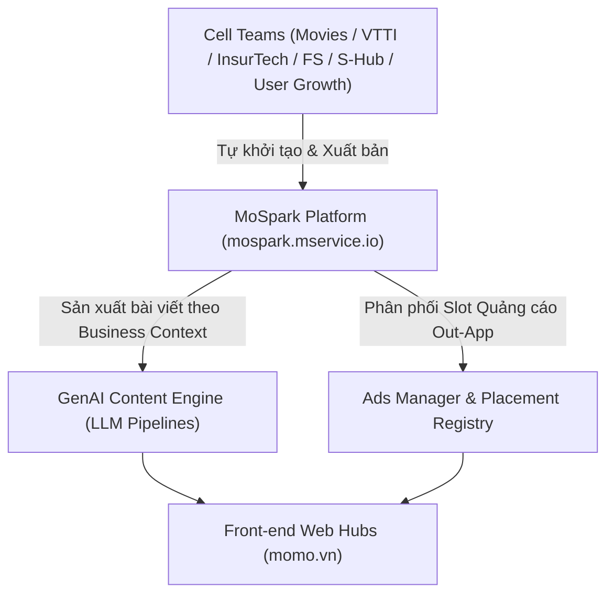

# BÁO CÁO TỔNG HỢP CHIẾN LƯỢC VÀ QUY HOẠCH HUBS (WEB PLATFORM H2/2026)

## 1. BỐI CẢNH CHIẾN LƯỢC & MÔ HÌNH PHÂN TẦNG CÁC WEB HUBS

### 1.1 Thách Thức & Định Hướng Chuyển Dịch
Trước H2/2026, các dịch vụ out-app trên Kênh Web MoMo bị phân mảnh theo từng trang đích rời rạc, chưa tối ưu hóa hành trình người dùng và thiếu sự kết nối với hạ tầng sản phẩm In-App.

Giai đoạn H2/2026 (T9 - T12/2026), Web Platform chính thức triển khai chiến lược **Product-Led Growth (PLG)** kết hợp **SEO/GEO AI Discovery**, tái cấu trúc toàn bộ cổng thông tin out-app thành các **Web Hubs Cốt Lõi**.

### 1.2 Phân Tầng Chiến Lược & Định Vị Vai Trò
Theo chỉ đạo chiến lược từ Ban Giám Đốc, các Web Hubs được phân định rõ rệt theo 3 tầng chiến lược và 2 nhóm vai trò phễu:

* **Phân tầng Chiến lược (Strategic Tiering):**
  * **Foundation (Nền tảng & Giữ nhịp Baseline):** Cinema Hub (động cơ lưu lượng tự nhiên liên tục).
  * **Transformation (Dịch chuyển & Nâng cấp bứt phá):** Vehicle Hub (chuyển đổi từ tiện ích Phạt nguội) và Financial Hub (chuyển đổi thành Web App tài chính cá nhân).
  * **Incubator (Dự án ươm tạo):** Student Hub (tiếp cận tệp Gen Z), New User Hub và SMEs Merchant Hub (chuyển đổi O2O cho hộ kinh doanh).
* **Định vị Vai trò Phễu (Funnel Role):**
  * **Traffic Feeders (Đầu phễu thu hút lưu lượng truy cập mới):** Cinema Hub, Vehicle Hub, Financial Hub, New User Hub.
  * **Engagement Feeders (Tăng cường tương tác & Gắn kết người dùng):** Student Hub, SMEs Merchant Hub.

### 1.3 Quy Hoạch Tổng Quan Các Web Hubs (Chốt Alignment Cell Teams)

* **Cinema Hub (`momo.vn/cinema`):**
  * Business Context: Cinema Hub từng là động cơ kéo lưu lượng tự nhiên (Organic Traffic) out-app lớn nhất ngoài mảng tài chính tại MoMo, nhưng gặp điểm nghẽn chuyển đổi do rào cản bắt buộc tải App để hoàn tất thanh toán vé rạp; sang H2/2026, dự án tái cấu trúc toàn diện trên hạ tầng MoSpark thúc đẩy tăng trưởng và bổ sung luồng thanh toán QR Code trực tiếp ngoài Web.
  * Trạng thái: Alignment | Division/Team: Web Platform x MDS-Movies.
  * Use Case: Movies.
  * Mục tiêu Web (Web Objectives): Total Traffic (8.070.056 PageViews) | Organic Traffic (4.020.082 Visits) | Booking Clicks (1.740.934 Clicks) | W2A CR (>= 4.50%).
  * Mục tiêu App (App Objectives): Login App (76.158 W2A Users) | Transactions (97.660 Trans) | Tickets Sold (214.292 vé).
* **Vehicle Hub (`momo.vn/tien-ich-giao-thong`):**
  * Business Context: Thị trường tra cứu vi phạm giao thông và thông tin xe cộ out-app có dung lượng tìm kiếm khổng lồ với tần suất thường nhật; Vehicle Hub định vị là Cổng dịch vụ All-in-One kết hợp phễu Tra cứu Phạt nguội biển số xe làm phễu tra cứu miễn phí ngoài Web thành phễu bán chéo các sản phẩm thương mại In-App như Bảo hiểm Ô tô/Xe máy và nạp phí không dừng ETC.
  * Trạng thái: Alignment | Division/Team: Web Platform x InsurTech x VTTI.
  * Use Case: Phạt Nguội/DVC, Bảo Hiểm ô tô, Bảo hiểm xe máy, Epass.
  * Mục tiêu Web (Web Objectives): Total Traffic 500.000/Tháng | W2A CR: 50%.
  * Mục tiêu App (App Objectives): Login App: 250.000 users/tháng | Saved Vehicle Profile: 100.000.
* **Financial Hub (`momo.vn/tai-chinh`):**
  * Business Context: Người dùng có xu hướng tìm kiếm và so sánh các công cụ tài chính cá nhân out-app trước khi giao dịch; Financial Hub vận hành bộ Simulator Widget (giá vàng, tỷ giá, tiết kiệm, chứng khoán) và Chuyên trang Điểm CIC, giúp định hình điểm chạm tài chính tin cậy ngoài Web để người dùng thẩm thấu giá trị trước khi điều hướng mở dịch vụ trên App MoMo. *(Redirect 301 từ /trung-tam-tai-chinh sang /tai-chinh)*.
  * Trạng thái: Alignment | Division/Team: Web Platform x FinHub.
  * Use Case: CIC, Finhub, Vay Nhanh, Ví Trả Sau.
  * Mục tiêu Web (Web Objectives): Total Traffic: 1M/Tháng | W2A CR: 50%.
  * Mục tiêu App (App Objectives): MAU: 500.000users/tháng.
* **Student Hub (`momo.vn/sinh-vien`):**
  * Business Context: Tệp Gen Z (U18-U22) nhạy cảm về giá có nhu cầu lớn về cẩm nang học đường và ưu đãi sinh viên out-app; Student Hub xây dựng cổng ưu đãi và hạ tầng xác thực danh tính sinh viên (MSSV/Email .edu.vn), giúp tiếp cận tệp người dùng trẻ ngay từ điểm chạm tìm kiếm tự nhiên của Google làm phễu ươm tạo trước khi kích hoạt dịch vụ tài chính In-App.
  * Trạng thái: Planning | Division/Team: Web Platform x MDS.
  * Use Case: Student Pass, Billpay, OTA.
  * Mục tiêu Web (Web Objectives): TBU.
  * Mục tiêu App (App Objectives): TBU.
* **New User Hub (`momo.vn/new-user`):**
  * Business Context: Người dùng mới luôn có tâm lý nghi ngại và muốn thẩm thấu 60-70% giá trị dịch vụ trước khi cài đặt; New User Hub vận hành mô hình "Trải Nghiệm Trước, Cài Đặt Sau" giữa Content kết hợp Utility Store thúc đẩy Install.
  * Trạng thái: Planning | Division/Team: Web Platform x User Growth.
  * Use Case: New User.
  * Mục tiêu Web (Web Objectives): TBU.
  * Mục tiêu App (App Objectives): Install: 30,000 users.
* **SMEs Merchant Hub (`momo.vn/merchant`):**
  * Business Context: Hộ kinh doanh SME có cửa hàng offline nhưng chưa số hóa trên Internet. SME Merchant Hub cung cấp mẫu trang MoMo Merchant Page, vừa đóng vai trò Sales Kit cho Salesman đi thị trường (on-field) tư vấn trực tiếp, vừa kéo khách hàng địa phương đến cửa hàng offline.
  * Trạng thái: Planning | Division/Team: Web Platform x SMEs Offline Payment.
  * Use Case: Soundbox, SMEs Payment.
  * Mục tiêu Web (Web Objectives): TBU.
  * Mục tiêu App (App Objectives): TBU.

### 1.4 Mô Hình Phối Hợp (Engagement Model) & Tiếp Cận KPIs H2/2026

#### 1. Context & Bối Cảnh Chuyển Đổi (H1 vs H2/2026)
* **Thực trạng H1/2026 (Platform Engineer Team):** Web Platform đóng vai trò là Team phát triển kỹ thuật thuần túy, xây dựng tính năng sản phẩm thụ động theo nhu cầu rời rạc của từng Cell Team; các Use Cases phát triển thiếu định hướng chiến lược tổng thể dài hạn.
* **Thách thức Đầu Q3/2026:** Tiến hành rà soát 20+ Use Cases thuộc nhiều Cell Teams ở tất cả các Division. Mỗi dự án có những mục tiêu rất khác nhau, gây khó khăn trong việc đo lường và đóng góp vào mục tiêu chung.
* **Tái định vị Chiến lược H2/2026 (Growth Unit):** Tái định vị từ Engineer Team sang **Growth Unit**, sở hữu **MoSpark AI-Powered Platform** để thúc đẩy **Traffic Authority 6M MUV/tháng**.

#### 2. Chuẩn Hóa Tập Chỉ Số Chung (Standardize Key Metrics)
Từng bước quy đổi các mục tiêu riêng lẻ về 3 tầng chỉ số đơn giản, đo lường được công khai:
* **Web Metrics:** Total Traffic (6.000.000 MUV/tháng), CTA CTR (10 - 15%).
* **App Metrics:** Login App (W2A Users), MEU Active.
* **Business Impact:** MEU / MAU, Transactions / Revenue.

#### 3. Quy Trình Phối Hợp (Engagement Model 4 Bước)

* **Bước 1 — Tiếp nhận Đề bài (BU Context):** BU cung cấp bối cảnh kinh doanh (Business Context), nhu cầu Use Case và chỉ số mục tiêu App (**Business Metrics: MEU, MAU, Transactions, Revenue**).
* **Bước 2 — Thống nhất Giải pháp & Chỉ số Web (Web Alignment):** Web Platform thiết kế hạ tầng PLG Web Hub, định hình cấu trúc URL và thống nhất chỉ số Kênh Web (**Web Metrics: MPV, CTR**).
* **Bước 3 — Triển khai & Vận hành Nội dung (Build & Content Production):** Web Platform xây dựng hạ tầng/UI MoBase và sản xuất bài viết pSEO/GEO qua MoSpark GenAI. BU/Cell Team duyệt bài và chủ động xuất bản chiến dịch.
* **Bước 4 — Đo lường & Báo cáo ROI (Tracking & Attribution):** Hệ thống Umami Analytics & Edge Cookie tự động ghi nhận luồng chuyển đổi Web-to-App, đồng bộ dữ liệu về BigQuery phục vụ báo cáo Ban Giám Đốc.

#### 4. Kế Hoạch Đánh Giá Q3 Review & Thực Thi Q4 Execution

<table style="width:100%; border-collapse:collapse; border:1.5px solid #64748b; margin:1em 0; font-size:0.9em;">
  <thead>
    <tr style="background-color:#f1f5f9;">
      <th style="border:1.5px solid #64748b; padding:8px 12px; text-align:left; font-weight:700;">Giai Đoạn</th>
      <th style="border:1.5px solid #64748b; padding:8px 12px; text-align:left; font-weight:700;">Chi Tiết Triển Khai & Đánh Giá Tăng Trưởng (Uplift)</th>
    </tr>
  </thead>
  <tbody>
    <tr>
      <td style="border:1px solid #94a3b8; padding:8px 12px; text-align:left;"><strong>Q3 Review (Đánh giá Uplift đồng loạt 3 tầng dự án)</strong></td>
      <td style="border:1px solid #94a3b8; padding:8px 12px; text-align:left;">• <strong>Foundation (Cinema Hub):</strong> Đo lường mức Uplift CVR & Vé bán khi tháo gỡ điểm nghẽn bằng luồng Thanh toán QR trực tiếp ngoài Web. • <strong>Transformation (Vehicle & Financial Hubs):</strong> Đo lường mức Uplift quy mô Traffic & Chuyển đổi khi gom các tiện ích rời rạc (<em>Phạt nguội, BH, CIC</em>) thành các Master Hubs. • <strong>Incubator (Student & SMEs Hubs):</strong> Đo lường chỉ số Baseline ban đầu (<em>Initial CVR & Traffic</em>) sau khi xuất bản MVP trên MoSpark CMS làm đòn bẩy bùng nổ cho Quý 4.</td>
    </tr>
    <tr style="background-color:#f8fafc;">
      <td style="border:1px solid #94a3b8; padding:8px 12px; text-align:left;"><strong>Q4 Execution (Cơ chế Phân bổ Nguồn lực & Scale Up)</strong></td>
      <td style="border:1px solid #94a3b8; padding:8px 12px; text-align:left;">• <strong>Scale Up Nhóm Hiệu Suất Cao:</strong> Các dự án đạt hoặc vượt chỉ số Uplift trong Q3 sẽ được dồn 70% tài nguyên Media & Off-page Traffic để nhân rộng quy mô, kéo toàn bộ Kênh Web bứt phá đạt mốc <strong>Target 6.000.000 MUV/tháng</strong>. • <strong>Optimize Nhóm Cần Tối Ưu:</strong> Các dự án chưa đạt mức Uplift sẽ được đánh giá, revamp sản phẩm và revise lại Objectives. • <strong>Expand Nhóm Incubator:</strong> Sử dụng số liệu Baseline đã đo lường từ Q3 (<em>Student Hub, SMEs Merchant Hub</em>) để mở rộng quy mô sản xuất nội dung & utilities tool theo định hướng Content Strategy.</td>
    </tr>
  </tbody>
</table>

## 2. HẠ TẦNG NỀN TẢNG: MOSPARK PLATFORM (mospark.mservice.io)

### 2.1 Trái Tim Backend Của Các Web Hubs
Toàn bộ các Web Hubs được vận hành trên hạ tầng backend tập trung **MoSpark Platform** (`mospark.mservice.io`). MoSpark cho phép các Cell Team (Movies BU, VTTI BU, InsurTech BU, FS BU, S-Hub, User Growth) tự tạo và quản lý nội dung theo chuẩn thiết kế MoBase mà không phụ thuộc vào nguồn lực phát triển thủ công của Web Dev.

1. **PM/PO Self-Service (MoBase Landing Page Builder):** Cho phép PM/PO các Cell Team tự tạo Landing Page và Widget theo chuẩn thiết kế MoBase Design System trong 1-2 ngày thay vì chờ 1-2 tuần Dev sprint.
2. **GenAI Production Engine & Anti-Cannibalization:** Vận hành quy trình sản xuất nội dung 7 bước dựa trên Business Context (12 fields) do PM xác nhận; kiểm tra Keyword Master Registry để tránh trùng lặp từ khóa (1 Keyword = 1 URL) và triển khai hạ tầng `llms.txt` cho AI Search.
3. **Ads Manager & Web-to-App Attribution:** Quản trị tập trung các slot quảng cáo out-app (Native Widget, Balloon, Banner), giảm xung đột hiển thị giữa các Division và đo lường luồng chuyển đổi người dùng từ Web vào App (W2A CVR) qua Umami và AppsFlyer.
4. **Phân định Scope Ranh giới Vận hành:** Bài toán tối ưu xếp hạng SEO/GEO thuộc Scope chuyên môn của Media Team. Web Software Team tập trung phát triển hạ tầng kỹ thuật MoSpark, tối ưu UI/UX MoBase, tự động hóa pSEO và đảm bảo hiệu năng tải trang.

## 3. BÁO CÁO CHI TIẾT CÁC WEB HUBS (BÁO CÁO CHUẨN C-LEVEL)

### Dashboard Hiệu Suất 5 Strategic Hubs (Cập Nhật MTD 26/09/2026 - 26 Ngày)

| Web Hub | Phân loại 4 Zone | Actual MTD 26d (01-26/09) | Daily Pace | Forecast 30d | Target Sept | % Projected | Trạng Thái Vận Hành MTD 26d |
| :--- | :--- | :---: | :---: | :---: | :---: | :---: | :--- |
| **New User Hub** | Transformation | **369.416 PV** | 14.208/d | **426.249 PV** | 300.000 PV | **142.1%** | **VƯỢT TARGET HUB CHÍNH THỨC (+42.1%)** |
| **Cinema Hub** | Performance | **1.033.573 PV** | 39.753/d | **1.192.584 PV** | 1.500.000 PV | **79.5%** | **CỘT MỐC VƯỢT >1M PV MTD**, Movie Booking & Cineplex UI |
| **Financial Hub** | Transformation | **224.768 PV** | 8.645/d | **259.348 PV** | 500.000 PV | **51.9%** | CIC Score, Vay Nhanh & Widget Lương/Tỷ Giá |
| **Vehicle Hub** | Transformation | **60.444 PV** | 2.325/d | **69.743 PV** | 200.000 PV | **34.9%** | Phạt nguội API, Staging Garage & BH Ô tô Ads |
| **Student Hub** | Incubator | **6.356 PV** | 244/d | **7.334 PV** | 100.000 PV | **7.3%** | University Ratings & Student Pass |
| **TỔNG CỘNG HUBS** | All Zones Summary | **1.694.557 PV** | 65.175/d | **1.955.258 PV** | 2.600.000 PV | **75.2%** | Chiếm 49.6% tổng lưu lượng toàn Kênh Web |

---

### 3.1. Cinema Hub (momo.vn/cinema)

#### 1. Key Highlights & Business Impact
* **Business Context:** Cinema Hub từng là động cơ kéo lưu lượng tự nhiên (Organic Traffic) out-app lớn nhất ngoài mảng tài chính tại MoMo. Trong H2/2026, dự án tái cấu trúc toàn diện trên hạ tầng MoSpark thúc đẩy tăng trưởng và bổ sung luồng thanh toán QR Code trực tiếp ngoài Web.
* **Trạng thái Alignment:** VP/BU Head Alignment (Phối hợp giữa Web Platform x MDS-Movies BU).
* **Mục tiêu Chiến lược:** Mở rộng quy mô lượt xem trang, tối ưu thứ hạng từ khóa xếp hạng phim trên Google Search/AI Search và chuẩn hóa vị trí nút CTA để thúc đẩy bán vé rạp.

#### 2. Success Metrics (Bộ Chỉ Số Chuẩn Hóa Web & Business)
* **Web Metrics (Chỉ số Kênh Web):**
  * `MPV (Monthly Page Views)`: 1.300.000 PageView/tháng *(Tích lũy H2: 8.070.056 PageViews)*
  * `CTR (Click-Through Rate)`: ≥ 4.50%
* **Business Metrics (Chỉ số Tác động Kinh doanh):**
  * `MEU (Monthly Engaged Users)`: ~13.000 Users/tháng *(Login App W2A tích lũy H2: 76.158 Users)*
  * `Transactions/month`: ~16.000 Giao dịch/tháng *(Tích lũy H2: 97.660 Giao dịch)*
  * `Tickets Sold/month`: ~35.000 Vé rạp/tháng *(Tích lũy H2: 214.292 Vé rạp)*

#### 3. Cross-team Collaboration & Support Needed
* **MDS-Movies BU:** Sở hữu mục tiêu doanh số vé rạp; cung cấp API lịch chiếu, giá vé đối tác rạp và phối hợp thử nghiệm các chiến dịch phim rạp mới.
* **Web Platform Content Team:** Tự chủ 100% quy trình sản xuất nội dung bài viết review/tin tức điện ảnh qua MoSpark GenAI Pipeline, không lệ thuộc vào nguồn lực Cell Team.

#### 4. Priorities & Action Items (Kế Hoạch & Tiến Độ Thực Thi)
* **Go-live UI/UX Mới Trang Rạp (Thí điểm NCC):** Đã Go-live giao diện UI/UX trang rạp mới, đang áp dụng thử nghiệm tại **Trung Tâm Chiếu Phim Quốc Gia (NCC)** để đánh giá hiệu suất Impression/Click CTR trước khi roll-out toàn bộ, bảo vệ traffic của các cụm rạp best-performing (CGV, Lotte, Galaxy).
* **Reusable Mini Game Framework cho Phim:** Hoạch định và xây dựng mô-đun Mini Game tương tác đơn giản dạng Reusable Framework áp dụng đồng loạt cho tất cả các đầu phim chiếu rạp.
* **Tự Chủ Sản Xuất Blog Content:** Duy trì tự chủ sản xuất nội dung bài viết điện ảnh qua MoSpark GenAI Pipeline để phủ từ khóa tìm kiếm tự nhiên.
* **Xây dựng Trang Diễn Viên chuẩn SEO Entity (Actor Pages):** Khởi chạy các trang Profile Diễn Viên điện ảnh (Hồng Đào, Võ Tấn Phát) để đón đầu tìm kiếm tự nhiên.

---

### 3.2. Vehicle Hub (momo.vn/tien-ich-giao-thong)

#### 1. Key Highlights & Business Impact
* **Business Context:** Thị trường tra cứu vi phạm giao thông và thông tin xe cộ out-app có dung lượng tìm kiếm khổng lồ với tần suất thường nhật. Vehicle Hub định vị là Cổng dịch vụ All-in-One kết hợp phễu Tra cứu Phạt nguội biển số xe 0-CAPTCHA làm điểm chạm miễn phí ngoài Web thành phễu bán chéo các sản phẩm thương mại In-App như Bảo hiểm Ô tô/Xe máy và nộp phí không dừng ETC.
* **Trạng thái Alignment:** VP/BU Head Alignment (Phối hợp giữa Web Platform x InsurTech BU x VTTI BU).
* **Mục tiêu Chiến lược:** Dịch chuyển Vehicle Hub thành trụ cột tăng trưởng chiến lược số 1 out-app, tập trung 4 Use Cases: Phạt Nguội/DVC, Bảo hiểm ô tô, Bảo hiểm xe máy, Epass.

#### 2. Success Metrics (Bộ Chỉ Số Chuẩn Hóa Web & Business)
* **Web Metrics (Chỉ số Kênh Web):**
  * `MPV (Monthly Page Views)`: 500.000 PageView/tháng
  * `CTR (Click-Through Rate)`: 50.00%
* **Business Metrics (Chỉ số Tác động Kinh doanh):**
  * `MEU (Monthly Engaged Users)`: 250.000 Users/tháng *(Login App W2A)*
  * `Saved Vehicle Profile`: 100.000 Hồ sơ xe tích lũy *(phục vụ Master Target 500.000 Thẻ Xe Số In-App)*

#### 3. Cross-team Collaboration & Support Needed
* **InsurTech BU:** Phối hợp triển khai chiến dịch Ads **550 triệu VND (đến hết 2026)** cho Bảo Hiểm Ô Tô, tối ưu UI/UX trang đích và acquire New User.
* **VTTI BU:** Cung cấp dữ liệu vị trí trạm sạc, cây xăng và garage sửa xe toàn quốc; bảo đảm ổn định API Phạt Nguội.

#### 4. Priorities & Action Items (Kế Hoạch & Tiến Độ Thực Thi)
* **Staging & Go-live Trang Tìm Garage:** Đã hoàn thành đưa lên **Staging** trang **Tìm Garage (`/tien-ich-giao-thong/tim-garage`)**, dự kiến chính thức **Go-live trước khi hết Tháng 09/2026**.
* **Đồng Hành InsurTech BU & Campaign Ads 550 triệu:** Phối hợp hỗ trợ Cell Team triển khai bài viết Blog cho Bảo Hiểm Ô Tô (chạy ngân sách Ads 550tr hết 2026), tối ưu UI/UX và phễu acquire New User.
* **Tự Chủ Sản Xuất Content PLG:** Web Platform Team tiếp tục chủ động sản xuất bài viết chuyên sâu trên các dự án PLG (Phạt nguội, Giá xăng, Trạm sạc, Đăng kiểm).
* **Duy Trì Hạ Tầng 0-CAPTCHA & Phạt Nguội Post-API:** Đảm bảo hệ thống tra cứu phạt nguội hoạt động mượt mà sau khi API nối lại kết nối từ 20/09.

---

### 3.3. Financial Hub (momo.vn/tai-chinh)

#### 1. Key Highlights & Business Impact
* **Business Context:** Người dùng có xu hướng tìm kiếm và so sánh các công cụ tài chính cá nhân out-app trước khi giao dịch. Financial Hub vận hành bộ Simulator Widget và Chuyên trang Điểm Tín Dụng CIC, giúp định hình điểm chạm tài chính tin cậy ngoài Web *(URL chính thức: `momo.vn/tai-chinh`, 301 redirect từ `/trung-tam-tai-chinh`)*.
* **Trạng thái Alignment:** VP/BU Head Alignment (Phối hợp giữa Web Platform x FinHub BU).
* **Mục tiêu Chiến lược:** Xây dựng Trung tâm tương tác tài chính cá nhân out-app (`/tai-chinh`) và Chuyên trang tra cứu điểm tín dụng CIC (`/diem-tin-dung`).

#### 2. Success Metrics (Bộ Chỉ Số Chuẩn Hóa Web & Business)
* **Web Metrics (Chỉ số Kênh Web):**
  * `MPV (Monthly Page Views)`: 1.000.000 PageView/tháng
  * `CTR (Click-Through Rate)`: 50.00%
* **Business Metrics (Chỉ số Tác động Kinh doanh):**
  * `MEU (Monthly Engaged Users)`: 500.000 Users/tháng *(Active MAU/MEU từ nguồn Web)*

#### 3. Cross-team Collaboration & Support Needed
* **Inbound Content Team:** Phối hợp chặt chẽ triển khai quy trình sản xuất, viết và duyệt nội dung Blog tài chính đạt chuẩn E-E-A-T / YMYL.
* **FinHub Cell Team:** Phối hợp làm **Tool & Page Chứng Chỉ Quỹ (`/tai-chinh/chung-chi-quy`)** và nghiệm thu Staging trang Phân Bổ Lương.

#### 4. Priorities & Action Items (Kế Hoạch & Tiến Độ Thực Thi)
* **Hoàn Thiện Trang Chủ Master Hub (`/tai-chinh`):** Đã hoàn thiện trang chủ Tài Chính hiển thị bộ 7 Utilities nổi bật: CIC, Tính Lương, Phân Bổ Lương, Tỷ Giá, Giá Vàng, Ví Trả Sau, Vay Nhanh.
* **Go-live 3 Trang Chi Tiết:** Đã Go-live chính thức 3 sub-page: **Tính Lương (`/tai-chinh/tinh-luong`)**, **Tỷ Giá (`/tai-chinh/ty-gia`)**, **Giá Vàng (`/tai-chinh/gia-vang`)**.
* **Staging Trang Phân Bổ Lương:** Đã hoàn tất đưa lên **Staging** trang **Phân Bổ Lương (`/tai-chinh/phan-bo-luong`)**.
* **Phát Triển Tool & Page Chứng Chỉ Quỹ Phase 2:** Đang trong quá trình phối hợp với Cell Team phát triển Tool và Page Chứng Chỉ Quỹ (`/tai-chinh/chung-chi-quy`).
* **Phối Hợp Inbound Content:** Triển khai quy trình phối hợp viết và duyệt content blog tài chính đồng bộ với các công cụ vừa go-live.

---

### 3.4. Student Hub (momo.vn/sinh-vien)

#### 1. Key Highlights & Business Impact
* **Business Context:** Tệp Gen Z (U18-U23) nhạy cảm về giá có nhu cầu lớn về cẩm nang học đường và ưu đãi sinh viên out-app. Student Hub phát triển mạng lưới Student Pass Ambassador tại các trường đại học, chuyên mục Student Pass Webinar/Workshop và hạ tầng xác thực danh tính sinh viên (.edu.vn / MSSV), giúp tiếp cận tệp người dùng trẻ ngay từ điểm chạm tìm kiếm tự nhiên của Google làm phễu ươm tạo trước khi kích hoạt dịch vụ tài chính In-App.
* **Trạng thái Alignment:** VP/BU Head Alignment (Phối hợp giữa Web Platform x MDS / Student Pass BU).
* **Mục tiêu Chiến lược:** Gia tăng traffic và kích hoạt Student Pass, tăng nhận diện top-of-mind của thương hiệu Student Pass với sinh viên và mở rộng hợp tác với các trường đại học.

#### 2. Success Metrics (Bộ Chỉ Số Chuẩn Hóa Web & Business)
* **Web Metrics (Chỉ số Kênh Web):**
  * `MPV (Monthly Page Views)`: 167.000 PageView/tháng *(500.000 PageView / Q4)*
  * `CTR (Click-Through Rate)`: 15.00% *(khung baseline: 10.00% - 15.00%)*
* **Business Metrics (Chỉ số Tác động Kinh doanh):**
  * `MEU (Monthly Engaged Users)`: 1.500.000 Student Pass MEU *(tổng lũy kế tệp active)*
  * `Verified Students/month`: ~11.667 Sinh viên xác thực mới/tháng *(70.000 Verified Students Q3 - Q4)*

#### 3. Cross-team Collaboration & Support Needed
* **MDS / Student Pass BU:** Đồng hành chủ trì chương trình Student Pass Ambassador, cung cấp nội dung diễn giả cho Student Pass Webinar và duyệt thông tin ưu đãi đối tác giáo dục.

#### 4. Priorities & Action Items (Kế Hoạch & Tiến Độ Thực Thi)
* **Cung cấp Công cụ Self-Serve Trang School Detail:** Đã bàn giao công cụ tự phục vụ (Self-serve / Page Builder) cho Cell Team (S-Hub BU) chủ động quản lý, chỉnh sửa và vận hành trang **School Detail** (Chi tiết Trường Đại Học / Ratings) không phụ thuộc Dev.
* **Phase 1 (Q3 - Q4):** Phát triển hạ tầng University Review/Rating & Khởi chạy mạng lưới Student Pass Ambassador tại các trường đại học.
* **Phase 2 (Q4):** Xây dựng và phát hành chuyên mục Student Pass Webinar / Workshop trên Kênh Web MoMo.

---

### 3.5. New User Hub (momo.vn/new-user)

#### 1. Key Highlights & Business Impact
* **Business Context:** Người dùng mới luôn có tâm lý nghi ngại và muốn thẩm thấu 60-70% giá trị dịch vụ trước khi cài đặt. New User Hub vận hành mô hình "Trải Nghiệm Trước, Cài Đặt Sau" giữa Content kết hợp Utility Store thúc đẩy Install ứng dụng.
* **Trạng thái Alignment:** Waiting (Đang chờ thống nhất nguồn lực với User Growth Team).
* **Mục tiêu Chiến lược:** Tùy biến Hero Section và gói quà tặng theo từng phân khúc khách hàng qua Dynamic Parameters; vận hành Utility Store và cơ chế "Đi chợ" chọn 3/10 quà bỏ giỏ hàng trước khi cài App.

#### 2. Success Metrics (Bộ Chỉ Số Chuẩn Hóa Web & Business)
* **Web Metrics (Chỉ số Kênh Web):**
  * `Impression / MPV`: Pageview/month
  * `CTR (Click-Through Rate)`: 17.00% *(dựa trên Avg Ads %CR)*
* **Business Metrics (Chỉ số Tác động Kinh doanh):**
  * `Install/month`: 20.000 - 30.000 Installs mới/tháng

#### 3. Cross-team Collaboration & Support Needed
* **User Growth Team:** Định nghĩa bộ quy tắc quà tặng, ngân sách thu hút người dùng mới và phối hợp chạy các chiến dịch kéo traffic (SEO, Paid Media, Viral Seeding).

#### 4. Priorities & Action Items (Kế Hoạch & Tiến Độ Thực Thi)
* **Web Platform Team:** Xây dựng hạ tầng kỹ thuật Smart Landing Page (`momo.vn/new-user`), Utility Store và cơ chế truyền Dynamic Parameters vào App.

---

### 3.6. SMEs Merchant Hub (momo.vn/merchant)

#### 1. Key Highlights & Business Impact
* **Business Context:** Hộ kinh doanh SME có cửa hàng offline nhưng chưa số hóa trên Internet. SME Merchant Hub cung cấp mẫu trang MoMo Merchant Page, vừa đóng vai trò Sales Kit cho Salesman đi thị trường (on-field) tư vấn trực tiếp, vừa kéo khách hàng địa phương đến cửa hàng offline.
* **Trạng thái Alignment:** Planning (Phối hợp giữa Web Platform x SMEs Offline Payment Team).
* **Mục tiêu Chiến lược:** Xây dựng diện mạo số cho cửa hàng offline, hỗ trợ lực lượng Salesman tư vấn bán hàng trực tiếp on-field dịch vụ Ví Trả Sau & thiết bị Loa Soundbox.

#### 2. Success Metrics (Bộ Chỉ Số Chuẩn Hóa Web & Business)
* **Web Metrics (Chỉ số Kênh Web):**
  * `Merchant Pages Live`: 500 - 1.000 Trang Merchant Pages hoạt động
  * `Local Organic Impressions`: Tăng trưởng lượt hiển thị tìm kiếm địa phương
* **Business Metrics (Chỉ số Tác động Kinh doanh):**
  * `Sales Enablement Rate`: Tỷ lệ hỗ trợ chốt đơn cho đội ngũ Salesman đi thị trường
  * `Soundbox Orders`: Số lượng đơn hàng đăng ký lắp đặt loa Soundbox
  * `New VTS Users`: Số người dùng mới kích hoạt Ví Trả Sau từ trang Merchant

#### 3. Cross-team Collaboration & Support Needed
* **SMEs Offline Payment Team / BD:** Trực tiếp đi thị trường (on-field), chốt Use Cases trọng tâm và chỉ số mục tiêu kinh doanh.

#### 4. Priorities & Action Items (Kế Hoạch & Tiến Độ Thực Thi)
* **MoSpark Admin & Builder:** Phát triển thư viện giao diện Merchant Page chuẩn MoBase Design System và xây dựng luồng khởi tạo 2 phút trên Web Mobile cho Salesman thao tác khi đi thị trường.

---

## 4. LỘ TRÌNH TRIỂN KHAI & CỘT MỐC THỰC THI (ROADMAP & MILESTONES)

* **Phase 1 (Tháng 08/2026) - Hạ Tầng MoSpark & Chuẩn Bị Sản Phẩm:** Triển khai MoSpark CMS cho 5 Hubs, Captcha Module 0-CAPTCHA Phạt Nguội, Native Web QR Payment Cinema, Prototype New User Hub & Dynamic Parameters, Simulator Widget Finhub.
* **Phase 2 (Tháng 09/2026) - Go-Live Master Pages & Triển Khai Thực Địa:** Go-live Master Page `/tien-ich-giao-thong`, `/tai-chinh` và New User Hub. Phối hợp S-Hub chạy Tour đại học (Tháng 8-9). Thí điểm 50 Merchant Pages O2O đầu tiên.
* **Phase 3 (Tháng 10 - 11/2026) - Tối Ưu Hóa & Mở Rộng Quy Mô:** Scale chiến dịch New User Hub (30K Installs), đẩy mạnh GenAI Content Pipeline cho các Hubs, tối ưu luồng Auto-fill Vehicle Profile, mở rộng 500-1.000 Merchant Pages.
* **Phase 4 (Tháng 12/2026) - Tổng Kết H2 & Chuẩn Bị Chiến Dịch CIC:** Đạt mốc 214.292 vé Cinema, 260K Thẻ Xe Số Vehicle Hub, 30K Installs từ New User Hub, hoàn thiện hạ tầng sẵn sàng đón bùng nổ chiến dịch CIC toàn dân.
* **Phase 5 (01/01/2027) - Bùng Nổ Chiến Dịch CIC Toàn Dân:** Kích hoạt chiến dịch tra cứu điểm tín dụng CIC toàn dân miễn phí trên `/diem-tin-dung`, đón mốc reset đợt tra cứu toàn dân và tối ưu chuyển đổi In-App.

## 5. CHUẨN HÓA BẢNG CHỈ SỐ ĐO LƯỜNG (METRIC TAXONOMY)

Hiệu suất Kênh Web và tác động chuyển đổi sang App được đo lường hoàn toàn theo số tuyệt đối (Absolute Numbers) và phân rã thành 2 tầng rõ ràng:

* **Kênh Web (Web Platform Metrics):**
  * `Total Traffic (PageViews)`: Tổng lưu lượng truy cập xem trang trên Web.
  * `Organic Traffic (Visits)`: Tổng lượt truy cập tự nhiên từ Google / AI Search.
  * `User Installs`: Số lượt tải/cài đặt App thành công sinh ra từ phễu Web.
  * `W2A CR (%CR)`: Tỷ lệ nhấp nút hành động hoặc tỷ lệ chuyển đổi Web-to-App.
* **Kênh App (App Objectives & Impact):**
  * `Login App (W2A Users)`: Số người dùng mở/đăng nhập App thành công từ phễu Web.
  * `Transactions / Saved Vehicle Profile`: Số lượng giao dịch thành công hoặc số Hồ sơ xe định danh tích lũy từ phễu Web.
