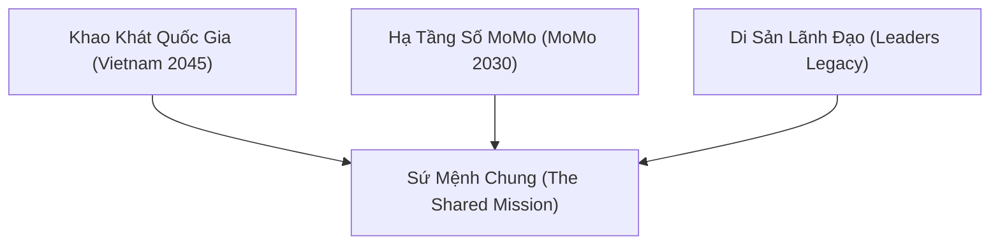

# Báo Cáo Tóm Tắt Nội Dung Town Hall Tháng 7/2026

* Ngày công bố: 31/07/2026
* Sự kiện: Town Hall Tháng 7/2026
* Chủ đề cốt lõi: Sứ Mệnh Chung (The Shared Mission) và Định Hướng Chiến Lược Ban Điều Hành
* Báo cáo từ: Ban Điều Hành (BOM)

---

## 1. Tóm Tắt Điều Hành (Executive Summary)

Buổi Town Hall tháng 7 nhấn mạnh tầm nhìn dài hạn của tổ chức dựa trên giá trị cốt lõi là Niềm tin (Trust). Ban Điều hành đã làm rõ các tin đồn về việc thoái vốn, khẳng định đây là hoạt động bình thường theo chu kỳ của các quỹ đầu tư và không làm thay đổi định hướng công ty. Về mặt chiến lược, tổ chức chuyển dịch mạnh mẽ sang giải quyết bài toán thực tế cho tiểu thương (MSME) với mục tiêu giúp họ an tâm bán hàng. Các ưu tiên công nghệ bao gồm ứng dụng AI, tối ưu hóa nền tảng (Platform) và xây dựng sản phẩm tài chính toàn diện. Ban lãnh đạo cam kết cải thiện môi trường làm việc thông qua đơn giản hóa quy trình và tăng tính tự chủ cho đội ngũ.

---

## 2. Phân Tích Tin Đồn Chuyển Nhượng Cổ Phần Và Chu Kỳ Đầu Tư

* Bản chất thông tin: Các bài báo trên trang tin quốc tế và trong nước hiện tại chủ yếu dựa trên tin đồn và chưa có xác nhận chính thức từ các bên liên quan.
* Chu kỳ quỹ đầu tư:
  * Các nhà đầu tư nước ngoài thường có vòng đời quỹ từ 5, 8 đến 10 năm.
  * Sau thời gian đồng hành (có quỹ đã gắn bó 10 năm như Goldman Sachs từ 2013 và đã thoái vốn trước đó), việc thoái vốn để hoàn trả lợi nhuận cho các nhà đầu tư là hoạt động tài chính bình thường.
* Cam kết vận hành: Việc thay đổi cơ cấu cổ đông giữa các nhà đầu tư không gây ra bất kỳ thay đổi nào về định hướng lớn hay hoạt động vận hành hằng ngày. Tổ chức sẵn sàng hỗ trợ nhà đầu tư trong quá trình tìm kiếm đối tác mua lại cổ phần.

---

## 3. Khái Niệm Trung Tâm: Sứ Mệnh Chung (The Shared Mission)

Thông điệp chiến lược kết nối 3 cấp độ mục tiêu từ Vĩ mô Quốc gia, Tầm nhìn Tổ chức đến Trách nhiệm và Di sản của Đội ngũ Lãnh đạo.

### 3.1. Vietnam 2045: Khát Vọng Quốc Gia Và Kinh Tế Số
* 3 Động lực xuyên suốt: Thể chế kiến tạo, Kinh tế số đạt 30% GDP vào 2030 (tăng 10% GDP/năm), và Lực lượng nhân tài.
* Lộ trình 4 chặng:
  * 2025 - 2027: Giai đoạn Nền mống (Chuẩn bị, cải cách, đầu tư hạ tầng).
  * 2030: Checkpoint quan trọng (Kinh tế số đạt 30% GDP).
  * 2035 - 2040: Giai đoạn Bứt phá (Năng suất và đổi mới sáng tạo).
  * 2045: Đích đến (GDP đầu người đạt 24.000 USD).

### 3.2. MoMo 2030: Hạ Tầng Số Trung Tâm Và Thâm Canh
* Định vị: Mạch máu số quốc gia, giúp tiền và thông tin chảy liền mạch trên nền tảng niềm tin và công nghệ.
* 5 Trụ cột đóng góp:
  1. Tài chính toàn diện (Financial Inclusion): Phủ sóng dịch vụ tài chính cho tệp underserved, minh bạch hóa dòng vốn.
  2. Thay đổi tư duy tài chính: Chuyển dịch từ tích lũy truyền thống sang đầu tư số.
  3. Số hóa DN nhỏ và siêu nhỏ (MSME Digitalization): Giúp tiểu thương chuyển đổi số an tâm bán hàng.
  4. Đồng hành Chính phủ số: Làm cầu nối thanh toán dịch vụ công (thuế, học phí, viện phí).
  5. Xây dựng Niềm tin số (Digital Trust): Giảm chi phí ẩn và ma sát kinh tế.

---

## 4. Phân Loại Dự Án Chiến Lược Và Big Bets

### 4.1. Phân Loại Ưu Tiên Đầu Tư Theo Mô Hình 3 Zone

<table style="width:100%; border-collapse:collapse; border:1.5px solid #64748b; margin:1em 0; font-size:0.9em;">
  <thead>
    <tr style="background-color:#f1f5f9;">
      <th style="border:1.5px solid #64748b; padding:8px 12px; text-align:left; font-weight:700;">Khu vực (Zone)</th>
      <th style="border:1.5px solid #64748b; padding:8px 12px; text-align:left; font-weight:700;">Đặc điểm vận hành</th>
      <th style="border:1.5px solid #64748b; padding:8px 12px; text-align:left; font-weight:700;">Dự án tiêu biểu</th>
    </tr>
  </thead>
  <tbody>
    <tr>
      <td style="border:1px solid #94a3b8; padding:8px 12px; text-align:left;"><strong>Performance Zone</strong></td>
      <td style="border:1px solid #94a3b8; padding:8px 12px; text-align:left;">Mảng kinh doanh cốt lõi, doanh thu ổn định</td>
      <td style="border:1px solid #94a3b8; padding:8px 12px; text-align:left;">Thanh toán, dịch vụ cơ bản</td>
    </tr>
    <tr style="background-color:#f8fafc;">
      <td style="border:1px solid #94a3b8; padding:8px 12px; text-align:left;"><strong>Transformation Zone</strong></td>
      <td style="border:1px solid #94a3b8; padding:8px 12px; text-align:left;">Dự án Big Bet, khả năng tăng trưởng đột phá (x2 đến x10)</td>
      <td style="border:1px solid #94a3b8; padding:8px 12px; text-align:left;">Dự án Trust, Financial Inclusion</td>
    </tr>
    <tr>
      <td style="border:1px solid #94a3b8; padding:8px 12px; text-align:left;"><strong>Incubator Zone</strong></td>
      <td style="border:1px solid #94a3b8; padding:8px 12px; text-align:left;">Dự án thử nghiệm, nuôi dưỡng tiềm năng tương lai</td>
      <td style="border:1px solid #94a3b8; padding:8px 12px; text-align:left;">Cross-border, FinHub, SU, CM</td>
    </tr>
  </tbody>
</table>

### 4.2. Các "Big Bet" Trong 3 - 5 Năm Tới
* Dự án Trust (Niềm tin): Ưu tiên hàng đầu, tập trung chống lừa đảo, nâng cao chất lượng CSKH và xây dựng lòng tin tuyệt đối.
* Tài chính toàn diện (Financial Inclusion):
  * Mở rộng điểm chấp nhận PayLater (Ví Trả Sau).
  * Phát triển sản phẩm quản lý tài sản (Wealth Management) như Túi Thần Tài.
* Hỗ trợ hộ kinh doanh (SME/MSME): Cung cấp giải pháp công nghệ khai thuế trực tiếp trên ứng dụng cho đối tượng tiểu thương.

---

## 5. Chiến Lược Merchant Và Năng Lực Cạnh Tranh

* Khác biệt với Ngân hàng:
  * Ngân hàng: Tập trung huy động vốn (CASA) và cho vay tín dụng, thường mua giải pháp công nghệ từ bên thứ ba.
  * Tổ chức: Tập trung vào hành vi khách hàng, tự xây dựng giải pháp công nghệ (kết nối trực tiếp hệ thống thuế hỗ trợ Merchant).
* Mối quan hệ Hợp tác - Cạnh tranh: Không cạnh tranh trực tiếp với ngân hàng. Dòng tiền từ thiết bị thanh toán (Loa Sandbox) vẫn về tài khoản ngân hàng. Tổ chức đóng vai trò cánh tay nối dài, sử dụng dữ liệu và AI để hỗ trợ ngân hàng đánh giá điểm tín dụng.
* Triết lý "An tâm bán hàng": Tối ưu quy trình kỹ thuật để tiểu thương chỉ tập trung kinh doanh. Tỷ lệ cuộc gọi bị bỏ lỡ (abandoned call) giảm từ 70% xuống còn 3-5%.

---

## 6. Quản Trị Nhân Sự, Văn Hóa Và Năng Suất Làm Việc

* Tỷ lệ biến động nhân sự (Turnover): Duy trì ở mức bình thường so với thị trường, turnover hợp lý giúp duy trì sự lưu thông và đổi mới.
* Tăng tính gắn kết và mở rộng scope: Khuyến khích nhân sự đa năng (full-stack) để giảm phụ thuộc chéo (dependency), luân chuyển nhân sự làm mới động lực.
* Đầu tư nâng cao năng suất (Productivity): Cam kết đầu tư trang thiết bị (laptop, màn hình) và rà soát triệt để các vấn đề kỹ thuật (như giật lag trên Figma) để giải phóng sức lao động.
* Sáng kiến cộng đồng: Khuyến khích các nhóm nhỏ tự phát (chạy bộ, mindfulness, pickleball) thay cho hội thao quy mô lớn.

---

## 7. Định Hướng Chuyển Hóa Cho Web Platform Team

* Gắn kết dịch vụ công: Phát triển các Web Hubs tiện ích (Phạt Nguội, Dịch vụ hành chính) hỗ trợ người dân tra cứu minh bạch.
* Thực thi thâm canh nền tảng: Tập trung vào PLG Web Tools (Calculators, Simulators, Checkers) có tỷ lệ chuyển đổi Web-to-App (W2A CR > 10%), loại bỏ nội dung mỏng.
## 8. Bảng Tổng Hợp Chi Tiết Q&A Trong Town Hall Tháng 7/2026

Dưới đây là chi tiết các câu hỏi & câu trả lời (Q&A) được Ban Điều Hành (BOM) trực tiếp chia sẻ và giải đáp tại buổi Town Hall:

<table style="width:100%; border-collapse:collapse; border:1.5px solid #64748b; margin:1em 0; font-size:0.88em;">
  <thead>
    <tr style="background-color:#f1f5f9;">
      <th style="border:1.5px solid #64748b; padding:8px; text-align:center; width:5%;">STT</th>
      <th style="border:1.5px solid #64748b; padding:8px; text-align:left; width:20%;">Chủ đề</th>
      <th style="border:1.5px solid #64748b; padding:8px; text-align:left; width:35%;">Câu hỏi của Nhân viên</th>
      <th style="border:1.5px solid #64748b; padding:8px; text-align:left; width:40%;">Phản hồi từ Ban Điều Hành (BOM)</th>
    </tr>
  </thead>
  <tbody>
    <tr>
      <td style="border:1px solid #94a3b8; padding:8px; text-align:center;">1</td>
      <td style="border:1px solid #94a3b8; padding:8px;"><strong>Định hướng & Tin đồn Thoái vốn</strong></td>
      <td style="border:1px solid #94a3b8; padding:8px;">Tin đồn các nhà đầu tư lớn (Goldman Sachs, Warburg Pincus...) thoái vốn có ảnh hưởng đến định hướng lớn của MoMo không?</td>
      <td style="border:1px solid #94a3b8; padding:8px;">Đây là hoạt động bình thường theo chu kỳ quỹ (5-10 năm). Goldman Sachs gắn bó hơn 10 năm từ 2013. Định hướng chiến lược <strong>MoMo 2030 (Mạch máu số)</strong> và sứ mệnh "Tài chính toàn diện" giữ nguyên 100%.</td>
    </tr>
    <tr style="background-color:#f8fafc;">
      <td style="border:1px solid #94a3b8; padding:8px; text-align:center;">2</td>
      <td style="border:1px solid #94a3b8; padding:8px;"><strong>Cạnh tranh Merchant / Loa Soundbox</strong></td>
      <td style="border:1px solid #94a3b8; padding:8px;">Ngân hàng cũng ra mắt QR và Loa thông báo chuyển khoản, MoMo cạnh tranh và tạo khác biệt ra sao?</td>
      <td style="border:1px solid #94a3b8; padding:8px;">Ngân hàng tập trung CASA và cho vay. MoMo làm chủ Tech/AI, xây giải pháp end-to-end cho MSME (hỗ trợ khai thuế, chấm điểm tín dụng). MoMo hợp tác cùng ngân hàng chứ không cạnh tranh trực tiếp. Triết lý: <em>"An tâm bán hàng"</em>.</td>
    </tr>
    <tr>
      <td style="border:1px solid #94a3b8; padding:8px; text-align:center;">3</td>
      <td style="border:1px solid #94a3b8; padding:8px;"><strong>Định hướng AI & Năng suất</strong></td>
      <td style="border:1px solid #94a3b8; padding:8px;">Định hướng ứng dụng AI của công ty như thế nào? AI có thay thế con người không?</td>
      <td style="border:1px solid #94a3b8; padding:8px;">AI không thay thế con người mà thay thế người không biết dùng AI. Công ty đầu tư công cụ, đào tạo để nhân sự giải phóng khỏi việc lặp lại, tập trung sáng tạo và tư duy chiến lược.</td>
    </tr>
    <tr style="background-color:#f8fafc;">
      <td style="border:1px solid #94a3b8; padding:8px; text-align:center;">4</td>
      <td style="border:1px solid #94a3b8; padding:8px;"><strong>Dự án Big Bets (3 Zone)</strong></td>
      <td style="border:1px solid #94a3b8; padding:8px;">Các dự án Big Bet trọng tâm trong 3-5 năm tới của MoMo là gì?</td>
      <td style="border:1px solid #94a3b8; padding:8px;">Phân bổ theo 3 Zone: <strong>Performance Zone</strong> (Thanh toán cốt lõi), <strong>Transformation Zone</strong> (Dự án Trust, Financial Inclusion / Ví Trả Sau / Wealth), <strong>Incubator Zone</strong> (Cross-border, FinHub).</td>
    </tr>
    <tr>
      <td style="border:1px solid #94a3b8; padding:8px; text-align:center;">5</td>
      <td style="border:1px solid #94a3b8; padding:8px;"><strong>Trang thiết bị & Môi trường làm việc</strong></td>
      <td style="border:1px solid #94a3b8; padding:8px;">Thiết bị làm việc (laptop, màn hình) lag khi chạy phần mềm nặng (Figma/Code), công ty có hỗ trợ nâng cấp không?</td>
      <td style="border:1px solid #94a3b8; padding:8px;">BOM cam kết đầu tư nâng cao năng suất (Productivity Investment). Công ty rà soát và cấp mới laptop/màn hình đủ cấu hình mạnh cho Dev/Design để giải phóng tối đa sức lao động.</td>
    </tr>
    <tr style="background-color:#f8fafc;">
      <td style="border:1px solid #94a3b8; padding:8px; text-align:center;">6</td>
      <td style="border:1px solid #94a3b8; padding:8px;"><strong>Nhân sự & Luân chuyển (Job Rotation)</strong></td>
      <td style="border:1px solid #94a3b8; padding:8px;">Chiến lược giữ chân nhân tài và tỷ lệ turnover hiện tại?</td>
      <td style="border:1px solid #94a3b8; padding:8px;">Turnover ở mức bình thường lành mạnh. Đẩy mạnh nhân sự đa năng (Full-stack), khuyến khích luân chuyển nội bộ (Job rotation) để làm mới động lực và giảm phụ thuộc chéo (dependency).</td>
    </tr>
    <tr>
      <td style="border:1px solid #94a3b8; padding:8px; text-align:center;">7</td>
      <td style="border:1px solid #94a3b8; padding:8px;"><strong>CSKH & Chỉ số FCR</strong></td>
      <td style="border:1px solid #94a3b8; padding:8px;">Chất lượng CSKH và tỷ lệ giải quyết khiếu nại lần đầu (FCR) được cải thiện thế nào?</td>
      <td style="border:1px solid #94a3b8; padding:8px;">Tỷ lệ cuộc gọi bỏ lỡ (abandoned call) đã giảm từ 70% xuống 3-5%. Đầu tư mạnh vào Help Center tự động/AI FAQ và tối ưu trải nghiệm mượt để xử lý sự cố ngay từ đầu.</td>
    </tr>
    <tr style="background-color:#f8fafc;">
      <td style="border:1px solid #94a3b8; padding:8px; text-align:center;">8</td>
      <td style="border:1px solid #94a3b8; padding:8px;"><strong>Văn hóa & Sinh hoạt cộng đồng</strong></td>
      <td style="border:1px solid #94a3b8; padding:8px;">Công ty có tổ chức các sự kiện hội thao quy mô lớn không?</td>
      <td style="border:1px solid #94a3b8; padding:8px;">Khuyến khích các nhóm/CLB nhỏ tự phát (chạy bộ, pickleball, mindfulness) hoạt động thực chất thay cho các sự kiện hội thao hình thức tốn kém.</td>
    </tr>
    <tr>
      <td style="border:1px solid #94a3b8; padding:8px; text-align:center;">9</td>
      <td style="border:1px solid #94a3b8; padding:8px;"><strong>Thúc đẩy Ví Trả Sau & Finhub</strong></td>
      <td style="border:1px solid #94a3b8; padding:8px;">Làm thế nào để các BU chưa đạt KPI Ví Trả Sau bứt phá trong H2?</td>
      <td style="border:1px solid #94a3b8; padding:8px;">Tăng cường kết nối phễu Web-to-App, nhúng công cụ giả lập hạn mức (Simulator/CIC Checker) trên các kênh Out-App để thu hút người dùng tự nhiên.</td>
    </tr>
    <tr style="background-color:#f8fafc;">
      <td style="border:1px solid #94a3b8; padding:8px; text-align:center;">10</td>
      <td style="border:1px solid #94a3b8; padding:8px;"><strong>Áp dụng Thuật toán 5 bước</strong></td>
      <td style="border:1px solid #94a3b8; padding:8px;">Làm sao để việc tinh gọn quy trình thực sự đi vào thực tế thay vì chỉ là khẩu hiệu?</td>
      <td style="border:1px solid #94a3b8; padding:8px;">Bắt buộc Lead by example: Lãnh đạo chất vấn trực tiếp các bước thừa (#1, #2) trước khi phê duyệt dự án; đưa tiêu chí tinh gọn quy trình vào đánh giá KBI/KPI.</td>
    </tr>
  </tbody>
</table>

