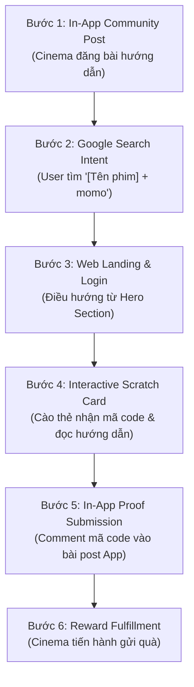

# BÁO CÁO TỔNG QUAN VẬN HÀNH & ĐỊNH HƯỚNG WEB PLATFORM (WEB PLATFORM REPORT)

> **Cập nhật:** Tháng 08/2026  
> **Chủ quản:** Web Product Lead  
> **Phạm vi:** Kênh Web (`momo.vn`), Nền tảng MoSpark CMS, Hệ thống 6 Strategic Hubs và Bộ Chiến Lược Tăng Trưởng (Grow Tactics)  

---

## 1. TỔNG QUAN HIỆU SUẤT & 3 CHỈ SỐ CỐT LÕI (EXECUTIVE SUMMARY)

Báo cáo đo lường hiệu suất Web Platform dựa trên bộ 2 nhóm chỉ số chuẩn hóa (Web Metrics & Business Metrics), bám sát mục tiêu chuyển đổi phễu Web-to-App:

<table style="width:100%; border-collapse:collapse; border:1.5px solid #64748b; margin:1em 0; font-size:0.9em;">
  <thead>
    <tr style="background-color:#f1f5f9;">
      <th style="border:1.5px solid #64748b; padding:8px 12px; text-align:left; font-weight:700;">Nhóm Chỉ Số</th>
      <th style="border:1.5px solid #64748b; padding:8px 12px; text-align:left; font-weight:700;">Tên Chỉ Số (Metric)</th>
      <th style="border:1.5px solid #64748b; padding:8px 12px; text-align:center; font-weight:700;">Thực Hiện (Baseline)</th>
      <th style="border:1.5px solid #64748b; padding:8px 12px; text-align:center; font-weight:700;">Mục Tiêu (Target H2)</th>
      <th style="border:1.5px solid #64748b; padding:8px 12px; text-align:left; font-weight:700;">Ý Nghĩa Đo Lường</th>
    </tr>
  </thead>
  <tbody>
    <tr>
      <td style="border:1px solid #94a3b8; padding:8px 12px; text-align:left;" rowspan="2"><strong>Web Metrics</strong></td>
      <td style="border:1px solid #94a3b8; padding:8px 12px; text-align:left;">Monthly Page Views (MPV)</td>
      <td style="border:1px solid #94a3b8; padding:8px 12px; text-align:center;">3.200.000</td>
      <td style="border:1px solid #94a3b8; padding:8px 12px; text-align:center;">5.000.000</td>
      <td style="border:1px solid #94a3b8; padding:8px 12px; text-align:left;">Quy mô lưu lượng và cơ hội hiển thị tiện ích.</td>
    </tr>
    <tr style="background-color:#f8fafc;">
      <td style="border:1px solid #94a3b8; padding:8px 12px; text-align:left;">Web-to-App CTR (%)</td>
      <td style="border:1px solid #94a3b8; padding:8px 12px; text-align:center;">8.5%</td>
      <td style="border:1px solid #94a3b8; padding:8px 12px; text-align:center;">12.0% - 15.0%</td>
      <td style="border:1px solid #94a3b8; padding:8px 12px; text-align:left;">Tỷ lệ nhấp vào CTA/Widget điều hướng sang App.</td>
    </tr>
    <tr>
      <td style="border:1px solid #94a3b8; padding:8px 12px; text-align:left;" rowspan="2"><strong>Business Metrics</strong></td>
      <td style="border:1px solid #94a3b8; padding:8px 12px; text-align:left;">W2A Login App Users</td>
      <td style="border:1px solid #94a3b8; padding:8px 12px; text-align:center;">12.500/tháng</td>
      <td style="border:1px solid #94a3b8; padding:8px 12px; text-align:center;">25.000 - 30.000/tháng</td>
      <td style="border:1px solid #94a3b8; padding:8px 12px; text-align:left;">Lượng người dùng đăng nhập App thành công từ Web.</td>
    </tr>
    <tr style="background-color:#f8fafc;">
      <td style="border:1px solid #94a3b8; padding:8px 12px; text-align:left;">Monthly Engaged Users (MEU)</td>
      <td style="border:1px solid #94a3b8; padding:8px 12px; text-align:center;">450.000</td>
      <td style="border:1px solid #94a3b8; padding:8px 12px; text-align:center;">1.000.000</td>
      <td style="border:1px solid #94a3b8; padding:8px 12px; text-align:left;">Người dùng tương tác sâu với các Interactive Tools.</td>
    </tr>
  </tbody>
</table>

---

## 2. MA TRẬN CẬP NHẬT 6 DỰ ÁN CHIẾN LƯỢC (PRODUCT VS. CONTENT PLAN & PLG)

<table style="width:100%; border-collapse:collapse; border:1.5px solid #64748b; margin:1em 0; font-size:0.9em;">
  <thead>
    <tr style="background-color:#f1f5f9;">
      <th style="border:1.5px solid #64748b; padding:8px 12px; text-align:left; font-weight:700; width:22%;">Dự Án Chiến Lược</th>
      <th style="border:1.5px solid #64748b; padding:8px 12px; text-align:left; font-weight:700; width:39%;">Product (Tình Trạng Build Sản Phẩm)</th>
      <th style="border:1.5px solid #64748b; padding:8px 12px; text-align:left; font-weight:700; width:39%;">Content Plan & PLG (Kế Hoạch Nội Dung & Prompt)</th>
    </tr>
  </thead>
  <tbody>
    <tr>
      <td style="border:1px solid #94a3b8; padding:8px 12px; text-align:left;"><strong>1. Financial Hub</strong> (Ưu tiên P0)</td>
      <td style="border:1px solid #94a3b8; padding:8px 12px; text-align:left;">
        Dựng Staging layout dọc bộ utilities (tính lãi, tỷ giá, vàng, CIC); tạm hoãn widget tab.
      </td>
      <td style="border:1px solid #94a3b8; padding:8px 12px; text-align:left;">
        Sẵn sàng 3-4 cụm bài (CIC, Tiết kiệm, Vay); cấu hình Prompts chuẩn YMYL & E-E-A-T.
      </td>
    </tr>
    <tr style="background-color:#f8fafc;">
      <td style="border:1px solid #94a3b8; padding:8px 12px; text-align:left;"><strong>2. Vehicle Hub (V-Hub)</strong></td>
      <td style="border:1px solid #94a3b8; padding:8px 12px; text-align:left;">
        MVP trang chủ + Phạt nguội 0-CAPTCHA + Bảng giá xăng; nạp data gara/trạm sạc từ Data Team.
      </td>
      <td style="border:1px solid #94a3b8; padding:8px 12px; text-align:left;">
        11.104 KWs giao thông; tách tuyến bài Đăng kiểm; Prompts cẩm nang luật & pSEO.
      </td>
    </tr>
    <tr>
      <td style="border:1px solid #94a3b8; padding:8px 12px; text-align:left;"><strong>3. Cinema Hub</strong></td>
      <td style="border:1px solid #94a3b8; padding:8px 12px; text-align:left;">
        Demo sẵn sàng Live; tích hợp Native Web QR Payment & Deep Link suất chiếu; nhập tay data lỗi CMS.
      </td>
      <td style="border:1px solid #94a3b8; padding:8px 12px; text-align:left;">
        3 tuyến bài (Review, Blog, BXH phim); bổ sung trang Diễn viên; Prompts chuẩn GEO.
      </td>
    </tr>
    <tr style="background-color:#f8fafc;">
      <td style="border:1px solid #94a3b8; padding:8px 12px; text-align:left;"><strong>4. Student Hub</strong></td>
      <td style="border:1px solid #94a3b8; padding:8px 12px; text-align:left;">
        Staging 3 trang con + Mini-web 5 trường đại học điểm (Review, Trọ, Quán ăn, Workshop).
      </td>
      <td style="border:1px solid #94a3b8; padding:8px 12px; text-align:left;">
        30+ bài viết chuyên sâu; hoàn thiện nội dung 5 trường điểm; Prompts Gen Z (U18-U23).
      </td>
    </tr>
    <tr>
      <td style="border:1px solid #94a3b8; padding:8px 12px; text-align:left;"><strong>5. New User Hub & Retro</strong></td>
      <td style="border:1px solid #94a3b8; padding:8px 12px; text-align:left;">
        Khảo sát cá nhân hóa (gói quà 500k); thí điểm Block Retro CIC & Vay Nhanh trên nền tảng mới.
      </td>
      <td style="border:1px solid #94a3b8; padding:8px 12px; text-align:left;">
        Chuẩn hóa slug `User+Block+Slug`; cẩm nang giáo dục user mới; Prompts CTA liên kết bank.
      </td>
    </tr>
    <tr style="background-color:#f8fafc;">
      <td style="border:1px solid #94a3b8; padding:8px 12px; text-align:left;"><strong>6. Merchant / SME Hub</strong></td>
      <td style="border:1px solid #94a3b8; padding:8px 12px; text-align:left;">
        Kênh tìm quán (`/merchant`) & Sales Kit mobile (`m.momo.vn`); tích hợp AI Menu Extractor.
      </td>
      <td style="border:1px solid #94a3b8; padding:8px 12px; text-align:left;">
        Cẩm nang số hóa F&B/bán lẻ; Prompts AI trích xuất menu qua Gemini Flash (-95% token cost).
      </td>
    </tr>
  </tbody>
</table>

---

## 3. CHIẾN LƯỢC TĂNG TRƯỞNG & ĐỊNH DANH (GROW TACTICS: MINI GAME & TRUST / THU THẬP GMAIL)

### 3.1 Mini Game Tactics (Gamification, Ranking Booster & O2O Loop)

Các Mini Game trên Web Platform được định hướng nhằm phục vụ **3 Mục Tiêu Chiến Lược (Objectives)**:
1. **Thúc đẩy Ranking SEO/GEO (Search Signal Booster):** Kéo người dùng từ In-App lên Google tìm kiếm theo từ khóa `[Tên phim] + momo` ➔ Tạo tín hiệu Organic CTR giúp trang MoMo chiếm lĩnh Top 1 Google Search.
2. **Tăng Trưởng Tương Tác Ngoài Web (Web Engagement & Time Spent):** Thu hút người dùng truy cập Web, tương tác Hero Section, đăng nhập và cào thẻ tương tác.
3. **Tăng O2O & Giữ Chân Trong App (Online-to-Online Loop):** Kết nối người dùng quay ngược lại Cộng đồng In-App bình luận mã code để nhận quà, hoàn tất vòng lặp tăng trưởng khép kín.

#### Sơ Đồ Game Flow Cinema Mẫu (App-to-Web-to-App Loop):

#### Bảng Phân Tích Chi Tiết Các Bước Trong Game Flow:

<table style="width:100%; border-collapse:collapse; border:1.5px solid #64748b; margin:1em 0; font-size:0.9em;">
  <thead>
    <tr style="background-color:#f1f5f9;">
      <th style="border:1.5px solid #64748b; padding:8px 12px; text-align:center; font-weight:700;">Bước</th>
      <th style="border:1.5px solid #64748b; padding:8px 12px; text-align:left; font-weight:700;">Tên Giai Đoạn</th>
      <th style="border:1.5px solid #64748b; padding:8px 12px; text-align:left; font-weight:700;">Trải Nghiệm Người Dùng (UX)</th>
      <th style="border:1.5px solid #64748b; padding:8px 12px; text-align:left; font-weight:700;">Hạ Tầng / Cơ Chế Kỹ Thuật</th>
      <th style="border:1.5px solid #64748b; padding:8px 12px; text-align:left; font-weight:700;">Nền Tảng</th>
    </tr>
  </thead>
  <tbody>
    <tr>
      <td style="border:1px solid #94a3b8; padding:8px 12px; text-align:center;">1</td>
      <td style="border:1px solid #94a3b8; padding:8px 12px; text-align:left;">Community Activation</td>
      <td style="border:1px solid #94a3b8; padding:8px 12px; text-align:left;">Đọc bài post thông báo minigame và thể lệ tham gia nhận quà trên nhóm cộng đồng MoMo.</td>
      <td style="border:1px solid #94a3b8; padding:8px 12px; text-align:left;">In-App Community Feed & Push Notification Engine</td>
      <td style="border:1px solid #94a3b8; padding:8px 12px; text-align:left;">App MoMo</td>
    </tr>
    <tr style="background-color:#f8fafc;">
      <td style="border:1px solid #94a3b8; padding:8px 12px; text-align:center;">2</td>
      <td style="border:1px solid #94a3b8; padding:8px 12px; text-align:left;">Search & Discovery</td>
      <td style="border:1px solid #94a3b8; padding:8px 12px; text-align:left;">Mở trình duyệt tìm kiếm từ khóa [Tên phim] + momo và nhấp chọn kết quả trang đích của MoMo.</td>
      <td style="border:1px solid #94a3b8; padding:8px 12px; text-align:left;">Organic Google Search / SERP Click Tracking</td>
      <td style="border:1px solid #94a3b8; padding:8px 12px; text-align:left;">Google Search ➔ Web</td>
    </tr>
    <tr>
      <td style="border:1px solid #94a3b8; padding:8px 12px; text-align:center;">3</td>
      <td style="border:1px solid #94a3b8; padding:8px 12px; text-align:left;">Hero Section Navigation & Auth</td>
      <td style="border:1px solid #94a3b8; padding:8px 12px; text-align:left;">Thấy banner/button hướng dẫn nổi bật tại Hero Section và thực hiện đăng nhập để tham gia cào thẻ.</td>
      <td style="border:1px solid #94a3b8; padding:8px 12px; text-align:left;">Web Auth / Session Management & Dynamic Hero Banner</td>
      <td style="border:1px solid #94a3b8; padding:8px 12px; text-align:left;">Web (momo.vn/cinema)</td>
    </tr>
    <tr style="background-color:#f8fafc;">
      <td style="border:1px solid #94a3b8; padding:8px 12px; text-align:center;">4</td>
      <td style="border:1px solid #94a3b8; padding:8px 12px; text-align:left;">Scratch Card & Guidance</td>
      <td style="border:1px solid #94a3b8; padding:8px 12px; text-align:left;">Dùng tay/chuột cào thẻ tương tác nhận mã code may mắn; đọc hướng dẫn các bước tiếp theo để nhận quà.</td>
      <td style="border:1px solid #94a3b8; padding:8px 12px; text-align:left;">HTML5 Canvas Scratch Widget / Promo Code Engine</td>
      <td style="border:1px solid #94a3b8; padding:8px 12px; text-align:left;">Web (momo.vn/cinema)</td>
    </tr>
    <tr>
      <td style="border:1px solid #94a3b8; padding:8px 12px; text-align:center;">5</td>
      <td style="border:1px solid #94a3b8; padding:8px 12px; text-align:left;">Proof Submission & Loop</td>
      <td style="border:1px solid #94a3b8; padding:8px 12px; text-align:left;">Sao chép mã code hoặc chụp màn hình kết quả cào thẻ, quay lại App bình luận dưới bài post minigame.</td>
      <td style="border:1px solid #94a3b8; padding:8px 12px; text-align:left;">Deep Link điều hướng về Community Post / User Engagement Tracker</td>
      <td style="border:1px solid #94a3b8; padding:8px 12px; text-align:left;">App MoMo</td>
    </tr>
    <tr style="background-color:#f8fafc;">
      <td style="border:1px solid #94a3b8; padding:8px 12px; text-align:center;">6</td>
      <td style="border:1px solid #94a3b8; padding:8px 12px; text-align:left;">Reward Fulfillment</td>
      <td style="border:1px solid #94a3b8; padding:8px 12px; text-align:left;">Nhận vé xem phim miễn phí hoặc gói voucher quà tặng trực tiếp vào ví MoMo.</td>
      <td style="border:1px solid #94a3b8; padding:8px 12px; text-align:left;">Reward Distribution Engine / Coupon Center</td>
      <td style="border:1px solid #94a3b8; padding:8px 12px; text-align:left;">App MoMo</td>
    </tr>
  </tbody>
</table>

---

### 3.2 Trust Tactics & Thu Thập Gmail (Progressive User Identification)

* **Bản chất chiến thuật:** Loại bỏ rào cản bắt buộc đăng nhập Số điện thoại ngay từ đầu; thực hiện luồng định danh mềm dẻo "Trao giá trị trước, thu thập thông tin sau".
* **Điểm chạm Thu thập Gmail dựa trên Tiện ích (Utility-driven Email Opt-in):**
  * **Chuyên trang Tài chính & CIC (`momo.vn/diem-tin-dung`):** Người dùng nhập Email để nhận bản báo cáo phân tích chi tiết sức khỏe tín dụng và hướng dẫn nâng hạng tín dụng định kỳ.
  * **Tiện ích Giao thông & Phạt Nguội (`momo.vn/tien-ich-giao-thong`):** Thu thập Email kèm biển số xe để thiết lập hệ thống **"Cảnh Báo Tự Động"** — gửi thông báo ngay lập tức qua Gmail mỗi khi phương tiện phát sinh lỗi vi phạm mới trên hệ thống C08.
  * **Bản tin Tài chính & Giá Vàng / Tỷ Giá:** Người dùng đăng ký nhận bản tin tóm tắt biến động thị trường vàng, ngoại tệ và lãi suất tiết kiệm hàng tuần.
  * **Cổng Sinh Viên (`momo.vn/sinh-vien`):** Thu thập Email sinh viên (.edu.vn hoặc Gmail) để gửi thông báo học bổng, sự kiện workshop và kích hoạt gói quyền lợi Student Pass.
* **Giá trị Kinh doanh & Chuyển đổi Dài hạn:**
  * Xây dựng kho dữ liệu **Lead Profiles ngoài Web** có độ tin cậy cao, phục vụ cho các chiến dịch Email Marketing và Retargeting tự động với chi phí 0 đồng.
  * Khi người dùng đã có sự tin tưởng (Trust) qua các bản tin email hữu ích, việc dẫn dắt họ đồng bộ tài khoản với Mã định danh MoMo (Agent ID) trong App diễn ra với tỷ lệ chuyển đổi cao hơn gấp nhiều lần so với quảng cáo chuyển đổi trực tiếp.

---

## 4. BÁO CÁO HIỆU SUẤT NEW USER GROWTH (SCHEMES & TỆP U18)

### 4.1 Bảng Hiệu Suất Các Schemes Quảng Cáo Chủ Lực (Balloon Ads Performance)

<table style="width:100%; border-collapse:collapse; border:1.5px solid #64748b; margin:1em 0; font-size:0.85em;">
  <thead>
    <tr style="background-color:#f1f5f9;">
      <th style="border:1.5px solid #64748b; padding:6px 10px; text-align:left; font-weight:700;">BU / Campaign Name</th>
      <th style="border:1.5px solid #64748b; padding:6px 10px; text-align:left; font-weight:700;">Metric</th>
      <th style="border:1.5px solid #64748b; padding:6px 10px; text-align:right; font-weight:700;">T6/2026</th>
      <th style="border:1.5px solid #64748b; padding:6px 10px; text-align:right; font-weight:700;">T7/2026</th>
      <th style="border:1.5px solid #64748b; padding:6px 10px; text-align:right; font-weight:700;">T8/2026 MTD (18d)</th>
      <th style="border:1.5px solid #64748b; padding:6px 10px; text-align:right; font-weight:700;">Ước Tính Cả Tháng</th>
    </tr>
  </thead>
  <tbody>
    <tr>
      <td style="border:1px solid #94a3b8; padding:6px 10px; text-align:left;" rowspan="3"><strong>GMC-NEW: Balloon CHAOMOMO (Bộ quà 500K chào mừng)</strong></td>
      <td style="border:1px solid #94a3b8; padding:6px 10px; text-align:left;">View Balloon (Reach)</td>
      <td style="border:1px solid #94a3b8; padding:6px 10px; text-align:right;">565.667</td>
      <td style="border:1px solid #94a3b8; padding:6px 10px; text-align:right;">365.870</td>
      <td style="border:1px solid #94a3b8; padding:6px 10px; text-align:right;">241.013</td>
      <td style="border:1px solid #94a3b8; padding:6px 10px; text-align:right;">415.000</td>
    </tr>
    <tr>
      <td style="border:1px solid #94a3b8; padding:6px 10px; text-align:left;">Ads Clicks</td>
      <td style="border:1px solid #94a3b8; padding:6px 10px; text-align:right;">332.307</td>
      <td style="border:1px solid #94a3b8; padding:6px 10px; text-align:right;">207.052</td>
      <td style="border:1px solid #94a3b8; padding:6px 10px; text-align:right;">139.758</td>
      <td style="border:1px solid #94a3b8; padding:6px 10px; text-align:right;">240.600</td>
    </tr>
    <tr>
      <td style="border:1px solid #94a3b8; padding:6px 10px; text-align:left;">%Ads CVR</td>
      <td style="border:1px solid #94a3b8; padding:6px 10px; text-align:right;">58,74%</td>
      <td style="border:1px solid #94a3b8; padding:6px 10px; text-align:right;">56,59%</td>
      <td style="border:1px solid #94a3b8; padding:6px 10px; text-align:right;">57,99%</td>
      <td style="border:1px solid #94a3b8; padding:6px 10px; text-align:right;"><strong>57,99%</strong></td>
    </tr>
    <tr style="background-color:#f8fafc;">
      <td style="border:1px solid #94a3b8; padding:6px 10px; text-align:left;" rowspan="3"><strong>GMC-NEW: Balloon Cinema (Free bắp nước CGV/Lotte/Galaxy)</strong></td>
      <td style="border:1px solid #94a3b8; padding:6px 10px; text-align:left;">View Balloon (Reach)</td>
      <td style="border:1px solid #94a3b8; padding:6px 10px; text-align:right;">750.786</td>
      <td style="border:1px solid #94a3b8; padding:6px 10px; text-align:right;">659.817</td>
      <td style="border:1px solid #94a3b8; padding:6px 10px; text-align:right;">171.499</td>
      <td style="border:1px solid #94a3b8; padding:6px 10px; text-align:right;">295.300</td>
    </tr>
    <tr style="background-color:#f8fafc;">
      <td style="border:1px solid #94a3b8; padding:6px 10px; text-align:left;">Ads Clicks</td>
      <td style="border:1px solid #94a3b8; padding:6px 10px; text-align:right;">252.627</td>
      <td style="border:1px solid #94a3b8; padding:6px 10px; text-align:right;">226.035</td>
      <td style="border:1px solid #94a3b8; padding:6px 10px; text-align:right;">65.308</td>
      <td style="border:1px solid #94a3b8; padding:6px 10px; text-align:right;">112.500</td>
    </tr>
    <tr style="background-color:#f8fafc;">
      <td style="border:1px solid #94a3b8; padding:6px 10px; text-align:left;">%Ads CVR</td>
      <td style="border:1px solid #94a3b8; padding:6px 10px; text-align:right;">33,65%</td>
      <td style="border:1px solid #94a3b8; padding:6px 10px; text-align:right;">34,26%</td>
      <td style="border:1px solid #94a3b8; padding:6px 10px; text-align:right;">38,08%</td>
      <td style="border:1px solid #94a3b8; padding:6px 10px; text-align:right;"><strong>38,08%</strong></td>
    </tr>
    <tr>
      <td style="border:1px solid #94a3b8; padding:6px 10px; text-align:left;" rowspan="3"><strong>GMC-NEW: Niche Balloon Ads (App Store, Game, OTT, Vé xe...)</strong></td>
      <td style="border:1px solid #94a3b8; padding:6px 10px; text-align:left;">View Balloon (Reach)</td>
      <td style="border:1px solid #94a3b8; padding:6px 10px; text-align:right;">54.308</td>
      <td style="border:1px solid #94a3b8; padding:6px 10px; text-align:right;">132.397</td>
      <td style="border:1px solid #94a3b8; padding:6px 10px; text-align:right;">136.745</td>
      <td style="border:1px solid #94a3b8; padding:6px 10px; text-align:right;">235.500</td>
    </tr>
    <tr>
      <td style="border:1px solid #94a3b8; padding:6px 10px; text-align:left;">Ads Clicks</td>
      <td style="border:1px solid #94a3b8; padding:6px 10px; text-align:right;">37.096</td>
      <td style="border:1px solid #94a3b8; padding:6px 10px; text-align:right;">86.453</td>
      <td style="border:1px solid #94a3b8; padding:6px 10px; text-align:right;">102.940</td>
      <td style="border:1px solid #94a3b8; padding:6px 10px; text-align:right;">177.300</td>
    </tr>
    <tr>
      <td style="border:1px solid #94a3b8; padding:6px 10px; text-align:left;">%Ads CVR</td>
      <td style="border:1px solid #94a3b8; padding:6px 10px; text-align:right;">68,31%</td>
      <td style="border:1px solid #94a3b8; padding:6px 10px; text-align:right;">65,30%</td>
      <td style="border:1px solid #94a3b8; padding:6px 10px; text-align:right;">75,28%</td>
      <td style="border:1px solid #94a3b8; padding:6px 10px; text-align:right;"><strong>75,28%</strong></td>
    </tr>
    <tr style="background-color:#e2e8f0; font-weight:bold;">
      <td style="border:1.5px solid #64748b; padding:6px 10px; text-align:left;" rowspan="4"><strong>TOTAL ALL SCHEMES</strong></td>
      <td style="border:1.5px solid #64748b; padding:6px 10px; text-align:left;">View Balloon (Reach)</td>
      <td style="border:1.5px solid #64748b; padding:6px 10px; text-align:right;">1.382.488</td>
      <td style="border:1.5px solid #64748b; padding:6px 10px; text-align:right;">1.338.134</td>
      <td style="border:1.5px solid #64748b; padding:6px 10px; text-align:right;">1.085.018</td>
      <td style="border:1.5px solid #64748b; padding:6px 10px; text-align:right;">1.868.642</td>
    </tr>
    <tr style="background-color:#e2e8f0; font-weight:bold;">
      <td style="border:1.5px solid #64748b; padding:6px 10px; text-align:left;">Ads Clicks</td>
      <td style="border:1.5px solid #64748b; padding:6px 10px; text-align:right;">629.378</td>
      <td style="border:1.5px solid #64748b; padding:6px 10px; text-align:right;">613.859</td>
      <td style="border:1.5px solid #64748b; padding:6px 10px; text-align:right;">584.094</td>
      <td style="border:1.5px solid #64748b; padding:6px 10px; text-align:right;">1.005.939</td>
    </tr>
    <tr style="background-color:#e2e8f0; font-weight:bold;">
      <td style="border:1.5px solid #64748b; padding:6px 10px; text-align:left;">Overall %Ads CVR</td>
      <td style="border:1.5px solid #64748b; padding:6px 10px; text-align:right;">45,53%</td>
      <td style="border:1.5px solid #64748b; padding:6px 10px; text-align:right;">45,87%</td>
      <td style="border:1.5px solid #64748b; padding:6px 10px; text-align:right;">53,83%</td>
      <td style="border:1.5px solid #64748b; padding:6px 10px; text-align:right;"><strong>53,83%</strong></td>
    </tr>
    <tr style="background-color:#e2e8f0; font-weight:bold;">
      <td style="border:1.5px solid #64748b; padding:6px 10px; text-align:left;">App Installs (New to MoMo)</td>
      <td style="border:1.5px solid #64748b; padding:6px 10px; text-align:right;">4.486</td>
      <td style="border:1.5px solid #64748b; padding:6px 10px; text-align:right;">5.242</td>
      <td style="border:1.5px solid #64748b; padding:6px 10px; text-align:right;">4.980</td>
      <td style="border:1.5px solid #64748b; padding:6px 10px; text-align:right;"><strong>8.600</strong></td>
    </tr>
  </tbody>
</table>

### 4.2 Observations (Góc Nhìn Dữ Liệu New User & Tệp U18)

* **Tốc độ nhấp Ads đạt 32.450 Clicks/ngày (+63,9% MoM):** Tích lũy MTD Tháng 8 (18 ngày) đạt 584K Clicks; ước tính quy mô cả tháng (Monthly Run-Rate) vượt mốc >1,0M Web Ads Clicks (~1,01M Clicks).
* **Thu hút tệp học sinh U18 đợt Xét tuyển & Back-to-School:** Tận dụng đợt chốt nguyện vọng đại học và nhập học Tháng 8 để kéo tệp học sinh U18 (tách biệt với tệp Sinh viên đại học của Student Hub) đăng ký tài khoản MoMo mới qua mã `EMCHUA18` và gói quà CHAOMOMO 500K.
* **Tỷ lệ %Ads CVR đạt 53,83% (+7,96 điểm % vs T7):** Tỷ lệ nhấp tăng nhờ triển khai cơ chế hiển thị banner động theo đúng nhu cầu của người dùng trên Web.
* **Nhóm Balloon Ngách đạt CVR từ 65% đến 75%:** Các quảng cáo ngách (App Store, Game, OTT, Vé xe) chỉ chiếm 12,6% lượt xem nhưng mang về 102,9K Clicks.

### 4.3 Product Statement (Sản Phẩm U18 New User & Web Platform)

* **Tách riêng tệp học sinh U18 (học sinh Cấp 3):** Không dùng chung luồng với tệp Sinh viên đại học của Student Hub. Tập trung đơn giản hóa bước đăng ký và nhận gói quà 500K chào mừng cho học sinh U18 lần đầu mở ví.
* **Cá nhân hóa trang Web & Tăng ngân sách Media:** Phối hợp với team User Growth làm giao diện riêng cho học sinh U18 trên Kênh Web, đẩy mạnh quảng cáo TikTok Ads/Facebook Ads để đo hiệu quả kéo người dùng mới.
* **Đo lường phễu Web-to-App:** Dùng Onelink đo trọn vẹn từ lúc bấm Quảng cáo trên Web ➔ Tải App ➔ Đăng ký tài khoản ➔ Phát sinh giao dịch đầu tiên.

---

## 5. BÁO CÁO HIỆU SUẤT DỰ ÁN CINEMA HUB (PERFORMANCE ZONE)

### 5.1 Bảng Đối Chiếu Số Liệu Chuyển Đổi Phễu Cinema Hub

<table style="width:100%; border-collapse:collapse; border:1.5px solid #64748b; margin:1em 0; font-size:0.9em;">
  <thead>
    <tr style="background-color:#f1f5f9;">
      <th style="border:1.5px solid #64748b; padding:8px 12px; text-align:left; font-weight:700;">Chỉ Số (Metrics)</th>
      <th style="border:1.5px solid #64748b; padding:8px 12px; text-align:right; font-weight:700;">Tháng 6 (Full)</th>
      <th style="border:1.5px solid #64748b; padding:8px 12px; text-align:right; font-weight:700;">Tháng 7 (Full)</th>
      <th style="border:1.5px solid #64748b; padding:8px 12px; text-align:right; font-weight:700;">Tháng 7 MTD (18 ngày)</th>
      <th style="border:1.5px solid #64748b; padding:8px 12px; text-align:right; font-weight:700;">Tháng 8 MTD (18 ngày)</th>
      <th style="border:1.5px solid #64748b; padding:8px 12px; text-align:right; font-weight:700;">Ước Tính Cả Tháng</th>
      <th style="border:1.5px solid #64748b; padding:8px 12px; text-align:left; font-weight:700;">Biến Động 18d MTD (%)</th>
    </tr>
  </thead>
  <tbody>
    <tr>
      <td style="border:1px solid #94a3b8; padding:8px 12px; text-align:left;">Page views (MPV)</td>
      <td style="border:1px solid #94a3b8; padding:8px 12px; text-align:right;">840.545</td>
      <td style="border:1px solid #94a3b8; padding:8px 12px; text-align:right;">808.139</td>
      <td style="border:1px solid #94a3b8; padding:8px 12px; text-align:right;">431.823</td>
      <td style="border:1px solid #94a3b8; padding:8px 12px; text-align:right;">410.665</td>
      <td style="border:1px solid #94a3b8; padding:8px 12px; text-align:right;">707.256</td>
      <td style="border:1px solid #94a3b8; padding:8px 12px; text-align:left;">-4,90%</td>
    </tr>
    <tr style="background-color:#f8fafc;">
      <td style="border:1px solid #94a3b8; padding:8px 12px; text-align:left;">Click-to-App (W2A Clicks)</td>
      <td style="border:1px solid #94a3b8; padding:8px 12px; text-align:right;">251.475</td>
      <td style="border:1px solid #94a3b8; padding:8px 12px; text-align:right;">250.271</td>
      <td style="border:1px solid #94a3b8; padding:8px 12px; text-align:right;">142.815</td>
      <td style="border:1px solid #94a3b8; padding:8px 12px; text-align:right;">136.392</td>
      <td style="border:1px solid #94a3b8; padding:8px 12px; text-align:right;">234.897</td>
      <td style="border:1px solid #94a3b8; padding:8px 12px; text-align:left;">-4,50%</td>
    </tr>
    <tr>
      <td style="border:1px solid #94a3b8; padding:8px 12px; text-align:left;">Tỷ lệ CTR (Click-to-App / MPV)</td>
      <td style="border:1px solid #94a3b8; padding:8px 12px; text-align:right;">30,00%</td>
      <td style="border:1px solid #94a3b8; padding:8px 12px; text-align:right;">31,00%</td>
      <td style="border:1px solid #94a3b8; padding:8px 12px; text-align:right;">33,07%</td>
      <td style="border:1px solid #94a3b8; padding:8px 12px; text-align:right;">33,21%</td>
      <td style="border:1px solid #94a3b8; padding:8px 12px; text-align:right;"><strong>33,21%</strong></td>
      <td style="border:1px solid #94a3b8; padding:8px 12px; text-align:left;"><strong>+0,14 điểm %</strong></td>
    </tr>
    <tr style="background-color:#f8fafc;">
      <td style="border:1px solid #94a3b8; padding:8px 12px; text-align:left;">Login App (W2A Logged-in Users)</td>
      <td style="border:1px solid #94a3b8; padding:8px 12px; text-align:right;">506</td>
      <td style="border:1px solid #94a3b8; padding:8px 12px; text-align:right;">12.245</td>
      <td style="border:1px solid #94a3b8; padding:8px 12px; text-align:right;">5.719</td>
      <td style="border:1px solid #94a3b8; padding:8px 12px; text-align:right;">8.967</td>
      <td style="border:1px solid #94a3b8; padding:8px 12px; text-align:right;"><strong>15.443</strong></td>
      <td style="border:1px solid #94a3b8; padding:8px 12px; text-align:left;"><strong>+56,79%</strong></td>
    </tr>
  </tbody>
</table>

### 5.2 Observations (Góc Nhìn Dữ Liệu Cinema Hub)

* **Số liệu thực tế MTD Tháng 8 (18 ngày):** Số lượng người dùng đăng nhập thành công vào App từ Web (Login App) đạt **8.967 users**, tăng **+56,79%** so với 18 ngày cùng kỳ Tháng 7 (5.719 users). Ước tính quy mô cả tháng (Monthly Run-Rate) đạt **15.443 Login App**, tăng **+26,12% MoM** so với cả Tháng 7 (12.245 users).
* **Tỷ lệ chuyển đổi phễu sâu (Login App / Click-to-App):** Cải thiện từ mốc 4,00% (Tháng 7 MTD) lên **6,57% (Tháng 8 MTD)**, tăng +2,57 điểm %. Người dùng nhấp vào Cinema mang Intent đặt vé thực sự chất lượng hơn.
* **Xu hướng lưu lượng và tỷ lệ CTR:** Mặc dù số lượt xem trang MTD giảm nhẹ -4,90% (từ 431.823 xuống 410.665 views), tỷ lệ nhấp chuyển đổi CTR giữ vững đà tăng nhẹ từ 33,07% lên **33,21%**.
* **Tác động chiến dịch:** Việc tập trung tối ưu hiển thị SEO/GEO cho 2 chiến dịch phim trọng điểm (*Hộ Linh Tráng Sĩ* và *Nghỉ Hè Sợ Nghỉ Hưu*) trực tiếp thúc đẩy tăng trưởng chỉ số Login App và tỷ lệ chốt đơn đặt vé In-App trong nửa đầu Tháng 8.

### 5.3 Product Statement (Sản Phẩm Cinema Hub)

* **Định Vị Sản Phẩm (Out-App Movie Search Engine):** Xây dựng Cinema Hub thành cổng tra cứu suất chiếu, giá vé và review phim Top 1 ngoài Web, tận dụng hạ tầng MoSpark CMS để kéo lưu lượng tìm kiếm điện ảnh tự nhiên về hệ sinh thái MoMo.
* **Tích Hợp Luồng Thanh Toán QR Ngoài Web (Native Web QR Payment):** Hoàn thiện cổng thanh toán QR trực tiếp trên trang Web trong Sprint 2 Tháng 8, tháo gỡ hoàn toàn rào cản bắt buộc tải/mở App đối với tệp 136.392 lượt Click-to-App nhưng chưa thực hiện Login App.
* **Tối Ưu Vòng Đời Trang Phim (Film Lifecycle Governance):** Thiết lập cơ chế tự động chuyển hướng (Auto-Redirect) các trang phim hết rạp về trang danh mục phim đang chiếu để giữ chân lưu lượng và tối ưu ngân sách crawl từ Google Search.

