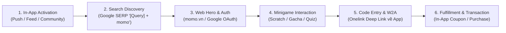

# BÁO CÁO ĐỊNH HƯỚNG CHIẾN LƯỢC & KHUNG VẬN HÀNH WEB GAMIFICATION

> **Đơn vị báo cáo:** Web Platform Team (Growth Platform Division)  
> **Thời gian:** Tháng 08/2026  
> **Chủ đề:** Báo Cáo Định Hướng Chiến Lược & Khung Vận Hành Gamification Trên Kênh Web MoMo

---

## I. CONTEXT & ĐỊNH VỊ CHIẾN LƯỢC

### 1. Thực Trạng & Định Vị Nền Tảng
Nền tảng Web MoMo (`momo.vn`) không vận hành các dự án Game hóa (Gamification) theo mô hình "Traffic Game In-App" (cày view/lượt chơi đơn điệu). Web Gamification được định vị là **Động Lực Tương Tác Theo Ý Định Người Dùng (Intent-Driven Touchpoint Engine)**, kết nối trực tiếp lưu lượng tìm kiếm ngoài Web với ứng dụng MoMo.

### 2. Ba Mục Tiêu Tác Động Kinh Doanh Trọng Tâm
- **Organic Search Signal Booster (SEO/GEO):** Điều hướng người dùng tìm kiếm từ khóa `[Dịch vụ/Phim] + momo` trên Google SERP, bứt phá tỷ lệ nhấp tự nhiên (Organic CTR) giúp đưa các bài viết MoMo chiếm vị trí Top 1-3 Google Search.
- **Tối Ưu Thời Gian & Tương Tác On-Site:** Chuyển đổi trải nghiệm đọc bài viết thụ động thành các điểm chạm tương tác linh hoạt (thẻ cào, lắc quẻ, gacha, trắc nghiệm 1-click), tăng thời gian lưu lại trên trang (Time-on-site) và giảm tỷ lệ thoát (Bounce Rate).
- **Phễu Chuyển Đổi Kín (App-to-Web-to-App O2O Closed Loop):** Dẫn dắt người dùng thực hiện nhiệm vụ ngoài Web, sao chép mã code dự thưởng hoặc nhúng Onelink đệm để quy đổi quà tặng/xác minh giao dịch In-App, thúc đẩy chỉ số Active MAU và Doanh thu thực tế.

---

## II. KHUNG KIẾN TRÚC 3 TẦNG NHIỆM VỤ (3-TIER TASK MATRIX)

<table style="width:100%; border-collapse:collapse; border:1.5px solid #64748b; margin:1em 0; font-size:0.9em;">
  <thead>
    <tr style="background-color:#f1f5f9;">
      <th style="border:1.5px solid #64748b; padding:8px 12px; text-align:left; font-weight:700;">Tầng Nhiệm Vụ</th>
      <th style="border:1.5px solid #64748b; padding:8px 12px; text-align:left; font-weight:700;">Bản Chất Tương Tác & Mục Tiêu UX</th>
      <th style="border:1.5px solid #64748b; padding:8px 12px; text-align:left; font-weight:700;">Danh Sách 15 Minigames Chi Tiết</th>
      <th style="border:1.5px solid #64748b; padding:8px 12px; text-align:center; font-weight:700;">Độ Khó</th>
    </tr>
  </thead>
  <tbody>
    <tr>
      <td style="border:1px solid #94a3b8; padding:8px 12px; text-align:left;"><strong>Tầng 01: Nhiệm Vụ Điểm Danh</strong></td>
      <td style="border:1px solid #94a3b8; padding:8px 12px; text-align:left;">Thao tác nhanh dưới 5s, nhận quà nhỏ tức thì để kích hoạt tâm lý "small win" và thói quen truy cập Web hằng ngày.</td>
      <td style="border:1px solid #94a3b8; padding:8px 12px; text-align:left;">
        1. Đăng nhập điểm danh tích điểm 
        2. Gacha thẻ may mắn (Thường/Hiếm/Siêu hiếm) 
        3. Lắc quẻ ngày mới & lời khuyên
      </td>
      <td style="border:1px solid #94a3b8; padding:8px 12px; text-align:center;">Thấp</td>
    </tr>
    <tr style="background-color:#f8fafc;">
      <td style="border:1px solid #94a3b8; padding:8px 12px; text-align:left;"><strong>Tầng 02: Nhiệm Vụ Định Kỳ</strong></td>
      <td style="border:1px solid #94a3b8; padding:8px 12px; text-align:left;">Game làm mới định kỳ hằng ngày/tuần; giữ chân user chuẩn bị rời trang; khai thác database dịch vụ và gắn doanh thu rạp/vé.</td>
      <td style="border:1px solid #94a3b8; padding:8px 12px; text-align:left;">
        4. Cào thẻ may mắn trên trang hot 
        5. Vòng quay may mắn 
        6. Tìm vật phẩm / hình ẩn trong bài viết 
        7. Chụp hình cùng filter nhân vật 
        8. Trắc nghiệm Đúng / Sai 
        9. Đoán thông tin lệch (Database Quiz) 
        10. Mua vé xem phim / vé rạp 
        11. Review phim (Xác minh vé xem) 
        12. Mua combo bắp / nước
      </td>
      <td style="border:1px solid #94a3b8; padding:8px 12px; text-align:center;">Thấp ➔ Khó</td>
    </tr>
    <tr>
      <td style="border:1px solid #94a3b8; padding:8px 12px; text-align:left;"><strong>Tầng 03: Nhiệm Vụ Hệ Thống</strong></td>
      <td style="border:1px solid #94a3b8; padding:8px 12px; text-align:left;">Đòi hỏi nhiều người dùng cùng tham gia; tạo hiệu ứng lan tỏa tự nhiên (Social Referral) và cộng hưởng doanh thu tổng.</td>
      <td style="border:1px solid #94a3b8; padding:8px 12px; text-align:left;">
        13. Mời bạn mới chưa có tài khoản 
        14. Ghép đôi quà tặng (Social Match) 
        15. Doanh thu phim/dịch vụ đạt mốc chung
      </td>
      <td style="border:1px solid #94a3b8; padding:8px 12px; text-align:center;">Trung bình ➔ Khó</td>
    </tr>
  </tbody>
</table>

---

## III. MÔ HÌNH LUỒNG CHUYỂN ĐỔI APP-TO-WEB-TO-APP (O2O CLOSED LOOP)

### 1. Sơ Đồ User Flow Chuyển Đổi Nền Tảng

### 2. Bảng Phân Tích Chi Tiết Các Bước Trong Luồng Chuyển Đổi

<table style="width:100%; border-collapse:collapse; border:1.5px solid #64748b; margin:1em 0; font-size:0.9em;">
  <thead>
    <tr style="background-color:#f1f5f9;">
      <th style="border:1.5px solid #64748b; padding:8px 12px; text-align:center; font-weight:700;">Bước</th>
      <th style="border:1.5px solid #64748b; padding:8px 12px; text-align:left; font-weight:700;">Tên Giai Đoạn</th>
      <th style="border:1.5px solid #64748b; padding:8px 12px; text-align:left; font-weight:700;">Trải Nghiệm Người Dùng (UX)</th>
      <th style="border:1.5px solid #64748b; padding:8px 12px; text-align:left; font-weight:700;">Hạ Tầng / Cơ Chế Kỹ Thuật</th>
      <th style="border:1.5px solid #64748b; padding:8px 12px; text-align:left; font-weight:700;">Nền Tảng</th>
    </tr>
  </thead>
  <tbody>
    <tr>
      <td style="border:1px solid #94a3b8; padding:8px 12px; text-align:center;">1</td>
      <td style="border:1px solid #94a3b8; padding:8px 12px; text-align:left;">In-App Activation</td>
      <td style="border:1px solid #94a3b8; padding:8px 12px; text-align:left;">Đọc bài đăng thông báo minigame và thể lệ tham gia trên nhóm cộng đồng MoMo hoặc thông báo Push.</td>
      <td style="border:1px solid #94a3b8; padding:8px 12px; text-align:left;">In-App Community Feed & Push Notification Engine</td>
      <td style="border:1px solid #94a3b8; padding:8px 12px; text-align:left;">App MoMo</td>
    </tr>
    <tr style="background-color:#f8fafc;">
      <td style="border:1px solid #94a3b8; padding:8px 12px; text-align:center;">2</td>
      <td style="border:1px solid #94a3b8; padding:8px 12px; text-align:left;">Search & Discovery</td>
      <td style="border:1px solid #94a3b8; padding:8px 12px; text-align:left;">Mở trình duyệt tìm kiếm từ khóa <code>[Tên phim/dịch vụ] + momo</code> và nhấp chọn kết quả bài viết của MoMo.</td>
      <td style="border:1px solid #94a3b8; padding:8px 12px; text-align:left;">Organic Google Search / SERP Click Tracking Engine</td>
      <td style="border:1px solid #94a3b8; padding:8px 12px; text-align:left;">Google SERP ➔ Web</td>
    </tr>
    <tr>
      <td style="border:1px solid #94a3b8; padding:8px 12px; text-align:center;">3</td>
      <td style="border:1px solid #94a3b8; padding:8px 12px; text-align:left;">Hero Landing & Auth</td>
      <td style="border:1px solid #94a3b8; padding:8px 12px; text-align:left;">Thấy Widget Game nổi bật tại vị trí Hero Section, đăng nhập nhanh để tham gia chơi.</td>
      <td style="border:1px solid #94a3b8; padding:8px 12px; text-align:left;">Web Auth / Google OAuth 1-Tap / Dynamic Hero Banner</td>
      <td style="border:1px solid #94a3b8; padding:8px 12px; text-align:left;">Web (momo.vn)</td>
    </tr>
    <tr style="background-color:#f8fafc;">
      <td style="border:1px solid #94a3b8; padding:8px 12px; text-align:center;">4</td>
      <td style="border:1px solid #94a3b8; padding:8px 12px; text-align:left;">Minigame Interaction</td>
      <td style="border:1px solid #94a3b8; padding:8px 12px; text-align:left;">Thao tác cào thẻ, quay thưởng hoặc trả lời trắc nghiệm, nhận mã code dự thưởng/voucher.</td>
      <td style="border:1px solid #94a3b8; padding:8px 12px; text-align:left;">HTML5 Canvas Scratch Widget / MoSpark Interactive Component</td>
      <td style="border:1px solid #94a3b8; padding:8px 12px; text-align:left;">Web (momo.vn)</td>
    </tr>
    <tr>
      <td style="border:1px solid #94a3b8; padding:8px 12px; text-align:center;">5</td>
      <td style="border:1px solid #94a3b8; padding:8px 12px; text-align:left;">Code Entry & W2A</td>
      <td style="border:1px solid #94a3b8; padding:8px 12px; text-align:left;">Sao chép mã code dự thưởng, nhấp nút "Mở App Đổi Quà" để chuyển tiếp về ứng dụng MoMo.</td>
      <td style="border:1px solid #94a3b8; padding:8px 12px; text-align:left;">Onelink Deep Linking / Code Verification API</td>
      <td style="border:1px solid #94a3b8; padding:8px 12px; text-align:left;">Web ➔ App MoMo</td>
    </tr>
    <tr style="background-color:#f8fafc;">
      <td style="border:1px solid #94a3b8; padding:8px 12px; text-align:center;">6</td>
      <td style="border:1px solid #94a3b8; padding:8px 12px; text-align:left;">Fulfillment & Transaction</td>
      <td style="border:1px solid #94a3b8; padding:8px 12px; text-align:left;">Nhập code nhận quà vào Ví Voucher hoặc thực hiện mua dịch vụ/vé phim hoàn tất luồng.</td>
      <td style="border:1px solid #94a3b8; padding:8px 12px; text-align:left;">Reward Distribution Engine / Coupon Center / Payment API</td>
      <td style="border:1px solid #94a3b8; padding:8px 12px; text-align:left;">App MoMo</td>
    </tr>
  </tbody>
</table>

---

## IV. MA TRẬN CƠ CHẾ TRẢ QUÀ & QUẢN TRỊ GIÁ TRỊ PHẦN THƯỞNG

<table style="width:100%; border-collapse:collapse; border:1.5px solid #64748b; margin:1em 0; font-size:0.9em;">
  <thead>
    <tr style="background-color:#f1f5f9;">
      <th style="border:1.5px solid #64748b; padding:8px 12px; text-align:left; font-weight:700;">Cơ Chế Trả Quà</th>
      <th style="border:1.5px solid #64748b; padding:8px 12px; text-align:left; font-weight:700;">Cách Thức Vận Hành Kỹ Thuật</th>
      <th style="border:1.5px solid #64748b; padding:8px 12px; text-align:left; font-weight:700;">Mục Tiêu & Ưu Điểm Nổi Bật</th>
    </tr>
  </thead>
  <tbody>
    <tr>
      <td style="border:1px solid #94a3b8; padding:8px 12px; text-align:left;"><strong>1. Nhận Code dự thưởng</strong></td>
      <td style="border:1px solid #94a3b8; padding:8px 12px; text-align:left;">User nhận mã trên Web, mở App MoMo để nhập code / đổi thưởng.</td>
      <td style="border:1px solid #94a3b8; padding:8px 12px; text-align:left;"><strong>Điều hướng về App mạnh nhất</strong> (Tối ưu hóa chỉ số W2A Conversion).</td>
    </tr>
    <tr style="background-color:#f8fafc;">
      <td style="border:1px solid #94a3b8; padding:8px 12px; text-align:left;"><strong>2. Nhận quà / Voucher trực tiếp</strong></td>
      <td style="border:1px solid #94a3b8; padding:8px 12px; text-align:left;">Trao quà/mã giảm giá ngay trên Web qua luồng xác thực SĐT/OTP.</td>
      <td style="border:1px solid #94a3b8; padding:8px 12px; text-align:left;"><strong>Trải nghiệm nhanh nhất</strong> (Tối ưu hóa tỷ lệ chốt đơn mua vé out-app).</td>
    </tr>
    <tr>
      <td style="border:1px solid #94a3b8; padding:8px 12px; text-align:left;"><strong>3. Tích điểm / Lên cấp</strong></td>
      <td style="border:1px solid #94a3b8; padding:8px 12px; text-align:left;">Tích lũy điểm đến mốc hoặc nâng hạng cấp độ tài khoản để đổi quà.</td>
      <td style="border:1px solid #94a3b8; padding:8px 12px; text-align:left;"><strong>Retention dài hạn nhất</strong> (Giữ chân người dùng bền vững ngoài Web).</td>
    </tr>
  </tbody>
</table>

> **Quy tắc quản trị giá trị phần thưởng:** Giá trị phần thưởng tương ứng trực tiếp với độ khó của nhiệm vụ. Các nhiệm vụ thuộc Tầng 02 & 03 (yêu cầu giao dịch thật hoặc chia sẻ social) được cấu hình phần thưởng giá trị cao hơn so với nhiệm vụ Tầng 01 (điểm danh, lắc quẻ).

---

## V. LỘ TRÌNH TRIỂN KHAI & CỘT MỐC MỞ RỘNG (ROADMAP & MILESTONES)

<table style="width:100%; border-collapse:collapse; border:1.5px solid #64748b; margin:1em 0; font-size:0.9em;">
  <thead>
    <tr style="background-color:#f1f5f9;">
      <th style="border:1.5px solid #64748b; padding:8px 12px; text-align:left; font-weight:700;">Giai Đoạn</th>
      <th style="border:1.5px solid #64748b; padding:8px 12px; text-align:left; font-weight:700;">Thời Gian</th>
      <th style="border:1.5px solid #64748b; padding:8px 12px; text-align:left; font-weight:700;">Tên Giai Đoạn</th>
      <th style="border:1.5px solid #64748b; padding:8px 12px; text-align:left; font-weight:700;">Chi Tiết Triển Khai & Mục Tiêu Trọng Tâm</th>
    </tr>
  </thead>
  <tbody>
    <tr>
      <td style="border:1px solid #94a3b8; padding:8px 12px; text-align:left;"><strong>Giai đoạn 1</strong></td>
      <td style="border:1px solid #94a3b8; padding:8px 12px; text-align:left;">Tháng 08/2026</td>
      <td style="border:1px solid #94a3b8; padding:8px 12px; text-align:left;">Cinema Pilot & HTML5 Scratch Engine</td>
      <td style="border:1px solid #94a3b8; padding:8px 12px; text-align:left;">Triển khai thí điểm Thẻ Cào Tương Tác (HTML5 Canvas Scratch Card) trên 2 phim rạp trọng điểm của Cinema Hub. Chuẩn hóa luồng O2O Code Entry kéo traffic từ In-App Community lên Google SERP.</td>
    </tr>
    <tr style="background-color:#f8fafc;">
      <td style="border:1px solid #94a3b8; padding:8px 12px; text-align:left;"><strong>Giai đoạn 2</strong></td>
      <td style="border:1px solid #94a3b8; padding:8px 12px; text-align:left;">Tháng 09/2026</td>
      <td style="border:1px solid #94a3b8; padding:8px 12px; text-align:left;">MoSpark Widgetizing & Finhub/Vehicle Rollout</td>
      <td style="border:1px solid #94a3b8; padding:8px 12px; text-align:left;">Đóng gói các cơ chế Minigame (Vòng quay, Gacha, Quiz 1-click) thành các bộ Reusable Widgets trên MoSpark CMS. Mở rộng ứng dụng sang Financial Hub (Vay Nhanh/CIC Simulator) và Vehicle Hub (Phạt Nguội 0-CAPTCHA Search Bonus).</td>
    </tr>
    <tr>
      <td style="border:1px solid #94a3b8; padding:8px 12px; text-align:left;"><strong>Giai đoạn 3</strong></td>
      <td style="border:1px solid #94a3b8; padding:8px 12px; text-align:left;">Tháng 10 - 11/2026</td>
      <td style="border:1px solid #94a3b8; padding:8px 12px; text-align:left;">Student Pass Trading Sim & New User Vibe Quiz</td>
      <td style="border:1px solid #94a3b8; padding:8px 12px; text-align:left;">Go-live Game "Thực tập sinh đầu tư" (cấp 100M ảo đua top tích xu) trên Student Hub (<code>momo.vn/sinh-vien</code>). Tích hợp Vibe Quiz 1-Click phân loại nhu cầu người dùng mới trên New User Hub (<code>momo.vn/welcome</code>).</td>
    </tr>
    <tr style="background-color:#f8fafc;">
      <td style="border:1px solid #94a3b8; padding:8px 12px; text-align:left;"><strong>Giai đoạn 4</strong></td>
      <td style="border:1px solid #94a3b8; padding:8px 12px; text-align:left;">Tháng 12/2026 - Q1/2027</td>
      <td style="border:1px solid #94a3b8; padding:8px 12px; text-align:left;">System Task & AI Personalization Engine</td>
      <td style="border:1px solid #94a3b8; padding:8px 12px; text-align:left;">Kích hoạt Tầng 03 (Nhiệm vụ Hệ thống: Ghép đôi quà tặng, Referral lan tỏa Social). Ứng dụng AI Personalization tự động phân bổ game và phần thưởng dựa trên lịch sử tương tác của người dùng. Tích hợp Microsite Lắc Xì Tết 2027.</td>
    </tr>
  </tbody>
</table>

---

## VI. BỘ CHỈ SỐ ĐO LƯỜNG HIỆU QUẢ KINH DOANH (GAMIFICATION KPIS)

- **Organic SERP CTR Uplift:** Tỷ lệ nhấp từ kết quả tìm kiếm tự nhiên Google tăng từ vị trí Top 4-10 lên **Top 1-3 Google Search**.
- **Web Game Engagement Rate:** $\text{Số lượt tương tác Game} / \text{Tổng lượt xem trang}$ đạt mốc mục tiêu **$\ge 25\%$**.
- **Time-on-site Uplift:** Thời gian lưu lại trên trang tăng thêm từ **45 giây đến 90 giây** đối với các bài viết nhúng Widget Game.
- **Phễu Chuyển Đổi Web-to-App (W2A CR):** Tỷ lệ người dùng lấy code từ Game và đăng nhập thành công vào App MoMo đạt mốc **$\ge 20\%$**.
- **Số Lượt Bài Đánh Giá UGC:** Gia tăng số lượng bài review xác minh đã xem phim/dịch vụ trên Web/App phục vụ bài toán SEO nội dung người dùng tự tạo.
