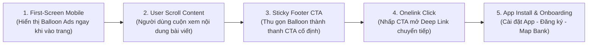

# BÁO CÁO HIỆU SUẤT KÊNH WEB PLATFORM & CHUYỂN ĐỔI NGƯỜI DÙNG MỚI (THÁNG 08/2026)

> **Đơn vị báo cáo:** Web Platform Team (Growth Platform Division)  
> **Thời gian số liệu:** Tháng 08/2026 (Cập nhật MTD 28 ngày, từ 01/08/2026 đến 28/08/2026)  
> **Nguồn dữ liệu:** `WEB_L4_EVENT_PAGE_MASTER` & `Web Performance Tracking (1).xlsx`

---

## I. TỔNG QUAN HIỆU SUẤT TRUY CẬP (OVERALL PERFORMANCE DASHBOARD)

### 1. Bảng Tổng Hợp Chỉ Số Web Overall (T8/2026 MTD vs T7/2026 MTD & T7/2026 Full)

<table style="width:100%; border-collapse:collapse; border:1.5px solid #64748b; margin:1em 0; font-size:0.9em;">
  <thead>
    <tr style="background-color:#f1f5f9;">
      <th style="border:1.5px solid #64748b; padding:8px 12px; text-align:left; font-weight:700;">Kênh Truy Cập (Source Group)</th>
      <th style="border:1.5px solid #64748b; padding:8px 12px; text-align:right; font-weight:700;">T5/2026 (Full)</th>
      <th style="border:1.5px solid #64748b; padding:8px 12px; text-align:right; font-weight:700;">T6/2026 (Full)</th>
      <th style="border:1.5px solid #64748b; padding:8px 12px; text-align:right; font-weight:700;">T7/2026 (Full)</th>
      <th style="border:1.5px solid #64748b; padding:8px 12px; text-align:right; font-weight:700;">T7/2026 (MTD 28d)</th>
      <th style="border:1.5px solid #64748b; padding:8px 12px; text-align:right; font-weight:700;">T8/2026 (MTD 28d)</th>
      <th style="border:1.5px solid #64748b; padding:8px 12px; text-align:right; font-weight:700;">MoM (%) (MTD)</th>
      <th style="border:1.5px solid #64748b; padding:8px 12px; text-align:right; font-weight:700;">Tỷ Trọng T8 (%)</th>
    </tr>
  </thead>
  <tbody>
    <tr>
      <td style="border:1px solid #94a3b8; padding:8px 12px; text-align:left;"><strong>Organic Search</strong></td>
      <td style="border:1px solid #94a3b8; padding:8px 12px; text-align:right;">1.669.698</td>
      <td style="border:1px solid #94a3b8; padding:8px 12px; text-align:right;">1.648.737</td>
      <td style="border:1px solid #94a3b8; padding:8px 12px; text-align:right;">1.875.191</td>
      <td style="border:1px solid #94a3b8; padding:8px 12px; text-align:right;">1.713.500</td>
      <td style="border:1px solid #94a3b8; padding:8px 12px; text-align:right;">1.356.384</td>
      <td style="border:1px solid #94a3b8; padding:8px 12px; text-align:right; color:#dc2626;">-20.84%</td>
      <td style="border:1px solid #94a3b8; padding:8px 12px; text-align:right; font-weight:700;">50.36%</td>
    </tr>
    <tr style="background-color:#f8fafc;">
      <td style="border:1px solid #94a3b8; padding:8px 12px; text-align:left;"><strong>Direct Traffic</strong></td>
      <td style="border:1px solid #94a3b8; padding:8px 12px; text-align:right;">637.056</td>
      <td style="border:1px solid #94a3b8; padding:8px 12px; text-align:right;">488.592</td>
      <td style="border:1px solid #94a3b8; padding:8px 12px; text-align:right;">440.855</td>
      <td style="border:1px solid #94a3b8; padding:8px 12px; text-align:right;">406.154</td>
      <td style="border:1px solid #94a3b8; padding:8px 12px; text-align:right;">532.466</td>
      <td style="border:1px solid #94a3b8; padding:8px 12px; text-align:right; color:#16a34a; font-weight:700;">+31.10%</td>
      <td style="border:1px solid #94a3b8; padding:8px 12px; text-align:right; font-weight:700;">19.77%</td>
    </tr>
    <tr>
      <td style="border:1px solid #94a3b8; padding:8px 12px; text-align:left;"><strong>Paid Traffic</strong></td>
      <td style="border:1px solid #94a3b8; padding:8px 12px; text-align:right;">720.890</td>
      <td style="border:1px solid #94a3b8; padding:8px 12px; text-align:right;">982.492</td>
      <td style="border:1px solid #94a3b8; padding:8px 12px; text-align:right;">497.958</td>
      <td style="border:1px solid #94a3b8; padding:8px 12px; text-align:right;">371.488</td>
      <td style="border:1px solid #94a3b8; padding:8px 12px; text-align:right;">506.213</td>
      <td style="border:1px solid #94a3b8; padding:8px 12px; text-align:right; color:#16a34a; font-weight:700;">+36.27%</td>
      <td style="border:1px solid #94a3b8; padding:8px 12px; text-align:right; font-weight:700;">18.79%</td>
    </tr>
    <tr style="background-color:#f8fafc;">
      <td style="border:1px solid #94a3b8; padding:8px 12px; text-align:left;"><strong>Referral Traffic</strong></td>
      <td style="border:1px solid #94a3b8; padding:8px 12px; text-align:right;">201.216</td>
      <td style="border:1px solid #94a3b8; padding:8px 12px; text-align:right;">255.134</td>
      <td style="border:1px solid #94a3b8; padding:8px 12px; text-align:right;">329.659</td>
      <td style="border:1px solid #94a3b8; padding:8px 12px; text-align:right;">303.559</td>
      <td style="border:1px solid #94a3b8; padding:8px 12px; text-align:right;">279.522</td>
      <td style="border:1px solid #94a3b8; padding:8px 12px; text-align:right; color:#dc2626;">-7.92%</td>
      <td style="border:1px solid #94a3b8; padding:8px 12px; text-align:right; font-weight:700;">10.38%</td>
    </tr>
    <tr>
      <td style="border:1px solid #94a3b8; padding:8px 12px; text-align:left;"><strong>Others</strong></td>
      <td style="border:1px solid #94a3b8; padding:8px 12px; text-align:right;">44.750</td>
      <td style="border:1px solid #94a3b8; padding:8px 12px; text-align:right;">33.223</td>
      <td style="border:1px solid #94a3b8; padding:8px 12px; text-align:right;">24.158</td>
      <td style="border:1px solid #94a3b8; padding:8px 12px; text-align:right;">22.067</td>
      <td style="border:1px solid #94a3b8; padding:8px 12px; text-align:right;">18.948</td>
      <td style="border:1px solid #94a3b8; padding:8px 12px; text-align:right; color:#dc2626;">-14.13%</td>
      <td style="border:1px solid #94a3b8; padding:8px 12px; text-align:right; font-weight:700;">0.70%</td>
    </tr>
    <tr style="background-color:#f1f5f9; font-weight:700;">
      <td style="border:1.5px solid #64748b; padding:8px 12px; text-align:left;"><strong>TỔNG CỘNG (TOTAL PAGEVIEWS)</strong></td>
      <td style="border:1.5px solid #64748b; padding:8px 12px; text-align:right;">3.273.610</td>
      <td style="border:1.5px solid #64748b; padding:8px 12px; text-align:right;">3.408.178</td>
      <td style="border:1.5px solid #64748b; padding:8px 12px; text-align:right;">3.167.821</td>
      <td style="border:1.5px solid #64748b; padding:8px 12px; text-align:right;">2.816.768</td>
      <td style="border:1.5px solid #64748b; padding:8px 12px; text-align:right;">2.693.533</td>
      <td style="border:1.5px solid #64748b; padding:8px 12px; text-align:right; color:#dc2626;">-4.38%</td>
      <td style="border:1.5px solid #64748b; padding:8px 12px; text-align:right;">100.00%</td>
    </tr>
  </tbody>
</table>

### 2. Đánh Giá Động Lực Tăng Trưởng & Biến Động Lưu Lượng (Traffic Observation)
- **Tổng quy mô lưu lượng:** Tháng 8 tính đến ngày 28/08 ghi nhận **2.693.533 Page Views** (MTD 28 ngày). Dự kiến quy đổi tròn 31 ngày đạt khoảng **2,98M Page Views**, giữ vững nhịp lưu lượng ổn định xấp xỉ mốc 3.0M Page Views/tháng.
- **Bứt phá mạnh từ Paid Traffic (+36.27% MoM MTD):** Tăng từ 371.488 PV lên **506.213 PV**. Động lực tăng trưởng chính xuất phát từ các chiến dịch Ads đẩy mạnh phễu New User (CHAOMOMO 500K) và Ads chiến dịch Phim rạp hot.
- **Tăng trưởng vững chắc của Direct Traffic (+31.10% MoM MTD):** Đạt **532.466 PV** (tăng từ 406.154 PV cùng kỳ tháng trước), phản ánh nhận diện thương hiệu Web MoMo (`momo.vn`) cải thiện rõ rệt và lượng người dùng quay lại thường xuyên tăng mạnh.
- **Organic Search duy trì vị thế cột trụ (50.36% Tỷ trọng):** Đạt **1.356.384 PV MTD**. Dù chịu ảnh hưởng biến động mùa vụ cuối hè, Organic Search vẫn giữ vững vai trò kênh thu hút tự nhiên lớn nhất toàn trang.

---

## II. TẬP TRUNG TĂNG TRƯỞNG NGƯỜI DÙNG MỚI (NEW USER GROWTH & ADS FUNNEL)

### 1. Sơ Đồ Cơ Chế Hiển Thị Balloon Ads Trên Giao Diện Mobile (Mobile Balloon Ads UX Flow)

### Bảng Phân Tích Chi Tiết Các Bước Luồng Chuyển Đổi Mobile Balloon Ads:

<table style="width:100%; border-collapse:collapse; border:1.5px solid #64748b; margin:1em 0; font-size:0.9em;">
  <thead>
    <tr style="background-color:#f1f5f9;">
      <th style="border:1.5px solid #64748b; padding:8px 12px; text-align:center; font-weight:700;">Bước</th>
      <th style="border:1.5px solid #64748b; padding:8px 12px; text-align:left; font-weight:700;">Tên Giai Đoạn</th>
      <th style="border:1.5px solid #64748b; padding:8px 12px; text-align:left; font-weight:700;">Trải Nghiệm Người Dùng (UX)</th>
      <th style="border:1.5px solid #64748b; padding:8px 12px; text-align:left; font-weight:700;">Hạ Tầng / Cơ Chế Kỹ Thuật</th>
      <th style="border:1.5px solid #64748b; padding:8px 12px; text-align:left; font-weight:700;">Nền Tảng</th>
    </tr>
  </thead>
  <tbody>
    <tr>
      <td style="border:1px solid #94a3b8; padding:8px 12px; text-align:center;">1</td>
      <td style="border:1px solid #94a3b8; padding:8px 12px; text-align:left;">First-Screen Impression</td>
      <td style="border:1px solid #94a3b8; padding:8px 12px; text-align:left;">Xuất hiện Banner Balloon Ads nổi bật góc màn hình ngay màn hình đầu tiên khi đọc bài.</td>
      <td style="border:1px solid #94a3b8; padding:8px 12px; text-align:left;">Dynamic Floating Overlay Component</td>
      <td style="border:1px solid #94a3b8; padding:8px 12px; text-align:left;">Mobile Web</td>
    </tr>
    <tr style="background-color:#f8fafc;">
      <td style="border:1px solid #94a3b8; padding:8px 12px; text-align:center;">2</td>
      <td style="border:1px solid #94a3b8; padding:8px 12px; text-align:left;">User Scroll Behavior</td>
      <td style="border:1px solid #94a3b8; padding:8px 12px; text-align:left;">Người dùng cuộn trang tìm kiếm thông tin, Balloon Ads tự động co dãn không gây che khuất chữ.</td>
      <td style="border:1px solid #94a3b8; padding:8px 12px; text-align:left;">Scroll Trigger Event Listener</td>
      <td style="border:1px solid #94a3b8; padding:8px 12px; text-align:left;">Mobile Web</td>
    </tr>
    <tr>
      <td style="border:1px solid #94a3b8; padding:8px 12px; text-align:center;">3</td>
      <td style="border:1px solid #94a3b8; padding:8px 12px; text-align:left;">Sticky Footer Transition</td>
      <td style="border:1px solid #94a3b8; padding:8px 12px; text-align:left;">Balloon Ads neo chặt thành thanh Sticky Footer CTA dưới đáy màn hình theo dấu chân người đọc.</td>
      <td style="border:1px solid #94a3b8; padding:8px 12px; text-align:left;">CSS Sticky Position & Intersection Observer API</td>
      <td style="border:1px solid #94a3b8; padding:8px 12px; text-align:left;">Mobile Web</td>
    </tr>
    <tr style="background-color:#f8fafc;">
      <td style="border:1px solid #94a3b8; padding:8px 12px; text-align:center;">4</td>
      <td style="border:1px solid #94a3b8; padding:8px 12px; text-align:left;">Deep Link Conversion</td>
      <td style="border:1px solid #94a3b8; padding:8px 12px; text-align:left;">Nhấp nút CTA "Nhận Quà 500K", kích hoạt Onelink điều hướng trực tiếp sang App Store/Google Play.</td>
      <td style="border:1px solid #94a3b8; padding:8px 12px; text-align:left;">Appsflyer Onelink Smart Script</td>
      <td style="border:1px solid #94a3b8; padding:8px 12px; text-align:left;">Web ➔ Store</td>
    </tr>
    <tr>
      <td style="border:1px solid #94a3b8; padding:8px 12px; text-align:center;">5</td>
      <td style="border:1px solid #94a3b8; padding:8px 12px; text-align:left;">Full Onboarding Funnel</td>
      <td style="border:1px solid #94a3b8; padding:8px 12px; text-align:left;">Hoàn tất Tải App ➔ Đăng ký tài khoản mới (REG) ➔ Liên kết tài khoản ngân hàng (Map Bank).</td>
      <td style="border:1px solid #94a3b8; padding:8px 12px; text-align:left;">SDK Tracking Full Funnel Pipeline</td>
      <td style="border:1px solid #94a3b8; padding:8px 12px; text-align:left;">App MoMo</td>
    </tr>
  </tbody>
</table>

### 2. Số Liệu Chuyển Đổi Phễu New User Ads Theo Từng Chiến Dịch (Tháng 08/2026)

<table style="width:100%; border-collapse:collapse; border:1.5px solid #64748b; margin:1em 0; font-size:0.88em;">
  <thead>
    <tr style="background-color:#f1f5f9;">
      <th style="border:1.5px solid #64748b; padding:7px 10px; text-align:left; font-weight:700;">Chiến Dịch (Campaign Detail)</th>
      <th style="border:1.5px solid #64748b; padding:7px 10px; text-align:right; font-weight:700;"># Installs</th>
      <th style="border:1.5px solid #64748b; padding:7px 10px; text-align:right; font-weight:700;"># REG</th>
      <th style="border:1.5px solid #64748b; padding:7px 10px; text-align:right; font-weight:700;"># Map Bank</th>
      <th style="border:1.5px solid #64748b; padding:7px 10px; text-align:right; font-weight:700;"># MAU</th>
      <th style="border:1.5px solid #64748b; padding:7px 10px; text-align:right; font-weight:700;">%CR Reg</th>
      <th style="border:1.5px solid #64748b; padding:7px 10px; text-align:right; font-weight:700;">%CR Map</th>
    </tr>
  </thead>
  <tbody>
    <tr>
      <td style="border:1px solid #94a3b8; padding:7px 10px; text-align:left;">260805_NEW_WEB_N2MM_INS_C.CHAOMOMO_android</td>
      <td style="border:1px solid #94a3b8; padding:7px 10px; text-align:right;">2.873</td>
      <td style="border:1px solid #94a3b8; padding:7px 10px; text-align:right;">978</td>
      <td style="border:1px solid #94a3b8; padding:7px 10px; text-align:right;">508</td>
      <td style="border:1px solid #94a3b8; padding:7px 10px; text-align:right;">263</td>
      <td style="border:1px solid #94a3b8; padding:7px 10px; text-align:right;">34.04%</td>
      <td style="border:1px solid #94a3b8; padding:7px 10px; text-align:right;">51.94%</td>
    </tr>
    <tr style="background-color:#f8fafc;">
      <td style="border:1px solid #94a3b8; padding:7px 10px; text-align:left;">260805_NEW_WEB_N2MM_INS_C.CHAOMOMO_ios</td>
      <td style="border:1px solid #94a3b8; padding:7px 10px; text-align:right;">2.158</td>
      <td style="border:1px solid #94a3b8; padding:7px 10px; text-align:right;">659</td>
      <td style="border:1px solid #94a3b8; padding:7px 10px; text-align:right;">485</td>
      <td style="border:1px solid #94a3b8; padding:7px 10px; text-align:right;">279</td>
      <td style="border:1px solid #94a3b8; padding:7px 10px; text-align:right;">30.54%</td>
      <td style="border:1px solid #94a3b8; padding:7px 10px; text-align:right; font-weight:700; color:#16a34a;">73.60%</td>
    </tr>
    <tr>
      <td style="border:1px solid #94a3b8; padding:7px 10px; text-align:left;">260407_NEW_INTERNAL_WEB_N2MM_CAS_WEB_BRT_C.CHAOMOMO (Android)</td>
      <td style="border:1px solid #94a3b8; padding:7px 10px; text-align:right;">1.208</td>
      <td style="border:1px solid #94a3b8; padding:7px 10px; text-align:right;">457</td>
      <td style="border:1px solid #94a3b8; padding:7px 10px; text-align:right;">219</td>
      <td style="border:1px solid #94a3b8; padding:7px 10px; text-align:right;">113</td>
      <td style="border:1px solid #94a3b8; padding:7px 10px; text-align:right;">37.83%</td>
      <td style="border:1px solid #94a3b8; padding:7px 10px; text-align:right;">47.92%</td>
    </tr>
    <tr style="background-color:#f8fafc;">
      <td style="border:1px solid #94a3b8; padding:7px 10px; text-align:left;">260407_NEW_INTERNAL_WEB_N2MM_CAS_WEB_BRT_C.CHAOMOMO (iOS)</td>
      <td style="border:1px solid #94a3b8; padding:7px 10px; text-align:right;">828</td>
      <td style="border:1px solid #94a3b8; padding:7px 10px; text-align:right;">308</td>
      <td style="border:1px solid #94a3b8; padding:7px 10px; text-align:right;">213</td>
      <td style="border:1px solid #94a3b8; padding:7px 10px; text-align:right;">130</td>
      <td style="border:1px solid #94a3b8; padding:7px 10px; text-align:right;">37.20%</td>
      <td style="border:1px solid #94a3b8; padding:7px 10px; text-align:right; font-weight:700; color:#16a34a;">69.16%</td>
    </tr>
    <tr>
      <td style="border:1px solid #94a3b8; padding:7px 10px; text-align:left;">260805_NEW_WEB_N2MM_INS_C.CHAOMOMO.CHAOMOMO_android</td>
      <td style="border:1px solid #94a3b8; padding:7px 10px; text-align:right;">596</td>
      <td style="border:1px solid #94a3b8; padding:7px 10px; text-align:right;">220</td>
      <td style="border:1px solid #94a3b8; padding:7px 10px; text-align:right;">125</td>
      <td style="border:1px solid #94a3b8; padding:7px 10px; text-align:right;">63</td>
      <td style="border:1px solid #94a3b8; padding:7px 10px; text-align:right;">36.91%</td>
      <td style="border:1px solid #94a3b8; padding:7px 10px; text-align:right;">56.82%</td>
    </tr>
    <tr style="background-color:#f8fafc;">
      <td style="border:1px solid #94a3b8; padding:7px 10px; text-align:left;">260805_NEW_WEB_N2MM_INS_C.PSN-CINEMA_ios</td>
      <td style="border:1px solid #94a3b8; padding:7px 10px; text-align:right;">544</td>
      <td style="border:1px solid #94a3b8; padding:7px 10px; text-align:right;">180</td>
      <td style="border:1px solid #94a3b8; padding:7px 10px; text-align:right;">113</td>
      <td style="border:1px solid #94a3b8; padding:7px 10px; text-align:right;">68</td>
      <td style="border:1px solid #94a3b8; padding:7px 10px; text-align:right;">33.09%</td>
      <td style="border:1px solid #94a3b8; padding:7px 10px; text-align:right; font-weight:700; color:#16a34a;">62.78%</td>
    </tr>
    <tr>
      <td style="border:1px solid #94a3b8; padding:7px 10px; text-align:left;">260805_NEW_WEB_N2MM_INS_C.CHAOMOMO.CHAOMOMO_ios</td>
      <td style="border:1px solid #94a3b8; padding:7px 10px; text-align:right;">386</td>
      <td style="border:1px solid #94a3b8; padding:7px 10px; text-align:right;">147</td>
      <td style="border:1px solid #94a3b8; padding:7px 10px; text-align:right;">107</td>
      <td style="border:1px solid #94a3b8; padding:7px 10px; text-align:right;">72</td>
      <td style="border:1px solid #94a3b8; padding:7px 10px; text-align:right;">38.08%</td>
      <td style="border:1px solid #94a3b8; padding:7px 10px; text-align:right; font-weight:700; color:#16a34a;">72.79%</td>
    </tr>
    <tr style="background-color:#f8fafc;">
      <td style="border:1px solid #94a3b8; padding:7px 10px; text-align:left;">260805_NEW_WEB_N2MM_INS_C.PSN-CINEMA_android</td>
      <td style="border:1px solid #94a3b8; padding:7px 10px; text-align:right;">223</td>
      <td style="border:1px solid #94a3b8; padding:7px 10px; text-align:right;">89</td>
      <td style="border:1px solid #94a3b8; padding:7px 10px; text-align:right;">36</td>
      <td style="border:1px solid #94a3b8; padding:7px 10px; text-align:right;">24</td>
      <td style="border:1px solid #94a3b8; padding:7px 10px; text-align:right;">39.91%</td>
      <td style="border:1px solid #94a3b8; padding:7px 10px; text-align:right;">40.45%</td>
    </tr>
    <tr style="background-color:#f1f5f9; font-weight:700;">
      <td style="border:1.5px solid #64748b; padding:7px 10px; text-align:left;">GRAND TOTAL (TỔNG CỘNG)</td>
      <td style="border:1.5px solid #64748b; padding:7px 10px; text-align:right; color:#16a34a;">9.300</td>
      <td style="border:1.5px solid #64748b; padding:7px 10px; text-align:right; color:#16a34a;">3.228</td>
      <td style="border:1.5px solid #64748b; padding:7px 10px; text-align:right; color:#16a34a;">1.806</td>
      <td style="border:1.5px solid #64748b; padding:7px 10px; text-align:right; color:#16a34a;">1.012</td>
      <td style="border:1.5px solid #64748b; padding:7px 10px; text-align:right;">34.71%</td>
      <td style="border:1.5px solid #64748b; padding:7px 10px; text-align:right; color:#16a34a;">55.95%</td>
    </tr>
  </tbody>
</table>

- **Tổng số lượng cài đặt thành công (Install App):** Đạt **9.300 Installs**, trong đó gói quà chào mừng **CHAOMOMO** đóng góp **8.049 installs (86.55%)**, chiến dịch **Cinema Ads (PSN-CINEMA)** đóng góp **767 installs (8.25%)**.
- **Hiệu suất chuyển đổi phễu Onboarding:**
  - **Tạo mới tài khoản (%CR Reg/Install):** Đạt **34.71%** (tổng cộng **3.228 REG** mới).
  - **Liên kết ngân hàng (%CR Map/Reg):** Đạt **55.95%** (tổng cộng **1.806 Map Bank** thành công).
  - **Kích hoạt giao dịch thực (%CR MAU/Map):** Đạt **56.04%** (tổng cộng **1.012 MAU** phát sinh giao dịch).
  - **Chất lượng tệp iOS vượt trội:** Tỷ lệ Map Bank/Reg đạt **70.94%** (918 Map/1.294 REG), đóng góp **549 MAU** (chiếm 54.25% toàn kênh).

---

## III. PHÂN TÍCH HIỆU SUẤT THEO DỰ ÁN VÀ STRATEGIC WEBSITES

<table style="width:100%; border-collapse:collapse; border:1.5px solid #64748b; margin:1em 0; font-size:0.9em;">
  <thead>
    <tr style="background-color:#f1f5f9;">
      <th style="border:1.5px solid #64748b; padding:8px 12px; text-align:left; font-weight:700;">Dự Án / Strategic Hub</th>
      <th style="border:1.5px solid #64748b; padding:8px 12px; text-align:right; font-weight:700;">Traffic T8/2026 (MTD 28d)</th>
      <th style="border:1.5px solid #64748b; padding:8px 12px; text-align:right; font-weight:700;">Traffic T7/2026 (MTD 28d)</th>
      <th style="border:1.5px solid #64748b; padding:8px 12px; text-align:right; font-weight:700;">Tăng Trưởng MoM (%)</th>
      <th style="border:1.5px solid #64748b; padding:8px 12px; text-align:left; font-weight:700;">Đánh Giá Tiến Độ Vận Hành & Điểm Nổi Bật</th>
    </tr>
  </thead>
  <tbody>
    <tr>
      <td style="border:1px solid #94a3b8; padding:8px 12px; text-align:left;"><strong>Cinema Hub (Tổng Cụm)</strong></td>
      <td style="border:1px solid #94a3b8; padding:8px 12px; text-align:right;">611.487</td>
      <td style="border:1px solid #94a3b8; padding:8px 12px; text-align:right;">731.480</td>
      <td style="border:1px solid #94a3b8; padding:8px 12px; text-align:right; color:#dc2626;">-16.40%</td>
      <td style="border:1px solid #94a3b8; padding:8px 12px; text-align:left;">Chiếm 22.70% tổng traffic Web. Đã live bản demo thanh toán QR Code mua vé rạp trực tiếp ngoài Web ngày 17/08. Rà soát làm sạch nội dung rác.</td>
    </tr>
    <tr style="background-color:#f8fafc;">
      <td style="border:1px solid #94a3b8; padding:8px 12px; text-align:left;"><strong>Phạt Nguội (Vehicle Hub Anchor)</strong></td>
      <td style="border:1px solid #94a3b8; padding:8px 12px; text-align:right;">200.659</td>
      <td style="border:1px solid #94a3b8; padding:8px 12px; text-align:right;">135.354</td>
      <td style="border:1px solid #94a3b8; padding:8px 12px; text-align:right; color:#16a34a; font-weight:700;">+48.25%</td>
      <td style="border:1px solid #94a3b8; padding:8px 12px; text-align:left;">Bứt phá tăng trưởng trở lại nhờ công cụ GenAI Content Pipeline xuất bản Location Pages chuẩn SEO/GEO. Kéo theo Vé Xe Khách tăng lên 89.028 PV và BHXM tăng lên 6.027 PV.</td>
    </tr>
    <tr>
      <td style="border:1px solid #94a3b8; padding:8px 12px; text-align:left;"><strong>Financial Hub (Finhub General)</strong></td>
      <td style="border:1px solid #94a3b8; padding:8px 12px; text-align:right;">178.375</td>
      <td style="border:1px solid #94a3b8; padding:8px 12px; text-align:right;">109.514</td>
      <td style="border:1px solid #94a3b8; padding:8px 12px; text-align:right; color:#16a34a; font-weight:700;">+62.88%</td>
      <td style="border:1px solid #94a3b8; padding:8px 12px; text-align:left;">Tăng trưởng vượt bậc nhờ nhúng các tiện ích tính toán tài chính. Sẵn sàng luồng Staging 2 ngày (17-18/08) để duyệt sản phẩm.</td>
    </tr>
    <tr style="background-color:#f8fafc;">
      <td style="border:1px solid #94a3b8; padding:8px 12px; text-align:left;"><strong>Vay Nhanh (Financial Sub-usecase)</strong></td>
      <td style="border:1px solid #94a3b8; padding:8px 12px; text-align:right;">93.970</td>
      <td style="border:1px solid #94a3b8; padding:8px 12px; text-align:right;">56.280</td>
      <td style="border:1px solid #94a3b8; padding:8px 12px; text-align:right; color:#16a34a; font-weight:700;">+66.97%</td>
      <td style="border:1px solid #94a3b8; padding:8px 12px; text-align:left;">Tăng trưởng mạnh nhờ tối ưu hóa bộ công cụ giả lập khoản vay và tính lịch trả nợ gốc lãi tự động.</td>
    </tr>
    <tr>
      <td style="border:1px solid #94a3b8; padding:8px 12px; text-align:left;"><strong>Điểm Tín Dụng (CIC)</strong></td>
      <td style="border:1px solid #94a3b8; padding:8px 12px; text-align:right;">60.879</td>
      <td style="border:1px solid #94a3b8; padding:8px 12px; text-align:right;">23.312</td>
      <td style="border:1px solid #94a3b8; padding:8px 12px; text-align:right; color:#16a34a; font-weight:700;">+161.15%</td>
      <td style="border:1px solid #94a3b8; padding:8px 12px; text-align:left;">Bùng nổ gấp 2.6 lần so với tháng trước nhờ triển khai Content Plan chuyên đề CIC và tích hợp công cụ tra cứu điểm tín dụng.</td>
    </tr>
    <tr style="background-color:#f8fafc;">
      <td style="border:1px solid #94a3b8; padding:8px 12px; text-align:left;"><strong>Home MoMo (Trang Chủ Web)</strong></td>
      <td style="border:1px solid #94a3b8; padding:8px 12px; text-align:right;">156.383</td>
      <td style="border:1px solid #94a3b8; padding:8px 12px; text-align:right;">177.931</td>
      <td style="border:1px solid #94a3b8; padding:8px 12px; text-align:right; color:#dc2626;">-12.11%</td>
      <td style="border:1px solid #94a3b8; padding:8px 12px; text-align:left;">Tối ưu hóa lại cấu trúc hiển thị trang chủ và điều hướng bớt lượng traffic vãng lai về các Hub chuyên sâu.</td>
    </tr>
    <tr>
      <td style="border:1px solid #94a3b8; padding:8px 12px; text-align:left;"><strong>Sim & Esim Services</strong></td>
      <td style="border:1px solid #94a3b8; padding:8px 12px; text-align:right;">46.879</td>
      <td style="border:1px solid #94a3b8; padding:8px 12px; text-align:right;">33.404</td>
      <td style="border:1px solid #94a3b8; padding:8px 12px; text-align:right; color:#16a34a; font-weight:700;">+40.34%</td>
      <td style="border:1px solid #94a3b8; padding:8px 12px; text-align:left;">Sim vật lý tăng lên 31.544 PV (+32.6%) và Esim tăng lên 15.335 PV (+59.5%) nhờ áp dụng kiến trúc SPA từ blueprint Phạt Nguội.</td>
    </tr>
  </tbody>
</table>

---

## IV. LỘ TRÌNH KẾ HOẠCH & ACTION ITEMS THÁNG 09/2026 (ROADMAP)

<table style="width:100%; border-collapse:collapse; border:1.5px solid #64748b; margin:1em 0; font-size:0.9em;">
  <thead>
    <tr style="background-color:#f1f5f9;">
      <th style="border:1.5px solid #64748b; padding:8px 12px; text-align:left; font-weight:700;">Giai Đoạn</th>
      <th style="border:1.5px solid #64748b; padding:8px 12px; text-align:left; font-weight:700;">Thời Gian</th>
      <th style="border:1.5px solid #64748b; padding:8px 12px; text-align:left; font-weight:700;">Tên Giai Đoạn</th>
      <th style="border:1.5px solid #64748b; padding:8px 12px; text-align:left; font-weight:700;">Chi Tiết Triển Khai & Mục Tiêu Trọng Tâm</th>
    </tr>
  </thead>
  <tbody>
    <tr>
      <td style="border:1px solid #94a3b8; padding:8px 12px; text-align:left;"><strong>Giai đoạn 1</strong></td>
      <td style="border:1px solid #94a3b8; padding:8px 12px; text-align:left;">Đầu Tháng 09/2026</td>
      <td style="border:1px solid #94a3b8; padding:8px 12px; text-align:left;">Financial Hub & Tooling Launch</td>
      <td style="border:1px solid #94a3b8; padding:8px 12px; text-align:left;">Chính thức nghiệm thu bản Production cho Financial Hub sau đợt review staging. Đưa 3 công cụ tiện ích (Lãi suất tiết kiệm, BHXH, Lương hưu) lên trang chính thức và đẩy mạnh Content Plan cho chủ đề CIC.</td>
    </tr>
    <tr style="background-color:#f8fafc;">
      <td style="border:1px solid #94a3b8; padding:8px 12px; text-align:left;"><strong>Giai đoạn 2</strong></td>
      <td style="border:1px solid #94a3b8; padding:8px 12px; text-align:left;">Giữa Tháng 09/2026</td>
      <td style="border:1px solid #94a3b8; padding:8px 12px; text-align:left;">Student Hub Go-Live & Mini-Web Expansion</td>
      <td style="border:1px solid #94a3b8; padding:8px 12px; text-align:left;">Xuất bản chính thức Student Hub với 3 trang chuyên đề (Sinh viên, Trường học, Bảng xếp hạng) và hệ thống mini-web cho từng trường đại học. Triển khai bộ 30+ bài viết cẩm nang tân sinh viên.</td>
    </tr>
    <tr>
      <td style="border:1px solid #94a3b8; padding:8px 12px; text-align:left;"><strong>Giai đoạn 3</strong></td>
      <td style="border:1px solid #94a3b8; padding:8px 12px; text-align:left;">Cuối Tháng 09/2026</td>
      <td style="border:1px solid #94a3b8; padding:8px 12px; text-align:left;">Vehicle Hub MVP & Data Ingestion</td>
      <td style="border:1px solid #94a3b8; padding:8px 12px; text-align:left;">Hoàn thiện bản MVP cho Vehicle Hub trung tâm, đồng bộ dữ liệu hạ tầng tra cứu phạt nguội, giá xăng, trạm sạc, cứu hộ và bãi xe. Mở rộng phễu bán chéo Bảo hiểm Ô tô/Xe máy.</td>
    </tr>
    <tr style="background-color:#f8fafc;">
      <td style="border:1px solid #94a3b8; padding:8px 12px; text-align:left;"><strong>Giai đoạn 4</strong></td>
      <td style="border:1px solid #94a3b8; padding:8px 12px; text-align:left;">Toàn Tháng 09/2026</td>
      <td style="border:1px solid #94a3b8; padding:8px 12px; text-align:left;">MoSpark Scaling & AI Content Automation</td>
      <td style="border:1px solid #94a3b8; padding:8px 12px; text-align:left;">Tăng tốc công suất sản xuất GenAI Content trên MoSpark lên mốc 150+ bài/tháng. Đẩy mạnh kiểm duyệt tự động qua Guardrails System để nâng cao điểm SEO/GEO Onpage.</td>
    </tr>
  </tbody>
</table>
