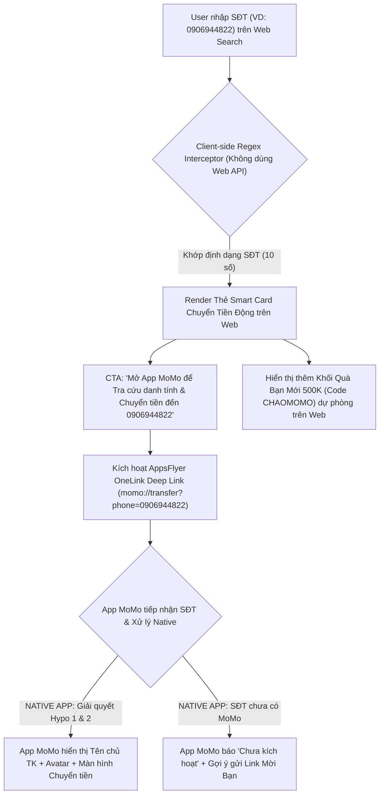
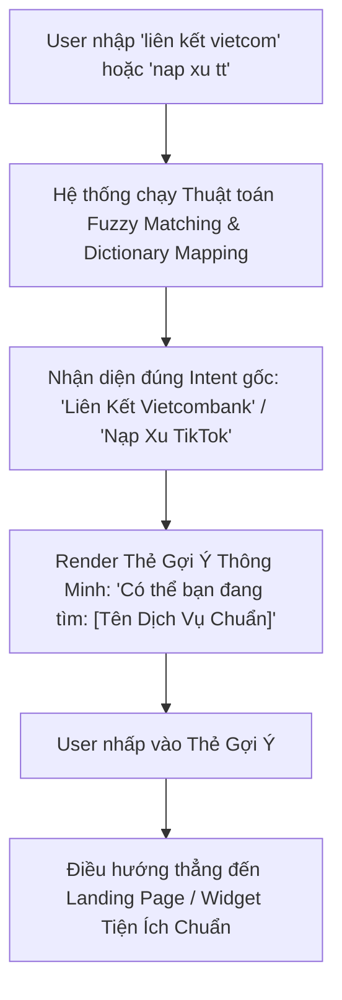

# BÁO CÁO PHÂN TÍCH SEARCH TERM & GIẢI PHÁP TỐI ƯU SEARCH UI/UX (Q3/2026)

> **Platform:** MoSpark Web Platform (`momo.vn/tim-kiem`)  
> **Thời gian đo lường:** Quý 3/2026 (Tháng 7, Tháng 8 & 22 ngày Tháng 9/2026)  
> **Nguồn dữ liệu:** Umami Real-time Tracking & Raw Title Logs (`tim-kiem-title-raw-T7-T9-2026.csv`)  
> **Quy mô dữ liệu:** 35.071 lượt views / 16.619 cụm từ khóa độc lập  

---

## I. BỐI CẢNH VÀ MỤC TIÊU CHIẾN LƯỢC

Trong bối cảnh AI Search (SearchGPT, Perplexity, Gemini AI Overviews) làm giảm tỷ lệ nhấp (CTR) từ kết quả tìm kiếm tự nhiên ngoài Google, Kênh Web `momo.vn` điều chỉnh định vị từ việc đuổi theo Pageviews bề nổi sang **Tối ưu hóa Tỷ lệ Trích dẫn (GEO/AEO Citation)** và **Nâng cao Tỷ lệ Chuyển đổi Phễu Web-to-App (W2A CR ≥ 10.00% - 12.50%)**.

Đường dẫn `/tim-kiem` đóng vai trò là cửa ngõ tiếp nhận toàn bộ nhu cầu tìm kiếm của người dùng khi truy cập website. Phân tích dữ liệu 3 tháng Q3/2026 giúp nhận diện chính xác cấu trúc ý định tìm kiếm (Search Intent) và thiết kế lại giao diện tìm kiếm thông minh theo mô hình Product-Led Growth (PLG).

---

## II. MASTER SHEET: TỔNG HỢP TOÀN BỘ 24 CỤM SEARCH TERM QUÝ 3/2026

Bảng tổng hợp 100% dung lượng 35.071 lượt truy vấn Q3/2026 được giải nén chi tiết thành 24 cụm từ khóa:

<table style="width:100%; border-collapse:collapse; border:1.5px solid #64748b; margin:1em 0; font-size:0.9em;">
  <thead>
    <tr style="background-color:#f1f5f9;">
      <th style="border:1.5px solid #64748b; padding:8px 12px; text-align:left; font-weight:700;">STT</th>
      <th style="border:1.5px solid #64748b; padding:8px 12px; text-align:left; font-weight:700;">Phân Cụm Search Term Chi Tiết (Full Classification)</th>
      <th style="border:1.5px solid #64748b; padding:8px 12px; text-align:right; font-weight:700;">Số View Q3/26</th>
      <th style="border:1.5px solid #64748b; padding:8px 12px; text-align:right; font-weight:700;">Tỷ Trọng Q3 (%)</th>
      <th style="border:1.5px solid #64748b; padding:8px 12px; text-align:right; font-weight:700;">Tháng 7</th>
      <th style="border:1.5px solid #64748b; padding:8px 12px; text-align:right; font-weight:700;">Tháng 8</th>
      <th style="border:1.5px solid #64748b; padding:8px 12px; text-align:right; font-weight:700;">Tháng 9 (01-22)</th>
    </tr>
  </thead>
  <tbody>
    <tr>
      <td style="border:1px solid #94a3b8; padding:8px 12px; text-align:left;">1</td>
      <td style="border:1px solid #94a3b8; padding:8px 12px; text-align:left;"><strong>Long-tail: Truy Vấn Hỏi Đáp Siêu Ngách (Ultra Long-tail FAQ)</strong></td>
      <td style="border:1px solid #94a3b8; padding:8px 12px; text-align:right;">10.132</td>
      <td style="border:1px solid #94a3b8; padding:8px 12px; text-align:right;">28.89%</td>
      <td style="border:1px solid #94a3b8; padding:8px 12px; text-align:right;">3.447</td>
      <td style="border:1px solid #94a3b8; padding:8px 12px; text-align:right;">3.878</td>
      <td style="border:1px solid #94a3b8; padding:8px 12px; text-align:right;">2.807</td>
    </tr>
    <tr style="background-color:#f8fafc;">
      <td style="border:1px solid #94a3b8; padding:8px 12px; text-align:left;">2</td>
      <td style="border:1px solid #94a3b8; padding:8px 12px; text-align:left;"><strong>Nạp Xu, Thẻ Game & Digital Goods</strong></td>
      <td style="border:1px solid #94a3b8; padding:8px 12px; text-align:right;">7.357</td>
      <td style="border:1px solid #94a3b8; padding:8px 12px; text-align:right;">20.98%</td>
      <td style="border:1px solid #94a3b8; padding:8px 12px; text-align:right;">3.883</td>
      <td style="border:1px solid #94a3b8; padding:8px 12px; text-align:right;">2.068</td>
      <td style="border:1px solid #94a3b8; padding:8px 12px; text-align:right;">1.406</td>
    </tr>
    <tr>
      <td style="border:1px solid #94a3b8; padding:8px 12px; text-align:left;">3</td>
      <td style="border:1px solid #94a3b8; padding:8px 12px; text-align:left;"><strong>Tìm Kiếm Thương Hiệu MoMo (Brand Terms)</strong></td>
      <td style="border:1px solid #94a3b8; padding:8px 12px; text-align:right;">2.904</td>
      <td style="border:1px solid #94a3b8; padding:8px 12px; text-align:right;">8.28%</td>
      <td style="border:1px solid #94a3b8; padding:8px 12px; text-align:right;">844</td>
      <td style="border:1px solid #94a3b8; padding:8px 12px; text-align:right;">1.207</td>
      <td style="border:1px solid #94a3b8; padding:8px 12px; text-align:right;">853</td>
    </tr>
    <tr style="background-color:#f8fafc;">
      <td style="border:1px solid #94a3b8; padding:8px 12px; text-align:left;">4</td>
      <td style="border:1px solid #94a3b8; padding:8px 12px; text-align:left;"><strong>Tra Cứu Tài Chính (CIC, Vay Nhanh, Ví Trả Sau)</strong></td>
      <td style="border:1px solid #94a3b8; padding:8px 12px; text-align:right;">2.304</td>
      <td style="border:1px solid #94a3b8; padding:8px 12px; text-align:right;">6.57%</td>
      <td style="border:1px solid #94a3b8; padding:8px 12px; text-align:right;">684</td>
      <td style="border:1px solid #94a3b8; padding:8px 12px; text-align:right;">918</td>
      <td style="border:1px solid #94a3b8; padding:8px 12px; text-align:right;">702</td>
    </tr>
    <tr>
      <td style="border:1px solid #94a3b8; padding:8px 12px; text-align:left;">5</td>
      <td style="border:1px solid #94a3b8; padding:8px 12px; text-align:left;"><strong>Search Rác: SĐT / STK / Mã Cá Nhân</strong></td>
      <td style="border:1px solid #94a3b8; padding:8px 12px; text-align:right;">2.090</td>
      <td style="border:1px solid #94a3b8; padding:8px 12px; text-align:right;">5.96%</td>
      <td style="border:1px solid #94a3b8; padding:8px 12px; text-align:right;">630</td>
      <td style="border:1px solid #94a3b8; padding:8px 12px; text-align:right;">881</td>
      <td style="border:1px solid #94a3b8; padding:8px 12px; text-align:right;">579</td>
    </tr>
    <tr style="background-color:#f8fafc;">
      <td style="border:1px solid #94a3b8; padding:8px 12px; text-align:left;">6</td>
      <td style="border:1px solid #94a3b8; padding:8px 12px; text-align:left;"><strong>Đăng Nhập, Đăng Ký & Sự Cố App</strong></td>
      <td style="border:1px solid #94a3b8; padding:8px 12px; text-align:right;">1.783</td>
      <td style="border:1px solid #94a3b8; padding:8px 12px; text-align:right;">5.08%</td>
      <td style="border:1px solid #94a3b8; padding:8px 12px; text-align:right;">545</td>
      <td style="border:1px solid #94a3b8; padding:8px 12px; text-align:right;">785</td>
      <td style="border:1px solid #94a3b8; padding:8px 12px; text-align:right;">453</td>
    </tr>
    <tr>
      <td style="border:1px solid #94a3b8; padding:8px 12px; text-align:left;">7</td>
      <td style="border:1px solid #94a3b8; padding:8px 12px; text-align:left;"><strong>Hướng Dẫn Liên Kết Tài Khoản / Ngân Hàng</strong></td>
      <td style="border:1px solid #94a3b8; padding:8px 12px; text-align:right;">1.420</td>
      <td style="border:1px solid #94a3b8; padding:8px 12px; text-align:right;">4.05%</td>
      <td style="border:1px solid #94a3b8; padding:8px 12px; text-align:right;">460</td>
      <td style="border:1px solid #94a3b8; padding:8px 12px; text-align:right;">554</td>
      <td style="border:1px solid #94a3b8; padding:8px 12px; text-align:right;">406</td>
    </tr>
    <tr style="background-color:#f8fafc;">
      <td style="border:1px solid #94a3b8; padding:8px 12px; text-align:left;">8</td>
      <td style="border:1px solid #94a3b8; padding:8px 12px; text-align:left;"><strong>Xem Phim & Cinema Hub</strong></td>
      <td style="border:1px solid #94a3b8; padding:8px 12px; text-align:right;">1.385</td>
      <td style="border:1px solid #94a3b8; padding:8px 12px; text-align:right;">3.95%</td>
      <td style="border:1px solid #94a3b8; padding:8px 12px; text-align:right;">586</td>
      <td style="border:1px solid #94a3b8; padding:8px 12px; text-align:right;">549</td>
      <td style="border:1px solid #94a3b8; padding:8px 12px; text-align:right;">250</td>
    </tr>
    <tr>
      <td style="border:1px solid #94a3b8; padding:8px 12px; text-align:left;">9</td>
      <td style="border:1px solid #94a3b8; padding:8px 12px; text-align:left;"><strong>Vé Máy Bay, Vé Tàu Xe & Travel Hub</strong></td>
      <td style="border:1px solid #94a3b8; padding:8px 12px; text-align:right;">1.039</td>
      <td style="border:1px solid #94a3b8; padding:8px 12px; text-align:right;">2.96%</td>
      <td style="border:1px solid #94a3b8; padding:8px 12px; text-align:right;">385</td>
      <td style="border:1px solid #94a3b8; padding:8px 12px; text-align:right;">425</td>
      <td style="border:1px solid #94a3b8; padding:8px 12px; text-align:right;">229</td>
    </tr>
    <tr style="background-color:#f8fafc;">
      <td style="border:1px solid #94a3b8; padding:8px 12px; text-align:left;">10</td>
      <td style="border:1px solid #94a3b8; padding:8px 12px; text-align:left;"><strong>Thanh Toán Hóa Đơn (Nước, Điện)</strong></td>
      <td style="border:1px solid #94a3b8; padding:8px 12px; text-align:right;">1.024</td>
      <td style="border:1px solid #94a3b8; padding:8px 12px; text-align:right;">2.92%</td>
      <td style="border:1px solid #94a3b8; padding:8px 12px; text-align:right;">299</td>
      <td style="border:1px solid #94a3b8; padding:8px 12px; text-align:right;">448</td>
      <td style="border:1px solid #94a3b8; padding:8px 12px; text-align:right;">277</td>
    </tr>
    <tr>
      <td style="border:1px solid #94a3b8; padding:8px 12px; text-align:left;">11</td>
      <td style="border:1px solid #94a3b8; padding:8px 12px; text-align:left;"><strong>Search Rác: Gõ Loạn Phím / Ký Tự Rác</strong></td>
      <td style="border:1px solid #94a3b8; padding:8px 12px; text-align:right;">596</td>
      <td style="border:1px solid #94a3b8; padding:8px 12px; text-align:right;">1.70%</td>
      <td style="border:1px solid #94a3b8; padding:8px 12px; text-align:right;">184</td>
      <td style="border:1px solid #94a3b8; padding:8px 12px; text-align:right;">233</td>
      <td style="border:1px solid #94a3b8; padding:8px 12px; text-align:right;">179</td>
    </tr>
    <tr style="background-color:#f8fafc;">
      <td style="border:1px solid #94a3b8; padding:8px 12px; text-align:left;">12</td>
      <td style="border:1px solid #94a3b8; padding:8px 12px; text-align:left;"><strong>Tra Cứu Phạt Nguội, Bảo Hiểm & Dịch Vụ Công</strong></td>
      <td style="border:1px solid #94a3b8; padding:8px 12px; text-align:right;">482</td>
      <td style="border:1px solid #94a3b8; padding:8px 12px; text-align:right;">1.37%</td>
      <td style="border:1px solid #94a3b8; padding:8px 12px; text-align:right;">156</td>
      <td style="border:1px solid #94a3b8; padding:8px 12px; text-align:right;">194</td>
      <td style="border:1px solid #94a3b8; padding:8px 12px; text-align:right;">132</td>
    </tr>
    <tr>
      <td style="border:1px solid #94a3b8; padding:8px 12px; text-align:left;">13</td>
      <td style="border:1px solid #94a3b8; padding:8px 12px; text-align:left;"><strong>Chiến Dịch Truyền Thông, Ưu Đãi & Gamification</strong></td>
      <td style="border:1px solid #94a3b8; padding:8px 12px; text-align:right;">448</td>
      <td style="border:1px solid #94a3b8; padding:8px 12px; text-align:right;">1.28%</td>
      <td style="border:1px solid #94a3b8; padding:8px 12px; text-align:right;">109</td>
      <td style="border:1px solid #94a3b8; padding:8px 12px; text-align:right;">229</td>
      <td style="border:1px solid #94a3b8; padding:8px 12px; text-align:right;">110</td>
    </tr>
    <tr style="background-color:#f8fafc;">
      <td style="border:1px solid #94a3b8; padding:8px 12px; text-align:left;">14</td>
      <td style="border:1px solid #94a3b8; padding:8px 12px; text-align:left;"><strong>Đối Tác, Merchant & Thiết Bị Loa</strong></td>
      <td style="border:1px solid #94a3b8; padding:8px 12px; text-align:right;">339</td>
      <td style="border:1px solid #94a3b8; padding:8px 12px; text-align:right;">0.97%</td>
      <td style="border:1px solid #94a3b8; padding:8px 12px; text-align:right;">102</td>
      <td style="border:1px solid #94a3b8; padding:8px 12px; text-align:right;">124</td>
      <td style="border:1px solid #94a3b8; padding:8px 12px; text-align:right;">113</td>
    </tr>
    <tr>
      <td style="border:1px solid #94a3b8; padding:8px 12px; text-align:left;">15</td>
      <td style="border:1px solid #94a3b8; padding:8px 12px; text-align:left;"><strong>Search Rác: Spam Cờ Bạc / Link Độc Hại</strong></td>
      <td style="border:1px solid #94a3b8; padding:8px 12px; text-align:right;">328</td>
      <td style="border:1px solid #94a3b8; padding:8px 12px; text-align:right;">0.94%</td>
      <td style="border:1px solid #94a3b8; padding:8px 12px; text-align:right;">79</td>
      <td style="border:1px solid #94a3b8; padding:8px 12px; text-align:right;">163</td>
      <td style="border:1px solid #94a3b8; padding:8px 12px; text-align:right;">86</td>
    </tr>
    <tr style="background-color:#f8fafc;">
      <td style="border:1px solid #94a3b8; padding:8px 12px; text-align:left;">16</td>
      <td style="border:1px solid #94a3b8; padding:8px 12px; text-align:left;"><strong>Long-tail: Thắc Mắc Kỹ Thuật, Hướng Dẫn & CSKH</strong></td>
      <td style="border:1px solid #94a3b8; padding:8px 12px; text-align:right;">289</td>
      <td style="border:1px solid #94a3b8; padding:8px 12px; text-align:right;">0.82%</td>
      <td style="border:1px solid #94a3b8; padding:8px 12px; text-align:right;">82</td>
      <td style="border:1px solid #94a3b8; padding:8px 12px; text-align:right;">136</td>
      <td style="border:1px solid #94a3b8; padding:8px 12px; text-align:right;">71</td>
    </tr>
    <tr>
      <td style="border:1px solid #94a3b8; padding:8px 12px; text-align:left;">17</td>
      <td style="border:1px solid #94a3b8; padding:8px 12px; text-align:left;"><strong>Long-tail: Tra Cứu Tên Cá Nhân & Tên Riêng TK</strong></td>
      <td style="border:1px solid #94a3b8; padding:8px 12px; text-align:right;">273</td>
      <td style="border:1px solid #94a3b8; padding:8px 12px; text-align:right;">0.78%</td>
      <td style="border:1px solid #94a3b8; padding:8px 12px; text-align:right;">95</td>
      <td style="border:1px solid #94a3b8; padding:8px 12px; text-align:right;">116</td>
      <td style="border:1px solid #94a3b8; padding:8px 12px; text-align:right;">62</td>
    </tr>
    <tr style="background-color:#f8fafc;">
      <td style="border:1px solid #94a3b8; padding:8px 12px; text-align:left;">18</td>
      <td style="border:1px solid #94a3b8; padding:8px 12px; text-align:left;"><strong>Chuyển Tiền & Nhận Tiền</strong></td>
      <td style="border:1px solid #94a3b8; padding:8px 12px; text-align:right;">270</td>
      <td style="border:1px solid #94a3b8; padding:8px 12px; text-align:right;">0.77%</td>
      <td style="border:1px solid #94a3b8; padding:8px 12px; text-align:right;">78</td>
      <td style="border:1px solid #94a3b8; padding:8px 12px; text-align:right;">102</td>
      <td style="border:1px solid #94a3b8; padding:8px 12px; text-align:right;">90</td>
    </tr>
    <tr>
      <td style="border:1px solid #94a3b8; padding:8px 12px; text-align:left;">19</td>
      <td style="border:1px solid #94a3b8; padding:8px 12px; text-align:left;"><strong>Search Rác: Tìm Kiếm Rỗng (Empty Query)</strong></td>
      <td style="border:1px solid #94a3b8; padding:8px 12px; text-align:right;">180</td>
      <td style="border:1px solid #94a3b8; padding:8px 12px; text-align:right;">0.51%</td>
      <td style="border:1px solid #94a3b8; padding:8px 12px; text-align:right;">44</td>
      <td style="border:1px solid #94a3b8; padding:8px 12px; text-align:right;">75</td>
      <td style="border:1px solid #94a3b8; padding:8px 12px; text-align:right;">61</td>
    </tr>
    <tr style="background-color:#f8fafc;">
      <td style="border:1px solid #94a3b8; padding:8px 12px; text-align:left;">20</td>
      <td style="border:1px solid #94a3b8; padding:8px 12px; text-align:left;"><strong>Long-tail: Dịch Vụ Mua Sắm & Thương Hiệu F&B</strong></td>
      <td style="border:1px solid #94a3b8; padding:8px 12px; text-align:right;">113</td>
      <td style="border:1px solid #94a3b8; padding:8px 12px; text-align:right;">0.32%</td>
      <td style="border:1px solid #94a3b8; padding:8px 12px; text-align:right;">34</td>
      <td style="border:1px solid #94a3b8; padding:8px 12px; text-align:right;">50</td>
      <td style="border:1px solid #94a3b8; padding:8px 12px; text-align:right;">29</td>
    </tr>
    <tr>
      <td style="border:1px solid #94a3b8; padding:8px 12px; text-align:left;">21</td>
      <td style="border:1px solid #94a3b8; padding:8px 12px; text-align:left;"><strong>MoMo Ship & Logistics</strong></td>
      <td style="border:1px solid #94a3b8; padding:8px 12px; text-align:right;">101</td>
      <td style="border:1px solid #94a3b8; padding:8px 12px; text-align:right;">0.29%</td>
      <td style="border:1px solid #94a3b8; padding:8px 12px; text-align:right;">27</td>
      <td style="border:1px solid #94a3b8; padding:8px 12px; text-align:right;">40</td>
      <td style="border:1px solid #94a3b8; padding:8px 12px; text-align:right;">34</td>
    </tr>
    <tr style="background-color:#f8fafc;">
      <td style="border:1px solid #94a3b8; padding:8px 12px; text-align:left;">22</td>
      <td style="border:1px solid #94a3b8; padding:8px 12px; text-align:left;"><strong>Long-tail: Xổ Số, Trạm Sạc & Tiện Ích Đời Sống</strong></td>
      <td style="border:1px solid #94a3b8; padding:8px 12px; text-align:right;">99</td>
      <td style="border:1px solid #94a3b8; padding:8px 12px; text-align:right;">0.28%</td>
      <td style="border:1px solid #94a3b8; padding:8px 12px; text-align:right;">25</td>
      <td style="border:1px solid #94a3b8; padding:8px 12px; text-align:right;">38</td>
      <td style="border:1px solid #94a3b8; padding:8px 12px; text-align:right;">36</td>
    </tr>
    <tr>
      <td style="border:1px solid #94a3b8; padding:8px 12px; text-align:left;">23</td>
      <td style="border:1px solid #94a3b8; padding:8px 12px; text-align:left;"><strong>Long-tail: Gói Cước Data 4G/5G Viễn Thông</strong></td>
      <td style="border:1px solid #94a3b8; padding:8px 12px; text-align:right;">76</td>
      <td style="border:1px solid #94a3b8; padding:8px 12px; text-align:right;">0.22%</td>
      <td style="border:1px solid #94a3b8; padding:8px 12px; text-align:right;">25</td>
      <td style="border:1px solid #94a3b8; padding:8px 12px; text-align:right;">33</td>
      <td style="border:1px solid #94a3b8; padding:8px 12px; text-align:right;">18</td>
    </tr>
    <tr style="background-color:#f8fafc;">
      <td style="border:1px solid #94a3b8; padding:8px 12px; text-align:left;">24</td>
      <td style="border:1px solid #94a3b8; padding:8px 12px; text-align:left;"><strong>Long-tail: Dịch Vụ Sinh Viên & Học Phí Giáo Dục</strong></td>
      <td style="border:1px solid #94a3b8; padding:8px 12px; text-align:right;">39</td>
      <td style="border:1px solid #94a3b8; padding:8px 12px; text-align:right;">0.11%</td>
      <td style="border:1px solid #94a3b8; padding:8px 12px; text-align:right;">10</td>
      <td style="border:1px solid #94a3b8; padding:8px 12px; text-align:right;">19</td>
      <td style="border:1px solid #94a3b8; padding:8px 12px; text-align:right;">10</td>
    </tr>
    <tr style="background-color:#f1f5f9;">
      <td style="border:1px solid #64748b; padding:8px 12px; text-align:left;"><strong>TỔNG CỘNG</strong></td>
      <td style="border:1px solid #64748b; padding:8px 12px; text-align:left;"><strong>TOÀN BỘ 24 CỤM SEARCH TERM Q3/2026</strong></td>
      <td style="border:1px solid #64748b; padding:8px 12px; text-align:right;"><strong>35.071</strong></td>
      <td style="border:1px solid #64748b; padding:8px 12px; text-align:right;"><strong>100.00%</strong></td>
      <td style="border:1px solid #64748b; padding:8px 12px; text-align:right;"><strong>12.813</strong></td>
      <td style="border:1px solid #64748b; padding:8px 12px; text-align:right;"><strong>13.265</strong></td>
      <td style="border:1px solid #64748b; padding:8px 12px; text-align:right;"><strong>8.993</strong></td>
    </tr>
  </tbody>
</table>

---

## III. MA TRẬN KỊCH BẢN ĐIỀU HƯỚNG BỘ SEARCH TERM CHUNG CHỦ ĐỀ (SEARCH REDIRECTION MATRIX)

Để tối ưu hóa trải nghiệm tìm kiếm và triệt tiêu ma sát tìm kiếm (Search Friction), MoSpark CMS thiết lập **Bảng Kịch Bản Điều Hướng Tự Động (Automation Redirection Matrix)** với nguyên tắc **1 Kịch Bản = 1 Link Đích Duy Nhất (1:1 Mapping)**. Khi người dùng nhập bất kỳ từ khóa nào nằm trong danh sách Match Rules (gồm cả từ gõ đúng, viết tắt, không dấu, hoặc từ đồng nghĩa), hệ thống lập tức hiển thị **Thẻ Gợi Ý Smart Card** và chuyển hướng thẳng đến **Link Đích (Destination Target URL)** chính thức trên `momo.vn`:

<table style="width:100%; border-collapse:collapse; border:1.5px solid #64748b; margin:1em 0; font-size:0.9em;">
  <thead>
    <tr style="background-color:#f1f5f9;">
      <th style="border:1.5px solid #64748b; padding:8px 12px; text-align:left; font-weight:700;">STT</th>
      <th style="border:1.5px solid #64748b; padding:8px 12px; text-align:left; font-weight:700;">Tên Kịch Bản Điều Hướng (1:1 Mapping)</th>
      <th style="border:1.5px solid #64748b; padding:8px 12px; text-align:left; font-weight:700;">Danh Sách Từ Khóa Áp Dụng (Target Match Terms)</th>
      <th style="border:1.5px solid #64748b; padding:8px 12px; text-align:left; font-weight:700;">Link Đích Duy Nhất (Destination Target URL)</th>
    </tr>
  </thead>
  <tbody>
    <tr>
      <td style="border:1px solid #94a3b8; padding:8px 12px; text-align:left;">1</td>
      <td style="border:1px solid #94a3b8; padding:8px 12px; text-align:left;"><strong>Kịch bản Nạp Xu TikTok</strong></td>
      <td style="border:1px solid #94a3b8; padding:8px 12px; text-align:left;"><code>nạp xu</code>, <code>nạp xu tiktok</code>, <code>nap xu tt</code>, <code>mua xu tiktok</code>, <code>nạp xu tik tok</code>, <code>napxutiktok</code>, <code>xu tiktok</code>, <code>mua xu</code></td>
      <td style="border:1px solid #94a3b8; padding:8px 12px; text-align:left;"><code>https://momo.vn/nap-xu-tiktok</code></td>
    </tr>
    <tr style="background-color:#f8fafc;">
      <td style="border:1px solid #94a3b8; padding:8px 12px; text-align:left;">2</td>
      <td style="border:1px solid #94a3b8; padding:8px 12px; text-align:left;"><strong>Kịch bản Nạp Thẻ Game & Digital Goods</strong></td>
      <td style="border:1px solid #94a3b8; padding:8px 12px; text-align:left;"><code>nạp game</code>, <code>garena</code>, <code>thẻ game</code>, <code>steam</code>, <code>zing</code>, <code>free fire</code>, <code>ff</code>, <code>roblox</code>, <code>thẻ garena</code>, <code>thẻ zing</code>, <code>napthengay</code>, <code>google play</code>, <code>play together</code>, <code>pubg</code></td>
      <td style="border:1px solid #94a3b8; padding:8px 12px; text-align:left;"><code>https://momo.vn/nap-the-game</code></td>
    </tr>
    <tr>
      <td style="border:1px solid #94a3b8; padding:8px 12px; text-align:left;">3</td>
      <td style="border:1px solid #94a3b8; padding:8px 12px; text-align:left;"><strong>Kịch bản Liên Kết Ngân Hàng & Tài Khoản</strong></td>
      <td style="border:1px solid #94a3b8; padding:8px 12px; text-align:left;"><code>liên kết tài khoản</code>, <code>liên kết ngân hàng</code>, <code>liên kết vietcom</code>, <code>kết nối tài khoản</code>, <code>liên kết</code>, <code>liên kết momo với vcb</code></td>
      <td style="border:1px solid #94a3b8; padding:8px 12px; text-align:left;"><code>https://momo.vn/huong-dan/lien-ket-ngan-hang</code></td>
    </tr>
    <tr style="background-color:#f8fafc;">
      <td style="border:1px solid #94a3b8; padding:8px 12px; text-align:left;">4</td>
      <td style="border:1px solid #94a3b8; padding:8px 12px; text-align:left;"><strong>Kịch bản Tra Cứu Điểm Tín Dụng CIC</strong></td>
      <td style="border:1px solid #94a3b8; padding:8px 12px; text-align:left;"><code>cic</code>, <code>kiểm tra cic</code>, <code>điểm cic</code>, <code>nợ xấu</code>, <code>check cic</code>, <code>kiểm tra nợ xấu</code>, <code>tra cứu cic</code>, <code>điểm tín dụng</code></td>
      <td style="border:1px solid #94a3b8; padding:8px 12px; text-align:left;"><code>https://momo.vn/diem-tin-dung</code></td>
    </tr>
    <tr>
      <td style="border:1px solid #94a3b8; padding:8px 12px; text-align:left;">5</td>
      <td style="border:1px solid #94a3b8; padding:8px 12px; text-align:left;"><strong>Kịch bản Tiện Ích Vay Nhanh</strong></td>
      <td style="border:1px solid #94a3b8; padding:8px 12px; text-align:left;"><code>vay nhanh</code>, <code>vay tiền</code>, <code>tra cứu khoản vay</code>, <code>vay</code>, <code>thanh toán khoản vay</code>, <code>vay online</code></td>
      <td style="border:1px solid #94a3b8; padding:8px 12px; text-align:left;"><code>https://momo.vn/tai-chinh/vay-nhanh</code></td>
    </tr>
    <tr style="background-color:#f8fafc;">
      <td style="border:1px solid #94a3b8; padding:8px 12px; text-align:left;">6</td>
      <td style="border:1px solid #94a3b8; padding:8px 12px; text-align:left;"><strong>Kịch bản Ví Trả Sau</strong></td>
      <td style="border:1px solid #94a3b8; padding:8px 12px; text-align:left;"><code>ví trả sau</code>, <code>ví trả sau momo</code>, <code>vi tra sau</code>, <code>mở ví trả sau</code>, <code>hạn mức ví trả sau</code>, <code>thanh toán ví trả sau</code></td>
      <td style="border:1px solid #94a3b8; padding:8px 12px; text-align:left;"><code>https://momo.vn/vi-tra-sau</code></td>
    </tr>
    <tr>
      <td style="border:1px solid #94a3b8; padding:8px 12px; text-align:left;">7</td>
      <td style="border:1px solid #94a3b8; padding:8px 12px; text-align:left;"><strong>Kịch bản Đặt Vé Xem Phim (Cinema Hub)</strong></td>
      <td style="border:1px solid #94a3b8; padding:8px 12px; text-align:left;"><code>vé xem phim</code>, <code>phim</code>, <code>xem phim</code>, <code>cgv</code>, <code>lotte cinema</code>, <code>lịch chiếu phim</code>, <code>đặt vé xem phim</code>, <code>rạp chiếu phim</code>, <code>bhd</code>, <code>galaxy</code></td>
      <td style="border:1px solid #94a3b8; padding:8px 12px; text-align:left;"><code>https://momo.vn/cinema</code></td>
    </tr>
    <tr style="background-color:#f8fafc;">
      <td style="border:1px solid #94a3b8; padding:8px 12px; text-align:left;">8</td>
      <td style="border:1px solid #94a3b8; padding:8px 12px; text-align:left;"><strong>Kịch bản Tra Cứu Phạt Nguội</strong></td>
      <td style="border:1px solid #94a3b8; padding:8px 12px; text-align:left;"><code>phạt nguội</code>, <code>tra cứu phạt nguội</code>, <code>nộp phạt</code>, <code>tra phạt nguội ô tô</code>, <code>tra phạt nguội xe máy</code></td>
      <td style="border:1px solid #94a3b8; padding:8px 12px; text-align:left;"><code>https://momo.vn/tien-ich-giao-thong/phat-nguoi</code></td>
    </tr>
    <tr>
      <td style="border:1px solid #94a3b8; padding:8px 12px; text-align:left;">9</td>
      <td style="border:1px solid #94a3b8; padding:8px 12px; text-align:left;"><strong>Kịch bản Tiện Ích Giao Thông & Dịch Vụ Xe</strong></td>
      <td style="border:1px solid #94a3b8; padding:8px 12px; text-align:left;"><code>bảo hiểm ô tô</code>, <code>bảo hiểm xe máy</code>, <code>trạm sạc vinfast</code>, <code>bản đồ cây xăng</code>, <code>dịch vụ xe</code>, <code>giao thông</code></td>
      <td style="border:1px solid #94a3b8; padding:8px 12px; text-align:left;"><code>https://momo.vn/tien-ich-giao-thong</code></td>
    </tr>
    <tr style="background-color:#f8fafc;">
      <td style="border:1px solid #94a3b8; padding:8px 12px; text-align:left;">10</td>
      <td style="border:1px solid #94a3b8; padding:8px 12px; text-align:left;"><strong>Kịch bản Đặt Vé Máy Bay</strong></td>
      <td style="border:1px solid #94a3b8; padding:8px 12px; text-align:left;"><code>vé máy bay</code>, <code>đặt vé máy bay</code>, <code>ve may bay</code>, <code>mua vé máy bay</code>, <code>vé máy bay giá rẻ</code></td>
      <td style="border:1px solid #94a3b8; padding:8px 12px; text-align:left;"><code>https://momo.vn/ve-may-bay</code></td>
    </tr>
    <tr>
      <td style="border:1px solid #94a3b8; padding:8px 12px; text-align:left;">11</td>
      <td style="border:1px solid #94a3b8; padding:8px 12px; text-align:left;"><strong>Kịch bản Đặt Vé Xe Khách & Vé Tàu</strong></td>
      <td style="border:1px solid #94a3b8; padding:8px 12px; text-align:left;"><code>vé xe khách</code>, <code>vé tàu</code>, <code>vé xe</code>, <code>đặt vé xe</code>, <code>đặt vé tàu</code>, <code>vé metro</code></td>
      <td style="border:1px solid #94a3b8; padding:8px 12px; text-align:left;"><code>https://momo.vn/ve-xe</code></td>
    </tr>
    <tr style="background-color:#f8fafc;">
      <td style="border:1px solid #94a3b8; padding:8px 12px; text-align:left;">12</td>
      <td style="border:1px solid #94a3b8; padding:8px 12px; text-align:left;"><strong>Kịch bản Du Lịch & Đặt Khách Sạn (Travel Hub)</strong></td>
      <td style="border:1px solid #94a3b8; padding:8px 12px; text-align:left;"><code>khách sạn</code>, <code>du lịch</code>, <code>đặt phòng khách sạn</code>, <code>travel</code>, <code>combo du lịch</code></td>
      <td style="border:1px solid #94a3b8; padding:8px 12px; text-align:left;"><code>https://momo.vn/du-lich</code></td>
    </tr>
    <tr>
      <td style="border:1px solid #94a3b8; padding:8px 12px; text-align:left;">13</td>
      <td style="border:1px solid #94a3b8; padding:8px 12px; text-align:left;"><strong>Kịch bản Thanh Toán Tiền Nước</strong></td>
      <td style="border:1px solid #94a3b8; padding:8px 12px; text-align:left;"><code>thanh toán tiền nước</code>, <code>tiền nước</code>, <code>đóng tiền nước</code>, <code>hóa đơn tiền nước</code>, <code>tra cứu tiền nước</code></td>
      <td style="border:1px solid #94a3b8; padding:8px 12px; text-align:left;"><code>https://momo.vn/dich-vu-cong/tien-nuoc</code></td>
    </tr>
    <tr style="background-color:#f8fafc;">
      <td style="border:1px solid #94a3b8; padding:8px 12px; text-align:left;">14</td>
      <td style="border:1px solid #94a3b8; padding:8px 12px; text-align:left;"><strong>Kịch bản Thanh Toán Tiền Điện</strong></td>
      <td style="border:1px solid #94a3b8; padding:8px 12px; text-align:left;"><code>thanh toán tiền điện</code>, <code>tiền điện</code>, <code>đóng tiền điện</code>, <code>hóa đơn tiền điện</code>, <code>tra cứu tiền điện</code></td>
      <td style="border:1px solid #94a3b8; padding:8px 12px; text-align:left;"><code>https://momo.vn/dich-vu-cong/tien-dien</code></td>
    </tr>
    <tr>
      <td style="border:1px solid #94a3b8; padding:8px 12px; text-align:left;">15</td>
      <td style="border:1px solid #94a3b8; padding:8px 12px; text-align:left;"><strong>Kịch bản Tra Cứu Đối Tác & Điểm Thanh Toán</strong></td>
      <td style="border:1px solid #94a3b8; padding:8px 12px; text-align:left;"><code>đối tác momo</code>, <code>doi tac momo</code>, <code>điểm giao dịch</code>, <code>cửa hàng momo</code>, <code>loa momo</code>, <code>điểm nạp tiền</code>, <code>kết nối loa</code></td>
      <td style="border:1px solid #94a3b8; padding:8px 12px; text-align:left;"><code>https://momo.vn/doi-tac</code></td>
    </tr>
    <tr style="background-color:#f8fafc;">
      <td style="border:1px solid #94a3b8; padding:8px 12px; text-align:left;">16</td>
      <td style="border:1px solid #94a3b8; padding:8px 12px; text-align:left;"><strong>Kịch bản Dịch Vụ MoMo Ship & Logistics</strong></td>
      <td style="border:1px solid #94a3b8; padding:8px 12px; text-align:left;"><code>momo ship</code>, <code>momoship</code>, <code>ship</code>, <code>giao hàng</code>, <code>vận chuyển</code>, <code>tra mã vận đơn</code>, <code>tạo đơn giao hàng</code></td>
      <td style="border:1px solid #94a3b8; padding:8px 12px; text-align:left;"><code>https://momo.vn/momo-ship</code></td>
    </tr>
    <tr>
      <td style="border:1px solid #94a3b8; padding:8px 12px; text-align:left;">17</td>
      <td style="border:1px solid #94a3b8; padding:8px 12px; text-align:left;"><strong>Kịch bản Chuyển Tiền & Nhận Tiền</strong></td>
      <td style="border:1px solid #94a3b8; padding:8px 12px; text-align:left;"><code>chuyển tiền</code>, <code>chuyen tien</code>, <code>chuyển khoản</code>, <code>nhận tiền</code>, <code>chuyển 2k</code>, <code>chuyentiennhanh</code>, <code>nhận tiền quốc tế</code></td>
      <td style="border:1px solid #94a3b8; padding:8px 12px; text-align:left;"><code>https://momo.vn/chuyen-tien</code></td>
    </tr>
    <tr style="background-color:#f8fafc;">
      <td style="border:1px solid #94a3b8; padding:8px 12px; text-align:left;">18</td>
      <td style="border:1px solid #94a3b8; padding:8px 12px; text-align:left;"><strong>Kịch bản Nạp Tiền Điện Thoại & Data 4G/5G</strong></td>
      <td style="border:1px solid #94a3b8; padding:8px 12px; text-align:left;"><code>nạp điện thoại</code>, <code>nap tien dien thoai</code>, <code>mua thẻ điện thoại</code>, <code>data 4g</code>, <code>nạp data 5g</code>, <code>gói cước viettel</code></td>
      <td style="border:1px solid #94a3b8; padding:8px 12px; text-align:left;"><code>https://momo.vn/nap-tien-dien-thoai</code></td>
    </tr>
  </tbody>
</table>

---

## IV. THIẾT KẾ GIẢI PHÁP TỐI ƯU GIAO DIỆN VÀ PHỄU CHUYỂN ĐỔI (PLG SEARCH UI/UX)

Dựa trên kết quả phân tích 24 cụm từ khóa và Ma trận điều hướng Kịch bản, Web Platform tái cấu trúc giao diện tìm kiếm thông minh tại `/tim-kiem` theo 2 kịch bản chính:

### Kịch bản 1: User nhập SĐT (Chiếm 5.96% views / 2.090 Lượt Search) ➔ Xử Lý 2 Giả Định (Hypotheses) Qua Luồng Deep Link (Không Sử Dụng Web API)

Vì Kênh Web tuân thủ chính sách bảo mật thông tin cá nhân và không gọi API tra cứu danh tính trên Web, toàn bộ 2 giả định hành vi (Hypotheses) khi người dùng nhập SĐT sẽ được chuyển tiếp xử lý an toàn qua **AppsFlyer OneLink Deep Link** sang App MoMo:

- **Giả định 1 (Tra cứu danh tính chủ SĐT):** Người dùng muốn biết SĐT này có dùng MoMo không và tên/avatar là gì.
- **Giả định 2 (Chuyển tiền nhanh):** Người dùng muốn thực hiện chuyển tiền đến SĐT vừa gõ trên web.
- **Giải pháp Kiến trúc Web (Zero-API):** Web Search Bar nhận diện định dạng SĐT bằng Regex thuần (Client-side), hiển thị ngay **Thẻ Smart Card Chuyển Tiền** chứa SĐT động kèm CTA "Chuyển tiền / Tra cứu danh tính SĐT [09xxxxxxx]". Bấm CTA sẽ mở ứng dụng App MoMo để App tự động hiển thị Tên, Avatar và màn hình Chuyển tiền trong môi trường App bảo mật.

<table style="width:100%; border-collapse:collapse; border:1.5px solid #64748b; margin:1em 0; font-size:0.9em;">
  <thead>
    <tr style="background-color:#f1f5f9;">
      <th style="border:1.5px solid #64748b; padding:8px 12px; text-align:left; font-weight:700;">Bước</th>
      <th style="border:1.5px solid #64748b; padding:8px 12px; text-align:left; font-weight:700;">Tên Giai Đoạn</th>
      <th style="border:1.5px solid #64748b; padding:8px 12px; text-align:left; font-weight:700;">Trải Nghiệm Người Dùng (UX)</th>
      <th style="border:1.5px solid #64748b; padding:8px 12px; text-align:left; font-weight:700;">Hạ Tầng / Cơ Chế Kỹ Thuật (Zero Web API)</th>
      <th style="border:1.5px solid #64748b; padding:8px 12px; text-align:left; font-weight:700;">Nền Tảng</th>
    </tr>
  </thead>
  <tbody>
    <tr>
      <td style="border:1px solid #94a3b8; padding:8px 12px; text-align:left;">1</td>
      <td style="border:1px solid #94a3b8; padding:8px 12px; text-align:left;">Client-side Regex Intercept</td>
      <td style="border:1px solid #94a3b8; padding:8px 12px; text-align:left;">Người dùng nhập 10 chữ số định dạng SĐT vào thanh tìm kiếm web.</td>
      <td style="border:1px solid #94a3b8; padding:8px 12px; text-align:left;">Frontend JS Regex Interceptor (<code>/^(0[3|5|7|8|9])+([0-9]{8})$/</code>). Hoàn toàn xử lý ở Browser, không gọi API backend.</td>
      <td style="border:1px solid #94a3b8; padding:8px 12px; text-align:left;">Web Search Bar</td>
    </tr>
    <tr style="background-color:#f8fafc;">
      <td style="border:1px solid #94a3b8; padding:8px 12px; text-align:left;">2</td>
      <td style="border:1px solid #94a3b8; padding:8px 12px; text-align:left;">Smart Card Render</td>
      <td style="border:1px solid #94a3b8; padding:8px 12px; text-align:left;">Web render Thẻ Smart Card Chuyển Tiền với gợi ý "Chuyển tiền / Kiểm tra SĐT 0906944822".</td>
      <td style="border:1px solid #94a3b8; padding:8px 12px; text-align:left;">Client State Component tự ghép tham số SĐT vào nút CTA.</td>
      <td style="border:1px solid #94a3b8; padding:8px 12px; text-align:left;">Web UI</td>
    </tr>
    <tr>
      <td style="border:1px solid #94a3b8; padding:8px 12px; text-align:left;">3</td>
      <td style="border:1px solid #94a3b8; padding:8px 12px; text-align:left;">Deep Link Transfer Handoff (Hypo 1 & 2)</td>
      <td style="border:1px solid #94a3b8; padding:8px 12px; text-align:left;">Bấm CTA, hệ thống mở ứng dụng MoMo. App MoMo tự động hiển thị Tên chủ tài khoản, Avatar và màn hình Chuyển tiền.</td>
      <td style="border:1px solid #94a3b8; padding:8px 12px; text-align:left;">AppsFlyer OneLink Deep Link mang theo SĐT (<code>momo://transfer?phone=0906944822</code>). Bảo mật 100% trong App.</td>
      <td style="border:1px solid #94a3b8; padding:8px 12px; text-align:left;">Web-to-App Funnel</td>
    </tr>
    <tr style="background-color:#f8fafc;">
      <td style="border:1px solid #94a3b8; padding:8px 12px; text-align:left;">4</td>
      <td style="border:1px solid #94a3b8; padding:8px 12px; text-align:left;">New User Voucher Placement</td>
      <td style="border:1px solid #94a3b8; padding:8px 12px; text-align:left;">Hiển thị song song khối bộ thẻ quà 500K (`CHAOMOMO`) bên dưới để phục vụ người dùng chưa có tài khoản MoMo.</td>
      <td style="border:1px solid #94a3b8; padding:8px 12px; text-align:left;">Static Placement Component nhúng Onelink đăng ký tài khoản mới.</td>
      <td style="border:1px solid #94a3b8; padding:8px 12px; text-align:left;">Web Component</td>
    </tr>
  </tbody>
</table>

---

### Kịch bản 2: User nhập Tên dịch vụ nhưng Sai chính tả / Viết tắt / Không dấu ➔ Điều Hướng Đúng Dịch Vụ (Fuzzy Search)

<table style="width:100%; border-collapse:collapse; border:1.5px solid #64748b; margin:1em 0; font-size:0.9em;">
  <thead>
    <tr style="background-color:#f1f5f9;">
      <th style="border:1.5px solid #64748b; padding:8px 12px; text-align:left; font-weight:700;">Bước</th>
      <th style="border:1.5px solid #64748b; padding:8px 12px; text-align:left; font-weight:700;">Tên Giai Đoạn</th>
      <th style="border:1.5px solid #64748b; padding:8px 12px; text-align:left; font-weight:700;">Trải Nghiệm Người Dùng (UX)</th>
      <th style="border:1.5px solid #64748b; padding:8px 12px; text-align:left; font-weight:700;">Hạ Tầng / Cơ Chế Kỹ Thuật</th>
      <th style="border:1.5px solid #64748b; padding:8px 12px; text-align:left; font-weight:700;">Nền Tảng</th>
    </tr>
  </thead>
  <tbody>
    <tr>
      <td style="border:1px solid #94a3b8; padding:8px 12px; text-align:left;">1</td>
      <td style="border:1px solid #94a3b8; padding:8px 12px; text-align:left;">Fuzzy Query Entry</td>
      <td style="border:1px solid #94a3b8; padding:8px 12px; text-align:left;">Gõ từ khóa không dấu, viết tắt (<code>liên kết vietcom</code>, <code>nap xu tt</code>).</td>
      <td style="border:1px solid #94a3b8; padding:8px 12px; text-align:left;">Fuzzy Search Search Engine (Algolia / Levenshtein Distance).</td>
      <td style="border:1px solid #94a3b8; padding:8px 12px; text-align:left;">Web Search Input</td>
    </tr>
    <tr style="background-color:#f8fafc;">
      <td style="border:1px solid #94a3b8; padding:8px 12px; text-align:left;">2</td>
      <td style="border:1px solid #94a3b8; padding:8px 12px; text-align:left;">Synonym Mapping</td>
      <td style="border:1px solid #94a3b8; padding:8px 12px; text-align:left;">Hệ thống tự động khớp nối từ khóa <code>vietcom</code> với <code>Vietcombank</code>.</td>
      <td style="border:1px solid #94a3b8; padding:8px 12px; text-align:left;">Bảng Từ Đồng Nghĩa (MoSpark Synonym Dictionary).</td>
      <td style="border:1px solid #94a3b8; padding:8px 12px; text-align:left;">MoSpark Platform</td>
    </tr>
    <tr>
      <td style="border:1px solid #94a3b8; padding:8px 12px; text-align:left;">3</td>
      <td style="border:1px solid #94a3b8; padding:8px 12px; text-align:left;">Smart Card Suggestion</td>
      <td style="border:1px solid #94a3b8; padding:8px 12px; text-align:left;">Hiển thị thẻ hồng nổi bật: "Có thể bạn đang tìm: Liên Kết Vietcombank".</td>
      <td style="border:1px solid #94a3b8; padding:8px 12px; text-align:left;">Suggestion Card Component UI rendering.</td>
      <td style="border:1px solid #94a3b8; padding:8px 12px; text-align:left;">Web UI</td>
    </tr>
    <tr style="background-color:#f8fafc;">
      <td style="border:1px solid #94a3b8; padding:8px 12px; text-align:left;">4</td>
      <td style="border:1px solid #94a3b8; padding:8px 12px; text-align:left;">Instant Redirection</td>
      <td style="border:1px solid #94a3b8; padding:8px 12px; text-align:left;">Nhấp thẻ gợi ý ➔ Nhảy thẳng đến đúng Master Hub / Trang Hướng dẫn Liên kết Vietcombank.</td>
      <td style="border:1px solid #94a3b8; padding:8px 12px; text-align:left;">Client-side Instant Redirect Routing.</td>
      <td style="border:1px solid #94a3b8; padding:8px 12px; text-align:left;">Web Destination</td>
    </tr>
  </tbody>
</table>

---

## V. KẾ HOẠCH TRIỂN KHAI KỸ THUẬT & CHỈ SỐ CAM KẾT (ACTION PLAN & KPIS)

### 1. Phân Công Kỹ Thuật (RACI Engine & MoSpark Stack)
* **Web Dev Team:**
  * Cấu hình bảng Từ điển đồng nghĩa (Synonym Dictionary) trên MoSpark CMS cho nhóm Top 30 từ khóa gõ tắt và 12 Kịch bản Điều hướng.
  * Đóng gói Component UI "Thẻ Gợi Ý Thông Minh" và "Empty State Voucher 500K".
* **Content Team:**
  * Cung cấp danh mục 30 mã Voucher hot chào bạn mới (`CHAOMOMO`) thuộc các ngành hàng Vé máy bay, Siêu thị và Data.

### 2. Cam Kết Chỉ Số Kinh Doanh (Target KPIs)
* **New User Installs & Registrations (REG):** Thu hút **2.000 - 3.000 Installs mới/tháng** từ lượng traffic gõ SĐT/Linh tinh rơi vào phễu Voucher 500K.
* **Tỷ lệ Thoát Trang do lỗi Zero Result:** Giảm tỷ lệ thoát từ 80% xuống dưới 15%.
* **Tỷ lệ Chuyển đổi Web-to-App (W2A CR):** Nâng chỉ số CR toàn sàn từ 4.37% lên mốc cam kết **≥ 10.00% - 12.50%**.
