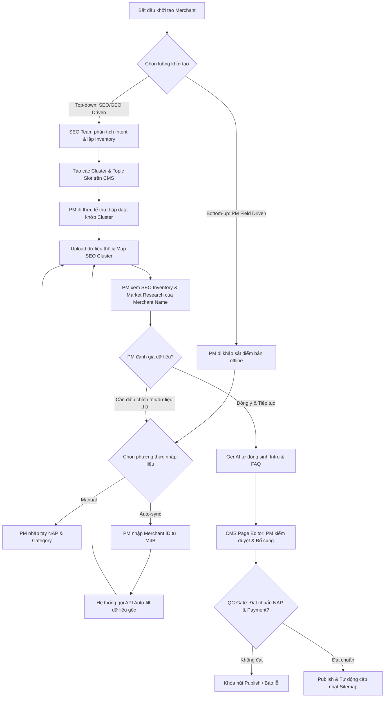
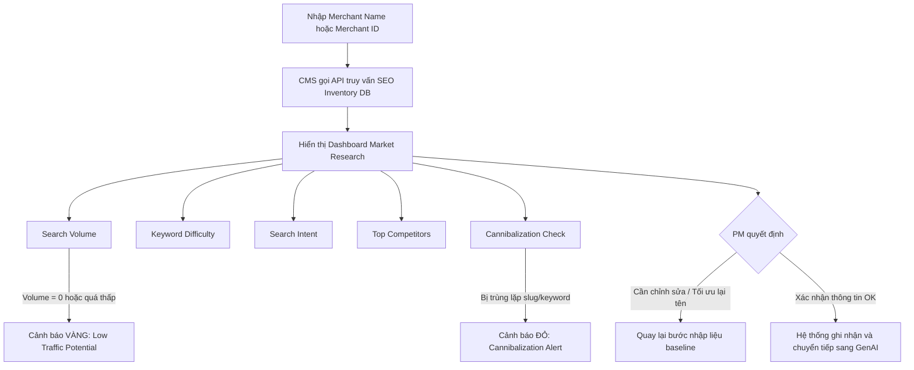

# PRD: Merchant Detail Page - SME Digital Presence Platform

> - **Use Case:** Merchant Pages
> - **Main URL:** momo.vn/merchant / momo.vn/merchant/{slug}
> - **BRD Ref:** 05_USE_CASE_MOMO/merchant-project/doi-tac-brd.md
> - **Owner:** Web Product Lead (Hiến)
> - **Engineering Lead:** Nhật
> - **Architecture:** Hoài Anh (MoSpark integration)
> - **Version:** 0.1 - 2026-06-06
> - **Status:** [IN BUILD] - Phase I Pilot 39 merchants LIVE

---

## 1. Overview

### 1.1 Problem Statement

85K organic traffic/quý đang đổ vào 2 legacy systems không có conversion goal:
- `/thanh-toan-momo-{merchant}` (18K/quý): content outdated 5-7 năm, không có O2O angle
- `/page/{id}` (67K/quý): thin content, thông tin sai (quán đóng cửa), crawl budget waste

User search "{Merchant} có nhận Ví Trả Sau không" là nhóm highest purchase intent - đã chọn merchant, đã chọn payment method, chỉ cần xác nhận. Không có trang nào serve được intent này ở cấp merchant cụ thể.

Phía SME: merchant nhỏ hoàn toàn vô hình trên Google Search và AI engine. Không có website, không có ngân sách digital marketing, không có điểm tiếp xúc digital với khách ngoài mạng xã hội cá nhân.

### 1.2 Objective

Biến `momo.vn/merchant/{slug}` thành **SME Digital Presence product** - không phải trang thông tin - phục vụ đồng thời 2 jobs: (1) SME có Digital Presence miễn phí trên Search + AI, (2) Consumer xác nhận và kích hoạt O2O trong 3 bước.

**Primary objective:** Convert 85K legacy traffic thành O2O activation sessions; onboard SME vào ecosystem Soundbox + VTS thông qua Digital Presence miễn phí.

**Success metrics:**

| Metric | Baseline | Target | Timeframe |
|---|---|---|---|
| Organic sessions | 85K/quý (legacy) | >= 85K/quý (no regression) + growth theo merchant count | Q3 2026 |
| SoV branded merchant queries | ~0% (legacy không có schema) | Top 3-5 cho 80% merchant queries | 90 ngày post-launch |
| Merchant pages published | 39 (pilot) | Scale per Phase II plan | Q3-Q4 2026 |
| VTS activation from `/merchant` | 0 (baseline) | [CẦN VERIFY - PO VTS set target] | Q3 2026 |

### 1.3 Scope

**In scope - Phase I (LIVE):**
- Merchant Detail Page `momo.vn/merchant/{slug}` - 1 template, 39 pilot merchants
- O2O stack: VTS module, Cashback module (Release theo Mega Campaign)
- Schema markup: LocalBusiness + FAQPage + HowTo + BreadcrumbList
- 308 redirect 3 legacy `/page/{id}` URLs
- QR code pattern cho các đối tác
- Hub page `momo.vn/merchant` (basic)

**In scope - Phase II:**
- MoSpark CMS auto-creation workflow (2 luồng: Top-down SEO / Bottom-up PM)
- SEO Inventory Preview trước khi tạo trang
- Deep data: Gallery, Review integration, Amenities
- Merchant Hub với Interactive Map + Smart Search + Dynamic Filters
- Listing Page pSEO: `momo.vn/merchant/danh-sach/{tinh-thanh}/{quan-huyen}`

**In scope - Phase III:**
- Gamification & Dopamine widgets: Swipe to Match, Doom Scroll Feed, Social Activity Feed
- Dynamic behavior-based on-site retargeting via MoSpark Ads Manager

**Out of scope & Shelved Features:**
- **[TẠM GÁC LẠI / SHELVED]** Phân tách Sub-pages (`/menu`, `/chi-nhanh`, `/uu-dai`) cho đối tác: Tạm thời tất cả thông tin Menu, Chi nhánh và Ưu đãi sẽ hiển thị inline trực tiếp trên trang chính `/merchant/{slug}`.
- **[TẠM HOÃN / SHELVED]** Soundbox trên Web: Hiện tại chưa triển khai gì về Soundbox trên Web channel.
- CMS tự quản lý bởi merchant (merchant không tự edit trang)
- Hệ thống review riêng (dùng Google Places API + MoMo transaction data)
- Store locator branch-level
- Replica Google Business Profile
- Thổ Địa Ăn Uống rebuild

---

## 2. User & Context

### 2.1 Target Users

| Segment | Mô tả | Job-to-be-done | Entry Point |
|---|---|---|---|
| Consumer - Intent cao | Đang ở trước hoặc chuẩn bị đến merchant, cần xác nhận payment method | Xác nhận ngay merchant nhận MoMo/VTS không, kích hoạt O2O | Google Search: "{Merchant} có nhận MoMo/VTS không" |
| Consumer - VTS mới | Biết merchant hỗ trợ VTS nhưng chưa kích hoạt | Hiểu điều kiện + kích hoạt VTS ngay từ trang | Merchant page -> VTS module |
| Consumer - HowTo | Lần đầu thanh toán MoMo tại merchant cụ thể | Hướng dẫn step-by-step không mất thời gian | Google Search: "Cách thanh toán MoMo tại {Merchant}" |
| SME Merchant | Chủ quán nhỏ, không có website, không có ngân sách digital | Có Digital Presence miễn phí, được tìm thấy trên Google + AI | QR Soundbox / BD onboard / Organic discovery |
| BD / Sales Team | Đi thực địa pitch/onboard đối tác mới | Có trang demo chuẩn (Sales Kit) để thuyết phục chủ quán tham gia mạng lưới O2O | Mobile browser (trình chiếu thực tế) |
| BU Growth / Campaign | PM chạy các chương trình co-branded liên kết (Phê La, Highlands) | Điểm đáp truyền thông, hiển thị scheme ưu đãi và thu hút organic search | In-app Ads/Comm / Google Search (SEO) |

### 2.2 User Journey (Web Channel)

**Consumer flow:**
```
Google Search "{Merchant} có nhận VTS không"
  -> momo.vn/merchant/{slug}
  -> Xem Payment Methods (xác nhận)
  -> Click VTS module / HowTo section
  -> W2A: "Kích hoạt Ví Trả Sau" / "Mở MoMo"
  -> App install (nếu chưa có) hoặc Deep link vào VTS screen
```

**SME Offline-to-Digital flow:**
```
Khách scan QR tại quầy / Soundbox
  -> utm_source=qr&utm_medium=offline&utm_campaign=soundbox&utm_content={merchant_id}
  -> momo.vn/merchant/{slug}
  -> Xem ưu đãi O2O / Cashback
  -> W2A: kích hoạt sản phẩm tương ứng
```

**Critical drop-off points:**
- [ ] Search -> Landing: Schema markup thiếu -> SERP snippet không đủ thuyết phục click
- [ ] Landing -> W2A: VTS badge hiển thị sai merchant (data chưa verify) -> trust loss
- [ ] QR -> Landing: Deep link broken hoặc UTM mất -> mất attribution
- [ ] Post-W2A: App not installed -> Universal Link fail -> user bounce

---

## 3. Feature Requirements

### 3.1 NAP Block (Name, Address, Phone)

**User Story:**
> As a consumer, I want to see accurate merchant info (name, address, hours, phone) at a glance so that I can confirm I'm on the right page before taking action.

**Acceptance Criteria:**
- [ ] Hiển thị: Tên merchant, địa chỉ, số điện thoại, giờ hoạt động
- [ ] Data source: Single source of truth từ M4B API - không nhập thủ công trong bài viết
- [ ] Logo / Banner: Ảnh thương hiệu chính thức từ merchant data
- [ ] Hiển thị đúng trên mobile (primary breakpoint 375px)
- [ ] Schema LocalBusiness inject đầy đủ: name, address, telephone, openingHours, geo coordinates

**Priority:** P0

**Notes:** NAP sai = direct trust damage + LocalBusiness schema invalid = mất GEO citation. Không cho phép edit thủ công field này.

---

### 3.2 Payment Methods Module

**User Story:**
> As a consumer with high purchase intent, I want to see clearly which payment methods this merchant accepts so that I can decide in under 5 seconds.

**Acceptance Criteria:**
- [ ] Hiển thị badge: Ví MoMo / Ví Trả Sau (chỉ render nếu merchant có trong verified list)
- [ ] VTS badge: chỉ hiển thị sau khi PO VTS verify - không dùng BRD data hay assumption
- [ ] Không có badge = không hiển thị section (không để trống gây nhầm lẫn)
- [ ] Click VTS badge -> scroll to VTS module (smooth scroll)

**Priority:** P0

**Notes:** VTS badge là YMYL - sai data = legal risk. Gate cứng với PO VTS verification.

---

### 3.3 O2O Promotion Stack

**User Story:**
> As a consumer who sees the merchant accepts VTS, I want to understand the VTS terms and activate it immediately so that I can buy now and pay later.

**Acceptance Criteria:**
- [ ] **VTS Module (Fixed - YMYL):** Inject tự động từ template hệ thống, KHÔNG cho editor chỉnh sửa thủ công
  - Lãi suất 0% trong hạn
  - Hạn mức 1-20 triệu
  - Phí duy trì 30k-33k/tháng, chỉ thu khi có giao dịch
  - Đối tác TPBank/Shinhan
- [ ] **Cashback Module (Release theo Mega):** Hiển thị campaign đang chạy (inject từ Campaign Management, không hardcode). Ẩn nếu không có campaign active.
- [ ] **Soundbox CTA:** **[TẠM HOÃN / SHELVED]** (Hiện tại chưa triển khai gì về Soundbox trên Web).
- [ ] Module nào không đủ điều kiện hiển thị thì ẩn hoàn toàn (không placeholder)

**Priority:** P0

---

### 3.4 HowTo & FAQ Section

**User Story:**
> As a first-time MoMo user at this merchant, I want step-by-step payment instructions so that I don't look confused at the checkout counter.

**Acceptance Criteria:**
- [ ] HowTo: 3-4 bước thanh toán MoMo tại merchant cụ thể (không generic)
- [ ] FAQ: tối thiểu 3 câu hỏi liên quan trực tiếp đến merchant + payment method
- [ ] HowTo Schema inject đúng với `step` array
- [ ] FAQPage Schema inject với `mainEntity` array
- [ ] Không duplicate generic FAQ từ trang khác (content unique per merchant)

**Priority:** P0 (bắt buộc cho GEO citation + AI Overview eligibility)

---

### 3.5 W2A CTA Module

**User Story:**
> As a consumer who has confirmed the merchant accepts MoMo, I want one clear action to open the app so that I can pay immediately.

**Acceptance Criteria:**
- [ ] Primary CTA: "Thanh toán bằng MoMo" - Onelink (detect app installed / not installed)
- [ ] Secondary CTA: "Kích hoạt Ví Trả Sau" - chỉ render nếu VTS badge active
- [ ] App installed: deep link vào đúng payment screen / VTS screen
- [ ] App not installed: redirect App Store (iOS) / CH Play (Android) với UTM preserved
- [ ] UTM structure: `utm_source=web&utm_medium=organic&utm_campaign=merchant-page&utm_content={merchant_id}`
- [ ] Sticky CTA bar trên mobile (bottom of viewport) khi user scroll qua hero section

**Priority:** P0

---

### 3.6 Merchant Hub Page (`momo.vn/merchant`)

**User Story:**
> As a consumer looking for merchants that accept MoMo near me, I want a discovery page with search and filters so that I can find relevant merchants without knowing exact names.

**Acceptance Criteria - Phase I (basic):**
- [ ] Danh sách merchant dạng grid/list, có pagination
- [ ] Filter cơ bản: danh mục, tỉnh/thành phố
- [ ] Internal linking đến `/merchant/{slug}` đúng
- [ ] ItemList Schema cho Hub page
- [ ] Title/H1/Meta chuẩn SEO: "Đối tác MoMo - Thanh toán tại hàng nghìn điểm bán"

**Acceptance Criteria - Phase II (full):**
- [ ] Interactive Map Widget (Google Maps / MoMo Maps) với GPS-based discovery
- [ ] Smart Search Bar với autocomplete (merchant name, category, món ăn)
- [ ] Dynamic Filters: Tỉnh/TP, Quận/Huyện, "Có nhận VTS", "Đang có Cashback"
- [ ] Top Merchants module (by rating / transaction volume)

**Priority:** P1 (Phase I basic), P2 (Phase II full)

---

### 3.7 Listing Page pSEO (`momo.vn/merchant/danh-sach/{slug}`)

**User Story:**
> As a consumer searching "quán ăn nhận MoMo quận 1", I want a curated list page for my area so that I can browse options without landing on a generic page.

**Acceptance Criteria:**
- [ ] URL pattern: `/merchant/danh-sach/{tinh-thanh}` và `/merchant/danh-sach/{tinh-thanh}/{quan-huyen}`
- [ ] Anti-thin content gate: chỉ publish nếu >= 5 merchant active trong khu vực
- [ ] < 5 merchants: auto set `noindex, nofollow` + remove khỏi sitemap
- [ ] Dynamic content bắt buộc: FAQ Block (tự sinh theo khu vực) + Top 5 merchants (by rating)
- [ ] BreadcrumbList Schema: Trang chủ > Tìm đối tác > {Tỉnh} > {Quận}
- [ ] Internal linking mesh: cross-link giữa Hub, Listing pages, và Merchant Detail pages

**Priority:** P2 (Phase II)

---

### 3.8 Legacy System Migration

**User Story:**
> As the SEO system, all authority and traffic from legacy URLs must be transferred to the new architecture without loss.

**Acceptance Criteria:**
- [ ] 3 legacy `/page/{id}` URLs: 308 Permanent redirect về `/merchant/{slug}` tương ứng (DONE - đã live)
- [ ] `/thanh-toan-momo-{merchant}` URLs: audit + 308 redirect về `/merchant/{slug}` khi merchant có trang mới
- [ ] Tất cả legacy URLs xóa khỏi sitemap ngay khi redirect set
- [ ] Không để trạng thái: cả redirect lẫn sitemap cùng tồn tại
- [ ] GSC: verify coverage report sau 2 tuần live

**Priority:** P0

---

### 3.9 MoSpark CMS Auto-creation Workflow (Phase II)

**User Story:**
> As a PM, I want an automated workflow to onboard merchants on MoSpark CMS without engineering support, so that I can quickly verify SEO/GEO data and publish pages at scale.

**Creation Workflows Flowchart:**



**Acceptance Criteria:**
- [ ] **Luồng 1 (Top-down - SEO/GEO Driven):**
  - Hỗ trợ team SEO tạo sẵn các Topic Cluster/Topic Slot trên CMS.
  - Hỗ trợ PM tải lên dữ liệu thô và map vào SEO Cluster đã lên kế hoạch.
  - Hiển thị màn hình xem trước SEO Inventory (Market Research) của Merchant Name đó để PM xác nhận trước khi kích hoạt GenAI sinh bài.
- [ ] **Luồng 2 (Bottom-up - PM Field Driven):**
  - Hỗ trợ nhập liệu thủ công (Manual NAP & Category) hoặc nhập Merchant ID từ M4B để tự động gọi API đồng bộ thông tin hành chính.
  - Hiển thị bảng Market Research (Search Volume, KD, Search Intent, Competitors) từ SEO Inventory Database để PM duyệt/tối ưu trước khi tạo bài.
- [ ] **Cơ chế kiểm duyệt (Workflow Spec):**
  - **Slug conflict check:** Tự động kiểm tra tính duy nhất của slug URL. Nếu trùng, tự động thêm ID backend làm hậu tố.
  - **QC Gate Validation:** Tự động khóa nút Publish và hiển thị cảnh báo lỗi chi tiết nếu thiếu thông tin NAP bắt buộc hoặc phương thức thanh toán.
  - **Publish & Indexing:** Tự động cập nhật URL mới vào file XML sitemap và gửi ping index lên Google ngay khi xuất bản.

**Detailed SEO Inventory Preview Sub-workflow:**



- [ ] **Các quy tắc hiển thị giao diện Preview (UI Logic):**
  - **Cảnh báo Đỏ (Red Warning):** Bắt buộc hiển thị nổi bật nếu tên merchant tạo ra một slug trùng khớp hoàn toàn với một URL đang hoạt động hoặc trùng lặp keyword mục tiêu chính của một trang khác. Gợi ý PM sửa tên hoặc thêm hậu tố.
  - **Cảnh báo Vàng (Yellow Alert):** Hiển thị dạng chú thích (tooltip/note) nếu lượng tìm kiếm (Search Volume) của merchant bằng 0, giúp PM cân nhắc mức độ ưu tiên làm nội dung.
  - **Nút Action:** Cung cấp hai nút lựa chọn rõ ràng: `Hủy & Sửa đổi` (quay lại bước nhập liệu) hoặc `Kích hoạt Tạo trang` (bắt đầu chạy GenAI).

**Priority:** P1 (Phase II)

---

### 3.10 GenAI Design (Gemini Banana) Image Pipeline (Phase II)

**User Story:**
> As a PM, I want uploaded merchant photos to be automatically retouched and resized to standard display dimensions via GenAI, so that I can maintain page aesthetic consistency without manual graphic design work.

**Acceptance Criteria:**
- [ ] **Tải lên & Retouch ảnh tự động:** Khi PM/Sales tải lên một ảnh bất kỳ của quán với kích thước bất kỳ, hệ thống sẽ tự động gọi pipeline GenAI Design (thực thi bằng Gemini Banana) để áp dụng prompt tự động cân bằng ánh sáng, retouch làm đẹp ảnh và tối ưu độ nét.
- [ ] **Tự động resize và adapt các khung hiển thị tiêu chuẩn:** Hệ thống tự động crop/generate phần mở rộng để xuất ra các kích thước chuẩn và đẩy vào Gallery của Merchant:
  - **Banner chính:** Đạt chuẩn kích thước hiển thị **1050x450 px**.
  - **Hình ảnh Social Share:** Đạt chuẩn kích thước **1200x630 px** (phục vụ hiển thị link og:image).
- [ ] **Định hướng tương lai:** Mở rộng khả năng tự động xử lý và retouch cho bất kỳ hình ảnh nào được tải lên trực tiếp thông qua trình soạn thảo CMS Page Editor.

**Priority:** P1 (Phase II)

---

### 3.11 Swipe to Match Widget (Phase III)

**User Story:**
> As an anonymous web visitor, I want a fun, game-like way to discover nearby merchant deals so that I can explore new options and save discounts without feeling bored.

**Acceptance Criteria:**
- [ ] **UI Layout:** A stack of merchant cards rendered in the center of the viewport (mobile-first, recommended container size 340x450px).
- [ ] **Card Content:** Each card must contain:
  - Merchant image (top 60% of card)
  - Merchant logo overlay
  - Merchant name + distance (e.g., "Highlands Coffee - 500m")
  - High-intent deal badge (e.g., "Hoàn tiền 15%", "Trả sau 0%")
  - Standard swipe action buttons below the card: Left (Skip), Right (Save), Info (View Merchant Page).
- [ ] **Animation Rules:** Support touch swipe gestures with spring physics:
  - Swipe Right: Card rotates and slides off-screen to the right. Triggers "Save" animation overlay (green badge "LƯU").
  - Swipe Left: Card rotates and slides off-screen to the left. Triggers "Skip" animation overlay (red badge "BỎ QUA").
  - Swipe Up: Triggers fade-out transition and redirects to `/merchant/{slug}`.
- [ ] **Local Storage Integration:**
  - Swiping Right saves the merchant deal ID, title, and timestamp into local storage under key `momo_saved_deals` (JSON array of objects, max 20 entries).
  - Tapping "Túi Quà" (My Bag) floats a slide-in panel displaying all saved deals with a CTA "Mở App kích hoạt" using the unified Onelink.
- [ ] **Behavior Tracking:**
  - Emits custom events to Umami/GA4: `swipe_right`, `swipe_left`, `swipe_info` with `merchant_id` and `category` parameters.
  - Updates Local Storage `momo_user_interests` with the swiped merchant's category to feed the Ads Manager targeting engine.

**Priority:** P1 (Phase III)

---

### 3.12 Doom Scroll Deal Feed Widget (Phase III)

**User Story:**
> As a web browser, I want an endless, vertical visual feed of nearby food and service reviews and deals so that I can scroll seamlessly and instantly claim offers.

**Acceptance Criteria:**
- [ ] **UI Container:** Full-screen vertical swipe layout (similar to TikTok/Instagram Reels) active within `momo.vn/merchant` hub.
- [ ] **Content Feed:** Endless feed of visual merchant cards containing auto-playing short video clips (silent, tap-to-unmute) or high-quality image slides, overlaid with:
  - Merchant name, rating, and address.
  - Quick merchant micro-review text (max 120 chars).
  - High-visibility overlay badge for primary CTA: e.g., "Nhận ưu đãi hoàn tiền 20%".
- [ ] **Scroll Logic:** Smooth vertical snap-scrolling. The next slide snaps into place on scroll. Preloads the next 2 cards in the background to ensure zero loading lag on 3G connections.
- [ ] **Interaction & dopamine hooks:**
  - Double-tap anywhere on the card: Animates a floating heart, saves deal to `momo_saved_deals` in local storage.
  - Share button: Generates a web share sheet with UTM link pointing to `/merchant/{slug}`.
  - Sticky bottom CTA button: "Mở Ví Trả Sau & Mua Ngay" or "Dùng App Nhận Hoàn Tiền" (direct Onelink).
- [ ] **Ads Manager sponsored injection:**
  - The feed must support sponsored cards injected dynamically by the MoSpark Ads Manager.
  - Injection rule: 1 sponsored ad card for every 5 organic merchant cards. Sponsored cards must be clearly labelled "Sponsored/Tài trợ" and support distinct tracker parameters.

**Priority:** P1 (Phase III)

---

### 3.13 Social Activity Feed Widget (Phase III)

**User Story:**
> As a web browser, I want to see real-time payment activities and popular trending merchants so that I can feel secure and inspired to try trending spots near me.

**Acceptance Criteria:**
- [ ] **UI Layout:** A Facebook-style activity feed card rendered inside the `momo.vn/merchant` directory or as a widget in local lists.
- [ ] **Activity Items:** Dynamically aggregates anonymous real-time transaction updates:
  - Format: `[Avatar/Initials] + [Hidden Username] + [Action] + [Merchant Name Kebab-link] + [Timestamp]`.
  - Example: *"Khách hàng A*** vừa quét mã Soundbox hoàn tiền 20% tại [Bún thịt nướng Chị Tuyền](/merchant/bun-thit-nuong-chi-tuyen-44) - 2 phút trước"*.
- [ ] **Trending Section:** Shows top-performing merchants based on transaction velocity in the last 2 hours.
- [ ] **Community Recommendations Hub:** A Q&A card where users can search or tap queries like *"Quán ăn ngon khu Cầu Giấy"* and immediately get 3 MoMo partner links with ratings and location badges.
- [ ] **Behavior Tracking:**
  - Emits custom events to Umami/GA4: `social_feed_click`, `trending_merchant_click`, `qna_recommendation_click` with `merchant_id` and `category` parameters.

**Priority:** P1 (Phase III)

---

### 3.14 Merchant Detail Page Routing & Single-page Layout [SHELVED - TEMPORARILY DEFERRED]

**User Story:**
> As a PM and SEO Manager, I want to temporarily suspend the generation of sub-page URLs and enforce a single-page inline layout for all merchants, so that development complexity is reduced, operational resources are focused, and crawl budget is protected across all 500k OAs.

**Acceptance Criteria & Shelving Rules:**
- [ ] **Enforced Single-page Architecture:**
  - All merchant pages (both single-branch SMEs and multi-branch chain brands) MUST use a single unified URL: `momo.vn/merchant/{slug}`.
  - No sub-pages (e.g. `/menu`, `/chi-nhanh`, `/uu-dai`) will be generated or published in this phase.
- [ ] **Router & 301 Redirect Rules (Edge/Middleware level):**
  - If a user or bot requests any sub-page path under a merchant (e.g. `/merchant/{slug}/menu`, `/merchant/{slug}/chi-nhanh`, `/merchant/{slug}/uu-dai`), the router must immediately trigger a server-side **301 Permanent Redirect** back to the parent URL `/merchant/{slug}`.
  - All UTM query parameters MUST be preserved and forwarded during redirection.
- [ ] **UI Inline Layout & Tabs:**
  - All content sections (Name/Address/Phone, Map widget, VTS module, Cashback campaigns, Menu list, Branch lists, FAQ, and HowTo) must be rendered **inline** on the single parent page `/merchant/{slug}`.
  - Use Client-side Tabs (e.g. "Tổng quan", "Thực đơn", "Chi nhánh", "Ưu đãi") or scroll scroll-spy elements to toggle or jump between sections. Clicking these tabs must not reload the page or alter the URL path.
- [ ] **Sitemap and Canonical Rules:**
  - Only the primary `/merchant/{slug}` URL is added to the sitemap XML.
  - The canonical link tag on `/merchant/{slug}` must be self-referencing. No canonical tags are generated for sub-pages since they redirect.

**Priority:** P1 (Deferred / Shelved)

---

## 4. W2A Conversion Requirements

### 4.1 W2A Trigger Points

| Trigger | Placement | CTA Text | Deep Link |
|---|---|---|---|
| Post-payment-confirmation | Sau Payment Methods block | "Thanh toán bằng MoMo" | Onelink -> payment screen |
| VTS intent | VTS Module | "Kích hoạt Ví Trả Sau" | Onelink -> VTS activation screen |
| QR scan (offline) | QR code tại quầy/Soundbox | - | `momo.vn/merchant/{slug}?utm_source=qr&utm_medium=offline&utm_campaign=soundbox&utm_content={merchant_id}` |
| Scroll depth (mobile) | Sticky bottom bar (sau hero) | "Mở MoMo" | Onelink |
| Soundbox CTA | O2O Stack | "Đăng ký Soundbox" | App / form |
| Swipe to Match save | Swipe right / "Túi Quà" panel | "Mở App kích hoạt" | Onelink -> claim deal / App home |
| Doom Scroll sticky CTA | Bottom viewport on video feed | "Dùng App Nhận Hoàn Tiền" / "Mở Ví Trả Sau" | Onelink -> VTS / merchant campaign |

### 4.2 Non-MoMo User Flow

- [ ] App not installed (iOS): redirect `https://apps.apple.com/vn/app/momo/...` với UTM params preserved
- [ ] App not installed (Android): redirect `https://play.google.com/store/apps/details?id=...` với UTM params preserved
- [ ] App installed: Onelink deep link vào đúng screen
- [ ] UTM không được drop qua redirect chain - verify trên Appsflyer dashboard
- [ ] Attribution: Appsflyer track install attribution + Umami track on-site event trước khi W2A

---

## 5. SEO / GEO Technical Requirements

### 5.1 On-Page (Merchant Detail Page)

- [ ] Title tag: `{Tên Merchant} - Thanh toán MoMo & Ví Trả Sau | MoMo`
- [ ] Meta description: `{Tên Merchant} nhận thanh toán MoMo và Ví Trả Sau. {Địa chỉ ngắn}. Kích hoạt Ví Trả Sau và thanh toán ngay.`
- [ ] H1: `{Tên Merchant đầy đủ}`
- [ ] Canonical: self-referencing `https://momo.vn/merchant/{slug}`.
- [ ] Tạm hoãn tạo sub-pages cho toàn bộ đối tác. Bắt buộc hiển thị tất cả dữ liệu (Menu, Chi nhánh, Ưu đãi) inline trên trang chính `/merchant/{slug}` và redirect 301 toàn bộ các request sub-pages về trang cha (xem chi tiết tại Section 3.14).

### 5.2 Structured Data (bắt buộc per page)

| Schema Type | Bắt buộc | Ghi chú |
|---|---|---|
| LocalBusiness | Có | name, address, telephone, openingHours, geo, image, paymentAccepted |
| FAQPage | Có | tối thiểu 3 Q&A liên quan merchant cụ thể |
| HowTo | Có | 3-4 steps "Cách thanh toán MoMo tại {Merchant}" |
| BreadcrumbList | Có | Trang chủ > Đối tác MoMo > {Tên Merchant} |
| Offer | Nếu có cashback | availabilityEnds, price, priceCurrency |

- [ ] Schema inject qua MoSpark template - không hardcode trong content
- [ ] Validate bằng Google Rich Results Test trước publish
- [ ] FAQPage + HowTo là điều kiện để xuất hiện trong Google AI Overview và LLM responses

### 5.3 Core Web Vitals Targets

| Metric | Target |
|---|---|
| LCP | < 2.5s |
| CLS | < 0.1 |
| INP | < 200ms |

- [ ] Test trên 3G (Chrome DevTools throttling) trước launch mỗi batch merchant
- [ ] Map widget (Phase II) không được block LCP - lazy load bắt buộc

---

## 6. API & Data Requirements

| API | Provider | Purpose | Auth | Rate Limit |
|---|---|---|---|---|
| M4B Merchant API | MoMo Internal | Auto-fill NAP data (name, address, phone, hours, logo) | Internal token | [CẦN VERIFY - Hoài Anh] |
| VTS Merchant List API | MoMo Internal (PO VTS) | Verify merchant có trong VTS network | Internal token | [CẦN VERIFY] |
| Campaign / Cashback API | MoMo Internal | Inject active cashback offers per merchant | Internal token | [CẦN VERIFY] |
| Google Places API | Google | Review score + count (Phase II) | API Key | 1000 req/day (free tier) |
| Onelink / Appsflyer | Appsflyer | W2A deep link generation + attribution | [CẦN VERIFY - DA team] | - |

**Data freshness:**
- NAP data: sync khi PM trigger (không real-time - merchant data ít thay đổi)
- VTS merchant list: daily sync hoặc push khi PO VTS update
- Cashback campaign: real-time inject từ Campaign Management (campaign có start/end date)
- Review score (Phase II): daily refresh từ Google Places API

**Fallback khi API down:**
- M4B API: hiển thị data cached, không block page render
- VTS API: ẩn VTS badge hoàn toàn (không hiển thị fallback text)
- Campaign API: ẩn Cashback module (không hiển thị "đang tải...")
- Google Places (Phase II): ẩn review block, không hiển thị error

---

## 7. Non-Functional Requirements

| Category | Requirement |
|---|---|
| Performance | LCP < 2.5s trên 3G (Moto G4 profile Chrome DevTools) |
| Availability | Theo SLA momo.vn chung [CẦN VERIFY] |
| Mobile | Responsive, primary breakpoint 375px (iPhone SE). Desktop secondary. |
| Browser support | Chrome latest 2, Safari latest 2, Samsung Internet latest 2 |
| Schema validation | 0 errors trên Google Rich Results Test trước publish |
| Redirect | 308 (bảo toàn method), không dùng 301 |
| Sitemap | URL mới add ngay khi publish, URL redirect xóa ngay khi redirect set |
| Tracking | Umami event tracking setup TRƯỚC launch (page view + CTA click + QR scan) |
| Content uniqueness | Không duplicate FAQ/HowTo content giữa các merchant pages |

---

## 8. Open Questions

| # | Question | Owner | Due | Status |
|---|---|---|---|---|
| 1 | VTS activation target KPI từ `/merchant` là bao nhiêu? | PO VTS | T6/2026 | OPEN |
| 2 | M4B API rate limit và auth method? | Hoài Anh | T6/2026 | OPEN |
| 3 | Cashback campaign API contract (endpoint, payload structure)? | Campaign team | T6/2026 | RELEASE BOUND |
| 4 | Onelink deep link spec cho từng O2O CTA (VTS screen path, Soundbox form)? | DA team | T6/2026 | OPEN (Gác Soundbox) |
| 5 | GSC Coverage Report cho 39 pages pilot - indexing status? | Hiến | Tuần 2 T6 | OPEN |
| 6 | `/thanh-toan-momo-{merchant}` legacy URLs: có mapping nào merchant -> slug không? | Hiến request | T6/2026 | OPEN |
| 7 | Google Places API key provisioning cho Phase II? | Hoài Anh | Q3/2026 | OPEN |
| 8 | Soundbox merchant verified list (BD team)? | BD/Soundbox | T6/2026 | N/A (Gác Soundbox) |

---

## 9. Dependencies

| Dependency | Team | Type | Status |
|---|---|---|---|
| VTS merchant verified list | PO VTS | Blocking (VTS badge + module) | **DONE** (Đã verify từ M4B & PO VTS) |
| VTS Terms Data (lãi suất, hạn mức, phí) | PO VTS | Blocking (YMYL - không sai được) | **DONE** (Đã verify từ PO VTS) |
| M4B Merchant API | Hoài Anh | Blocking (Phase II auto-fill) | In progress |
| MoSpark CMS template ready | Hoài Anh + Nhật | Blocking (scale beyond pilot) | In progress |
| Campaign / Cashback API | Campaign team | Non-blocking (Release theo Mega) | **RELEASE BOUND** |
| BD verified Soundbox merchant list | BD/Soundbox | Blocking (Soundbox CTA) | **N/A** (Tạm gác, chưa triển khai Soundbox trên Web) |
| Onelink deep link specs | DA team | Blocking (W2A attribution) | OPEN (Gác Soundbox) |
| Umami tracking setup | Thuận | Blocking (launch - phải có trước) | OPEN |
| PAGE_ID → Merchant slug mapping | Hiến request | Blocking (legacy redirect audit) | OPEN |
| Google Places API key | Hoài Anh | Non-blocking (Phase II only) | Not started |

---

## 10. Release Plan

| Phase | Scope | Target | Exit Criteria |
|---|---|---|---|
| Phase I - Foundation | 39 SME pilot merchants live. 3 legacy `/page/` redirects done. Basic Hub page. Schema + tracking. | LIVE (2026-05-29) | 39/39 pages published. 308 redirects verified. GSC coverage report clean. Umami tracking firing. |
| Phase I - Verify | GSC indexing check. CWV audit. Legacy redirect chain clean. VTS data verify. | Tuần 2 T6/2026 | 39 URLs indexed (GSC). 0 CWV regressions. Attribution flowing Appsflyer. |
| Phase II - Auto-creation | MoSpark CMS workflow 2 luồng. SEO Inventory preview. QC Gate. Auto-sitemap. | Q3/2026 | PM có thể publish merchant page mà không cần kỹ thuật support. QC gate blocking thin content. |
| Phase II - Deep data & Hub | Gallery, Review integration, Amenities. Hub (map + filters). Listing pSEO. | Q4/2026 | 80% pilot merchants có >= 3 ảnh. Hub map and listing pages active. |
| Phase III - Gamification | Tinder Swipe, TikTok Doom Scroll, Facebook Social Feed widgets. Ads Manager integration. | Q4/2026+ | Gamified widgets active on Hub page. Impression and swipe/click tracking live. |
| Long term | `/thanh-toan-momo-{merchant}` full audit + redirect. Top brand chains. | 2027 | Legacy cleanup complete. Top 20 brand chains có merchant page. |

---

## Changelog

| Version | Date | Author | Note |
|---|---|---|---|
| 0.1 | 2026-06-06 | Hiến | Initial draft từ BRD v2.6 |
