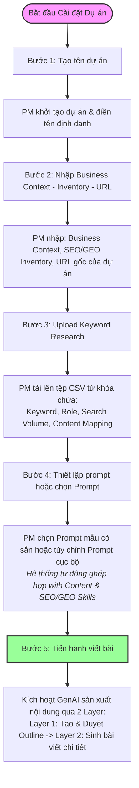

# PRODUCT REQUIREMENT DOCUMENT (PRD) - WEB CHANNEL
*Bắt buộc Cell Team điền đầy đủ và cung cấp cho Web Platform Team trước khi tiến hành triển khai dự án*

## THÔNG TIN CHUNG (Metadata)
> *   **Tên dự án / Sản phẩm (PRODUCT NAME):** Nền tảng Quản lý Dự án SEO/GEO MoSpark (MoSpark - SEO/GEO Project Platform)
> *   **Phiên bản & Ngày (Version & Date):** Version 1.0 - 2026-06-19
> *   **Đơn vị đề xuất (Business Owner / Cell Team):** Web Platform Team (GPD)
> *   **Web Product Lead (Đầu mối tiếp nhận & phê duyệt):** Hien.ho
> *   **Product Owner (PO) phụ trách:** [Họ và tên - Email]
> *   **Product Manager (Người phê duyệt sản phẩm):** [Họ và tên - Email]
> *   **Engineer Lead (Người phụ trách kỹ thuật):** [Họ và tên - Email]
> *   **UI/UX Designer:** [Họ và tên - Email]
> *   **Trạng thái tài liệu (Document status):** DRAFT
> *   **Giai đoạn S-P-A dự kiến:** Stage P: Pilot (Xây dựng nền tảng quản lý dự án nội dung tăng trưởng)
> *   **Loại yêu cầu:**
>     *   [x] **1. Tính năng mới (New Feature):** Xây dựng toàn bộ nền tảng quản lý dự án SEO/GEO tập trung và phân tán (Merchant). *(Bắt buộc áp dụng PRD)*
>     *   [ ] **2. Cải tiến lớn (Major Improvement):** Thay đổi luồng trải nghiệm, thay đổi logic nghiệp vụ, tích hợp thêm API mới hoặc đổi cơ chế xác thực.
>     *   [ ] **3. Thay đổi cấu trúc (Structural Change):** Thay đổi phân cấp đường dẫn (URL Structure), bố cục layout hoặc site structure.

## I. RELATED DOCUMENTS
*Các liên kết tài liệu nghiệp vụ, thiết kế hiện có từ phía Cell Team (Vui lòng đính kèm link trước khi đi vào chi tiết).*

*   [x] **Figma Design Link:** [Chèn link thiết kế UI/UX Dashboard SEO/GEO tại đây]
*   [x] **Tài liệu chiến lược SEO/GEO gốc:** [mospark_seo_geo_project.md](file:///Users/hienhv/HienHv/Klaus/Hienho_MoMo-Base/04_MOSPARK_PLATFORM/mospark_seo_geo_project.md)
*   [x] **Bản đồ tài nguyên SEO:** [mospark_seo_inventory.md](file:///Users/hienhv/HienHv/Klaus/Hienho_MoMo-Base/04_MOSPARK_PLATFORM/mospark_seo_inventory.md)

## II. BACKGROUND & PROBLEM STATEMENT

### 1. Bối cảnh dự án (Background)
Hệ sinh thái Web MoMo (momo.vn) đang đón nhận hàng triệu lượt traffic tự nhiên từ ngoài ứng dụng (Out-App Search Traffic). Để tối ưu hóa nguồn tài nguyên này và chuyển đổi thành người dùng hoạt động trong App (In-App Active Users), GPD xây dựng **Hạ tầng Tăng trưởng Web MoSpark**.

**MoSpark - SEO/GEO Project Platform** là "Tổng hành dinh" (Brain module) chịu trách nhiệm quản lý, điều phối toàn bộ các dự án nội dung tăng trưởng (Use Cases) của MoMo trên Web. Hệ thống này kết nối trực tiếp dữ liệu từ SEO Inventory đến GenAI Content Engine để tự động hóa quy trình sản xuất nội dung quy mô lớn.

### 2. Vấn đề cần giải quyết (Problem)
*   **Điểm nghẽn ở sản phẩm hiện tại (Gaps):**
    *   Quy trình lên kế hoạch từ khóa, theo dõi tiến độ viết bài và quản lý Topic Clusters trước đây được thực hiện thủ công qua Excel/Google Sheets, dẫn đến việc phân mảnh dữ liệu, khó kiểm soát chất lượng và tiến độ.
    *   Tình trạng chồng chéo từ khóa (Keyword Cannibalization) xảy ra thường xuyên khi các Use Case khác nhau vô tình SEO trùng từ khóa, làm giảm hiệu quả xếp hạng trên Google.
    *   GenAI Content Engine thiếu một trung tâm quản lý prompt và bối cảnh nghiệp vụ (Business Context) cục bộ cho từng chiến dịch, dẫn đến việc sinh nội dung không bám sát định vị thương hiệu hoặc vi phạm các từ cấm pháp lý (Blacklist).
    *   Đặc biệt, dự án Merchant O2O có cấu trúc phân tán đa thực thể (hàng vạn đối tác độc lập) mà hệ thống quản lý danh sách phẳng hiện tại không thể đáp ứng.

## III. OBJECTIVES & VALUE PROPOSITION

### 1. Mục tiêu & Chỉ số đo lường (Objectives, Goals & Success criteria)
Xây dựng một nền tảng Web-app quản trị dự án tập trung giúp tự động hóa quy trình quản lý từ khóa, lập kế hoạch nội dung và tích hợp sinh bài viết tự động bằng AI cho mọi Use Case của MoMo.

| Chỉ số (KPI) | Trước thay đổi (Baseline) | Mục tiêu sau thay đổi (Target) | Thời gian đo lường (Timeframe) |
|---|---|---|---|
| MUV (Monthly Unique Visitors) | N/A (Mới khởi tạo) | Quản lý thành công >10M Traffic/tháng của hệ thống Web | Q4/2026 |
| Tỷ lệ bài viết trùng lặp từ khóa | ~15% | 0% (Do hệ thống tự động block trùng lặp từ đầu vào) | Q3/2026 |
| Tốc độ phê duyệt Outline | 20 phút/bài viết (Thủ công) | < 2 phút/bài viết (Nhấp duyệt trên UI) | Q3/2026 |
| Khả năng mở rộng dự án Merchant | Chỉ hỗ trợ dạng trang tĩnh | Hỗ trợ quản lý >10,000 thực thể đối tác phân tán | Q4/2026 |

### 2. Tuyên ngôn giá trị (Value Proposition)
Chúng tôi giúp *các Product Managers (PMs) và Content Leads* *quản lý phân cấp Topic Clusters, chống trùng lặp từ khóa và duyệt bài viết GenAI nhanh chóng* bằng cách *cung cấp nền tảng quản trị dự án SEO/GEO tích hợp cơ chế duyệt 2 tầng (Human-in-the-loop) và mô hình quản lý thực thể phân tán (Multi-Merchant Drill-down)*.

## IV. TARGET PERSONAS & HIGH-LEVEL USER EXPERIENCE (JTBD)

### 1. Khách hàng mục tiêu & Phân quyền mặc định (Target Personas & Default Roles)
Dự án này không thiết lập cơ chế phân quyền động phức tạp, mà mặc định chia thành 2 vai trò cơ bản:
*   **Admin (Web Product Lead / PMs / BU Growth Leads):**
    *   *Quyền hạn:* Có toàn quyền quản trị dự án. Được phép chỉnh sửa Business Context, import tệp CSV từ khóa, thiết lập cấu hình dự án, tùy chỉnh prompt cục bộ (Project-specific Prompt), quản lý Master Templates và thực hiện tất cả các thao tác nghiệp vụ cốt lõi khác.
*   **Editor (Content Creators / Editors):**
    *   *Quyền hạn:* Được quyền xem thông tin dự án, xem cấu trúc Topic Clusters/Merchant, thực hiện viết bài (Layer 1: sinh Outline, duyệt/sửa Outline, Layer 2: sinh bài viết chi tiết thông qua GenAI).
    *   *Giới hạn:* Không được phép chỉnh sửa Business Context hay các cấu hình hệ thống cốt lõi khác.
*   **Cell Teams (BUs):** Đơn vị gửi yêu cầu tăng trưởng và cung cấp tài liệu nghiệp vụ (BRD/PRD).

### 2. Jobs-to-be-Done (JTBD)

#### A. Product JTBD (Nhu cầu tương tác với Widget/Công cụ trên Web)
*   **Khi bối cảnh xảy ra (When...):** Khi tôi lên kế hoạch nội dung cho một Use Case mới (ví dụ: Phạt Nguội).
*   **Hành động trên Web (I want to...):** Tôi muốn xem tổng quan lượng search volume, import danh sách từ khóa theo chủ đề (TOFU/MOFU/BOFU), tạo dàn ý tự động bằng AI, chỉnh sửa và bấm duyệt để hệ thống tự sinh bài viết chi tiết.
*   **Kết quả kỳ vọng (So I can...):** Xuất bản hàng trăm bài viết chuẩn SEO/GEO chất lượng cao mỗi tuần mà không tốn nhiều nguồn lực nhân sự.

#### B. SEO/GEO JTBD (Nhu cầu tìm kiếm thông tin ngoài App)
*   **Khi người dùng tìm kiếm (When...):** Khi người dùng tìm kiếm bất kỳ thông tin nào liên quan đến dịch vụ của MoMo trên Google hoặc AI Search.
*   **Nội dung họ cần đọc (I want to...):** Tiếp cận được bài viết giải đáp chính xác, dễ hiểu trên Website momo.vn.
*   **Hành vi chuyển đổi kỳ vọng (So I can...):** Nhấp vào các nút CTA (W2A trigger points) để mở App MoMo giải quyết nhu cầu ngay lập tức.

## V. BUSINESS CONTEXT
*Cung cấp thông tin nghiệp vụ cốt lõi để đội ngũ phát triển hiểu rõ về sản phẩm/dịch vụ.*

### 1. Mô tả nghiệp vụ sản phẩm (Product Description & Rules)
Mỗi dự án SEO/GEO trên MoSpark đại diện cho một chiến dịch tăng trưởng traffic dải rộng. Hệ thống bắt buộc phải quản lý các thực thể dữ liệu sau:
*   **Metadata dự án:** Tên dự án, slug mặc định (`momo.vn/{use-case}`), Business Context, SEO/GEO Inventory, trạng thái hoàn thành.
*   **Phân nhóm phễu người dùng:** Phân loại từ khóa theo 3 tầng phễu:
    *   *TOFU (Nhận biết):* Thu hút người dùng tìm kiếm thông tin cơ bản.
    *   *MOFU (Cân nhắc):* Giải đáp các so sánh, hướng dẫn chi tiết.
    *   *BOFU (Chuyển đổi):* Các từ khóa giao dịch sát với CTA mở App.
*   **Topic Clusters:** Tập hợp các cụm từ khóa phụ đi theo một từ khóa chính để tạo mạng lưới liên kết nội bộ (Silo structure).

### 2. Giới hạn & Các từ cấm (Constraints & Blacklist)
*   Chống trùng lặp tuyệt đối ở mức nền tảng (Cannibalization Gate): Một từ khóa đã được gán cho URL A thì không thể gán cho URL B.
*   Cách ly prompt: PM chỉ được phép sửa Prompt cục bộ của dự án mình quản lý, không được can thiệp vào Master Prompt Template của hệ thống.

## VI. FEATURE REQUIREMENTS & RELEASE PHASES
*(Mô tả chi tiết các tính năng cần làm theo từng Giai đoạn phát hành)*

### 1. Lộ trình phát hành (Release Phases)
*   **Phase 1 (MVP - Giao diện & Dự án Tập trung):** 
    *   Sidebar điều hướng danh sách 8 dự án cốt lõi (Phạt Nguội, Vay Nhanh...).
    *   Workspace quản lý dự án chi tiết (Header metadata, Business Context accordion, KPI Progress bar).
    *   Danh sách Topic Clusters phân loại theo TOFU/MOFU/BOFU.
    *   Giao diện Duyệt Dàn bài (Outline Review - Layer 1).
*   **Phase 2 (Tích hợp AI & Prompt Localized):**
    *   Hệ thống Quản lý Master Prompt Templates và nhân bản cục bộ (Project-specific cloner).
    *   Cổng chống trùng lặp từ khóa nền tảng (Cannibalization Gate).
    *   Tích hợp GenAI Content Engine để tự động sinh bài viết chi tiết dựa trên dàn ý đã duyệt (Layer 2).
*   **Phase 3 (Hỗ trợ Multi-Merchant & O2O):**
    *   Màn hình Dashboard danh mục đối tác (Merchant Directory).
    *   Giao diện khoan sâu (Drill-down Workspace) cho từng đối tác.
    *   Động cơ ghép bối cảnh đa tầng (Multi-layer Context Assembly).

---

### 2. Đặc tả yêu cầu chi tiết (User stories and requirements per release)

#### PHASE 1: GIAO DIỆN CỐT LÕI & DỰ ÁN TẬP TRUNG (MVP)

##### 1. Thanh Điều Hướng Trái (Left Sidebar Navigation)
*   **Mô tả:** Hiển thị danh mục toàn bộ các dự án SEO/GEO đang hoạt động trên hệ thống.
*   **Yêu cầu chi tiết:**
    *   Hộp tìm kiếm nhanh dự án ở đầu sidebar.
    *   Mỗi thẻ dự án hiển thị: Tên dự án | Lĩnh vực | Tổng Search Volume/tháng.
    *   *Ví dụ:* `Phạt Nguội` | *Dịch vụ Công & Tiện ích* | `1.5M /tháng`.

##### 2. Không Gian Làm Việc Dự Án (Project Detail Workspace)
*   **Mô tả:** Màn hình chính hiển thị toàn bộ tài nguyên và tiến độ của dự án được chọn từ sidebar.
*   **Yêu cầu chi tiết:**
    *   **Header:** Tên dự án, mô tả ngắn, và đường dẫn URL gốc (ví dụ: `momo.vn/phat-nguoi`).
    *   **Business Context Accordion:** Đọc/Ghi bối cảnh nghiệp vụ của dự án dưới dạng Markdown.
    *   **SEO/GEO Inventory Accordion:** Hiển thị thông số tổng quát: Volume/tháng, số lượng Clusters, số lượng Keywords.
    *   **Progress Bar:** Biểu thị tỷ lệ % từ khóa đã xuất bản thành công (ví dụ: `7/7 keywords đã xuất bản - 100% hoàn thành`).

##### 3. Quản Lý Cụm Chủ Đề Theo Phễu (TOFU/MOFU/BOFU Clusters)
*   **Mô tả:** Danh sách các Topic Cluster được nhóm tự động theo ý định tìm kiếm của người dùng trong hành trình khách hàng.
*   **Yêu cầu chi tiết:**
    *   Hiển thị 3 nhóm chính: **TOFU - Nhận biết**, **MOFU - Cân nhắc**, **BOFU - Chuyển đổi**.
    *   Mỗi nhóm hiển thị: Tổng lượng search volume của nhóm | Số lượng cụm chủ đề | Số lượng từ khóa.
    *   Mỗi dòng Cluster dạng dropdown hiển thị tiến độ xuất bản (ví dụ: `• Kiến thức phạt nguội | 890K | 3/3 đã xuất bản`). Khi nhấp mở sẽ hiển thị danh sách từ khóa con bên trong.

##### 4. Công Cụ Duyệt Dàn Bài AI (Outline Review Tool - Layer 1)
*   **Mô tả:** Giao diện cho phép biên tập viên kiểm duyệt và chỉnh sửa khung xương bài viết do AI gợi ý trước khi viết chi tiết.
*   **Yêu cầu chi tiết:**
    *   Cho phép sửa tiêu đề các thẻ Heading (H2, H3).
    *   Cho phép thêm/bớt các điểm gạch đầu dòng (bullet points) ý chính.
    *   Chèn hướng dẫn nghiệp vụ (Business instruction) trực tiếp vào dàn bài để định hướng GenAI viết chi tiết ở Layer 2.

---

#### PHASE 2: TÍCH HỢP AI & PROMPT CỤC BỘ

##### 1. Quản Trị Prompt Đóng Gói Cục Bộ (Project-Specific Localized Prompt)
*   **Mô tả:** Hệ thống nhân bản prompt mẫu từ Master Template để PM tự do chỉnh sửa riêng cho từng dự án.
*   **Yêu cầu chi tiết:**
    *   Giao diện `Project Settings` -> `AI Prompts`.
    *   Hiển thị 2 vùng chỉnh sửa: Prompt Dàn ý (Outline Prompt) và Prompt Viết bài (Writer Prompt).
    *   Tích hợp **Diff Viewer** hiển thị trực quan các từ được thêm/bớt so với Master Template.
    *   Nút **Reset to Default** để khôi phục nhanh prompt gốc.

##### 2. Cổng Gác Chống Trùng Lặp Từ Khóa (Cannibalization Gate)
*   **Mô tả:** Cơ chế tự động kiểm tra tính độc bản của từ khóa mục tiêu khi tạo mới.
*   **Yêu cầu chi tiết:**
    *   Khi tạo Keyword mới, hệ thống truy quét toàn bộ cơ sở dữ liệu `momo.vn`.
    *   Nếu trùng lặp với một URL hiện hữu $\rightarrow$ Chặn hành động tạo mới, hiển thị cảnh báo và trỏ link về trang cũ để tối ưu hóa SEO.

##### 3. Quy trình Cài đặt & Vận hành Dự án (Project Setup & Content Generation Flow)
Quy trình thiết lập dự án và xuất bản nội dung của PM trên MoSpark tuân thủ nghiêm ngặt 5 bước:

1. **Bước 1: Tạo tên dự án**
   * PM khởi tạo dự án SEO/GEO mới bằng cách điền thông tin định danh (Tên dự án, Division phụ trách).
2. **Bước 2: Nhập Business Context - Inventory - URL**
   * PM cấu hình bối cảnh nghiệp vụ (Markdown), khai báo thông số lượng search volume ban đầu (SEO/GEO Inventory), và thiết lập URL gốc của dự án (ví dụ: `momo.vn/merchant`).
3. **Bước 3: Upload Keyword Research**
   * PM tải lên tệp CSV chứa danh sách từ khóa đầy đủ bao gồm phân vai trò từ khóa (Primary/Secondary), lượng search volume của từng từ khóa, và ánh xạ nội dung (Content Mapping).
4. **Bước 4: Thiết lập prompt (Hoặc chọn Prompt)**
   * PM thiết lập prompt chuyên gia bằng cách chọn một Prompt Template mẫu hệ thống (ví dụ: *Finance YMYL*, *Commerce & Café*...) hoặc tự do tùy chỉnh Prompt riêng cục bộ. Hệ thống sẽ tự động ghép hợp (matching) prompt này với các Content Skills và SEO/GEO Skills tương ứng trong cơ sở dữ liệu.
5. **Bước 5: Tiến hành viết bài**
   * PM bắt đầu quy trình sinh bài viết bằng GenAI qua 2 Layer: AI tự động tạo dàn ý (Outline) -> PM chỉnh sửa/duyệt dàn ý -> AI tự động viết bài viết chi tiết dựa trên dàn ý đã duyệt và xuất bản lên Web.

##### 3b. Sơ đồ Luồng Cài đặt Dự án (Project Setup Workflow Diagram for Dev)
Dưới đây là sơ đồ mô tả chi tiết 5 bước thiết lập và vận hành dự án trên MoSpark để đội ngũ Phát triển (Dev) xây dựng hệ thống:

---

#### PHASE 3: HỖ TRỢ MULTI-MERCHANT & O2O (DỰ ÁN PHÂN TÁN)

##### 1. Bảng Điều Khiển Danh Mục Đối Tác (Merchant Directory)
*   **Mô tả:** Giao diện trung gian xuất hiện riêng khi click vào dự án `Merchant`.
*   **Yêu cầu chi tiết:**
    *   Thanh tìm kiếm và bộ lọc đa năng (theo ngành F&B, Retail, Spa...; khu vực địa lý; trạng thái thiết bị Soundbox).
    *   Chỉ số tổng của toàn dự án Merchant (Total Volume, Total Keywords).
    *   Bảng danh sách Merchant: Tên đối tác | Ngành hàng | Tổng Volume | Số từ khóa | Trạng thái | Nút **Quản lý (Manage)**.

##### 2. Không Gian Làm Việc Khoan Sâu Đối Tác (Drill-Down Workspace)
*   **Mô tả:** Giao diện chi tiết của một đối tác cụ thể khi bấm **Manage**.
*   **Yêu cầu chi tiết:**
    *   Breadcrumbs điều hướng: `Dự án Merchant / [Tên đối tác]`.
    *   Cách ly hoàn toàn bối cảnh: Hiển thị thực đơn, chương trình ưu đãi, địa chỉ của riêng đối tác đó.
    *   Hiển thị danh mục phễu TOFU/MOFU/BOFU chứa các Topic Clusters và từ khóa thuộc riêng đối tác này.

##### 3. Động Cơ Ghép Hợp Bối Cảnh Đa Tầng (Multi-Layer Context Assembly)
*   **Mô tả:** Backend tự động ghép bối cảnh khi chạy GenAI sản xuất bài viết cho đối tác.
*   **Công thức trộn:**
    `Final Prompt = Localized Writer Prompt + Platform Context (Ví Trả Sau/Soundbox) + Merchant Context (Menu/Address) + Target Keyword + Approved Outline`

##### 4. Luồng Khởi Tạo Merchant Từ SEO/GEO Project (Merchant Creation Flow)
*   **Mô tả:** Cơ chế khởi tạo trang đối tác dựa trên định hướng chiến lược từ khóa và cụm chủ đề của dự án SEO/GEO.
*   **Yêu cầu chi tiết:**
    *   **Liên kết Chiến lược:** Mọi Merchant được khởi tạo bắt buộc phải có chiến lược liên kết với Theme/Cluster và kế thừa chỉ số Volume Search từ dự án SEO/GEO Project để đảm bảo hiệu quả SEO.
    *   **Quá trình Kích hoạt:** Khi PM/Editor xác định Merchant mục tiêu từ danh sách từ khóa chiến lược, hệ thống sẽ kích hoạt nút xây dựng và đẩy đối tác đó qua Luồng tạo Merchant (Merchant Creation Flow) trên giao diện CMS MoSpark.
    *   **User Input (Nhập tay thông tin cốt lõi):** Tại giao diện Form này, người dùng (User) nhập tay trực tiếp các thông tin quan trọng của Merchant để khởi tạo bao gồm:
        1. **Địa chỉ (Address):** Địa chỉ vật lý chính xác của quán phục vụ tính năng Map/Location.
        2. **MerchantID (M4B ID):** ID đối tác trên MoMo, phục vụ sinh Deep Link Web-to-App (`momo://app/merchant?id={merchant_id}`).
        3. **GenAI content:** Nội dung mô tả (Intro, FAQ) được GenAI sinh tự động dựa trên bối cảnh chung phối hợp với context cục bộ của Merchant và được người dùng phê duyệt/chỉnh sửa.
        4. **Hình ảnh (Image):** Ảnh chụp banner hoặc logo thực tế của quán.
    *   **QC Gate Validation:** Hệ thống khóa tính năng Publish cho đến khi nhập đầy đủ cả 4 thông tin bắt buộc trên và vượt qua kiểm duyệt QC Gate tự động.

---

## VII. W2A CONVERSION & DATA REQUIREMENTS

### 1. Luồng chuyển đổi Web-to-App (W2A Trigger Points)
*CTA nút bấm hoặc Banner hiển thị trên giao diện của từng bài viết/trang đích sẽ tự động sinh Deep Link để mở App MoMo chính xác màn hình đích tương ứng với Use Case.*

| Vị trí CTA trên Web | Câu chữ hiển thị (CTA Text) | Deep Link mở App |
|---|---|---|
| Trang Vay Nhanh | "Đăng ký vay tiêu dùng ngay" | `momo://app/fastmoney` |
| Trang Phạt Nguội | "Nộp phạt trực tuyến" | `momo://app/publicservices?action=fine` |
| Trang Merchant | "Mở App thanh toán tại quầy" | `momo://app/merchant?id={merchant_id}` |

### 2. API Nghiệp Vụ & Fallback Logic
*   **API SEO Inventory:** Đồng bộ dữ liệu Market Volume và xếp hạng từ khóa thời gian thực.
*   **API M4B (Dành cho Merchant):** Đồng bộ tự động thông tin cửa hàng, menu.
    *   *Kịch bản lỗi (Fallback):* Sử dụng dữ liệu tĩnh được sao lưu tại CMS nếu API đối tác bị nghẽn hoặc timeout > 3s.

## VIII. GOVERNANCE & RISKS

### 1. Kênh phân phối thông tin bổ sung (Distribution Channels)
*   [x] **AI Assistant / RAG Chatbot:** Cho phép AI Chatbot học toàn bộ dữ liệu Topic Clusters và Business Context của các dự án để tự động tư vấn khách hàng.
*   [ ] **Help Center (Trung tâm trợ giúp):** Đồng bộ tự động các câu hỏi FAQ.

### 2. Kênh đẩy Traffic chủ động (Traffic Acquisition Channels)
*   [x] SEO tự nhiên (Organic Search)
*   [x] Quảng cáo trả phí (Paid Search Ads)
*   [x] Kênh In-App (Liên kết từ Banner/Push trên ứng dụng MoMo về trang Web)

### 3. Cam kết nguồn lực & Đầu mối phê duyệt (Stakeholders & Commitments)
*   **Đầu mối phê duyệt phía Web Platform (Web Product Lead):** Hien.ho
*   **Đầu mối vận hành kỹ thuật (Tech Lead MoSpark Platform):** [Họ tên - Email]
*   **Đầu mối phê duyệt nghiệp vụ (Cell Team POs):** [Họ tên - Email của từng đại diện dự án]

### 4. Quản trị rủi ro tiềm tàng (Potential Risk)

| Rủi ro (Risk) | Mức độ ảnh hưởng (Impact) | Phương án giảm thiểu (Risk management plan) | Người chịu trách nhiệm (PIC) |
|---|---|---|---|
| Xung đột URL giữa các Use Case | Cao | Áp dụng cấu trúc Silo URL nghiêm ngặt kế thừa từ tên dự án (`/{use-case}/blog/...`). | System Architect |
| PM sửa Master Prompt làm lỗi hệ thống | Cao | Chỉ Admin được sửa Master Templates và prompt cục bộ. Editor thông thường chỉ được xem và tiến hành viết bài. | System Admin |
| API đối tác bị quá tải do lượt quét lớn | Trung bình | Tích hợp bộ nhớ đệm Cache (Redis) lưu trữ dữ liệu tĩnh của Merchant trong 24 giờ. | DevOps |

### 5. Cơ chế Phân quyền mặc định (Default Role Authorization)
Dự án được đơn giản hóa tối đa về mặt bảo mật quyền truy cập bằng cách thiết lập cứng hai vai trò (không cấu hình phân quyền động):
*   **Editor:** Quyền xem dự án, xem Topic Clusters/Merchant và viết bài (Layer 1 & Layer 2 GenAI flow).
*   **Admin:** Toàn quyền hệ thống, bao gồm chỉnh sửa Business Context, cấu hình prompt cục bộ, upload CSV từ khóa và quản lý Master Templates.

## IX. TECHNICAL SPECIFICATION & TECH STACK

Để đáp ứng yêu cầu vận hành thời gian thực, quản lý phân tán hàng vạn thực thể đối tác và tự động hóa quy trình sản xuất nội dung quy mô lớn, hệ thống MoSpark áp dụng bộ giải pháp công nghệ (Tech Stack) chuẩn hóa của Web Platform:

### 1. Frontend (Giao diện người dùng)
*   **Framework chính:** Next.js (React) phiên bản mới nhất, sử dụng App Router.
*   **Cơ chế Render (Rendering Mechanism):**
    *   Sử dụng **Static Site Generation (SSG)** kết hợp với **Incremental Static Regeneration (ISR)** với chu kỳ revalidate 24 giờ cho các trang đích đối tác (Merchant Pages) nhằm tối ưu hóa tốc độ tải trang, giảm tải cho Database và tối đa hóa khả năng Crawl của Googlebot/AI Search.
    *   Sử dụng **Client-Side Rendering (CSR)** cho các thành phần quản trị thời gian thực (Dashboard, Data Table, Outline Editor).
*   **Styling (Phong cách CSS):** Vanilla CSS kết hợp Custom CSS Variables để quản lý Theme (Dark/Light Mode) và đảm bảo tính nhất quán của hệ thống GPD Design System.

### 2. Backend & API Services (Dịch vụ nền tảng)
*   **Runtime:** Node.js (TypeScript) chạy trên nền tảng NestJS framework, hoặc Go (Golang) cho các API dịch vụ core để xử lý lượng tải lớn.
*   **API Gateway & Routing:** Nginx kết hợp Envoy Proxy điều phối luồng URL Silo (`/{use-case}/blog*` và `/merchant/{merchant-id}/blog*`).

### 3. Database & Caching (Cơ sở dữ liệu & Bộ nhớ đệm)
*   **Cơ sở dữ liệu chính (Primary DB):** PostgreSQL. Lưu trữ toàn bộ siêu dữ liệu dự án, cấu trúc Topic Clusters, từ khóa, người dùng & vai trò (Editor/Admin) và nhật ký lịch sử thay đổi (Audit Log).
*   **Bộ nhớ đệm & Đồng bộ (Cache & Queue):** 
    *   **Redis Cache:** Lưu trữ tạm thời dữ liệu thực đơn, thông tin Google Places API của các Merchant trong 24 giờ để tránh tình trạng Rate Limit và giảm tải API.
    *   **RabbitMQ / BullMQ:** Điều phối hàng đợi (Job Queue) khi PM kích hoạt lệnh tạo bài viết GenAI hàng loạt (Layer 2).

### 4. AI Engine & RAG Infrastructure (Hạ tầng Trí tuệ Nhân tạo)
*   **LLM Providers (Mô hình ngôn ngữ):** Tích hợp đa mô hình thông qua cổng trung gian (API Gateway):
    *   **Gemini 1.5 Pro / Flash (Google Cloud Vertex AI):** Sử dụng chính cho việc phân tích bối cảnh, lập outline (Layer 1) và sinh bài viết (Layer 2) nhờ ưu thế Context Window lớn và khả năng Grounding dữ liệu.
    *   **Claude 3.5 Sonnet (AWS Bedrock):** Dùng làm mô hình dự phòng (Fallback) hoặc phục vụ cho các Use Case đòi hỏi tính sáng tạo nội dung cao.
*   **Vector Database (RAG):** pgvector tích hợp thẳng trong PostgreSQL để tìm kiếm ngữ nghĩa và đối soát thông tin bối cảnh nghiệp vụ (Business Context) chuẩn xác trước khi đưa vào Prompt.

### 5. API Integrations (Tích hợp hệ thống bên thứ ba)
*   **M4B API:** Lấy thông tin pháp lý cửa hàng, thực đơn và định danh Merchant ID.
*   **Google Places API:** Tra cứu địa chỉ N.A.P, giờ hoạt động và các tiện ích (Amenities) của cửa hàng thực tế.
*   **Google Ads API (Keyword Planner):** Đồng bộ tự động hàng tháng (Monthly Sync) chỉ số Lượng tìm kiếm của thị trường (Market Search Volume) cho danh mục từ khóa thông qua `KeywordPlanService`, đảm bảo dữ liệu Inventory luôn sát thực tế.
*   **Google Search Console API:** Đồng bộ chỉ số hiển thị thực tế (Impressions của MoMo), lượt Click và Thứ hạng trung bình (Rank) để làm cơ sở tính toán Share of Voice (SoV) và đo lường hiệu quả bài viết.
*   **Ahrefs/Semrush API (Fallback):** Đóng vai trò là kênh dự phòng (fallback) để đồng bộ Volume và độ khó từ khóa (Keyword Difficulty) trong trường hợp API Google Ads bị giới hạn hạn mức (Rate Limit) hoặc trả về dải số ước lượng.

## LỊCH SỬ THAY ĐỔI (Changelog)

| Phiên bản | Ngày cập nhật | Người thực hiện | Nội dung thay đổi |
|---|---|---|---|
| 1.0 | 2026-06-19 | Web Product Lead | Khởi tạo tài liệu PRD hoàn chỉnh cho Nền tảng quản lý dự án SEO/GEO MoSpark, bao gồm các cấu trúc tập trung và phân tán (Merchant). |
| 1.1 | 2026-06-20 | Web Product Lead | Cập nhật cơ chế phân quyền đơn giản (Admin/Editor) và làm rõ cơ chế đồng bộ tự động hàng tháng (Monthly Sync) chỉ số Search Volume từ Google Ads API (Keyword Planner) đối soát với Google Search Console. |
