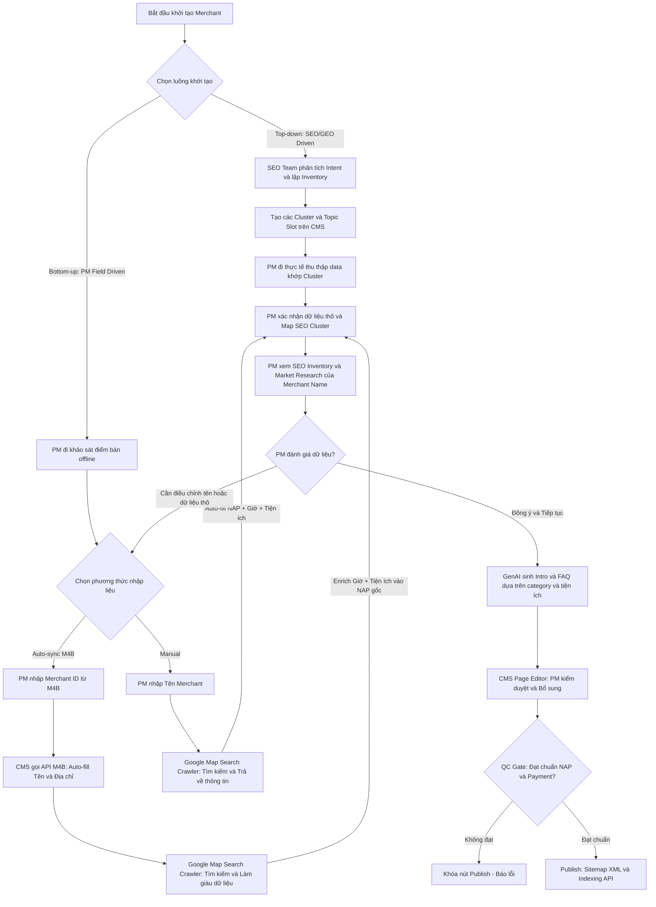
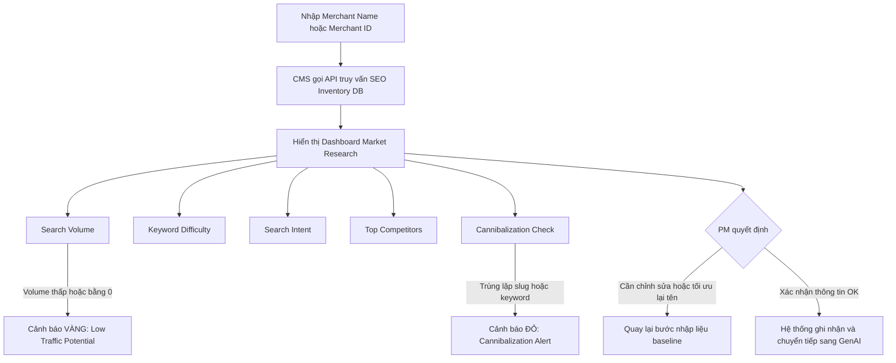

# PRD: Merchant Detail Page - SME Digital Presence Platform

> - **Use Case:** Merchant Pages
> - **Main URL:** momo.vn/merchant / momo.vn/merchant/{slug}
> - **BRD Ref:** 06_USE_CASE_MOMO/doi-tac-brd.md
> - **Owner:** Web Product Lead (Hiến)
> - **Engineering Lead:** Nhật
> - **Architecture:** Hoài Anh (MoSpark integration)
> - **Version:** 0.3 - 2026-06-10
> - **Status:** [PHASE I COMPLETED] - Pilot 39 merchants LIVE. Luồng Auto-creation & UI Templates DONE. Bàn giao Listing cho Nhật.

---

## 1. Overview

### 1.1 Problem Statement

85K organic traffic/quý đang đổ vào 2 legacy systems không có conversion goal:
- `/thanh-toan-momo-{merchant}` (18K/quý): content outdated 5-7 năm, không có O2O angle
- `/page/{id}` (67K/quý): thin content, thông tin sai (quán đóng cửa), crawl budget waste

User search "{Merchant} có nhận Ví Trả Sau không" là nhóm highest purchase intent - đã chọn merchant, đã chọn payment method, chỉ cần xác nhận. Không có trang nào serve được intent này ở cấp merchant cụ thể.

Phía SME: merchant nhỏ hoàn toàn vô hình trên Google Search và AI engine. Không có website, không có ngân sách digital marketing, không có điểm tiếp xúc digital với khách ngoài mạng xã hội cá nhân.

### 1.2 Objective

Biến `momo.vn/merchant/{slug}` thành **SME Digital Presence product** - không phải trang thông tin - phục vụ đồng thời 2 jobs: (1) SME có Digital Presence miễn phí trên Search + AI, (2) Consumer xác nhận và kích hoạt O2O trong 3 bước.

**Primary objective:** Convert 85K legacy traffic thành O2O activation sessions; onboard SME vào ecosystem Soundbox + VTS thông qua Digital Presence miễn phí.

**Success metrics:**

<table style="width:100%; border-collapse:collapse; border:1.5px solid #64748b; margin:1em 0; font-size:0.9em;">
  <thead>
    <tr style="background-color:#f1f5f9;">
      <th style="border:1.5px solid #64748b; padding:8px 12px; text-align:left; font-weight:700;">Metric</th>
      <th style="border:1.5px solid #64748b; padding:8px 12px; text-align:left; font-weight:700;">Baseline</th>
      <th style="border:1.5px solid #64748b; padding:8px 12px; text-align:left; font-weight:700;">Target</th>
      <th style="border:1.5px solid #64748b; padding:8px 12px; text-align:left; font-weight:700;">Timeframe</th>
    </tr>
  </thead>
  <tbody>
    <tr>
      <td style="border:1px solid #94a3b8; padding:8px 12px; text-align:left;">Organic sessions</td>
      <td style="border:1px solid #94a3b8; padding:8px 12px; text-align:left;">85K/quý (legacy)</td>
      <td style="border:1px solid #94a3b8; padding:8px 12px; text-align:left;">>= 85K/quý (no regression) + growth theo merchant count</td>
      <td style="border:1px solid #94a3b8; padding:8px 12px; text-align:left;">Q3 2026</td>
    </tr>
    <tr style="background-color:#f8fafc;">
      <td style="border:1px solid #94a3b8; padding:8px 12px; text-align:left;">SoV branded merchant queries</td>
      <td style="border:1px solid #94a3b8; padding:8px 12px; text-align:left;">~0% (legacy không có schema)</td>
      <td style="border:1px solid #94a3b8; padding:8px 12px; text-align:left;">Top 3-5 cho 80% merchant queries</td>
      <td style="border:1px solid #94a3b8; padding:8px 12px; text-align:left;">90 ngày post-launch</td>
    </tr>
    <tr>
      <td style="border:1px solid #94a3b8; padding:8px 12px; text-align:left;">Merchant pages published</td>
      <td style="border:1px solid #94a3b8; padding:8px 12px; text-align:left;">39 (pilot)</td>
      <td style="border:1px solid #94a3b8; padding:8px 12px; text-align:left;">Scale 500 Merchants tại TP.HCM (tập trung 50% Tạp hóa)</td>
      <td style="border:1px solid #94a3b8; padding:8px 12px; text-align:left;">Q3-Q4 2026</td>
    </tr>
    <tr style="background-color:#f8fafc;">
      <td style="border:1px solid #94a3b8; padding:8px 12px; text-align:left;">VTS activation from <code style="background:#f1f5f9;padding:2px 4px;border-radius:4px;font-family:monospace;">/merchant</code></td>
      <td style="border:1px solid #94a3b8; padding:8px 12px; text-align:left;">0 (baseline)</td>
      <td style="border:1px solid #94a3b8; padding:8px 12px; text-align:left;">[CẦN VERIFY - PO VTS set target]</td>
      <td style="border:1px solid #94a3b8; padding:8px 12px; text-align:left;">Q3 2026</td>
    </tr>
  </tbody>
</table>

### 1.3 Scope

**In scope - Phase I (LIVE):**
- Merchant Detail Page `momo.vn/merchant/{slug}` - 1 template, 39 pilot merchants
- O2O stack: VTS module, Cashback module (Release theo Mega Campaign)
- Schema markup: LocalBusiness + FAQPage + HowTo + BreadcrumbList
- 308 redirect 3 legacy `/page/{id}` URLs
- QR code pattern cho các đối tác
- Hub page `momo.vn/merchant` (basic)

**In scope - Phase II:**
- **Mục tiêu Scale-up:** Triển khai 500 merchants theo các Quận/khu vực tại TP.HCM, trong đó tập trung 50% là nhóm "Tạp hóa" (Convenience Store). Sử dụng trang Merchant như một món quà "tặng" (Sales Kit) để đội Sale đi thị trường tiếp cận, khuyến khích đối tác gắn link vào Google Maps và Social Profiles.
- MoSpark CMS auto-creation workflow (2 luồng: Top-down SEO / Bottom-up PM)
- SEO Inventory Preview trước khi tạo trang
- Deep data: Gallery, Review integration, Amenities
- Merchant Hub với Interactive Map + Smart Search + Dynamic Filters
- Listing Page pSEO: `momo.vn/merchant/danh-sach/{tinh-thanh}/{quan-huyen}`
- Engagement Signals & Social Proof: Badge "Top Merchant", Social Proof Counter, Activity Pulse, Recommendation Rail (Section 3.15)

**In scope - Phase III:**
- Gamification & Dopamine widgets: Swipe to Match, Doom Scroll Feed, Social Activity Feed
- Dynamic behavior-based on-site retargeting via MoSpark Ads Manager

**Out of scope & Shelved Features:**
- **[TẠM GÁC LẠI / SHELVED]** Phân tách Sub-pages (`/menu`, `/chi-nhanh`, `/uu-dai`) cho đối tác: Tạm thời tất cả thông tin Menu, Chi nhánh và Ưu đãi sẽ hiển thị inline trực tiếp trên trang chính `/merchant/{slug}`.
- **[TẠM HOÃN / SHELVED]** Soundbox trên Web: Hiện tại chưa triển khai gì về Soundbox trên Web channel.
- CMS tự quản lý bởi merchant (merchant không tự edit trang)
- Hệ thống review riêng (dùng Google Places API + MoMo transaction data)
- Store locator branch-level
- Replica Google Business Profile
- Thổ Địa Ăn Uống rebuild

---

## 2. User & Context

### 2.1 Target Users

<table style="width:100%; border-collapse:collapse; border:1.5px solid #64748b; margin:1em 0; font-size:0.9em;">
  <thead>
    <tr style="background-color:#f1f5f9;">
      <th style="border:1.5px solid #64748b; padding:8px 12px; text-align:left; font-weight:700;">Segment</th>
      <th style="border:1.5px solid #64748b; padding:8px 12px; text-align:left; font-weight:700;">Mô tả</th>
      <th style="border:1.5px solid #64748b; padding:8px 12px; text-align:left; font-weight:700;">Job-to-be-done</th>
      <th style="border:1.5px solid #64748b; padding:8px 12px; text-align:left; font-weight:700;">Entry Point</th>
    </tr>
  </thead>
  <tbody>
    <tr>
      <td style="border:1px solid #94a3b8; padding:8px 12px; text-align:left;">Consumer - Intent cao</td>
      <td style="border:1px solid #94a3b8; padding:8px 12px; text-align:left;">Đang ở trước hoặc chuẩn bị đến merchant, cần xác nhận payment method</td>
      <td style="border:1px solid #94a3b8; padding:8px 12px; text-align:left;">Xác nhận ngay merchant nhận MoMo/VTS không, kích hoạt O2O</td>
      <td style="border:1px solid #94a3b8; padding:8px 12px; text-align:left;">Google Search: "{Merchant} có nhận MoMo/VTS không"</td>
    </tr>
    <tr style="background-color:#f8fafc;">
      <td style="border:1px solid #94a3b8; padding:8px 12px; text-align:left;">Consumer - VTS mới</td>
      <td style="border:1px solid #94a3b8; padding:8px 12px; text-align:left;">Biết merchant hỗ trợ VTS nhưng chưa kích hoạt</td>
      <td style="border:1px solid #94a3b8; padding:8px 12px; text-align:left;">Hiểu điều kiện + kích hoạt VTS ngay từ trang</td>
      <td style="border:1px solid #94a3b8; padding:8px 12px; text-align:left;">Merchant page -> VTS module</td>
    </tr>
    <tr>
      <td style="border:1px solid #94a3b8; padding:8px 12px; text-align:left;">Consumer - HowTo</td>
      <td style="border:1px solid #94a3b8; padding:8px 12px; text-align:left;">Lần đầu thanh toán MoMo tại merchant cụ thể</td>
      <td style="border:1px solid #94a3b8; padding:8px 12px; text-align:left;">Hướng dẫn step-by-step không mất thời gian</td>
      <td style="border:1px solid #94a3b8; padding:8px 12px; text-align:left;">Google Search: "Cách thanh toán MoMo tại {Merchant}"</td>
    </tr>
    <tr style="background-color:#f8fafc;">
      <td style="border:1px solid #94a3b8; padding:8px 12px; text-align:left;">SME Merchant</td>
      <td style="border:1px solid #94a3b8; padding:8px 12px; text-align:left;">Chủ quán nhỏ, không có website, không có ngân sách digital</td>
      <td style="border:1px solid #94a3b8; padding:8px 12px; text-align:left;">Có Digital Presence miễn phí, được tìm thấy trên Google + AI</td>
      <td style="border:1px solid #94a3b8; padding:8px 12px; text-align:left;">QR Soundbox / BD onboard / Organic discovery</td>
    </tr>
    <tr>
      <td style="border:1px solid #94a3b8; padding:8px 12px; text-align:left;">BD / Sales Team</td>
      <td style="border:1px solid #94a3b8; padding:8px 12px; text-align:left;">Đi thực địa pitch/onboard đối tác mới</td>
      <td style="border:1px solid #94a3b8; padding:8px 12px; text-align:left;">Có trang demo chuẩn làm "quà tặng" (Sales Kit) để thuyết phục chủ quán, hướng dẫn quán gắn link lên Google Maps/Social</td>
      <td style="border:1px solid #94a3b8; padding:8px 12px; text-align:left;">Mobile browser (trình chiếu thực tế)</td>
    </tr>
    <tr style="background-color:#f8fafc;">
      <td style="border:1px solid #94a3b8; padding:8px 12px; text-align:left;">BU Growth / Campaign</td>
      <td style="border:1px solid #94a3b8; padding:8px 12px; text-align:left;">PM chạy các chương trình co-branded liên kết (Phê La, Highlands)</td>
      <td style="border:1px solid #94a3b8; padding:8px 12px; text-align:left;">Điểm đáp truyền thông, hiển thị scheme ưu đãi và thu hút organic search</td>
      <td style="border:1px solid #94a3b8; padding:8px 12px; text-align:left;">In-app Ads/Comm / Google Search (SEO)</td>
    </tr>
  </tbody>
</table>

### 2.2 User Journey (Web Channel)

**Consumer flow:**
```
Google Search "{Merchant} có nhận VTS không"
  -> momo.vn/merchant/{slug}
  -> Xem Payment Methods (xác nhận)
  -> Click VTS module / HowTo section
  -> W2A: "Kích hoạt Ví Trả Sau" / "Mở MoMo"
  -> App install (nếu chưa có) hoặc Deep link vào VTS screen
```

**SME Offline-to-Digital flow:**
```
Khách scan QR tại quầy / Soundbox
  -> utm_source=qr&utm_medium=offline&utm_campaign=soundbox&utm_content={merchant_id}
  -> momo.vn/merchant/{slug}
  -> Xem ưu đãi O2O / Cashback
  -> W2A: kích hoạt sản phẩm tương ứng
```

**Critical drop-off points:**
- [ ] Search -> Landing: Schema markup thiếu -> SERP snippet không đủ thuyết phục click
- [ ] Landing -> W2A: VTS badge hiển thị sai merchant (data chưa verify) -> trust loss
- [ ] QR -> Landing: Deep link broken hoặc UTM mất -> mất attribution
- [ ] Post-W2A: App not installed -> Universal Link fail -> user bounce

---

## 3. Feature Requirements

### 3.1 NAP Block (Name, Address, Phone)

**User Story:**
> As a consumer, I want to see accurate merchant info (name, address, hours, phone, social networks) and verify their partner status at a glance so that I can confirm I'm on the right page and feel secure.

**Acceptance Criteria:**
- [ ] **Hiển thị thông tin NAP:** Tên merchant, địa chỉ, số điện thoại, giờ hoạt động.
- [ ] **Bảo mật & Ẩn số điện thoại một phần (Compliance NĐ 13):**
  - Số điện thoại hiển thị trên giao diện phải được ẩn 4 chữ số cuối (ví dụ: `0901 234 ***`).
  - Hiển thị nút **"Xem"** bên cạnh.
  - Khi người dùng click nút "Xem", số điện thoại đầy đủ sẽ hiển thị, đồng thời hệ thống trigger custom event `view_phone` gửi về Umami/GA4 phục vụ đo lường tương tác thực tế.
- [ ] **Social Profile:** Hiển thị các icon liên kết mạng xã hội (Facebook, Instagram, TikTok, Website chính thức) của brand đó bên cạnh thông tin liên hệ (nếu trong database của brand có khai báo).
- [ ] **Nhãn "Đối tác MoMo" (Trust Signal):** Hiển thị Label "Đối tác MoMo" nổi bật bên cạnh tên merchant nếu merchant được mapping thành công `merchantID` (M4B ID).
- [ ] **Data source:** Single source of truth từ M4B API - không nhập thủ công trong bài viết.
- [ ] **Logo / Banner:** Ảnh thương hiệu chính thức từ merchant data.
- [ ] **Hiển thị đúng trên mobile:** responsive, primary breakpoint 375px.
- [ ] **Schema LocalBusiness inject đầy đủ:** name, address, telephone (lưu ý schema khai báo số điện thoại đầy đủ để bot cào, nhưng frontend render ẩn), openingHours, geo coordinates.

**Priority:** P0

**Notes:** NAP sai = direct trust damage + LocalBusiness schema invalid = mất GEO citation. Không cho phép edit thủ công field này.

---

### 3.2 Payment Methods Module

**User Story:**
> As a consumer with high purchase intent, I want to see clearly which payment methods this merchant accepts so that I can decide in under 5 seconds.

**Acceptance Criteria:**
- [ ] Hiển thị badge: Ví MoMo / Ví Trả Sau (chỉ render nếu merchant có trong verified list)
- [ ] VTS badge: chỉ hiển thị sau khi PO VTS verify - không dùng BRD data hay assumption
- [ ] Không có badge = không hiển thị section (không để trống gây nhầm lẫn)
- [ ] Click VTS badge -> scroll to VTS module (smooth scroll)

**Priority:** P0

**Notes:** VTS badge là YMYL - sai data = legal risk. Gate cứng với PO VTS verification.

---

### 3.3 O2O Promotion Stack

**User Story:**
> As a consumer who sees the merchant accepts VTS, I want to understand the VTS terms and activate it immediately so that I can buy now and pay later.

**Acceptance Criteria:**
- [ ] **VTS Module (Fixed - YMYL):** Inject tự động từ template hệ thống, KHÔNG cho editor chỉnh sửa thủ công
  - Lãi suất 0% trong hạn
  - Hạn mức 1-20 triệu
  - Phí duy trì 30k-33k/tháng, chỉ thu khi có giao dịch
  - Đối tác TPBank/Shinhan
- [ ] **Cashback Module (Release theo Mega):** Hiển thị campaign đang chạy (inject từ Campaign Management, không hardcode). Ẩn nếu không có campaign active.
- [ ] **Soundbox CTA:** **[TẠM HOÃN / SHELVED]** (Hiện tại chưa triển khai gì về Soundbox trên Web).
- [ ] Module nào không đủ điều kiện hiển thị thì ẩn hoàn toàn (không placeholder)

**Priority:** P0

---

### 3.4 HowTo & FAQ Section

**User Story:**
> As a first-time MoMo user at this merchant, I want step-by-step payment instructions so that I don't look confused at the checkout counter.

**Acceptance Criteria:**
- [ ] HowTo: 3-4 bước thanh toán MoMo tại merchant cụ thể (không generic)
- [ ] FAQ: tối thiểu 3 câu hỏi liên quan trực tiếp đến merchant + payment method
- [ ] HowTo Schema inject đúng với `step` array
- [ ] FAQPage Schema inject với `mainEntity` array
- [ ] Không duplicate generic FAQ từ trang khác (content unique per merchant)

**Priority:** P0 (bắt buộc cho GEO citation + AI Overview eligibility)

---

### 3.5 W2A CTA Module

**User Story:**
> As a consumer who has confirmed the merchant accepts MoMo, I want one clear action to open the app so that I can pay immediately.

**Acceptance Criteria:**
- [ ] Primary CTA: "Thanh toán bằng MoMo" - Onelink (detect app installed / not installed)
- [ ] Secondary CTA: "Kích hoạt Ví Trả Sau" - chỉ render nếu VTS badge active
- [ ] App installed: deep link vào đúng payment screen / VTS screen
- [ ] App not installed: redirect App Store (iOS) / CH Play (Android) với UTM preserved
- [ ] UTM structure: `utm_source=web&utm_medium=organic&utm_campaign=merchant-page&utm_content={merchant_id}`
- [ ] Sticky CTA bar trên mobile (bottom of viewport) khi user scroll qua hero section

**Priority:** P0

---

### 3.6 Merchant Hub Page (`momo.vn/merchant`)

**User Story:**
> As a consumer looking for merchants that accept MoMo near me, I want a discovery page with search and filters so that I can find relevant merchants without knowing exact names.

**Acceptance Criteria - Phase I (basic):**
- [ ] Danh sách merchant dạng grid/list, có pagination
- [ ] Filter cơ bản: danh mục, tỉnh/thành phố
- [ ] Internal linking đến `/merchant/{slug}` đúng
- [ ] ItemList Schema cho Hub page
- [ ] Title/H1/Meta chuẩn SEO: "Đối tác MoMo - Thanh toán tại hàng nghìn điểm bán"

**Acceptance Criteria - Phase II (full):**
- [ ] Interactive Map Widget (Google Maps / MoMo Maps) với GPS-based discovery
- [ ] Smart Search Bar với autocomplete (merchant name, category, món ăn)
- [ ] Dynamic Filters: Tỉnh/TP, Quận/Huyện, "Có nhận VTS", "Đang có Cashback"
- [ ] Top Merchants module (by rating / transaction volume)

**Priority:** P1 (Phase I basic), P2 (Phase II full)

---

### 3.7 Listing Page pSEO & Giải pháp Location cho Merchant Ví Trả Sau

**User Story:**
> As a consumer searching "cửa hàng nhận Ví Trả Sau tại Aeon Mall" or "quán ăn nhận MoMo quận 1", I want a curated list page for my area or destination so that I can browse options and locate VTS merchants without landing on a generic page.

**Acceptance Criteria:**
- [ ] **URL patterns:**
  * Listing Hành chính chung: `/merchant/danh-sach/{tinh-thanh}` và `/merchant/danh-sach/{tinh-thanh}/{quan-huyen}`
  * Listing chuyên sâu Ví Trả Sau: `/merchant/danh-sach/vi-tra-sau/{tinh-thanh}` và `/merchant/danh-sach/vi-tra-sau/{tinh-thanh}/{quan-huyen}` (Nhắm thẳng các từ khóa "địa điểm chấp nhận ví trả sau tại {quan}")
  * Listing POI / Địa điểm Ví Trả Sau: `/merchant/danh-sach/vi-tra-sau/{tinh-thanh}/diem-den/{poi-slug}` (Ví dụ: `momo.vn/merchant/danh-sach/vi-tra-sau/hcm/diem-den/cho-ben-thanh`, `momo.vn/merchant/danh-sach/vi-tra-sau/hn/diem-den/vincom-ba-trieu`)
- [ ] **POI Taxonomy support:** Mall/TTTM, Chợ truyền thống, Tuyến phố mua sắm, Trường Đại học, Tòa nhà/Landmark, Sân bay/Nhà ga.
- [ ] **Anti-thin content gate & Radius Fallback cho Ví Trả Sau:**
  * Listing Hành chính: Publish nếu ≥ 5 merchant active có hỗ trợ Ví Trả Sau trong khu vực. Nếu < 5$, auto set `noindex, nofollow` + remove khỏi sitemap.
  * Listing POI / Địa điểm: Publish nếu ≥ 3 merchant active có hỗ trợ Ví Trả Sau.
  * **Radius Fallback logic:** Nếu POI có < 3 merchants hỗ trợ VTS, tự động quét tọa độ và gom các VTS merchants lân cận trong bán kính 500m - 1km xung quanh tọa độ POI để hiển thị dưới nhãn *"Cửa hàng chấp nhận Ví Trả Sau gần {POI}"*. Nếu tổng cộng vẫn < 3$, set `noindex, nofollow` + remove khỏi sitemap.
- [ ] **Vận hành Map Widget (Bản đồ trực quan):**
  * Tích hợp Google Maps API (lazy load) hiển thị bản đồ nhỏ định vị các ghim vị trí (pins) của các cửa hàng chấp nhận Ví Trả Sau trong khu vực hoặc quanh POI.
  * Mỗi ghim hiển thị thông tin nhanh (Mini Card) khi click: Tên quán, khoảng cách đến POI, tình trạng Ví Trả Sau, và nút "Chỉ đường" (Deep-link sang ứng dụng Google Maps).
- [ ] **Dynamic content bắt buộc (SEO/GEO Assets):**
  * FAQ Block: Tự sinh theo khu vực/địa điểm (Ví dụ: *"Cách dùng Ví Trả Sau MoMo tại Chợ Bến Thành"*, *"Ví Trả Sau có thanh toán tại Aeon Mall không"*).
  * Top 5 merchants: Xếp hạng theo rating và volume giao dịch MoMo thực tế.
  * Trust Badges: Nhãn nổi bật `Hỗ trợ Ví Trả Sau`, `Liên kết trực tiếp`, `Được XX khách MoMo tin dùng`.
- [ ] **BreadcrumbList Schema:**
  * Listing Hành chính: `Trang chủ > Tìm đối tác > {Tỉnh} > {Quận}`
  * Listing POI / Địa điểm: `Trang chủ > Tìm đối tác > {Tỉnh} > {Quận} > {Tên Địa Điểm}`
- [ ] **Internal linking mesh:** cross-link giữa Hub, Listing pages (admin & POIs), và Merchant Detail pages.

**Priority:** P2 (Phase II)

---

### 3.8 Legacy System Migration

**User Story:**
> As the SEO system, all authority and traffic from legacy URLs must be transferred to the new architecture without loss.

**Acceptance Criteria:**
- [ ] 3 legacy `/page/{id}` URLs: 308 Permanent redirect về `/merchant/{slug}` tương ứng (DONE - đã live)
- [ ] `/thanh-toan-momo-{merchant}` URLs: audit + 308 redirect về `/merchant/{slug}` khi merchant có trang mới
- [ ] Tất cả legacy URLs xóa khỏi sitemap ngay khi redirect set
- [ ] Không để trạng thái: cả redirect lẫn sitemap cùng tồn tại
- [ ] GSC: verify coverage report sau 2 tuần live

**Priority:** P0

---

### 3.9 MoSpark CMS Auto-creation Workflow (Phase II)

**User Story:**
> As a PM, I want an automated workflow to onboard merchants on MoSpark CMS without engineering support, so that I can quickly verify SEO/GEO data and publish pages at scale.

**Creation Workflows Flowchart (Tích hợp Google Map Search Crawler & Data Enrichment):**



**Acceptance Criteria:**
- [ ] **Luồng 1 (Top-down - SEO/GEO Driven):**
  - Hỗ trợ team SEO tạo sẵn các Topic Cluster/Topic Slot trên CMS.
  - Hỗ trợ PM tải lên dữ liệu thô và map vào SEO Cluster đã lên kế hoạch.
  - Hiển thị màn hình xem trước SEO Inventory (Market Research) của Merchant Name đó để PM xác nhận trước khi kích hoạt GenAI sinh bài.
- [ ] **Luồng 2 (Bottom-up - PM Field Driven):**
  - Hỗ trợ nhập liệu thủ công (Manual NAP & Category) hoặc mapping đối tác. Hệ thống cung cấp thanh tìm kiếm thông minh trên CMS cho phép tìm kiếm đối tác theo **Tên quán, Store ID hoặc OA ID** để tự động lấy và mapping `MerchantID` (M4B ID), hoặc nhập trực tiếp `MerchantID` nếu có sẵn. Khi mapping thành công, hệ thống tự động gọi API đồng bộ thông tin hành chính từ M4B và tự động gán nhãn "Đối tác MoMo" hiển thị trên giao diện Frontend của trang chi tiết.
  - Tích hợp **Google Map Search Crawler (Gemini-powered)** để tìm kiếm điểm bán tương ứng trên Google Maps và tự động điền (Manual) hoặc làm giàu dữ liệu (M4B Sync) cho các trường: Tên đối tác chuẩn hóa, Địa chỉ chính xác, Giờ mở/đóng cửa, Tiện ích/Dịch vụ.
  - Hiển thị bảng Market Research (Search Volume, KD, Search Intent, Competitors) từ SEO Inventory Database để PM duyệt/tối ưu trước khi tạo bài.
- [ ] **Tạo & Tải QR Code dẫn về URL Merchant:**
  - Trên trang quản trị CMS, sau khi merchant page được tạo và lưu thành công, hệ thống tự động tạo mã QR Code động trỏ trực tiếp về URL merchant (`momo.vn/merchant/{slug}`).
  - Mã QR Code được tích hợp sẵn cấu hình UTM mặc định: `utm_source=qr&utm_medium=offline&utm_campaign=merchant-qr&utm_content={merchant_id}`.
  - Giao diện CMS cung cấp nút **"Tải QR Code"** (Download QR Code) cho phép PM/Editor tải xuống dưới định dạng ảnh chất lượng cao (.png hoặc .svg) để in ấn dán tại điểm bán offline.
- [ ] **Technical Specification cho Google Map Search Crawler:**
  - **Cơ chế Trigger:** Giao diện CMS Layer 2 phát ra sự kiện trigger API khi:
    - PM nhập xong trường `Merchant Name` ở luồng Manual (delay debounce 500ms).
    - Sau khi API M4B trả về `Name` và `Address` ở luồng Sync.
  - **Mapping Dữ liệu Scraped:**
    - `formatted_address` -> `Địa chỉ` (được chuẩn hóa lại theo định dạng Google Maps)
    - `opening_hours` -> `Giờ hoạt động` (mảng lưu giờ mở/đóng cửa từng ngày trong tuần).
    - `types` và `amenities` (wifi, máy lạnh, bãi đỗ xe...) -> Chuyển đổi thành các thẻ checkbox/badge tiện ích tương ứng trong CMS.
  - **Quy tắc Merging & Ghi Đè (Enrichment Logic):**
    - Tránh ghi đè dữ liệu tài chính/pháp lý chính chủ từ M4B. Dữ liệu từ M4B có độ ưu tiên cao nhất cho trường *Tên* và *Địa chỉ*.
    - Dữ liệu Google Maps chỉ dùng để **làm giàu (enrich)** các trường M4B không có: *Giờ hoạt động* và *Tiện ích*.
- [ ] **Cơ chế kiểm duyệt (Workflow Spec):**
  - **Slug conflict check:** Tự động kiểm tra tính duy nhất của slug URL. Nếu trùng, tự động thêm ID backend làm hậu tố.
  - **QC Gate Validation:** Tự động khóa nút Publish và hiển thị cảnh báo lỗi chi tiết nếu thiếu thông tin NAP bắt buộc hoặc phương thức thanh toán.
  - **Publish & Indexing:** Tự động cập nhật URL mới vào file XML sitemap và gửi ping index lên Google ngay khi xuất bản.

**Detailed SEO Inventory Preview Sub-workflow:**



- [ ] **Các quy tắc hiển thị giao diện Preview (UI Logic):**
  - **Cảnh báo Đỏ (Red Warning):** Bắt buộc hiển thị nổi bật nếu tên merchant tạo ra một slug trùng khớp hoàn toàn với một URL đang hoạt động hoặc trùng lặp keyword mục tiêu chính của một trang khác. Gợi ý PM sửa tên hoặc thêm hậu tố.
  - **Cảnh báo Vàng (Yellow Alert):** Hiển thị dạng chú thích (tooltip/note) nếu lượng tìm kiếm (Search Volume) của merchant bằng 0, giúp PM cân nhắc mức độ ưu tiên làm nội dung.
  - **Nút Action:** Cung cấp hai nút lựa chọn rõ ràng: `Hủy & Sửa đổi` (quay lại bước nhập liệu) hoặc `Kích hoạt Tạo trang` (bắt đầu chạy GenAI).

**Priority:** P1 (Phase II)

---

### 3.10 GenAI Design (Gemini Banana) Image Pipeline (Phase II)

**User Story:**
> As a PM, I want uploaded merchant photos to be automatically retouched and resized to standard display dimensions via GenAI, so that I can maintain page aesthetic consistency without manual graphic design work.

**Acceptance Criteria:**
- [ ] **Tải lên & Retouch ảnh tự động:** Khi PM/Sales tải lên một ảnh bất kỳ của quán với kích thước bất kỳ, hệ thống sẽ tự động gọi pipeline GenAI Design (thực thi bằng Gemini Banana) để áp dụng prompt tự động cân bằng ánh sáng, retouch làm đẹp ảnh và tối ưu độ nét.
- [ ] **Tự động resize và adapt các khung hiển thị tiêu chuẩn:** Hệ thống tự động crop/generate phần mở rộng để xuất ra các kích thước chuẩn và đẩy vào Gallery của Merchant:
  - **Banner chính:** Đạt chuẩn kích thước hiển thị **1050x450 px**.
  - **Hình ảnh Social Share:** Đạt chuẩn kích thước **1200x630 px** (phục vụ hiển thị link og:image).
- [ ] **Định hướng tương lai:** Mở rộng khả năng tự động xử lý và retouch cho bất kỳ hình ảnh nào được tải lên trực tiếp thông qua trình soạn thảo CMS Page Editor.

**Priority:** P1 (Phase II)

---

### 3.11 Swipe to Match Widget (Phase III)

**User Story:**
> As an anonymous web visitor, I want a fun, game-like way to discover nearby merchant deals so that I can explore new options and save discounts without feeling bored.

**Acceptance Criteria:**
- [ ] **UI Layout:** A stack of merchant cards rendered in the center of the viewport (mobile-first, recommended container size 340x450px).
- [ ] **Card Content:** Each card must contain:
  - Merchant image (top 60% of card)
  - Merchant logo overlay
  - Merchant name + distance (e.g., "Highlands Coffee - 500m")
  - High-intent deal badge (e.g., "Hoàn tiền 15%", "Trả sau 0%")
  - Standard swipe action buttons below the card: Left (Skip), Right (Save), Info (View Merchant Page).
- [ ] **Animation Rules:** Support touch swipe gestures with spring physics:
  - Swipe Right: Card rotates and slides off-screen to the right. Triggers "Save" animation overlay (green badge "LƯU").
  - Swipe Left: Card rotates and slides off-screen to the left. Triggers "Skip" animation overlay (red badge "BỎ QUA").
  - Swipe Up: Triggers fade-out transition and redirects to `/merchant/{slug}`.
- [ ] **Local Storage Integration:**
  - Swiping Right saves the merchant deal ID, title, and timestamp into local storage under key `momo_saved_deals` (JSON array of objects, max 20 entries).
  - Tapping "Túi Quà" (My Bag) floats a slide-in panel displaying all saved deals with a CTA "Mở App kích hoạt" using the unified Onelink.
- [ ] **Behavior Tracking:**
  - Emits custom events to Umami/GA4: `swipe_right`, `swipe_left`, `swipe_info` with `merchant_id` and `category` parameters.
  - Updates Local Storage `momo_user_interests` with the swiped merchant's category to feed the Ads Manager targeting engine.

**Priority:** P1 (Phase III)

---

### 3.12 Doom Scroll Deal Feed Widget (Phase III)

**User Story:**
> As a web browser, I want an endless, vertical visual feed of nearby food and service reviews and deals so that I can scroll seamlessly and instantly claim offers.

**Acceptance Criteria:**
- [ ] **UI Container:** Full-screen vertical swipe layout (similar to TikTok/Instagram Reels) active within `momo.vn/merchant` hub.
- [ ] **Content Feed:** Endless feed of visual merchant cards containing auto-playing short video clips (silent, tap-to-unmute) or high-quality image slides, overlaid with:
  - Merchant name, rating, and address.
  - Quick merchant micro-review text (max 120 chars).
  - High-visibility overlay badge for primary CTA: e.g., "Nhận ưu đãi hoàn tiền 20%".
- [ ] **Scroll Logic:** Smooth vertical snap-scrolling. The next slide snaps into place on scroll. Preloads the next 2 cards in the background to ensure zero loading lag on 3G connections.
- [ ] **Interaction & dopamine hooks:**
  - Double-tap anywhere on the card: Animates a floating heart, saves deal to `momo_saved_deals` in local storage.
  - Share button: Generates a web share sheet with UTM link pointing to `/merchant/{slug}`.
  - Sticky bottom CTA button: "Mở Ví Trả Sau & Mua Ngay" or "Dùng App Nhận Hoàn Tiền" (direct Onelink).
- [ ] **Ads Manager sponsored injection:**
  - The feed must support sponsored cards injected dynamically by the MoSpark Ads Manager.
  - Injection rule: 1 sponsored ad card for every 5 organic merchant cards. Sponsored cards must be clearly labelled "Sponsored/Tài trợ" and support distinct tracker parameters.

**Priority:** P1 (Phase III)

---

### 3.13 Social Activity Feed Widget (Phase III)

**User Story:**
> As a web browser, I want to see real-time payment activities and popular trending merchants so that I can feel secure and inspired to try trending spots near me.

**Acceptance Criteria:**
- [ ] **UI Layout:** A Facebook-style activity feed card rendered inside the `momo.vn/merchant` directory or as a widget in local lists.
- [ ] **Activity Items:** Dynamically aggregates anonymous real-time transaction updates:
  - Format: `[Avatar/Initials] + [Hidden Username] + [Action] + [Merchant Name Kebab-link] + [Timestamp]`.
  - Example: *"Khách hàng A*** vừa quét mã Soundbox hoàn tiền 20% tại [Bún thịt nướng Chị Tuyền](/merchant/bun-thit-nuong-chi-tuyen-44) - 2 phút trước"*.
- [ ] **Trending Section:** Shows top-performing merchants based on transaction velocity in the last 2 hours.
- [ ] **Community Recommendations Hub:** A Q&A card where users can search or tap queries like *"Quán ăn ngon khu Cầu Giấy"* and immediately get 3 MoMo partner links with ratings and location badges.
- [ ] **Behavior Tracking:**
  - Emits custom events to Umami/GA4: `social_feed_click`, `trending_merchant_click`, `qna_recommendation_click` with `merchant_id` and `category` parameters.

**Priority:** P1 (Phase III)

---

### 3.14 Merchant Detail Page Routing, Header & Single-page Layout [SHELVED - TEMPORARILY DEFERRED]

**User Story:**
> As a PM and SEO Manager, I want to temporarily suspend the generation of sub-page URLs, enforce a single-page inline layout, show co-branded header with anchor navigation, and scrape menu data from Grabfood/Shopeefood to reduce development complexity and protect crawl budget.

**Acceptance Criteria & Shelving Rules:**
- [ ] **Enforced Single-page Architecture:**
  - All merchant pages (both single-branch SMEs and multi-branch chain brands) MUST use a single unified URL: `momo.vn/merchant/{slug}`.
  - No sub-pages (e.g. `/menu`, `/chi-nhanh`, `/uu-dai`) will be generated or published in this phase.
- [ ] **Router & 301 Redirect Rules (Edge/Middleware level):**
  - If a user or bot requests any sub-page path under a merchant (e.g. `/merchant/{slug}/menu`, `/merchant/{slug}/chi-nhanh`, `/merchant/{slug}/uu-dai`), the router must immediately trigger a server-side **301 Permanent Redirect** back to the parent URL `/merchant/{slug}`.
  - All UTM query parameters MUST be preserved and forwarded during redirection.
- [ ] **Cải tiến Header & Navigate Menu:**
  - **Co-branded Logo:** Logo của Merchant phải được đặt ở Header, đặt cạnh logo MoMo (dạng `[MoMo Logo] | [Merchant Logo]`).
  - **Navigate Menu:** Mang các section thông tin chính lên thanh Navigate Menu đầu trang dưới dạng anchor links nhảy nhanh đến các vùng tương ứng (ví dụ: `#tong-quan`, `#thuc-don`, `#chi-nhanh`, `#uu-dai`).
  - **Scroll-Spy & Smooth Scroll:** Hỗ trợ scroll mượt mà khi click. Tự động highlight mục menu tương ứng khi user scroll qua vùng section tương ứng trên trang.
- [ ] **Thực đơn (Menu) cào tự động từ Shopeefood/Grabfood:**
  - Dữ liệu thực đơn F&B sẽ được cào tự động từ Shopeefood và Grabfood dựa trên link đối tác được mapping hoặc khai báo. Không cho phép cào menu từ Google Maps hoặc nhập tay để đảm bảo dữ liệu món ăn và giá bán luôn cập nhật và chính xác nhất.
- [ ] **UI Inline Layout & Sections:**
  - Tất cả các phần nội dung (NAP Block, Bản đồ, VTS module, Cashback campaigns, Menu list, Branch lists, FAQ, và HowTo) phải được hiển thị **inline** trên trang duy nhất `/merchant/{slug}`.
  - Sử dụng các tab chuyển đổi phía Client-side hoặc anchor links để cuộn trang nhanh giữa các phần. Clicking các tab/menu điều hướng này không làm tải lại trang hoặc thay đổi URL path.
- [ ] **Sitemap and Canonical Rules:**
  - Only the primary `/merchant/{slug}` URL is added to the sitemap XML.
  - The canonical link tag on `/merchant/{slug}` must be self-referencing. No canonical tags are generated for sub-pages since they redirect.

**Priority:** P1 (Deferred / Shelved)

---

### 3.15 Engagement Signals & Social Proof (Phase II)

**User Story:**
> As a consumer browsing the merchant listing, I want to see social proof signals (transaction counts, popularity badges, activity indicators) so that I can quickly identify trustworthy and popular merchants without reading long descriptions.

**JTBD Mapping:**

<table style="width:100%; border-collapse:collapse; border:1.5px solid #64748b; margin:1em 0; font-size:0.9em;">
  <thead>
    <tr style="background-color:#f1f5f9;">
      <th style="border:1.5px solid #64748b; padding:8px 12px; text-align:left; font-weight:700;">Feature</th>
      <th style="border:1.5px solid #64748b; padding:8px 12px; text-align:left; font-weight:700;">User JTBD</th>
      <th style="border:1.5px solid #64748b; padding:8px 12px; text-align:left; font-weight:700;">Platform JTBD</th>
      <th style="border:1.5px solid #64748b; padding:8px 12px; text-align:left; font-weight:700;">Mismatch?</th>
      <th style="border:1.5px solid #64748b; padding:8px 12px; text-align:left; font-weight:700;">Verdict</th>
    </tr>
  </thead>
  <tbody>
    <tr>
      <td style="border:1px solid #94a3b8; padding:8px 12px; text-align:left;">Badge "Top Merchant"</td>
      <td style="border:1px solid #94a3b8; padding:8px 12px; text-align:left;">Cần heuristic nhanh để phân biệt quán đáng ghé trong danh sách dài</td>
      <td style="border:1px solid #94a3b8; padding:8px 12px; text-align:left;">Tăng CTR listing, phân biệt merchant tốt với merchant mờ nhạt</td>
      <td style="border:1px solid #94a3b8; padding:8px 12px; text-align:left;">"Top giao dịch" khác "phù hợp với tôi" - tiêu chí hiện tại phục vụ platform nhiều hơn user</td>
      <td style="border:1px solid #94a3b8; padding:8px 12px; text-align:left;">Giữ nhưng redesign tiêu chí - nên map sang rating/review thay vì transaction volume thuần</td>
    </tr>
    <tr style="background-color:#f8fafc;">
      <td style="border:1px solid #94a3b8; padding:8px 12px; text-align:left;">Counter "XX khách tin dùng"</td>
      <td style="border:1px solid #94a3b8; padding:8px 12px; text-align:left;">Cần social proof để giảm rủi ro quyết định khi chưa biết merchant</td>
      <td style="border:1px solid #94a3b8; padding:8px 12px; text-align:left;">Tăng trust signal trên listing, giảm bounce</td>
      <td style="border:1px solid #94a3b8; padding:8px 12px; text-align:left;">Không - user trong evaluate mode, counter đúng job</td>
      <td style="border:1px solid #94a3b8; padding:8px 12px; text-align:left;">Giữ - JTBD rõ nhất trong 4, tương tự review count trên Google Maps</td>
    </tr>
    <tr>
      <td style="border:1px solid #94a3b8; padding:8px 12px; text-align:left;">"Quán đang hot" Pulse</td>
      <td style="border:1px solid #94a3b8; padding:8px 12px; text-align:left;">Không rõ - user có thể đang lên kế hoạch, có dietary constraint, hoặc không ở gần đó</td>
      <td style="border:1px solid #94a3b8; padding:8px 12px; text-align:left;">Inject urgency vào session, kích hành động ngay</td>
      <td style="border:1px solid #94a3b8; padding:8px 12px; text-align:left;">Lớn - "hot lúc này" không map vào job cụ thể nào của user</td>
      <td style="border:1px solid #94a3b8; padding:8px 12px; text-align:left;">Drop hoặc redesign trước sprint</td>
    </tr>
    <tr style="background-color:#f8fafc;">
      <td style="border:1px solid #94a3b8; padding:8px 12px; text-align:left;">Recommendation Rail</td>
      <td style="border:1px solid #94a3b8; padding:8px 12px; text-align:left;">Cần tiếp tục khám phá khi merchant vừa xem không phù hợp, không muốn back và search lại</td>
      <td style="border:1px solid #94a3b8; padding:8px 12px; text-align:left;">Giảm bounce, tăng pages-per-session</td>
      <td style="border:1px solid #94a3b8; padding:8px 12px; text-align:left;">Không - user trong navigate mode, rail đúng job</td>
      <td style="border:1px solid #94a3b8; padding:8px 12px; text-align:left;">Giữ - phụ thuộc chất lượng recommendation</td>
    </tr>
  </tbody>
</table>

**Acceptance Criteria - Badge "Lọt Top Merchant" (3.15.1):**
- [ ] Dynamic badge tự động gắn lên Merchant Card (Listing) và đầu Merchant Detail Page dựa trên transaction data nội bộ (MoMo internal, không expose raw number)
- [ ] Tier badge: "Top 10 Quận [X] tháng này" / "Merchant nổi bật MoMo" / "Mới & Đang Hot" (tăng đột biến trong 30 ngày)
- [ ] Data source: transaction log nội bộ, refresh mỗi 24h qua scheduled job
- [ ] Badge inject dynamic text snippet vào page - phòng thin content trên listing ít data
- [ ] Không hardcode - badge tự remove khi merchant không còn đủ điều kiện

**Acceptance Criteria - Social Proof Counter (3.15.2):**
- [ ] Hiển thị tổng lượt giao dịch MoMo (aggregate, làm tròn hàng trăm) ngay dưới tên merchant trên cả Listing Card và Detail Page
- [ ] Format: `"1.200+ lượt thanh toán MoMo"` hoặc `"Được 2.500 khách MoMo tin dùng"`
- [ ] Chỉ hiển thị nếu merchant có >= 100 giao dịch; dưới ngưỡng này ẩn counter hoàn toàn (không hiển thị số nhỏ gây phản tác dụng)
- [ ] Không expose segment data (không ghi "VTS", không breakdown theo sản phẩm)
- [ ] **Legal gate:** Cần legal sign-off trước launch - counter chứa transaction data dù aggregate vẫn thuộc phạm vi data governance
- [ ] Variant realtime (gating riêng): `"Đang có 12 khách thanh toán"` - chỉ triển khai nếu Hoài Anh confirm data pipeline realtime available

**Acceptance Criteria - Activity Pulse (3.15.3):**
- [ ] **[HOLD - cần redesign JTBD trước sprint]** Tag "Quán đang hot" hiện tại không map rõ vào user job. Trước khi build: Hiến cần define lại trigger criteria và user scenario cụ thể
- [ ] Nếu triển khai: logic tính phía backend (tăng >50% trong 24h vs baseline 7 ngày), frontend chỉ render text tag - không animation, không ảnh hưởng LCP

**Acceptance Criteria - Recommendation Rail (3.15.4):**
- [ ] Horizontal scroll rail "Quán gần đây bạn có thể thích" cuối mỗi Merchant Detail Page - 4-6 merchant card
- [ ] Gợi ý theo thứ tự ưu tiên: (1) cùng danh mục + cùng quận, (2) collaborative filtering từ MoMo behavior data nếu available
- [ ] Fallback khi không đủ data: gợi ý theo cùng danh mục + cùng quận, tối thiểu 3 cards
- [ ] Mỗi card trong rail phải có internal link đúng về `/merchant/{slug}` tương ứng - đóng góp internal linking mesh
- [ ] Không hiển thị merchant đang xem trong rail (tự recommend chính mình)

**Priority:** P2 (Phase II - Sprint 4)

---

## 4. W2A Conversion Requirements

### 4.1 W2A Trigger Points

<table style="width:100%; border-collapse:collapse; border:1.5px solid #64748b; margin:1em 0; font-size:0.9em;">
  <thead>
    <tr style="background-color:#f1f5f9;">
      <th style="border:1.5px solid #64748b; padding:8px 12px; text-align:left; font-weight:700;">Trigger</th>
      <th style="border:1.5px solid #64748b; padding:8px 12px; text-align:left; font-weight:700;">Placement</th>
      <th style="border:1.5px solid #64748b; padding:8px 12px; text-align:left; font-weight:700;">CTA Text</th>
      <th style="border:1.5px solid #64748b; padding:8px 12px; text-align:left; font-weight:700;">Deep Link</th>
    </tr>
  </thead>
  <tbody>
    <tr>
      <td style="border:1px solid #94a3b8; padding:8px 12px; text-align:left;">Post-payment-confirmation</td>
      <td style="border:1px solid #94a3b8; padding:8px 12px; text-align:left;">Sau Payment Methods block</td>
      <td style="border:1px solid #94a3b8; padding:8px 12px; text-align:left;">"Thanh toán bằng MoMo"</td>
      <td style="border:1px solid #94a3b8; padding:8px 12px; text-align:left;">Onelink -> payment screen</td>
    </tr>
    <tr style="background-color:#f8fafc;">
      <td style="border:1px solid #94a3b8; padding:8px 12px; text-align:left;">VTS intent</td>
      <td style="border:1px solid #94a3b8; padding:8px 12px; text-align:left;">VTS Module</td>
      <td style="border:1px solid #94a3b8; padding:8px 12px; text-align:left;">"Kích hoạt Ví Trả Sau"</td>
      <td style="border:1px solid #94a3b8; padding:8px 12px; text-align:left;">Onelink -> VTS activation screen</td>
    </tr>
    <tr>
      <td style="border:1px solid #94a3b8; padding:8px 12px; text-align:left;">QR scan (offline)</td>
      <td style="border:1px solid #94a3b8; padding:8px 12px; text-align:left;">QR code tại quầy/Soundbox</td>
      <td style="border:1px solid #94a3b8; padding:8px 12px; text-align:left;">-</td>
      <td style="border:1px solid #94a3b8; padding:8px 12px; text-align:left;"><code style="background:#f1f5f9;padding:2px 4px;border-radius:4px;font-family:monospace;">momo.vn/merchant/{slug}?utm_source=qr&utm_medium=offline&utm_campaign=soundbox&utm_content={merchant_id}</code></td>
    </tr>
    <tr style="background-color:#f8fafc;">
      <td style="border:1px solid #94a3b8; padding:8px 12px; text-align:left;">Scroll depth (mobile)</td>
      <td style="border:1px solid #94a3b8; padding:8px 12px; text-align:left;">Sticky bottom bar (sau hero)</td>
      <td style="border:1px solid #94a3b8; padding:8px 12px; text-align:left;">"Mở MoMo"</td>
      <td style="border:1px solid #94a3b8; padding:8px 12px; text-align:left;">Onelink</td>
    </tr>
    <tr>
      <td style="border:1px solid #94a3b8; padding:8px 12px; text-align:left;">Soundbox CTA</td>
      <td style="border:1px solid #94a3b8; padding:8px 12px; text-align:left;">O2O Stack</td>
      <td style="border:1px solid #94a3b8; padding:8px 12px; text-align:left;">"Đăng ký Soundbox"</td>
      <td style="border:1px solid #94a3b8; padding:8px 12px; text-align:left;">App / form</td>
    </tr>
    <tr style="background-color:#f8fafc;">
      <td style="border:1px solid #94a3b8; padding:8px 12px; text-align:left;">Swipe to Match save</td>
      <td style="border:1px solid #94a3b8; padding:8px 12px; text-align:left;">Swipe right / "Túi Quà" panel</td>
      <td style="border:1px solid #94a3b8; padding:8px 12px; text-align:left;">"Mở App kích hoạt"</td>
      <td style="border:1px solid #94a3b8; padding:8px 12px; text-align:left;">Onelink -> claim deal / App home</td>
    </tr>
    <tr>
      <td style="border:1px solid #94a3b8; padding:8px 12px; text-align:left;">Doom Scroll sticky CTA</td>
      <td style="border:1px solid #94a3b8; padding:8px 12px; text-align:left;">Bottom viewport on video feed</td>
      <td style="border:1px solid #94a3b8; padding:8px 12px; text-align:left;">"Dùng App Nhận Hoàn Tiền" / "Mở Ví Trả Sau"</td>
      <td style="border:1px solid #94a3b8; padding:8px 12px; text-align:left;">Onelink -> VTS / merchant campaign</td>
    </tr>
  </tbody>
</table>

### 4.2 Non-MoMo User Flow

- [ ] App not installed (iOS): redirect `https://apps.apple.com/vn/app/momo/...` với UTM params preserved
- [ ] App not installed (Android): redirect `https://play.google.com/store/apps/details?id=...` với UTM params preserved
- [ ] App installed: Onelink deep link vào đúng screen
- [ ] UTM không được drop qua redirect chain - verify trên Appsflyer dashboard
- [ ] Attribution: Appsflyer track install attribution + Umami track on-site event trước khi W2A

---

## 5. SEO / GEO Technical Requirements

### 5.1 On-Page (Merchant Detail Page)

- [ ] Title tag: `{Tên Merchant} - Thanh toán MoMo & Ví Trả Sau | MoMo`
- [ ] Meta description: `{Tên Merchant} nhận thanh toán MoMo và Ví Trả Sau. {Địa chỉ ngắn}. Kích hoạt Ví Trả Sau và thanh toán ngay.`
- [ ] H1: `{Tên Merchant đầy đủ}`
- [ ] Canonical: self-referencing `https://momo.vn/merchant/{slug}`.
- [ ] Tạm hoãn tạo sub-pages cho toàn bộ đối tác. Bắt buộc hiển thị tất cả dữ liệu (Menu, Chi nhánh, Ưu đãi) inline trên trang chính `/merchant/{slug}` và redirect 301 toàn bộ các request sub-pages về trang cha (xem chi tiết tại Section 3.14).

### 5.2 Structured Data (Dynamic Json-LD Schema per Category)

Để tối ưu hóa hiển thị trên Google Search, AI Search (Gemini) và giải quyết chính xác bài toán đa dạng danh mục của đối tác MoMo (Siêu thị, Mua sắm, Du lịch, Giáo dục, Làm đẹp, Sức khỏe, F&B), hệ thống MoSpark CMS sẽ tự động cấu hình dynamic Schema.org Type và các thuộc tính tương ứng:

<table style="width:100%; border-collapse:collapse; border:1.5px solid #64748b; margin:1em 0; font-size:0.9em;">
  <thead>
    <tr style="background-color:#f1f5f9;">
      <th style="border:1.5px solid #64748b; padding:8px 12px; text-align:left; font-weight:700;">Nhóm Danh Mục</th>
      <th style="border:1.5px solid #64748b; padding:8px 12px; text-align:left; font-weight:700;">Schema.org Type</th>
      <th style="border:1.5px solid #64748b; padding:8px 12px; text-align:left; font-weight:700;">Thuộc tính bắt buộc (JSON-LD)</th>
      <th style="border:1.5px solid #64748b; padding:8px 12px; text-align:left; font-weight:700;">Ghi chú kỹ thuật</th>
    </tr>
  </thead>
  <tbody>
    <tr>
      <td style="border:1px solid #94a3b8; padding:8px 12px; text-align:left;"><strong>Siêu Thị / Tiện Lợi</strong></td>
      <td style="border:1px solid #94a3b8; padding:8px 12px; text-align:left;"><code style="background:#f1f5f9;padding:2px 4px;border-radius:4px;font-family:monospace;">Supermarket</code> hoặc <code style="background:#f1f5f9;padding:2px 4px;border-radius:4px;font-family:monospace;">ConvenienceStore</code></td>
      <td style="border:1px solid #94a3b8; padding:8px 12px; text-align:left;">name, address, openingHours, geo, telephone, image, paymentAccepted</td>
      <td style="border:1px solid #94a3b8; padding:8px 12px; text-align:left;">Ánh xạ trực tiếp từ M4B NAP và giờ hoạt động.</td>
    </tr>
    <tr style="background-color:#f8fafc;">
      <td style="border:1px solid #94a3b8; padding:8px 12px; text-align:left;"><strong>Mua Sắm / Bán Lẻ</strong></td>
      <td style="border:1px solid #94a3b8; padding:8px 12px; text-align:left;"><code style="background:#f1f5f9;padding:2px 4px;border-radius:4px;font-family:monospace;">Store</code> hoặc chuyên biệt (e.g. <code style="background:#f1f5f9;padding:2px 4px;border-radius:4px;font-family:monospace;">ClothingStore</code>)</td>
      <td style="border:1px solid #94a3b8; padding:8px 12px; text-align:left;">name, address, openingHours, geo, telephone, image, paymentAccepted</td>
      <td style="border:1px solid #94a3b8; padding:8px 12px; text-align:left;">Thêm schema <code style="background:#f1f5f9;padding:2px 4px;border-radius:4px;font-family:monospace;">Offer</code> nếu đang chạy chương trình khuyến mãi.</td>
    </tr>
    <tr>
      <td style="border:1px solid #94a3b8; padding:8px 12px; text-align:left;"><strong>Du Lịch / Khách Sạn</strong></td>
      <td style="border:1px solid #94a3b8; padding:8px 12px; text-align:left;"><code style="background:#f1f5f9;padding:2px 4px;border-radius:4px;font-family:monospace;">LodgingBusiness</code> hoặc <code style="background:#f1f5f9;padding:2px 4px;border-radius:4px;font-family:monospace;">Hotel</code></td>
      <td style="border:1px solid #94a3b8; padding:8px 12px; text-align:left;">name, address, checkinTime, checkoutTime, amenities (wifi, pool...), geo</td>
      <td style="border:1px solid #94a3b8; padding:8px 12px; text-align:left;">Cần bổ sung các tiện ích nghỉ dưỡng vào schema.</td>
    </tr>
    <tr style="background-color:#f8fafc;">
      <td style="border:1px solid #94a3b8; padding:8px 12px; text-align:left;"><strong>Giáo Dục / Trường Học</strong></td>
      <td style="border:1px solid #94a3b8; padding:8px 12px; text-align:left;"><code style="background:#f1f5f9;padding:2px 4px;border-radius:4px;font-family:monospace;">EducationalOrganization</code> hoặc <code style="background:#f1f5f9;padding:2px 4px;border-radius:4px;font-family:monospace;">School</code></td>
      <td style="border:1px solid #94a3b8; padding:8px 12px; text-align:left;">name, address, telephone, logo, courses (nếu có)</td>
      <td style="border:1px solid #94a3b8; padding:8px 12px; text-align:left;">Phục vụ intent tìm kiếm trường học/trung tâm chấp nhận MoMo.</td>
    </tr>
    <tr>
      <td style="border:1px solid #94a3b8; padding:8px 12px; text-align:left;"><strong>Làm Đẹp / Spa</strong></td>
      <td style="border:1px solid #94a3b8; padding:8px 12px; text-align:left;"><code style="background:#f1f5f9;padding:2px 4px;border-radius:4px;font-family:monospace;">BeautySalon</code> hoặc <code style="background:#f1f5f9;padding:2px 4px;border-radius:4px;font-family:monospace;">DaySpa</code></td>
      <td style="border:1px solid #94a3b8; padding:8px 12px; text-align:left;">name, address, openingHours, priceRange, menu (bảng giá dịch vụ)</td>
      <td style="border:1px solid #94a3b8; padding:8px 12px; text-align:left;">Bắt buộc phải có <code style="background:#f1f5f9;padding:2px 4px;border-radius:4px;font-family:monospace;">priceRange</code> và <code style="background:#f1f5f9;padding:2px 4px;border-radius:4px;font-family:monospace;">menu</code>.</td>
    </tr>
    <tr style="background-color:#f8fafc;">
      <td style="border:1px solid #94a3b8; padding:8px 12px; text-align:left;"><strong>Y Tế / Sức Sức Khỏe</strong></td>
      <td style="border:1px solid #94a3b8; padding:8px 12px; text-align:left;"><code style="background:#f1f5f9;padding:2px 4px;border-radius:4px;font-family:monospace;">Pharmacy</code> hoặc <code style="background:#f1f5f9;padding:2px 4px;border-radius:4px;font-family:monospace;">MedicalClinic</code></td>
      <td style="border:1px solid #94a3b8; padding:8px 12px; text-align:left;">name, address, openingHours, telephone, medicalSpecialty (nếu là phòng khám)</td>
      <td style="border:1px solid #94a3b8; padding:8px 12px; text-align:left;">Đáp ứng nghiêm ngặt tiêu chuẩn E-E-A-T cho YMYL.</td>
    </tr>
    <tr>
      <td style="border:1px solid #94a3b8; padding:8px 12px; text-align:left;"><strong>Ẩm Thực / F&B</strong></td>
      <td style="border:1px solid #94a3b8; padding:8px 12px; text-align:left;"><code style="background:#f1f5f9;padding:2px 4px;border-radius:4px;font-family:monospace;">Restaurant</code> hoặc <code style="background:#f1f5f9;padding:2px 4px;border-radius:4px;font-family:monospace;">Cafe</code></td>
      <td style="border:1px solid #94a3b8; padding:8px 12px; text-align:left;">name, address, openingHours, menu (link thực đơn), servesCuisine, priceRange</td>
      <td style="border:1px solid #94a3b8; padding:8px 12px; text-align:left;">Lồng ghép schema <code style="background:#f1f5f9;padding:2px 4px;border-radius:4px;font-family:monospace;">MenuItem</code> cho các món ăn signature.</td>
    </tr>
    <tr style="background-color:#f8fafc;">
      <td style="border:1px solid #94a3b8; padding:8px 12px; text-align:left;"><strong>General SME / Khác</strong></td>
      <td style="border:1px solid #94a3b8; padding:8px 12px; text-align:left;"><code style="background:#f1f5f9;padding:2px 4px;border-radius:4px;font-family:monospace;">LocalBusiness</code></td>
      <td style="border:1px solid #94a3b8; padding:8px 12px; text-align:left;">name, address, telephone, openingHours, geo</td>
      <td style="border:1px solid #94a3b8; padding:8px 12px; text-align:left;">Fallback schema mặc định khi không phân loại được ngành.</td>
    </tr>
  </tbody>
</table>

- [ ] **Lồng ghép Schema bổ trợ cố định:**
  - `FAQPage`: Tự động sinh ra mảng `mainEntity` chứa tối thiểu 3 câu hỏi thường gặp của quán.
  - `HowTo`: Mảng `step` hướng dẫn các bước thanh toán MoMo tại quầy.
  - `BreadcrumbList`: Định vị vị trí trang: *Trang chủ > Đối tác MoMo > {Tên Merchant}*.
- [ ] **Technical Verification:**
  - Schema bắt buộc phải được xuất bản dưới định dạng **JSON-LD** và đặt ở thẻ `<head>` của trang HTML.
  - Phải vượt qua Google Rich Results Test (0 lỗi, 0 cảnh báo nghiêm trọng) trước khi trang chuyển sang trạng thái `Live`.
  - Content của `FAQPage` và `HowTo` là điều kiện bắt buộc để trang có cơ hội được hiển thị trên Google AI Overview và các LLM search responses.

### 5.3 Chatbot Knowledge Base Schema (MoSpark to Chatbot Sync)

Nhằm tối ưu chi phí (RAG tokens) và đảm bảo độ chính xác khi Chatbot nội bộ truy vấn dữ liệu từ trang Merchant, MoSpark CMS yêu cầu GenAI (trong Single-Pass Pipeline) bóc tách dữ liệu vào các trường JSON có cấu trúc tĩnh (Custom Fields) sau thay vì chỉ đổ vào bài viết dài:
- [ ] `merchant_address`: Chuỗi địa chỉ hoàn chỉnh, bao gồm hướng dẫn đường đi đặc thù (nếu có).
- [ ] `price_range`: Mức giá trung bình, phân khúc giá hoặc danh mục menu đại diện.
- [ ] `operating_hours`: Khung giờ mở cửa, đóng cửa, ngày nghỉ tuần/lễ.
- [ ] `amenities_services`: Mảng các tiện ích (e.g. `["Wifi", "Đỗ xe ô tô", "Phòng lạnh"]`).
- [ ] `payment_policy`: Chính sách thanh toán (MoMo, Ví Trả Sau, Thẻ tín dụng, Hoàn tiền hiện có).
*Ghi chú:* Các trường này được lưu dưới dạng metadata của trang và được đồng bộ qua API cho Backend Chatbot của Duy.

### 5.4 Core Web Vitals Targets

<table style="width:100%; border-collapse:collapse; border:1.5px solid #64748b; margin:1em 0; font-size:0.9em;">
  <thead>
    <tr style="background-color:#f1f5f9;">
      <th style="border:1.5px solid #64748b; padding:8px 12px; text-align:left; font-weight:700;">Metric</th>
      <th style="border:1.5px solid #64748b; padding:8px 12px; text-align:left; font-weight:700;">Target</th>
    </tr>
  </thead>
  <tbody>
    <tr>
      <td style="border:1px solid #94a3b8; padding:8px 12px; text-align:left;">LCP</td>
      <td style="border:1px solid #94a3b8; padding:8px 12px; text-align:left;">< 2.5s</td>
    </tr>
    <tr style="background-color:#f8fafc;">
      <td style="border:1px solid #94a3b8; padding:8px 12px; text-align:left;">CLS</td>
      <td style="border:1px solid #94a3b8; padding:8px 12px; text-align:left;">< 0.1</td>
    </tr>
    <tr>
      <td style="border:1px solid #94a3b8; padding:8px 12px; text-align:left;">INP</td>
      <td style="border:1px solid #94a3b8; padding:8px 12px; text-align:left;">< 200ms</td>
    </tr>
  </tbody>
</table>

- [ ] Test trên 3G (Chrome DevTools throttling) trước launch mỗi batch merchant
- [ ] Map widget (Phase II) không được block LCP - lazy load bắt buộc

---

## 6. API & Data Requirements

<table style="width:100%; border-collapse:collapse; border:1.5px solid #64748b; margin:1em 0; font-size:0.9em;">
  <thead>
    <tr style="background-color:#f1f5f9;">
      <th style="border:1.5px solid #64748b; padding:8px 12px; text-align:left; font-weight:700;">API</th>
      <th style="border:1.5px solid #64748b; padding:8px 12px; text-align:left; font-weight:700;">Provider</th>
      <th style="border:1.5px solid #64748b; padding:8px 12px; text-align:left; font-weight:700;">Purpose</th>
      <th style="border:1.5px solid #64748b; padding:8px 12px; text-align:left; font-weight:700;">Auth</th>
      <th style="border:1.5px solid #64748b; padding:8px 12px; text-align:left; font-weight:700;">Rate Limit</th>
    </tr>
  </thead>
  <tbody>
    <tr>
      <td style="border:1px solid #94a3b8; padding:8px 12px; text-align:left;">M4B Merchant API</td>
      <td style="border:1px solid #94a3b8; padding:8px 12px; text-align:left;">MoMo Internal</td>
      <td style="border:1px solid #94a3b8; padding:8px 12px; text-align:left;">Auto-fill NAP data (name, address, phone, hours, logo)</td>
      <td style="border:1px solid #94a3b8; padding:8px 12px; text-align:left;">Internal token</td>
      <td style="border:1px solid #94a3b8; padding:8px 12px; text-align:left;">[CẦN VERIFY - Hoài Anh]</td>
    </tr>
    <tr style="background-color:#f8fafc;">
      <td style="border:1px solid #94a3b8; padding:8px 12px; text-align:left;">VTS Merchant List API</td>
      <td style="border:1px solid #94a3b8; padding:8px 12px; text-align:left;">MoMo Internal (PO VTS)</td>
      <td style="border:1px solid #94a3b8; padding:8px 12px; text-align:left;">Verify merchant có trong VTS network</td>
      <td style="border:1px solid #94a3b8; padding:8px 12px; text-align:left;">Internal token</td>
      <td style="border:1px solid #94a3b8; padding:8px 12px; text-align:left;">[CẦN VERIFY]</td>
    </tr>
    <tr>
      <td style="border:1px solid #94a3b8; padding:8px 12px; text-align:left;">Campaign / Cashback API</td>
      <td style="border:1px solid #94a3b8; padding:8px 12px; text-align:left;">MoMo Internal</td>
      <td style="border:1px solid #94a3b8; padding:8px 12px; text-align:left;">Inject active cashback offers per merchant</td>
      <td style="border:1px solid #94a3b8; padding:8px 12px; text-align:left;">Internal token</td>
      <td style="border:1px solid #94a3b8; padding:8px 12px; text-align:left;">[CẦN VERIFY]</td>
    </tr>
    <tr style="background-color:#f8fafc;">
      <td style="border:1px solid #94a3b8; padding:8px 12px; text-align:left;">Google Places / Maps API</td>
      <td style="border:1px solid #94a3b8; padding:8px 12px; text-align:left;">Google</td>
      <td style="border:1px solid #94a3b8; padding:8px 12px; text-align:left;">Google Map Search Crawler (Tên, địa chỉ, giờ hoạt động, tiện ích) & Review (Phase II)</td>
      <td style="border:1px solid #94a3b8; padding:8px 12px; text-align:left;">API Key</td>
      <td style="border:1px solid #94a3b8; padding:8px 12px; text-align:left;">1000 req/day (free tier)</td>
    </tr>
    <tr>
      <td style="border:1px solid #94a3b8; padding:8px 12px; text-align:left;">Grabfood Menu API / Scraper</td>
      <td style="border:1px solid #94a3b8; padding:8px 12px; text-align:left;">Grabfood</td>
      <td style="border:1px solid #94a3b8; padding:8px 12px; text-align:left;">Cào tự động thực đơn & giá món ăn F&B</td>
      <td style="border:1px solid #94a3b8; padding:8px 12px; text-align:left;">Scraper Token</td>
      <td style="border:1px solid #94a3b8; padding:8px 12px; text-align:left;">[CẦN VERIFY]</td>
    </tr>
    <tr style="background-color:#f8fafc;">
      <td style="border:1px solid #94a3b8; padding:8px 12px; text-align:left;">Shopeefood Menu API / Scraper</td>
      <td style="border:1px solid #94a3b8; padding:8px 12px; text-align:left;">Shopeefood</td>
      <td style="border:1px solid #94a3b8; padding:8px 12px; text-align:left;">Cào tự động thực đơn & giá món ăn F&B</td>
      <td style="border:1px solid #94a3b8; padding:8px 12px; text-align:left;">Scraper Token</td>
      <td style="border:1px solid #94a3b8; padding:8px 12px; text-align:left;">[CẦN VERIFY]</td>
    </tr>
    <tr>
      <td style="border:1px solid #94a3b8; padding:8px 12px; text-align:left;">Onelink / Appsflyer</td>
      <td style="border:1px solid #94a3b8; padding:8px 12px; text-align:left;">Appsflyer</td>
      <td style="border:1px solid #94a3b8; padding:8px 12px; text-align:left;">W2A deep link generation + attribution</td>
      <td style="border:1px solid #94a3b8; padding:8px 12px; text-align:left;">[CẦN VERIFY - DA team]</td>
      <td style="border:1px solid #94a3b8; padding:8px 12px; text-align:left;">-</td>
    </tr>
    <tr style="background-color:#f8fafc;">
      <td style="border:1px solid #94a3b8; padding:8px 12px; text-align:left;">Chatbot KB Sync API</td>
      <td style="border:1px solid #94a3b8; padding:8px 12px; text-align:left;">MoMo Internal (Duy)</td>
      <td style="border:1px solid #94a3b8; padding:8px 12px; text-align:left;">Đồng bộ dữ liệu Structured KB (địa chỉ, giá, giờ mở cửa) từ CMS qua Chatbot DB</td>
      <td style="border:1px solid #94a3b8; padding:8px 12px; text-align:left;">Internal token</td>
      <td style="border:1px solid #94a3b8; padding:8px 12px; text-align:left;">Webhook On-Publish</td>
    </tr>
  </tbody>
</table>

**Data freshness:**
- NAP data: sync khi PM trigger (không real-time - merchant data ít thay đổi)
- Google Maps Search data: crawl tại thời điểm PM tạo trang (Layer 2). Không tự động đồng bộ sau khi publish trừ khi PM nhấn nút "Refresh Google Map Data" thủ công trong CMS.
- Menu F&B (Grabfood/Shopeefood): cào tự động khi tạo/mapping merchant, tự động đồng bộ (sync) định kỳ mỗi 7 ngày. PM có thể bấm "Refresh Menu" thủ công trong CMS.
- Chatbot KB Sync: Gửi Webhook trigger real-time sang Chatbot Database mỗi khi trang Merchant được Publish hoặc Cập nhật thành công từ CMS.
- VTS merchant list: daily sync hoặc push khi PO VTS update
- Cashback campaign: real-time inject từ Campaign Management (campaign có start/end date)
- Review score (Phase II): daily refresh từ Google Places API

**Fallback khi API down:**
- M4B API: hiển thị data cached, không block page render.
- Google Map Search API (Crawler): fallback về nhập liệu thủ công (Manual entry). Hiện toast cảnh báo: *"Kết nối Google Maps thất bại, vui lòng kiểm tra và nhập tay thông tin."*
- Grabfood / Shopeefood Crawler: Fallback về hiển thị dữ liệu Menu đã cache trong Database. Nếu không có cache, hiển thị form cho phép PM/Editor nhập tay/sửa đổi menu thủ công trên giao diện CMS để tránh mất hiển thị menu trên Frontend.
- VTS API: ẩn VTS badge hoàn toàn (không hiển thị fallback text)
- Campaign API: ẩn Cashback module (không hiển thị "đang tải...")
- Google Places (Phase II): ẩn review block, không hiển thị error

---

## 7. Non-Functional Requirements

<table style="width:100%; border-collapse:collapse; border:1.5px solid #64748b; margin:1em 0; font-size:0.9em;">
  <thead>
    <tr style="background-color:#f1f5f9;">
      <th style="border:1.5px solid #64748b; padding:8px 12px; text-align:left; font-weight:700;">Category</th>
      <th style="border:1.5px solid #64748b; padding:8px 12px; text-align:left; font-weight:700;">Requirement</th>
    </tr>
  </thead>
  <tbody>
    <tr>
      <td style="border:1px solid #94a3b8; padding:8px 12px; text-align:left;">Performance</td>
      <td style="border:1px solid #94a3b8; padding:8px 12px; text-align:left;">LCP < 2.5s trên 3G (Moto G4 profile Chrome DevTools)</td>
    </tr>
    <tr style="background-color:#f8fafc;">
      <td style="border:1px solid #94a3b8; padding:8px 12px; text-align:left;">Availability</td>
      <td style="border:1px solid #94a3b8; padding:8px 12px; text-align:left;">Theo SLA momo.vn chung [CẦN VERIFY]</td>
    </tr>
    <tr>
      <td style="border:1px solid #94a3b8; padding:8px 12px; text-align:left;">Mobile</td>
      <td style="border:1px solid #94a3b8; padding:8px 12px; text-align:left;">Responsive, primary breakpoint 375px (iPhone SE). Desktop secondary.</td>
    </tr>
    <tr style="background-color:#f8fafc;">
      <td style="border:1px solid #94a3b8; padding:8px 12px; text-align:left;">Browser support</td>
      <td style="border:1px solid #94a3b8; padding:8px 12px; text-align:left;">Chrome latest 2, Safari latest 2, Samsung Internet latest 2</td>
    </tr>
    <tr>
      <td style="border:1px solid #94a3b8; padding:8px 12px; text-align:left;">Schema validation</td>
      <td style="border:1px solid #94a3b8; padding:8px 12px; text-align:left;">0 errors trên Google Rich Results Test trước publish</td>
    </tr>
    <tr style="background-color:#f8fafc;">
      <td style="border:1px solid #94a3b8; padding:8px 12px; text-align:left;">Redirect</td>
      <td style="border:1px solid #94a3b8; padding:8px 12px; text-align:left;">308 (bảo toàn method), không dùng 301</td>
    </tr>
    <tr>
      <td style="border:1px solid #94a3b8; padding:8px 12px; text-align:left;">Sitemap</td>
      <td style="border:1px solid #94a3b8; padding:8px 12px; text-align:left;">URL mới add ngay khi publish, URL redirect xóa ngay khi redirect set</td>
    </tr>
    <tr style="background-color:#f8fafc;">
      <td style="border:1px solid #94a3b8; padding:8px 12px; text-align:left;">Tracking</td>
      <td style="border:1px solid #94a3b8; padding:8px 12px; text-align:left;">Umami event tracking setup TRƯỚC launch (page view + CTA click + QR scan)</td>
    </tr>
    <tr>
      <td style="border:1px solid #94a3b8; padding:8px 12px; text-align:left;">Content uniqueness</td>
      <td style="border:1px solid #94a3b8; padding:8px 12px; text-align:left;">Không duplicate FAQ/HowTo content giữa các merchant pages</td>
    </tr>
  </tbody>
</table>

---

## 8. Open Questions

<table style="width:100%; border-collapse:collapse; border:1.5px solid #64748b; margin:1em 0; font-size:0.9em;">
  <thead>
    <tr style="background-color:#f1f5f9;">
      <th style="border:1.5px solid #64748b; padding:8px 12px; text-align:left; font-weight:700;">#</th>
      <th style="border:1.5px solid #64748b; padding:8px 12px; text-align:left; font-weight:700;">Question</th>
      <th style="border:1.5px solid #64748b; padding:8px 12px; text-align:left; font-weight:700;">Owner</th>
      <th style="border:1.5px solid #64748b; padding:8px 12px; text-align:left; font-weight:700;">Due</th>
      <th style="border:1.5px solid #64748b; padding:8px 12px; text-align:left; font-weight:700;">Status</th>
    </tr>
  </thead>
  <tbody>
    <tr>
      <td style="border:1px solid #94a3b8; padding:8px 12px; text-align:left;">1</td>
      <td style="border:1px solid #94a3b8; padding:8px 12px; text-align:left;">VTS activation target KPI từ <code style="background:#f1f5f9;padding:2px 4px;border-radius:4px;font-family:monospace;">/merchant</code> là bao nhiêu?</td>
      <td style="border:1px solid #94a3b8; padding:8px 12px; text-align:left;">PO VTS</td>
      <td style="border:1px solid #94a3b8; padding:8px 12px; text-align:left;">T6/2026</td>
      <td style="border:1px solid #94a3b8; padding:8px 12px; text-align:left;">OPEN</td>
    </tr>
    <tr style="background-color:#f8fafc;">
      <td style="border:1px solid #94a3b8; padding:8px 12px; text-align:left;">2</td>
      <td style="border:1px solid #94a3b8; padding:8px 12px; text-align:left;">M4B API rate limit và auth method?</td>
      <td style="border:1px solid #94a3b8; padding:8px 12px; text-align:left;">Hoài Anh</td>
      <td style="border:1px solid #94a3b8; padding:8px 12px; text-align:left;">T6/2026</td>
      <td style="border:1px solid #94a3b8; padding:8px 12px; text-align:left;">OPEN</td>
    </tr>
    <tr>
      <td style="border:1px solid #94a3b8; padding:8px 12px; text-align:left;">3</td>
      <td style="border:1px solid #94a3b8; padding:8px 12px; text-align:left;">Cashback campaign API contract (endpoint, payload structure)?</td>
      <td style="border:1px solid #94a3b8; padding:8px 12px; text-align:left;">Campaign team</td>
      <td style="border:1px solid #94a3b8; padding:8px 12px; text-align:left;">T6/2026</td>
      <td style="border:1px solid #94a3b8; padding:8px 12px; text-align:left;">RELEASE BOUND</td>
    </tr>
    <tr style="background-color:#f8fafc;">
      <td style="border:1px solid #94a3b8; padding:8px 12px; text-align:left;">4</td>
      <td style="border:1px solid #94a3b8; padding:8px 12px; text-align:left;">Onelink deep link spec cho từng O2O CTA (VTS screen path, Soundbox form)?</td>
      <td style="border:1px solid #94a3b8; padding:8px 12px; text-align:left;">DA team</td>
      <td style="border:1px solid #94a3b8; padding:8px 12px; text-align:left;">T6/2026</td>
      <td style="border:1px solid #94a3b8; padding:8px 12px; text-align:left;">OPEN (Gác Soundbox)</td>
    </tr>
    <tr>
      <td style="border:1px solid #94a3b8; padding:8px 12px; text-align:left;">5</td>
      <td style="border:1px solid #94a3b8; padding:8px 12px; text-align:left;">GSC Coverage Report cho 39 pages pilot - indexing status?</td>
      <td style="border:1px solid #94a3b8; padding:8px 12px; text-align:left;">Hiến</td>
      <td style="border:1px solid #94a3b8; padding:8px 12px; text-align:left;">Tuần 2 T6</td>
      <td style="border:1px solid #94a3b8; padding:8px 12px; text-align:left;">OPEN</td>
    </tr>
    <tr style="background-color:#f8fafc;">
      <td style="border:1px solid #94a3b8; padding:8px 12px; text-align:left;">6</td>
      <td style="border:1px solid #94a3b8; padding:8px 12px; text-align:left;"><code style="background:#f1f5f9;padding:2px 4px;border-radius:4px;font-family:monospace;">/thanh-toan-momo-{merchant}</code> legacy URLs: có mapping nào merchant -> slug không?</td>
      <td style="border:1px solid #94a3b8; padding:8px 12px; text-align:left;">Hiến request</td>
      <td style="border:1px solid #94a3b8; padding:8px 12px; text-align:left;">T6/2026</td>
      <td style="border:1px solid #94a3b8; padding:8px 12px; text-align:left;">OPEN</td>
    </tr>
    <tr>
      <td style="border:1px solid #94a3b8; padding:8px 12px; text-align:left;">7</td>
      <td style="border:1px solid #94a3b8; padding:8px 12px; text-align:left;">Google Places API key provisioning cho Phase II?</td>
      <td style="border:1px solid #94a3b8; padding:8px 12px; text-align:left;">Hoài Anh</td>
      <td style="border:1px solid #94a3b8; padding:8px 12px; text-align:left;">Q3/2026</td>
      <td style="border:1px solid #94a3b8; padding:8px 12px; text-align:left;">OPEN</td>
    </tr>
    <tr style="background-color:#f8fafc;">
      <td style="border:1px solid #94a3b8; padding:8px 12px; text-align:left;">8</td>
      <td style="border:1px solid #94a3b8; padding:8px 12px; text-align:left;">Soundbox merchant verified list (BD team)?</td>
      <td style="border:1px solid #94a3b8; padding:8px 12px; text-align:left;">BD/Soundbox</td>
      <td style="border:1px solid #94a3b8; padding:8px 12px; text-align:left;">T6/2026</td>
      <td style="border:1px solid #94a3b8; padding:8px 12px; text-align:left;">N/A (Gác Soundbox)</td>
    </tr>
  </tbody>
</table>

---

## 9. Dependencies

<table style="width:100%; border-collapse:collapse; border:1.5px solid #64748b; margin:1em 0; font-size:0.9em;">
  <thead>
    <tr style="background-color:#f1f5f9;">
      <th style="border:1.5px solid #64748b; padding:8px 12px; text-align:left; font-weight:700;">Dependency</th>
      <th style="border:1.5px solid #64748b; padding:8px 12px; text-align:left; font-weight:700;">Team</th>
      <th style="border:1.5px solid #64748b; padding:8px 12px; text-align:left; font-weight:700;">Type</th>
      <th style="border:1.5px solid #64748b; padding:8px 12px; text-align:left; font-weight:700;">Status</th>
    </tr>
  </thead>
  <tbody>
    <tr>
      <td style="border:1px solid #94a3b8; padding:8px 12px; text-align:left;">VTS merchant verified list</td>
      <td style="border:1px solid #94a3b8; padding:8px 12px; text-align:left;">PO VTS</td>
      <td style="border:1px solid #94a3b8; padding:8px 12px; text-align:left;">Blocking (VTS badge + module)</td>
      <td style="border:1px solid #94a3b8; padding:8px 12px; text-align:left;"><strong>DONE</strong> (Đã verify từ M4B & PO VTS)</td>
    </tr>
    <tr style="background-color:#f8fafc;">
      <td style="border:1px solid #94a3b8; padding:8px 12px; text-align:left;">VTS Terms Data (lãi suất, hạn mức, phí)</td>
      <td style="border:1px solid #94a3b8; padding:8px 12px; text-align:left;">PO VTS</td>
      <td style="border:1px solid #94a3b8; padding:8px 12px; text-align:left;">Blocking (YMYL - không sai được)</td>
      <td style="border:1px solid #94a3b8; padding:8px 12px; text-align:left;"><strong>DONE</strong> (Đã verify từ PO VTS)</td>
    </tr>
    <tr>
      <td style="border:1px solid #94a3b8; padding:8px 12px; text-align:left;">M4B Merchant API</td>
      <td style="border:1px solid #94a3b8; padding:8px 12px; text-align:left;">Hoài Anh</td>
      <td style="border:1px solid #94a3b8; padding:8px 12px; text-align:left;">Blocking (Phase II auto-fill)</td>
      <td style="border:1px solid #94a3b8; padding:8px 12px; text-align:left;">In progress</td>
    </tr>
    <tr style="background-color:#f8fafc;">
      <td style="border:1px solid #94a3b8; padding:8px 12px; text-align:left;">MoSpark CMS template ready</td>
      <td style="border:1px solid #94a3b8; padding:8px 12px; text-align:left;">Hoài Anh + Nhật</td>
      <td style="border:1px solid #94a3b8; padding:8px 12px; text-align:left;">Blocking (scale beyond pilot)</td>
      <td style="border:1px solid #94a3b8; padding:8px 12px; text-align:left;">In progress</td>
    </tr>
    <tr>
      <td style="border:1px solid #94a3b8; padding:8px 12px; text-align:left;">Campaign / Cashback API</td>
      <td style="border:1px solid #94a3b8; padding:8px 12px; text-align:left;">Campaign team</td>
      <td style="border:1px solid #94a3b8; padding:8px 12px; text-align:left;">Non-blocking (Release theo Mega)</td>
      <td style="border:1px solid #94a3b8; padding:8px 12px; text-align:left;"><strong>RELEASE BOUND</strong></td>
    </tr>
    <tr style="background-color:#f8fafc;">
      <td style="border:1px solid #94a3b8; padding:8px 12px; text-align:left;">BD verified Soundbox merchant list</td>
      <td style="border:1px solid #94a3b8; padding:8px 12px; text-align:left;">BD/Soundbox</td>
      <td style="border:1px solid #94a3b8; padding:8px 12px; text-align:left;">Blocking (Soundbox CTA)</td>
      <td style="border:1px solid #94a3b8; padding:8px 12px; text-align:left;"><strong>N/A</strong> (Tạm gác, chưa triển khai Soundbox trên Web)</td>
    </tr>
    <tr>
      <td style="border:1px solid #94a3b8; padding:8px 12px; text-align:left;">Onelink deep link specs</td>
      <td style="border:1px solid #94a3b8; padding:8px 12px; text-align:left;">DA team</td>
      <td style="border:1px solid #94a3b8; padding:8px 12px; text-align:left;">Blocking (W2A attribution)</td>
      <td style="border:1px solid #94a3b8; padding:8px 12px; text-align:left;">OPEN (Gác Soundbox)</td>
    </tr>
    <tr style="background-color:#f8fafc;">
      <td style="border:1px solid #94a3b8; padding:8px 12px; text-align:left;">Umami tracking setup</td>
      <td style="border:1px solid #94a3b8; padding:8px 12px; text-align:left;">Thuận</td>
      <td style="border:1px solid #94a3b8; padding:8px 12px; text-align:left;">Blocking (launch - phải có trước)</td>
      <td style="border:1px solid #94a3b8; padding:8px 12px; text-align:left;">OPEN</td>
    </tr>
    <tr>
      <td style="border:1px solid #94a3b8; padding:8px 12px; text-align:left;">PAGE_ID → Merchant slug mapping</td>
      <td style="border:1px solid #94a3b8; padding:8px 12px; text-align:left;">Hiến request</td>
      <td style="border:1px solid #94a3b8; padding:8px 12px; text-align:left;">Blocking (legacy redirect audit)</td>
      <td style="border:1px solid #94a3b8; padding:8px 12px; text-align:left;">OPEN</td>
    </tr>
    <tr style="background-color:#f8fafc;">
      <td style="border:1px solid #94a3b8; padding:8px 12px; text-align:left;">Google Places API key</td>
      <td style="border:1px solid #94a3b8; padding:8px 12px; text-align:left;">Hoài Anh</td>
      <td style="border:1px solid #94a3b8; padding:8px 12px; text-align:left;">Non-blocking (Phase II only)</td>
      <td style="border:1px solid #94a3b8; padding:8px 12px; text-align:left;">Not started</td>
    </tr>
  </tbody>
</table>

---

## 10. Release Plan

### 10.1 Phase Overview

<table style="width:100%; border-collapse:collapse; border:1.5px solid #64748b; margin:1em 0; font-size:0.9em;">
  <thead>
    <tr style="background-color:#f1f5f9;">
      <th style="border:1.5px solid #64748b; padding:8px 12px; text-align:left; font-weight:700;">Phase</th>
      <th style="border:1.5px solid #64748b; padding:8px 12px; text-align:left; font-weight:700;">Scope</th>
      <th style="border:1.5px solid #64748b; padding:8px 12px; text-align:left; font-weight:700;">Target</th>
      <th style="border:1.5px solid #64748b; padding:8px 12px; text-align:left; font-weight:700;">Exit Criteria</th>
    </tr>
  </thead>
  <tbody>
    <tr>
      <td style="border:1px solid #94a3b8; padding:8px 12px; text-align:left;">Phase I - Foundation</td>
      <td style="border:1px solid #94a3b8; padding:8px 12px; text-align:left;">39 SME pilot merchants live. 3 legacy <code style="background:#f1f5f9;padding:2px 4px;border-radius:4px;font-family:monospace;">/page/</code> redirects done. Basic Hub page. Schema + tracking.</td>
      <td style="border:1px solid #94a3b8; padding:8px 12px; text-align:left;">LIVE (2026-05-29)</td>
      <td style="border:1px solid #94a3b8; padding:8px 12px; text-align:left;">39/39 pages published. 308 redirects verified. GSC coverage report clean. Umami tracking firing.</td>
    </tr>
    <tr style="background-color:#f8fafc;">
      <td style="border:1px solid #94a3b8; padding:8px 12px; text-align:left;">Phase I - Verify</td>
      <td style="border:1px solid #94a3b8; padding:8px 12px; text-align:left;">GSC indexing check. CWV audit. Legacy redirect chain clean. VTS data verify.</td>
      <td style="border:1px solid #94a3b8; padding:8px 12px; text-align:left;">Tuần 2 T6/2026</td>
      <td style="border:1px solid #94a3b8; padding:8px 12px; text-align:left;">39 URLs indexed (GSC). 0 CWV regressions. Attribution flowing Appsflyer.</td>
    </tr>
    <tr>
      <td style="border:1px solid #94a3b8; padding:8px 12px; text-align:left;">Phase II - Auto-creation</td>
      <td style="border:1px solid #94a3b8; padding:8px 12px; text-align:left;">MoSpark CMS workflow 2 luồng. SEO Inventory preview. QC Gate. Auto-sitemap.</td>
      <td style="border:1px solid #94a3b8; padding:8px 12px; text-align:left;">Q3/2026</td>
      <td style="border:1px solid #94a3b8; padding:8px 12px; text-align:left;">PM có thể publish merchant page mà không cần kỹ thuật support. QC gate blocking thin content.</td>
    </tr>
    <tr style="background-color:#f8fafc;">
      <td style="border:1px solid #94a3b8; padding:8px 12px; text-align:left;">Phase II - Deep data & Hub</td>
      <td style="border:1px solid #94a3b8; padding:8px 12px; text-align:left;">Gallery, Review integration, Amenities. Hub (map + filters). Listing pSEO. Engagement Signals.</td>
      <td style="border:1px solid #94a3b8; padding:8px 12px; text-align:left;">Q4/2026</td>
      <td style="border:1px solid #94a3b8; padding:8px 12px; text-align:left;">80% pilot merchants có >= 3 ảnh. Hub map và listing pages active. Engagement signals live.</td>
    </tr>
    <tr>
      <td style="border:1px solid #94a3b8; padding:8px 12px; text-align:left;">Phase III - Gamification</td>
      <td style="border:1px solid #94a3b8; padding:8px 12px; text-align:left;">Tinder Swipe, TikTok Doom Scroll, Facebook Social Feed widgets. Ads Manager integration.</td>
      <td style="border:1px solid #94a3b8; padding:8px 12px; text-align:left;">Q4/2026+</td>
      <td style="border:1px solid #94a3b8; padding:8px 12px; text-align:left;">Gamified widgets active on Hub page. Impression and swipe/click tracking live.</td>
    </tr>
    <tr style="background-color:#f8fafc;">
      <td style="border:1px solid #94a3b8; padding:8px 12px; text-align:left;">Long term</td>
      <td style="border:1px solid #94a3b8; padding:8px 12px; text-align:left;"><code style="background:#f1f5f9;padding:2px 4px;border-radius:4px;font-family:monospace;">/thanh-toan-momo-{merchant}</code> full audit + redirect. Top brand chains.</td>
      <td style="border:1px solid #94a3b8; padding:8px 12px; text-align:left;">2027</td>
      <td style="border:1px solid #94a3b8; padding:8px 12px; text-align:left;">Legacy cleanup complete. Top 20 brand chains có merchant page.</td>
    </tr>
  </tbody>
</table>

---

### 10.2 Sprint Breakdown

> Sprint length: 2 tuần. Owner = Lead dev/PIC chính của sprint, không phải exclusive.

<table style="width:100%; border-collapse:collapse; border:1.5px solid #64748b; margin:1em 0; font-size:0.9em;">
  <thead>
    <tr style="background-color:#f1f5f9;">
      <th style="border:1.5px solid #64748b; padding:8px 12px; text-align:left; font-weight:700;">Sprint</th>
      <th style="border:1.5px solid #64748b; padding:8px 12px; text-align:left; font-weight:700;">Thời gian</th>
      <th style="border:1.5px solid #64748b; padding:8px 12px; text-align:left; font-weight:700;">Focus</th>
      <th style="border:1.5px solid #64748b; padding:8px 12px; text-align:left; font-weight:700;">Key Deliverables</th>
      <th style="border:1.5px solid #64748b; padding:8px 12px; text-align:left; font-weight:700;">PRD Ref</th>
      <th style="border:1.5px solid #64748b; padding:8px 12px; text-align:left; font-weight:700;">Owner</th>
    </tr>
  </thead>
  <tbody>
    <tr>
      <td style="border:1px solid #94a3b8; padding:8px 12px; text-align:left;"><strong>Sprint 0</strong></td>
      <td style="border:1px solid #94a3b8; padding:8px 12px; text-align:left;">10-20 Jun 2026</td>
      <td style="border:1px solid #94a3b8; padding:8px 12px; text-align:left;">Phase I Close & Verify</td>
      <td style="border:1px solid #94a3b8; padding:8px 12px; text-align:left;">GSC index 39 URLs confirmed. CWV audit pass. UI template categories (Nhật). Share button (Nhật). CRUD lifecycle (Nhật). Content Distribution Flow (Trọng). Umami tracking setup (Thuận).</td>
      <td style="border:1px solid #94a3b8; padding:8px 12px; text-align:left;">3.1-3.5, 3.8</td>
      <td style="border:1px solid #94a3b8; padding:8px 12px; text-align:left;">Nhật + Trọng + Thuận</td>
    </tr>
    <tr style="background-color:#f8fafc;">
      <td style="border:1px solid #94a3b8; padding:8px 12px; text-align:left;"><strong>Sprint 1</strong></td>
      <td style="border:1px solid #94a3b8; padding:8px 12px; text-align:left;">23 Jun - 4 Jul</td>
      <td style="border:1px solid #94a3b8; padding:8px 12px; text-align:left;">CMS Foundation</td>
      <td style="border:1px solid #94a3b8; padding:8px 12px; text-align:left;">M4B API integration. Google Maps Crawler MVP. Bottom-up Manual path hoàn chỉnh.</td>
      <td style="border:1px solid #94a3b8; padding:8px 12px; text-align:left;">3.9 (Luồng 2 Manual)</td>
      <td style="border:1px solid #94a3b8; padding:8px 12px; text-align:left;">Hoài Anh + Nhật</td>
    </tr>
    <tr>
      <td style="border:1px solid #94a3b8; padding:8px 12px; text-align:left;"><strong>Sprint 2</strong></td>
      <td style="border:1px solid #94a3b8; padding:8px 12px; text-align:left;">7-18 Jul</td>
      <td style="border:1px solid #94a3b8; padding:8px 12px; text-align:left;">CMS Auto-creation Full</td>
      <td style="border:1px solid #94a3b8; padding:8px 12px; text-align:left;">M4B Sync path. SEO Inventory Preview UI. QC Gate (block publish nếu thiếu NAP). Auto-sitemap + Indexing API ping.</td>
      <td style="border:1px solid #94a3b8; padding:8px 12px; text-align:left;">3.9 (full)</td>
      <td style="border:1px solid #94a3b8; padding:8px 12px; text-align:left;">Hoài Anh + Nhật</td>
    </tr>
    <tr style="background-color:#f8fafc;">
      <td style="border:1px solid #94a3b8; padding:8px 12px; text-align:left;"><strong>Sprint 3</strong></td>
      <td style="border:1px solid #94a3b8; padding:8px 12px; text-align:left;">21 Jul - 1 Aug</td>
      <td style="border:1px solid #94a3b8; padding:8px 12px; text-align:left;">GenAI Image Pipeline</td>
      <td style="border:1px solid #94a3b8; padding:8px 12px; text-align:left;">Gemini Banana - auto banner resize (1050x450) + og:image (1200x630). Gallery upload UI trong CMS.</td>
      <td style="border:1px solid #94a3b8; padding:8px 12px; text-align:left;">3.10</td>
      <td style="border:1px solid #94a3b8; padding:8px 12px; text-align:left;">Nhật + Hoài Anh</td>
    </tr>
    <tr>
      <td style="border:1px solid #94a3b8; padding:8px 12px; text-align:left;"><strong>Sprint 4</strong></td>
      <td style="border:1px solid #94a3b8; padding:8px 12px; text-align:left;">4-15 Aug</td>
      <td style="border:1px solid #94a3b8; padding:8px 12px; text-align:left;">Engagement Signals</td>
      <td style="border:1px solid #94a3b8; padding:8px 12px; text-align:left;">Badge "Top Merchant" (3.15.1). Social Proof Counter (3.15.2). Recommendation Rail (3.15.4). [Hold: Activity Pulse - chờ redesign JTBD]</td>
      <td style="border:1px solid #94a3b8; padding:8px 12px; text-align:left;">3.15</td>
      <td style="border:1px solid #94a3b8; padding:8px 12px; text-align:left;">Nhật</td>
    </tr>
    <tr style="background-color:#f8fafc;">
      <td style="border:1px solid #94a3b8; padding:8px 12px; text-align:left;"><strong>Sprint 5</strong></td>
      <td style="border:1px solid #94a3b8; padding:8px 12px; text-align:left;">18-29 Aug</td>
      <td style="border:1px solid #94a3b8; padding:8px 12px; text-align:left;">Hub Phase II</td>
      <td style="border:1px solid #94a3b8; padding:8px 12px; text-align:left;">Interactive Map widget (lazy load, Google Maps). Smart Search autocomplete. Dynamic Filters (Quận, danh mục, "Có VTS").</td>
      <td style="border:1px solid #94a3b8; padding:8px 12px; text-align:left;">3.6 Phase II</td>
      <td style="border:1px solid #94a3b8; padding:8px 12px; text-align:left;">Nhật + Hoài Anh</td>
    </tr>
    <tr>
      <td style="border:1px solid #94a3b8; padding:8px 12px; text-align:left;"><strong>Sprint 6</strong></td>
      <td style="border:1px solid #94a3b8; padding:8px 12px; text-align:left;">1-12 Sep</td>
      <td style="border:1px solid #94a3b8; padding:8px 12px; text-align:left;">Listing Page pSEO</td>
      <td style="border:1px solid #94a3b8; padding:8px 12px; text-align:left;">URL patterns for Admin (<code style="background:#f1f5f9;padding:2px 4px;border-radius:4px;font-family:monospace;">/merchant/danh-sach/{tinh}/{quan}</code>) & POI (<code style="background:#f1f5f9;padding:2px 4px;border-radius:4px;font-family:monospace;">/merchant/danh-sach/{tinh}/diem-den/{poi}</code>). Anti-thin gate (admin >= 5, POI >= 3 with radius fallback). FAQ Block auto-gen. BreadcrumbList schema. Internal linking mesh.</td>
      <td style="border:1px solid #94a3b8; padding:8px 12px; text-align:left;">3.7</td>
      <td style="border:1px solid #94a3b8; padding:8px 12px; text-align:left;">Nhật + Trọng</td>
    </tr>
    <tr style="background-color:#f8fafc;">
      <td style="border:1px solid #94a3b8; padding:8px 12px; text-align:left;"><strong>Sprint 7</strong></td>
      <td style="border:1px solid #94a3b8; padding:8px 12px; text-align:left;">15-26 Sep</td>
      <td style="border:1px solid #94a3b8; padding:8px 12px; text-align:left;">Deep Data & Review</td>
      <td style="border:1px solid #94a3b8; padding:8px 12px; text-align:left;">Google Places API integration. Review score display. Amenities block. Branch data inline.</td>
      <td style="border:1px solid #94a3b8; padding:8px 12px; text-align:left;">3.6 Phase II deep data</td>
      <td style="border:1px solid #94a3b8; padding:8px 12px; text-align:left;">Hoài Anh + Nhật</td>
    </tr>
    <tr>
      <td style="border:1px solid #94a3b8; padding:8px 12px; text-align:left;"><strong>Phase III</strong></td>
      <td style="border:1px solid #94a3b8; padding:8px 12px; text-align:left;">Q4 2026</td>
      <td style="border:1px solid #94a3b8; padding:8px 12px; text-align:left;">Gamification</td>
      <td style="border:1px solid #94a3b8; padding:8px 12px; text-align:left;">Swipe to Match (3.11). Doom Scroll Feed (3.12). Social Activity Feed (3.13). Ads Manager injection.</td>
      <td style="border:1px solid #94a3b8; padding:8px 12px; text-align:left;">3.11-3.13</td>
      <td style="border:1px solid #94a3b8; padding:8px 12px; text-align:left;">TBD</td>
    </tr>
  </tbody>
</table>

**Sprint 0 gate (20 Jun 2026):** Tất cả checklist Phase I trong BRD section 10.5 phải closed trước khi bắt đầu Sprint 1.

**Dependency critical path:**
- Sprint 1 blocked by: M4B API contract từ Hoài Anh
- Sprint 4 blocked by: Legal sign-off cho Social Proof Counter (transaction data governance)
- Sprint 5 blocked by: Google Places API key provisioning (Open Question #7)
- Phase III blocked by: Ads Manager (M3) roadmap confirmation

---

## Changelog

<table style="width:100%; border-collapse:collapse; border:1.5px solid #64748b; margin:1em 0; font-size:0.9em;">
  <thead>
    <tr style="background-color:#f1f5f9;">
      <th style="border:1.5px solid #64748b; padding:8px 12px; text-align:left; font-weight:700;">Version</th>
      <th style="border:1.5px solid #64748b; padding:8px 12px; text-align:left; font-weight:700;">Date</th>
      <th style="border:1.5px solid #64748b; padding:8px 12px; text-align:left; font-weight:700;">Author</th>
      <th style="border:1.5px solid #64748b; padding:8px 12px; text-align:left; font-weight:700;">Note</th>
    </tr>
  </thead>
  <tbody>
    <tr>
      <td style="border:1px solid #94a3b8; padding:8px 12px; text-align:left;">0.1</td>
      <td style="border:1px solid #94a3b8; padding:8px 12px; text-align:left;">2026-06-06</td>
      <td style="border:1px solid #94a3b8; padding:8px 12px; text-align:left;">Hiến</td>
      <td style="border:1px solid #94a3b8; padding:8px 12px; text-align:left;">Initial draft từ BRD v2.6</td>
    </tr>
    <tr style="background-color:#f8fafc;">
      <td style="border:1px solid #94a3b8; padding:8px 12px; text-align:left;">0.2</td>
      <td style="border:1px solid #94a3b8; padding:8px 12px; text-align:left;">2026-06-09</td>
      <td style="border:1px solid #94a3b8; padding:8px 12px; text-align:left;">Hiến</td>
      <td style="border:1px solid #94a3b8; padding:8px 12px; text-align:left;">Tích hợp Google Map Search Crawler (Mục 3.9 & 6) và Dynamic Json-LD Schema theo ngành hàng (Mục 5.2).</td>
    </tr>
    <tr>
      <td style="border:1px solid #94a3b8; padding:8px 12px; text-align:left;">0.3</td>
      <td style="border:1px solid #94a3b8; padding:8px 12px; text-align:left;">2026-06-10</td>
      <td style="border:1px solid #94a3b8; padding:8px 12px; text-align:left;">Hiến</td>
      <td style="border:1px solid #94a3b8; padding:8px 12px; text-align:left;">Sync BRD v2.6: Thêm Section 3.15 Engagement Signals & Social Proof (Badge, Counter, Activity Pulse, Recommendation Rail) kèm JTBD mapping. Thêm Sprint Breakdown (Section 10.2). Fix BRD Ref path.</td>
    </tr>
  </tbody>
</table>

