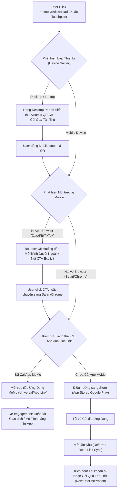

# BUSINESS REQUIREMENTS DOCUMENT (BRD)
# TÁI THIẾT KẾ CỔNG CHUYỂN ĐỔI OUT-APP DOWNLOAD MOMO (MOMO.VN/DOWNLOAD)

> **Mã tài liệu:** BRD-W2A-DOWNLOAD-2026-V1  
> **Trạng thái tài liệu:** DRAFT - PENDING APPROVAL  
> **Quản trị dự án:** Web Product Lead x Mobile Platform Team x Growth Marketing Team x Data Analytics Team  
> **Mốc tiến độ dự kiến:** Kick-off: 10/10/2026 | Staging Test: 24/10/2026 | Pilot Rollout: 31/10/2026 | Full Go-Live: 07/11/2026  

---

## 1. THÔNG TIN TỔNG QUAN (METADATA)

<table style="width:100%; border-collapse:collapse; border:1.5px solid #64748b; margin:1em 0; font-size:0.9em;">
  <thead>
    <tr style="background-color:#f1f5f9;">
      <th style="border:1.5px solid #64748b; padding:8px 12px; text-align:left; font-weight:700;">Hạng Mục</th>
      <th style="border:1.5px solid #64748b; padding:8px 12px; text-align:left; font-weight:700;">Chi Tiết Đặc Tả</th>
    </tr>
  </thead>
  <tbody>
    <tr>
      <td style="border:1px solid #94a3b8; padding:8px 12px; text-align:left;"><strong>Tên Sản Phẩm</strong></td>
      <td style="border:1px solid #94a3b8; padding:8px 12px; text-align:left;"><strong>MoMo Universal Download & Web-to-App Gateway</strong></td>
    </tr>
    <tr style="background-color:#f8fafc;">
      <td style="border:1px solid #94a3b8; padding:8px 12px; text-align:left;"><strong>Canonical URL</strong></td>
      <td style="border:1px solid #94a3b8; padding:8px 12px; text-align:left;"><code>https://momo.vn/download</code> (và các alias redirect liên quan)</td>
    </tr>
    <tr>
      <td style="border:1px solid #94a3b8; padding:8px 12px; text-align:left;"><strong>Định Vị Phân Loại</strong></td>
      <td style="border:1px solid #94a3b8; padding:8px 12px; text-align:left;">Productivity Zone & Core Web-to-App Acquisition Foundation</td>
    </tr>
    <tr style="background-color:#f8fafc;">
      <td style="border:1px solid #94a3b8; padding:8px 12px; text-align:left;"><strong>Phạm Vi Nghiệp Vụ</strong></td>
      <td style="border:1px solid #94a3b8; padding:8px 12px; text-align:left;">Chuyển đổi toàn bộ điểm chạm Out-App Traffic từ script redirect thô sơ sang Gateway sản phẩm thông minh (Smart App Routing, Dynamic QR Desktop, Bouncer UI cho In-App Webview, Attribution Tracking).</td>
    </tr>
  </tbody>
</table>

---

## 2. BỐI CẢNH & TUYÊN NGÔN VẤN ĐỀ (BUSINESS CONTEXT & PROBLEM STATEMENT)

### 2.1. Bối cảnh lịch sử và Quy mô Điểm chạm (7-8 Năm Tích Lũy)
- **Tài sản điểm chạm tích lũy:** Đường dẫn `momo.vn/download` là một trong những URL lâu đời nhất của MoMo, được in ấn và phân phối liên tục suốt 7-8 năm qua trên hàng triệu ấn phẩm vật lý và kỹ thuật số:
  - Điểm chạm Offline: POSM quầy thanh toán, sticker tại hàng trăm nghìn điểm chấp nhận thanh toán (Merchant Stores), banner sự kiện, tờ rơi, cẩm nang hướng dẫn sử dụng.
  - Điểm chạm Online: Footer toàn bộ hệ thống website `momo.vn`, bio mạng xã hội (Facebook Fanpage, TikTok Channel, YouTube), tin nhắn SMS Brandname CSKH, email marketing, bài viết PR báo chí và hệ thống đối tác liên kết.
- **Thực trạng kỹ thuật:** Trang này hiện chỉ vận hành như một đoạn mã JavaScript chuyển hướng thô sơ (User-Agent Sniffing). Trang hoàn toàn thiếu lớp trải nghiệm sản phẩm, không có khả năng nhận diện trạng thái cài đặt của người dùng, không có giao diện fallback và không ghi nhận bất kỳ dữ liệu phân tích nào trước khi đẩy người dùng sang Store.

### 2.2. Bốn Nỗi Đau Trọng Yếu & Thất Thoát Kinh Doanh (Core Pain Points)
1. **Thất thoát Người dùng Mới (New User Drop-off):** Người dùng mới click vào link bị đẩy thẳng sang giao diện App Store / Google Play mặc định. Trải nghiệm thiếu hoàn toàn thông điệp giá trị (Value Proposition), không thấy gói quà chào mừng người dùng mới (Welcome Gift Package), làm giảm động lực tải và đăng ký tài khoản.
2. **Trải nghiệm gãy khúc với Người dùng Đã Cài App (Existing Users):** Người dùng đã có app MoMo trên máy khi click vào link vẫn bị ép văng ra Store chỉ để nhìn thấy nút "Cập nhật" hoặc "Mở". Đây là trải nghiệm thừa thãi, gây ức chế và làm gián đoạn hành vi giao dịch tức thời.
3. **Lỗ hổng Trải nghiệm Desktop (Desktop Dead-end):** Người dùng truy cập bằng máy tính bàn / laptop bị rơi vào nhánh xử lý sai (mặc định chuyển hướng sang Google Play Store) hoặc màn hình trắng, thay vì cung cấp mã QR để dùng điện thoại quét tải app ngay lập tức.
4. **Tắc nghẽn tại In-App Browser (Zalo, Facebook, TikTok Webview):** Trình duyệt nội nhúng của các mạng xã hội thường xuyên chặn lệnh chuyển hướng tự động ra Store. Kết quả là người dùng bị kẹt lại màn hình trắng (blank screen), biến lượng traffic tự nhiên và tiếp thị trả phí thành traffic chết.
5. **Mù mờ Dữ liệu Đo lường (Zero Attribution):** Do redirect diễn ra hoàn toàn client-side không qua kiểm soát, doanh nghiệp không đo lường được có bao nhiêu lượt truy cập, tỷ lệ chuyển đổi sang Install là bao nhiêu, và chất lượng người dùng sau cài đặt ra sao.

---

## 3. MỤC TIÊU KINH DOANH & CHỈ SỐ THÀNH CÔNG (BUSINESS OBJECTIVES & KPIS)

### 3.1. Mục tiêu Chiến lược
- Tái cấu trúc toàn diện `momo.vn/download` thành **Smart Web-to-App Gateway**, trực tiếp đóng góp vào mục tiêu chiến lược H2/2026: **Tăng trưởng số lượng New User Install từ kênh Web lên 20.000 - 30.000 lượt/tháng**.
- Khai thông điểm nghẽn cho hàng triệu điểm chạm tích lũy suốt 7-8 năm, biến traffic vãng lai thành New User kích hoạt và giữ chân người dùng hiện hữu.

### 3.2. Khung Chỉ số Thành công (Success Metrics)

<table style="width:100%; border-collapse:collapse; border:1.5px solid #64748b; margin:1em 0; font-size:0.9em;">
  <thead>
    <tr style="background-color:#f1f5f9;">
      <th style="border:1.5px solid #64748b; padding:8px 12px; text-align:left; font-weight:700;">Nhóm Chỉ Số</th>
      <th style="border:1.5px solid #64748b; padding:8px 12px; text-align:left; font-weight:700;">Tên Chỉ Số Cụ Thể</th>
      <th style="border:1.5px solid #64748b; padding:8px 12px; text-align:center; font-weight:700;">Hiện Trạng (Baseline)</th>
      <th style="border:1.5px solid #64748b; padding:8px 12px; text-align:center; font-weight:700;">Mục Tiêu Sau Triển Khai</th>
    </tr>
  </thead>
  <tbody>
    <tr>
      <td style="border:1px solid #94a3b8; padding:8px 12px; text-align:left;"><strong>Tăng trưởng New User</strong></td>
      <td style="border:1px solid #94a3b8; padding:8px 12px; text-align:left;">Tỷ lệ Chuyển đổi Cài đặt (Click-to-Install CR)</td>
      <td style="border:1px solid #94a3b8; padding:8px 12px; text-align:center;">Ước tính &lt; 15% (không đo được)</td>
      <td style="border:1px solid #94a3b8; padding:8px 12px; text-align:center;"><strong>&ge; 30% - 35%</strong></td>
    </tr>
    <tr style="background-color:#f8fafc;">
      <td style="border:1px solid #94a3b8; padding:8px 12px; text-align:left;"><strong>Trải nghiệm Người dùng Cũ</strong></td>
      <td style="border:1px solid #94a3b8; padding:8px 12px; text-align:left;">Tỷ lệ Mở App Trực tiếp (Direct App Open Rate)</td>
      <td style="border:1px solid #94a3b8; padding:8px 12px; text-align:center;">0% (100% bị đẩy ra store)</td>
      <td style="border:1px solid #94a3b8; padding:8px 12px; text-align:center;"><strong>&ge; 75%</strong></td>
    </tr>
    <tr>
      <td style="border:1px solid #94a3b8; padding:8px 12px; text-align:left;"><strong>Chuyển đổi Desktop</strong></td>
      <td style="border:1px solid #94a3b8; padding:8px 12px; text-align:left;">Tỷ lệ Quét QR tải App trên Desktop (Scan-to-Install)</td>
      <td style="border:1px solid #94a3b8; padding:8px 12px; text-align:center;">0% (màn hình cụt/lỗi redirect)</td>
      <td style="border:1px solid #94a3b8; padding:8px 12px; text-align:center;"><strong>&ge; 18%</strong></td>
    </tr>
    <tr style="background-color:#f8fafc;">
      <td style="border:1px solid #94a3b8; padding:8px 12px; text-align:left;"><strong>Độ sẵn sàng Hạ tầng</strong></td>
      <td style="border:1px solid #94a3b8; padding:8px 12px; text-align:left;">Tỷ lệ Lỗi Trình duyệt Trong App (WebView Drop Rate)</td>
      <td style="border:1px solid #94a3b8; padding:8px 12px; text-align:center;">&gt; 40% (bị chặn/màn hình trắng)</td>
      <td style="border:1px solid #94a3b8; padding:8px 12px; text-align:center;"><strong>&le; 5%</strong></td>
    </tr>
    <tr>
      <td style="border:1px solid #94a3b8; padding:8px 12px; text-align:left;"><strong>Độ chính xác Đo lường</strong></td>
      <td style="border:1px solid #94a3b8; padding:8px 12px; text-align:left;">Tỷ lệ Ghi nhận Phễu Xuyên suốt (Attribution Match)</td>
      <td style="border:1px solid #94a3b8; padding:8px 12px; text-align:center;">0% (mất dấu hoàn toàn)</td>
      <td style="border:1px solid #94a3b8; padding:8px 12px; text-align:center;"><strong>&ge; 95%</strong></td>
    </tr>
  </tbody>
</table>

---

## 4. ĐẶC TẢ YÊU CẦU NGHIỆP VỤ & SẢN PHẨM (FUNCTIONAL REQUIREMENTS)

### 4.1. Định Hướng Trải Nghiệm: Educate-First & Value-Driven Landing Gateway
Thay vì một trang chuyển hướng mù (blind redirect), `momo.vn/download` được tái thiết kế thành **Trang Đích Giới Thiệu Giá Trị & Kích Hoạt Chuyển Đổi**:
- **Nguyên tắc Above the Fold (Action-First):** Ngay khi truy cập, người dùng nhìn thấy ngay lý do phải tải (Gói quà tân thủ) và nút CTA hành động trực tiếp mà không cần cuộn trang.
- **Nguyên tắc Below the Fold (Educate-Next):** Khi cuộn trang, người dùng được khám phá hệ sinh thái dịch vụ toàn diện của MoMo theo dạng khối trực quan, cô đọng (TLDR), giải quyết thắc mắc "MoMo có gì cho tôi?".

### 4.2. Bố Cục Giao Diện & Khối Nội Dung (Information Architecture & Wireframe Spec)

1. **Khối 1: Hero Section (Above the Fold)**
   - **Headline & Value Proposition:** Thông điệp ngắn gọn, trực diện (Ví dụ: *"MoMo - Trợ thủ tài chính và thanh toán hàng ngày của hơn 30 triệu người Việt"*).
   - **Gói quà Tân thủ (Welcome Incentive Badge):** Nổi bật thông điệp tặng gói quà voucher trải nghiệm (500.000đ - 1.000.000đ) khi đăng ký tài khoản mới.
   - **Khối Nút CTA Thích Ứng Theo Thiết Bị (Adaptive CTA Cluster):**
     - *Trên iOS:* Nút chính `Tải trên App Store` (kèm icon Apple) + Nút phụ `Đã có MoMo? Mở Ứng Dụng`.
     - *Trên Android:* Nút chính `Tải trên Google Play` (kèm icon Google Play) + Nút phụ `Đã có MoMo? Mở Ứng Dụng`.
     - *Trên Desktop:* Khối hiển thị **Mã QR Động (Dynamic QR Code)** quét để tải app ngay trên điện thoại + 2 nút Store phụ.

2. **Khối 2: Ecosystem Education (MoMo Có Gì Cho Bạn? - 4 Trụ Cột Cốt Lõi)**
   - *Trụ cột 1 - Thanh toán & Chuyển tiền tiện lợi:* Chuyển tiền 24/7 miễn phí mọi ngân hàng, quét mã QR thanh toán tại hàng triệu điểm ăn uống, mua sắm.
   - *Trụ cột 2 - Trung tâm Tài chính số:* Dùng trước trả sau với Ví Trả Sau, gửi tiết kiệm sinh lời mỗi ngày từ số vốn nhỏ, tra cứu điểm tín dụng CIC miễn phí, gói vay tiêu dùng giải ngân nhanh.
   - *Trụ cột 3 - Giải trí & Đời sống:* Đặt vé xem phim toàn bộ cụm rạp CGV/Lotte/BHD/Beta/NCC, mua vé máy bay, vé xe khách, nạp data 3G/4G, nạp game chiết khấu cao.
   - *Trụ cột 4 - Tiện ích Dân sinh & Giao thông:* Tra cứu và nộp phạt nguội toàn quốc, thanh toán hóa đơn điện/nước/internet tự động nhắc cước, mua bảo hiểm xe máy/ô tô/y tế trực tuyến.

3. **Khối 3: Social Proof & Security Foundation (Bảo Chứng Thương Hiệu)**
   - Quy mô cộng đồng: Hơn 30 triệu người dùng tin tưởng sử dụng thường xuyên.
   - Tiêu chuẩn bảo mật: Chứng chỉ bảo mật quốc tế cấp độ cao nhất PCI DSS Level 1, cơ chế sinh trắc học Face ID / Fingerprint, bảo chứng pháp lý từ Ngân hàng Nhà nước Việt Nam.
   - Hệ thống liên kết đối tác: Logo mạng lưới ngân hàng nội địa (Vietcombank, Techcombank, BIDV, Agribank, VPBank...) và các đối tác toàn cầu (Apple, Google, TikTok).

4. **Khối 4: Sticky Floating CTA (Nút Hành Động Nổi Chân Trang)**
   - Khi người dùng cuộn qua khỏi Hero Section để đọc nội dung Educate, một thanh điều hướng nhỏ gọn (Bottom Floating Bar) sẽ cố định ở chân màn hình điện thoại với nút CTA tương ứng theo hệ điều hành để người dùng có thể bấm tải app bất kỳ lúc nào.

### 4.3. Cơ Chế Nhận Diện Thiết Bị & Logic Nút Bấm Thông Minh (Smart CTA Logic)

1. **Nhận diện Hệ điều hành (OS Detection):**
   - Phân tích User-Agent tại tầng CDN Edge/Server trước khi trả HTML về trình duyệt.
   - Tự động hiển thị đúng bộ nút Store của nền tảng đang truy cập (tránh việc hiển thị thừa thãi nút Google Play cho người dùng iPhone).

2. **Xử lý Bài toán "Đã có App vs Chưa có App" (App Presence Handling):**
   - *Nguyên tắc bảo mật trình duyệt:* Trình duyệt web không thể query ngầm danh sách app đã cài của thiết bị để ẩn/hiện nút tự động vì cơ chế Sandbox của iOS/Android.
   - *Giải pháp UX tối ưu:* Thiết lập cấu trúc **Nút Bấm Kép Thông Minh (Dual Smart CTA)** trên Mobile:
     - **Nút Chính (Primary Solid Button):** `Tải App Trên [Store Name]` (kích thước lớn, màu hồng nhận diện MoMo). Dành cho New User chưa có app, click vào dẫn thẳng trang Custom Product Page tương ứng trên Store.
     - **Nút Phụ (Secondary Outline/Ghost Button):** `Đã có MoMo? Mở Ứng Dụng Ngay` (nằm ngay bên dưới nút chính). Dành cho người dùng cũ đã cài app, gắn Universal Link (iOS) hoặc Android App Link. Nếu máy đã có app, ứng dụng MoMo sẽ được kích hoạt mở lên ngay lập tức mà không phải qua Store.
   - *Cơ chế Fallback Smart Routing (One-Click Flow):* Nút phụ mở app được cài đặt cơ chế tự động: nếu người dùng bấm "Mở Ứng Dụng" nhưng thực tế máy chưa cài app, hệ thống sẽ tự động chuyển hướng nhẹ nhàng sang kho ứng dụng sau 1.2 giây mà không báo lỗi gãy luồng.

---

## 5. ĐẶC TẢ LUỒNG NGƯỜI DÙNG (USER FLOW & STEP BREAKDOWN)

### 5.1. Sơ đồ Luồng Chuyển đổi Tổng thể (Mermaid Diagram)

### 5.2. Bảng Phân Tích Chi Tiết Các Bước (Step Breakdown Table)

<table style="width:100%; border-collapse:collapse; border:1.5px solid #64748b; margin:1em 0; font-size:0.9em;">
  <thead>
    <tr style="background-color:#f1f5f9;">
      <th style="border:1.5px solid #64748b; padding:8px 12px; text-align:left; font-weight:700;">Bước</th>
      <th style="border:1.5px solid #64748b; padding:8px 12px; text-align:left; font-weight:700;">Tên Giai Đoạn</th>
      <th style="border:1.5px solid #64748b; padding:8px 12px; text-align:left; font-weight:700;">Trải Nghiệm Người Dùng (UX)</th>
      <th style="border:1.5px solid #64748b; padding:8px 12px; text-align:left; font-weight:700;">Hạ Tầng / Cơ Chế Kỹ Thuật</th>
      <th style="border:1.5px solid #64748b; padding:8px 12px; text-align:left; font-weight:700;">Nền Tảng</th>
    </tr>
  </thead>
  <tbody>
    <tr>
      <td style="border:1px solid #94a3b8; padding:8px 12px; text-align:left;">1</td>
      <td style="border:1px solid #94a3b8; padding:8px 12px; text-align:left;">Traffic Ingestion & Attribution Capture</td>
      <td style="border:1px solid #94a3b8; padding:8px 12px; text-align:left;">Người dùng click liên kết từ POSM, bio mạng xã hội, footer website hoặc SMS.</td>
      <td style="border:1px solid #94a3b8; padding:8px 12px; text-align:left;">Edge Server / Cloudflare Worker bóc tách User-Agent và lưu trữ UTM Parameter.</td>
      <td style="border:1px solid #94a3b8; padding:8px 12px; text-align:left;">Web Edge</td>
    </tr>
    <tr style="background-color:#f8fafc;">
      <td style="border:1px solid #94a3b8; padding:8px 12px; text-align:left;">2</td>
      <td style="border:1px solid #94a3b8; padding:8px 12px; text-align:left;">Device & Environment Routing</td>
      <td style="border:1px solid #94a3b8; padding:8px 12px; text-align:left;">Desktop thấy mã QR kèm ưu đãi; In-App Webview thấy trang đệm hướng dẫn mở Safari/Chrome.</td>
      <td style="border:1px solid #94a3b8; padding:8px 12px; text-align:left;">Responsive Framework & Dynamic QR Generator tích hợp AppsFlyer OneLink.</td>
      <td style="border:1px solid #94a3b8; padding:8px 12px; text-align:left;">Web Platform</td>
    </tr>
    <tr>
      <td style="border:1px solid #94a3b8; padding:8px 12px; text-align:left;">3</td>
      <td style="border:1px solid #94a3b8; padding:8px 12px; text-align:left;">Deep Linking & Store Redirection</td>
      <td style="border:1px solid #94a3b8; padding:8px 12px; text-align:left;">Người dùng có app được mở app ngay; người dùng chưa có app được chuyển mượt mà tới Store tương ứng.</td>
      <td style="border:1px solid #94a3b8; padding:8px 12px; text-align:left;">AppsFlyer OneLink, Universal Link (iOS AASA), App Link (Android Digital Asset Links).</td>
      <td style="border:1px solid #94a3b8; padding:8px 12px; text-align:left;">Web to App / Store</td>
    </tr>
    <tr style="background-color:#f8fafc;">
      <td style="border:1px solid #94a3b8; padding:8px 12px; text-align:left;">4</td>
      <td style="border:1px solid #94a3b8; padding:8px 12px; text-align:left;">Store Contextual Presentation</td>
      <td style="border:1px solid #94a3b8; padding:8px 12px; text-align:left;">Người dùng nhìn thấy banner, tiêu đề và hình ảnh Store Listing ăn khớp với chiến dịch đã click.</td>
      <td style="border:1px solid #94a3b8; padding:8px 12px; text-align:left;">Apple Custom Product Pages (CPP) & Google Play Custom Store Listings (CSL).</td>
      <td style="border:1px solid #94a3b8; padding:8px 12px; text-align:left;">App Store / Google Play</td>
    </tr>
    <tr>
      <td style="border:1px solid #94a3b8; padding:8px 12px; text-align:left;">5</td>
      <td style="border:1px solid #94a3b8; padding:8px 12px; text-align:left;">Post-Install Context Continuity</td>
      <td style="border:1px solid #94a3b8; padding:8px 12px; text-align:left;">Mở app lần đầu sau cài đặt lập tức thấy màn hình chào mừng cùng gói quà tặng tân thủ đã hứa.</td>
      <td style="border:1px solid #94a3b8; padding:8px 12px; text-align:left;">AppsFlyer Deferred Deep Link SDK Callback & In-App Onboarding Router.</td>
      <td style="border:1px solid #94a3b8; padding:8px 12px; text-align:left;">Mobile App MoMo</td>
    </tr>
  </tbody>
</table>

---

## 6. YÊU CẦU KỸ THUẬT & HẠ TẦNG DỮ LIỆU (TECHNICAL & TRACKING SPECIFICATIONS)

### 6.1. Kiến trúc Kỹ thuật Kênh Web
- **Loại bỏ hoàn toàn mã chuyển hướng phía Client cũ:** Thay thế script JavaScript User-Agent sniffing cũ bằng máy chủ tĩnh phân phối qua Edge CDN.
- **Bảo toàn Tham số (Query Parameter Forwarding):** Toàn bộ tham số `utm_source`, `utm_medium`, `utm_campaign`, `utm_content`, `aff_sub` phải được giữ nguyên vẹn và nối vào chuỗi URL OneLink khi chuyển tiếp người dùng sang Store hoặc mở App.
- **Thời gian phản hồi (Latency SLA):** Thời gian từ khi nhận yêu cầu HTTP đến khi trả về giao diện hoặc kích hoạt link không quá 400ms trên mạng 4G.

### 6.2. Tích hợp Hạ tầng Phân bổ Dữ liệu (MMP Integration)
- **Tận dụng Hạ tầng AppsFlyer Sẵn Có:** Không đầu tư hay khảo sát giải pháp bên thứ ba mới. Web Platform phối hợp trực tiếp với Growth Team để khởi tạo template OneLink chuyên biệt dành cho cổng `momo.vn/download`.
- **Cấu hình Tên miền Định tuyến (Associated Domains):**
  - Cấu hình file `apple-app-site-association` (AASA) cho iOS trên domain `momo.vn`.
  - Cấu hình file `assetlinks.json` cho Android trên domain `momo.vn`.
- **Sự kiện Đo lường Bắt buộc (Tracking Events):**
  - `web_download_page_view`: Ghi nhận khi người dùng chạm trang, phân loại theo thiết bị và nguồn traffic.
  - `web_download_qr_generated`: Ghi nhận khi mã QR được sinh trên Desktop.
  - `web_download_click_to_app`: Người dùng nhấn nút mở app trên mobile.
  - `web_download_store_redirect`: Thời điểm kích hoạt chuyển hướng ra Store.
  - `web_download_inapp_browser_view`: Ghi nhận tỷ lệ mở trang trong WebView (Zalo, Facebook).

---

## 7. LỘ TRÌNH TRIỂN KHAI & CỘT MỐC (ROADMAP & MILESTONES)

<table style="width:100%; border-collapse:collapse; border:1.5px solid #64748b; margin:1em 0; font-size:0.9em;">
  <thead>
    <tr style="background-color:#f1f5f9;">
      <th style="border:1.5px solid #64748b; padding:8px 12px; text-align:left; font-weight:700;">Giai Đoạn</th>
      <th style="border:1.5px solid #64748b; padding:8px 12px; text-align:left; font-weight:700;">Thời Gian</th>
      <th style="border:1.5px solid #64748b; padding:8px 12px; text-align:left; font-weight:700;">Tên Giai Đoạn</th>
      <th style="border:1.5px solid #64748b; padding:8px 12px; text-align:left; font-weight:700;">Chi Tiết Triển Khai & Mục Tiêu</th>
    </tr>
  </thead>
  <tbody>
    <tr>
      <td style="border:1px solid #94a3b8; padding:8px 12px; text-align:left;"><strong>Giai đoạn 1</strong></td>
      <td style="border:1px solid #94a3b8; padding:8px 12px; text-align:left;">10/10 - 24/10/2026</td>
      <td style="border:1px solid #94a3b8; padding:8px 12px; text-align:left;">Vá Lỗ Hổng Nền Tảng & Trải Nghiệm Desktop (Quick Wins)</td>
      <td style="border:1px solid #94a3b8; padding:8px 12px; text-align:left;">
        <ul>
          <li>Loại bỏ nhánh code logic Windows Phone lỗi thời.</li>
          <li>Xây dựng giao diện Desktop Portal có Dynamic QR Code và gói quà tân thủ.</li>
          <li>Xây dựng giao diện trung gian tối giản (Bouncer UI) cho In-App Browser (Zalo, FB).</li>
          <li>Gắn sự kiện GA4 đo lường tỷ lệ rớt (drop-off) thực tế trước khi redirect.</li>
        </ul>
      </td>
    </tr>
    <tr style="background-color:#f8fafc;">
      <td style="border:1px solid #94a3b8; padding:8px 12px; text-align:left;"><strong>Giai đoạn 2</strong></td>
      <td style="border:1px solid #94a3b8; padding:8px 12px; text-align:left;">25/10 - 07/11/2026</td>
      <td style="border:1px solid #94a3b8; padding:8px 12px; text-align:left;">Chuẩn Hóa OneLink & Cá Nhân Hóa Store (Smart Routing)</td>
      <td style="border:1px solid #94a3b8; padding:8px 12px; text-align:left;">
        <ul>
          <li>Cấu hình OneLink Template AppsFlyer chính thức cho <code>momo.vn/download</code>.</li>
          <li>Tích hợp Universal Link & Android App Link phân tách luồng mở app và cài app.</li>
          <li>Phối hợp Growth/ASO thiết lập Custom Product Pages (iOS) và Custom Store Listings (Android).</li>
          <li>Đồng bộ phễu chuyển đổi lên Data Studio Dashboard quản trị hàng ngày.</li>
        </ul>
      </td>
    </tr>
    <tr>
      <td style="border:1px solid #94a3b8; padding:8px 12px; text-align:left;"><strong>Giai đoạn 3</strong></td>
      <td style="border:1px solid #94a3b8; padding:8px 12px; text-align:left;">08/11 - 30/11/2026</td>
      <td style="border:1px solid #94a3b8; padding:8px 12px; text-align:left;">Đồng Bộ Ngữ Cảnh Sau Cài Đặt (Deferred Deep Linking)</td>
      <td style="border:1px solid #94a3b8; padding:8px 12px; text-align:left;">
        <ul>
          <li>Cấu hình Mobile SDK đọc dữ liệu Deferred Deep Link khi người dùng mở app lần đầu.</li>
          <li>Cá nhân hóa luồng Onboarding: điều hướng thẳng tới gói quà tân thủ đã cam kết ngoài Web.</li>
          <li>Đánh giá hiệu suất toàn diện và rà soát audit danh mục link chiến dịch toàn sàn.</li>
        </ul>
      </td>
    </tr>
  </tbody>
</table>

---

## 8. MA TRẬN PHÂN CÔNG TRÁCH NHIỆM (RACI MATRIX)

<table style="width:100%; border-collapse:collapse; border:1.5px solid #64748b; margin:1em 0; font-size:0.9em;">
  <thead>
    <tr style="background-color:#f1f5f9;">
      <th style="border:1.5px solid #64748b; padding:8px 12px; text-align:left; font-weight:700;">Hạng Mục Công Việc</th>
      <th style="border:1.5px solid #64748b; padding:8px 12px; text-align:center; font-weight:700;">Web Platform Team</th>
      <th style="border:1.5px solid #64748b; padding:8px 12px; text-align:center; font-weight:700;">Mobile App Team</th>
      <th style="border:1.5px solid #64748b; padding:8px 12px; text-align:center; font-weight:700;">Growth Marketing Team</th>
      <th style="border:1.5px solid #64748b; padding:8px 12px; text-align:center; font-weight:700;">Data Analytics Team</th>
    </tr>
  </thead>
  <tbody>
    <tr>
      <td style="border:1px solid #94a3b8; padding:8px 12px; text-align:left;">Xây dựng UI Desktop QR & In-App Bouncer Page</td>
      <td style="border:1px solid #94a3b8; padding:8px 12px; text-align:center;"><strong>R (Chủ trì)</strong></td>
      <td style="border:1px solid #94a3b8; padding:8px 12px; text-align:center;">I (Thông báo)</td>
      <td style="border:1px solid #94a3b8; padding:8px 12px; text-align:center;">C (Góp ý)</td>
      <td style="border:1px solid #94a3b8; padding:8px 12px; text-align:center;">C (Review Tagging)</td>
    </tr>
    <tr style="background-color:#f8fafc;">
      <td style="border:1px solid #94a3b8; padding:8px 12px; text-align:left;">Cấu hình OneLink AppsFlyer Template cho Web</td>
      <td style="border:1px solid #94a3b8; padding:8px 12px; text-align:center;">C (Phối hợp)</td>
      <td style="border:1px solid #94a3b8; padding:8px 12px; text-align:center;">C (Cấu hình)</td>
      <td style="border:1px solid #94a3b8; padding:8px 12px; text-align:center;"><strong>R (Chủ trì)</strong></td>
      <td style="border:1px solid #94a3b8; padding:8px 12px; text-align:center;">C (Kiểm tra)</td>
    </tr>
    <tr>
      <td style="border:1px solid #94a3b8; padding:8px 12px; text-align:left;">Cấu hình AASA & Android Digital Asset Links</td>
      <td style="border:1px solid #94a3b8; padding:8px 12px; text-align:center;">C (Domain Web)</td>
      <td style="border:1px solid #94a3b8; padding:8px 12px; text-align:center;"><strong>R (Chủ trì)</strong></td>
      <td style="border:1px solid #94a3b8; padding:8px 12px; text-align:center;">I (Thông báo)</td>
      <td style="border:1px solid #94a3b8; padding:8px 12px; text-align:center;">I (Thông báo)</td>
    </tr>
    <tr style="background-color:#f8fafc;">
      <td style="border:1px solid #94a3b8; padding:8px 12px; text-align:left;">Thiết kế Custom Product Pages & Custom Store Listings</td>
      <td style="border:1px solid #94a3b8; padding:8px 12px; text-align:center;">I (Thông báo)</td>
      <td style="border:1px solid #94a3b8; padding:8px 12px; text-align:center;">I (Thông báo)</td>
      <td style="border:1px solid #94a3b8; padding:8px 12px; text-align:center;"><strong>R (Chủ trì)</strong></td>
      <td style="border:1px solid #94a3b8; padding:8px 12px; text-align:center;">C (A/B Test)</td>
    </tr>
    <tr>
      <td style="border:1px solid #94a3b8; padding:8px 12px; text-align:left;">Xử lý Deferred Deep Link Onboarding In-App</td>
      <td style="border:1px solid #94a3b8; padding:8px 12px; text-align:center;">C (Gửi Payload)</td>
      <td style="border:1px solid #94a3b8; padding:8px 12px; text-align:center;"><strong>R (Chủ trì)</strong></td>
      <td style="border:1px solid #94a3b8; padding:8px 12px; text-align:center;">C (Thiết kế quà)</td>
      <td style="border:1px solid #94a3b8; padding:8px 12px; text-align:center;">C (Đo Activation)</td>
    </tr>
    <tr style="background-color:#f8fafc;">
      <td style="border:1px solid #94a3b8; padding:8px 12px; text-align:left;">Dựng Dashboard Theo Dõi Phễu Web-to-App Xuyên Suốt</td>
      <td style="border:1px solid #94a3b8; padding:8px 12px; text-align:center;">C (Cung cấp Data Web)</td>
      <td style="border:1px solid #94a3b8; padding:8px 12px; text-align:center;">C (Data App)</td>
      <td style="border:1px solid #94a3b8; padding:8px 12px; text-align:center;">C (Yêu cầu KPI)</td>
      <td style="border:1px solid #94a3b8; padding:8px 12px; text-align:center;"><strong>R (Chủ trì)</strong></td>
    </tr>
  </tbody>
</table>

> *Ghi chú ma trận RACI:* **R** = Responsible (Chủ trì thực thi), **A** = Accountable (Chịu trách nhiệm phê duyệt), **C** = Consulted (Tư vấn chuyên môn), **I** = Informed (Nhận thông tin cập nhật).

---

## 9. QUẢN TRỊ RỦI RO & PHƯƠNG ÁN XỬ LÝ (RISK MANAGEMENT)

1. **Rủi ro người dùng bị gián đoạn khi cập nhật logic:**
   - *Phương án:* Giữ nguyên 100% đường dẫn và cơ chế fallback URL gốc. Triển khai thử nghiệm (Canary/A-B Testing) 10% traffic trước khi áp dụng diện rộng.
2. **Rủi ro hệ thống AppsFlyer gặp sự cố:**
   - *Phương án:* Nếu API OneLink không phản hồi trong 1.5 giây, hệ thống tự động fallback về direct link dẫn ra App Store / Play Store thuần túy để bảo toàn lượt truy cập.
3. **Chính sách kiểm soát quyền riêng tư (ATT trên iOS):**
   - *Phương án:* Tối ưu cơ chế deterministic matching qua Install Referrer trên Android và Smart App Banners native trên iOS để giảm thiểu tỷ lệ thất thoát attribution.
