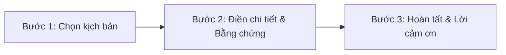

# PRD: Website Report Scam - Landing Page & Anonymous Form

> - **Use Case:** Báo Cáo Lừa Đảo (Trust - Report Scam)
> - **Main URL:** momo.vn/report-scam
> - **Division:** Risk & Security (GPD Web Platform)
> - **Version:** 1.0 · Tháng 6/2026
> - **Status:** [DRAFT] - Sẵn sàng cho phát triển (Tháng 7/2026 Release)
> - **Doc Owner:** NGUYEN HUYNH THAI KHANG - RM

---

## 1. Overview & Business Value

### 1.1 Business Goals
*   **Qualitative:** Tăng chỉ số User Trust & Safety, xây dựng vị thế "Nền tảng thanh toán an toàn nhất" trong mảng ví điện tử và thanh toán số tại Việt Nam.
*   **Quantitative:** Đạt **20.000 reports/tháng** trong H2/2026 (hiện tại qua các kênh CS là ~10.000 ticket/tháng). Tỷ lệ báo cáo được phê duyệt (Approved Report) đạt >= 70%.

### 1.2 Target User Profile
*   **Non-MoMo Users:** Những người dùng không có tài khoản MoMo (hoặc sử dụng dịch vụ ngân hàng khác) bị kẻ gian lừa đảo chuyển khoản qua tài khoản MoMo giả mạo hoặc suýt bị lừa.
*   **Hành vi người dùng:** Khi phát hiện bị lừa đảo, nạn nhân thường hoảng loạn và lập tức tìm kiếm trên Google với từ khóa: *"bị lừa chuyển khoản MoMo phải làm gì"*, *"tố cáo số tài khoản MoMo lừa đảo"*. Họ cần một kênh tiếp nhận nhanh chóng, tin cậy, không rườm rà.

### 1.3 Key Constraints & Non-Goals
*   **Non-Goals:** 
    *   Không xử lý trực tiếp khiếu nại hoàn tiền hay tranh chấp giao dịch qua kênh này (phải chuyển hướng sang luồng hỗ trợ CS in-app hoặc Hotline).
    *   Không cam kết phản hồi cá nhân chi tiết cho từng báo cáo ở phiên bản V1 (do tính chất báo cáo ẩn danh).

---

## 2. Landing Page Specifications (Home Page)

Giao diện trang Landing Page `/report-scam` được thiết kế theo cấu trúc gồm **5 Zone** chính nhằm giới thiệu tính năng và kêu gọi hành động:

### 2.1 Zone 1: Web Banner (Hero Section)
*   **Mục tiêu:** Giới thiệu tính năng và hướng dẫn quy trình 3 bước tối giản.
*   **Nội dung hiển thị (Tiếng Việt):**
    *   *Title:* Báo cáo lừa đảo chỉ trong 2 phút.
    *   *Mô tả:* 3 bước nhanh gọn giúp chặn đứng kẻ gian. Bảo mật tuyệt đối, không yêu cầu đăng nhập và không bắt buộc thu thập thông tin cá nhân.
    *   *Các bước thực hiện:*
        1. Chọn và mô tả kịch bản lừa đảo.
        2. Cung cấp thông tin kẻ gian và bằng chứng (nếu có).
        3. Gửi ẩn danh.
    *   *CTA Button:* Bắt đầu báo cáo (Cuộn xuống hoặc chuyển hướng đến màn hình Form).

### 2.2 Zone 2: Live Dashboard (Tác động cộng đồng)
*   **Mục tiêu:** Hiển thị số liệu thực tế để tăng động lực báo cáo của người dùng.
*   **Logic hiển thị:** 
    *   Lấy dữ liệu thời gian thực từ hệ thống bảo mật MoMo và làm tròn số liệu theo định dạng rút gọn (ví dụ: `4.659` -> `4.7K`, `4.630` -> `4.600` -> `4.6K`).

| Chỉ số hiển thị | Logic dữ liệu | Nhãn Tiếng Việt | Nhãn Tiếng Anh |
|---|---|---|---|
| **Thông tin 1** | Tổng số báo cáo lừa đảo ghi nhận từ tất cả các nguồn | Báo cáo từ cộng đồng | Community Reports |
| **Thông tin 2** | Tổng số giao dịch rủi ro/lừa đảo được hệ thống phát hiện | Cảnh báo giao dịch | Transactions Warned |
| **Thông tin 3** | Tổng số người dùng được bảo vệ an toàn khỏi giao dịch xấu | Người được bảo vệ | People Protected |
| **Thông tin 4** | Tổng số tiền lừa đảo đã được ngăn chặn thành công | Số tiền được bảo vệ | Amount Protected |

### 2.3 Zone 3: Cơ chế xử lý (How it works)
*   **Mục tiêu:** Giải thích luồng xử lý báo cáo sau khi người dùng submit.
*   **Nội dung hiển thị:**
    *   *Title:* Điều gì xảy ra khi bạn báo cáo?
    *   *Mô tả:* Mỗi báo cáo đều được tiếp nhận và xử lý nghiêm túc.
    *   *Quy trình 3 bước:*
        1. **Bạn gửi báo cáo:** Điền thông tin kẻ gian hoàn toàn ẩn danh và được bảo mật tuyệt đối.
        2. **MoMo xác minh:** Hệ thống AI tự động đối chiếu, phân loại và đánh giá mức độ rủi ro của tài khoản bị tố cáo.
        3. **Cảnh báo cộng đồng:** Đưa tài khoản xấu vào "Danh sách đen" để cảnh báo giao dịch cho hàng triệu người dùng khác.
    *   *CTA Button:* Bắt đầu báo cáo.

### 2.4 Zone 4: An toàn bảo mật trên MoMo
*   **Mục tiêu:** Tăng độ tin cậy và giới thiệu các công nghệ bảo mật của MoMo.
*   **Nội dung hiển thị:**
    *   *Title:* Kích hoạt lá chắn bảo mật thông minh.
    *   *Mô tả:* Không chỉ là ứng dụng thanh toán, MoMo tự động bảo vệ tài sản của bạn với công nghệ bảo mật nhiều lớp.
    *   *3 trụ cột tính năng:*
        *   **Chặn giao dịch rủi ro:** Công nghệ AI tự động nhận diện, cảnh báo và ngăn chặn các giao dịch bất thường 24/7.
        *   **Tra cứu & Báo cáo chủ động:** Công cụ kiểm tra nhanh thông tin nghi vấn và gửi báo cáo ẩn danh giúp bảo vệ cộng đồng.
        *   **Nâng cao nhận thức:** Kết nối cùng hơn 300.000 người theo dõi trên Business Page để cập nhật liên tục các thủ đoạn lừa đảo mới.
    *   *CTA Button:* Bắt đầu báo cáo / Khám phá ngay trên MoMo.

### 2.5 Zone 5: Sticky Footer
*   **Mô tả:** Thanh bar cố định dưới cùng màn hình (khi người dùng cuộn trang) hiển thị nút bấm CTA duy nhất: **Báo cáo ngay** để đảm bảo người dùng có thể kích hoạt form báo cáo tại bất kỳ vị trí nào trên Landing Page.

---

## 3. Form Báo Cáo 3 Bước (Form Report Screen)

Biểu mẫu tiếp nhận thông tin được xây dựng tối giản, chia làm **3 bước (Screens)** hiển thị qua thanh tiến trình (Progress Line: *Chọn kịch bản -> Chi tiết -> Hoàn tất*).

### 3.1 Bước 1: Chọn Kịch Bản (Screen 1)
*   **Giao diện:**
    *   *Title:* Báo cáo lừa đảo.
    *   *Tiêu đề phụ:* Bạn gặp phải hình thức lừa đảo nào?
    *   *Danh sách kịch bản lựa chọn (Radio Button/Card Select):*
        1. Mua hàng Online.
        2. Khuyến mãi nhận thưởng.
        3. Giả danh cơ quan Nhà nước, doanh nghiệp.
        4. Người quen bị hack tài khoản vay mượn tiền.
        5. Rút tiền dịch vụ tài chính.
        6. Đóng phí tìm việc làm online.
        7. Tiết lộ thông tin tài khoản.
        8. Mất quyền kiểm soát thiết bị.
        9. Đặt cọc du lịch.
        10. **Khác:** Cho phép người dùng tự nhập nội dung ngắn khi lựa chọn hình thức này.
    *   *CTA Button:* Tiếp tục (Chuyển sang Bước 2).

### 3.2 Bước 2: Nhập Chi Tiết & Đính Kèm Bằng Chứng (Screen 2)
Người dùng cung cấp thông tin thô để phục vụ hậu kiểm.

*   **Phân mục 1: Thông tin đối tượng lừa đảo (Kẻ gian)**
    *   *Ngân hàng / Ví điện tử:* Chọn từ Dropdown list (MoMo hoặc tên các ngân hàng đối tác).
    *   *Số tài khoản (STK):* Trường Text (bắt buộc nếu chọn Ngân hàng).
    *   *Tên tài khoản:* Trường Text (hệ thống tự viết hoa).
    *   *Số điện thoại (SĐT):* Trường Text (tùy chọn).
    *   *Đường link (Website/Facebook của kẻ lừa đảo):* Trường Text (tùy chọn).

*   **Phân mục 2: Thông tin nạn nhân (Người báo cáo)**
    *   *Mục đích:* Tùy chọn để liên hệ nếu cần, bảo đảm tuân thủ Nghị định 13 (Có checkbox đồng thuận tự nguyện). Nếu người dùng bỏ trống, báo cáo vẫn được ghi nhận dưới dạng ẩn danh.
    *   *Các trường:* Số điện thoại / Email liên hệ.

*   **Phân mục 3: Diễn biến sự việc**
    *   *Thời điểm xảy ra:* Chọn ngày/giờ từ bộ lịch (tùy chọn).
    *   *Số tiền bị lừa:* Trường số (tùy chọn).
    *   *Mô tả diễn biến:* Ô textarea nhập văn bản tự do (tối đa 1000 ký tự).

*   **Phân mục 4: Đính kèm bằng chứng (Proof)**
    *   *Mô tả:* Khu vực tải lên hình ảnh bằng chứng (ảnh chụp màn hình chat chuyển tiền, tin nhắn lừa đảo).
    *   *Giới hạn:* Tối đa 5 hình ảnh, dung lượng mỗi file không quá **5MB**, hỗ trợ định dạng PNG, JPG, JPEG.

*   **CTA Action:** Tiếp tục (Submit báo cáo) / Quay lại (Về Bước 1).

### 3.3 Bước 3: Hoàn tất (Screen 3)
*   **Giao diện:**
    *   Hiển thị màn hình thông báo gửi thành công.
    *   Gửi lời cảm ơn người dùng đã chung tay bảo vệ cộng đồng.
    *   Hiển thị các khuyến cáo an toàn bảo mật từ MoMo giúp người dùng nâng cao cảnh giác.

---

## 4. Technical & Data Requirements

### 4.1 API & Backend Processing
*   **API Endpoint:** `POST /api/v1/report-scam/submit`
*   **Dữ liệu Payload:** Dạng JSON kèm multipart/form-data cho tệp đính kèm.
*   **Xử lý dữ liệu:**
    *   Lưu thông tin báo cáo thô vào phân vùng Database tạm thời (Pending verification).
    *   Tự động sinh ticket nghiệp vụ đẩy sang hệ thống **Risk Verification** để Agent hậu kiểm và duyệt Blacklist.
    *   Đẩy file bằng chứng lên Cloud Storage bảo mật (chỉ nhân sự được phân quyền mới có thể truy cập).

### 4.2 Legal Compliance (Nghị định 13)
*   Nghiêm cấm bắt buộc người dùng nhập SĐT/Email định danh để submit.
*   Nếu người dùng chọn nhập thông tin liên hệ, hệ thống bắt buộc hiển thị checkbox: *"Tôi đồng ý cho phép MoMo sử dụng thông tin liên hệ này phục vụ quá trình xác minh báo cáo theo quy định bảo mật."*

### 4.3 Tracking & Analytics
*   Đo lường các chỉ số phễu: `Landing Page Visit` -> `Click Start Report` -> `Select Scenario (Step 1)` -> `Submit Details (Step 2)` -> `Report Success (Step 3)`.
*   Đo lường tỷ lệ bỏ dở (Drop-off Rate) tại từng bước của Form để tối ưu UI/UX.

### 4.4 Performance & End-to-End Latency Monitoring (Đo lường thời gian xử lý E2E)
*   **Mục tiêu:** Đo lường chính xác thời gian xử lý End-to-End (E2E) cho từng kịch bản/use case báo cáo lừa đảo, đảm bảo hệ thống phản hồi siêu tốc và giảm thiểu độ trễ tối đa theo định hướng tối ưu hiệu suất ứng dụng.
*   **Các mốc đo lường chính:**
    1.  **Client E2E Submission Latency (Độ trễ gửi biểu mẫu):** Đo từ thời điểm người dùng click "Gửi báo cáo" đến khi giao diện hoàn tất tải và chuyển sang "Bước 3: Hoàn tất" (bao gồm thời gian tải lên tối đa 5 ảnh bằng chứng và nhận phản hồi từ API). *Tiêu chuẩn:* **< 3 giây** (trên kết nối 3G tiêu chuẩn).
    2.  **System E2E Processing Latency (Độ trễ xử lý hệ thống):** Đo từ thời điểm API nhận dữ liệu thành công -> lưu Database -> upload Cloud Storage -> đồng bộ và tạo Ticket thành công trên hệ thống **Risk Verification**. *Tiêu chuẩn:* **< 5 giây**.
*   **Phương thức giám sát & Logging:**
    *   Hệ thống tự động ghi nhận `submission_start_time` (Client), `api_received_time` (API Gateway), `db_write_time` (Database), và `ticket_created_time` (Risk System).
    *   Tính toán chỉ số `E2E_Processing_Time = ticket_created_time - submission_start_time` cho mỗi lượt báo cáo và đẩy về Dashboard giám sát hiệu năng realtime (APM/Prometheus).
