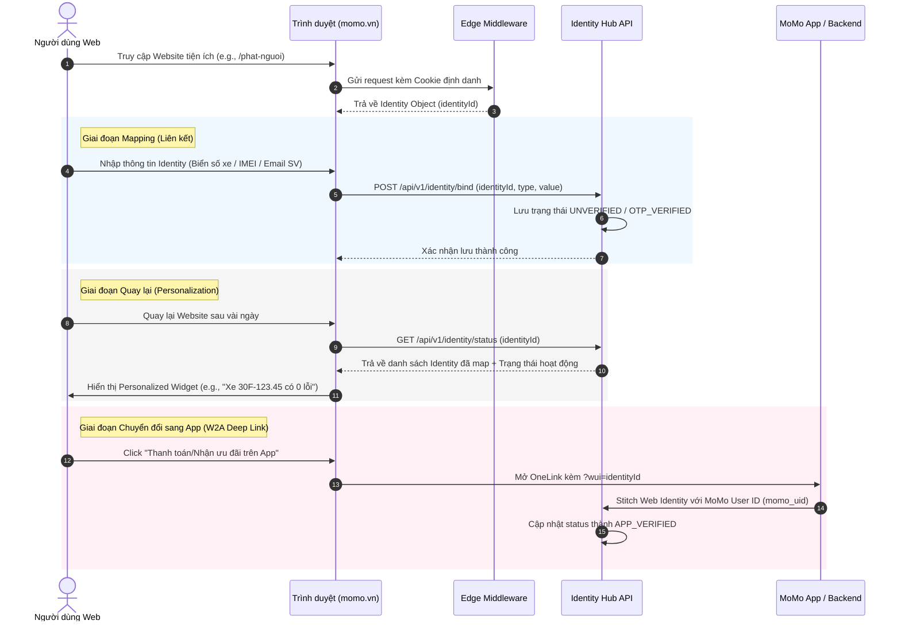

# PRODUCT REQUIREMENT DOCUMENT (PRD) - WEB PLATFORM

*Tài liệu Đặc tả Yêu cầu Sản phẩm cho Hệ thống Quản lý & Liên kết Định danh Người dùng trên Website (Web Identity Hub & Mapping System)*

## 📋 THÔNG TIN CHUNG (Metadata)
> *   **Tên dự án / Sản phẩm (PRODUCT NAME):** Web Identity Hub & Mapping System
> *   **Đầu mối Cell Team (PO & Tech Lead):** Growth Platform Division (GPD)
> *   **Web Product Lead (Duyệt dự án):** Hien.ho
> *   **Trạng thái tài liệu (Document status):** DRAFT
> *   **Tiến độ dự kiến:** Q3/2026 (Kick-off) -> Q3/2026 (Pilot) -> Q4/2026 (Go-Live)
> *   **Loại yêu cầu:** [x] Tính năng mới | [ ] Cải tiến/Thay đổi cấu trúc

---

## I. TÀI LIỆU LIÊN QUAN (References)
*   **Kiến trúc định danh cơ sở (MoSpark):** [mospark_user_identity_tracking.md](file:///Users/hienhv/HienHv/Klaus/Hienho_MoMo-Base/04_MOSPARK_PLATFORM/mospark_user_identity_tracking.md)
*   **Tài liệu nghiệp vụ Vehicle Hub:** [vehicle-hub-brd.md](file:///Users/hienhv/HienHv/Klaus/Hienho_MoMo-Base/05_HUBS/vehicle-hub-brd.md) | [vehicle-hub-prd.md](file:///Users/hienhv/HienHv/Klaus/Hienho_MoMo-Base/09_PRD/vehicle-hub-prd.md)
*   **Tài liệu nghiệp vụ Soundbox:** [soundbox-brd.md](file:///Users/hienhv/HienHv/Klaus/Hienho_MoMo-Base/06_USE_CASE_MOMO/soundbox-brd.md)
*   **Tài liệu định hướng U18 & Student Pass:** [user-growth-u18-brd.md](file:///Users/hienhv/HienHv/Klaus/Hienho_MoMo-Base/06_USE_CASE_MOMO/user-growth-u18-brd.md)

---

## II. BỐI CẢNH & MỤC TIÊU (Why & What)

### 1. Bối cảnh & Vấn đề (Context & Pain points)
Website `momo.vn` sở hữu lượng truy cập tự nhiên (Organic Traffic) khổng lồ từ các dịch vụ tiện ích như tra cứu phạt nguội (Vehicle Hub), tìm hiểu thông tin Loa thông báo chuyển khoản (Soundbox), hay săn mã giảm giá đặc quyền sinh viên (Student Pass). Tuy nhiên, hầu hết người dùng truy cập web đều ở trạng thái **ẩn danh (Anonymous)**. Họ thực hiện các thao tác tra cứu độc lập, sau đó rời đi mà không để lại liên kết định danh nào.

**Các vấn đề chính:**
*   **Thiếu tính cá nhân hóa & Gắn kết (No Stickiness):** Mỗi lần người dùng vào web tra cứu phạt nguội, họ phải gõ lại biển số từ đầu. Merchant muốn xem tình trạng Soundbox phải đăng nhập App nặng nề, sinh viên muốn lấy code đặc quyền phải lặp lại các bước xác thực phức tạp.
*   **Đứt gãy phễu chuyển đổi Web-to-App (W2A):** Người dùng nhập biển số ô tô trên Web, nhưng khi bấm nút "Nộp phạt qua MoMo" để mở App, dữ liệu biển số không được mang theo hoặc không khớp với tài khoản MoMo, bắt buộc người dùng nhập lại từ đầu trong App.
*   **Bỏ lỡ cơ hội tiếp cận chủ động (Proactive Engagement):** MoMo không thể chủ động gửi thông tin cập nhật (như có lỗi phạt nguội mới, loa bị ngắt kết nối, mã sinh viên hết hạn) trực tiếp lên trình duyệt hoặc kích hoạt thông báo ứng dụng do thiếu cơ chế mapping định danh web.

### 2. Mục tiêu dự án & Chỉ số đo lường (KPIs)
Xây dựng **Web Identity Hub** nhằm liên kết mã định danh trình duyệt Web (`identityId` của MoSpark) với các thực thể định danh sản phẩm/dịch vụ cụ thể (Biển số xe, IMEI thiết bị, Mã số sinh viên/Email sinh viên). Từ đó, xác thực người dùng trên Web, cá nhân hóa trải nghiệm hiển thị và thúc đẩy chuyển đổi sang App.

> **North Star Metric: Identity Binding Rate (IBR)**
> Tỷ lệ phiên truy cập Web (Sessions) duy nhất thực hiện liên kết thành công ít nhất một Identity (Biển số xe, IMEI Soundbox, hoặc Email sinh viên).

<table style="width:100%; border-collapse:collapse; border:1.5px solid #64748b; margin:1em 0; font-size:0.9em;">
  <thead>
    <tr style="background-color:#f1f5f9;">
      <th style="border:1.5px solid #64748b; padding:8px 12px; text-align:left; font-weight:700;">Chỉ số (KPI)</th>
      <th style="border:1.5px solid #64748b; padding:8px 12px; text-align:left; font-weight:700;">Hiện tại (Baseline)</th>
      <th style="border:1.5px solid #64748b; padding:8px 12px; text-align:left; font-weight:700;">Mục tiêu (Target)</th>
      <th style="border:1.5px solid #64748b; padding:8px 12px; text-align:left; font-weight:700;">Thời gian đo</th>
    </tr>
  </thead>
  <tbody>
    <tr>
      <td style="border:1px solid #94a3b8; padding:8px 12px; text-align:left;"><strong>Identity Binding Rate (IBR)</strong></td>
      <td style="border:1px solid #94a3b8; padding:8px 12px; text-align:left;">0%</td>
      <td style="border:1px solid #94a3b8; padding:8px 12px; text-align:left;">>= 15% tổng lượng traffic tiện ích</td>
      <td style="border:1px solid #94a3b8; padding:8px 12px; text-align:left;">Q4/2026</td>
    </tr>
    <tr style="background-color:#f8fafc;">
      <td style="border:1px solid #94a3b8; padding:8px 12px; text-align:left;"><strong>Web-to-App Conversion Rate (W2A CR)</strong></td>
      <td style="border:1px solid #94a3b8; padding:8px 12px; text-align:left;">~1.5%</td>
      <td style="border:1px solid #94a3b8; padding:8px 12px; text-align:left;">>= 5.5% (đối với nhóm đã map Identity)</td>
      <td style="border:1px solid #94a3b8; padding:8px 12px; text-align:left;">Q4/2026</td>
    </tr>
    <tr>
      <td style="border:1px solid #94a3b8; padding:8px 12px; text-align:left;"><strong>Tỷ lệ giữ chân người dùng Web (7-day Retention)</strong></td>
      <td style="border:1px solid #94a3b8; padding:8px 12px; text-align:left;">~5%</td>
      <td style="border:1px solid #94a3b8; padding:8px 12px; text-align:left;">>= 20% (nhờ Personalized Widgets)</td>
      <td style="border:1px solid #94a3b8; padding:8px 12px; text-align:left;">Q4/2026</td>
    </tr>
  </tbody>
</table>

---

## III. TRẢI NGHIỆM NGƯỜI DÙNG & TÍNH NĂNG (User Experience & Features)

### 1. Khách hàng mục tiêu & Nhu cầu (Target Personas & Intent)

*   **Persona 1: Anh Quốc (Chủ xe ô tô cá nhân - Tiện ích Giao thông)**
    *   *Intent:* Tìm kiếm "tra cứu phạt nguội", "kiểm tra lỗi giao thông".
    *   *Nhu cầu:* Muốn lưu biển số xe trên trình duyệt điện thoại/máy tính để mỗi lần vào `momo.vn/phat-nguoi` là thấy ngay kết quả phạt nguội mới nhất mà không cần gõ lại.
*   **Persona 2: Chị Mai (Tiểu thương bán hàng offline - Người dùng Soundbox)**
    *   *Intent:* Tìm kiếm "kiểm tra kết nối loa momo", "hướng dẫn sửa loa momo".
    *   *Nhu cầu:* Muốn truy cập nhanh web để kiểm tra trạng thái Loa Soundbox của mình (Online/Offline, cường độ sóng Wifi, giao dịch gần nhất) mà không cần mở App MoMo Merchant khi đang bận tay bán hàng.
*   **Persona 3: Bạn Nam (Sinh viên Đại học Bách Khoa - Người dùng Student Pass)**
    *   *Intent:* Tìm kiếm "mã giảm giá cg v sinh viên momo", "ưu đãi spotify sinh viên".
    *   *Nhu cầu:* Muốn xác thực thẻ sinh viên/email trường một lần duy nhất trên web để mở khóa kho ưu đãi, nhận mã giảm giá hiển thị ngay trên trình duyệt và tự động đồng bộ đặc quyền khi mở MoMo App.

### 2. Luồng trải nghiệm & Đặc tả tính năng cốt lõi



### 3. Chi tiết các Widget tiện ích & Luồng chuyển đổi

<table style="width:100%; border-collapse:collapse; border:1.5px solid #64748b; margin:1em 0; font-size:0.9em;">
  <thead>
    <tr style="background-color:#f1f5f9;">
      <th style="border:1.5px solid #64748b; padding:8px 12px; text-align:left; font-weight:700;">Sản phẩm / Use Case</th>
      <th style="border:1.5px solid #64748b; padding:8px 12px; text-align:left; font-weight:700;">Phương thức ánh xạ (Mapping Input)</th>
      <th style="border:1.5px solid #64748b; padding:8px 12px; text-align:left; font-weight:700;">Trải nghiệm Cá nhân hóa trên Web (Returning User)</th>
      <th style="border:1.5px solid #64748b; padding:8px 12px; text-align:left; font-weight:700;">Luồng chuyển đổi sang App (W2A & Deep Link)</th>
    </tr>
  </thead>
  <tbody>
    <tr>
      <td style="border:1px solid #94a3b8; padding:8px 12px; text-align:left;"><strong>Vehicle Hub</strong></td>
      <td style="border:1px solid #94a3b8; padding:8px 12px; text-align:left;">Biển số xe (License Plate)<br><em>(Ví dụ: 30F-123.45)</em></td>
      <td style="border:1px solid #94a3b8; padding:8px 12px; text-align:left;"><em> <strong>Widget Tra cứu tự động:</strong> Tự động chạy ngầm API tra cứu phạt nguội trên Web load. Hiển thị: </em>"Xe của bạn (30F-123.45) có 0 lỗi vi phạm mới"<em>. <br> </em> <strong>Cảnh báo đăng kiểm:</strong> Hiển thị thời hạn đăng kiểm dự kiến.</td>
      <td style="border:1px solid #94a3b8; padding:8px 12px; text-align:left;">Nút <strong>"Nộp phạt ngay"</strong> hoặc <strong>"Đăng ký thông báo tự động"</strong> -> Deeplink chứa thông tin biển số xe được mã hóa: <code style="background:#f1f5f9;padding:2px 4px;border-radius:4px;font-family:monospace;">momo://app/vehicle-hub?plate=30F12345&wui=<identityId></code></td>
    </tr>
    <tr style="background-color:#f8fafc;">
      <td style="border:1px solid #94a3b8; padding:8px 12px; text-align:left;"><strong>Soundbox</strong></td>
      <td style="border:1px solid #94a3b8; padding:8px 12px; text-align:left;">IMEI của thiết bị (15 chữ số)<br><em>(Ví dụ: 868722051234567)</em></td>
      <td style="border:1px solid #94a3b8; padding:8px 12px; text-align:left;"><em> <strong>Widget Giám sát Loa:</strong> Hiển thị trạng thái kết nối trực quan (Online/Offline/Mất sóng), dung lượng pin, âm lượng loa hiện tại.<br></em> <strong>Nhật ký giao dịch:</strong> Hiển thị 3 giao dịch nhận tiền gần nhất qua loa.</td>
      <td style="border:1px solid #94a3b8; padding:8px 12px; text-align:left;">Nút <strong>"Cấu hình Wifi / Âm lượng"</strong> hoặc <strong>"Báo lỗi kỹ thuật"</strong> -> Deeplink mở trang quản lý thiết bị trên MoMo Merchant: <code style="background:#f1f5f9;padding:2px 4px;border-radius:4px;font-family:monospace;">momo://app/merchant/soundbox?imei=<imei>&wui=<identityId></code></td>
    </tr>
    <tr>
      <td style="border:1px solid #94a3b8; padding:8px 12px; text-align:left;"><strong>Student Pass</strong></td>
      <td style="border:1px solid #94a3b8; padding:8px 12px; text-align:left;">Email sinh viên đuôi <code style="background:#f1f5f9;padding:2px 4px;border-radius:4px;font-family:monospace;">.edu.vn</code> hoặc Mã số sinh viên (MSSV)</td>
      <td style="border:1px solid #94a3b8; padding:8px 12px; text-align:left;"><em> <strong>Dashboard Ưu đãi:</strong> Mở khóa toàn bộ kho mã giảm giá (Spotify, CGV, Grab) trực tiếp trên Web.<br></em> <strong>Trạng thái:</strong> Hiển thị <em>"Đặc quyền sinh viên: Đã xác thực (Hiệu lực đến 31/12/2026)"</em>.</td>
      <td style="border:1px solid #94a3b8; padding:8px 12px; text-align:left;">Nút <strong>"Lấy mã giảm giá trên MoMo"</strong> -> Deeplink mở màn hình Student Pass in-app để tự động liên kết học sinh/sinh viên: <code style="background:#f1f5f9;padding:2px 4px;border-radius:4px;font-family:monospace;">momo://app/student-pass?verify_token=<token>&wui=<identityId></code></td>
    </tr>
  </tbody>
</table>

---

## IV. TÍCH HỢP KỸ THUẬT & DỮ LIỆU (Technical & Architecture)

### 1. Database Schema (Bảng lưu trữ ánh xạ định danh)
Để quản lý việc liên kết, cơ sở dữ liệu lưu trữ tại Backend Web Platform cần quản lý thực thể **Web Identity Mappings**:

```sql
CREATE TABLE web_identity_mappings (
    id VARCHAR(64) PRIMARY KEY,          -- UUID của bản ghi mapping
    identity_id VARCHAR(64) NOT NULL,   -- identityId từ cookie của MoSpark Edge
    identity_type VARCHAR(32) NOT NULL, -- VEHICLE_PLATE, SOUNDBOX_IMEI, STUDENT_EMAIL, STUDENT_ID
    identity_value VARCHAR(256) NOT NULL,-- Giá trị định danh được mã hóa (AES-256)
    identity_display VARCHAR(64) NOT NULL,-- Giá trị hiển thị đã được mask (Ví dụ: 30F-123.xx, 8687******456)
    verification_status VARCHAR(32) NOT NULL, -- UNVERIFIED, OTP_VERIFIED, APP_VERIFIED
    momo_uid VARCHAR(64),               -- MoMo User ID (cập nhật khi người dùng login hoặc qua W2A Stitching)
    metadata JSON,                      -- Dữ liệu bổ sung (Brand xe, mã trường Đại học, Tên thiết bị...)
    created_at TIMESTAMP DEFAULT CURRENT_TIMESTAMP,
    updated_at TIMESTAMP DEFAULT CURRENT_TIMESTAMP ON UPDATE CURRENT_TIMESTAMP,
    last_used_at TIMESTAMP,
    INDEX idx_identity_id (identity_id),
    INDEX idx_momo_uid (momo_uid)
);
```

### 2. Quy trình xác thực và đồng bộ dữ liệu (Data Stitching Flow)
1.  **Anonymous Mapping:** Khi người dùng nhập biển số trên Web, lưu vào DB với `verification_status = 'UNVERIFIED'`.
2.  **Web OTP Verification (Dành cho Student Pass):** Hệ thống gửi mã OTP về email sinh viên. Sau khi verify thành công trên Web, chuyển trạng thái sang `'OTP_VERIFIED'`.
3.  **App Handshake (Stitching):** Khi người dùng click CTA chuyển sang App MoMo qua OneLink chứa `?wui=<identityId>`, App MoMo (đã login tài khoản chính thức `momo_uid`) sẽ gọi API đồng bộ lên Server:
    *   Server tìm các bản ghi có `identity_id = wui`.
    *   Cập nhật `momo_uid` tương ứng vào bảng mapping.
    *   Chuyển trạng thái `verification_status` từ `UNVERIFIED`/`OTP_VERIFIED` sang `APP_VERIFIED` (bảo mật tuyệt đối, xác nhận chính chủ sở hữu tài khoản MoMo đang dùng biển số/thiết bị này).

### 3. Phương án xử lý lỗi & Fallback Logic (Error-handling)
*   **Trường hợp Edge Middleware lỗi / Cookie bị chặn:** Hệ thống tự động chuyển sang chế độ Anonymous Session lưu trên `SessionStorage` / `LocalStorage`. Trải nghiệm cá nhân hóa vẫn được duy trì trong phiên làm việc hiện tại của trình duyệt.
*   **API mapping phản hồi chậm (>2 giây):** Tự động bỏ qua hiển thị Personalized Widget, render giao diện mặc định (chưa định danh) để tránh gây nghẽn màn hình tải trang của người dùng.
*   **Rủi ro lộ thông tin cá nhân:** 100% dữ liệu hiển thị trên Web (License plate, IMEI, Email) bắt buộc phải qua hàm mask thông tin ở tầng Backend trước khi trả về Client. Không bao giờ lưu raw data ở phía Client Side (LocalStorage/Cookies).

---

## V. CƠ CHẾ TẠO STICKINESS & RETENTION (Growth Mechanics)

Để tạo sự gắn kết liên tục giữa Web và User, hệ thống áp dụng 3 cơ chế:

### 1. Bộ widget cá nhân hóa động (Dynamic Personalized Widgets)
Thay thế hoàn toàn các banner tĩnh. Khi người dùng có Identity đã map truy cập trang chủ `momo.vn`, hệ thống tự động render widget tiện ích tương ứng ở khu vực nổi bật:

```
+---------------------------------------------------------+
<table style="width:100%; border-collapse:collapse; border:1.5px solid #64748b; margin:1em 0; font-size:0.9em;">
  <thead>
    <tr style="background-color:#f1f5f9;">
      <th style="border:1.5px solid #64748b; padding:8px 12px; text-align:left; font-weight:700;">Xin chào! Rất vui được gặp lại bạn.</th>
    </tr>
  </thead>
  <tbody>
    <tr>
      <td style="border:1px solid #94a3b8; padding:8px 12px; text-align:left;">[🚘 Xe ô tô của bạn]</td>
    </tr>
    <tr style="background-color:#f8fafc;">
      <td style="border:1px solid #94a3b8; padding:8px 12px; text-align:left;">Biển số: 30F-123.<em></em></td>
      <td style="border:1px solid #94a3b8; padding:8px 12px; text-align:left;">Trạng thái: 0 lỗi phạt nguội mới</td>
    </tr>
    <tr>
      <td style="border:1px solid #94a3b8; padding:8px 12px; text-align:left;">[Nạp tiền ePass nhanh]    [Kiểm tra chi tiết lỗi]</td>
    </tr>
  </tbody>
</table>
+---------------------------------------------------------+
```

### 2. Thông báo đẩy trình duyệt (Web Push Notifications)
Khi người dùng thực hiện liên kết định danh thành công, hiển thị prompt gợi ý đăng ký nhận thông báo trình duyệt:
*   *Tần suất:* Tối đa 1 lần/ngày đối với cập nhật quan trọng.
*   *Kịch bản gửi:*
    *   Hệ thống quét phạt nguội định kỳ phát hiện lỗi mới của biển số đã map -> Gửi thông báo đẩy Click-to-Web.
    *   Hệ thống giám sát Soundbox ghi nhận loa mất kết nối > 15 phút -> Gửi thông báo đẩy cho Merchant.

### 3. Vòng lặp kích hoạt ưu đãi chéo (Cross-benefit Loop)
*   *Student Pass:* Sinh viên đã xác thực email trên Web khi mua vé CGV trên Web MoMo sẽ được tự động kích hoạt mã giảm giá sinh viên mà không cần nhập code thủ công.
*   *Vehicle Hub:* Chủ xe ô tô đã lưu biển số trên Web sẽ nhận được tin nhắn gợi ý mua Bảo hiểm TNDS bắt buộc kèm Voucher giảm giá xăng độc quyền trên MoMo.

---

## VI. AN TOÀN BẢO MẬT & VẬN HÀNH (Security & Operations)

### 1. Phân quyền và Bảo mật dữ liệu

<table style="width:100%; border-collapse:collapse; border:1.5px solid #64748b; margin:1em 0; font-size:0.9em;">
  <thead>
    <tr style="background-color:#f1f5f9;">
      <th style="border:1.5px solid #64748b; padding:8px 12px; text-align:left; font-weight:700;">Identity Type</th>
      <th style="border:1.5px solid #64748b; padding:8px 12px; text-align:left; font-weight:700;">Rủi ro Bảo mật</th>
      <th style="border:1.5px solid #64748b; padding:8px 12px; text-align:left; font-weight:700;">Giải pháp giảm thiểu (Mitigation)</th>
    </tr>
  </thead>
  <tbody>
    <tr>
      <td style="border:1px solid #94a3b8; padding:8px 12px; text-align:left;"><strong>Vehicle Plate</strong></td>
      <td style="border:1px solid #94a3b8; padding:8px 12px; text-align:left;">Lộ lịch trình di chuyển, thông tin phạt nguội của xe người khác.</td>
      <td style="border:1px solid #94a3b8; padding:8px 12px; text-align:left;"><em> Ẩn thông tin nhạy cảm (Tên chủ xe, địa chỉ lỗi vi phạm cụ thể chỉ hiển thị dạng mask trên Web).<br></em> Chỉ cho phép xem đầy đủ biên bản vi phạm hình ảnh khi chuyển sang App MoMo đã xác thực KYC chính chủ.</td>
    </tr>
    <tr style="background-color:#f8fafc;">
      <td style="border:1px solid #94a3b8; padding:8px 12px; text-align:left;"><strong>Soundbox IMEI</strong></td>
      <td style="border:1px solid #94a3b8; padding:8px 12px; text-align:left;">Lộ doanh thu, số tiền giao dịch của cửa hàng.</td>
      <td style="border:1px solid #94a3b8; padding:8px 12px; text-align:left;">* Bắt buộc phải quét QR Code đăng nhập MoMo Merchant để xác thực quyền sở hữu IMEI trước khi hiển thị chi tiết số dư hoặc giao dịch gần nhất trên Web.</td>
    </tr>
    <tr>
      <td style="border:1px solid #94a3b8; padding:8px 12px; text-align:left;"><strong>Student Pass</strong></td>
      <td style="border:1px solid #94a3b8; padding:8px 12px; text-align:left;">Giả mạo sinh viên để trục lợi khuyến mãi thương mại.</td>
      <td style="border:1px solid #94a3b8; padding:8px 12px; text-align:left;">* Xác thực mã OTP bắt buộc gửi đến email có đuôi định dạng <code style="background:#f1f5f9;padding:2px 4px;border-radius:4px;font-family:monospace;">.edu.vn</code>. Mỗi email chỉ được liên kết với tối đa 1 tài khoản MoMo.</td>
    </tr>
  </tbody>
</table>

### 2. Quản lý Tần suất truy vấn (Rate Limiting)
*   Áp dụng rate-limit nghiêm ngặt tại Edge API:
    *   Tối đa **5 lượt tra cứu biển số xe/IP/phút** để chống cào dữ liệu (scraping).
    *   Tối đa **3 lần gửi OTP email sinh viên/email/10 phút** để tránh spam OTP.
    *   Tối đa **3 lần nhập sai IMEI Soundbox/session/giờ**.

---

## LỊCH SỬ THAY ĐỔI (Changelog)

<table style="width:100%; border-collapse:collapse; border:1.5px solid #64748b; margin:1em 0; font-size:0.9em;">
  <thead>
    <tr style="background-color:#f1f5f9;">
      <th style="border:1.5px solid #64748b; padding:8px 12px; text-align:left; font-weight:700;">Phiên bản</th>
      <th style="border:1.5px solid #64748b; padding:8px 12px; text-align:left; font-weight:700;">Ngày cập nhật</th>
      <th style="border:1.5px solid #64748b; padding:8px 12px; text-align:left; font-weight:700;">Người thực hiện</th>
      <th style="border:1.5px solid #64748b; padding:8px 12px; text-align:left; font-weight:700;">Nội dung thay đổi</th>
    </tr>
  </thead>
  <tbody>
    <tr>
      <td style="border:1px solid #94a3b8; padding:8px 12px; text-align:left;">1.0</td>
      <td style="border:1px solid #94a3b8; padding:8px 12px; text-align:left;">2026-07-20</td>
      <td style="border:1px solid #94a3b8; padding:8px 12px; text-align:left;">Web Product Agent</td>
      <td style="border:1px solid #94a3b8; padding:8px 12px; text-align:left;">Khởi tạo tài liệu đặc tả hệ thống Web Identity Hub & Mapping (Giai đoạn Q3/2026).</td>
    </tr>
  </tbody>
</table>
