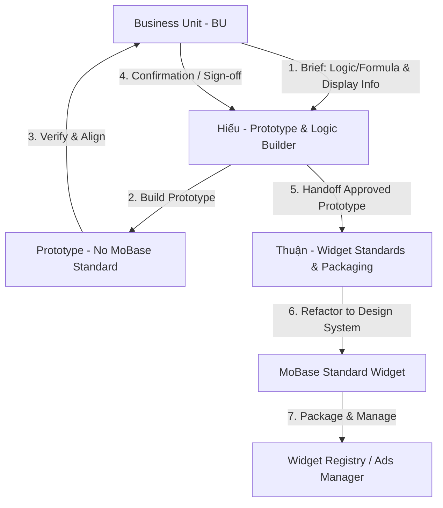

# PRD: MoSpark Widget Store Platform

> - **Document Version:** 1.9 (Dual Ingestion Workflows)
> - **Product Manager:** Hiến (Project Manager)
> - **Prototype & Logic Builder:** Hiếu
> - **Widget Standards & Packaging:** Thuận
> - **Target Release:** Q3/2026 (Phase 1)
> - **Status:** PRD Approved for Development

---

## 1. Product Overview & Core Definition (Tổng quan & Định nghĩa lõi)

### 1.1 Vấn đề (Problem Statement)
Các Business Unit (BU) cần các công cụ tương tác động (máy tính lãi suất, giả lập đầu tư, form khảo sát) trên Web để giữ chân khách hàng và tạo chuyển đổi Web-to-App (W2A). Hiện tại, mỗi công cụ phải được lập trình (hardcode) riêng lẻ, tốn nhiều tuần phát triển, không thể tái sử dụng, và rời rạc về mặt kiến trúc dữ liệu.

### 1.2 Giải pháp & Định nghĩa Widget (Product Vision & Widget Definition)
Tầm nhìn sản phẩm là xây dựng **Widget Store Platform** — một **Nền tảng Tương tác Tăng trưởng (PLG Growth Platform) hợp nhất**. Nền tảng này đóng vai trò hạ tầng lõi giúp xây dựng, chuẩn hóa, quản lý và phân phối các Utility Tools (Simulator, Component, Lookup) có tính tương tác cao cho toàn bộ Web Channel của MoMo, trực tiếp thúc đẩy các chỉ số **MEU (Monthly Earning Users)** và **Login App (DLU/MLU)** theo định hướng **Product-Led Growth (PLG)**.

Để giúp các Stakeholders hiểu rõ định hướng, Product Vision của Nền tảng được chia nhỏ (break down) cụ thể như sau:

#### 👥 Giá trị đạt được theo Stakeholders (Value Proposition & Outcomes)
*   **Với Business Units & Cell Teams (BUs):**
    *   **Tự chủ & Tốc độ (Go-to-market in 5 mins):** Chọn, cấu hình tham số JSON Schema và deploy Widget lên Landing Page/Blog trong 5 phút qua CMS, hoàn toàn không phụ thuộc lực lượng FE Developer của từng team hay chu kỳ Sprint phát triển UI.
    *   **Đo lường & Tối ưu dễ dàng:** Tự do cấu hình kịch bản **Smart CTA Rules** và thực hiện **A/B Testing** thông điệp CTA để tối ưu tỷ lệ chuyển đổi.
*   **Với End-Users (Người dùng cuối):**
    *   **Giải quyết JTBD tức thời:** Tra cứu thuế, tính lãi tiết kiệm, xem giá vàng... trực tiếp trên Web trong 2 giây mà không cần login hay tải app, nhận giá trị tức thì (*Aha! Moment*).
    *   **Trải nghiệm chuyển đổi mượt mà (W2A Contextual Onboarding):** Khi bấm CTA vào App MoMo, toàn bộ dữ liệu đã nhập trên Web sẽ tự động điền sẵn (prefill), loại bỏ rào cản nhập liệu lặp lại.
*   **Với MoSpark (Sở hữu nền tảng):**
    *   **Tăng trưởng Organic Traffic (SEO/GEO):** Các widget hữu ích là thỏi nam châm thu hút lưu lượng truy cập chất lượng cao từ Google SERP / AI Search, xây dựng hào bảo vệ nội dung (Anti-LLM Moat).
    *   **Tối ưu W2A & Thúc đẩy Login:** Chuyển đổi traffic ẩn danh trên Web thành người dùng đăng nhập app có phát sinh giao dịch tài chính (MEU) thông qua cơ chế tracking parameter và Smart CTA cá nhân hóa theo hành vi nhập liệu.

#### 🛠️ Việc cần làm / Các trụ cột thực thi của Platform (Key Platform Pillars - What to do)
1.  **Ingestion & Refactoring Pipeline (Quy trình Tiếp nhận & Chuẩn hóa):** Hỗ trợ song song 2 quy trình tiếp nhận (workflows) linh hoạt từ các Cell Teams/BUs:
    *   *Workflow A (Brief to Prototype - Hiếu phụ trách):* Web Platform tiếp nhận Brief nghiệp vụ (Logic/Công thức tính toán & Thông tin hiển thị) $\rightarrow$ Hiếu chịu trách nhiệm triển khai xây dựng bản prototype thô để xác thực (verify) logic với BU.
    *   *Workflow B (HTML Ingestion to Standard - Thuận phụ trách):* Web Platform tiếp nhận Brief dưới dạng bản HTML Prototype thô do các Cell Teams tự phát triển trước $\rightarrow$ Thuận chịu trách nhiệm refactor theo đúng chuẩn Design System (MoBase) và UI/UX Flow để đóng gói đưa vào Registry.
2.  **Registry & Rendering Engine (Next.js):** Xây dựng hạ tầng Registry dùng chung để lưu trữ và kết xuất (render) động các Component React tĩnh dựa trên cấu hình JSON Schema từ CMS Editor.
3.  **Smart CTA & Zero-Party Data Engine:** Thiết kế Rule Engine tự động điều hướng nút CTA theo hành vi nhập liệu của user và cơ chế mã hóa Base64 truyền dữ liệu an toàn qua URL parameter của Onelink.
4.  **API Governance Gateway:** Thiết kế cổng API Gateway kết nối realtime dữ liệu in-app (vàng, tỷ giá) có tích hợp Redis Cache 15-30 phút và cơ chế khóa cứng công thức (Formula Lock) để kiểm duyệt pháp lý/tài chính YMYL tập trung.
5.  **Microsite-to-Widget Auto-Mapping:** Thiết lập cơ chế tự động gán Widget 1-1 với Microsite tương ứng (ví dụ: CIC Simulator gán với `/diem-tin-dung`). Bất kỳ trang con nào thuộc Microsite đó sẽ tự động thừa kế và hiển thị Widget tại đúng vị trí quy chuẩn (ví dụ: Slot 2) mà không cần drag-and-drop thủ công, đồng thời khóa hiển thị ở ngoài Microsite để đảm bảo kiểm soát tập trung (chỉ phân phối ra ngoài qua Ads Manager).

> [!NOTE]
> **Quy trình S-P-A (Strategy - Pilot - Action):** Đây là quy trình phối hợp thực thi thực tế mà các Cell Teams sẽ áp dụng khi bắt đầu lên chiến dịch, xây dựng Widget và phân phối nội dung trên Platform.

#### 📌 Định nghĩa Widget trong Hệ thống:
**Widget (Tiện ích Tương tác Tăng trưởng)** là một thành phần tương tác hoàn chỉnh, khép kín về mặt giao diện (UI), logic nghiệp vụ (Logic) và dữ liệu (Data) chạy trực tiếp trên trình duyệt Web.
*   **Mục tiêu PLG**: Giải quyết trực tiếp một nhu cầu tra cứu/giả lập cụ thể của người dùng trên Web để cung cấp giá trị tức thì (*Aha! Moment*), thu hút lưu lượng tự nhiên (SEO/GEO) và chuyển đổi/kích thích Login App (Web-to-App) thông qua cơ chế truyền tham số ngữ cảnh (Context-Passing) và Smart CTA.
*   **Nguyên tắc "3 Không & 3 Có"**:
    *   **3 Không**:
        *   **Không** phải là một UI component đơn lẻ (như Button, Slider) mà là tổ hợp tương tác hoàn chỉnh.
        *   **Không** cho phép BUs tùy biến giao diện tự do (để bảo vệ tính nhất quán của Design System).
        *   **Không** cho phép BUs tự cấu hình công thức tính toán nghiệp vụ (để bảo vệ tính tuân thủ pháp lý/tài chính YMYL).
    *   **3 Có**:
        *   **Có** logic tự tính toán độc lập (Offline calculation hoặc Online API fetching).
        *   **Có** cơ chế truyền/nhận dữ liệu qua URL parameters (`?prefill=`).
        *   **Có** cơ chế tự động chuyển đổi nút hành động theo ngữ cảnh dữ liệu nhập vào (Smart CTA).

### 1.3 Success Metrics (KPIs)
*Dự án hiện chưa chốt con số KPI cụ thể cho các vi chỉ số tương tác. Web Platform thống nhất hướng đến các chỉ số tăng trưởng (Growth) lõi của MoMo:*
*   **MEU (Monthly Earning Users):** Tăng trưởng số lượng người dùng có phát sinh thu nhập/giao dịch tài chính thông qua Web-to-App.
*   **MAU (Monthly Active Users):** Đóng góp vào tổng lượng người dùng hoạt động hàng tháng của MoMo.
*   **New Users:** Thu hút người dùng mới cài đặt App thông qua các tiện ích SEO/GEO có giá trị cao.

---

## 2. User Roles & JTBD Matrix (Vai trò người dùng & Ma trận JTBD)

### 2.1 End-User (Người dùng cuối)
*   **Persona:** Dân văn phòng, GenZ có nhu cầu tra cứu nhanh thông tin tài chính/đời sống trên Google.
*   **US1 (Discovery - Active Lookup):** Là người dùng, tôi muốn sử dụng công cụ tính toán ngay trên trình duyệt di động mà không cần tải App từ đầu, để tôi có thể xem kết quả nhanh chóng.
*   **US2 (Contextual Onboarding):** Là người dùng, khi tôi tính toán số tiền tiết kiệm 50 triệu và click mở MoMo, tôi muốn App tự động gợi ý gói tiết kiệm 50 triệu tương ứng thay vì bắt tôi nhập lại từ đầu.

### 2.2 System Admin / PM (Người vận hành MoSpark)
*   **Persona:** Product Manager, Marketing Team của các BUs.
*   **US3 (Rapid Deployment & Setup):** Là PM/PO của BU, tôi muốn nhanh chóng chọn một Widget có sẵn (ví dụ: công cụ tính thuế) từ thư viện, cấu hình các tham số truyền cảnh (prefill) và liên kết điều hướng CTA thích hợp để nhúng vào bài viết/Landing Page thông qua CMS mà không cần nhờ Dev phát triển lại UI hay logic tính toán.
*   **US4 (A/B Testing):** Là PM, tôi muốn cấu hình thay đổi nút CTA (Call-to-Action) của Widget theo từng chiến dịch để test tỷ lệ chuyển đổi.

---

## 3. Layout Standards (Bố cục 6 Slots chuẩn hóa)

Mỗi trang Landing Page chứa Widget phải tuân thủ bố cục cấu trúc chuẩn hóa gồm 6 Slots dưới đây để đảm bảo trải nghiệm người dùng tối ưu và chuẩn SEO/GEO:
1.  **Header (Slot 1):** Tiêu đề H1, mô tả ngắn gọn, Rating Schema (Độ tin cậy từ chuyên gia).
2.  **Input Form (Slot 2):** Khu vực nhập liệu của Widget (Input text, Dropdown, Slider kéo thả) - không cho phép sửa đổi CSS tùy tiện bởi BUs.
3.  **Result Dashboard (Slot 3):** Khu vực trả kết quả của Widget, có biểu đồ trực quan (Pie chart, Bar chart).
4.  **Context (Slot 4):** So sánh đa chiều (Ví dụ: So sánh gửi ngân hàng vs Mua chứng chỉ quỹ).
5.  **Smart CTA (Slot 5):** Banner động chứa Onelink để kích hoạt mở App. Tự động nhận diện Intent của người dùng để trả về CTA tương ứng (Ví dụ: Lương < 15 triệu -> CTA "Ví Trả Sau"; Lương > 40 triệu -> CTA "Mở Thẻ Tín Dụng").
6.  **SEO Hub (Slot 6):** Block FAQ (Schema) và Internal Links liên quan từ các bài viết vệ tinh.

---

## 4. Technical Specifications & Core Capabilities (Thông số kỹ thuật & Năng lực lõi)

### 4.1 Widget Component Registry & Rendering Engine
*   **FR1 - Registry & Render Component:** MoSpark Engine hoạt động như một Registry lưu trữ danh sách các Component Widget tĩnh/động được phát triển bởi Core Team. Hệ thống nhận diện shortcode hoặc block nhúng trong CMS Editor và render đúng Component React tương ứng với các tham số truyền vào từ CMS (như default values, CTA URLs, prefill flags), giữ tính nhất quán về UX/UI và công thức tính toán.

### 4.2 API Integration & Governance Gateway
*   **FR2 - Online Fetching:** Các Widget (Vàng, Tỷ giá, Lãi tiết kiệm, Đầu tư) yêu cầu Backend thiết lập Gateway kết nối với API nội bộ của App MoMo để lấy dữ liệu realtime. Có cơ chế Cache (Redis) 15-30 phút để giảm tải.
*   **FR3 - Offline Calculation:** Các Widget (Thuế, BHXH, Lương hưu, BHSK+) hoạt động bằng công thức toán học nội bộ (Offline). Logic công thức được cấu hình trong các file JSON tĩnh trên server được kiểm duyệt pháp lý và triển khai tập trung bởi Core Growth Team (không cho phép PM/PO của BU tự ý chỉnh sửa công thức tính toán trên CMS để tránh rủi ro pháp lý/tài chính YMYL).

### 4.3 Zero-Party Data Passing
*   Dữ liệu người dùng nhập (Lương, số tiền muốn vay) sẽ được parse thành chuỗi Base64 hoặc JSON.
*   Nối chuỗi này vào URL Parameters của Onelink. Khi App mở, đọc params và điền tự động vào màn hình in-app.

---

## 5. Phase 1 Pilot Specifications (Đặc tả 10 Tiện ích MVP)

1.  **Master Widget (Phân bổ lương):** Hub chính. Nhập tổng thu nhập ➔ Chia ra rổ chi tiêu, tiết kiệm. Tự động truyền tham số (prefill) sang các Widget con.
2.  **Gold Tracker:** Tích hợp API giá vàng Real-time, biểu đồ lịch sử ➔ CTA: Mua vàng.
3.  **Exchange Rate:** Quy đổi ngoại tệ ➔ CTA: Chuyển tiền quốc tế.
4.  **Gross-Net Tax:** Tính lương thực nhận, BHYT, BHXH ➔ CTA: Gửi tiết kiệm / Ví Trả Sau.
5.  **Lãi Tiết Kiệm:** Kéo slider chọn kỳ hạn, tính lãi cuối kỳ ➔ CTA: Mở sổ tiết kiệm MoMo.
6.  **Tính BHXH:** Tính mức đóng và mức hưởng 1 lần ➔ CTA: Tích lũy hưu trí.
7.  **Tính Lương hưu:** Tính tuổi nghỉ hưu, tỷ lệ hưởng ➔ CTA: Đầu tư dài hạn.
8.  **Đầu tư Chứng khoán/CCQ:** Kéo API lịch sử mã cổ phiếu (Ví dụ: FPT), giả lập lãi nếu đầu tư từ 1 năm trước ➔ CTA: Mở tài khoản Vietcap.
9.  **Tính phí BHSK+:** Thanh kéo mức độ nghiêm trọng rủi ro, đối chiếu chi phí phải trả tự túc vs có BHSK ➔ CTA: Mua MoMo Sức Khỏe+.
10. **Financial Quiz:** Trắc nghiệm vuốt (Tinder-style), trả kết quả "Chức danh" (Persona) ➔ CTA: Nhận Voucher (Instant Reward).

---

## 6. Phasing & Release Plan (Lộ trình phát hành)

*   **Phase 1 (MVP - Q3/2026):** Hoàn thiện Widget Engine, Master Widget, và 10 Tiện ích Finhub. Tích hợp Onelink cơ bản.
*   **Phase 2 (Scale - Q4/2026):** Mở rộng tích hợp các Widget mới từ Bảo hiểm, Du lịch & Đi lại (tính giá vé, gợi ý tour) hoặc tiện ích đời sống. Triển khai tính năng Smart CTA.
*   **Phase 3 (Advanced PLG Scaling - 2027):** Phát triển các tính năng PLG nâng cao bao gồm Programmatic pSEO Lookups ở quy mô lớn (tự động tạo hàng ngàn trang tra cứu địa phương hóa), AI Intent-based routing cho Smart CTA, và phát triển B2B Syndication (cung cấp các widget chuẩn để nhúng trên các trang báo chí, đối tác ngoài để kéo traffic ngược về MoMo).

---

## 7. Non-Functional Requirements (Yêu cầu Phi chức năng)

### 7.1 Performance & Speed
*   **Core Web Vitals:** Do Widget nhúng vào Landing Page, thời gian render (LCP) phải < 2.5s. Tốc độ phản hồi khi kéo slider (INP) < 200ms.
*   **Bundle Size:** JS bundle của mỗi Widget không được vượt quá 100KB (Gzipped) để không làm chậm trang đích.

### 7.2 SEO & Semantic
*   Hệ thống bắt buộc tự động render thẻ JSON-LD `SoftwareApplication` và `FinancialProduct` cho trang chứa Widget.
*   Tuân thủ chuẩn Accessibility (ARIA tags cho các Slider/Input) để bot AI có thể cào dữ liệu công cụ.

### 7.3 Legal & Security
*   **Disclaimer:** Mọi kết quả từ Widget (đặc biệt là Thuế, Vay, Đầu tư) phải luôn đi kèm dòng chữ: *"Kết quả mang tính chất tham khảo. MoMo không chịu trách nhiệm pháp lý..."*
*   **Data Privacy:** Zero-Party data truyền qua URL Parameters không được chứa PII (Thông tin định danh cá nhân) dạng plain text, phải hash/encode.

---

## 8. Quy trình Phát triển & Phân công Công việc (Development Workflow)

Quy trình phát triển và hoàn thiện Widget được thống nhất nhằm phân định rõ nhiệm vụ của từng PIC:

*   **Giai đoạn Prototype & Xác thực (Hiếu phụ trách):**
    - Tiếp nhận thông tin Brief từ BU về Logic/Formula, cũng như các thông tin cần hiển thị cho User về các Utilities/Component/Widget/...
    - Xây dựng bản Prototype chạy thử (chưa yêu cầu chuẩn thiết kế MoBase).
    - Xác thực (verify) lại các logic tính toán và hiển thị trực tiếp với BU.
*   **Giai đoạn Refactor & Đóng gói (Thuận phụ trách):**
    - Nhận bản Prototype đã được BU xác nhận từ Hiếu.
    - Refactor lại Prototype theo chuẩn Design System (MoBase).
    - Đưa vào hệ thống quản lý và tiến hành đóng gói (packaging) để sẵn sàng phân phối qua Ads Manager.

---
**[END OF PRD]**
