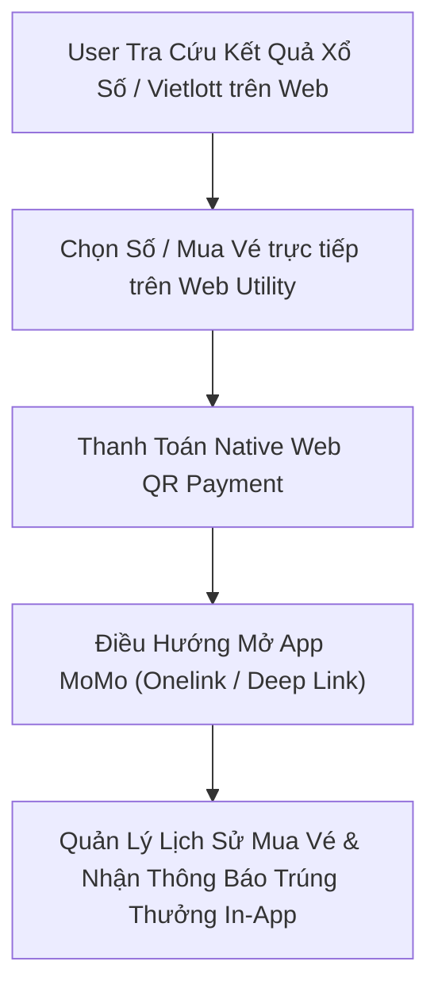
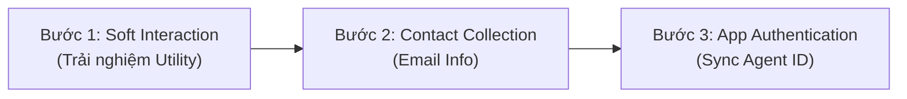

# 📝 NHẬT KÝ BIÊN BẢN HỌP & RECAP CHIẾN LƯỢC (MEETING RECAPS)

Tài liệu này lưu trữ toàn bộ thông tin quan trọng từ các buổi thảo luận, họp chiến lược và định hướng sản phẩm của **Web Platform**.
AI Agent (Antigravity) sẽ **luôn đọc file này** trước khi thực hiện các tác vụ phân tích, lập kế hoạch, viết PRD hoặc chuẩn bị báo cáo.

---

## DANH SÁCH BẢN GHI RECAPS

### Bản ghi ngày 25/08/2026: Chiến Lược Web Platform, Quick Wins TikTok, Định Hướng Cinema Hub, Tiệm Sưu Tầm & Cơ Chế Accountability
> **Thành phần:** Executive Leadership x Web Product Lead x Technical Lead x BU Cinema Lead
> **Mục tiêu:** Thống nhất định vị Branding/Media Value của Web, nhân rộng Quick Wins (Case study Nạp xu TikTok), phương pháp luận đánh giá đối thủ thị trường phân mảnh (Competitor Score 1-2-3), chiến lược chuẩn hóa trang rạp phim Cinema Hub, mô hình Tiệm Sưu Tầm (Rolex/Hermès Model) và Playbook trách nhiệm giải trình (Accountability & Escalation).

#### 1. Định Vị Giá Trị Kênh Web (Indirect Attribution & Media Value)
* **Chấm dứt tư duy Direct Pay hẹp hòi:** Dịch vụ xem phim là nhu cầu tần suất thấp (5-6 tháng/lần), người dùng rất dễ quên. Kênh Web đóng vai trò nhắc nhớ thương hiệu (Brand Priming & Top-of-Mind) cực kỳ lớn.
* **Quy đổi Media Value:** Quy đổi lưu lượng Web sang giá trị truyền thông tương đương (Media Value qua CPM/CPC) để chứng minh giá trị kinh tế khổng lồ của Web mang lại cho BU.

#### 2. Chiến Lược Săn Tìm "Quick Wins" (Nhân Rộng Case Study Nạp Xu TikTok)
* **Lợi thế TikTok:** Chiếm Top 2 Google Search tự nhiên (~45k - 52k PV/tháng) nhờ First Mover Advantage và Brand Intent Search (`nạp xu tiktok momo`).
* **Cơ chế "Giải thảm" chi phí thấp:** 1 nhân sự phụ trách dựng 10-20 trang đích/tháng (1-2 ngày/trang). Với tỷ lệ thành công 10% (1-2 trang đạt 100k PV), toàn sàn có thêm ~300.000 PV tự nhiên (+10% đến +12% tổng traffic).

#### 3. Phương Pháp Luận Chấm Điểm Đối Thủ (Competitor Score 1-2-3)
* **Score 1 (Ngon nhất):** Thị trường phân mảnh (Fragmented), đối thủ yếu, nội dung lôm côm ➔ Web Platform chủ động triển khai ngay (như tra cứu giá vàng, vé số, cẩm nang xe).
* **Score 2 (Trung bình):** Đã có đối thủ nhưng chưa chuẩn chỉnh ➔ Phối hợp BU làm nội dung SEO/GEO chuyên sâu.
* **Score 3 (Khó nhất):** Thị trường bị thống trị bởi ông lớn (Dominated) ➔ Không đối đầu trực diện, chỉ đánh từ khóa ngách dài.

#### 4. Định Hướng Đột Phá Cinema Hub & Tiệm Sưu Tầm
* **Khai thác nhóm Rạp Phim (Dung lượng 4,2 Triệu search/tháng):** Tự động hóa chuẩn hóa trang chi tiết cho từng cụm rạp cụ thể (loại ghế, khoảng cách màn hình, cơ sở vật chất) để tạo Bargaining Power đàm phán với CGV/BHD/Lotte.
* **Quy luật 1-9-90 trong Rating & Review:** Tập trung vinh danh và giữ chân nhóm Top 1% Reviewers xuất sắc để tạo nội dung chất lượng cao.
* **Tiệm Sưu Tầm (Merchandise IP):** Vận hành theo mô hình Sưu tầm giới hạn (Rolex/Hermès Luxury Model), gắn nhiệm vụ in-app (mua 5 vé xem phim) để mở khóa mua hàng, hướng tới **1 triệu MU Engagement / Game hóa**.

#### 5. Quy Chế Phối Hợp & Trách Nhiệm Giải Trình (Accountability Playbook)
* **Nhịp độ:** Họp rà soát 2 tuần/lần, quản trị run-rate giữa tháng.
* **Báo cáo minh bạch:** Báo cáo cuối tháng gửi IVP Leadership nêu rõ phần việc Web Platform làm nhanh/chậm và BU phối hợp ra sao.
* **Cơ chế rút lui chủ động (Offboarding):** Nếu sau 1-2 tháng phối hợp mà BU không tập trung, Web Platform chủ động xin rút tài nguyên chuyển sang hỗ trợ BU khác.

---

### Bản ghi ngày 24/08/2026: Định Hướng Trọng Tâm Thực Thi Cinema Hub & Financial Hub
> **Thành phần:** Executive Leadership x Web Product Lead x MDS-Movies BU x FinHub BU
> **Mục tiêu:** Tập trung đẩy mạnh 2 Web Hubs trọng điểm trong tuần: Kích hoạt tính năng Nhiệm Vụ (Gamification Missions) cho 2 bộ phim chiếu rạp đang đẩy trên Cinema Hub và vận hành bộ Simulator Widget / Chuyên trang CIC trên Financial Hub.

#### 1. Cinema Hub (MDS-Movies x Web Platform)
* **Kế hoạch Roll-out Tuần Này:** Triển khai tính năng **Nhiệm Vụ (Gamification Missions)** trực tiếp trên 2 bộ phim chiếu rạp trọng điểm đang được MoMo và đối tác rạp đẩy mạnh.
* **Mục tiêu Tăng trưởng:** Thúc đẩy lưu lượng truy cập (Traffic & MPV), gia tăng tương tác đọc bài review/xem trailer và nâng cao tỷ lệ nhấp nút đặt vé **Click-to-App CTR (≥ 4.50%)**.
* **Đồng bộ Kỹ thuật:** Tiếp tục hoàn thiện luồng Booking & Thanh toán QR Code trực tiếp ngoài Web không bắt tải App.

#### 2. Financial Hub (FinHub x Web Platform)
* **Định vị & Đường dẫn chính thức:** Cổng công cụ tài chính cá nhân out-app (`momo.vn/tai-chinh` - *cấu hình 301 redirect từ `/trung-tam-tai-chinh`*) và Chuyên trang Điểm Tín Dụng CIC (`/diem-tin-dung`).
* **Trọng tâm Thực thi:** Vận hành ổn định bộ **Simulator Widget** (Tracker giá vàng 24/7, Tỷ giá ngoại tệ, Tính lãi tiết kiệm) và đảm bảo tuân thủ tiêu chuẩn E-E-A-T / YMYL đối với bài viết tài chính cá nhân.
* **Target Alignment:** Giữ vững chỉ tiêu **1.000.000 MPV/tháng**, **CTR 50.00%** và **500.000 MEU Active/tháng**.

---
> **Thành phần:** Web Product Lead x Technical Lead (Web Dev) x Content Strategy Team x InsurTech Tech Team
> **Mục tiêu:** Thống nhất danh mục 5 Subpages Go-live Tháng 8, cơ chế dùng chung 3 Sheet dữ liệu (Cây xăng, Trạm sạc, Gara) qua Apify, bổ sung Spoke ePass, thiết kế giao diện Hero Section & Badge danh mục, quy chuẩn hiển thị logo cây xăng/trạm sạc, và xử lý Captcha Module cho Bảo hiểm Ô tô.

#### 1. Scope & Cấu Trúc Go-Live Vehicle Hub Tháng 8/2026
* **Trang chủ Master Hub:** Vehicle Hub (`momo.vn/tien-ich-giao-thong`).
* **Danh mục 5 Subpages Go-live chính thức:** 
  1. **Giá xăng dầu:** `/tien-ich-giao-thong/gia-xang`
  2. **Bản đồ Cây xăng:** `/tien-ich-giao-thong/cay-xang`
  3. **Trạm sạc xe điện EV:** `/tien-ich-giao-thong/tram-sac`
  4. **Garage & Sửa xe:** `/tien-ich-giao-thong/tim-garage`
  5. **Thu phí không dừng ePass:** `/tien-ich-giao-thong/epass` (Bổ sung mới vào cấu trúc Hub).
* **Tối ưu Giao diện UI/UX:**
  * **Hero Section:** Cập nhật 3 chương trình khuyến mãi (Promotion) cố định.
  * **Danh mục Sản phẩm & Dịch vụ:** Thêm nhãn (Badge), phân nhóm danh mục (Categories) nhưng hiển thị toàn bộ tiện ích, không thu gọn/ẩn bớt.
  * **Bảo hiểm Ô tô & Xe máy:** Tích hợp trực tiếp Widget/Component mua bảo hiểm lên trang Vehicle Hub.

#### 2. Quản Trị Dữ Liệu Dùng Chung (Data Architecture & Apify)
* **Chuẩn hóa 3 Sheet dữ liệu:** Dữ liệu Garage, Cây xăng và Trạm sạc được đóng gói thành 3 Google Sheets chuẩn hóa để dùng chung đồng bộ cho cả Kênh Web và App MoMo.
* **Hạ tầng Apify:** Web Dev trực tiếp hướng dẫn và triển khai tích hợp Apify vào sáng thứ Sáu (21/08/2026) để kết nối dữ liệu.
* **Quy chuẩn hiển thị Cây xăng:**
  * Đã có dữ liệu và logo chính thức cho **PVOil** và **Comeco (Petro)** (Content Team chịu trách nhiệm cung cấp file logo).
  * Các thương hiệu cây xăng khác chưa có dữ liệu/logo: Hiển thị logo mặc định (Default Logo) và vẫn giữ hiển thị trên giao diện bản đồ.
* **Bộ lọc Trạm sạc EV:** Thiết lập tính năng lọc (Filter) danh sách trạm sạc theo từng hãng xe (VinFast, V-Green...).

#### 3. Kế Hoạch Sản Xuất Nội Dung & Hạ Tầng Kỹ Thuật (Content & Engineering Workstream)
* **Kế hoạch Rà soát Nội dung:** Content Team chịu trách nhiệm rà soát toàn bộ bài viết nội dung và bàn giao trước thứ Hai (24/08/2026).
* **Bài viết Ưu tiên (Immediate Release):** Content Team phát hành ngay trong ngày 20/08/2026 hai từ khóa trọng tâm: *"Bảo hiểm thủy kích"* và *"Bảo hiểm xe điện"*.
* **Prompt GenAI:** Web Product Lead hoàn tất biên soạn bộ Prompts tiêu chuẩn hướng dẫn Content Team sản xuất bài viết cẩm nang giao thông qua GenAI Pipeline.
* **Hạ tầng Captcha Bảo hiểm Ô tô:** 3 Component Blog của các mảng (Y tế, Xe máy, Ô tô). InsurTech Tech Team tập trung xử lý Captcha Module trong tuần sau để Web Dev tiến hành đóng gói và go-live hệ thống.

---

### Bản ghi ngày 19/08/2026: Đánh Giá Số Liệu H1 Tháng 8, Điều Chỉnh Target Chiến Lược Q3-Q4 & Đẩy Mạnh Các Dự Án Trọng Điểm (Executive Leadership x Web Management x Cell Teams)
> **Thành phần:** Executive Leadership x Senior Web Manager x Web Product Lead x DA Team x Strategic Cell Teams (Cinema, Financial Hub, Traffic Fine, Lottery)
> **Mục tiêu:** Đánh giá số liệu thực tế Web Platform nửa đầu tháng 8/2026, thống nhất hạ mục tiêu long-term Traffic (PV), chốt Kịch bản Tăng trưởng Q3-Q4, chuẩn hóa 4 Zone quản trị, rà soát 4 Strategic Projects (Cinema, Financial Hub, Phạt nguội, Xổ số) và thiết lập Cơ chế Alert & Dashboard hàng ngày.

#### 1. Đánh Giá Traffic H1 Tháng 8 & Điều Chỉnh Mục Tiêu Chiến Lược
* **Hiệu suất nửa đầu tháng 8 (tính đến 18/08):** Web Platform đạt **1.800.000 lượt truy cập (Visits)**, tăng **20%** so với 2 tuần đầu tháng 7. Pageviews tăng 20% và Clicks tăng 30%.
* **Điều chỉnh Mục tiêu Long-term:** Nhóm thống nhất điều chỉnh giảm mục tiêu Traffic dài hạn từ 6.000.000 Pageviews xuống **4.000.000 Pageviews/tháng** do xu hướng suy giảm chung của lưu lượng truy cập website toàn thị trường và tác động từ AI Search (Generative Experience/AI Overview).
* **Lộ trình Tăng trưởng Cụ thể:** 
  * **Quý 3/2026:** Target đạt **3.500.000 Pageviews/tháng**.
  * **Quý 4/2026:** Target đạt **4.000.000 Pageviews/tháng**.

#### 2. Chiến Lược Tăng Trưởng Người Dùng Mới (New User Install / W2A Conversion)
* **Thực trạng Banner / Balloon Quảng cáo:** Việc triển khai Balloon quà tặng (gói quà 500k/1 triệu) trên các trang cao traffic mang lại lượng tải app (Install). Tuy nhiên, chỉ số CTR báo cáo đạt tới **53%** bị Executive Leadership đánh giá là bất thường (có thể do lỗi tracking logic hoặc bấm nhầm/misclick) và yêu cầu DA Team rà soát lại ngay.
* **Mục tiêu H2/2026:** Lượt cài đặt (Install) từ Web hiện đạt **5.000 - 8.000/tháng**. Mục tiêu H2/2026 phải tăng gấp 4 lần, đạt **20.000 - 30.000 Installs/tháng**.
* **Định hướng Tối ưu:** Do Traffic tổng được điều chỉnh hạ target, đà tăng trưởng Install bắt buộc phải đến từ việc **tối ưu tỷ lệ chuyển đổi (CTA & Web-to-App Funnel)** thay vì trông chờ vào tăng trưởng nóng lưu lượng truy cập.

#### 3. Đánh Giá & Định Hướng 4 Dự Án Trọng Điểm

##### A. Cinema Hub (Performance Zone)
* **Chiến lược Nội dung:** Xây dựng Custom Landing Pages cho các phim bom tấn (ví dụ: *Hào Quang Rực Rỡ*, *Cám*) để tối ưu SEO và hỗ trợ đối tác bán vé.
* **Gamification:** Thử nghiệm mini-game "Cào thẻ nhận mã quà tặng" ngay trên Web để điều hướng người dùng mở App.
* **Mục tiêu Traffic:** Baseline hiện tại đạt ~**800.000 Pageviews/tháng**. Target H2/2026 đạt **1.300.000 Pageviews/tháng**, riêng tháng 9/2026 phấn đấu đạt **1.500.000 - 2.000.000 Pageviews** nhờ các phim mùa lễ.
* **Thách thức & Cơ hội:** MoMo hiện chiếm 50% thị phần bán vé xem phim toàn thị trường nhưng Traffic nội dung review/thông tin phim trên Web mới chỉ đạt **20% (1/5) thị phần**. Cần đẩy mạnh GenAI Content Pipeline cho mảng Review/Top Phim để chiếm lĩnh thị phần thông tin.

##### B. Financial Hub (Transformation Zone)
* **Trọng tâm Tiện ích:** Tập trung bộ utilities cốt lõi: Check CIC (kiểm tra nợ xấu), So sánh lãi suất tiết kiệm, Giá vàng.
* **Cải thiện Nội dung:** Executive Leadership phê bình tiêu đề bài viết về CIC hiện tại quá khô khan, thiếu tính cấp bách và chưa làm nổi bật giá trị cốt lõi "miễn phí, online, nhanh chóng" cho người dùng.
* **Mục tiêu:** Đạt **1.000.000 Pageviews/tháng** và **500.000 MUV** vào tháng 12/2026.

##### C. Phạt Nguội / Cổng Giao Thông (Productivity & Transformation Zone)
* **Vấn đề Chuyển đổi:** Traffic Phạt nguội rất cao nhưng tỷ lệ mua Bảo hiểm Ô tô/Xe máy thấp do intent của người dùng tra cứu phạt nguội tại thời điểm đó không trùng khớp với nhu cầu mua bảo hiểm.
* **Định hướng Mới:** Tái cấu trúc luồng người dùng: chuyển đổi trực tiếp nhu cầu nộp phạt sang Mini App Nộp phạt giao thông trên App MoMo để giải quyết đúng Job-to-Back/Job-to-be-Done của người dùng.

##### D. Xổ Số / Vietlott (Incubator Zone - Tiềm Năng Mới)
* **Nhu cầu Thị trường:** Từ khóa tra cứu kết quả xổ số, lô tô thuộc nhóm có volume tìm kiếm cao nhất thị trường.
* **Tình trạng Pháp lý:** Vấn đề pháp lý đã được xác minh ổn định, cho phép tái khởi động dự án trên Web.
* **Giải pháp Luồng Tương tác:** Xây dựng Cổng tra cứu kết quả Xổ số và mua vé số online (Vietlott) trên Web. Áp dụng Native Web QR Payment để thanh toán, sau đó chuyển hướng người dùng vào App MoMo để lưu trữ và quản lý lịch sử trúng thưởng.

<table style="width:100%; border-collapse:collapse; border:1.5px solid #64748b; margin:1em 0; font-size:0.9em;">
  <thead>
    <tr style="background-color:#f1f5f9;">
      <th style="border:1.5px solid #64748b; padding:8px 12px; text-align:left; font-weight:700;">Bước</th>
      <th style="border:1.5px solid #64748b; padding:8px 12px; text-align:left; font-weight:700;">Tên Giai Đoạn</th>
      <th style="border:1.5px solid #64748b; padding:8px 12px; text-align:left; font-weight:700;">Trải Nghiệm Người Dùng (UX)</th>
      <th style="border:1.5px solid #64748b; padding:8px 12px; text-align:left; font-weight:700;">Hạ Tầng / Cơ Chế Kỹ Thuật</th>
      <th style="border:1.5px solid #64748b; padding:8px 12px; text-align:left; font-weight:700;">Nền Tảng</th>
    </tr>
  </thead>
  <tbody>
    <tr>
      <td style="border:1px solid #94a3b8; padding:8px 12px; text-align:left;">1</td>
      <td style="border:1px solid #94a3b8; padding:8px 12px; text-align:left;">Intent Search & Result Lookup</td>
      <td style="border:1px solid #94a3b8; padding:8px 12px; text-align:left;">Tra cứu KQXS miễn phí, xem lịch quay thưởng</td>
      <td style="border:1px solid #94a3b8; padding:8px 12px; text-align:left;">Real-time Lottery API / MoSpark Component</td>
      <td style="border:1px solid #94a3b8; padding:8px 12px; text-align:left;">Web</td>
    </tr>
    <tr style="background-color:#f8fafc;">
      <td style="border:1px solid #94a3b8; padding:8px 12px; text-align:left;">2</td>
      <td style="border:1px solid #94a3b8; padding:8px 12px; text-align:left;">Ticket Selection</td>
      <td style="border:1px solid #94a3b8; padding:8px 12px; text-align:left;">Chọn bộ số Vietlott / Loại vé mong muốn</td>
      <td style="border:1px solid #94a3b8; padding:8px 12px; text-align:left;">Web Ticket Picker Module</td>
      <td style="border:1px solid #94a3b8; padding:8px 12px; text-align:left;">Web</td>
    </tr>
    <tr>
      <td style="border:1px solid #94a3b8; padding:8px 12px; text-align:left;">3</td>
      <td style="border:1px solid #94a3b8; padding:8px 12px; text-align:left;">Native Web Payment</td>
      <td style="border:1px solid #94a3b8; padding:8px 12px; text-align:left;">Quét mã Dynamic QR để hoàn tất thanh toán</td>
      <td style="border:1px solid #94a3b8; padding:8px 12px; text-align:left;">MoMo QR Gateway API</td>
      <td style="border:1px solid #94a3b8; padding:8px 12px; text-align:left;">Web</td>
    </tr>
    <tr style="background-color:#f8fafc;">
      <td style="border:1px solid #94a3b8; padding:8px 12px; text-align:left;">4</td>
      <td style="border:1px solid #94a3b8; padding:8px 12px; text-align:left;">App Sync & Notification</td>
      <td style="border:1px solid #94a3b8; padding:8px 12px; text-align:left;">Mở App MoMo nhận vé điện tử và theo dõi dò số tự động</td>
      <td style="border:1px solid #94a3b8; padding:8px 12px; text-align:left;">Onelink Deep Link / Agent ID Sync</td>
      <td style="border:1px solid #94a3b8; padding:8px 12px; text-align:left;">Web to App</td>
    </tr>
  </tbody>
</table>

#### 4. Chỉ Đạo Xây Dựng Báo Cáo 80% Traffic, Portfolio 4 Zone & Tiêu Chí Strategic Project

##### A. Báo cáo xác định 80% Traffic Web
* **Mục tiêu:** Xây dựng bảng theo dõi hiệu suất (performance dashboard) chi tiết để xác định rõ **80% traffic** (trong tổng số ~3.3 - 3.4 triệu hiện tại) đến từ **4-5 dự án chủ chốt** nào.
* **Hình thức:** Báo cáo trình bày dạng file Excel hoặc Dashboard tự động cập nhật từ SQL (theo mô hình báo cáo A30/A310 của công ty).
* **Nội dung breakdown:** Chia nhỏ số liệu theo từng dự án chính, từng cụm (Payment, Financial Service, Grow), phân tích 3 chỉ số cốt lõi: **Traffic (Page view), Tỷ lệ CTA, và App Login**.
* **Ý nghĩa:** Cung cấp cơ sở dữ liệu minh bạch về đóng góp và biến động traffic để ưu tiên phân bổ nguồn lực (prioritization).

##### B. Chuẩn hóa Danh mục Dự án theo Mô hình 4 Zone
* **Performance Zone (Vùng hiệu suất):** Dự án trưởng thành, traffic & doanh thu ổn định. Tiêu chí: Traffic từ **1.000.000 PV/tháng trở lên**. Mục tiêu tăng trưởng: **20% - 30%** (Ví dụ: Cinema Hub).
* **Transformation Zone (Vùng chuyển đổi):** Dự án có baseline và tiềm năng bứt phá lớn. Tiêu chí: Traffic từ **500.000 đến 1.000.000 PV/tháng**. Mục tiêu tăng trưởng: **x2 (gấp đôi)** đến x5 - x10.
* **Incubator Zone (Vùng ươm tạo):** Dự án mới hoàn toàn hoặc đột phá chưa có số liệu lịch sử. Tiêu chí bắt buộc: Chứng minh tiềm năng đạt tối thiểu **500.000 PV/tháng**. Nếu dưới mức này sẽ không xếp vào dự án chiến lược mà chuyển sang nhóm Self-serve.
* **Productivity Zone & Self-serve (Vùng năng suất & Tự phục vụ):** Dự án hạ tầng (như mpa) hoặc phục vụ nhu cầu riêng lẻ của BU không có target traffic lớn (như tool phạt nguội nội bộ). Định hướng: **tự động hóa (automate)** để BU tự xử lý nhằm tiết kiệm nguồn lực Web Platform.

##### C. 4 Tiêu chí xác định Dự án Chiến lược (Strategic Project)
Dự án muốn đưa vào danh mục Strategic Project của Web Platform bắt buộc thỏa mãn 4 điều kiện:
1. Có **mục tiêu (objective) đủ lớn**.
2. Xác định rõ **tập khách hàng mục tiêu (demographic)** (Cinema: giải trí; Finance Hub: tài chính; Student Hub: sinh viên).
3. Được **đăng ký chỉ tiêu và xác nhận đồng hành từ VP/Head của BU** qua email để cùng chịu trách nhiệm.
4. Có **tác động thực tế (business impact)** đến chiến lược chung của công ty.

##### D. Cơ chế Cảnh báo Performance (Alert System)
* **Tháng 1 & Tháng 2 trễ target:** Gửi email cảnh báo chính thức tới VP/Head của BU chủ quản.
* **Tháng thứ 3 không cải thiện:** Web Platform chính thức hạ cấp ưu tiên hỗ trợ nguồn lực (Dev & Content priority), chuyển dự án về dạng Self-serve.

##### E. Đánh giá Hàng tháng theo KPI Commit với BU (Financial Hub & Cinema)
* **Tập trung dự án có Commit KPI:** Các dự án trọng điểm như Financial Hub và Cinema Hub đều có chỉ số KPI cam kết (Commit KPI) chính thức với các BU tương ứng.
* **Quy trình Đánh giá Định kỳ:** Hàng tháng, Web Platform phối hợp cùng DA Team đánh giá chi tiết hiệu suất thực tế xem dự án có rơi vào trạng thái Under KPI hay không.
* **Mục đích:** Kịp thời nhận diện điểm nghẽn để điều chỉnh chiến lược nội dung, tối ưu phễu W2A hoặc điều chỉnh ưu tiên nguồn lực nhằm bảo đảm mục tiêu đã cam kết.

#### 5. Kế Hoạch Thực Thi Tiếp Theo (Action Items)

| Giai đoạn | Thời gian | Tên Giai Đoạn | Chi Tiết Triển Khai & Mục Tiêu |
| --- | --- | --- | --- |
| Giai đoạn 1 | 20/08 - 23/08/2026 | Hệ thống hóa Số liệu & Tracking Audit | DA Team rà soát lại logic CTR 53% của Balloon; xây dựng khung Daily Dashboard 3 chỉ số cốt lõi (Traffic PV, CTA %, App Login). |
| Giai đoạn 2 | 24/08 - 28/08/2026 | Họp Alignment Chuyên Sâu với BUs | Tổ chức làm việc 1-on-1 với Cinema BU Lead và Financial Hub BU Lead để chốt cam kết target, ngân sách Content & SEO đến hết năm. |
| Giai đoạn 3 | 25/08 - 31/08/2026 | Tái Cấu Trúc UI/UX & Content Pipeline | Content Team viết lại tiêu đề CIC theo hướng khẩn cấp/miễn phí; Web Dev hoàn thiện luồng Nộp phạt In-App & Prototype Cổng Vietlott. |

---

### Bản ghi ngày 19/08/2026: Họp Chuyên Sâu Tối Ưu Luồng Phạt Nguội & Tỷ Lệ Chuyển Đổi Web-to-App (Web Platform x BU Phạt Nguội)
> **Thành phần:** Web Product Lead x Web Dev (Builder) x Content Team x BU / PO Phạt Nguội
> **Mục tiêu:** Thống nhất phương án tối ưu luồng tra cứu Phạt nguội (`momo.vn/phat-nguoi`), nâng cao tỷ lệ chuyển đổi Web-to-App, ứng dụng GenAI Content Pipeline và điều hướng các dịch vụ bổ sung (Bảo hiểm, Gói đăng ký nhận thông báo phạt nguội tự động, Nộp phạt trực tuyến).

#### 1. Bối Cảnh Ngân Sách & Thách Thức Chuyển Đổi (Budget & Traffic Conversion)
* **Thực trạng Quý 2/2026:** Dự án Phạt nguội trên Web kéo được lưu lượng truy cập lớn nhờ ngân sách SEM (~200 triệu VNĐ), nhưng tỷ lệ chuyển đổi thành người dùng hoạt động (MAU/MEU) và giao dịch In-App chưa đạt mức kỳ vọng.
* **Ngân sách Quý 3/2026:** Do chưa chứng minh được tác động chuyển đổi MAU rõ nét, ngân sách SEM cho Phạt nguội bị cắt giảm xuống còn **70 triệu VNĐ**.
* **Định hướng thực thi:** Web Platform x BU Phạt Nguội tập trung tối ưu hóa giao diện (UI/UX) và các điểm chạm chuyển đổi (CTA) trên lượng organic & paid traffic hiện có để tăng trưởng chỉ số W2A Login, số lượt đăng ký gói thông báo tự động và giao dịch nộp phạt In-App.

#### 2. Chuẩn Hóa 2 Kịch Bản Trả Kết Quả Tra Cứu (Result Screen Redesign)
* **Loại bỏ Popup:** Chuyển toàn bộ dạng hiển thị popup sang giao diện dạng khối trên cùng trang (Single Page Inline Section) để tối ưu hiển thị Mobile.
* **Trường hợp KHÔNG VI PHẠM (Clean Result):**
  * Trả màn hình chúc mừng xe không có vi phạm giao thông.
  * Tích hợp 2 khối CTA Cross-sell: (1) Mua bảo hiểm xe cơ giới (Bảo hiểm Ô tô / Xe máy); (2) Đăng ký gói nhận thông báo Phạt nguội tự động theo định kỳ (Gói Tháng / Gói Năm).
  * Chuyển hướng người dùng qua QR Code (Desktop) hoặc Onelink/Deep Link (Mobile) mở Mini App MoMo để hoàn tất thanh toán.
* **Trường hợp CÓ VI PHẠM (Violation Result):**
  * Trả chi tiết lỗi vi phạm, địa điểm, mã số quyết định và mức phạt ước tính theo Nghị định (168/100/238...).
  * **CTA 1 (Nộp phạt trực tuyến):** Nút hành động dẫn trực tiếp vào Mini App Nộp phạt giao thông trên App MoMo để người dùng đóng tiền ngay khi có mã quyết định.
  * **CTA 2 (Content Block Cẩm nang & Hướng dẫn):** Nhúng khối bài viết giải thích chi tiết mức phạt, trình tự làm việc với CSGT, thời hạn tạm giữ giấy tờ và hướng dẫn sử dụng VNeID/GPLX điện tử ngay bên dưới kết quả.

#### 3. Quy Trình Sản Xuất Nội Dung GenAI & Kiểm Soát Chất Lượng (Content Pipeline & Guardrails)
* **Sản xuất tự động:** Content Team ứng dụng GenAI để khởi tạo bài viết cẩm nang luật giao thông dựa trên kho văn bản quy phạm pháp luật.
* **Kiểm duyệt bắt buộc (QC Guardrails):** Content Team kiểm duyệt (Fact-check) 100% tính chính xác của các mức phạt và căn cứ pháp lý trước khi xuất bản nhằm triệt tiêu rủi ro truyền thông/pháp lý.
* **Cơ chế Mapping tự động:** Content Team gắn bảng mã map lỗi vi phạm với bài viết tương ứng để Web Dev lập trình cơ chế nhúng tự động nội dung bài viết ngay dưới kết quả tra cứu.

#### 4. Phân Công Trách Nhiệm Thực Thi (RACI)
* **Web Dev (Builder):** Đảm nhận thiết kế lại UI/UX kết quả tra cứu, lập trình các khối Inline Content Block, nhúng nút CTA Cross-sell và triển khai bản chạy thử nghiệm trên môi trường Staging/Dev.
* **Content Team:** Phụ trách rà soát QC bài viết GenAI, xây dựng bảng mã mapping lỗi vi phạm và hoàn thiện kho cẩm nang luật giao thông.
* **BU / PO Phạt Nguội:** Định hình Use Cases, theo dõi tỷ lệ chuyển đổi Web-to-App, số lượt đăng ký gói thông báo và số lượng giao dịch nộp phạt trên App.

---

### Bản ghi ngày 17/08/2026: Họp Chuyên Sâu Rà Soát Tiến Độ, Cấu Trúc Sản Phẩm & Kế Hoạch Staging 5 Strategic Hubs
> **Thành phần:** Senior Web Management x Product & Content Team x Web Dev & Ops x UX/UI Design Team x Content Strategy Team x Cinema Campaign Team x Data Analytics Team x Growth Strategy Team
> **Mục tiêu:** Rà soát tiến độ thực thi, thống nhất cấu trúc sản phẩm, chốt kế hoạch dựng Staging/Dev cho 5 Strategic Hubs (Student, Financial, Vehicle, Cinema, New User) và dự án chuẩn hóa Block Retro.

#### 1. Student Hub (Incubation Zone)
* **Kế hoạch Staging:** Dựng xong khung sườn & menu structure phiên bản Staging chạy thử nghiệm trong ngày 17-18/08. Sử dụng tạm thời logo Student Bass nếu chưa có logo chính thức.
* **Cấu trúc sản phẩm:** Trang "cha" Student Hub chứa 3 trang con (Sinh viên, Trường học, Bảng xếp hạng). Trang chi tiết từng đại học quy hoạch dạng "mini-web" (tiện ích con). Đã sẵn sàng dữ liệu cho 5 trường, Content Strategy Team chịu trách nhiệm bổ sung bài viết cho các trường còn lại.
* **Tiện ích & Nội dung:** 4 tiện ích cốt lõi (Review trường học, Tìm nhà trọ, Tìm cửa hàng gần trường, Workshop). Content Plan gồm 30+ bài viết sẵn sàng tích hợp lên Web.

#### 2. Financial Hub (Transformation Zone - Mức Ưu Tiên Cao Nhất)
* **Định hướng nâng cấp:** Ưu tiên hàng đầu từ Ban Giám Đốc. Nâng cấp thành "Trung tâm Tài chính" (Financial Hub) quy tụ bộ utilities: tính lãi, giá vàng, tỷ giá, CIC score, vay nhanh, ví trả sau, bảo hiểm, tính lương.
* **Giải pháp UI/UX:** Bố trí công cụ hiển thị dạng block section dọc để kịp go-live Staging/Dev trong 1-2 ngày (thứ Hai & thứ Ba 17-18/08), sẵn sàng trình diễn sản phẩm với sếp vào thứ Tư (19/08). Widget tab layout (giống trang chủ App MoMo) nghiên cứu sau do mất 2-3 ngày tối ưu Mobile Responsive.
* **Tiến độ & Nội dung:** Web Dev triển khai Staging/Dev trong 2 ngày. Inbound Team đã sẵn sàng 3-4 nhóm nội dung (CIC, Tiết kiệm...).

#### 3. Vehicle Hub / V Hub (Transformation Zone)
* **Nền tảng MVP:** Dựng trang chủ và các tiện ích (utilities) trước (giá xăng dầu, trực giao thông, tra cứu phạt nguội mở rộng, tìm cây xăng, gara, trạm sạc). Chưa đi sâu vào trang chi tiết.
* **Dữ liệu thô:** Data Analytics Team đã cung cấp file dữ liệu gara, cây xăng, trạm sạc. Web Dev & Product Team chịu trách nhiệm quản trị và cập nhật dữ liệu trong tuần.
* **Nội dung:** Tách các bài viết liên quan đến chủ đề đăng kiểm từ mảng phạt nguội cũ sang để làm Content Plan cho V Hub.

#### 4. Cinema Hub (Performance Zone)
* **Go-live Target:** Bản demo sẵn sàng ngày 17/08 để đẩy thẳng lên Production (Live) phục vụ Google Indexing & truyền thông.
* **Tính năng bổ sung:** Đưa trang thông tin "Diễn viên" vào tài liệu thiết kế để phát triển dần.
* **Xử lý lỗi CMS:** Lỗi tính năng tự động tạo danh sách nội dung (generate list content) từ CMS cũ -> Nhập liệu thủ công (bằng tay) trước để kịp campaign, đồng thời thiết kế định dạng hiển thị mới trên MPK.

#### 5. Dự Án New User & Chuẩn Hóa Content (Incubation & Productivity Zone)
* **Personalization Survey Concept:** Khảo sát tương tác ngắn ("Bạn là ai? Thói quen tiêu dùng của bạn thế nào?"), tự động trả về Landing Page cá nhân hóa kèm thẻ quà tặng & dịch vụ thiết kế riêng + Xây dựng trang Welcome giáo dục người dùng mới tải App.
* **Dự án chuẩn hóa Block Retro:** Chuyển đổi quản lý nội dung các dự án về nền tảng MP mới để nhúng công cụ tương tác (kiểm tra CIC score) và chuẩn hóa cấu trúc SEO (User + Block + Slug). Chọn dự án CIC và Vay Nhanh làm thí điểm.

#### 6. Phân Công Trách Nhiệm Vận Hành (Team Ownership)
* **Senior Web Management:** Giám sát chung, thúc đẩy tiến độ workstreams và hỗ trợ ra quyết định.
* **Product & Content Team:** Chịu trách nhiệm chính về Định hướng Sản phẩm & Content Strategy.
* **Web Dev & Ops:** Đảm nhận hạ tầng kỹ thuật/vận hành cho Financial Hub & V Hub.
* **UX/UI Design Team:** Hỗ trợ thiết kế giao diện UI/UX cho Student Hub.
* **Cinema Campaign Team:** Hoàn thiện và chạy chiến dịch Cinema Hub.

---

### Bản ghi ngày 13/08/2026: Chiến Lược Tái Cấu Trúc Vận Hành Và Tự Động Hóa (Phối Hợp BMC x Web Platform)
> **Thành phần:** Executive Leadership (anh Công) x Senior Web Manager x Growth Platform Division (Web Platform) x Division BMC (Inbound Team) x Business Units (BUs)
> **Mục tiêu:** Chuyển đổi mô hình vận hành từ hỗ trợ thủ công sang tự động hóa và tự phục vụ (Self-service) cho các BU; tái phân định ranh giới công việc; thiết lập bộ lọc chất lượng tự động (Guardrails); chuyển dịch tư duy KPI sang giá trị kinh doanh.

#### 1. Chỉ Đạo Trực Tiếp Từ Executive Leadership (Anh Công)
* **Tổ chức bộ máy vận hành:** Thống nhất chọn Platform/Web làm nền tảng cốt lõi thiết lập đội ngũ vận hành chạy thử nghiệm xử lý các tác vụ công việc liên quan.
* **Quy tắc không tính In-App Traffic vào Web KPI:** **Lượng traffic In-app KHÔNG được tính vào số liệu đo lường chung của website (KPI Web Platform)**. Luồng vận hành In-app do các bộ phận phụ trách (PO Mini App / In-App Platform / BU) tự chủ động quản lý.

#### 2. Định Hướng Chiến Lược Từ Senior Web Manager
* **Ranh giới KPI & Quản lý BU:** 
  * Cần người kiểm soát số liệu tổng ngang 3 chỉ số: Traffic, Click và Login App.
  * **Web Platform KHÔNG chịu trách nhiệm về các KPI chuyển đổi sâu cuối phễu của BU** (như số lượng giao dịch, mở khoản vay) do khó tạo liên kết trực tiếp từ web traffic đến hành động In-app.
  * Quy đổi mục tiêu tổng thành các dự án cụ thể theo từng BU để dễ quản lý.
* **Tự động hóa Webview T&C dạng TLDR:**
  * Ủng hộ tự động hóa webview đơn giản (Điều khoản T&C khuyến mãi).
  * Thiết kế giao diện chuẩn **TLDR**: Headline + Sub-headline + Tóm tắt ngắn gọn vài dòng chính ở trên cùng để thu hút action ngay; phần điều khoản pháp lý (compliance) chuyển xuống dưới cùng.
  * *Rủi ro & Trách nhiệm:* Đặt câu hỏi lớn về kiểm soát chất lượng hàng ngang và xử lý incident. Phải chốt rõ chủ sở hữu (Owner) toàn bộ quy trình.
* **Cảnh báo giao BU tự dựng Mini Web ("Nát hết"):**
  * **Cảnh báo nghiêm túc:** Nếu giao hoàn toàn khâu dựng Mini Web cho BU tự làm sẽ gây "nát hết" trải nghiệm và chất lượng.
  * **Lý do:** Dựng web (dù dùng Template) vẫn đòi hỏi kỹ năng chuyên môn (UI/UX, tiêu chuẩn hình ảnh, cấu hình tính năng, tốc độ tải trang, tiêu chuẩn Google Ad/SEO). BU không có năng lực kỹ thuật này.
* **Phân định Chủ trì & Trách nhiệm (Ownership):**
  * **BMC (Inbound) BẮT BUỘC giữ vai trò chủ trì và chịu trách nhiệm 100% về chất lượng chung**, quản lý phân quyền và phê duyệt nội dung xuất bản.
  * **Web Platform không có nhân sự và chuyên môn về content**, chỉ đóng vai trò hỗ trợ kỹ thuật, xây dựng công cụ tự động hóa template theo yêu cầu từ BMC.

#### 3. Tái Cấu Trúc Nhân Sự & Phân Định Scope Công Việc
* **Biến động nhân sự & Chuyển giao điều hành:** Thay đổi vai trò điều hành mảng Inbound (Inbound Lead mới thay thế Inbound Ex-Lead).
* **Tối ưu hóa Scope vận hành:** Loại bỏ các tác vụ thủ công không mang lại giá trị chuyên môn cao (kéo thả CMS, copy-paste bài viết không cần SEO).
* **Chuyển dịch chiến lược:** Chuyển từ hỗ trợ hàng ngang sang tập trung chuyên sâu hàng dọc theo từng dự án kinh doanh cụ thể.

#### 4. Chiến Lược Tự Động Hóa Webview Và News (Self-service Model)
* **Thực trạng dữ liệu:** 82% yêu cầu Webview hiện tại phục vụ hiển thị In-app, không yêu cầu tối ưu hóa công cụ tìm kiếm (SEO).
* **Mô hình Self-service cho BU:** Cho phép các Business Units (BU) tự thiết lập nội dung trên CMS dựa trên phân quyền Admin Tool theo từng team và sử dụng Template chuẩn hóa.
* **Hệ thống Kiểm soát Chất lượng (Guardrails System):** Xây dựng bộ lọc tự động ngăn chặn rủi ro xuất bản URL rác ảnh hưởng xấu đến SEO tổng thể của website (`momo.vn`). Nội dung không vượt qua bộ lọc tự động sẽ bị chặn xuất bản.

#### 5. Phân Loại Quản Lý Mini Web & Landing Page
* **Dạng Template (Chiếm 37%):** Cấu trúc đơn giản, có sẵn định dạng -> BU tự chọn Template và nhập nội dung dưới sự kiểm soát chất lượng từ BMC.
* **Dạng Custom (Chiếm 63%):** Các chiến dịch lớn (Big Campaigns), yêu cầu Wireframe riêng và tích hợp API/Utility phức tạp -> Web Platform x BMC phối hợp tư vấn và thực thi chuyên sâu.

#### 6. Thay Đổi Tư Duy Chỉ Số (KPI Mindset) & Mô Hình Agency Nội Bộ
* **KPI Cũ (Bề mặt):** Traffic, Click, Login App.
* **KPI Mới (Business Value):** Đo lường trực tiếp giá trị kinh doanh theo dự án (FS: SoV, Top Search, Chuyển đổi CIC/Vay Nhanh; Trust: Niềm tin thương hiệu).
* **Mô hình Agency Nội bộ:** BMC giữ vai trò Marketing Agency nội bộ, cam kết đồng hành tối thiểu 1 năm cho các dự án lớn.

#### 7. Ứng Dụng Công Nghệ (Athena & AI Co-pilot)
* **Tích hợp Athena:** Sử dụng Athena làm môi trường chung sản xuất nội dung, hình ảnh và phê duyệt Legal/Creative.
* **Nâng cấp Admin Panel:** Mở rộng phân quyền self-serve Admin Panel cho các Cell Teams.
* **AI Content Automation:** Tự động hóa tạo văn bản/hình ảnh theo quy chuẩn UI/UX và tốc độ tải trang.

#### 8. Các Bước Ưu Tiên Tiếp Theo (Action Items)
1. **Rà soát Template:** Web Platform Lead & Inbound Lead rà soát toàn bộ template hiện có để xác định danh mục tự động hóa hoàn toàn.
2. **Quy trình Phê duyệt & Guardrails:** Thiết lập cơ chế phân quyền (Decentralized) đính kèm bộ lọc giám sát chất lượng tự động.
3. **Solution Deep-dive Meeting:** Họp chi tiết xác định tính năng cho công cụ tự phục vụ của BU.
4. **Align Single Ownership KPI:** Thống nhất chủ sở hữu (Single Owner) cho từng chỉ số KPI kinh doanh.

---

### Bản ghi ngày 08/08/2026: Bộ Chỉ Số Chuẩn Hóa Align Với Các Bên (Web Metrics vs Business Metrics Framework)
> **Thành phần:** Executive Leadership x Web Product Lead x Business Units (BUs)
> **Mục tiêu:** Thống nhất bộ 2 nhóm chỉ số cốt lõi (Web Metrics & Business Metrics) làm khung tiêu chuẩn chính thức để align chỉ số với toàn bộ các BU/Phòng ban liên quan.

#### Khung Chỉ Số Align Chính Thức (Alignment Framework):

1. **WEB METRICS (Nhóm Chỉ Số Kênh Web):**
   * **MPV (Monthly Page Views):** Total Monthly Page Views — Tổng lượt xem trang hàng tháng trên Kênh Web (`momo.vn`). Đo lường quy mô lưu lượng và số cơ hội hiển thị tiện ích.
   * **CTR (Click-Through Rate):** $\text{Total Click} / \text{Total Views}$ (hoặc $\text{Click-to-App} / \text{MPV}$) — Tỷ lệ nhấp chuyển đổi từ Web sang App trên tổng lượt xem trang. Đo lường hiệu quả dẫn dắt và chất lượng điểm chạm CTA.

2. **BUSINESS METRICS (Nhóm Chỉ Số Tác Động Kinh Doanh):**
   * **MEU (Monthly Engaged Users from Web):** Số người dùng mở/đăng nhập App hàng tháng từ Web. *Lưu ý:* MEU có định nghĩa riêng chi tiết theo từng Use Case của BU.
   * **MAU / Transaction / Install:** Các chỉ số tác động kinh doanh thực tế (Số người dùng hoạt động In-App, số lượng giao dịch, doanh số vé rạp, số lượt cài đặt ứng dụng mới).

---
> **Thành phần:** Executive Leadership x Web Product Lead x App Growth Team
> **Mục tiêu:** Thống nhất điều chỉnh chỉ tiêu MUV từ 6M xuống 4M phù hợp bối cảnh thị trường, chuẩn hóa Khung phân loại 4 Zone cho danh mục dự án, tiêu chí phê duyệt Dự án Chiến lược, mục tiêu phễu Web-to-App Install và tái cấu trúc Slide báo cáo.

#### 1. Điều Chỉnh Mục Tiêu Traffic Theo Khung 3 Kịch Bản (MUV / Pageview)
* **Khung 3 Kịch bản Chuẩn hóa:**
  * **Best Case:** **6.000.000 MUV/tháng** (6M MUV) - Kịch bản tối đa khi các Strategic Hubs (Vehicle, Financial, Cinema) bùng nổ cùng các chiến dịch media của BUs.
  * **Base Case:** **5.000.000 MUV/tháng** (5M MUV) - Kịch bản kỳ vọng tiêu chuẩn khi hoàn thành đúng lộ trình triển khai các Master Pages & Finhub Utilities.
  * **Worst Case:** **4.000.000 MUV/tháng** (4M MUV) - Kịch bản cơ sở tối thiểu bảo vệ hiệu quả phễu Web-to-App trong bối cảnh AI Search làm giảm CTR tìm kiếm tự nhiên.
* **Nguyên nhân phân rã 3 kịch bản:** 
  * Xu hướng lưu lượng truy cập tổng thể của các website thị trường biến động.
  * Tác động của công nghệ AI (Search Generative Experience / AI Overview) làm giảm tỷ lệ nhấp (CTR) vào các kết quả tìm kiếm hàng đầu (Top Search).
  * Đảm bảo tính linh hoạt khi align KPI với Ban Giám Đốc và các Business Units.

#### 2. Khung Phân Loại Danh Mục Dự Án Theo Mô Hình 4 Zone
* **Performance Zone (Vùng Hiệu Suất):**
  * **Đặc điểm:** Các dự án đã trưởng thành, vận hành ổn định, mang lại doanh thu nhưng không có cải tiến mới đột phá.
  * **Mục tiêu tăng trưởng:** 20% - 30%.
  * **Ví dụ:** Dự án Cinema / Movie Hub (giữ baseline ổn định ~1 triệu MUV/tháng).
* **Transformation Zone (Vùng Chuyển Đổi):**
  * **Đặc điểm:** Các dự án đã có số liệu nền tảng và sở hữu tiềm năng bứt phá lớn.
  * **Mục tiêu tăng trưởng:** Tối thiểu x2, hướng tới x5 - x10 (ví dụ: đưa traffic từ mốc 500.000 lên 1 triệu MUV/tháng).
* **Incubator Zone (Vùng Ươm Tạo):**
  * **Đặc điểm:** Dự án mới hoàn toàn, chưa có số liệu lịch sử, cần chứng minh độ phù hợp sản phẩm với thị trường (Product-Market Fit).
  * **Điều kiện hỗ trợ:** Cam kết đạt mốc lưu lượng tối thiểu 500.000 MUV.
* **Productivity Zone & Self-serve (Vùng Năng Suất & Tự Phục Vụ):**
  * **Đặc điểm:** Dự án hạ tầng nền tảng (như mpa) hoặc các công cụ phục vụ nhu cầu bán hàng / nội bộ của BU không đóng góp traffic trực tiếp cho Web Platform (như tool phạt nguội nội bộ).
  * **Định hướng:** Xếp vào nhóm tự xử lý (self-serve) và tự động hóa (automate) tối đa.

#### 3. Tiêu Chí Xác Định Dự Án Chiến Lược (Strategic Project)
Dự án được duyệt vào danh mục Strategic Project của Web Platform phải đáp ứng đủ 4 tiêu chí:
1. **Mục tiêu (Objective) đủ lớn:** Đóng góp đáng kể vào chỉ tiêu chung của nền tảng.
2. **Tập khách hàng mục tiêu (Demographic) rõ ràng:** 
   * Cinema Hub: Giải trí.
   * Financial Hub: Tài chính.
   * Student Hub: Sinh viên (U18 - U23).
   * Vehicle Hub: Nhóm người dùng phổ thông.
3. **Cam kết đồng hành từ Lãnh đạo BU:** Được đăng ký chỉ tiêu và xác nhận trực tiếp từ VP/Head của BU tương ứng.
4. **Tác động kinh doanh (Business Impact):** Có tác động thực tế đến chiến lược tổng thể của công ty.

#### 4. Chỉ Tiêu Tăng Trưởng Cài Đặt App (New User Install / Login)
* **Nhiệm vụ trọng tâm:** Tối ưu hóa tỷ lệ chuyển đổi (CTA) trên toàn bộ phễu Web-to-App từ 4 triệu MUV sẵn có để sinh ra lượt tải và đăng nhập App MoMo.
* **Chỉ tiêu chuyển đổi:** Nâng lượng cài đặt / đăng nhập App mới từ mức baseline 5.000 hiện tại lên **20.000 - 30.000 lượt/tháng**.

#### 5. Chuẩn Hóa Cấu Trúc Slide Báo Cáo Ban Giám Đốc
* **Đánh giá:** Slide hiện tại chứa quá nhiều số liệu chi tiết rời rạc, dễ gây tranh cãi khi giải trình.
* **Thiết kế lại cấu trúc slide:**
  * **Bên trái (Biểu đồ ổn định):** Thể hiện 3 chỉ số cốt lõi gồm Traffic (Pageview), Tỷ lệ CTA (%) và Số lượng đăng nhập App (App Login).
  * **Bên phải (Tác động thực thi):** Làm nổi bật các hạng mục công việc đang triển khai và tác động thực tế của nhóm dự án hiệu suất / năng suất (Performance & Productivity).

---

### Bản ghi ngày 07/08/2026: Định Hướng Chiến Lược Web Destination, Khung KPI Phễu Web-to-App, User Identity 3 Bước & Cơ Cấu Bộ Máy Vận Hành
> **Thành phần:** Senior Management x Web Product Lead
> **Mục tiêu:** Thống nhất tư duy định vị Web Destination / Web Hub, thiết kế khung KPI bảo vệ đội ngũ, quy trình định danh người dùng 3 bước mềm dẻo, phân định User Segment theo Hub và cơ cấu 2 nhánh vận hành kỹ thuật chuẩn bị báo cáo Ban Giám Đốc.

#### 1. Tầm Nhìn Chiến Lược & Định Vị Nền Tảng (Web Destination)
* **Định vị Web Destination / Web Hub:** Định hình lại nền tảng từ "Web Platform" thuần kỹ thuật sang **Web Destination (Điểm đến trên Web)** hoặc **Web Hub**. Nền tảng tập trung giải quyết nhu cầu thị trường chưa được đáp ứng tốt (Under Market Need) bằng cách kết hợp **Content** (nội dung uy tín) và **Utility** (tiện ích sản phẩm) để đón đầu hành vi tìm kiếm (Intent Search) của người dùng trên Google và các công cụ AI Search.
* **Mục tiêu 6M Traffic & Triết lý Quy hoạch Hạ tầng ("Làm 5 ăn 1"):** Mục tiêu North Star năm 2026 là 6M traffic/tháng (bù đắp 3M traffic so với mức 3M hiện tại). Định hướng thực thi theo tư duy quy hoạch hạ tầng và mở các tuyến đường đại lộ/vành đai lớn; H2 hoàn tất thông tuyến hạ tầng cơ bản. Tinh thần tăng trưởng chấp nhận thử nghiệm diện rộng: triển khai 5-6 sản phẩm/tiện ích, thành công scale 1-2 sản phẩm là đạt mục tiêu.

#### 2. Khung Chỉ Số (KPI Framework) Phễu Web-to-App
* **Né nhận KPI New User (New to MoMo):** Không nhận chỉ số người dùng mới hoàn toàn cho App MoMo trực tiếp trên Web Platform do ngân sách quà tặng/khuyến mãi (CC budget) thuộc đội ngũ chuyên trách khác, tránh dẫm chân công việc và tạo áp lực quá tải không phù hợp.
* **Tập trung phễu chuyển đổi Web-to-App:** Nhiệm vụ cốt lõi của Web là thu hẹp khoảng cách giữa Web và App, chuyển đổi lưu lượng truy cập từ Web vào App MoMo.
* **Bộ chỉ số đo lường cốt lõi:**
  1. **Traffic (Visitor):** Hướng tới mốc 6 triệu/tháng.
  2. **CTA Click-Through Rate (CTR):** Baseline 10% - 15% (mốc nền tảng cơ sở để tối ưu chuyển đổi).
  3. **Login App / Agent ID Conversion:** Đo lượng người dùng đăng nhập chuyển đổi thành công từ Web vào App.
  4. **MAU / MEU:** Theo dõi quy mô người dùng hoạt động hàng tháng.

#### 3. Chiến Lược Định Danh Người Dùng (User Identity) 3 Bước Mềm Dẻo
* **Cơ chế định danh tịnh tiến:** Không tạo rào cản kỹ thuật khiến người dùng thoát trang Web, thiết lập quy trình 3 bước:
  * **Bước 1 (Soft Interaction):** Tiếp cận và tương tác nhẹ nhàng ban đầu để người dùng trải nghiệm tiện ích.
  * **Bước 2 (Contact Collection):** Thu thập thông tin cơ bản (ưu tiên Email) để duy trì kênh liên lạc và giữ chân người dùng.
  * **Bước 3 (App Authentication):** Đồng bộ User ID trên Web với Agent ID của MoMo qua luồng đăng nhập App, không bắt buộc xác thực số điện thoại (phone fit) phức tạp ngay trên Web.

<table style="width:100%; border-collapse:collapse; border:1.5px solid #64748b; margin:1em 0; font-size:0.9em;">
  <thead>
    <tr style="background-color:#f1f5f9;">
      <th style="border:1.5px solid #64748b; padding:8px 12px; text-align:left; font-weight:700;">Bước</th>
      <th style="border:1.5px solid #64748b; padding:8px 12px; text-align:left; font-weight:700;">Tên Giai Đoạn</th>
      <th style="border:1.5px solid #64748b; padding:8px 12px; text-align:left; font-weight:700;">Trải Nghiệm Người Dùng (UX)</th>
      <th style="border:1.5px solid #64748b; padding:8px 12px; text-align:left; font-weight:700;">Hạ Tầng / Cơ Chế Kỹ Thuật</th>
      <th style="border:1.5px solid #64748b; padding:8px 12px; text-align:left; font-weight:700;">Nền Tảng</th>
    </tr>
  </thead>
  <tbody>
    <tr>
      <td style="border:1px solid #94a3b8; padding:8px 12px; text-align:left;">1</td>
      <td style="border:1px solid #94a3b8; padding:8px 12px; text-align:left;">Soft Interaction</td>
      <td style="border:1px solid #94a3b8; padding:8px 12px; text-align:left;">Tra cứu tiện ích công khai, không bắt buộc đăng nhập</td>
      <td style="border:1px solid #94a3b8; padding:8px 12px; text-align:left;">Anonymous Session / Cookie Tracking</td>
      <td style="border:1px solid #94a3b8; padding:8px 12px; text-align:left;">Web</td>
    </tr>
    <tr style="background-color:#f8fafc;">
      <td style="border:1px solid #94a3b8; padding:8px 12px; text-align:left;">2</td>
      <td style="border:1px solid #94a3b8; padding:8px 12px; text-align:left;">Contact Collection</td>
      <td style="border:1px solid #94a3b8; padding:8px 12px; text-align:left;">Nhập Email để nhận kết quả tra cứu / thông báo / tin tức</td>
      <td style="border:1px solid #94a3b8; padding:8px 12px; text-align:left;">Web User Profile / Email Auth</td>
      <td style="border:1px solid #94a3b8; padding:8px 12px; text-align:left;">Web</td>
    </tr>
    <tr>
      <td style="border:1px solid #94a3b8; padding:8px 12px; text-align:left;">3</td>
      <td style="border:1px solid #94a3b8; padding:8px 12px; text-align:left;">App Authentication</td>
      <td style="border:1px solid #94a3b8; padding:8px 12px; text-align:left;">Đăng nhập đồng bộ tài khoản MoMo</td>
      <td style="border:1px solid #94a3b8; padding:8px 12px; text-align:left;">Agent ID Sync / Web-to-App Auth</td>
      <td style="border:1px solid #94a3b8; padding:8px 12px; text-align:left;">Web & App</td>
    </tr>
  </tbody>
</table>

#### 4. Khắc Họa Phân Khúc Người Dùng (User Segment) Cho Từng Hub Strategic
* **Financial Hub:** Giáo dục tài chính. Hành trình trải nghiệm: Quản lý chi tiêu ➔ Tiết kiệm/Tích lũy ➔ Đầu tư ➔ Tín dụng. Phân khúc mục tiêu: Nhóm U18 - U23 (bước đi tài chính đầu đời), Gen Y (tài sản & địa vị), khu vực nông thôn / ngoại ô.
* **Student Hub:** Giải quyết nhu cầu thiết thực hàng ngày của sinh viên: Chi tiêu sinh hoạt (tiền nhà, ăn uống), Giải trí, Mua sắm, Học tập & phát triển bản thân.
* **Vehicle Hub:** Nhắm vào người dùng sở hữu phương tiện giao thông. Nâng cấp từ tính năng Phạt nguội sang Hồ sơ xe (Vehicle Profile) để mở rộng phễu dịch vụ phụ trợ.
* **Cinema Hub:** Nhắm vào nhóm Movie Holics. Hai luồng Use Case cốt lõi sinh traffic và doanh thu: Bán vé phim (Movie Ticket) và Truyền phát trực tuyến (OTT Streaming).

#### 5. Cơ Cấu Tổ Chức & Vận Hành Bộ Máy Kỹ Thuật
* **Phân rã 2 nhánh vận hành:**
  1. **Nhánh Platform (Vận hành Hệ thống & Hạ tầng Nền tảng):** Chuyên trách hạ tầng, tối ưu công nghệ MoSpark CMS, bảo mật và hỗ trợ các tính năng nền tảng.
  2. **Nhánh Business Projects (Vận hành Dự án Tăng trưởng):** Phân bổ nhân sự kỹ thuật chuyên trách (Dedicated Resources) phối hợp trực tiếp với từng Business Unit (BU) để phát triển và tối ưu cho từng Strategic Hub (Cinema, Vehicle, Financial...).
* **Phân bổ Nguồn lực Kỹ thuật:**
  * **Web App Team:** Phụ trách hệ thống Back-end quản lý tương tác và xây dựng hệ thống định danh người dùng (User Identity) cho từng Hub.
  * **Mini Web / Merchant Base Team:** Phụ trách đóng gói microsite, landing page bằng hệ thống modular CMS đơn giản. Giao diện chuẩn bị sẵn dạng utility modules để Sale/Business Team chủ động cắm tiện ích vào trang và cam kết ngân sách media, không bị phụ thuộc nguồn lực phát triển của Web Platform.

---

### Bản ghi ngày 07/08/2026: Định Hướng Chiến Lược Bứt Phá Mục Tiêu 6M Traffic & Mô Hình Phối Hợp Trực Tiếp Web Platform x BU (Hiến x Bảo x Anh Công)
> **Thành phần:** Anh Vũ Thành Công (VP/Executive Leadership) x Anh Hoàng Vũ Bảo (Senior Manager Web Platform) x Văn Hiến (Web Product Lead)
> **Mục tiêu:** Thống nhất chuyển dịch phương pháp tiếp cận từ báo cáo số tổng 3M thụ động sang tập trung thực thi các Dự Án Chiến Lược (Strategic Projects), chuẩn hóa mục tiêu OKRs phân cấp và mô hình phối hợp trực tiếp giữa Web Platform & các BU.

#### 1. Đánh Giá Thực Trạng & Định Hướng Bứt Phá Mục Tiêu 6M
* **Mục tiêu năm:** Con số cam kết chiến lược từ đầu năm là **6 triệu (6M)**.
* **Thực trạng báo cáo:** Báo cáo hàng tháng dao động quanh mức **3 triệu (3M)** mà không có sự bứt phá rõ rệt là **thiếu ý nghĩa (meaningful)** nếu giữ nguyên cách nhìn số tổng thụ động.
* **Vấn đề cốt lõi:** Mỗi dự án có bài toán và mục tiêu rất khác nhau, gây khó khăn cho việc đo lường đóng góp tổng thể.
* **Định hướng hành động:** Tập trung dồn nguồn lực xử lý các dự án còn yếu và các dự án trọng điểm từ nay đến cuối năm để đưa tổng traffic bứt phá từ 3M ➔ 6M.

#### 2. Mô Hình Phối Hợp Trực Tiếp 2 Bên (Web Platform x BU)
* **Business Units (BU):** Sở hữu nội dung (*Content Ownership*), sở hữu use cases và trực tiếp thúc đẩy các sản phẩm trọng tâm (*Star Shop / Key Use Cases*).
* **Team Web (Web Platform):** Làm việc trực tiếp và rất sát với team của BU; hỗ trợ hạ tầng công cụ (*MoSpark CMS, Landing Page Builder, Utility Tools*) và hạ tầng tracking Web-to-App.

#### 3. Rào Cản Domain Knowledge & Nhu Cầu Hỗ Trợ Của BU
* **Rào cản nghiệp vụ:** Đội ngũ Web Platform thừa nhận chưa có đủ kiến thức chuyên môn sâu (*Domain Knowledge*) trong từng lĩnh vực của BU để tự nghĩ ra use case. Do đó, quy trình triển khai bám sát theo đề bài & yêu cầu thực tế từ phía BU để đồng hành đẩy BU lên.
* **3 Trụ cột hỗ trợ BU từ Web Platform:**
  1. **Công cụ (Tools):** MoSpark CMS, Landing Page Builder, Utility Tools.
  2. **Thúc đẩy Tiện ích (Utilities):** 0-CAPTCHA Phạt Nguội, Native Web QR Payment, Tra cứu CIC, Thẻ Xe Số...
  3. **Hỗ trợ Off-page Traffic:** Tăng cường lưu lượng truy cập (*Traffic Support*).

#### 4. Chuẩn Hóa Báo Cáo & Alignment Cấp Cao
* **Alignment với Sếp:** Thống nhất báo cáo dựa trên tiến độ dự án, danh sách các dự án đang làm việc với BU và phản hồi cụ thể, thay vì chỉ báo cáo con số tổng 3M hàng tháng.
* **Chuẩn hóa Metrics:** Quy đổi các mục tiêu riêng lẻ của dự án về tập chỉ số đo lường tuyệt đối chuẩn (*Web Objectives: 6M Traffic, Baseline CTR 10-15%; App Objectives: Login App, MEU/MAU, Transactions, Revenue*).

---

### 📌 Bản ghi ngày 05/08/2026: Chiến lược Phát triển Vehicle Hub (V-Hub) & Kế hoạch Thực thi Tháng 8/2026
> **Thành phần:** Executive Leadership (GPD) x Web Product Lead (Out-App Traffic) x Technical Lead (Software Engineering)
> **Mục tiêu:** Định vị Vehicle Hub thành 1 trong 3 dự án chiến lược trọng điểm thúc đẩy tăng trưởng quy mô lớn; thống nhất mục tiêu KPIs, năng lực MoSpark, kế hoạch tháng 8 và định hướng tích hợp C08 / Cổng Dịch vụ công.

#### 1. Định Vị Chiến Lược & Hệ Thống KPIs
* **Định vị:** Chuyển dịch Vehicle Hub từ thử nghiệm (incubator) thành trụ cột tăng trưởng chiến lược dựa trên thành công của dự án Phạt nguội.
* **Web Metrics:** Total Traffic (Pageviews), Unique Visitors (MU/EU), %CTR nhấp vào quảng cáo/widget.
* **App Conversion & Engagement:** W2A Login App Users (MAU), màn hình đệm (Loading screen), lượt tra cứu cốt lõi (Phạt nguội, định danh xe) và MAU Transactions In-App.

#### 2. Kế Hoạch Thực Thi Tháng 8/2026 Theo 2 Trụ Cột
* **Software Engineering (Technical Workstream - Front-end & Platform Engineering):**
  * **Chuẩn hóa luồng Phạt Nguội (`momo.vn/phat-nguoi`):** Chuẩn hóa giao diện kết quả tra cứu Phạt Nguội; tích hợp khối bán chéo (Cross-sell) điều hướng sang Vehicle Hub, Bảo hiểm Ô tô và Bảo hiểm Xe máy; đồng thời nghiên cứu luồng Nộp phạt nguội trực tuyến cho các xe có vi phạm.
  * **Chuyển dịch Bảo hiểm về MoSpark:** Chuyển đổi toàn bộ 2 dự án Bảo hiểm Ô tô và Bảo hiểm Xe máy từ Admin Tool cũ về quản lý tập trung trên MoSpark CMS để đóng gói các Components/Widgets dùng chung và áp dụng GenAI Content Engine cho bài viết/landing pages.
  * **Xây dựng UI/UX Vehicle Hub:** Trực tiếp phát triển hạ tầng Kênh Web và thiết kế giao diện UI/UX cho Master Page `/tien-ich-giao-thong`.
  * **Phát hành Spoke Giá Xăng:** Triển khai giao diện và tính năng cho trang Spoke Bảng Giá Xăng Dầu (`/tien-ich-giao-thong/gia-xang`).
  * **Hạ tầng Webform:** Nghiệm thu Captcha Module bảo vệ hạ tầng Webform MoSpark chống tấn công DDoS/scraping dữ liệu.
* **Out-App Traffic (Research & Content Strategy Workstream):**
  * Xây dựng chiến lược nội dung dựa trên bộ Inventory Search (11.104 từ khóa, volume ~20.1M/tháng: giá xăng, cứu hộ, trạm sạc, garage).
  * Vận hành Content Plan cho Use Case Phạt Nguội và các cụm từ khóa ngách (niches).
* **Growth & Cross-sell Bundles:**
  * Thử nghiệm gói Combo "Tra cứu phạt nguội tặng kèm voucher bảo hiểm / ưu đãi ePass" để nâng cao tỷ lệ chuyển đổi.

#### 3. Định Hướng Đổi Mới & Tích Hợp Cổng Dịch Vụ Công (C08)
* **Luồng Đóng Phạt & Biên Lai Điện Tử:** Nghiên cứu luồng người dùng đóng phạt vi phạm giao thông trực tiếp qua App MoMo ➔ Trả về mã biên lai điện tử.
* **Kết nối C08 / Dịch vụ công:** Làm việc với C08 và Cổng Dịch vụ công Quốc gia để đồng bộ trạng thái xử lý vi phạm, cho phép tải ảnh biên lai chính thức để xuất trình với cơ quan chức năng khi nhận lại giấy tờ.

---

### 📌 Bản ghi ngày 05/08/2026: Phân công Trách nhiệm Triển khai Vehicle Hub (Out-App Traffic x Software Engineering)
> **Thành phần:** Web Product Lead (Out-App Traffic & Research) x Technical Lead (Software Engineering)
> **Mục tiêu:** Thống nhất phân công trách nhiệm triển khai Vehicle Hub (Cổng Tiện Ích Giao Thông) theo 2 trụ cột chuyên môn: Out-App Traffic (Nghiên cứu thị trường & Chiến lược nội dung) và Software Engineering (Kỹ thuật & Hạ tầng MoSpark).

#### 1. Phân Phối Trách Nhiệm Theo Trụ Cột Thực Thi
* **Trụ cột Out-App Traffic (Out-App Research & Content Strategy):**
  * Do **Web Product Lead / Out-App Traffic Lead** phụ trách chính.
  * Nhiệm vụ: Nghiên cứu thị trường search demand (11.104 KWs giao thông volume ~20.1M/tháng), quy hoạch Topic Cluster & Programmatic SEO (pSEO), vận hành GenAI Content Pipeline sản xuất bài viết cẩm nang/luật giao thông và tối ưu GEO cho AI Search Engines.
* **Trụ cột Software Engineering (Technical & Platform Workstream):**
  * Do **Technical Lead / Software Engineering Lead** phụ trách chính.
  * Nhiệm vụ: Trực tiếp thiết kế UI/UX và phát triển Master Landing Page `/tien-ich-giao-thong`, chuẩn hóa luồng kết quả Phạt Nguội & nghiên cứu luồng Nộp phạt In-App, triển khai Spoke Giá Xăng Dầu, chuyển dịch 2 dự án Bảo hiểm Ô tô & Xe máy sang MoSpark CMS để đóng gói Components và áp dụng GenAI Content Pipeline.

---

### 📌 Bản ghi ngày 05/08/2026: Thảo luận Nội bộ Kế hoạch Triển khai Cinema Hub - Tháng 8/2026
> **Thành phần:** Web Product Lead x Technical Lead (Software Engineering) x Out-App Traffic Lead
> **Mục tiêu:** Thống nhất các sáng kiến kỹ thuật, luồng đặt vé Booking Flow, tích hợp Native Web QR Payment, chuyển đổi MoSpark và quy trình phối hợp sản xuất nội dung GenAI cho Cinema Hub trong tháng 08/2026.

#### 1. Mục tiêu Chiến lược & Hệ thống Chỉ số (KPIs)
* **Tăng trưởng Traffic:** Mở rộng quy mô Pageview, Session và Unique Visitors (MU/EU) trên toàn bộ Cinema Hub.
* **Cải thiện Khả năng Hiển thị (Visibility):** Xuất hiện tối ưu trên Google Search, Google Movie, rich snippets và các cụm từ khóa xếp hạng/đánh giá.
* **Tối ưu hóa Chuyển đổi (Conversion):** Chuẩn hóa vị trí và thông điệp nút CTA có chủ đích, thúc đẩy giao dịch trực tiếp.
* **Bộ chỉ số cốt lõi:** Total Traffic (Pageview, Visitor), CTA Baseline CTR, Total Transactions, Ticket Sales và Conversion Rate (CR Web-to-App & Native Web).

#### 2. Ba Sáng kiến Kỹ thuật & Sản phẩm Trọng tâm Tháng 08
* **Tối ưu luồng Đặt vé (Booking Flow):**
  * Triển khai UI step-by-step để tăng trải nghiệm.
  * Xây dựng Deep Linking cho Lịch chiếu: Cấp URL riêng biệt cho từng suất chiếu cụ thể (ví dụ: suất 14:00) giúp Google Crawlers/AI dễ dàng cào dữ liệu và hiển thị trực tiếp trên trang kết quả tìm kiếm Google.
* **Tích hợp Thanh toán QR trực tiếp trên Web (Native Web Payment):**
  * Xây dựng cơ chế thanh toán QR trực tiếp 1-on-1 trên Web không bắt buộc tải App hoặc đăng nhập rườm rà.
  * Giảm đứt gãy luồng thanh toán, tăng trực tiếp Total Transactions và Tickets Sold.
* **Quản trị Hệ thống Slot Quảng cáo qua MoSpark:**
  * Phân hoạch Zone quảng cáo tập trung tại Trang chủ, Trang Rạp và Trang Phim.
  * Cho phép team vận hành chủ động đăng tải banner/chương trình khuyến mãi trên MoSpark và đo lường CTR.

#### 3. Chiến lược Nội dung & Chuyển đổi Nền tảng (Transformation)
* **Audit & Migrate Kho Nội dung:**
  * Rà soát kho bài viết blog, review phim và thông tin rạp cũ.
  * Kiên quyết noindex/loại bỏ nội dung kém chất lượng hoặc zero-traffic để bảo vệ Crawl Budget và uy tín tên miền.
  * Tối ưu hóa các trang rạp/phim có lưu lượng truy cập lớn.
* **Quy trình GenAI Content Pipeline:**
  * Phân tích nhu cầu search  ➔  Topic Cluster  ➔  Tạo Outline  ➔  Sinh bài viết chi tiết bằng GenAI.
  * Định dạng ưu tiên: Blog phim, review phim và bài viết tổng hợp Top phim.
* **Dữ liệu & Tracking:**
  * Chuẩn hóa hạ tầng tracking (Umami, Analytics Dashboard) phục vụ đo lường và sẵn sàng hạ tầng cho Chatbot AI hỗ trợ thông tin phim/rạp.

#### 4. Quy trình Phối hợp & Thực thi
* **Hồ sơ Đề xuất (Proposal Standard):** Mọi đề xuất PO phải chuẩn bị slide gồm: Vấn đề/Thách thức  ➔  Giải pháp  ➔  Tác động kinh doanh  ➔  UI Mockup.
* **Tinh thần Cộng tác:** Đẩy mạnh phối hợp liên đội ngũ (BU Movies, HPU, Web Software Team, Out-App Traffic Team), thấu hiểu rào cản nghiệp vụ để tháo gỡ.
* **Báo cáo Tiến độ:** Cập nhật định kỳ cho Ban Giám Đốc (VP/CEO) về tiến độ thực thi và điều chỉnh vận hành.

---

### 📌 Bản ghi ngày 05/08/2026: Chiến lược Định hướng và Quản trị Hiệu quả Hoạt động Web Platform (Bảo x Công)
> **Thành phần:** Anh Bảo x Anh Công (Ban Giám Đốc)
> **Mục tiêu:** Định hình lại vai trò Web Platform thành đối tác chiến lược chia sẻ Business OKR với BU, chuẩn hóa 4 chỉ số tuyệt đối và phân cấp quản trị dự án.

#### 1. Nguyên tắc Hợp tác & Thiết lập Mục tiêu
* **Gắn kết OKR:** Web Platform lấy 80% OKR của BU làm mục tiêu hỗ trợ; mọi dự án đều phải có mục tiêu đo lường rõ ràng.
* **Quyền sở hữu (Ownership):** BU sở hữu nội dung và User Case, chịu trách nhiệm ra đề bài và sở hữu mục tiêu kinh doanh cuối cùng. Web Platform giữ vai trò thực thi & hỗ trợ kỹ thuật.
* **Tính cụ thể (Targeting):** Mọi dự án bắt buộc có mục tiêu kinh doanh cụ thể từ BU; từ chối triển khai nếu BU không đưa ra target rõ ràng.
* **Bóc tách tác động (Isolating Impact):** Phải đo lường và bóc tách tác động trực tiếp của kênh Web lên Traffic, MAU, Transaction và Brand Awareness.
* **Phân định Scope (SEO/GEO Ranking):** Bài toán Ranking SEO/GEO thuộc Scope của team **Media/Media Team**. Web Platform giữ vai trò tư vấn BU kết nối làm việc với bên Media/Media Team, không gánh Scope vận hành SEO thuần túy.

#### 2. Cấu trúc Báo cáo Chiến lược
1. Overall Traffic: Chỉ tập trung vào số liệu lưu lượng truy cập tổng thể.
2. Business Projects & OKR: Danh sách dự án BU, hiệu suất so với target, highlight dự án tiềm năng.
3. Grow Platform Projects: Các dự án phối hợp với team Growth (New User, App-to-Web).
4. Output & Capability: Sản phẩm thực tế (Web UI, Content) và cập nhật năng lực nền tảng (What's new trên MPK, năng suất, chất lượng).

#### 3. Chuẩn hóa & Phân tầng Hệ thống Chỉ số Đo lường (Metrics)
Thống nhất tính theo số tuyệt đối (Absolute Number), phân rã chi tiết thành 2 tầng Web và App:
* **Tầng Web (Mục tiêu trên Web):**
  * Total Traffic & Organic Traffic: Tổng và lượng truy cập tự nhiên.
  * CTR (Click-Through Rate): Tỷ lệ/lượt nhấp vào các nút hành động (CTA).
  * MEU / Pageview: Quy mô người dùng/lượt xem trang trên Web.
* **Tầng App (Tác động Platform đến Business):**
  * Login App (W2A Users): Số người dùng chuyển đổi từ Web vào App thành công.
  * MAU / MEU tổng thể: Số người dùng định danh hoạt động hàng tháng.
  * Transaction (Trans): Số lượng giao dịch sinh ra.
* **Cơ chế chọn Metric linh hoạt theo loại hình dự án (Cell Teams):**
  * Mỗi Cell Team chủ động chọn tập Metric trên Web/App phù hợp với bản chất dự án.
  * Với các dự án chỉ quan tâm đến Brand Awareness trên Web (ví dụ một số campaign Ví Trả Sau, không ép chuyển đổi App): Chỉ đo theo Total Traffic và CTR trên Web.

#### 4. Phân tích các Dự án Chiến lược Trọng điểm
* **Cinema Hub:** Tái cấu trúc sản phẩm (Migration sang MPK), làm lại content thúc đẩy booking vé qua Web-to-App; Mục tiêu x2 tất cả chỉ số H2 so với H1.
* **Vehicle & Insurance Hub:** Lấy "Tra cứu Phạt nguội" làm phễu (funnel); cross-sell bảo hiểm xe & sản phẩm liên quan; Mục tiêu Top 3 Google Search và KPI mua gói subscription/bảo hiểm từ Web.
* **Financial Hub:** Chuyển đổi thành "Web App" (không thanh toán trực tiếp), tích hợp tiện ích chi tiêu, kiểm tra tín dụng (CIC), đầu tư, tiết kiệm, vay trên nền tảng MPK.
* **Student Hub:** Đang thẩm định Value Proposition; tập trung vào đặc quyền độc quyền MoMo (Student Pass, công cụ chi tiêu, Benefit).
* **SME Hub:** Hỗ trợ Sales tiếp cận khách hàng doanh nghiệp; chờ BU chốt ưu tiên chiến lược.

#### 5. Action Items
* Rà soát & phân loại danh mục: "Dự án chiến lược" (cam kết dài hạn >= 6 tháng) vs "Task hỗ trợ" (ngắn hạn, rời rạc).
* Chốt chỉ số: Làm việc với từng BU để chọn tập Metric phù hợp cho từng loại hình dự án.
* Báo cáo tháng: Chuẩn hóa slide theo khung Output & Impact.
* Định kỳ nội bộ: Rà soát pipeline đánh giá mức độ Well-defined của từng hạng mục.

---

### 📌 Bản ghi ngày 04/08/2026: Chiến lược Phát triển Financial Hub trên Nền tảng Web (Sang x Bảo x Hiến)
> **Thành phần:** Sang (Head of Wealth - Team FS) x Anh Bảo x Văn Hiến (Web Product Lead)
> **Mục tiêu:** Tổng hợp định hướng chiến lược xây dựng & tối ưu "Financial Hub" trên Web Platform, tăng trưởng tương tác (engagement) và chuyển đổi người dùng sang hệ sinh thái App MoMo.

#### 1. Định hướng Chiến lược & Hệ sinh thái Tương tác (Platform-based Product)
* **Tái định nghĩa Engagement:** Đóng vai trò phễu tương tác rộng lớn hơn so với App, kết hợp giữa **Non-financial Engagement** (nội dung kiến thức, tỷ giá ngoại tệ, giá vàng, lãi suất ngân hàng, phạt nguội) và **Financial Engagement** (biến động tài sản, tín dụng, đầu tư).
* **Mô hình Vận hành:** Chuyển dịch từ mô hình SEO/Media thuần túy sang mô hình tập trung vào sản phẩm (**Platform-based product**). Hợp nhất các luồng hoạt động của các đội nhóm (Sales, Strategic Projects, Media Team) để đảm bảo tính mạch lạc.

#### 2. Các Trụ cột Sản phẩm & Tiện ích Trọng tâm
* **Cấu trúc URL Go-live:**
  * `momo.vn/trung-tam-tai-chinh`: Master Hub chứa tập hợp các tiện ích utilities (giả lập trả góp/vay, chứng khoán, giá vàng, tỷ giá...).
  * `momo.vn/diem-tin-dung`: Trang tiện ích riêng biệt dành cho kiểm tra điểm tín dụng CIC.
* **Kiểm tra Tín dụng (CIC/CC):**
  * **Cột mốc chiến lược 01/01/2027:** Hệ thống reset và mở kiểm tra điểm tín dụng toàn dân miễn phí. Mục tiêu đón sóng **8 triệu lượt check**.
  * **Giá trị mang lại:** Giúp người dùng theo dõi sức khỏe tài chính, nâng hạn mức tín dụng và cải thiện lãi suất vay. Lợi thế độc quyền CC trong 6 tháng.
* **Đầu tư & Chứng khoán:**
  * **Giả lập đầu tư (Stock Simulation):** Cấp số tiền ảo (100 triệu) cho người dùng (đặc biệt là sinh viên) trải nghiệm đầu tư chứng khoán dựa trên dữ liệu thật.
  * **Cộng đồng & Đánh giá:** Hệ thống rating, review và nhóm thảo luận cổ phiếu trên Web để tối ưu thời gian sử dụng (time spent).
  * **Real-time Utility:** Tự động hóa cập nhật top cổ phiếu & giá chứng khoán bằng AI không phụ thuộc backend App.
* **Tiện ích Tài chính khác:** Tra cứu phạt nguội (hiện chiếm 80% traffic Web), công cụ tính toán lãi suất tiết kiệm, bảo hiểm liên kết.

#### 3. Chiến lược Phân khúc Khách hàng Sinh viên (Student Segment)
* **Dự án trọng điểm:** Hợp tác với S-Hub tiếp cận trực tiếp các trường đại học trong Q3.
* **Giáo dục & Định danh:** Định hình hồ sơ tín dụng sớm qua Ví Trả Sau. Đăng nhập "mềm" (Email/Social Auth) trên Web trước khi chuyển đổi sang App.
* **Sản phẩm phù hợp:** Nhu cầu "sống qua tháng", gói ưu đãi học phí và giải trí.

#### 4. Giải pháp Công nghệ & Cấu trúc Đội ngũ
* **AI Core:** AI làm lõi tăng tốc độ sản xuất nội dung (Content Production) và đóng gói công cụ Utility nhanh chóng.
* **Đội ngũ:** Team Sang (Vận hành chung & Finhub strategic projects), Team Thảo (Cross-sell & công ty Objective).

#### 5. Lộ trình Triển khai & KPIs
* **H2 2024:** Alignment cấp cao, xây dựng Utility cơ bản, AI Content, triển khai tour đại học (T8-T9).
* **2025 - 2026:** Tối ưu SEO/SCM, mở rộng danh mục (Chứng khoán, Thần Tài, Bảo hiểm).
* **Tháng 01/2027:** Bùng nổ chiến dịch CIC toàn dân (đạt mốc 8M engagement).
* **KPIs cốt lõi:** Total Web Traffic, Utility Engagement Rate, Conversion Rate to App MAU, Brand Coverage trong phân khúc Sinh viên.

---

### 📌 Bản ghi ngày 03/08/2026: Thảo luận Chiến lược & Chuẩn bị Báo cáo Ban Giám Đốc (Bảo x Hiến)
> **Thành phần:** Anh Bảo x Văn Hiến (Web Product Lead)
> **Mục tiêu:** Thống nhất số liệu tăng trưởng, định vị lại các dự án chiến lược (Hubs), chuẩn bị slide trình bày cho anh Công và anh Tường.

#### 1. Tư duy Chiến lược: Phân loại Dự án (Foundation vs. Transformation vs. Incubator)
*   **Foundation (Chạy nền & Giữ nhịp Baseline):** **Cinema Hub** (Evergreen Traffic Engine) và **MoSpark Core Platform**.
*   **Transformation (Dịch chuyển & Nâng cấp bứt phá):** **Vehicle Hub**, **Financial Hub**, và **New User Hub**.
*   **Incubator (Dự án ươm tạo, tiếp tục nuôi dưỡng):** **Student Hub** và **SME / Merchant Hub**.

#### 2. Định vị vai trò của các Hub: Đầu phễu Traffic vs. Tăng tương tác (Engagement)
*   **Đầu phễu tạo Traffic (Mũi nhọn kéo người dùng mới - Acquisition Feeder):** **Financial Hub**, **Cinema Hub**, **Vehicle Hub**, và **New User Hub**.
*   **Tăng tương tác (Engagement Feeder):** **Student Hub** và **SME / Merchant Hub**.

#### 3. Chi tiết định hướng các Hub trọng điểm
*   **Cinema Hub (Dự án Foundation):** Đang chuyển đổi hệ thống từ Admin Tool cũ sang MoSpark CMS; nghiên cứu cấu trúc API sync dữ liệu từ TMDB (The Movie Database) về Web; double check với Vendor để thống nhất kế hoạch Off-page SEO.
*   **Vehicle Hub (Nâng cấp từ Phạt nguội - Transformation):**
    *   Báo cáo hợp tác đa bên, đưa thêm dữ liệu thị trường và so sánh hiệu quả bản Web vs App.
    *   Mục tiêu chiến lược (định hướng anh Tường): Thu thập định danh Hồ sơ xe (Vehicle Profile) với tầm nhìn 500.000 xe; Target Phase 1 Kênh Web = 315K visits, 100.000 xe (WVP); Target In-App = 260.000 xe (100k L1, 140k L2 OCR, 20k L3 ô tô).
*   **SME Hub (Merchant Base - Incubator):** Giải pháp O2O, số hóa tiểu thương và luồng Salesman Onboarding trên `m.momo.vn`.
*   **Financial Hub (Transformation):** Giáo dục tài chính, độc quyền CC 6 tháng, Master Hub `/trung-tam-tai-chinh`, CIC `/diem-tin-dung`, giả lập chứng khoán (100M tiền ảo) và đón mốc 8M check CIC toàn dân (01/01/2027).
*   **Student Hub (Student Pass - Incubator):** Trang Cẩm Nang & Review Trường Học / Review Ngành Học (`momo.vn/sinh-vien`), giải quyết nhu cầu tra cứu cẩm nang, môi trường và tiện ích sinh viên. Chốt định hướng chi tiết với anh Tiếng.

#### 4. Thách thức Nguồn lực & Tinh thần Thực thi
*   **Nguồn lực SEO/Media Team:** Chuyển giao phần việc vận hành SEO (SEO operation) cho bên khác; giữ lại "Limited SEO" cho các dự án trọng điểm cần đẩy media để tự trực tiếp thực thi.
*   **Đề cao sự Hợp tác (Cross-team Collaboration):** Ban Giám Đốc chú trọng năng lực hợp tác giữa các bên hơn là tài năng cá nhân riêng lẻ. Cần highlight rõ sự phối hợp giữa các team.
*   **Tâm lý giảm áp lực số má:** Tập trung làm tốt sản phẩm, giải quyết đúng nỗi đau của người dùng thay vì tự tạo áp lực thái quá về con số khi vừa mới bắt đầu có đủ nguồn lực.

---

### 📌 Bản ghi ngày 07/08/2026: Chiến lược Quản trị 4 Zones & Định vị Web Hubs (Công x Bảo x Hiến Part 2)
> **Thành phần:** Anh Công (VP / Executive Leadership) x Anh Bảo (Project Lead) x Văn Hiến (Web Product Lead)  
> **Mục tiêu:** Thống nhất Khung quản trị 4 Zones of Performance, tiêu chí lựa chọn Strategic Web Hubs, mục tiêu Traffic H2/2026 và quyết định loại bỏ SME Merchant Hub khỏi Strategic Hubs.

#### 1. Khung Quản Trị 4 Zones (4 Zones Management Framework)
*   **Performance Zone (Doanh thu & Chuyển đổi ngắn hạn):** Dự án **Cinema Hub**. Tập trung tháo gỡ đứt gãy thanh toán bằng luồng Native Web All-in-One QR Code; đo lường Uplift CVR và số lượng vé bán trực tiếp out-app. Target duy trì tăng trưởng 20-30%.
*   **Transformation Zone (Chuyển dịch quy mô tăng trưởng dài hạn):** Dự án **Vehicle Hub** (`/tien-ich-giao-thong`) và **Financial Hub** (`/trung-tam-tai-chinh`). Gom các tiện ích rời rạc ngoài Web (Phạt nguội, Bảo hiểm, CIC, Simulators) thành các Master Hubs. Target tăng trưởng bứt phá (gấp đôi hoặc +40-50%).
*   **Incubation Zone (Ươm tạo mô hình & Tệp khách hàng mới):** Dự án **Student Hub** (`momo.vn/sinh-vien`) và **New User Hub** (`momo.vn/welcome`). Xuất bản bản sản phẩm thử nghiệm (MVP) trên MoSpark CMS; thu thập chỉ số Baseline ban đầu (Initial CVR & Traffic) làm đòn bẩy bùng nổ cho Quý 4.
*   **Productivity Zone (Năng suất & Hạ tầng kỹ thuật nền tảng):** Hệ thống **MoSpark CMS Platform & Core Engine** (MoSpark Builder, GenAI Content Pipeline, Captcha Module, Ads Manager, Umami Analytics, Agent ID Auth). Xây dựng bệ đỡ công nghệ tự động hóa nâng cao năng suất vận hành toàn bộ 3 Zone trên.

#### 2. Tiêu Chí Chọn Strategic Web Hubs (Strategic Hub Criteria)
*   **Dung lượng Traffic & Scale lớn:** Baseline traffic phải đủ lớn (mốc tham chiếu: 500K - 1M views/tháng). Các dự án nhỏ vài chục ngàn users không xếp vào Strategic Hub.
*   **Tệp khách hàng mục tiêu rõ ràng (Demographics):** Cinema (Khán giả giải trí), Financial (Người quan tâm tài chính), Student (Tập Gen Z / U18), Vehicle (Chủ sở hữu ô tô/xe máy).
*   **Phủ trọn tập hợp nhu cầu kéo dài (Diverse Use Cases):** Hub giải quyết trọn vẹn chuỗi nhu cầu đa dạng trên cùng tệp Demographic.
*   **Business & Strategic Impact:** Đóng góp trực tiếp vào OKRs chiến lược công ty (Revenue, Booking CVR, Data Asset, Web-to-App).

#### 3. Quyết định về SME Merchant Hub & New User Hub
*   **SME Merchant Hub:** **Chính thức loại bỏ khỏi danh sách Strategic Web Hubs.** Lý do: Merchant Page bản chất là công cụ Sales Kit phục vụ Salesman chào hàng loa Soundbox, không có target về traffic tự nhiên out-app hay New User trực tiếp trên Web. MoSpark CMS vẫn duy trì module Tooling cho Sales nhưng không đưa vào báo cáo chiến lược cấp VP.
*   **New User Hub (`/welcome`):** Định vị là Acquisition Gateway hợp tác cùng Growth Team. Target nâng lượt tải App từ 5K-6K lên **20K - 30K Installs/tháng** bằng cách tận dụng quy mô 4M - 6M traffic từ các Master Hubs để đặt Smart CTA chuyển đổi out-app.

#### 4. Phễu Đo Lường 3 Chỉ Số Chính & Target Traffic H2/2026
*   **3 Chỉ số cốt lõi kênh Web:** `1. Total Traffic` ➔ `2. CTA Clicks (Web-to-App Clicks)` ➔ `3. App Active / Transactions (Agent ID Logged-in Users & Conversion Trans)`.
*   **Mục tiêu Traffic H2/2026:** Hướng tới mốc **4.0M - 4.5M Traffic/tháng** (tối ưu phễu chuyển đổi trong bối cảnh các công cụ AI Search ăn bớt một phần traffic tự nhiên).

---

## 2026-08-14: HỌP ĐỒNG THUẬN KẾ HOẠCH TỔNG THỂ & ĐIỀU CHỈNH TIMELINE PHASE 1.1 (VEHICLE HUB)

### 1. Bối Cảnh & Định Vị Chiến Lược
* **Định vị dự án:** Vehicle Hub (V-Hub) chính thức nâng cấp thành **Dự án chiến lược trọng điểm toàn diện** (rời khỏi giai đoạn incubator/thử nghiệm), phát triển dựa trên thành công của dự án Phạt Nguội.
* **Hệ thống chỉ số đo lường 2 tầng:**
  * **Chỉ số Kênh Web (Traffic & Conversion):** Tổng lượt truy cập (Total Pageviews), lượng người dùng độc nhất (Unique Visitors) và tỷ lệ nhấp nút hành động (CTA / W2A CTR) thông qua khai thác quảng cáo và các tiện ích.
  * **Chỉ số Chuyển đổi In-App (To-App Conversion):** Lượt đăng nhập ứng dụng (App Login), mức độ tương tác Mini App Vehicle Center (Engagement) và số lượng giao dịch phát sinh (MAU Transaction).

### 2. Kế Hoạch Phễu Nội Dung & Tính Năng Đóng Phạt Nguội Trực Tuyến
* **Phạt Nguội là đầu phễu hút organic traffic:** Khẳng định dịch vụ tra cứu phạt nguội là kênh thu hút lượng traffic tự nhiên lớn nhất cho toàn bộ hệ sinh thái.
* **Đóng gói Bundle ưu đãi:** Triển khai thử nghiệm các gói dịch vụ bundle đi kèm thông điệp thân thiện (tra cứu phạt nguội tặng kèm ưu đãi bảo hiểm xe máy/ô tô) để tăng tỷ lệ chuyển đổi.
* **Tính năng mới "Đóng Phạt Nguội Trực Tuyến":** Xây dựng luồng đóng phạt vi phạm giao thông trực tuyến liên kết Cổng Dịch Vụ Công Quốc Gia / C08 Bộ Công An, thanh toán trực tiếp qua Ví MoMo và cấp biên lai điện tử tức thì.

### 3. Quy Chuẩn Tiện Ích Web & Giải Pháp Đồng Bộ Dữ Liệu (Phase 1.1)
* **Tra cứu tích hợp 3-trong-1 theo Biển số xe:** Chỉ cần nhập Biển số xe để xem toàn bộ thông tin tích hợp: Trạng thái phạt nguội, Hiệu lực bảo hiểm bắt buộc và Trạng thái liên kết thẻ ePass/VETC.
* **Tìm kiếm Cây xăng & Garage:** Cung cấp danh mục cây xăng Petrolimex chấp nhận thanh toán MoMo, bảng giá xăng realtime và danh sách garage sửa xe.
* **Giải pháp Data Sync Batch:** Nhằm tránh lỗi bất đồng bộ hoặc quá tải hạ tầng Backend khi gọi API trực tiếp từ Frontend, áp dụng **cơ chế đồng bộ dữ liệu định kỳ (Batch Sync)**: Cập nhật danh sách cây xăng/garage theo tuần và bảng giá xăng dầu theo kỳ điều hành công văn của Bộ Công Thương.

### 4. Chuyển Dịch Hệ Thống Sang MoSpark CMS
* **Quản trị nội dung & Tự động hóa:** Chuyển đổi toàn bộ các trang dịch vụ và bài viết blog sang nền tảng MoSpark CMS để tự động hóa sản xuất nội dung bằng GenAI Content Engine.
* **Phân phối Widget & Đo lường:** Sử dụng công cụ MoSpark Ads Manager để cắm và phân phối các widget, banner cross-sell và tracking hiệu quả chuyển đổi W2A.

### 5. Phân Bổ Nhân Sự & Điều Chỉnh Timeline Do Lịch Nghỉ Lễ 2/9
* **Phân công phối hợp:** Hợp tác chặt chẽ giữa **Web Platform Team**, **Financial Services Team (Bảo hiểm)** và **Design Team**. Web Platform Team sẽ bàn giao dần công nghệ và hỗ trợ xây dựng foundation trong giai đoạn đầu.
* **Điều chỉnh Timeline do kỳ nghỉ Lễ Quốc Khánh:**
  * **Kế hoạch cũ:** API dự kiến sẵn sàng ngày 28/08/2026.
  * **Kế hoạch mới đã chốt:**
    * **11/09/2026:** Cell Team hoàn thành phát hành các API dữ liệu phục vụ Web.
    * **11/09 - 25/09/2026 (2 tuần):** Tích hợp kỹ thuật Frontend - Backend và thực hiện kiểm thử chất lượng (QC/Test).
    * **25/09/2026:** Chính thức bàn giao và Go-live Phase 1.1.
