# QUY CHUẨN KỸ THUẬT: UMAMI UTILITY TRACKING SPECIFICATION

Tài liệu này cung cấp đặc tả kỹ thuật chi tiết dành cho đội ngũ Kỹ sư Web Frontend (Web Dev) và Tracking Team để triển khai tracking đồng bộ trên toàn bộ các công cụ tiện ích (Utility Tools) của MoMo Web Platform thông qua Umami Analytics.

---

## 1. KHUNG NGUYÊN TẮC KỸ THUẬT CHUNG

### 1.1 Nguyên Tắc Vàng: Mã Usecase Đồng Nhất Với MoSpark Tool ID

* **Single Source of Truth (SSOT):** Mã `usecase` trong tracking **BẮT BUỘC** lấy chính xác theo mã định danh công cụ (`tool_id` / `widget_id`) được khởi tạo và quản lý trong **MoSpark Component Registry**.
* **Mục đích:** Đảm bảo dữ liệu hành vi trên Umami có thể ánh xạ 1-1 với cấu hình CMS trên MoSpark, giúp hệ thống tự động bóc tách hiệu suất (Traffic, Usage, W2A Conversion) trực tiếp trên MoSpark Admin Dashboard mà không cần mapping thủ công.
* **Ví dụ quy chuẩn MoSpark:**
  * Công cụ tra cứu CIC: Mã đăng ký trong MoSpark là `cic_lookup` $\rightarrow$ Event Name: `web_cic_lookup_[object]_[action]`.
  * Công cụ tra cứu phạt nguội: Mã trong MoSpark là `traffic_fine_lookup` $\rightarrow$ Event Name: `web_traffic_fine_lookup_[object]_[action]`.

### 1.2 Công Thức Định Danh Event (Naming Grammar)

$$\mathbf{web\_[mospark\_tool\_id]\_[object]\_[action]}$$

Trong đó:
* `web`: Tiền tố cố định của nền tảng Web MoMo.
* `[mospark_tool_id]`: Mã định danh công cụ được cấu hình trong MoSpark (viết thường, dùng dấu gạch dưới `_`).
* `[object]`: Thành phần giao diện mà người dùng tương tác (`form`, `tab`, `btn`, `popup`, `result_card`, `qr_native`, `provider`, `amount`).
* `[action]`: Động từ mô tả hành động (`view`, `select`, `submit`, `display`, `click`).

### 1.3 Quy Chuẩn Tham Số Dùng Chung Cho Dịch Vụ Số & Thanh Toán
* **Nhà phát hành / Nhà mạng / Đối tác:** Chuẩn hóa thành **`provider`** (ví dụ: `zing`, `garena`, `viettel`, `petrolimex`, `sjc`).
* **Số tiền / Mệnh giá:** Chuẩn hóa thành **`amount`** (dạng số nguyên, ví dụ: `10000`, `50000`, `100000`).

### 1.4 Nguyên Tắc Bảo Mật Dữ Liệu Zero-PII (Nghị định 13/2023/NĐ-CP & PCI-DSS)
* **CẤM TUYỆT ĐỐI:** Không truyền dữ liệu định danh cá nhân thô vào payload của Umami (bao gồm: Số CCCD, Họ tên thật, Số điện thoại, Biển số xe cụ thể, Mức lương tuyệt đối).
* **GIẢI PHÁP CHUẨN:**
  * Chỉ track trạng thái điền: `input_status: "filled"` thay vì lưu nội dung ô nhập.
  * Phân khúc thành khoảng giá trị: `salary_range: "15m_25m"` thay vì ghi nhận số tiền lẻ.
  * Với phương tiện: Chỉ ghi nhận `vehicle_type: "car"` hoặc `"motorcycle"`.

### 1.5 Quy Tắc Chống Phình Dữ Liệu (Anti-Flooding Rule)
* Không gắn event `onChange`, `onKeyDown` trên từng ô input.
* Chỉ bắn event tại các điểm chốt chặn dứt khoát: Hiển thị form (`view`), Chuyển đổi cấu hình (`select`), Gửi tra cứu (`submit`), Trả kết quả (`display`), và Bấm mở App MoMo (`click`).

### 1.6 Helper Function Dùng Chung (Frontend Integration)

Kỹ sư Frontend nhúng hàm helper chuẩn sau vào codebase (`utils/umamiTracking.ts`) để tái sử dụng. Hàm tự động tiếp nhận `toolId` truyền từ component props của MoSpark:

```typescript
type UtilityObject = 'form' | 'tab' | 'btn' | 'popup' | 'result_card' | 'qr_native' | 'provider' | 'amount';
type UtilityAction = 'view' | 'select' | 'submit' | 'display' | 'click';

interface UmamiEventPayload {
  usecase: string; // Tương đương mospark_tool_id
  page_name: string;
  form_name?: string;
  form_status?: 'success' | 'fail' | 'validation_error';
  button_name?: string;
  button_value?: string;
  popup_name?: string;
  popup_value?: string;
  click_url?: string;
  provider?: string;
  amount?: number;
  auth_status?: 'logged_in' | 'anonymous';
  agent_id?: string;
  [key: string]: any;
}

export const trackUmamiEvent = (
  toolId: string, // Mã tool set up trong MoSpark
  object: UtilityObject,
  action: UtilityAction,
  payload: Omit<UmamiEventPayload, 'usecase'>
) => {
  const eventName = `web_${toolId}_${object}_${action}`;
  const fullData: UmamiEventPayload = {
    usecase: toolId,
    auth_status: (window as any).__MOMO_IDENTITY__?.isLoggedIn ? 'logged_in' : 'anonymous',
    ...payload,
  };

  if (typeof window !== 'undefined' && (window as any).umami) {
    (window as any).umami.track(eventName, fullData);
  }
};
```

---

## 2. DANH MỤC MASTER MOSPARK TOOL ID & ĐẶC TẢ CHI TIẾT

| STT | Tên Utility Tool Thực Tế | MoSpark Tool ID (`usecase`) | Nhóm Nghiệp Vụ / Hub |
| :--- | :--- | :--- | :--- |
| 1 | Mua / Nạp Thẻ Game Trực Tuyến | `game_card_topup` | Digital Goods / Dịch vụ số |
| 2 | Tính Lương Gross Sang Net | `gross_net_calculator` | Financial Hub |
| 3 | Phân Bổ Ngân Sách Thu Nhập 50/30/20 | `salary_allocation_calculator` | Financial Hub |
| 4 | Tra Cứu Phạt Nguội Giao Thông | `traffic_fine_lookup` | Vehicle Hub |
| 5 | Tra Cứu Giá Xăng Dầu Hôm Nay | `fuel_price_lookup` | Vehicle Hub |
| 6 | Tra Cứu Thẻ Bảo Hiểm Y Tế (BHYT) | `bhyt_lookup` | InsurTech / Dịch vụ công |
| 7 | Bảng Tỷ Giá Ngoại Tệ FX | `exchange_rate_lookup` | Financial Hub |
| 8 | Bảng Giá Vàng SJC / PNJ | `gold_price_lookup` | Financial Hub |
| 9 | Tra Cứu Điểm Tín Dụng & Nợ Xấu CIC | `cic_lookup` | Financial Hub |
| 10 | Tìm Kiếm Garage & Cứu Hộ Giao Thông | `garage_lookup` | Vehicle Hub |
| 11 | Tính Lãi Tiết Kiệm Ngân Hàng | `saving_interest_calculator` | Financial Hub |
| 12 | Mini Game Quýt (Gamification) | `game_quyt` | Entertainment / Gamification |

---

### TOOL 1: NẠP / MUA THẺ GAME TRỰC TUYẾN (`game_card_topup`)

#### 1. Mô Tả Tool & Job-To-Be-Done (JTBD)
* **Mô tả:** Widget cho phép người dùng chọn nhà phát hành game (`provider`: Zing, Garena, Appota, Vcoin...), lựa chọn mệnh giá (`amount`: 10K, 20K, 50K...) và tiến hành thanh toán mua thẻ cào online.
* **JTBD:** Khi cần nạp tiền vào game đang chơi, tôi muốn mua thẻ game nhanh chóng với chiết khấu tốt ngay trên Web để nạp tiền vào tài khoản game ngay lập tức mà không phải tìm kiếm đại lý bán thẻ vật lý.

#### 2. User Flow & Điểm Chạm Tracking

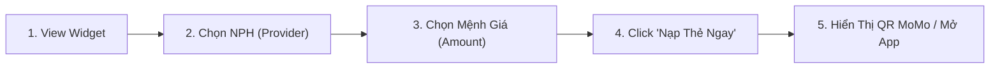

| Bước | Tên Giai Đoạn | Trải Nghiệm Người Dùng (UX) | Hạ Tầng / Cơ Chế Kỹ Thuật | Nền Tảng |
| :--- | :--- | :--- | :--- | :--- |
| 1 | Discovery | Người dùng nhìn thấy widget mua thẻ game trên trang | Tải DOM & Render component | Web |
| 2 | Configuration | Click chọn logo nhà phát hành (Zing, Garena...) | Cập nhật local state provider | Web |
| 3 | Amount Selection | Click chọn mệnh giá thẻ (10K, 20K, 50K...) | Cập nhật local state amount | Web |
| 4 | Purchase Intent | Click nút "Nạp Thẻ Ngay" (CTA) | Tạo link OneLink W2A có `?wui=` | Web |
| 5 | Conversion | Hiển thị mã QR thanh toán hoặc điều hướng mở App | Cổng thanh toán Native QR / OneLink | Web sang App |

#### 3. Cách Track & Event Name

| Event Name | Action | Payload Chuẩn (`umami data`) | Khi Nào Bắn Event? |
| :--- | :--- | :--- | :--- |
| `web_game_card_topup_form_view` | `view` | `{ page_name: "nap_the_game", form_name: "game_card_widget" }` | Khi widget render thành công trên viewport |
| `web_game_card_topup_provider_select` | `select` | `{ page_name: "nap_the_game", provider: "zing" }` | Khi click chọn nhà phát hành game |
| `web_game_card_topup_amount_select` | `select` | `{ page_name: "nap_the_game", provider: "zing", amount: 10000 }` | Khi click chọn mệnh giá |
| `web_game_card_topup_btn_click` | `click` | `{ page_name: "nap_the_game", button_name: "nap_the_ngay", provider: "zing", amount: 10000, click_url: "https://onelink.momo.vn/..." }` | Khi click nút "Nạp Thẻ Ngay" |
| `web_game_card_topup_qr_native_display` | `display` | `{ page_name: "nap_the_game", provider: "zing", amount: 10000, order_id: "ORD_123" }` | Khi popup QR MoMo hiển thị |

---

### TOOL 2: TÍNH LƯƠNG GROSS SANG NET (`gross_net_calculator`)

#### 1. Mô Tả Tool & Job-To-Be-Done (JTBD)
* **Mô tả:** Công cụ mô phỏng quy đổi lương Gross sang Net (và ngược lại) theo quy định mới nhất về Bảo hiểm xã hội và Thuế thu nhập cá nhân.
* **JTBD:** Khi nhận đề nghị mức lương mới hoặc chuẩn bị đàm phán lương, tôi muốn biết chính xác số tiền thực nhận sau khi trừ các khoản bảo hiểm và thuế TNCN để ra quyết định nhận việc hoặc cân đối chi tiêu cá nhân.

#### 2. User Flow & Điểm Chạm Tracking

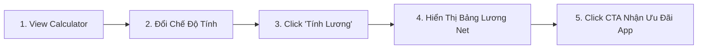

| Bước | Tên Giai Đoạn | Trải Nghiệm Người Dùng (UX) | Hạ Tầng / Cơ Chế Kỹ Thuật | Nền Tảng |
| :--- | :--- | :--- | :--- | :--- |
| 1 | Discovery | Nhìn thấy form tính lương trên trang tài chính | Render salary calculator component | Web |
| 2 | Mode Switch | Chuyển tab giữa Gross -> Net và Net -> Gross | Switch tab local state | Web |
| 3 | Execution | Nhập thông số và click nút "Tính Lương" | Client-side computation logic | Web |
| 4 | Result Display | Màn hình hiển thị bảng phân rã chi tiết thu nhập | Render result breakdown card | Web |
| 5 | Conversion | Click nút CTA mở App nhận gói quản lý tài chính | Điều hướng OneLink W2A | Web sang App |

#### 3. Cách Track & Event Name

| Event Name | Action | Payload Chuẩn (`umami data`) | Khi Nào Bắn Event? |
| :--- | :--- | :--- | :--- |
| `web_gross_net_calculator_form_view` | `view` | `{ page_name: "tinh_luong", form_name: "salary_calc_form" }` | Tải xong giao diện công cụ tính lương |
| `web_gross_net_calculator_tab_select` | `select` | `{ page_name: "tinh_luong", tab_name: "gross_to_net" }` | Click chuyển đổi chế độ tính |
| `web_gross_net_calculator_form_submit` | `submit` | `{ page_name: "tinh_luong", form_name: "salary_calc_form", region: "1", dependents_count: 1 }` | Click nút "Tính Lương" |
| `web_gross_net_calculator_result_card_display` | `display` | `{ page_name: "tinh_luong", result_status: "success", salary_range: "20m_30m" }` | Bảng phân rã lương hiển thị |
| `web_gross_net_calculator_btn_click` | `click` | `{ page_name: "tinh_luong", button_name: "cta_open_momo_finance", click_url: "https://onelink.momo.vn/..." }` | Click nút CTA chuyển đổi sang App |

---

### TOOL 3: PHÂN BỔ THU NHẬP 50/30/20 (`salary_allocation_calculator`)

#### 1. Mô Tả Tool & Job-To-Be-Done (JTBD)
* **Mô tả:** Công cụ hỗ trợ chia thu nhập hàng tháng theo quy tắc 50% Thiết yếu, 30% Linh hoạt, 20% Tích lũy.
* **JTBD:** Khi nhận lương hàng tháng, tôi muốn chia nhanh số tiền thành các khoản chi tiêu và tiết kiệm hợp lý để tránh chi tiêu quá tay và duy trì kỷ luật tài chính cá nhân.

#### 2. User Flow & Điểm Chạm Tracking

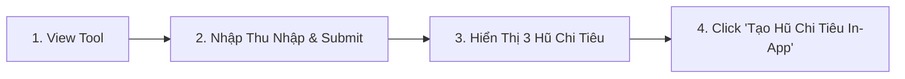

| Bước | Tên Giai Đoạn | Trải Nghiệm Người Dùng (UX) | Hạ Tầng / Cơ Chế Kỹ Thuật | Nền Tảng |
| :--- | :--- | :--- | :--- | :--- |
| 1 | Discovery | Người dùng nhìn thấy box phân bổ ngân sách 50/30/20 | Render budget component | Web |
| 2 | Execution | Nhập tổng thu nhập và bấm "Phân Bổ Ngay" | Tính toán phân bổ 3 quỹ | Web |
| 3 | Result Display | Hiển thị biểu đồ tròn và hạn mức của từng hũ tiền | Render pie chart & detail cards | Web |
| 4 | Conversion | Click nút "Tạo Hũ Chi Tiêu Trên MoMo" (CTA) | Điều hướng OneLink sang tính năng Hũ Chi Tiêu | Web sang App |

#### 3. Cách Track & Event Name

| Event Name | Action | Payload Chuẩn (`umami data`) | Khi Nào Bắn Event? |
| :--- | :--- | :--- | :--- |
| `web_salary_allocation_calculator_form_view` | `view` | `{ page_name: "phan_bo_luong", form_name: "budget_rule_form" }` | Tải xong giao diện |
| `web_salary_allocation_calculator_form_submit` | `submit` | `{ page_name: "phan_bo_luong", form_name: "budget_rule_form", form_status: "success" }` | Bấm nút "Phân Bổ Ngay" |
| `web_salary_allocation_calculator_result_card_display` | `display` | `{ page_name: "phan_bo_luong", result_status: "success", income_range: "15m_25m" }` | Hiển thị kết quả biểu đồ phân bổ |
| `web_salary_allocation_calculator_btn_click` | `click` | `{ page_name: "phan_bo_luong", button_name: "create_spending_pot", click_url: "https://onelink.momo.vn/..." }` | Bấm nút tạo hũ trên App MoMo |

---

### TOOL 4: TRA CỨU PHẠT NGUỘI GIAO THÔNG (`traffic_fine_lookup`)

#### 1. Mô Tả Tool & Job-To-Be-Done (JTBD)
* **Mô tả:** Công cụ tra cứu trực tiếp vi phạm giao thông toàn quốc từ hệ thống camera giám sát của Cục Cảnh sát giao thông.
* **JTBD:** Khi nghi ngờ phương tiện bị ghi hình vi phạm hoặc chuẩn bị đi đăng kiểm xe, tôi muốn tra cứu biển số xe xem có lỗi phạt nguội chưa nộp phạt hay không để chủ động xử lý kịp thời.

#### 2. User Flow & Điểm Chạm Tracking

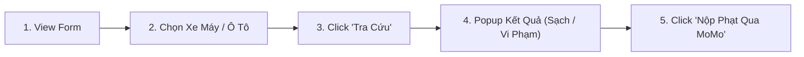

| Bước | Tên Giai Đoạn | Trải Nghiệm Người Dùng (UX) | Hạ Tầng / Cơ Chế Kỹ Thuật | Nền Tảng |
| :--- | :--- | :--- | :--- | :--- |
| 1 | Discovery | Nhìn thấy form tra cứu phạt nguội | Render fine lookup form | Web |
| 2 | Selection | Chọn loại phương tiện (Ô tô hoặc Xe máy) | Switch vehicle type state | Web |
| 3 | Execution | Nhập biển số và bấm "Tra cứu vi phạm" | Gọi API Backend Cổng CSGT | Web |
| 4 | Result Display | Popup kết quả: Xe không vi phạm HOẶC danh sách lỗi | Render modal kết quả tra cứu | Web |
| 5 | Conversion | Click nút "Nộp Phạt Trực Tuyến Qua MoMo" | Điều hướng OneLink W2A sang dịch vụ Nộp phạt | Web sang App |

#### 3. Cách Track & Event Name

| Event Name | Action | Payload Chuẩn (`umami data`) | Khi Nào Bắn Event? |
| :--- | :--- | :--- | :--- |
| `web_traffic_fine_lookup_form_view` | `view` | `{ page_name: "phat_nguoi", form_name: "traffic_fine_form" }` | Tải xong giao diện |
| `web_traffic_fine_lookup_tab_select` | `select` | `{ page_name: "phat_nguoi", vehicle_type: "car" }` | Click chọn loại xe (`car` / `motorcycle`) |
| `web_traffic_fine_lookup_form_submit` | `submit` | `{ page_name: "phat_nguoi", form_name: "traffic_fine_form", vehicle_type: "car" }` | Click nút "Tra cứu vi phạm" |
| `web_traffic_fine_lookup_popup_display` | `display` | `{ page_name: "phat_nguoi", popup_name: "fine_result", popup_value: "clean" }` | Popup hiển thị kết quả xe sạch |
| `web_traffic_fine_lookup_popup_display` | `display` | `{ page_name: "phat_nguoi", popup_name: "fine_result", popup_value: "violation", violation_count: 2 }` | Popup hiển thị có lỗi vi phạm |
| `web_traffic_fine_lookup_btn_click` | `click` | `{ page_name: "phat_nguoi", button_name: "pay_fine_in_app", click_url: "https://onelink.momo.vn/..." }` | Bấm nút nộp phạt qua App MoMo |

---

### TOOL 5: TRA CỨU GIÁ XĂNG DẦU HÔM NAY (`fuel_price_lookup`)

#### 1. Mô Tả Tool & Job-To-Be-Done (JTBD)
* **Mô tả:** Bảng cập nhật giá xăng RON 95-III, E5 RON 92, Dầu Diesel theo kỳ điều hành mới nhất của Liên Bộ Công Thương - Tài Chính.
* **JTBD:** Khi nghe tin điều chỉnh giá xăng dầu, tôi muốn xem ngay bảng giá xăng mới nhất theo từng vùng để nắm bắt biến động chi phí sinh hoạt.

#### 2. User Flow & Điểm Chạm Tracking

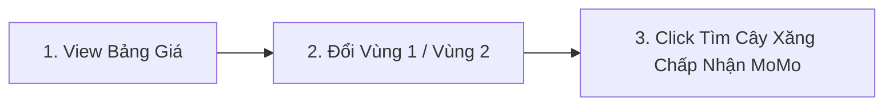

| Bước | Tên Giai Đoạn | Trải Nghiệm Người Dùng (UX) | Hạ Tầng / Cơ Chế Kỹ Thuật | Nền Tảng |
| :--- | :--- | :--- | :--- | :--- |
| 1 | Discovery | Xem bảng giá xăng dầu cập nhật theo thời gian thực | Render fuel price table | Web |
| 2 | Selection | Click tab đổi giữa Vùng 1 và Vùng 2 | Filter data theo vùng Petrolimex | Web |
| 3 | Conversion | Click nút "Tìm Cây Xăng Đổ Xăng Thanh Toán MoMo" | Điều hướng sang Map / OneLink | Web sang App |

#### 3. Cách Track & Event Name

| Event Name | Action | Payload Chuẩn (`umami data`) | Khi Nào Bắn Event? |
| :--- | :--- | :--- | :--- |
| `web_fuel_price_lookup_result_card_view` | `view` | `{ page_name: "gia_xang", provider: "petrolimex" }` | Hiển thị bảng giá xăng thành công |
| `web_fuel_price_lookup_tab_select` | `select` | `{ page_name: "gia_xang", fuel_zone: "zone_1" }` | Click chuyển đổi Vùng 1 / Vùng 2 |
| `web_fuel_price_lookup_btn_click` | `click` | `{ page_name: "gia_xang", button_name: "find_gas_station_momo", click_url: "https://onelink.momo.vn/..." }` | Bấm nút tìm trạm xăng đổ qua MoMo |

---

### TOOL 6: TRA CỨU THỜI HẠN THẺ BẢO HIỂM Y TẾ (`bhyt_lookup`)

#### 1. Mô Tả Tool & Job-To-Be-Done (JTBD)
* **Mô tả:** Công cụ tra cứu thông tin giá trị sử dụng của thẻ BHYT và ngày hết hạn từ cổng dữ liệu Bảo hiểm Xã hội Việt Nam.
* **JTBD:** Khi đi khám chữa bệnh hoặc lo lắng thẻ BHYT hết hiệu lực, tôi muốn kiểm tra nhanh ngày hết hạn thẻ để chủ động gia hạn kịp thời tránh gián đoạn quyền lợi bảo hiểm 5 năm liên tục.

#### 2. User Flow & Điểm Chạm Tracking

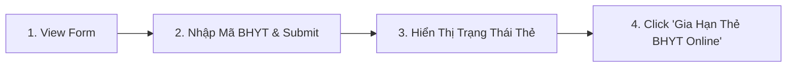

| Bước | Tên Giai Đoạn | Trải Nghiệm Người Dùng (UX) | Hạ Tầng / Cơ Chế Kỹ Thuật | Nền Tảng |
| :--- | :--- | :--- | :--- | :--- |
| 1 | Discovery | Người dùng nhìn thấy form tra cứu BHYT | Render BHYT form | Web |
| 2 | Execution | Nhập mã BHYT/CCCD và bấm "Tra cứu" | Gọi API xác thực BHXH | Web |
| 3 | Result Display | Hiển thị kết quả: Còn hạn / Sắp hết hạn / Đã hết hạn | Render result status modal | Web |
| 4 | Conversion | Click nút "Gia Hạn Ngay Qua MoMo" | Mở cổng thanh toán BHYT Native/OneLink | Web sang App |

#### 3. Cách Track & Event Name

| Event Name | Action | Payload Chuẩn (`umami data`) | Khi Nào Bắn Event? |
| :--- | :--- | :--- | :--- |
| `web_bhyt_lookup_form_view` | `view` | `{ page_name: "bhyt", form_name: "bhyt_lookup_form" }` | Tải xong giao diện |
| `web_bhyt_lookup_form_submit` | `submit` | `{ page_name: "bhyt", form_name: "bhyt_lookup_form", form_status: "success" }` | Bấm nút "Tra cứu thẻ" |
| `web_bhyt_lookup_popup_display` | `display` | `{ page_name: "bhyt", popup_name: "bhyt_result", popup_value: "expiring_soon" }` | Hiển thị kết quả sắp hết hạn |
| `web_bhyt_lookup_btn_click` | `click` | `{ page_name: "bhyt", button_name: "renew_bhyt_now", click_url: "https://onelink.momo.vn/..." }` | Bấm nút Gia hạn thẻ qua MoMo |

---

### TOOL 7: BẢNG TỶ GIÁ NGOẠI TỆ THỜI GIAN THỰC (`exchange_rate_lookup`)

#### 1. Mô Tả Tool & Job-To-Be-Done (JTBD)
* **Mô tả:** Công cụ quy đổi tỷ giá tiền tệ trực tiếp giữa VND và các ngoại tệ phổ biến (USD, EUR, JPY, KRW...) theo dữ liệu ngân hàng.
* **JTBD:** Khi chuẩn bị đi du lịch, mua hàng quốc tế hoặc gửi kiều hối, tôi muốn kiểm tra tỷ giá quy đổi chính xác theo thời gian thực để tính toán số tiền VND cần chuẩn bị.

#### 2. User Flow & Điểm Chạm Tracking

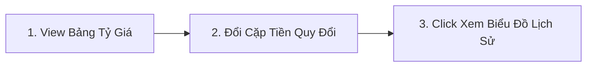

| Bước | Tên Giai Đoạn | Trải Nghiệm Người Dùng (UX) | Hạ Tầng / Cơ Chế Kỹ Thuật | Nền Tảng |
| :--- | :--- | :--- | :--- | :--- |
| 1 | Discovery | Xem bảng danh mục tỷ giá ngoại tệ hôm nay | Render FX table | Web |
| 2 | Conversion Calculation | Chọn cặp tiền tệ và nhập số tiền cần quy đổi | Tính tỷ giá chéo client-side | Web |
| 3 | Deep-dive Intent | Click xem biến động tỷ giá 30 ngày qua | Render historical chart | Web |

#### 3. Cách Track & Event Name

| Event Name | Action | Payload Chuẩn (`umami data`) | Khi Nào Bắn Event? |
| :--- | :--- | :--- | :--- |
| `web_exchange_rate_lookup_form_view` | `view` | `{ page_name: "ty_gia", form_name: "fx_converter_form" }` | Tải xong giao diện |
| `web_exchange_rate_lookup_form_submit` | `submit` | `{ page_name: "ty_gia", base_currency: "USD", target_currency: "VND" }` | Bấm quy đổi tiền tệ |
| `web_exchange_rate_lookup_result_card_display` | `display` | `{ page_name: "ty_gia", result_status: "success", base_currency: "USD" }` | Hiển thị kết quả quy đổi |
| `web_exchange_rate_lookup_btn_click` | `click` | `{ page_name: "ty_gia", button_name: "view_chart_history", click_url: "https://onelink.momo.vn/..." }` | Bấm xem biểu đồ hoặc mở App |

---

### TOOL 8: BẢNG GIÁ VÀNG SJC / PNJ TRỰC TUYẾN (`gold_price_lookup`)

#### 1. Mô Tả Tool & Job-To-Be-Done (JTBD)
* **Mô tả:** Bảng theo dõi giá vàng miếng SJC, vàng nhẫn 9999, DOJI, PNJ cập nhật liên tục theo ngày.
* **JTBD:** Khi có nhu cầu mua vàng tích trữ hoặc đầu tư, tôi muốn theo dõi biến động giá vàng mua vào - bán ra trong ngày để chọn thời điểm giao dịch tối ưu.

#### 2. User Flow & Điểm Chạm Tracking

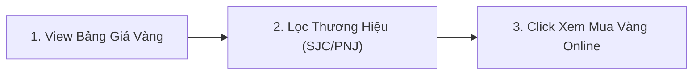

| Bước | Tên Giai Đoạn | Trải Nghiệm Người Dùng (UX) | Hạ Tầng / Cơ Chế Kỹ Thuật | Nền Tảng |
| :--- | :--- | :--- | :--- | :--- |
| 1 | Discovery | Xem bảng giá mua vào - bán ra của các loại vàng | Render gold table | Web |
| 2 | Filter | Lọc theo thương hiệu (SJC, DOJI, PNJ) hoặc loại vàng | Filter local data | Web |
| 3 | Conversion | Click nút tìm hiểu tính năng Mua vàng online trên MoMo | Điều hướng OneLink sang dịch vụ Vàng MoMo | Web sang App |

#### 3. Cách Track & Event Name

| Event Name | Action | Payload Chuẩn (`umami data`) | Khi Nào Bắn Event? |
| :--- | :--- | :--- | :--- |
| `web_gold_price_lookup_result_card_view` | `view` | `{ page_name: "gia_vang", provider: "sjc" }` | Tải bảng giá vàng thành công |
| `web_gold_price_lookup_tab_select` | `select` | `{ page_name: "gia_vang", provider: "pnj", gold_type: "nhan_24k" }` | Click đổi thương hiệu/loại vàng |
| `web_gold_price_lookup_btn_click` | `click` | `{ page_name: "gia_vang", button_name: "open_gold_saving_in_app", click_url: "https://onelink.momo.vn/..." }` | Bấm tìm hiểu mua vàng tích lũy in-app |

---

### TOOL 9: TRA CỨU ĐIỂM TÍN DỤNG & NỢ XẤU CIC (`cic_lookup`)

#### 1. Mô Tả Tool & Job-To-Be-Done (JTBD)
* **Mô tả:** Công cụ hỗ trợ người dùng kiểm tra nhanh điều kiện tín dụng và nguy cơ nợ xấu trước khi nộp hồ sơ vay vốn hoặc mở thẻ tín dụng.
* **JTBD:** Khi có kế hoạch vay ngân hàng hoặc mở thẻ tín dụng, tôi muốn kiểm tra trước lịch sử tín dụng xem mình có thuộc diện nợ xấu hay không để chủ động khắc phục.

#### 2. User Flow & Điểm Chạm Tracking

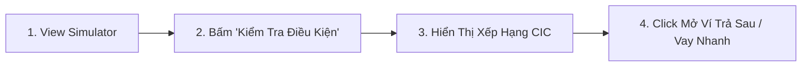

| Bước | Tên Giai Đoạn | Trải Nghiệm Người Dùng (UX) | Hạ Tầng / Cơ Chế Kỹ Thuật | Nền Tảng |
| :--- | :--- | :--- | :--- | :--- |
| 1 | Discovery | Nhìn thấy công cụ kiểm tra điều kiện tín dụng | Render credit simulator | Web |
| 2 | Execution | Điền khảo sát lịch sử trả nợ và bấm submit | Phân tích phân hạng rủi ro | Web |
| 3 | Result Display | Hiển thị nhóm tín dụng ước tính (Nhóm 1 đến Nhóm 5) | Render credit band score card | Web |
| 4 | Conversion | Click mở sản phẩm Ví Trả Sau hoặc Vay Nhanh MoMo | Điều hướng OneLink sang BU Tài chính | Web sang App |

#### 3. Cách Track & Event Name

| Event Name | Action | Payload Chuẩn (`umami data`) | Khi Nào Bắn Event? |
| :--- | :--- | :--- | :--- |
| `web_cic_lookup_form_view` | `view` | `{ page_name: "cic", form_name: "cic_simulator_form" }` | Tải xong giao diện |
| `web_cic_lookup_form_submit` | `submit` | `{ page_name: "cic", form_name: "cic_simulator_form", form_status: "success" }` | Bấm nút kiểm tra |
| `web_cic_lookup_result_card_display` | `display` | `{ page_name: "cic", credit_tier: "tier_1_good", result_status: "eligible" }` | Hiển thị kết quả điểm tín dụng |
| `web_cic_lookup_btn_click` | `click` | `{ page_name: "cic", button_name: "apply_paylater_in_app", click_url: "https://onelink.momo.vn/..." }` | Bấm mở Ví Trả Sau in-app |

---

### TOOL 10: TÌM KIẾM GARAGE & CỨU HỘ GIAO THÔNG (`garage_lookup`)

#### 1. Mô Tả Tool & Job-To-Be-Done (JTBD)
* **Mô tả:** Bản đồ và danh bạ tra cứu các điểm sửa xe, garage uy tín và số hotline cứu hộ giao thông khẩn cấp theo khu vực.
* **JTBD:** Khi xe gặp sự cố hỏng hóc giữa đường hoặc cần bảo dưỡng định kỳ, tôi muốn tìm ngay garage uy tín gần nhất và có số hotline liên hệ để được hỗ trợ kịp thời.

#### 2. User Flow & Điểm Chạm Tracking

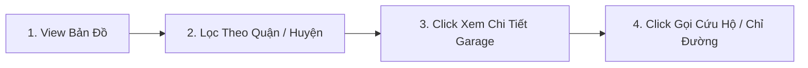

| Bước | Tên Giai Đoạn | Trải Nghiệm Người Dùng (UX) | Hạ Tầng / Cơ Chế Kỹ Thuật | Nền Tảng |
| :--- | :--- | :--- | :--- | :--- |
| 1 | Discovery | Xem danh sách garage và bản đồ cứu hộ | Render garage map & list | Web |
| 2 | Filtering | Chọn Tỉnh/Thành phố và Quận/Huyện | Filter danh sách garage theo vị trí | Web |
| 3 | Engagement | Click vào thẻ garage cụ thể để xem đánh giá | Expand garage detail view | Web |
| 4 | Action | Click gọi số hotline cứu hộ hoặc bấm xem chỉ đường | Kích hoạt tel: hoặc Google Maps | Web |

#### 3. Cách Track & Event Name

| Event Name | Action | Payload Chuẩn (`umami data`) | Khi Nào Bắn Event? |
| :--- | :--- | :--- | :--- |
| `web_garage_lookup_form_view` | `view` | `{ page_name: "garage", form_name: "garage_filter_form" }` | Tải xong giao diện |
| `web_garage_lookup_form_submit` | `submit` | `{ page_name: "garage", city: "hcm", district: "quan_1" }` | Bấm lọc theo khu vực |
| `web_garage_lookup_result_card_display` | `display` | `{ page_name: "garage", total_results: 15 }` | Hiển thị danh sách kết quả |
| `web_garage_lookup_btn_click` | `click` | `{ page_name: "garage", button_name: "call_rescue_hotline", garage_id: "gar_001" }` | Click gọi cứu hộ khẩn cấp |
| `web_garage_lookup_btn_click` | `click` | `{ page_name: "garage", button_name: "get_direction", garage_id: "gar_001" }` | Click xem chỉ đường tới garage |

---

### TOOL 11: TÍNH LÃI TIẾT KIỆM NGÂN HÀNG (`saving_interest_calculator`)

#### 1. Mô Tả Tool & Job-To-Be-Done (JTBD)
* **Mô tả:** Công cụ tính toán lãi suất tiết kiệm theo số tiền, kỳ hạn và ngân hàng; tích hợp Trợ lý MoMo AI tính toán bù đắp chênh lệch lãi ròng (Net Yield Gap) và kích hoạt phễu Web-to-App mở sổ Tiết Kiệm Online trên MoMo.
* **JTBD:** Khi có một khoản tiền nhàn rỗi, tôi muốn tính toán nhanh số tiền lãi nhận được và biết ngân hàng nào đang có lãi suất cao hơn để tối đa hóa lợi nhuận mà không tốn công đến từng quầy ngân hàng tra cứu.

#### 2. User Flow & Điểm Chạm Tracking

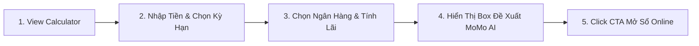

| Bước | Tên Giai Đoạn | Trải Nghiệm Người Dùng (UX) | Hạ Tầng / Cơ Chế Kỹ Thuật | Nền Tảng |
| :--- | :--- | :--- | :--- | :--- |
| 1 | Discovery | Truy cập trang tiện ích tính lãi tiết kiệm | Render calculator widget | Web |
| 2 | Input | Chọn số tiền gửi (pills/input) và kỳ hạn (1, 3, 6, 12, 24 tháng) | Client state update | Web |
| 3 | Compare | Chọn ngân hàng cụ thể và xem kết quả tính toán chi tiết | Client math calculation | Web |
| 4 | AI Recommendation | Render Box Trợ lý MoMo AI hiển thị số tiền nhận thêm (+Delta Lãi) | Net Yield Gap Recommendation Engine | Web |
| 5 | Action (W2A) | Click nút "Gửi Tiết Kiệm Nhận Thêm +X đ" mở App MoMo | OneLink deeplink router | Web-to-App |

#### 3. Cách Track & Event Name

| Event Name | Action | Payload Chuẩn (`umami data`) | Khi Nào Bắn Event? |
| :--- | :--- | :--- | :--- |
| `web_saving_calc_form_view` | `view` | `{ page_name: "tinh_lai_tiet_kiem", form_name: "saving_calc_form" }` | Tải xong giao diện |
| `web_saving_calc_amount_select` | `select` | `{ page_name: "tinh_lai_tiet_kiem", amount: 100000000 }` | Chọn số tiền gửi nhanh |
| `web_saving_calc_term_select` | `select` | `{ page_name: "tinh_lai_tiet_kiem", term: 12 }` | Chọn kỳ hạn gửi |
| `web_saving_calc_provider_select` | `select` | `{ page_name: "tinh_lai_tiet_kiem", provider: "ACB" }` | Chọn ngân hàng gửi |
| `web_saving_calc_result_card_display` | `display` | `{ page_name: "tinh_lai_tiet_kiem", diff_amount: 1000000, optimal_provider: "BVBank" }` | Hiển thị thẻ kết quả và Box MoMo AI |
| `web_saving_calc_btn_click` | `click` | `{ page_name: "tinh_lai_tiet_kiem", button_name: "open_saving_in_app", optimal_provider: "BVBank", diff_amount: 1000000, click_url: "https://onelink.momo.vn/..." }` | Click CTA mở sổ tiết kiệm trên App |

---

### TOOL 12: MINI GAME QUÝT (`game_quyt`)

#### 1. Mô Tả Tool & Job-To-Be-Done (JTBD)
* **Mô tả:** Mini game tương tác giải trí "Game Quýt" trên Web MoMo, đóng vai trò công cụ Gamification thu hút lưu lượng, gia tăng thời gian onsite (Time-on-site / Engagement) và dẫn dắt người dùng tải App / mở App MoMo để nhận quà hoặc tiếp tục lượt chơi.
* **JTBD:** Khi người dùng truy cập Web MoMo, tôi muốn trải nghiệm nhanh một trò chơi giải trí nhẹ nhàng, vui nhộn ngay trên trình duyệt mà không cần cài đặt phức tạp, từ đó có động lực tải và mở App MoMo để nhận phần thưởng thực tế hoặc mở khóa các màn chơi tiếp theo.

#### 2. User Flow & Điểm Chạm Tracking

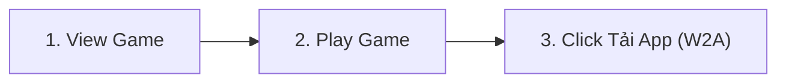

| Bước | Tên Giai Đoạn | Trải Nghiệm Người Dùng (UX) | Hạ Tầng / Cơ Chế Kỹ Thuật | Nền Tảng |
| :--- | :--- | :--- | :--- | :--- |
| 1 | Discovery | Truy cập trang và nhìn thấy màn hình giới thiệu / giao diện Game Quýt | Tải DOM & Render game canvas/container | Web |
| 2 | Engagement | Click nút "Chơi Ngay" và bắt đầu lượt tương tác game | Khởi tạo game loop / update local state | Web |
| 3 | Conversion | Click nút "Tải App MoMo" / "Mở App Nhận Quà" (CTA W2A) | Router điều hướng OneLink kèm tham số `wui` | Web sang App |

#### 3. Cách Track & Event Name

| Event Name | Action | Payload Chuẩn (`umami data`) | Khi Nào Bắn Event? |
| :--- | :--- | :--- | :--- |
| `web_game_quyt_game_view` | `view` | `{ page_name: "game_quyt", game_name: "quyt", form_name: "game_quyt_container" }` | Khi giao diện game tải xong và hiển thị trên màn hình |
| `web_game_quyt_play_btn_click` | `click` | `{ page_name: "game_quyt", button_name: "play_now", game_name: "quyt" }` | Khi click nút "Chơi ngay" bắt đầu lượt chơi |
| `web_game_quyt_btn_click` | `click` | `{ page_name: "game_quyt", button_name: "download_app", game_name: "quyt", click_url: "https://onelink.momo.vn/...", auth_status: "anonymous" }` | Khi click nút "Tải App" / "Mở App Nhận Quà" dẫn sang OneLink |

*(Tùy chọn bổ sung nếu game có màn kết thúc tính điểm:)*
* `web_game_quyt_result_card_display` (Action: `display`): Bắn khi người dùng kết thúc lượt chơi với payload `{ page_name: "game_quyt", score: 100, result_status: "completed" }`.

---

## 3. CHECKLIST NGHIỆM THU DÀNH CHO KỸ SƯ (SIGN-OFF CHECKLIST)

Trước khi gửi pull request hoặc đưa công cụ lên môi trường Production, Kỹ sư Frontend bắt buộc phải tự kiểm tra 4 tiêu chí sau:

1. **Tuân Thủ MoSpark Tool ID (Registry Match):** Mã `[mospark_tool_id]` trong event name có khớp chính xác 1-1 với mã được setup trong MoSpark Registry hay không? (Ví dụ: dùng đúng `cic_lookup`, không tự đặt thành `credit_score` hay `cic_test`).
2. **Không Rò Rỉ PII (Zero-PII Audit):** Mở tab Network của trình duyệt (F12), gõ lọc `api/send` của Umami. Đảm bảo trong phần `eventData` không chứa bất kỳ chuỗi ký tự nào là CCCD, Họ tên, SĐT hay Mức lương thật của người dùng.
3. **Độ Bền Vững W2A (OneLink Attribution):** Mọi sự kiện nút bấm CTA mở App (`web_[mospark_tool_id]_btn_click`) bắt buộc phải gửi thuộc tính `click_url` chứa link OneLink hoàn chỉnh kèm tham số `wui` của phiên làm việc.
4. **Không Bắn Event Rác (No Flooding):** Kiểm tra xem thao tác gõ phím trên ô input hoặc lướt chuột trên màn hình có vô tình kích hoạt request Umami nào hay không. Nếu có, phải gỡ bỏ ngay lập tức.
